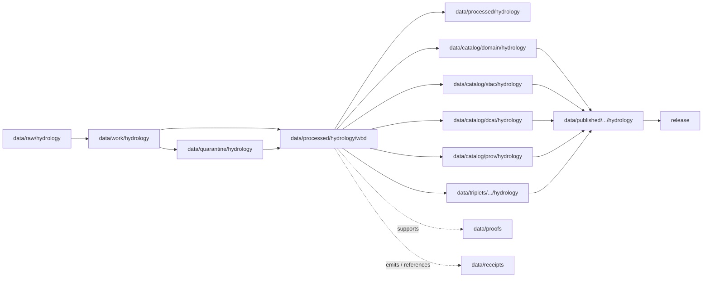

<!-- [KFM_META_BLOCK_V2]
doc_id: kfm://doc/data-processed-hydrology-wbd-readme
title: data/processed/hydrology/wbd/README.md — Hydrology WBD Processed Data README
version: v0.1
type: readme; data-lifecycle-sublane; processed-stage-guide; hydrology-domain-lane; wbd-lane; huc-unit-lane; watershed-boundary-lane
status: draft; PROPOSED; data-root; processed-stage; hydrology; wbd; huc; watershed; authority-source; watershed-boundary-dataset; source-role-aware; vintage-aware; evidence-first; release-gated
authors: ChatGPT-5.5 Thinking; reviewed_by: OWNER_TBD
owners: OWNER_TBD — Hydrology steward · Watershed/HUC steward · Source-role steward · Data steward · Pipeline steward · Evidence steward · Policy steward · Release steward · Docs steward
created: NEEDS VERIFICATION — blank placeholder existed before v0.1 expansion
updated: 2026-06-25
policy_label: public-doc; data; processed; hydrology; WBD; HUC; watershed; lifecycle; governed; source-role-aware; vintage-aware; release-gated
tags: [kfm, data, processed, hydrology, wbd, watershed-boundary-dataset, watershed, HUCUnit, HUC, HUC2, HUC4, HUC6, HUC8, HUC10, HUC12, drainage-area, watershed-boundary, authority, source-role, EXT-WBD, SourceDescriptor, EvidenceBundle, ValidationReport, PolicyDecision, ReleaseManifest, RollbackCard, RAW, WORK, QUARANTINE, PROCESSED, CATALOG, TRIPLET, PUBLISHED]
related:
  - ../README.md
  - ../../README.md
  - ../../../README.md
  - ../../../../docs/domains/hydrology/README.md
  - ../../../../docs/domains/hydrology/PUBLICATION_POSTURE.md
  - ../../../../docs/domains/hazards/README.md
  - ../../../../docs/domains/soil/README.md
  - ../../../../docs/domains/agriculture/README.md
  - ../../../../docs/domains/habitat/README.md
  - ../../../../docs/domains/fauna/README.md
  - ../../../../docs/domains/flora/README.md
  - ../../../../policy/domains/hydrology/
  - ../../../../contracts/domains/hydrology/
  - ../../../../schemas/contracts/v1/domains/hydrology/
  - ../../../raw/hydrology/
  - ../../../work/hydrology/
  - ../../../quarantine/hydrology/
  - ../../../catalog/domain/hydrology/
  - ../../../catalog/stac/hydrology/
  - ../../../catalog/dcat/hydrology/
  - ../../../catalog/prov/hydrology/
  - ../../../triplets/
  - ../../../published/
  - ../../../proofs/
  - ../../../receipts/
  - ../../../registry/sources/hydrology/
  - ../../../../release/candidates/hydrology/
  - ../../../../release/
  - ../../../../pipelines/domains/hydrology/
  - ../../../../pipeline_specs/hydrology/
  - ../../../../tools/validators/
notes:
  - "This file replaces a blank placeholder at `data/processed/hydrology/wbd/README.md`."
  - "This is a child PROCESSED-stage lane under `data/processed/hydrology/` for Watershed Boundary Dataset / HUC / watershed-boundary artifacts. It is not a RAW source root, WORK scratch area, QUARANTINE bypass, CATALOG, TRIPLET, PUBLISHED, proof store, receipt store, source registry, policy authority, release authority, public API/UI output, public map/tile output, flood-warning surface, or life-safety guidance."
  - "WBD/HUC artifacts are authority-style watershed geography and aggregation anchors. They are not gauge observations, observed flooding, NFHL regulatory flood zones, hydrograph models, emergency warnings, or property/rights determinations."
  - "Hydrology source roles must remain explicit. WBD/HUC is typically authority geography, while per-claim source role is set at admission and never upgraded by promotion."
  - "WBD/HUC vintage, HUC digit level, boundary version, geometry validity, topology, source role, evidence linkage, validation state, catalog readiness, release state, correction path, and rollback target must remain visible before public use."
  - "This README is a lane guide only. Contracts define semantic object meaning; schemas define machine shape; policy decides admissibility; release records decide publication."
  - "Rollback target for this expansion is previous blank placeholder blob SHA `8b137891791fe96927ad78e64b0aad7bded08bdc`."
[/KFM_META_BLOCK_V2] -->

<a id="top"></a>

# data/processed/hydrology/wbd

> Hydrology PROCESSED-stage child lane for normalized Watershed Boundary Dataset-style watershed and HUC artifacts: WBD/HUC boundary polygons, HUC identity tables, boundary vintages, watershed hierarchy, topology/context sidecars, and authority-source watershed anchors that support hydrology analysis but are not cataloged, triplet-projected, published, or released by this directory alone.

<p>
  
  
  
  
  
  
</p>

**Status:** draft / PROPOSED  
**Owners:** OWNER_TBD — Hydrology steward · Watershed/HUC steward · Source-role steward · Data steward · Pipeline steward · Evidence steward · Policy steward · Release steward · Docs steward  
**Path:** `data/processed/hydrology/wbd/README.md`  
**Owning root:** `data/processed/`  
**Domain segment:** `hydrology`  
**Parent lane:** `data/processed/hydrology/`  
**Sublane:** `wbd` / Watershed Boundary Dataset and HUC-unit processed artifacts  
**Lifecycle stage:** `PROCESSED`  
**Exposure posture:** not public by default; any public use requires governed catalog, EvidenceBundle, source-role and rights posture, version/vintage disclosure, ValidationReport, PolicyDecision where applicable, ReleaseManifest, correction path, and rollback target.  
**Truth posture:** CONFIRMED target was a blank placeholder · CONFIRMED parent `data/processed/` is upstream of catalog/triplet/publication and is not a normal public surface · CONFIRMED Hydrology owns watersheds and HUC units · CONFIRMED WBD/HUC12 is a named hydrology source family with authority geography role and snapshot-vintage handling · CONFIRMED parent `data/processed/hydrology/README.md` is still a greenfield stub · PROPOSED WBD child-lane details · NEEDS VERIFICATION for actual child inventory, schemas, validators, fixtures, source descriptors, receipt families, policy enforcement, release linkage, and governed route behavior.

**Quick jumps:** [Purpose](#purpose) · [Lifecycle boundary](#lifecycle-boundary) · [Repo fit](#repo-fit) · [Accepted contents](#accepted-contents) · [Exclusions](#exclusions) · [WBD processed requirements](#wbd-processed-requirements) · [Source-role and watershed guardrails](#source-role-and-watershed-guardrails) · [Directory map](#directory-map) · [Evidence ledger](#evidence-ledger) · [Validation checklist](#validation-checklist) · [Rollback](#rollback)

---

## Purpose

`data/processed/hydrology/wbd/` holds processed WBD/HUC artifacts for the Hydrology lane. These artifacts provide watershed identity, drainage-area boundaries, HUC hierarchy, and aggregation anchors used by hydrology, hazards, soil, habitat, agriculture, and Frontier Matrix analyses.

This lane may contain or point to normalized artifacts such as:

- Watershed Boundary Dataset / HUC boundary polygon derivatives;
- HUC identity tables by declared HUC digit level;
- HUC2/HUC4/HUC6/HUC8/HUC10/HUC12 hierarchy and crosswalk products;
- watershed boundary vintages and source-version sidecars;
- geometry-validity, topology, adjacency, containment, and dissolve summaries;
- WBD-derived aggregation anchors for water, drought, soil, habitat, and hazard context;
- public-candidate generalized watershed overlays that still require catalog and release review.

This lane does not make a gauge observation, water-level observation, water-quality observation, flood warning, observed inundation, NFHL regulatory claim, hydrograph model, water-rights claim, property-rights claim, or life-safety statement by itself.

## Lifecycle boundary

```text
RAW -> WORK / QUARANTINE -> PROCESSED -> CATALOG / TRIPLET -> PUBLISHED
```



`data/processed/hydrology/wbd/` is upstream of catalog, triplet, publication, and release. It must not be used as a normal public map/API/UI/AI source.

## Repo fit

| Responsibility | Correct home | Rule |
|---|---|---|
| Raw WBD downloads, source-native geodatabases, source shapefiles, source API responses, agency exports, source logs, original geometries, or source identifiers | `data/raw/hydrology/` | Not this lane. |
| In-process geometry repair, HUC hierarchy reconciliation, dissolve/simplify experiments, topology QA, joins, notebooks, or scratch products | `data/work/hydrology/` | Not this lane. |
| Unresolved source role, rights uncertainty, malformed geometry, disputed HUC identity, topology failure, unsafe joins, or not-yet-reviewed hydrology material | `data/quarantine/hydrology/` | Not this lane until review/admission allows. |
| Processed WBD/HUC watershed artifacts | `data/processed/hydrology/wbd/` | This lane. |
| Parent processed Hydrology lane | `data/processed/hydrology/` | Parent lane; still not public by default. |
| Hydrology catalog records | `data/catalog/domain/hydrology/` | Downstream catalog stage. |
| Hydrology STAC/DCAT/PROV records | `data/catalog/{stac,dcat,prov}/hydrology/` | Downstream catalog projections if accepted. |
| Hydrology triplet/graph records | `data/triplets/.../hydrology/` | Downstream graph stage; must not expose role-collapsed claims or unsafe joins. |
| Published public-safe Hydrology products | `data/published/.../hydrology` or `data/published/layers/hydrology/` | Downstream only after release. |
| EvidenceBundle/proof records | `data/proofs/` | Separate proof family. |
| Source, run, transform, validation, policy, correction, access, and release receipts | `data/receipts/` | Separate receipt family. |
| Hydrology source registry records | `data/registry/sources/hydrology/` | Separate source authority. |
| Release candidates and release manifests | `release/candidates/hydrology/`, `release/` | Separate publication authority. |
| Hydrology contracts | `contracts/domains/hydrology/` | Object meaning; not data. |
| Hydrology schemas | `schemas/contracts/v1/domains/hydrology/` | Machine shape; not data. |
| Hydrology policy and sensitivity rules | `policy/domains/hydrology/` | Admissibility authority; not data. |
| Validators, tests, fixtures, pipelines, pipeline specs, apps, packages | `tools/validators/`, `tests/`, `fixtures/`, `pipelines/`, `pipeline_specs/`, `apps/`, `packages/` | Separate roots. |

## Accepted contents

Processed WBD/HUC artifacts may include:

- normalized `Watershed` and `HUCUnit` records with source, role, rights, HUC digit level, WBD vintage, geometry version, validation state, and digest posture;
- WBD/HUC polygon derivatives that remain upstream of catalog/release;
- HUC hierarchy, parent/child, containment, adjacency, and crosswalk tables;
- geometry-validity, topology, boundary-version, source-vintage, simplification, or generalization sidecars needed to interpret processed products;
- HUC-indexed aggregation anchors for gauge observations, drought indicators, water-quality summaries, soil/habitat context, flood context, and watershed timelines when ownership and source-role boundaries remain visible;
- review-ready public-safe watershed map candidates where source rights, vintage, and policy posture are explicit;
- lane-local README or manifest notes that explain processed-data boundaries without becoming public outputs or authority records.

## Exclusions

Do not store these under `data/processed/hydrology/wbd/`:

- RAW source WBD files, source-native downloads, steward originals, source media, logs, original source geometries, source identifiers, or unprocessed agency exports.
- WORK/scratch files, notebooks, geometry-repair trials, topology experiments, dissolve/simplification trials, unresolved QA joins, or transform-debug outputs.
- Quarantined or unresolved sensitive/rights/source-role/topology material.
- Catalog records, STAC/DCAT/PROV records, triplet/graph records, published products, proof records, receipt records, source registry records, release decisions, schemas, policy rules, validators, tests, fixtures, pipelines, pipeline specs, app/UI/API code, or packages.
- Gauge observations, flow observations, water-level observations, water-quality observations, groundwater well records, aquifer observations, NFHL flood zones, observed flood events, hydrographs, operational warnings, emergency alerts, or life-safety guidance.
- Hydrology products that collapse WBD authority geography into observed flooding, modeled hydrographs, regulatory NFHL, per-place drought truth, water rights, property rights, or emergency status.
- Public API/UI/tile payloads, direct downloads, Focus Mode answers, public map layers, emergency-warning products, landowner/parcel targeting aids, legal advice, engineering certification, operational water-management instruction, or life-safety products.
- Redaction parameters, aggregation thresholds, small-cell thresholds, fuzzing radii, seeds, exact transform offsets, access credentials, secrets, private agreement terms, sensitive infrastructure details, or implementation details that could aid exposure or unauthorized access.

## WBD processed requirements

PROPOSED until concrete validators, policies, fixtures, receipts, and access-control enforcement are verified:

| Requirement | Meaning |
|---|---|
| Source trace | Each source-derived artifact should trace to SourceDescriptor or hydrology source registry context, especially `EXT-WBD` where accepted. |
| Evidence linkage | Claims about watershed identity, HUC code, HUC digit level, boundary, vintage, topology, transform, review, or release readiness should resolve downstream to EvidenceBundle/proof context where appropriate. |
| Source role | Authority, observation, regulatory/context, model, aggregate, administrative, candidate, and synthetic roles must remain explicit and not interchangeable. |
| HUC identity | HUC code, HUC digit level, name where available, parent/child relation, source vintage, geometry version, and normalized digest should remain auditable. |
| Geometry and topology | Polygon validity, CRS, boundary normalization, simplification/generalization, containment, adjacency, area, and hierarchy checks should be recorded or receipt-linked. |
| Time semantics | Source time, valid time, retrieval time, WBD snapshot/vintage time, correction time, and release time should remain distinguishable where material. |
| Rights posture | Agency, steward, license, redistribution, attribution, derivative-use, and source terms should be resolved or held closed. |
| Sensitivity posture | Joins to wells, infrastructure, rare ecology, private parcels, drought/agriculture summaries, or small-cell outputs should carry restriction/generalization/denial posture where needed. |
| Transform linkage | Reprojection, simplification, generalization, aggregation, redaction, suppression, withholding, or public-safe geometry transform should link to appropriate receipt families. |
| Review state | Hydrology steward, WBD steward, source-role reviewer, data-quality reviewer, and release authority review should be recorded where required. |
| Policy decision | Restricted, public-candidate, and public transitions require PolicyDecision/admissibility posture where policy requires it. |
| Catalog readiness | Processed WBD/HUC artifacts intended for discovery should promote through catalog/triplet lanes, not directly to public use. |
| Release readiness | Public use requires ReleaseManifest or release-linked state, published output path, correction path, and rollback target. |
| No public surface by default | Processed WBD/HUC artifacts must not be exposed directly as public maps, tiles, APIs, downloads, Focus Mode answers, or AI-answer sources. |

## Source-role and watershed guardrails

- WBD/HUC is authority watershed geography, not an observed water event.
- `Watershed` and `HUCUnit` are aggregation and identity anchors, not gauge observations, observed flooding, NFHL flood zones, hydrographs, emergency warnings, or water-rights determinations.
- HUC rollups are aggregate context; they are not per-place truth unless the contract, evidence, scale, and policy posture support that claim.
- NFHL remains regulatory flood context and must never be relabeled as WBD/HUC or observed flooding.
- USGS gauge readings and water-quality observations remain observation records and must not be collapsed into watershed boundary truth.
- Modeled hydrographs and reconstructed flows remain modeled products with model-run receipts and must not be relabeled as observations.
- Operational flood warnings or watches are not KFM life-safety authority.
- Hydrology may join to Hazards, Soil, Agriculture, Settlements/Infrastructure, Habitat, Fauna, Flora, and Frontier Matrix only through governed relationships that preserve ownership, source role, sensitivity, and EvidenceBundle support.
- Unclear rights, unresolved source role, missing evidence, unresolved topology, unresolved sensitivity, or absent release state blocks public promotion.
- Public clients and Focus Mode must use governed APIs, released artifacts, catalog/triplet records, EvidenceBundle-backed payloads, and policy-safe envelopes, not this directory directly.

> [!CAUTION]
> Do not expose `data/processed/hydrology/wbd/` directly as a public map, tile service, API, UI, download, Focus Mode answer, AI answer source, flood-warning surface, observed-flooding proof, NFHL regulatory substitute, water-rights claim, property-rights claim, landowner/parcel targeting aid, operational water-management instruction, emergency alert, or life-safety product. Processed WBD/HUC data remains inside the trust membrane until governed promotion and release.

## Directory map

Actual child inventory remains **NEEDS VERIFICATION**. Use this as a proposed local organization pattern only after confirming current repo convention and validators.

```text
data/processed/hydrology/wbd/
├── README.md
├── huc_units/                # PROPOSED — normalized HUCUnit records
├── watershed_boundaries/     # PROPOSED — processed watershed/HUC boundary polygons
├── hierarchy/                # PROPOSED — parent/child HUC hierarchy tables
├── topology/                 # PROPOSED — containment/adjacency/topology summaries
├── crosswalks/               # PROPOSED — source/classification/vintage crosswalks
├── vintages/                 # PROPOSED — WBD snapshot/source-vintage sidecars
├── generalized/              # PROPOSED — public-candidate generalized derivatives
├── validation/               # PROPOSED — lane-local validation notes, not ValidationReport authority
├── joins/                    # PROPOSED — reviewed context joins only, not gauge/flood/soil/ag/hazard truth
├── _manifests/               # PROPOSED — lane-local non-release manifests only
└── _README_TODO.md           # PROPOSED — remove after actual child inventory is documented
```

## Evidence ledger

| Source | Status | Supports | Limits |
|---|---|---|---|
| Previous file | CONFIRMED | Target existed as a blank placeholder. | Did not define WBD processed boundaries. |
| `data/processed/hydrology/README.md` | CONFIRMED | Parent Hydrology processed lane currently exists as a greenfield stub. | Does not define hydrology processed boundaries yet. |
| `data/processed/README.md` | CONFIRMED | PROCESSED data is upstream of catalog, triplets, publication, and release and is not the normal public surface. | Does not prove Hydrology child inventory or enforcement. |
| `docs/domains/hydrology/README.md` | CONFIRMED doctrine / PROPOSED implementation | Hydrology owns watersheds/HUCs; WBD/HUC12 is a source family with authority geography and snapshot-vintage handling; lifecycle, object families, source-role anti-collapse, and cross-lane constraints are defined. | Implementation maturity remains NEEDS VERIFICATION. |
| `docs/domains/hydrology/PUBLICATION_POSTURE.md` | NEEDS VERIFICATION | Named companion doc for publication posture. | This task did not inspect its contents. |
| `policy/domains/hydrology/` | NEEDS VERIFICATION | Expected admissibility home. | Current policy files and enforcement were not verified in this task. |
| `contracts/domains/hydrology/` and `schemas/contracts/v1/domains/hydrology/` | NEEDS VERIFICATION | Expected object contract/schema homes for Watershed/HUCUnit and related families. | Specific object files and validators were not verified in this task. |

## Validation checklist

- [ ] Confirm actual child directories under `data/processed/hydrology/wbd/`.
- [ ] Confirm whether `wbd/` is the accepted processed Hydrology lane name or should be reconciled with `watersheds/`, `huc/`, `huc_units/`, or another object-family naming convention.
- [ ] Confirm parent `data/processed/hydrology/README.md` is expanded beyond stub.
- [ ] Confirm `Watershed` and `HUCUnit` object contracts and schema paths.
- [ ] Confirm source-role vocabulary and anti-collapse validators for authority / observation / regulatory-context / model / aggregate / administrative / candidate / synthetic role usage.
- [ ] Confirm validators, fixtures, CI checks, policy checks, topology checks, geometry checks, vintage checks, and access-control enforcement for processed WBD/HUC artifacts.
- [ ] Confirm SourceDescriptor/source registry linkage for `EXT-WBD` and every derived WBD/HUC artifact.
- [ ] Confirm RunReceipt, TransformReceipt, ValidationReport, PolicyDecision, CorrectionNotice, ReleaseManifest, RollbackCard, correction path, and rollback target.
- [ ] Confirm unresolved role, rights-unclear source, malformed geometry, topology failure, HUC ambiguity, WBD-vintage ambiguity, unsafe joins, redaction parameters, transform secrets, release-unclear artifacts, and life-safety prompts cannot enter public routes.
- [ ] Confirm public-candidate transitions are governed, evidence-backed, source-role-safe, rights-safe, topology-safe, vintage-safe, sensitivity-safe, review-backed, release-linked, and reversible.
- [ ] Confirm no RAW, WORK, QUARANTINE, CATALOG, TRIPLET, PUBLISHED, proof, receipt, registry, release, schema, policy, validator, package, pipeline, app, API, public map, public tile, direct download, Focus Mode answer, flood warning, observed flooding claim, NFHL substitute, water-rights claim, property-rights claim, or life-safety artifact is misplaced here.
- [ ] Confirm public clients and Focus Mode cannot read this lane directly as public truth, public watershed service, public flood source, public map, public tile, public API, public UI, or AI-answer source.

## Rollback

Rollback is required if this lane becomes a RAW source-data root, WORK scratch root, QUARANTINE bypass, public output root, `data/published/` substitute, public-candidate shortcut, WBD-vintage ambiguity path, source-role collapse path, topology-error publication path, unsafe-join exposure path, transform-secret exposure path, agreement/credential exposure path, proof store, receipt store, catalog root, triplet root, source-registry root, release-decision root, schema root, policy root, validator root, implementation root, public API shortcut, public UI shortcut, public tile shortcut, public exposure shortcut, observed-flooding proof, NFHL regulatory substitute, flood-warning source, water-rights/title source, property-targeting aid, operational water-management guidance source, or life-safety guidance source.

Rollback target for this expansion: previous blank placeholder blob SHA `8b137891791fe96927ad78e64b0aad7bded08bdc`.

<p align="right"><a href="#top">Back to top</a></p>
