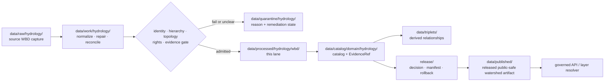

<!-- [KFM_META_BLOCK_V2]
doc_id: kfm://doc/data-processed-hydrology-wbd-readme
title: data/processed/hydrology/wbd/ — Hydrology WBD Processed Data
version: v0.2.0
type: directory-readme
subtype: processed-hydrology-wbd-huc-lane
status: repository-grounded draft; payload inventory, concrete contracts and schemas, validators, fixtures, receipts, proof, release, and runtime behavior remain bounded
owners:
  - "NEEDS VERIFICATION — Hydrology domain steward"
  - "NEEDS VERIFICATION — watershed, HUC, and topology steward"
  - "NEEDS VERIFICATION — source-role, data-quality, and spatial-foundation reviewers"
  - "NEEDS VERIFICATION — data, evidence, policy, release, correction, rollback, and docs stewards"
created: NEEDS VERIFICATION — blank placeholder existed before v0.1 expansion
updated: 2026-07-25
policy_label: public-doc; processed-stage; hydrology; WBD; HUC; watershed-authority-context; source-role-aware; vintage-aware; topology-aware; release-gated; no-direct-public-path
path: data/processed/hydrology/wbd/README.md
truth_posture: >
  CONFIRMED exact target path, prior blob, Directory Rules placement, current Hydrology parent lane,
  Hydrology doctrine, WBD/HUC ownership, source-role boundaries, and PROCESSED lifecycle boundary /
  PROPOSED WBD admission profile, normalized HUC packet, topology and hierarchy checks, and downstream
  promotion expectations / UNKNOWN recursive payload inventory, accepted HUCUnit contract or schema,
  production validators, fixtures, receipts, proof closure, release instances, hosting, and public behavior /
  NEEDS VERIFICATION accountable owners, accepted HUC levels and vintages, topology tolerances,
  cross-version reconciliation, correction propagation, cache invalidation, and rollback drills
evidence_snapshot:
  repository: bartytime4life/Kansas-Frontier-Matrix
  base_ref: main
  base_commit: 462db518fbd63e3ef39aa4aefdfa95a309eef796
  prior_blob: 61d0765591b64694e37bd0c672b363a1ea15317e
  directory_rules_blob: 2affb080e6f0043867c64c7f06c1ca52030fbd55
  hydrology_parent_blob: a48b907198f1eb94e99748dd9f52623d686feb81
  hydrology_domain_blob: 57e5662e9481f8590238c21936b5d5e25f5176bb
related:
  - ../README.md
  - ../../README.md
  - ../../../README.md
  - ../../../../docs/domains/hydrology/README.md
  - ../../../../docs/domains/hydrology/PUBLICATION_POSTURE.md
  - ../../../../docs/doctrine/directory-rules.md
  - ../../../../contracts/domains/hydrology/README.md
  - ../../../../schemas/contracts/v1/domains/hydrology/README.md
  - ../../../../policy/domains/hydrology/README.md
  - ../../../raw/hydrology/README.md
  - ../../../work/hydrology/README.md
  - ../../../quarantine/hydrology/README.md
  - ../../../catalog/domain/hydrology/README.md
  - ../../../triplets/README.md
  - ../../../proofs/README.md
  - ../../../receipts/README.md
  - ../../../registry/sources/hydrology/README.md
  - ../../../../release/candidates/hydrology/README.md
  - ../../../../release/README.md
notes:
  - "Same-path Markdown modernization only; no WBD bytes, source state, contract, schema, policy, validator, workflow, proof, release, route, hosting, or KFM publication state changed."
  - "WBD/HUC artifacts are authority-style watershed geography and aggregation anchors; they are not observations, modeled hydrographs, NFHL regulatory zones, flood events, warnings, or rights determinations."
  - "Hierarchy, vintage, geometry, topology, source role, and cross-version lineage must remain visible; presence in this lane does not establish validation, comparability, proof, or release readiness."
  - "Rollback target for v0.2.0 is prior blob SHA `61d0765591b64694e37bd0c672b363a1ea15317e`."
[/KFM_META_BLOCK_V2] -->

<a id="top"></a>

# `data/processed/hydrology/wbd/` — Hydrology WBD processed data

> **One-line purpose.** Hold normalized, source-versioned Watershed Boundary Dataset and HUC authority-geography artifacts while preserving hierarchy, geometry, topology, source role, vintage, evidence, correction, and downstream-use limits.

[](#status)
[](#authority-level)
[](#what-belongs-here)
[](#outputs)
[](#wbd-admission-profile)
[](#validation)

> [!IMPORTANT]
> **A watershed boundary is authority geography, not a hydrologic event.** A valid HUC polygon does not prove streamflow, flood extent, drought status, water quality, model output, regulatory flood status, property rights, or emergency conditions.

**Path:** `data/processed/hydrology/wbd/README.md`  
**Owning root:** `data/`  
**Lifecycle phase:** `processed/`  
**Domain segment:** `hydrology/`  
**Parent lane:** `data/processed/hydrology/`  
**Lane role:** WBD, HUC, and watershed-boundary authority context  
**Direct public access:** denied  
**Last reviewed:** 2026-07-25

**Quick navigation:** [Purpose](#purpose) · [Authority level](#authority-level) · [Status](#status) · [What belongs here](#what-belongs-here) · [What does NOT belong here](#what-does-not-belong-here) · [Inputs](#inputs) · [Outputs](#outputs) · [Validation](#validation) · [Review burden](#review-burden) · [Related folders](#related-folders) · [ADRs](#adrs) · [Last reviewed](#last-reviewed) · [WBD admission profile](#wbd-admission-profile) · [Hierarchy, topology, and vintage](#hierarchy-topology-and-vintage) · [Source-role and watershed guardrails](#source-role-and-watershed-guardrails) · [Lifecycle and promotion](#lifecycle-and-promotion) · [Correction and rollback](#correction-and-rollback)

---

## Purpose

This directory is the Hydrology domain's **PROCESSED-stage lane for WBD, HUC, and watershed-boundary authority geography**. It may hold normalized watershed polygons, HUC identity and hierarchy tables, versioned snapshots, topology and geometry sidecars, cross-version mappings, and public-candidate generalized derivatives that have moved beyond RAW capture, WORK transformation, and QUARANTINE holds.

The lane exists to preserve the answer to six questions before downstream use:

1. Which source, WBD edition, and retrieval event produced the artifact?
2. Which HUC level and identifier semantics apply?
3. Which geometry, CRS, clipping, repair, simplification, and digest lineage produced it?
4. Does the hierarchy and topology remain internally consistent?
5. What source role, rights, evidence, correction, and release posture apply?
6. Which downstream claims and joins are allowed, restricted, or denied?

It is not a public layer store, gauge-observation store, flood-event lane, NFHL lane, hydrograph-model lane, proof store, receipt authority, catalog authority, release authority, or emergency-warning system.

## Authority level

**Implementation-bearing lifecycle lane.** The target path is CONFIRMED in the repository and is correctly placed under `data/processed/hydrology/` according to Directory Rules' lifecycle and domain-placement rules.

Its authority is deliberately narrow:

- it may carry processed WBD/HUC artifacts and lane-local explanatory metadata;
- it does not define `Watershed` or `HUCUnit` meaning—that remains in Hydrology semantic contracts;
- it does not define machine shape—that remains under `schemas/contracts/v1/domains/hydrology/`;
- it does not decide scientific, regulatory, legal, emergency, or publication meaning;
- it does not establish evidence closure, validation state, release state, or safe public use;
- it does not absorb observations, models, NFHL, hazards, ownership, or management authority.

## Status

| Surface | Status | Evidence-bounded interpretation |
|---|---|---|
| This README and path | **CONFIRMED** | The file exists at the pinned base and is updated in place. |
| Parent Hydrology processed lane | **CONFIRMED** | `data/processed/hydrology/README.md` identifies `wbd/` as the WBD/HUC child lane and denies direct public use. |
| Hydrology doctrine | **CONFIRMED repository document / draft** | Hydrology owns watersheds and HUC units and preserves authority, observation, regulatory, model, aggregate, candidate, and synthetic distinctions. |
| WBD/HUC role | **CONFIRMED doctrine** | WBD/HUC is authority-style watershed geography, not observation, modeled hydrograph, NFHL, flood event, or warning. |
| Real WBD/HUC payload inventory | **UNKNOWN** | This documentation task did not inspect or expose watershed payloads. |
| Accepted `HUCUnit` / `Watershed` contracts and schemas | **NEEDS VERIFICATION** | No field-complete accepted contract/schema pair was verified in this task. |
| Validators, fixtures, CI enforcement | **NEEDS VERIFICATION** | No accepted WBD production validator suite was verified. |
| Receipts, proof, policy decisions, release instances, hosting, public behavior | **UNKNOWN / held** | Presence in this directory creates none of these states. |

## What belongs here

Good fits are processed WBD/HUC artifacts whose identity and transformation history remain inspectable, including:

- normalized watershed and HUC polygons keyed to a declared HUC level, identifier, source edition, and geometry version;
- HUC identity tables and hierarchy relations for declared levels such as HUC2, HUC4, HUC6, HUC8, HUC10, or HUC12 when supported by the source;
- frozen WBD snapshots with source, retrieval, valid, correction, and release times kept distinguishable where material;
- parent-child, containment, adjacency, and cross-level relationship tables;
- source-preserved cross-version mappings that do not imply one-to-one equivalence where boundaries changed;
- geometry-normalized derivatives carrying source CRS, target CRS, repair, clipping, dissolve, simplification, generalization, and digest metadata;
- topology, sliver, overlap, gap, multipart, containment, and boundary-quality sidecars that are not trust-bearing receipts or proofs;
- HUC-indexed aggregation anchors that reference gauge, drought, water-quality, soil, habitat, agriculture, or hazards context without absorbing those domains' truth;
- public-candidate generalized watershed derivatives that remain upstream of catalog and release review;
- object-ready candidates prepared for future contract/schema validation, catalog closure, EvidenceBundle support, or release review;
- lane-local README or non-release manifest notes that explain artifact identity without becoming authority records.

## What does NOT belong here

Do not place these in `data/processed/hydrology/wbd/`:

- RAW WBD downloads, source-native geodatabases, shapefiles, rasters, API responses, agency exports, source logs, or original source geometry;
- WORK notebooks, geometry-repair experiments, hierarchy reconciliation trials, topology debugging, temporary dissolves, scratch joins, or simplification experiments;
- QUARANTINE material with unresolved source role, rights, HUC identity, hierarchy, geometry, topology, dispute, or quality state;
- gauge sites, flow observations, water-level observations, water-quality observations, groundwater wells, aquifer observations, hydrographs, NFHL zones, flood observations, forecasts, or warnings;
- legal property boundaries, parcels, water-rights determinations, engineering certifications, or operational water-management decisions;
- semantic contracts, JSON Schemas, policy rules, validators, tests, fixtures, executable pipelines, source descriptors, catalog records, STAC/DCAT/PROV projections, triplets, proofs, receipts, releases, correction notices, rollback cards, or published artifacts;
- public map, tile, API, download, export, Focus Mode, Evidence Drawer, graph, search, or AI-answer payloads;
- hidden sensitive joins, exact restricted infrastructure detail, transform secrets, access credentials, private agreements, or parameters that could aid re-identification or unauthorized access;
- claims that a watershed boundary proves observed flooding, model results, regulatory status, drought, contamination, crop impact, property impact, or emergency conditions.

## Inputs

Inputs may enter this lane only through governed lifecycle transitions from:

- `data/work/hydrology/` after source, edition, HUC level, role, rights, geometry, topology, hierarchy, time, validation, and correction posture are recorded;
- `data/quarantine/hydrology/` after the hold condition is resolved and the remediation decision is auditable;
- accepted Hydrology pipelines or tools that preserve source bytes by reference, source edition, identifier semantics, transform method, geometry lineage, topology results, and correction state;
- approved cross-domain context where ownership remains with the source domain and the relation is explicit.

A connector-to-PROCESSED, watcher-to-PROCESSED, or public-upload-to-PROCESSED shortcut is not an accepted normal path. Connectors and watchers create source or candidate state; they do not publish or silently promote.

## Outputs

This lane may support downstream candidates for:

- `data/catalog/domain/hydrology/` and accepted STAC/DCAT/PROV projections;
- `data/triplets/` or other relationship projections that preserve HUC identity, source edition, hierarchy, role, and evidence references;
- separate `data/proofs/` and `data/receipts/` objects;
- `release/candidates/hydrology/` after identity, rights, hierarchy, topology, validation, evidence, review, correction, and rollback obligations are met;
- a separately governed public-safe Hydrology watershed layer only through a release transition and separate published path;
- governed API, MapLibre, Evidence Drawer, export, or Focus Mode carriers only after public-safe release.

> [!CAUTION]
> Ordinary public clients must not read this directory directly. A processed HUC polygon is not a released public claim merely because it is authoritative-looking, coarse, or easy to render.

## Validation

No WBD/HUC production validator suite was verified in this task. Until accepted contracts, schemas, fixtures, validators, policy checks, and CI evidence exist, field-level enforcement claims must remain bounded.

A credible WBD validation profile should check, at minimum:

1. source identity, edition, retrieval event, rights, and citation;
2. HUC identifier format, declared level, and identifier-length consistency;
3. stable identity and normalized digest where practical;
4. geometry type, CRS, validity, extent, multipart posture, and repair lineage;
5. parent-child hierarchy, containment, and declared level transitions;
6. overlaps, gaps, slivers, duplicate identifiers, orphan units, and cycles;
7. adjacency and dissolve consistency where claimed;
8. cross-version mapping cardinality and non-equivalence when boundaries changed;
9. source, valid, retrieval, correction, and release times where material;
10. evidence references, policy posture, review state, release hold, correction path, and rollback target.

Fail closed or quarantine when source edition, HUC identity, level, hierarchy, topology, geometry, rights, evidence, or correction state is missing, contradictory, disputed, or unsafe for the requested downstream use.

## Review burden

Changes require review proportional to consequence:

| Change | Minimum review burden |
|---|---|
| README wording or navigation only | Docs steward plus Hydrology reviewer. |
| New HUC level, source edition, or child-lane admission | Hydrology and watershed/HUC stewards plus Directory Rules review. |
| Identifier, hierarchy, topology, CRS, geometry, or cross-version semantics | Hydrology subject-matter reviewer plus contract/schema and validation reviewers. |
| Cross-domain aggregation or public candidate | Owning-domain, evidence, policy, release, correction, rollback, and sensitivity review where applicable. |
| Flood, regulatory, legal, property, engineering, or life-safety implication | Hold by default; require the owning authority and claim-specific evidence. |

Unverified owner names or CODEOWNERS coverage remain **NEEDS VERIFICATION**.

## Related folders

| Responsibility | Path |
|---|---|
| Parent processed Hydrology lane | [`../`](../README.md) |
| Hydrology doctrine | [`docs/domains/hydrology/`](../../../../docs/domains/hydrology/README.md) |
| Semantic contracts | [`contracts/domains/hydrology/`](../../../../contracts/domains/hydrology/README.md) |
| Machine schemas | [`schemas/contracts/v1/domains/hydrology/`](../../../../schemas/contracts/v1/domains/hydrology/README.md) |
| Hydrology policy | [`policy/domains/hydrology/`](../../../../policy/domains/hydrology/README.md) |
| RAW / WORK / QUARANTINE | [`data/raw/hydrology/`](../../../raw/hydrology/README.md) · [`data/work/hydrology/`](../../../work/hydrology/README.md) · [`data/quarantine/hydrology/`](../../../quarantine/hydrology/README.md) |
| Catalog / graph | [`data/catalog/domain/hydrology/`](../../../catalog/domain/hydrology/README.md) · [`data/triplets/`](../../../triplets/README.md) |
| Proof / receipts / source registry | [`data/proofs/`](../../../proofs/README.md) · [`data/receipts/`](../../../receipts/README.md) · [`data/registry/sources/hydrology/`](../../../registry/sources/hydrology/README.md) |
| Release | [`release/candidates/hydrology/`](../../../../release/candidates/hydrology/README.md) · [`release/`](../../../../release/README.md) |

## ADRs

- Directory Rules and the accepted schema-home ADR govern responsibility-root placement.
- Any change that creates a parallel WBD schema, contract, policy, source-registry, proof, receipt, release, or publication authority requires an ADR or governed migration note.
- The Hydrology documentation records a path-form conflict between `.../domains/hydrology/` and flatter alternatives; this README follows Directory Rules and does not create a second authority home.
- No new ADR is created by this Markdown-only update.

## Last reviewed

**2026-07-25.** Review again when a WBD/HUC contract, schema, validator, fixture suite, source edition, topology policy, release instance, or public layer is added or materially changed.

## WBD admission profile

The following packet is **PROPOSED** until accepted contracts and validators exist:

| Field group | Minimum inspectable content |
|---|---|
| Identity | Stable artifact ID, feature ID strategy, HUC code, declared HUC level, source edition, digest. |
| Source | SourceDescriptor reference, source role, rights, citation, retrieval event, source URI or safe resolver reference. |
| Time | Source edition time, valid time where meaningful, retrieval time, transform time, correction time, release time. |
| Geometry | Source CRS, target CRS, geometry type, extent, clipping, repair, dissolve, simplification, generalization, digest. |
| Hierarchy | Parent HUC, child relations, level transition, containment result, orphan/cycle posture. |
| Topology | Validity, overlaps, gaps, slivers, duplicate geometry, multipart posture, adjacency or dissolve result where claimed. |
| Versioning | Prior/next edition references, cross-version mapping, split/merge/retire posture, non-equivalence caveats. |
| Governance | EvidenceRef, validation state, policy state, review state, release hold, correction path, rollback target. |

## Hierarchy, topology, and vintage

- HUC digits are hierarchical identifiers only when the declared source and level semantics support that interpretation.
- Parent-child relationships must be validated, not inferred solely from string prefix when the source edition or identifier system does not guarantee it.
- Cross-version mappings may be one-to-one, one-to-many, many-to-one, retired, or unresolved; do not label them equivalent without evidence.
- Geometry validity does not prove hydrologic correctness, and hydrologic plausibility does not excuse invalid geometry.
- Overlap, gap, sliver, multipart, containment, and adjacency tolerances must be declared by an accepted validator or policy before pass/fail claims are made.
- Source geometry, normalized geometry, and public generalized geometry are distinct artifacts with distinct digests and lineage.
- A newer WBD edition does not silently overwrite historical identity; corrections and supersession must remain auditable.

## Source-role and watershed guardrails

- WBD/HUC is authority-style watershed geography, not gauge observation or flood-event truth.
- NFHL is regulatory flood context, not WBD, observed flooding, or a watershed-boundary correction.
- Modeled hydrographs and forecasts remain modeled or forecast products; they are not observations.
- HUC-indexed aggregation does not transfer ownership of gauge, drought, soil, habitat, agriculture, hazard, or property claims into Hydrology WBD.
- A watershed boundary does not establish water rights, parcel rights, jurisdiction, engineering suitability, emergency status, or management instruction.
- Sensitive infrastructure or restricted cross-domain joins must be generalized, redacted, restricted, delayed, or denied before public use; style filters are not a security control.
- Unclear rights, unresolved source role, disputed hierarchy, failed topology, missing evidence, or absent release state blocks public promotion.
- Public clients and Focus Mode use governed APIs, released artifacts, catalog/triplet records, EvidenceBundle-backed payloads, and policy-safe envelopes—not this directory directly.

## Lifecycle and promotion

```text
RAW -> WORK / QUARANTINE -> PROCESSED -> CATALOG / TRIPLET -> PUBLISHED
```


```mermaid
flowchart LR
  RAW["data/raw/hydrology/<br/>source WBD capture"] --> WORK["data/work/hydrology/<br/>normalize · repair · reconcile"]
  WORK --> GATE{"identity · hierarchy · topology<br/>rights · evidence gate"}
  GATE -->|fail or unclear| QUAR["data/quarantine/hydrology/<br/>reason + remediation state"]
  GATE -->|admitted| PROC["data/processed/hydrology/wbd/<br/>this lane"]
  PROC --> CAT["data/catalog/domain/hydrology/<br/>catalog + EvidenceRef"]
  CAT --> TRIP["data/triplets/<br/>derived relationships"]
  CAT --> REL["release/<br/>decision · manifest · rollback"]
  REL --> PUB["data/published/<br/>released public-safe watershed artifact"]
  PUB --> API["governed API / layer resolver"]
```

Promotion is a governed state transition. A commit, merge, file copy, catalog entry, tile build, or visually correct map does not itself promote WBD data.

## Correction and rollback

A correction may require:

1. identifying affected WBD editions, HUC units, hierarchy rows, geometry derivatives, joins, catalog records, tiles, caches, exports, and answers;
2. preserving the superseded artifact and reason for change;
3. rerunning hierarchy, topology, geometry, cross-version, evidence, policy, and release checks;
4. invalidating or rebuilding downstream aggregates and public derivatives;
5. issuing correction or withdrawal records where released claims changed;
6. retaining deterministic rollback targets.

Rollback is required if this lane becomes a RAW source root, WORK scratch root, QUARANTINE bypass, catalog or proof authority, receipt store, schema or policy home, release-decision root, public map/API shortcut, flood-event source, NFHL substitute, emergency-warning source, rights-determination source, or life-safety guidance source.

**Rollback target:** restore prior blob `61d0765591b64694e37bd0c672b363a1ea15317e`, or after merge revert the modernization commit without rewriting shared history.

<p align="right"><a href="#top">Back to top</a></p>
