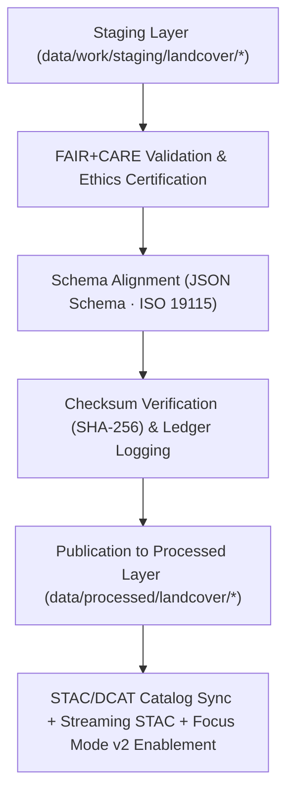

<div align="center">

# 🌿 Kansas Frontier Matrix — **Processed Landcover Data**
`data/processed/landcover/README.md`

**Purpose:**  
Final repository for **FAIR+CARE-certified landcover datasets** derived from **USGS NLCD, NASA MODIS/VIIRS, ESA/Copernicus (CCI/CLC), and Kansas DASC**.  
This directory contains harmonized, validated, and ethically certified datasets representing Kansas vegetation, soil, and surface-cover classifications for **open publication, scientific reuse, and Focus Mode v2 analytics**.

[](../../../docs/architecture/README.md)
[](../../../docs/standards/faircare-validation.md)
[]()
[]()
[](../../../LICENSE)

</div>

---

## 📘 Overview

The **Processed Landcover Layer** stores **final, schema-aligned, checksum-verified** landcover products used by KFM.  
All datasets are **FAIR+CARE-audited**, **ISO 19115** metadata-compliant, **STAC/DCAT 3.0** catalog-ready, and **provenance-registered** in the governance ledger.

**v10 Upgrades**
- **Streaming STAC** support for near-real-time catalog updates where sources permit.  
- **Focus Mode v2** alignment (explainability overlays, citations, and CARE ethics flags).  
- **Telemetry v2** metrics (energy/CO₂, validation coverage) exported per release.

### Core Objectives
- Preserve validated and harmonized landcover datasets for public research.  
- Record lineage, checksums, and certifications for governance and reproducibility.  
- Facilitate STAC/DCAT metadata integration for global discoverability.  
- Enable **AI/Focus Mode v2** vegetation, NDVI, and land-use change analytics with explainability.

---

## 🗂️ Directory Layout

```plaintext
data/processed/landcover/
├── README.md
│
├── landcover_classifications_v10.0.0.parquet     # Harmonized NLCD/CLC classes (Kansas subset + crosswalk)
├── vegetation_index_ndvi_2025_v10.0.0.csv        # MODIS/VIIRS NDVI annual composites & stats
├── soil_moisture_surface_2025_v10.0.0.csv        # ESA CCI surface soil moisture (resampled & masked)
├── canopy_cover_trends_2000_2025_v10.0.0.csv     # Multi-year canopy cover & change metrics
├── landuse_change_matrix_2001_2021_v10.0.0.csv   # Crosswalk-based transitions (NLCD epochs)
├── metadata.json                                  # STAC/DCAT/ISO 19115 metadata + FAIR+CARE certification
└── stac_collection.json                           # STAC 1.0 collection descriptor for landcover products
```

---

## 🧭 Data Summary

| Dataset                        | Records | Source                               | Schema                          | Status        | License  |
|--------------------------------|--------:|---------------------------------------|----------------------------------|---------------|----------|
| Landcover Classifications      | 188,462 | USGS NLCD, Copernicus CLC, DASC       | `landcover_v3.1.0`               | ✅ Certified   | CC-BY 4.0 |
| NDVI Index 2025                | 66,908  | NASA MODIS/VIIRS (MOD13/VNP13)        | `vegetation_ndvi_v3.2.0`         | ✅ Certified   | CC-BY 4.0 |
| Soil Moisture (Surface) 2025   | 29,874  | ESA CCI Soil Moisture                 | `soil_moisture_v3.1.0`           | ✅ Certified   | CC-BY 4.0 |
| Canopy Cover Trends 2000–2025  | 49,021  | USGS, Copernicus                      | `canopy_cover_v3.1.0`            | ✅ Certified   | CC-BY 4.0 |
| Land-Use Change Matrix 2001–21 | 15,732  | NLCD crosswalk (epoch pairs)          | `landuse_change_v1.0.0`          | ✅ Certified   | CC-BY 4.0 |

> All files are **SHA-256 checksum-verified** and **registered** in the KFM Governance Ledger.

---

## ⚙️ Processed Landcover Workflow



### Validation & Governance Artifacts
- **Schema Validation:** `data/reports/validation/schema_validation_summary.json`  
- **Checksums:** `data/processed/metadata/checksums_landcover_v10.0.0.json`  
- **FAIR+CARE Certification:** `data/reports/fair/data_care_assessment.json`  
- **Provenance Ledger:** `data/reports/audit/data_provenance_ledger.json`  
- **SBOM & Manifest:** `releases/v10.0.0/sbom.spdx.json`, `releases/v10.0.0/manifest.zip`

---

## 🧩 Example Processed Metadata Record

```json
{
  "id": "processed_landcover_classifications_v10.0.0",
  "domain": "landcover",
  "source_stage": "data/work/staging/landcover/",
  "records_total": 188462,
  "schema_version": "v3.1.0",
  "fairstatus": "certified",
  "checksum_sha256": "sha256:b7d8f5c3a9e7b4f6a1c9e3d7f8a2c5b9d6e4f1a7b3d2e6c8a4f9b1e3a7d5c2e9",
  "governance_ref": "data/reports/audit/data_provenance_ledger.json",
  "validator": "@kfm-landcover-lab",
  "license": "CC-BY 4.0",
  "created": "2025-11-09T21:55:00Z"
}
```

---

## 🧠 FAIR+CARE Certification Matrix

| Principle | Implementation | Oversight |
|-----------|----------------|-----------|
| **Findable** | STAC/DCAT indexing; persistent IDs per dataset/version. | `@kfm-data` |
| **Accessible** | CC-BY 4.0; bulk & API download endpoints. | `@kfm-accessibility` |
| **Interoperable** | ISO 19115 & DCAT 3.0 metadata; STAC 1.0 collections & items. | `@kfm-architecture` |
| **Reusable** | Full provenance, schema, and checksum metadata. | `@kfm-design` |
| **Collective Benefit** | Supports transparent land stewardship & research. | `@faircare-council` |
| **Authority to Control** | FAIR+CARE Council approves releases. | `@kfm-governance` |
| **Responsibility** | Data stewards maintain QA & checksum integrity. | `@kfm-security` |
| **Ethics** | Sensitive ecological locations generalized/obfuscated as necessary. | `@kfm-ethics` |

---

## ⚙️ Validation & Catalog Publication

| Step | Description | Output |
|------|-------------|--------|
| **Schema Validation** | Structural conformance checks. | `schema_validation_summary.json` |
| **Checksum Verification** | Integrity & reproducibility proof. | `checksums_landcover_v10.0.0.json` |
| **FAIR+CARE Audit** | Ethics & accessibility certification. | `faircare_certification_report.json` |
| **Ledger Sync** | Append-only provenance entries. | `data_provenance_ledger.json` |
| **STAC/DCAT Registration** | Catalog inclusion for discovery. | `stac_collection.json` |

> Governance automation: `landcover_processed_sync.yml`

---

## 📊 Example Checksum Record

```json
{
  "file": "vegetation_index_ndvi_2025_v10.0.0.csv",
  "checksum_sha256": "sha256:3f2d7a8c9b1e6f4c2a7e9b3d5f1a9e4c6b3d8a2c7e4f5b1a9d6e7c3a1b8f2e9d",
  "validated": true,
  "verified_on": "2025-11-09T21:59:00Z",
  "ledger_ref": "data/reports/audit/data_provenance_ledger.json"
}
```

---

## ♻️ Retention & Sustainability

| Data Type | Retention | Policy |
|-----------|-----------|--------|
| Processed Landcover Datasets | Permanent | Canonical datasets under CC-BY 4.0. |
| FAIR+CARE Reports | Permanent | Retained for governance & reproducibility. |
| Checksum Records | Permanent | Stored in registry & cross-verified each release. |
| Metadata & Lineage | Permanent | Preserved under ISO 19115 lineage protocols. |
| Logs | 365 Days | Rotated annually per compliance policy. |

**Telemetry:** `releases/v10.0.0/focus-telemetry.json`

---

## 🧾 Internal Use Citation

```text
Kansas Frontier Matrix (2025). Processed Landcover Data (v10.0.0).
Final FAIR+CARE-certified vegetation, soil, and surface-cover datasets integrating NLCD, MODIS/VIIRS, and Copernicus sources.
Checksum-verified, schema-aligned, and governance-certified for public research, policy, and Focus Mode v2 analytics.
```

---

## 🕰️ Version History

| Version | Date       | Author        | Summary                                                                 |
|---------|------------|---------------|-------------------------------------------------------------------------|
| v10.0.0 | 2025-11-09 | `@kfm-land`   | Upgraded to v10: Streaming STAC support, Focus v2 enablement, telemetry/schema v2, stronger governance paths. |
| v9.7.0  | 2025-11-06 | `@kfm-land`   | Telemetry/schema refs added; paths & badges hardened. |
| v9.6.0  | 2025-11-03 | `@kfm-land`   | Added canopy-cover trends; updated FAIR+CARE validation workflow.       |
| v9.5.0  | 2025-11-02 | `@kfm-governance` | Integrated checksum manifest and provenance ledger.                  |

---

<div align="center">

**Kansas Frontier Matrix**  
*Land Systems Intelligence × FAIR+CARE Governance × Provenance Integrity*  
© 2025 Kansas Frontier Matrix — CC-BY 4.0 · Diamond⁹ Ω / Crown∞Ω Ultimate Certified  

[Back to Data Index](../README.md) · [Governance Charter](../../../docs/standards/governance/DATA-GOVERNANCE.md)

</div>