<div align="center">

# 🌾 Kansas Frontier Matrix — Processed Landcover Data  
`data/processed/landcover/`

**Mission:** Store and document all **cleaned and standardized landcover datasets** — pre-processed imagery,  
classification rasters, and vegetation indices — powering ecological, agricultural, and land-use analysis across Kansas.

[](../../../.github/workflows/site.yml)
[](../../../.github/workflows/stac-validate.yml)
[](../../../.github/workflows/codeql.yml)
[](../../../.github/workflows/trivy.yml)
[](https://pre-commit.com/)
[](../../../docs/)
[](../../../LICENSE)
[](../../../LICENSE)

</div>

---

**Version:** v1.1.0  
**Status:** Stable  
**Last updated:** 2025-10-11

> This directory follows **MCP** documentation-first practices with **STAC 1.0** metadata,  
> **COG/GeoJSON** outputs, **SHA-256** integrity, and CI validation.

---

## 📚 Table of Contents
- [Overview](#-overview)
- [Directory Layout](#-directory-layout)
- [Core Landcover Datasets](#-core-landcover-datasets)
- [STAC Metadata](#-stac-metadata)
- [Processing Workflow](#-processing-workflow)
- [Data Flow (Mermaid)](#-data-flow-mermaid)
- [Reproducibility & Validation](#-reproducibility--validation)
- [Contributing New Landcover Data](#-contributing-new-landcover-data)
- [AI / Graph Bindings](#-ai--graph-bindings)
- [Version History](#-version-history)
- [References](#-references)

---

## 🌍 Overview

This subdirectory contains **processed landcover datasets** — cleaned, normalized, and aligned to a consistent spatial grid  
for Kansas. Inputs typically originate from **satellite imagery** (NLCD, Landsat, Sentinel-2, MODIS) and historical products.  
These layers support derivative analytics (NDVI, NDWI, change detection) under `data/derivatives/landcover/`.

All outputs are **Cloud-Optimized GeoTIFFs (COGs)** or **GeoJSON**, reprojected to **EPSG:4326**, and indexed in the  
project **STAC catalog** with full provenance and schema validation.

---

## 🧱 Directory Layout

```bash
data/
└── processed/
    └── landcover/
        ├── nlcd_2021_ks.tif                # NLCD classified landcover raster (30 m)
        ├── landsat_2021_ks.tif             # Landsat 8 composite (reflectance bands stacked)
        ├── sentinel_2021_ks.tif            # Sentinel-2 composite (resampled to 30 m)
        ├── vegetation_mask_ks.tif          # Binary vegetation mask (NDVI > 0.3)
        ├── water_mask_ks.tif               # Binary water mask (NIR threshold-based)
        ├── metadata/
        │   ├── nlcd_2021_ks.json
        │   ├── vegetation_mask_ks.json
        │   └── water_mask_ks.json
        ├── checksums/
        │   ├── nlcd_2021_ks.tif.sha256
        │   ├── vegetation_mask_ks.tif.sha256
        │   └── water_mask_ks.tif.sha256
        └── README.md
````

---

## 🌾 Core Landcover Datasets

| Product                | File                     | Description                                                           | Source           | Units       | Format        |
| :--------------------- | :----------------------- | :-------------------------------------------------------------------- | :--------------- | :---------- | :------------ |
| **NLCD (2021)**        | `nlcd_2021_ks.tif`       | National Land Cover Database raster for Kansas (30 m).                | USGS MRLC        | categorical | GeoTIFF (COG) |
| **Landsat Composite**  | `landsat_2021_ks.tif`    | Landsat 8 composite (B4,B5,B6,B7 stacked; atmospherically corrected). | USGS Landsat     | reflectance | GeoTIFF (COG) |
| **Sentinel Composite** | `sentinel_2021_ks.tif`   | Sentinel-2 multispectral composite (10–30 m resampled to 30 m).       | ESA Sentinel Hub | reflectance | GeoTIFF (COG) |
| **Vegetation Mask**    | `vegetation_mask_ks.tif` | Binary vegetation map derived from NDVI threshold (> 0.3).            | Derived          | binary      | GeoTIFF (COG) |
| **Water Mask**         | `water_mask_ks.tif`      | Binary water surface mask (NIR threshold).                            | Derived          | binary      | GeoTIFF (COG) |

---

## 🧩 STAC Metadata

All processed landcover layers are indexed in the **STAC catalog** (`data/stac/landcover/`) with lineage, temporal coverage, and license.

**Example:**

```json
{
  "type": "Feature",
  "stac_version": "1.0.0",
  "id": "nlcd_2021_ks",
  "collection": "landcover",
  "properties": {
    "title": "NLCD 2021 Landcover — Kansas",
    "description": "National Land Cover Database 2021 for Kansas (30 m).",
    "datetime": "2021-01-01T00:00:00Z",
    "proj:epsg": 4326,
    "processing:software": "GDAL 3.8.0",
    "kfm:derived_from": ["data/raw/nlcd_2021_ks.tif"],
    "kfm:provenance_sha256": "sha256:0ae19e…",
    "license": "CC-BY-4.0",
    "providers": [
      {"name":"USGS MRLC","roles":["producer","licensor"]},
      {"name":"Kansas Frontier Matrix","roles":["processor","curator"]}
    ]
  },
  "assets": {
    "data": {
      "href": "../../processed/landcover/nlcd_2021_ks.tif",
      "type": "image/tiff; application=geotiff; profile=cloud-optimized",
      "roles": ["data"]
    },
    "checksum": {
      "href": "../../processed/landcover/checksums/nlcd_2021_ks.tif.sha256",
      "type": "text/plain",
      "roles": ["metadata"]
    }
  },
  "bbox": [-102.05, 36.99, -94.59, 40.00],
  "links": [
    {"rel":"collection","href":"./landcover-collection.json","type":"application/json"}
  ]
}
```

---

## ⚙️ Processing Workflow

Processing is orchestrated by **Makefile** targets and `tools/landcover/` scripts using **GDAL**, **rasterio**, **NumPy**.

**Examples:**

```bash
# 1) Reproject + resample NLCD to EPSG:4326 / 30 m
gdalwarp nlcd_2021.tif nlcd_2021_ks.tif -t_srs EPSG:4326 -tr 0.00027778 0.00027778 -r near

# 2) Build Landsat composite (stack reflectance bands)
gdal_merge.py -separate -o landsat_2021_ks.tif LC08_B4.tif LC08_B5.tif LC08_B6.tif LC08_B7.tif

# 3) Sentinel composite → reprojection/resample to 30 m
gdalwarp sentinel_2021_bands.tif sentinel_2021_ks.tif -t_srs EPSG:4326 -tr 30 30 -r cubic

# 4) NDVI-based vegetation mask & NIR threshold water mask
gdal_calc.py -A ndvi_2021_ks.tif --outfile=vegetation_mask_ks.tif --calc="(A>0.3)"
gdal_calc.py -A sentinel_nir.tif --outfile=water_mask_ks.tif --calc="(A<0.05)"

# 5) Convert outputs to COG
rio cogeo create nlcd_2021_ks.tif nlcd_2021_ks_cog.tif --overview-level=5
```

---

## 🧭 Data Flow (Mermaid)

```mermaid
flowchart TD
  A["Raw Imagery & Maps\n(NLCD · Landsat · Sentinel-2)"] --> B["ETL\n(reproject · resample · QA/QC)"]
  B --> C["Processed Outputs\n(COG · GeoJSON)"]
  C --> D["STAC Metadata\n(items · collection)"]
  D --> E["Graph/API\n(Neo4j · FastAPI)"]
  E --> F["Web UI\n(MapLibre layers · Legends)"]
```



% END OF MERMAID %

---

## 🔁 Reproducibility & Validation

* **Checksums:** `.sha256` integrity hashes accompany each file (`./checksums/`).
* **STAC Validation:** CI enforces STAC + schema checks (`.github/workflows/stac-validate.yml`).
* **Makefile Targets:**

  * `make landcover` — process all landcover data
  * `make validate-landcover` — run metadata + checksum validation
* **Containerization:** GDAL/rasterio **Docker** toolchain for consistent environments.
* **QA:** Visual checks vs. NLCD legend and RGB composites in QGIS/MapLibre.

---

## 🤝 Contributing New Landcover Data

1. Place cleaned raster/vector in this directory (or subfolder).
2. Generate checksum:

   ```bash
   sha256sum new_file.tif > checksums/new_file.tif.sha256
   ```
3. Create a **STAC Item** JSON under `metadata/` (use examples above).
4. Add a brief `DERIVATION.md` (sources, params, projections, caveats).
5. Validate:

   ```bash
   make validate-landcover
   ```
6. Open a PR with:

   * Data license & citations
   * Processing details
   * Suggested symbology (palette, class legend)

---

## 🧠 AI / Graph Bindings

* **Graph IDs:** `layer:NLCD_2021_KS`, `layer:Landsat_Composite_2021`, `mask:Vegetation_KS`
* **API (FastAPI):**
  `/layers?collection=landcover` → returns STAC Items for map config
  `/legend/{id}` → returns legend schema (classes, colors)
* **NLP hooks:** auto-summaries in dataset cards; class/coverage statistics for legends.

---

## 📅 Version History

| Version    | Date       | Summary                                                                                        |
| :--------- | :--------- | :--------------------------------------------------------------------------------------------- |
| **v1.1.0** | 2025-10-11 | Added Mermaid data-flow, STAC `checksum` asset linking, improved contribution & AI/Graph notes |
| **v1.0.0** | 2025-10-04 | Initial release: NLCD, Landsat, Sentinel composites, vegetation & water masks                  |

---

## 📖 References

* **USGS National Land Cover Database (NLCD):** [https://www.mrlc.gov/data](https://www.mrlc.gov/data)
* **Landsat Science:** [https://landsat.gsfc.nasa.gov](https://landsat.gsfc.nasa.gov)
* **Sentinel-2 Data Hub:** [https://scihub.copernicus.eu/](https://scihub.copernicus.eu/)
* **GDAL:** [https://gdal.org/](https://gdal.org/) • **STAC 1.0:** [https://stacspec.org](https://stacspec.org) • **COG:** [https://www.cogeo.org/](https://www.cogeo.org/)
* **MCP Docs:** `../../../docs/`

---

<div align="center">

*“From prairie to plow and back to prairie — these processed maps reveal Kansas’s ever-changing green frontier.”*
📍 [`data/processed/landcover/`](.)

</div>
```
