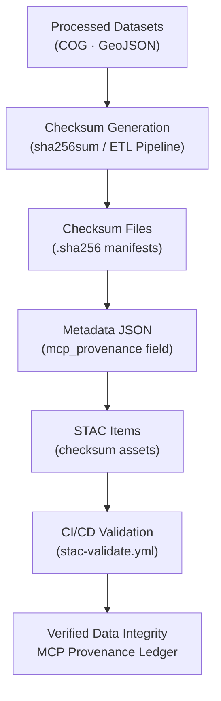

<div align="center">

# 🌾 Kansas Frontier Matrix — Processed Landcover Checksums  
`data/processed/landcover/checksums/`

**Mission:** Store and manage **checksum manifests (`.sha256`)** verifying the integrity of all processed landcover datasets —  
NLCD rasters, vegetation masks, spectral composites, and water indices — ensuring **reproducibility, authenticity,**  
and **long-term data fidelity** across the Kansas Frontier Matrix (KFM) ecosystem.

[](../../../../.github/workflows/site.yml)
[](../../../../.github/workflows/stac-validate.yml)
[](../../../../.github/workflows/codeql.yml)
[](../../../../.github/workflows/trivy.yml)
[](../../../../docs/)
[](../../../../LICENSE)
[](../../../../LICENSE)

</div>

---

**Version:** v1.1.0  
**Status:** Stable  
**Last updated:** 2025-10-11  

> This directory implements checksum storage and validation per **Master Coder Protocol (MCP)** standards.  
> All files conform to **GNU Coreutils SHA-256** format and are referenced by **STAC metadata** for verifiable provenance.

---

## 📚 Table of Contents
- [Overview](#-overview)
- [Purpose](#-purpose)
- [Directory Layout](#-directory-layout)
- [Checksum Standards](#-checksum-standards)
- [Verification Workflow](#-verification-workflow)
- [Integration with MCP & STAC](#-integration-with-mcp--stac)
- [Data Flow](#-data-flow)
- [Adding or Updating Checksums](#-adding-or-updating-checksums)
- [Version History](#-version-history)
- [References](#-references)

---

## 🌍 Overview
This folder stores **SHA-256 checksum files** corresponding to every processed landcover dataset under  
`data/processed/landcover/`.  

Checksums act as **immutable fingerprints** guaranteeing dataset integrity and reproducibility.  
They ensure that NLCD rasters, Landsat composites, vegetation masks, and water indices can be verified  
end-to-end across local, CI, and archival environments.

---

## 🎯 Purpose

| Goal | Description |
|:-----|:-------------|
| **Integrity** | Detect unintended or malicious file modifications. |
| **Reproducibility** | Verify deterministic outputs from repeated ETL runs. |
| **Automation** | Enable automated CI/CD hash validation (`make validate-landcover`). |
| **Traceability** | Link datasets to `mcp_provenance` and STAC asset fields. |

---

## 🧱 Directory Layout

```bash
data/
└── processed/
    └── landcover/
        └── checksums/
            ├── nlcd_2021_ks.tif.sha256
            ├── vegetation_mask_ks.tif.sha256
            ├── water_mask_ks.tif.sha256
            ├── landsat_2021_ks.tif.sha256
            ├── sentinel_2021_ks.tif.sha256
            └── README.md
````

Each file corresponds **1:1** with a processed raster or vector dataset and uses GNU Coreutils output:

```text
d3f74e5c8b3e921f1e834d4b39d723d43a71d02fcecb69ab23b2df7b7cc10ad9  nlcd_2021_ks.tif
```

---

## 🧩 Checksum Standards

| Parameter     | Specification                                                |
| :------------ | :----------------------------------------------------------- |
| **Algorithm** | SHA-256 (Secure Hash Algorithm, 256-bit)                     |
| **Format**    | `<hash>  <filename>` (GNU `sha256sum` output)                |
| **Encoding**  | Binary (`--binary`) for cross-platform consistency           |
| **Length**    | 64-character hexadecimal string                              |
| **Purpose**   | Immutable linkage between dataset, metadata, and STAC record |

These hashes function as **canonical identifiers** in MCP provenance chains.

---

## 🔍 Verification Workflow

### 🔹 Manual Verification

```bash
# Verify one dataset
sha256sum -c data/processed/landcover/checksums/nlcd_2021_ks.tif.sha256

# Verify all checksums
find data/processed/landcover/checksums -name "*.sha256" -exec sha256sum -c {} \;
```

**Output:**

```
nlcd_2021_ks.tif: OK
vegetation_mask_ks.tif: OK
```

Failures:

```
sentinel_2021_ks.tif: FAILED
sha256sum: WARNING: 1 computed checksum did NOT match
```

### 🔹 CI/CD Integration

GitHub Actions runs automated verification via
`.github/workflows/stac-validate.yml` on every PR or merge, blocking commits
with mismatched or missing checksums.

---

## 🌐 Integration with MCP & STAC

Checksums provide the bridge between the **data**, **metadata**, and **catalog** layers.

1. **MCP Provenance**

   ```json
   "mcp_provenance": "sha256:d3f74e5c8b3e921f1e834d4b39d723d43a71d02fcecb69ab23b2df7b7cc10ad9"
   ```

   → Stored in metadata JSON for every dataset.

2. **STAC Linkage**

   ```json
   "checksum": {
     "href": "../checksums/nlcd_2021_ks.tif.sha256",
     "type": "text/plain",
     "roles": ["metadata"]
   }
   ```

   → Provides hash-level validation for all STAC Items in `data/stac/landcover/`.

---

## 🧭 Data Flow



% END OF MERMAID %

---

## ⚙️ Adding or Updating Checksums

1. **Generate checksum**

   ```bash
   sha256sum <dataset> > data/processed/landcover/checksums/<dataset>.sha256
   ```
2. **Verify**

   ```bash
   sha256sum -c data/processed/landcover/checksums/<dataset>.sha256
   ```
3. **Reference** it in the dataset metadata (`mcp_provenance` field).
4. **Validate** locally:

   ```bash
   make validate-landcover
   ```
5. **Commit & Push** — the CI workflow will re-verify.

---

## 🧠 MCP Compliance Summary

| MCP Principle           | Implementation                                         |
| :---------------------- | :----------------------------------------------------- |
| **Documentation-first** | Checksums stored alongside datasets with clear lineage |
| **Reproducibility**     | Deterministic SHA-256 algorithm                        |
| **Open Standards**      | GNU Coreutils checksum format                          |
| **Provenance**          | Linked via `mcp_provenance` + STAC `checksum` asset    |
| **Auditability**        | CI verification + human-readable logs                  |

---

## 📅 Version History

| Version    | Date       | Summary                                                                             |
| :--------- | :--------- | :---------------------------------------------------------------------------------- |
| **v1.1.0** | 2025-10-11 | Added Mermaid flow, MCP compliance table, CI integration details                    |
| **v1.0.0** | 2025-10-04 | Initial checksum documentation for NLCD, Landsat, Sentinel, vegetation, water masks |

---

## 📖 References

* **USGS NLCD:** [https://www.mrlc.gov/data](https://www.mrlc.gov/data)
* **Landsat Science:** [https://landsat.gsfc.nasa.gov](https://landsat.gsfc.nasa.gov)
* **Sentinel-2:** [https://scihub.copernicus.eu/](https://scihub.copernicus.eu/)
* **STAC 1.0:** [https://stacspec.org](https://stacspec.org)
* **GNU Coreutils (`sha256sum`):** [https://www.gnu.org/software/coreutils/manual/html_node/sha2-utilities.html](https://www.gnu.org/software/coreutils/manual/html_node/sha2-utilities.html)
* **MCP Documentation:** `../../../../docs/`

---

<div align="center">

*“From fields of grass to pixels of code — these checksums keep Kansas’s living landcover immutable and verified.”*
📍 [`data/processed/landcover/checksums/`](.)

</div>
```
