<div align="center">

# 🌾 Kansas Frontier Matrix — Processed Landcover Metadata  
`data/processed/landcover/metadata/`

**Mission:** Maintain **metadata documentation** for all processed landcover datasets —  
NLCD classifications, vegetation masks, and spectral composites — ensuring transparent lineage,  
licensing, and scientific reproducibility across Kansas Frontier Matrix landcover archives.

[](../../../../.github/workflows/site.yml)
[](../../../../.github/workflows/stac-validate.yml)
[](../../../../.github/workflows/codeql.yml)
[](../../../../.github/workflows/trivy.yml)
[](../../../../docs/)
[](../../../../LICENSE)
[](../../../../LICENSE)

</div>

---

**Version:** v1.1.0  
**Status:** Stable  
**Last updated:** 2025-10-11

> This directory follows **MCP** documentation-first practices with **STAC 1.0.0** compatibility,  
> JSON Schema validation, and checksum-backed provenance for every landcover dataset.

---

## 📚 Table of Contents
- [Overview](#-overview)
- [Directory Layout](#-directory-layout)
- [Metadata Schema](#-metadata-schema)
- [STAC Integration](#-stac-integration)
- [Validation & Provenance](#-validation--provenance)
- [Adding or Updating Metadata](#-adding-or-updating-metadata)
- [Data Flow](#-data-flow)
- [AI / Graph Bindings](#-ai--graph-bindings)
- [Version History](#-version-history)
- [References](#-references)

---

## 🌍 Overview
This directory contains **metadata JSON** describing processed landcover datasets under  
`data/processed/landcover/`. Each record documents origin, processing steps, software, license,  
and spatial/temporal coverage — feeding the project’s **STAC catalog** and **MCP provenance** graph.

---

## 🧱 Directory Layout

```bash
data/
└── processed/
    └── landcover/
        └── metadata/
            ├── nlcd_2021_ks.json
            ├── vegetation_mask_ks.json
            ├── water_mask_ks.json
            ├── landsat_2021_ks.json
            ├── sentinel_2021_ks.json
            ├── template.json
            └── README.md
````

Each metadata JSON links to:

* its dataset checksum in `data/processed/landcover/checksums/`, and
* its STAC Item under `data/stac/landcover/`.

---

## 🧩 Metadata Schema

All records follow the **hybrid MCP–STAC schema** (STAC core + KFM extensions). Use `template.json` for new entries.

### Example Metadata Record

```json
{
  "type": "Feature",
  "stac_version": "1.0.0",
  "id": "nlcd_2021_ks",
  "collection": "landcover",
  "properties": {
    "title": "NLCD Landcover 2021 — Kansas",
    "description": "National Land Cover Database 2021 classified raster clipped to Kansas boundaries (30 m).",
    "datetime": "2021-01-01T00:00:00Z",
    "proj:epsg": 4326,
    "processing:software": "GDAL 3.8.0; rasterio; numpy",
    "kfm:derived_from": ["data/raw/nlcd_2021_us.tif"],
    "kfm:provenance_sha256": "sha256:74bde6…",
    "spatial_extent": [-102.05, 36.99, -94.59, 40.01],
    "temporal_extent": {"start": "2021-01-01", "end": "2021-12-31"},
    "license": "CC-BY-4.0",
    "keywords": ["landcover","NLCD","Kansas","USGS","classification"]
  },
  "assets": {
    "data": {
      "href": "../nlcd_2021_ks.tif",
      "type": "image/tiff; application=geotiff; profile=cloud-optimized",
      "roles": ["data"]
    },
    "checksum": {
      "href": "../checksums/nlcd_2021_ks.tif.sha256",
      "type": "text/plain",
      "roles": ["metadata"]
    }
  }
}
```

### Required Fields

| Field                   | Description                        | Example                                               |
| :---------------------- | :--------------------------------- | :---------------------------------------------------- |
| `id`                    | Unique dataset identifier          | `"vegetation_mask_ks"`                                |
| `title`                 | Dataset name                       | `"Vegetation Mask — Kansas"`                          |
| `description`           | Summary of contents                | `"Binary raster of vegetation presence (NDVI > 0.3)"` |
| `datetime`              | Dataset reference date             | `"2021-07-01T00:00:00Z"`                              |
| `kfm:derived_from`      | Source dataset(s)                  | `["data/raw/landsat8_ks_2021.tif"]`                   |
| `processing:software`   | Tools used                         | `"GDAL 3.8.0; Python"`                                |
| `kfm:provenance_sha256` | SHA-256 checksum (or sidecar path) | `"sha256:6bfa0f..."`                                  |
| `spatial_extent`        | BBOX [W,S,E,N]                     | `[-102.05,36.99,-94.59,40.01]`                        |
| `temporal_extent`       | Time period                        | `{"start":"2021-01-01","end":"2021-12-31"}`           |
| `license`               | Usage license                      | `"CC-BY-4.0"`                                         |

**Optional:** `keywords`, `resolution`, `sensor`, `classification:scheme`, `quality:metrics`.

---

## 🌐 STAC Integration

Every metadata JSON is mirrored as a **STAC Item** under `data/stac/landcover/` and linked to the landcover collection.
Benefits: spatial/temporal search, API access, provenance via `kfm:derived_from`, and consistent UI layer config.

---

## 🔍 Validation & Provenance

Automated checks run in CI:

1. **JSON Schema** — required keys & types
2. **Checksum** — matches `kfm:provenance_sha256` or sidecar file
3. **STAC Compliance** — STAC 1.0.0 fields & asset roles
4. **Cross-links** — verify `href` paths and `derived_from` sources exist

Run locally:

```bash
make validate-landcover
```

Reports are written to `validation_report.json`.

---

## 🧠 Adding or Updating Metadata

1. Copy `template.json` → rename to dataset ID (e.g., `water_mask_ks.json`).
2. Fill required fields; include software, license, and provenance hash.
3. Generate checksum and reference it:

   ```bash
   sha256sum ../water_mask_ks.tif > ../checksums/water_mask_ks.tif.sha256
   ```
4. Validate:

   ```bash
   make validate-landcover
   ```
5. Commit + open a PR (include sources, processing notes, and legend/symbology if relevant).

---

## 🧭 Data Flow

```mermaid
flowchart TD
  A["Source Records\n(Raw NLCD · Landsat · Sentinel)"] --> B["ETL Processing\n(reproject · resample · mask)"]
  B --> C["Processed Layers\n(COG · GeoJSON)"]
  C --> D["Metadata JSON\n(this directory)"]
  D --> E["STAC Items\n(data/stac/landcover/)"]
  E --> F["Graph/API\n(Neo4j · FastAPI)"]
  F --> G["Web UI\n(MapLibre layers · Legends)"]
```



% END OF MERMAID %

---

## 🧠 AI / Graph Bindings

* **Graph IDs:** `layer:NLCD_2021_KS`, `mask:Vegetation_KS`, `composite:Landsat_2021`
* **API (FastAPI):**
  `/layers?collection=landcover` → STAC Items for the map
  `/legend/{id}` → legend schema (classes, colors)
* **NLP hooks:** auto-summaries for dataset cards; class coverage stats for legends.

---

## 📅 Version History

| Version    | Date       | Summary                                                                                       |
| :--------- | :--------- | :-------------------------------------------------------------------------------------------- |
| **v1.1.0** | 2025-10-11 | Added STAC `checksum` asset guidance; Mermaid data-flow; clarified required fields & CI steps |
| **v1.0.0** | 2025-10-04 | Initial metadata README, schema guidance, validation workflow                                 |

---

## 📖 References

* **USGS NLCD:** [https://www.mrlc.gov/data](https://www.mrlc.gov/data)
* **Landsat Science:** [https://landsat.gsfc.nasa.gov](https://landsat.gsfc.nasa.gov)
* **Sentinel-2:** [https://scihub.copernicus.eu/](https://scihub.copernicus.eu/)
* **GDAL / rasterio:** [https://gdal.org](https://gdal.org) · [https://rasterio.readthedocs.io](https://rasterio.readthedocs.io)
* **STAC 1.0:** [https://stacspec.org](https://stacspec.org)
* **MCP Docs:** `../../../../docs/`

---

<div align="center">

*“From tallgrass to tilled fields — these metadata preserve the story of Kansas land and its transformations.”*
📍 [`data/processed/landcover/metadata/`](.)

</div>
```
