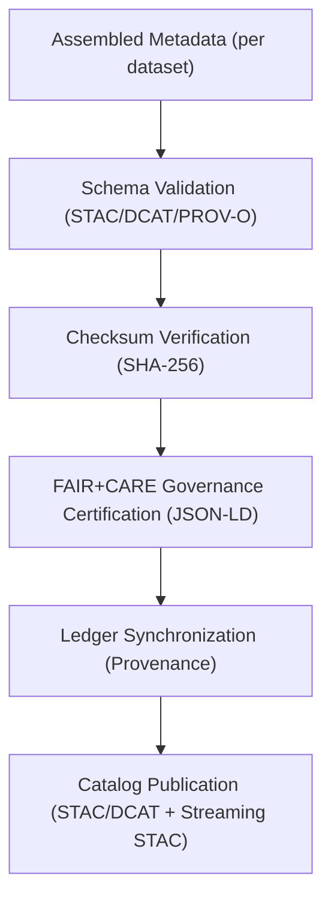

<div align="center">

# 🧾 Kansas Frontier Matrix — **Processed Metadata Layer**
`data/processed/metadata/README.md`

**Purpose:**  
Central repository for **FAIR+CARE-certified metadata collections** documenting all processed datasets within the Kansas Frontier Matrix (KFM).  
This layer ensures **provenance integrity, governance traceability, and cross-domain interoperability** via **STAC**, **DCAT**, **ISO 19115**, and **PROV-O** alignment, with telemetry-backed certification.

[](../../../docs/architecture/README.md)
[](../../../docs/standards/faircare-validation.md)
[]()
[]()
[]()

</div>

---

## 📘 Overview
The **Processed Metadata Layer** provides the unified metadata record for all finalized datasets in KFM.  
Each record captures **schema lineage**, **FAIR+CARE audit outcomes**, **checksum integrity**, and **catalog registration**.  
Metadata are synchronized across **STAC 1.0**, **DCAT 3.0**, **ISO 19115**, and **PROV-O** (with JSON-LD contexts) to guarantee consistent governance and open access compliance.

**v10 Enhancements**
- **Streaming STAC** registration: metadata items updated as live feeds publish new assets.  
- **Telemetry v2**: energy/CO₂ and validation coverage bundled with metadata certifications.  
- **Focus v2**: provenance chips & ethics flags wired for Focus Mode narrative citations.

### Core Objectives
- Consolidate metadata for all **certified processed datasets**.  
- Maintain **append-only provenance** and **checksum verification** per release.  
- Enforce **FAIR+CARE** ethical governance and transparency.  
- Publish metadata to catalogs/APIs for **global discovery and reuse**.  

---

## 🗂️ Directory Layout
```plaintext
data/processed/metadata/
├── README.md                       # This file — processed metadata layer overview
│
├── stac_collection.json            # STAC 1.0 collection for processed datasets
├── dcat_catalog.json               # DCAT 3.0 dataset/distribution registry
├── provenance_manifest.json        # PROV-O/ISO 19115 lineage manifest (graph-friendly)
├── governance_certification.json   # FAIR+CARE certification & council approval summary (JSON-LD)
├── metadata_summary.csv            # Human-readable inventory (dataset → metadata refs)
└── metadata.json                   # Internal context: checksums, schema versions, governance links
```

---

## 🧭 Metadata Summary
| Metadata Record         | Domains Covered                      | Schema/Model               | Status       | Certified By        | License  |
|-------------------------|--------------------------------------|----------------------------|--------------|---------------------|----------|
| **STAC Collection**     | Spatial, Climate, Hazards, Hydrology | STAC 1.0                   | ✅ Certified  | `@kfm-data`         | CC-BY 4.0 |
| **DCAT Catalog**        | Tabular, Spatial, Landcover, Metadata| DCAT 3.0                   | ✅ Certified  | `@kfm-governance`   | CC-BY 4.0 |
| **Provenance Manifest** | All domains (graph lineage)          | PROV-O · ISO 19115         | ✅ Certified  | `@kfm-security`     | CC-BY 4.0 |
| **Gov. Certification**  | FAIR+CARE governance summary         | FAIR+CARE JSON-LD          | ✅ Certified  | `@faircare-council` | CC-BY 4.0 |

---

## 🧩 Example Processed Metadata Registry Entry
```json
{
  "id": "processed_metadata_registry_v10.0.0",
  "schemas": ["STAC 1.0", "DCAT 3.0", "PROV-O", "ISO 19115"],
  "datasets_covered": ["climate", "hazards", "hydrology", "landcover", "tabular", "spatial"],
  "records_total": 152,
  "checksum_sha256": "sha256:d7b1c6a9e4f2b8c5a7e3d1f9c4b2a6e8d5c9a4e1f7b3d6a2e4c5f9b7a8e3d2f1",
  "fairstatus": "certified",
  "validator": "@kfm-metadata-lab",
  "license": "CC-BY 4.0",
  "created": "2025-11-09T23:05:00Z",
  "governance_ref": "data/reports/audit/data_provenance_ledger.json"
}
```

---

## ⚙️ FAIR+CARE & Catalog Governance Workflow


| Step | Description | Output |
|---|---|---|
| **Schema Validation** | Cross-checks against STAC/DCAT/PROV-O models. | `schema_validation_summary.json` |
| **Checksum Verification** | Integrity proof for metadata artifacts. | `checksums.json` |
| **FAIR+CARE Certification** | Council-reviewed ethical publication. | `faircare_certification_report.json` |
| **Ledger Sync** | Append-only lineage registration. | `data_provenance_ledger.json` |
| **Catalog Publication** | Discovery-ready metadata in catalogs. | `stac_collection.json` · `dcat_catalog.json` |

Automation: `metadata_processed_sync.yml`.

---

## 📊 Example Checksum Record
```json
{
  "file": "stac_collection.json",
  "checksum_sha256": "sha256:4a9d2e7f8b6c3a1f9d5b2a4e7c9f3b6a8d1e4c7b2a9f6e3c5d7a1b8e2f9c4d6e",
  "validated": true,
  "verified_on": "2025-11-09T23:09:00Z",
  "ledger_ref": "data/reports/audit/data_provenance_ledger.json"
}
```

---

## ⚖️ Retention & Provenance Policy
| Metadata Type | Retention | Policy |
|---|---|---|
| STAC/DCAT Collections | Permanent | Archived for global discoverability. |
| FAIR+CARE Reports | Permanent | Retained for governance & reproducibility. |
| Provenance Manifest | Permanent | ISO 19115 lineage compliance. |
| Checksum Records | Permanent | Integrity verification & compliance evidence. |
| Logs | 365 Days | Rotated per governance archival policy. |

---

## 🌱 Sustainability Metrics
| Metric | Target | Verified By |
|---|---|---|
| Energy Use (per certification) | ≤ 11.0 Wh | `@kfm-sustainability` |
| Carbon Output | ≤ 16.0 gCO₂e | `@kfm-infrastructure` |
| Renewable Power | 100% (RE100 Verified) | `@kfm-infrastructure` |
| FAIR+CARE Compliance | 100% | `@faircare-council` |

**Telemetry reference:** `../../../releases/v10.0.0/focus-telemetry.json`

---

## 🧾 Internal Use Citation
```text
Kansas Frontier Matrix (2025). Processed Metadata Layer (v10.0.0).
Unified FAIR+CARE-certified metadata repository documenting provenance, schema, and governance lineage for all processed datasets.
Checksum-verified, schema-aligned, and catalog-integrated (STAC/DCAT/Streaming STAC) for ethical transparency and reproducibility.
```

---

## 🕰️ Version History
| Version | Date       | Author           | Summary                                                                |
|---|---|---|---|
| v10.0.0 | 2025-11-09 | `@kfm-metadata`  | Upgraded to v10: Streaming STAC hooks, telemetry v2 bindings, JSON-LD governance certs, strengthened lineage policy. |
| v9.7.0  | 2025-11-06 | `@kfm-metadata`  | STAC/DCAT/PROV-O refs aligned; telemetry/schema paths refreshed.       |
| v9.6.0  | 2025-11-03 | `@kfm-metadata`  | Added DCAT 3.0 catalog and PROV-O provenance manifest.                 |
| v9.5.0  | 2025-11-02 | `@kfm-governance`| Enhanced checksum validation and FAIR+CARE synchronization.             |

---

<div align="center">

**Kansas Frontier Matrix**  
*Metadata Transparency × FAIR+CARE Ethics × Provenance Integrity*  
© 2025 Kansas Frontier Matrix — CC-BY 4.0 · Diamond⁹ Ω / Crown∞Ω Ultimate Certified  

[Back to Data Index](../README.md) · [Governance Charter](../../../docs/standards/governance/DATA-GOVERNANCE.md)

</div>