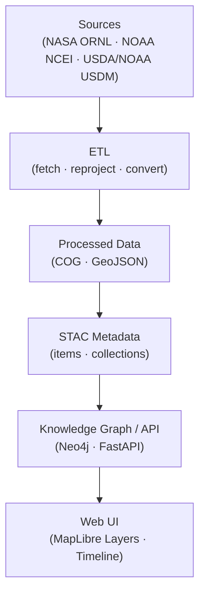

<div align="center">

# 🌦️ Kansas Frontier Matrix — Climate Metadata  
`data/processed/metadata/climate/`

**Mission:** Curate, document, and standardize all **processed climate datasets**  
used to analyze temperature, precipitation, drought, and extreme weather trends  
across Kansas — integrated into the Frontier Matrix’s spatiotemporal knowledge system.

[](../../../.github/workflows/site.yml)
[](../../../.github/workflows/stac-validate.yml)
[](../../../.github/workflows/codeql.yml)
[](../../../.github/workflows/trivy.yml)
[](https://pre-commit.com/)
[](../../../docs/)
[](../../../LICENSE)

</div>

---

**Version:** v1.1.0  
**Status:** Stable  
**Last updated:** 2025-10-11  

> This directory implements **MCP-compliant climate metadata** for the Kansas Frontier Matrix —  
> including **Daymet**, **NOAA Normals**, and **U.S. Drought Monitor** products, with STAC 1.0.0 and JSON-Schema validation.

---

## 📚 Overview
This directory contains **processed climate metadata and provenance documentation** used in KFM to quantify  
**temperature, precipitation, drought, and climate extremes** across space and time.

Each dataset includes:
- **STAC 1.0.0** compliant metadata (`.json`)
- **SHA-256** checksums for reproducibility
- **Schema validation** (`data/processed/metadata/schema/`)
- **Provenance** (source URL, license, retrieval date)

---

## 🗂️ Directory Layout

```bash
data/processed/metadata/climate/
├── README.md
├── CHANGELOG.md
├── daymet_1980_2024.json
├── noaa_normals_1991_2020.json
├── drought_monitor_2000_2025.json
└── thumbnails/
    ├── daymet_1980_2024.png
    ├── noaa_normals_1991_2020.png
    └── drought_monitor_2000_2025.png
````

> Each `.json` file corresponds to a processed dataset under `data/processed/climate/`,
> and each `.png` thumbnail provides its visual representation for the STAC catalog and web UI.

---

## 🌡️ Climate Layers (Processed Assets)

| Layer                                | Source          | Format                 | Spatial Resolution | Temporal Coverage | Output                                                  |
| :----------------------------------- | :-------------- | :--------------------- | :----------------- | :---------------- | :------------------------------------------------------ |
| **Daymet Daily Climate Data**        | NASA ORNL DAAC  | NetCDF → GeoTIFF (COG) | 1 km               | 1980–2024         | `data/processed/climate/daymet_1980_2024.tif`           |
| **NOAA Climate Normals (1991–2020)** | NOAA NCEI       | CSV → GeoJSON          | Station Points     | 1991–2020         | `data/processed/climate/noaa_normals_1991_2020.geojson` |
| **U.S. Drought Monitor (2000–2025)** | USDA / NOAA CPC | GeoTIFF (COG)          | 5 km               | 2000–2025         | `data/processed/climate/drought_monitor_2000_2025.tif`  |

**CRS:** EPSG 4326 (WGS 84)  **Catalog:** `data/stac/climate/`

---

## 💾 Example STAC Metadata

```json
{
  "stac_version": "1.0.0",
  "type": "Feature",
  "id": "daymet_1980_2024",
  "collection": "climate",
  "properties": {
    "title": "Daymet Daily Surface Weather Data (1980–2024)",
    "description": "Gridded daily temperature and precipitation for Kansas (1 km resolution).",
    "start_datetime": "1980-01-01T00:00:00Z",
    "end_datetime": "2024-12-31T23:59:59Z",
    "proj:epsg": 4326,
    "kfm:themes": ["climate","temperature","precipitation"],
    "license": "Public Domain (NASA ORNL DAAC)",
    "providers": [
      {"name": "NASA ORNL DAAC", "roles": ["producer"]},
      {"name": "Kansas Frontier Matrix", "roles": ["processor","curator"]}
    ]
  },
  "assets": {
    "data": {
      "href": "../../processed/climate/daymet_1980_2024.tif",
      "type": "image/tiff; application=geotiff; profile=cloud-optimized",
      "roles": ["data"]
    },
    "thumbnail": {
      "href": "thumbnails/daymet_1980_2024.png",
      "type": "image/png",
      "roles": ["thumbnail"]
    }
  },
  "bbox": [-102.05,36.99,-94.59,40.00]
}
```

---

## 🧩 Semantic & Ontological Alignment

| Entity              | Mapping (CIDOC CRM / OWL-Time)         | Example                        |
| :------------------ | :------------------------------------- | :----------------------------- |
| Climate Raster      | `E73_Information_Object` + `E53_Place` | Daymet Temperature Grid        |
| Drought Index       | `E16_Measurement` + Time Interval      | U.S. Drought Monitor           |
| Observation Station | `E53_Place` + `E39_Actor`              | NOAA Station — Topeka, KS      |
| Normals Dataset     | `E31_Document` + `P94_has_created`     | NOAA 1991–2020 Normals Release |

Ontology links allow cross-domain reasoning between **climate**, **hydrology**, and **landcover** nodes in Neo4j.

---

## ⚙️ ETL & Processing Workflow

**Entry:** `make climate` → executes `src/pipelines/climate/climate_pipeline.py`
**Dependencies:** `xarray`, `rioxarray`, `rasterio`, `rio-cogeo`, `geopandas`, `pandas`, `requests`

1. Fetch datasets from NASA ORNL, NOAA, and USDM APIs.
2. Reproject → EPSG 4326 (WGS 84).
3. Clip to Kansas boundary shapefile.
4. Convert NetCDF → COG / CSV → GeoJSON.
5. Generate thumbnails (PNG) for visualization.
6. Create STAC Item + Collection metadata.
7. Compute SHA-256 checksums.
8. Validate JSON Schema + STAC compliance in CI.

---

## 🧭 Data Flow



% END OF MERMAID %

---

## 🧮 Provenance & Validation

| Aspect             | Implementation                                      |
| :----------------- | :-------------------------------------------------- |
| **Checksums**      | `.sha256` generated for each output dataset         |
| **Licensing**      | NASA / NOAA public domain → derived CC-BY 4.0       |
| **Validation**     | JSON Schema + STAC CI testing (`stac-validate.yml`) |
| **Source Records** | Logged in `data/sources/climate/*.json`             |

---

## 🔗 Integration Points

| Component                    | Role                                    |
| :--------------------------- | :-------------------------------------- |
| `data/stac/climate/`         | STAC Items & Collections                |
| `web/config/layers.json`     | Web UI overlay config                   |
| `src/graph/climate_nodes.py` | Neo4j graph bindings                    |
| `docs/architecture.md`       | Pipeline architecture reference         |
| `data/processed/hazards/`    | Links to drought & extreme event layers |

---

## 🧠 MCP Compliance Summary

| MCP Principle           | Implementation                          |
| :---------------------- | :-------------------------------------- |
| **Documentation-first** | README + STAC metadata + Schema         |
| **Reproducibility**     | Makefile pipelines + pinned environment |
| **Open Standards**      | NetCDF · COG · GeoJSON · STAC           |
| **Provenance**          | URL + license + checksum tracking       |
| **Auditability**        | CI tests + checksum verification        |

---

## 📅 Version History

| Version    | Date       | Summary                                                                  |
| :--------- | :--------- | :----------------------------------------------------------------------- |
| **v1.1.0** | 2025-10-11 | Added drought-monitor integration, CI diagram, and Mermaid flow section  |
| **v1.0.0** | 2025-10-04 | Initial climate metadata release — Daymet, NOAA Normals, Drought Monitor |

---

## 📎 References

* [NASA ORNL DAAC Daymet](https://daac.ornl.gov/DAYMET/)
* [NOAA Climate Normals (1991–2020)](https://www.ncei.noaa.gov/products/land-based-station/us-climate-normals)
* [USDA/NOAA U.S. Drought Monitor](https://droughtmonitor.unl.edu/)
* [Cloud-Optimized GeoTIFF Specification](https://www.cogeo.org/)
* [Master Coder Protocol Docs](../../../docs/templates/)

---

<div align="center">

**Kansas Frontier Matrix** — *“Tracking the Pulse of Climate Across Time and Terrain.”*
📍 [`data/processed/metadata/climate/`](.) · Integrated within the **STAC Data Catalog Layer**

</div>
