<div align="center">

# 🖼️ Kansas Frontier Matrix — Climate Thumbnails  
`data/processed/metadata/climate/thumbnails/`

**Mission:** Store, document, and validate **thumbnail preview images** for all processed climate datasets —  
including **temperature, precipitation, and drought layers** — used for visualization in the  
**Kansas Frontier Matrix (KFM)** web map, documentation system, and STAC catalog.

[](../../../../.github/workflows/site.yml)
[](../../../../.github/workflows/stac-validate.yml)
[](../../../../docs/)
[](../../../../.github/workflows/codeql.yml)
[](../../../../LICENSE)

</div>

---

**Version:** v1.1.0  
**Status:** Stable  
**Last updated:** 2025-10-11  

> This directory defines the **visual thumbnail layer** for the Kansas Frontier Matrix climate datasets.  
> Thumbnails provide a lightweight graphical preview of temperature, precipitation, and drought products  
> within both the **MapLibre web app** and the **STAC data catalog**.

---

## 📚 Overview
This folder contains **static image previews (PNGs)** representing processed climate datasets documented under  
`data/processed/metadata/climate/`.  

Each thumbnail supports:
- **MapLibre-based map overlays** in the KFM web interface  
- **STAC `thumbnail` assets** for catalog browsing  
- **Documentation previews** embedded across reports and markdown files  

Thumbnails are **auto-generated** during the `make climate` pipeline and can be safely deleted or recreated.

---

## 🗂️ Directory Layout

```bash
data/processed/metadata/climate/thumbnails/
├── README.md
├── daymet_1980_2024.png
├── noaa_normals_1991_2020.png
└── drought_monitor_2000_2025.png
````

> Each file name matches its dataset `id` from `data/processed/metadata/climate/*.json`,
> and each STAC record links back via a `"thumbnail"` asset path.

---

## 🌡️ Thumbnail Index

| Dataset                              | Thumbnail                       | Source Layer                                            | Description                                               |
| :----------------------------------- | :------------------------------ | :------------------------------------------------------ | :-------------------------------------------------------- |
| **Daymet (1980–2024)**               | `daymet_1980_2024.png`          | `data/processed/climate/daymet_1980_2024.tif`           | Gridded temperature and precipitation summary (1 km)      |
| **NOAA Climate Normals (1991–2020)** | `noaa_normals_1991_2020.png`    | `data/processed/climate/noaa_normals_1991_2020.geojson` | Station-level normals and anomalies visualization         |
| **U.S. Drought Monitor (2000–2025)** | `drought_monitor_2000_2025.png` | `data/processed/climate/drought_monitor_2000_2025.tif`  | Map of drought severity classes (USDM categorical raster) |

---

## 🧰 Generation Workflow

Thumbnails are automatically produced by the **Climate ETL** pipeline.

1. Run `make climate` or execute

   ```bash
   python src/pipelines/climate/climate_pipeline.py
   ```
2. The pipeline opens datasets using `rioxarray`, `geopandas`, or `rasterio`.
3. Each dataset is visualized using a **consistent color ramp** and annotated boundaries.
4. The resulting images are exported as PNGs (1024×1024 px).
5. Each PNG is linked in the respective STAC Item metadata:

   ```json
   "thumbnail": { "href": "thumbnails/daymet_1980_2024.png", "type": "image/png" }
   ```
6. CI checks ensure the image exists and matches the asset link.

---

## 🧭 Thumbnail Data Flow

```mermaid
flowchart TD
  A["Processed Climate Layers\n(Daymet · NOAA Normals · Drought Monitor)"] --> B["ETL\n(src/pipelines/climate)"]
  B --> C["Rendered Previews\n(PNG 1024×1024)"]
  C --> D["STAC Metadata\n(thumbnail assets)"]
  D --> E["Web Map & Docs\n(MapLibre · Markdown)"]
```



% END OF MERMAID %

> The thumbnail generation process connects raw climate products → ETL → STAC → Web visualization
> through an auditable and reproducible MCP pipeline.

---

## 🧮 Specifications & Provenance

| Property         | Standard / Requirement                                                                                     |
| :--------------- | :--------------------------------------------------------------------------------------------------------- |
| **Format**       | PNG (`≤1024×1024`, ≤500 KB)                                                                                |
| **Projection**   | EPSG:4326 (WGS 84)                                                                                         |
| **Color Scheme** | KFM Standard: *Blue → White → Red* gradient for temperature anomalies, *Brown → Green* for drought indices |
| **Attribution**  | Derived from NASA, NOAA, and USDA public-domain sources                                                    |
| **Regeneration** | Safe deletion — auto-regenerated in ETL                                                                    |
| **Tracking**     | Verified via CI thumbnail presence & checksum                                                              |
| **Storage**      | Versioned via Git LFS pointer or static commit inclusion                                                   |
| **Usage**        | Referenced in STAC `assets.thumbnail` and documentation previews                                           |

---

## 🧠 MCP Compliance Summary

| MCP Principle           | Implementation                                      |
| :---------------------- | :-------------------------------------------------- |
| **Documentation-first** | Each thumbnail explicitly linked in STAC metadata   |
| **Reproducibility**     | Deterministic ETL rendering; environment pinned     |
| **Open Standards**      | PNG + STAC 1.0 thumbnail asset                      |
| **Provenance**          | Source datasets referenced in climate metadata      |
| **Auditability**        | CI validation (image existence + hash verification) |

---

## 🧪 Validation in CI

Run the following checks:

```bash
make validate-thumbnails
```

Validation ensures:

* All thumbnails exist for corresponding STAC items
* Each file is valid PNG format (magic bytes: `\x89PNG\r\n\x1a\n`)
* File size ≤ 500 KB
* STAC JSON `"thumbnail"` path resolves correctly

---

## 📅 Version History

| Version    | Date       | Summary                                                                |
| :--------- | :--------- | :--------------------------------------------------------------------- |
| **v1.1.0** | 2025-10-11 | Added ETL/CI validation flow + updated color and metadata specs        |
| **v1.0.0** | 2025-10-04 | Initial release — Daymet, NOAA Normals, and Drought Monitor thumbnails |

---

<div align="center">

**Kansas Frontier Matrix** — *“Visualizing Climate Through Time and Data.”*
📍 [`data/processed/metadata/climate/thumbnails/`](.) · Integrated within the **STAC Climate Collection**

</div>
```
