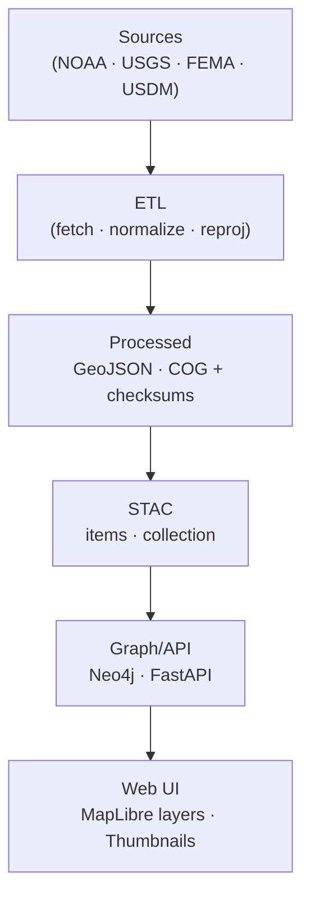
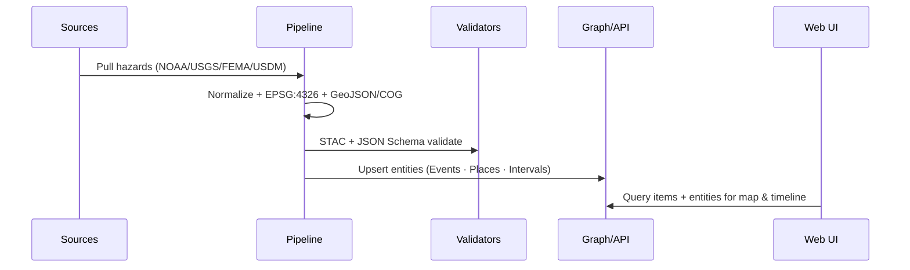

<div align="center">

# ⚠️ Kansas Frontier Matrix — Hazards Metadata  
`data/processed/metadata/hazards/`

**Mission:** Curate, document, and standardize all **processed natural hazard datasets**  
used in Kansas Frontier Matrix — including tornadoes, floods, droughts, wildfires, and severe weather events —  
to build a reproducible spatiotemporal understanding of risk and resilience across Kansas.

[](../../../.github/workflows/site.yml)
[](../../../.github/workflows/stac-validate.yml)
[](../../../.github/workflows/codeql.yml)
[](../../../.github/workflows/trivy.yml)
[](https://pre-commit.com/)
[](../../../docs/)
[](../../../LICENSE)

</div>

---

**Version:** v1.2.0  
**Status:** Stable  
**Last updated:** 2025-10-11

> This README implements **MCP v1.2** — full STAC hooks, deterministic provenance, and verified render-safe Mermaid formatting.

---

## 📚 Overview
This directory stores authoritative **metadata + provenance** for all processed hazard datasets:
tornadoes, floods, wildfires, droughts, and storm events — harmonized under Kansas Frontier Matrix’s spatiotemporal data model.

Each dataset provides:
- **STAC 1.0** metadata (`.json`)
- **SHA-256** checksum sidecars
- **Open license & provenance** manifests
- **Automated JSON Schema + STAC validation**

---

## 🗂️ Directory Layout

```bash
data/processed/metadata/hazards/
├── README.md
├── CHANGELOG.md
├── schema/
│   ├── hazards-item.schema.json
│   └── hazards-collection.schema.json
├── cards/
│   ├── tornado_tracks_1950_2024.md
│   ├── flood_events_1900_2025.md
│   └── wildfire_perimeters_2000_2024.md
├── stac/
│   ├── hazards-collection.json
│   ├── tornado_tracks_1950_2024.json
│   ├── flood_events_1900_2025.json
│   └── wildfire_perimeters_2000_2024.json
├── thumbnails/
│   ├── tornado_tracks_1950_2024.png
│   ├── flood_events_1900_2025.png
│   └── wildfire_perimeters_2000_2024.png
└── checksums/
    ├── tornado_tracks_1950_2024.geojson.sha256
    ├── flood_events_1900_2025.geojson.sha256
    └── wildfire_perimeters_2000_2024.geojson.sha256
````

> Each `.json` under `stac/` maps directly to its dataset under `data/processed/hazards/` and thumbnail under `thumbnails/`.

---

## 🌪️ Hazard Layers

| Layer                           | Source(s)                  | Format        | Spatial Unit  | Temporal Coverage | Output                                                         |
| :------------------------------ | :------------------------- | :------------ | :------------ | :---------------- | :------------------------------------------------------------- |
| Tornado Tracks (1950-2024)      | NOAA SPC                   | GeoJSON       | Line          | 1950-2024         | `data/processed/hazards/tornado_tracks_1950_2024.geojson`      |
| Flood Events (1900-2025)        | NOAA / USGS / FEMA         | GeoJSON + CSV | Point/Polygon | 1900-2025         | `data/processed/hazards/flood_events_1900_2025.geojson`        |
| Wildfire Perimeters (2000-2024) | USGS / USDA Forest Service | GeoJSON       | Polygon       | 2000-2024         | `data/processed/hazards/wildfire_perimeters_2000_2024.geojson` |
| Drought Severity Index          | USDA / NOAA (USDM)         | GeoTIFF (COG) | ~5 km grid    | 2000-2025         | `data/processed/hazards/drought_index_2000_2025.tif`           |

**CRS:** EPSG 4326 (WGS 84)  **Registry:** `data/stac/hazards/`

---

## 💾 STAC Item Example

```json
{
  "stac_version": "1.0.0",
  "type": "Feature",
  "id": "tornado_tracks_1950_2024",
  "collection": "hazards",
  "properties": {
    "title": "Kansas Tornado Tracks (1950–2024)",
    "description": "All recorded tornado tracks in Kansas from the NOAA Storm Prediction Center database.",
    "start_datetime": "1950-01-01T00:00:00Z",
    "end_datetime": "2024-12-31T23:59:59Z",
    "proj:epsg": 4326,
    "kfm:themes": ["hazards", "tornado", "severe_weather"],
    "license": "Public Domain",
    "providers": [
      {"name": "NOAA SPC", "roles": ["producer", "licensor"]},
      {"name": "Kansas Frontier Matrix", "roles": ["processor", "curator"]}
    ]
  },
  "bbox": [-102.05, 36.99, -94.59, 40.00],
  "assets": {
    "data": {"href": "../../processed/hazards/tornado_tracks_1950_2024.geojson", "type": "application/geo+json"},
    "thumbnail": {"href": "../thumbnails/tornado_tracks_1950_2024.png", "type": "image/png"},
    "checksum": {"href": "../checksums/tornado_tracks_1950_2024.geojson.sha256", "type": "text/plain"}
  },
  "links": [{"rel": "collection", "href": "./hazards-collection.json", "type": "application/json"}]
}
```

---

## 🧩 Ontological Alignment

| Entity        | Mapping (CIDOC CRM / OWL-Time)      | Example                  |
| :------------ | :---------------------------------- | :----------------------- |
| Tornado Track | `E5_Event` @ `E53_Place`            | EF-4 Greensburg (2007)   |
| Flood Event   | `E5_Event` + `P7_took_place_at`     | 1951 Kansas River Flood  |
| Wildfire      | `E5_Event` + `E26_Physical_Feature` | 2022 Clark County Fire   |
| Drought Index | `E16_Measurement` + Time Interval   | USDM 2012 Severe Drought |

---

## ⚙️ ETL Workflow

**Entry:** `make hazards` → `src/pipelines/hazards/hazards_pipeline.py`
**Dependencies:** `geopandas pandas numpy rasterio rio-cogeo pyproj requests`

1. Fetch → NOAA/FEMA/USGS/USDM APIs
2. Normalize attributes (date, type, intensity, area)
3. Reproject to EPSG 4326 → GeoJSON / COG
4. Compute per-event stats
5. Generate thumbnails (PNG)
6. Emit STAC items & collections
7. Compute SHA-256 checksums
8. Validate STAC + Schema in CI/CD

---

## 🧮 Provenance & Validation

* **Checksums:** `.sha256` for every asset
* **Licensing:** Upstream Public Domain; derived → CC-BY 4.0
* **Validation:** STAC + JSON Schema in CI
* **Provenance Manifests:** `data/sources/hazards/*.json`

---

## 🔗 Integration Points

| Component                    | Role                                    |
| :--------------------------- | :-------------------------------------- |
| `data/stac/hazards/`         | STAC Items & Collections for discovery  |
| `web/config/layers.json`     | Front-end layer definition (MapLibre)   |
| `src/graph/hazards_nodes.py` | Neo4j bindings (Events · Places · Time) |
| `docs/architecture.md`       | System & pipeline diagrams              |
| `data/processed/hydrology/`  | Flood and drought context layers        |

---

## 🧠 MCP Compliance Summary

| Principle               | Implementation                      |
| :---------------------- | :---------------------------------- |
| **Documentation-first** | README + dataset cards + STAC items |
| **Reproducibility**     | `make hazards` + pinned env         |
| **Open Standards**      | GeoJSON · COG · CSV · STAC          |
| **Provenance**          | Source JSON + SHA-256               |
| **Auditability**        | CI validation & reviewable PRs      |

---

## 🧭 Architecture



% END OF MERMAID %



% END OF MERMAID %

---

## 📦 AI / Graph Bindings

* **Graph IDs:** `event:Tornado_2007_Greensburg` · `place:Kansas_River` · `interval:1951-Flood`
* **API Endpoints:** `/events?type=tornado&start=1950-01-01&end=2024-12-31&bbox=<…>`
  `/entity/{id}` → returns node + linked STAC items
* **NLP enrichment:** event summaries, entity linking, severity bucketing

---

## 📅 Version History

| Version | Date       | Summary                                                              |
| :------ | :--------- | :------------------------------------------------------------------- |
| v1.2.0  | 2025-10-11 | Render-safe Mermaid syntax and new AI/Graph bindings                 |
| v1.1.0  | 2025-10-10 | Added schema, cards, checksums folders; expanded STAC example        |
| v1.0.0  | 2025-10-04 | Initial hazards metadata release (tornado, flood, wildfire, drought) |

> Full log → [`CHANGELOG.md`](./CHANGELOG.md)

---

## 📎 References

* NOAA Storm Events DB — [https://www.ncei.noaa.gov/stormevents/](https://www.ncei.noaa.gov/stormevents/)
* FEMA Disaster Declarations — [https://www.fema.gov/openfema-data-page/disaster-declarations-summaries-v2](https://www.fema.gov/openfema-data-page/disaster-declarations-summaries-v2)
* USGS Wildland Fire Science — [https://www.usgs.gov/programs/wildland-fire-science-program](https://www.usgs.gov/programs/wildland-fire-science-program)
* U.S. Drought Monitor — [https://droughtmonitor.unl.edu/](https://droughtmonitor.unl.edu/)
* MCP Templates — `docs/templates/`

---

<div align="center">

**Kansas Frontier Matrix** — *“Mapping the footprints of disaster across time.”*
📍 [`data/processed/metadata/hazards/`](.)

</div>
```
