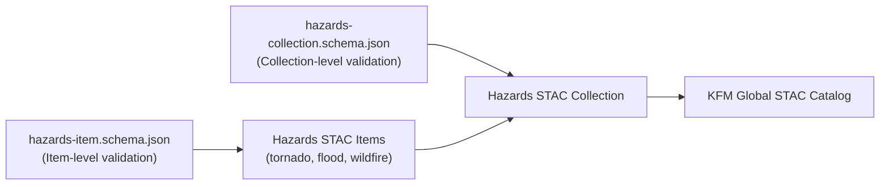

<div align="center">

# 🧩 Kansas Frontier Matrix — Hazards Metadata Schemas  
`data/processed/metadata/hazards/schema/`

**Mission:** Define and validate **JSON Schemas** that govern the structure, integrity, and reproducibility  
of all **hazard metadata records** within the Kansas Frontier Matrix (KFM) system — including tornado, flood,  
wildfire, drought, and composite hazard datasets.

[](../../../../.github/workflows/stac-validate.yml)
[](https://json-schema.org/)
[](../../../../.github/workflows/codeql.yml)
[](../../../../docs/)
[](../../../../LICENSE)

</div>

---

**Version:** v1.0.0  
**Status:** Stable  
**Last updated:** 2025-10-11  

> This directory formalizes KFM’s **hazard metadata schema layer**, supporting **STAC 1.0.0** compatibility,  
> **MCP documentation-first** workflows, and **machine validation** of every hazards metadata JSON file.

---

## 📚 Overview
The `schema/` folder defines two core validation contracts for hazard metadata:

| File | Purpose | Scope |
|:------|:----------|:--------|
| **`hazards-item.schema.json`** | Defines structure for individual STAC Item metadata files. | Dataset-level (e.g., tornado_tracks_1950_2024.json) |
| **`hazards-collection.schema.json`** | Defines structure for the overarching STAC Collection. | Domain-level (e.g., hazards-collection.json) |

Each schema conforms to **JSON Schema Draft 2020-12** and includes references to  
**STAC core**, **KFM extensions**, and **MCP provenance properties**.

---

## 🧮 Validation Workflow

**Automatic CI:**  
All hazard metadata JSON files under  
`data/processed/metadata/hazards/stac/`  
are validated during GitHub Actions runs via:

```bash
make validate-hazards
````

This triggers the CI pipeline defined in
`.github/workflows/stac-validate.yml`, ensuring that:

* All `stac_version`, `id`, `assets`, and `links` fields are present.
* Each metadata file passes both **STAC** and **hazards-item** schema validation.
* Schema references resolve correctly.

---

## 🧠 Schema Design Principles

| MCP Principle           | Implementation                                           |
| :---------------------- | :------------------------------------------------------- |
| **Documentation-first** | Schemas live beside metadata, with explicit versioning.  |
| **Reproducibility**     | Validations are deterministic under pinned environments. |
| **Open Standards**      | JSON Schema Draft 2020-12 + STAC 1.0.0.                  |
| **Traceability**        | `$id`, `$schema`, and `$ref` fields log provenance.      |
| **Auditability**        | CI validation ensures cross-repo consistency.            |

---

## 🧭 Schema Relationships



% END OF MERMAID %

> Each `hazards-item.schema.json` validates individual STAC Items,
> while the `hazards-collection.schema.json` validates the domain collection,
> which then nests under the **global STAC catalog** (`data/stac/catalog.json`).

---

## 🧩 Schema Field Summary

| Field          | Description                                                 | Required | Example                                                       |
| :------------- | :---------------------------------------------------------- | :------- | :------------------------------------------------------------ |
| `stac_version` | STAC spec version.                                          | ✅        | `"1.0.0"`                                                     |
| `id`           | Unique identifier for the dataset.                          | ✅        | `"tornado_tracks_1950_2024"`                                  |
| `collection`   | Reference to parent collection.                             | ✅        | `"hazards"`                                                   |
| `properties`   | Descriptive metadata fields (title, datetime, description). | ✅        | `{ "title": "Kansas Tornado Tracks (1950–2024)" }`            |
| `assets`       | File pointers (data, thumbnail, checksum).                  | ✅        | `{ "data": {"href": "...", "type": "application/geo+json"} }` |
| `links`        | Relationships to collection, license, related items.        | ✅        | `[{"rel":"collection","href":"./hazards-collection.json"}]`   |
| `kfm:themes`   | KFM-specific thematic categories.                           | ⚙️       | `["hazards", "tornado"]`                                      |

---

## 🧪 Example Validation Command

You can run local schema validation via Python:

```bash
python -m jsonschema -i ../stac/tornado_tracks_1950_2024.json hazards-item.schema.json
```

Or, through `make`:

```bash
make stac-validate ITEM=tornado_tracks_1950_2024.json
```

---

## 📦 Integration Points

| Component                                 | Role                                                             |
| :---------------------------------------- | :--------------------------------------------------------------- |
| `data/processed/metadata/hazards/stac/`   | Metadata validated against these schemas.                        |
| `.github/workflows/stac-validate.yml`     | Continuous integration schema validation.                        |
| `src/validation/stac_schema_validator.py` | CLI + Python API validator.                                      |
| `data/processed/metadata/hazards/cards/`  | Human-readable dataset summaries linked to validated STAC items. |

---

## 📅 Version History

| Version | Date       | Summary                                                                                              |
| :------ | :--------- | :--------------------------------------------------------------------------------------------------- |
| v1.0.0  | 2025-10-11 | Initial release — includes STAC Item + Collection schemas, CI validation, and diagram relationships. |

---

<div align="center">

**Kansas Frontier Matrix** — *“Data you can trust, disasters you can trace.”*
📍 [`data/processed/metadata/hazards/schema/`](.)

</div>
```
