<div align="center">

# 🌐 Kansas Frontier Matrix — Hazards STAC Metadata  
`data/processed/metadata/hazards/stac/`

**Mission:** Provide **STAC 1.0-compliant metadata records** describing all processed hazard datasets  
(tornadoes, floods, wildfires, droughts, and compound events) curated within the  
**Kansas Frontier Matrix (KFM)** for reproducible geospatial analysis and public research.

[](../../../../.github/workflows/site.yml)
[](../../../../.github/workflows/stac-validate.yml)
[](https://json-schema.org/)
[](../../../../.github/workflows/codeql.yml)
[](../../../../docs/)
[](../../../../LICENSE)

</div>

---

**Version:** v1.0.0  
**Status:** Stable  
**Last updated:** 2025-10-11  

> This directory implements the **hazards STAC domain** for KFM — a standards-based metadata layer  
> linking hazard-related processed datasets, thumbnails, and checksums to their lineage and provenance.  
> All files here validate against `../schema/hazards-item.schema.json` and  
> `../schema/hazards-collection.schema.json`.

---

## 📚 Overview
The STAC (SpatioTemporal Asset Catalog) structure defines **machine-readable metadata** for  
each hazard dataset, enabling discovery, temporal queries, and integration with the  
KFM knowledge-graph and web viewer.

**Hierarchy**

```bash
data/processed/metadata/hazards/stac/
├── hazards-collection.json
├── tornado_tracks_1950_2024.json
├── flood_events_1900_2025.json
├── wildfire_perimeters_2000_2024.json
└── drought_index_2000_2025.json
````

* **Items (`*.json`)** — individual hazard datasets
* **Collection** — domain container for all hazards
* **Parent** — linked from global `data/stac/catalog.json`

---

## 🧩 STAC Compliance

| Property                | Description                                         | Example                                                      |
| :---------------------- | :-------------------------------------------------- | :----------------------------------------------------------- |
| `stac_version`          | STAC spec version                                   | `"1.0.0"`                                                    |
| `id`                    | Unique dataset ID                                   | `"tornado_tracks_1950_2024"`                                 |
| `collection`            | Parent collection name                              | `"hazards"`                                                  |
| `properties.datetime`   | Representative date/time                            | `"2024-01-01T00:00:00Z"`                                     |
| `proj:epsg`             | CRS code                                            | `4326`                                                       |
| `assets.data.href`      | Link to data asset                                  | `"../../processed/hazards/tornado_tracks_1950_2024.geojson"` |
| `assets.thumbnail.href` | Thumbnail preview                                   | `"../thumbnails/tornado_tracks_1950_2024.png"`               |
| `assets.checksum.href`  | SHA-256 checksum                                    | `"../checksums/tornado_tracks_1950_2024.geojson.sha256"`     |
| `links`                 | References to collection, license, or related items | `[{"rel":"collection","href":"./hazards-collection.json"}]`  |

---

## 🗃️ Collection Summary

`hazards-collection.json` aggregates all hazard items with shared fields:

```json
{
  "stac_version": "1.0.0",
  "type": "Collection",
  "id": "hazards",
  "title": "Kansas Natural Hazards (1900-2025)",
  "description": "Composite catalog of tornado, flood, wildfire, and drought datasets used in Kansas Frontier Matrix.",
  "extent": {
    "spatial": { "bbox": [[-102.05, 36.99, -94.59, 40.00]] },
    "temporal": { "interval": [["1900-01-01T00:00:00Z", "2025-12-31T23:59:59Z"]] }
  },
  "license": "CC-BY-4.0",
  "links": [{ "rel": "root", "href": "../../../stac/catalog.json" }]
}
```

---

## 🧮 Validation Workflow

**CI/CD validation:** `.github/workflows/stac-validate.yml`

```bash
make validate-hazards-stac
```

Validates:

* JSON structure against `hazards-item.schema.json`
* STAC 1.0.0 core compliance
* Presence of `assets.data`, `assets.thumbnail`, and `checksums`

---

## 🧠 Design Philosophy (MCP Alignment)

| MCP Principle           | Implementation                                       |
| :---------------------- | :--------------------------------------------------- |
| **Documentation-first** | Each dataset documented as STAC Item + Markdown Card |
| **Reproducibility**     | Deterministic ETL + Checksums                        |
| **Open Standards**      | STAC 1.0 + JSON Schema 2020-12                       |
| **Traceability**        | `providers` + `license` + `kfm:themes` fields        |
| **Auditability**        | CI validation + SHA-256 verification                 |

---

## 🧭 STAC Integration Flow

```mermaid
flowchart TD
  A["Hazards STAC Items\n(Tornado · Flood · Wildfire · Drought)"] --> B["Hazards Collection\n(hazards-collection.json)"]
  B --> C["Global STAC Catalog\n(data/stac/catalog.json)"]
  C --> D["Knowledge Graph\n(Neo4j · FastAPI Layer)"]
  D --> E["Web UI\n(MapLibre · Timeline Layers)"]
```



% END OF MERMAID %

---

## 🧰 Usage Examples

**Query hazards through CLI**

```bash
stac-client search --collection hazards --bbox -102,36.9,-94.6,40.0 --datetime 2000-01-01/2025-12-31
```

**Programmatic access**

```python
import json, pathlib
item = json.load(open(pathlib.Path("data/processed/metadata/hazards/stac/tornado_tracks_1950_2024.json")))
print(item["properties"]["title"])
```

**Frontend linkage**

The KFM web viewer consumes these STAC Items via `/api/catalog/hazards` endpoint to
populate map overlays, legends, and temporal sliders.

---

## 📦 Integration Points

| Component                    | Role                                        |
| :--------------------------- | :------------------------------------------ |
| `../schema/`                 | JSON Schema definitions for validation      |
| `../../hazards/`             | Processed hazard datasets (GeoJSON / COG)   |
| `../../thumbnails/`          | Thumbnail images for UI display             |
| `../../checksums/`           | SHA-256 hash manifests                      |
| `src/graph/hazards_nodes.py` | Graph entity mapping (Event·Place·Interval) |

---

## 📅 Version History

| Version | Date       | Summary                                                                         |
| :------ | :--------- | :------------------------------------------------------------------------------ |
| v1.0.0  | 2025-10-11 | Initial release — STAC Items + Collection metadata, CI validation, diagram flow |

---

<div align="center">

**Kansas Frontier Matrix** — *“Standardized. Searchable. Spatiotemporal.”*
📍 [`data/processed/metadata/hazards/stac/`](.)

</div>
```
