<div align="center">

# 🖼️ Kansas Frontier Matrix — Hazards Thumbnails  
`data/processed/metadata/hazards/thumbnails/`

**Mission:** Store, document, and validate **thumbnail preview images** for Kansas Frontier Matrix hazard datasets —  
covering **tornadoes, floods, wildfires, drought indices, and compound events** —  
to power **web map layers**, **timeline UI cards**, and **STAC catalog previews**.

[](../../../../.github/workflows/site.yml)
[](../../../../.github/workflows/stac-validate.yml)
[](../../../../docs/)
[](../../../../.github/workflows/codeql.yml)
[](../../../../LICENSE)

</div>

---

**Version:** v1.1.0  
**Status:** Stable  
**Last updated:** 2025-10-11  

> This directory implements **MCP-compliant documentation for visual assets** — lightweight PNG previews  
> that enable data discoverability and fast layer identification in the Kansas Frontier Matrix UI and STAC catalog.

---

## 📚 Overview
The `thumbnails/` folder holds **static image previews** generated for each processed hazard dataset in  
`data/processed/metadata/hazards/`.  

These images support:
- **Web map overlays** (MapLibre + React UI)  
- **STAC `thumbnail` assets** in metadata JSON  
- **Documentation and reports** within GitHub or publications  

All thumbnails are **auto-generated** during the ETL workflow (`make hazards`) and can be safely deleted or regenerated.

---

## 🗂️ Directory Layout

```bash
data/processed/metadata/hazards/thumbnails/
├── README.md
├── tornado_tracks_1950_2024.png
├── flood_events_1900_2025.png
├── wildfire_perimeters_2000_2024.png
└── drought_index_2000_2025.png
````

> Each image name exactly matches the dataset `id` in its STAC record for seamless linking across
> `data/processed/metadata/hazards/` and the web-layer configuration files.

---

## 🌪️ Thumbnail Index

| Dataset                                | Thumbnail                           | Source Dataset                                                 | Description                                             |
| :------------------------------------- | :---------------------------------- | :------------------------------------------------------------- | :------------------------------------------------------ |
| **Tornado Tracks (1950–2024)**         | `tornado_tracks_1950_2024.png`      | `data/processed/hazards/tornado_tracks_1950_2024.geojson`      | Depicts EF-scale tornado paths across Kansas since 1950 |
| **Flood Events (1900–2025)**           | `flood_events_1900_2025.png`        | `data/processed/hazards/flood_events_1900_2025.geojson`        | Map of flood points, zones, and recurrence areas        |
| **Wildfire Perimeters (2000–2024)**    | `wildfire_perimeters_2000_2024.png` | `data/processed/hazards/wildfire_perimeters_2000_2024.geojson` | Burn areas and annual wildfire boundaries               |
| **Drought Severity Index (2000–2025)** | `drought_index_2000_2025.png`       | `data/processed/hazards/drought_index_2000_2025.tif`           | Raster map of drought severity across Kansas            |

---

## 🧰 Generation Workflow

Thumbnails are created automatically during the **Hazards ETL** routine:

1. Run `make hazards` or execute

   ```bash
   python src/pipelines/hazards/hazards_pipeline.py
   ```
2. Each dataset is plotted using `geopandas`, `matplotlib`, and `rasterio.plot` with KFM symbology.
3. The map preview is exported as a **1024×1024 PNG** (`dpi=150`).
4. Saved to this directory (`data/processed/metadata/hazards/thumbnails/`).
5. Referenced in the corresponding STAC Item as:

   ```json
   "thumbnail": { "href": "thumbnails/tornado_tracks_1950_2024.png", "type": "image/png" }
   ```
6. CI checks confirm the presence of each image and validate its MIME type.

---

## 🧮 Specifications & Provenance

| Property          | Specification                                                |
| :---------------- | :----------------------------------------------------------- |
| **Format**        | PNG, ≤1024×1024, ≤500 KB                                     |
| **Color Palette** | KFM Hazard Standard (Red–Yellow–Gray Ramp)                   |
| **Projection**    | EPSG:4326 (WGS84)                                            |
| **Attribution**   | NOAA · USGS · FEMA · USDA public-domain sources              |
| **Regeneration**  | Safe; recreated by `make hazards`                            |
| **Tracking**      | SHA-256 validation via CI presence + metadata link integrity |
| **Usage**         | Embedded in STAC assets, reports, and frontend cards         |

---

## 🧭 Data Flow & Integration

```mermaid
flowchart TD
  A["Processed Hazard Datasets\n(GeoJSON / GeoTIFF)"] --> B["Hazard ETL\n(pipelines/hazards)"]
  B --> C["Auto-Generated Thumbnails\n(PNG, 1024×1024)"]
  C --> D["STAC Items\n(thumbnail assets)"]
  D --> E["Web UI\n(MapLibre · Timeline Previews)"]
  E --> F["Docs & Reports\n(GitHub · MCP Templates)"]
```



% END OF MERMAID %

> Thumbnails connect **data integrity** (STAC) to **visual context** (UI) —
> ensuring the Kansas Frontier Matrix remains transparent and accessible across research layers.

---

## 🧠 MCP Compliance Summary

| MCP Principle           | Implementation                                              |
| :---------------------- | :---------------------------------------------------------- |
| **Documentation-first** | Each image mapped to its STAC metadata record               |
| **Reproducibility**     | Deterministic ETL generation; stored with hash verification |
| **Open Standards**      | PNG + STAC 1.0 `thumbnail` asset                            |
| **Provenance**          | Linked through STAC items and dataset source manifests      |
| **Auditability**        | CI checks for file presence, STAC linkage, and hash match   |

---

## 🧪 Validation in CI

```bash
make validate-thumbnails
```

**Checks performed:**

* File exists for every STAC Item `thumbnail` asset
* PNG header verification (magic bytes `\x89PNG\r\n\x1a\n`)
* File size < 500 KB
* Reference match between STAC item and thumbnail filename

---

## 📅 Version History

| Version    | Date       | Summary                                                                     |
| :--------- | :--------- | :-------------------------------------------------------------------------- |
| **v1.1.0** | 2025-10-11 | Added drought index previews; added CI verification + color standardization |
| **v1.0.0** | 2025-10-04 | Initial release (tornado, flood, wildfire thumbnails)                       |

---

<div align="center">

**Kansas Frontier Matrix** — *“Visualizing the Impact of Natural Forces Through Time.”*
📍 [`data/processed/metadata/hazards/thumbnails/`](.) · Linked to the **Hazards STAC Collection**

</div>
```
