<div align="center">

# 💧 Kansas Frontier Matrix — Hydrology Metadata

`data/processed/metadata/hydrology/`

**Mission:** Curate, document, and standardize all **processed hydrological data layers**
that power Kansas Frontier Matrix’s time-aware exploration of rivers, watersheds, aquifers, and flood events.

[](../../../.github/workflows/site.yml)
[](../../../.github/workflows/stac-validate.yml)
[](../../../.github/workflows/codeql.yml)
[](../../../.github/workflows/trivy.yml)
[](https://pre-commit.com/)
[](../../../docs/)
[](../../../LICENSE)

</div>

---

## 🧭 Overview

This directory documents **metadata and provenance** for all hydrology datasets processed within
the **Kansas Frontier Matrix (KFM)**. These data describe **rivers, basins, aquifers, floods,** and related
water systems across Kansas — standardized for reproducibility, open-science integration, and temporal mapping.

Each dataset includes:

* **STAC 1.0 metadata** (`.json`)
* **Provenance** (source, license, collection date)
* **Checksums** (`data/processed/checksums/hydrology/`)
* **Schema validation** references (`data/processed/metadata/schema/`)
* **MCP reproducibility** documentation

---

## 🗂️ Directory Layout

```bash
data/processed/metadata/hydrology/
├── README.md
├── nhd_flowlines_ks_2020.json
├── watersheds_huc12_2019.json
├── fema_nfhl_2024.json
├── groundwater_levels_2025.json
└── thumbnails/
    ├── nhd_flowlines_ks_2020.png
    ├── watersheds_huc12_2019.png
    ├── fema_nfhl_2024.png
    └── groundwater_levels_2025.png
```

> Each `.json` is a **STAC Item** referencing its dataset under `data/processed/hydrology/`
> and its checksum under `data/processed/checksums/hydrology/`.

---

## 🌊 Hydrology Layers (Processed Assets)

| Dataset                              | Source             | Format  | Spatial Coverage | Temporal Range | Output Path                                              |
| :----------------------------------- | :----------------- | :------ | :--------------- | :------------- | :------------------------------------------------------- |
| **Rivers & Streams (NHD Flowlines)** | USGS NHD / KS DASC | GeoJSON | Statewide        | 2020           | `data/processed/hydrology/nhd_flowlines_ks.geojson`      |
| **Watersheds (HUC-12)**              | USGS WBD / EPA     | GeoJSON | Sub-basins       | 2019           | `data/processed/hydrology/watersheds_huc12_ks.geojson`   |
| **Flood Hazard Zones (NFHL)**        | FEMA NFHL          | GeoJSON | County           | 2024           | `data/processed/hydrology/fema_nfhl_ks.geojson`          |
| **Groundwater Levels (NWIS)**        | USGS NWIS          | GeoJSON | Point (wells)    | 1950–2025      | `data/processed/hydrology/groundwater_levels_ks.geojson` |

All layers use **EPSG:4326 (WGS 84)** and are indexed in `data/stac/hydrology/`.

---

## 💾 Example STAC Metadata

```json
{
  "stac_version": "1.0.0",
  "type": "Feature",
  "id": "watersheds_huc12_2019",
  "properties": {
    "title": "Kansas Hydrologic Unit Boundaries (HUC-12, 2019)",
    "datetime": "2019-06-01T00:00:00Z",
    "description": "Sub-basin hydrologic unit boundaries for Kansas (HUC-12, EPA WBD).",
    "proj:epsg": 4326,
    "themes": ["hydrology", "watersheds"],
    "license": "Public Domain (USGS/EPA)",
    "providers": [
      {"name": "USGS", "roles": ["producer"]},
      {"name": "EPA WBD", "roles": ["licensor"]},
      {"name": "Kansas DASC", "roles": ["processor"]}
    ]
  },
  "assets": {
    "data": {
      "href": "../hydrology/watersheds_huc12_ks.geojson",
      "type": "application/geo+json",
      "roles": ["data"]
    },
    "thumbnail": {
      "href": "thumbnails/watersheds_huc12_2019.png",
      "type": "image/png",
      "roles": ["thumbnail"]
    }
  },
  "bbox": [-102.05, 36.99, -94.59, 40.00]
}
```

---

## 🧩 Semantic & Ontological Alignment

| Entity                  | CIDOC CRM / OWL-Time Mapping       | Example                 |
| :---------------------- | :--------------------------------- | :---------------------- |
| River / Stream          | `E26_Physical_Feature + E53_Place` | Kansas River reach      |
| Watershed               | `E27_Site + E53_Place`             | Smoky Hill Basin        |
| Flood Event             | `E5_Event + P7_took_place_at`      | 1951 Kansas River Flood |
| Groundwater Observation | `E16_Measurement + OWL-Time`       | 2005–2025 well record   |

---

## ⚙️ ETL & Processing Workflow

**Make target:** `make hydrology`
**Python entrypoint:** `src/pipelines/hydrology/hydrology_pipeline.py`
**Dependencies:** `geopandas`, `rasterio`, `rio-cogeo`, `pandas`, `usgs`, `requests`, `pyproj`

```mermaid
flowchart TD
  A["Raw Hydrology Sources\n(USGS · EPA · FEMA · DASC)"] --> B["ETL Pipeline\n(Python + Makefile)"]
  B --> C["Processing\nReproject -> Simplify -> Export GeoJSON/COG"]
  C --> D["Derivative Generation\nWatersheds · Flowlines · Flood Zones"]
  D --> E["STAC Metadata + Checksums\n(JSON · .sha256)"]
  E --> F["Knowledge Graph Linkage\n(CIDOC CRM / OWL-Time)"]
  F --> G["Web Visualization\nReact + MapLibre Hydrology Layers"]
```



<!-- END OF MERMAID -->

% END OF MERMAID %

---

## 🧮 Provenance & Validation

* **Checksums:** SHA-256 under `data/processed/checksums/hydrology/`
* **Licensing:** Public Domain or CC-BY (derived)
* **Validation:** JSON Schema + STAC CI checks
* **Sources:** Documented in `data/sources/hydrology/*.json`

---

## 🔗 Integration Points

| Component                             | Role                                     |
| :------------------------------------ | :--------------------------------------- |
| `data/stac/hydrology/`                | STAC Items for discovery                 |
| `src/graph/hydrology_nodes.py`        | Knowledge-graph ingestion                |
| `web/config/layers.json`              | Hydrology layer configuration in web map |
| `data/processed/checksums/hydrology/` | Integrity linkage                        |
| `docs/architecture.md`                | Architectural flow reference             |

---

## ♿ Accessibility (Web UI / Docs)

* Provide clear layer legends and tooltips.
* Use color contrast AA+ for flood zones and flowlines.
* Ensure keyboard navigation and focus states in map controls.

---

## 🧠 MCP Compliance Matrix

| MCP Principle           | Implementation                           |
| :---------------------- | :--------------------------------------- |
| **Documentation-first** | README + per-dataset STAC metadata       |
| **Reproducibility**     | Deterministic Makefile + Python pipeline |
| **Open Standards**      | GeoJSON · COG · STAC · JSON Schema       |
| **Provenance**          | Source URLs + SHA-256 hashes + logs      |
| **Auditability**        | Automated CI validation + checksums      |

---

## 🧾 Version & Change Log

| Version | Date       | Author   | Summary                                                 |
| :------ | :--------- | :------- | :------------------------------------------------------ |
| v1.1.0  | 2025-10-11 | A. Barta | Added Mermaid workflow, JSON-LD AI metadata, A11y notes |
| v1.0.0  | 2025-10-04 | A. Barta | Initial hydrology metadata release                      |

---

## 🤖 AI & JSON-LD Discoverability

```html
<script type="application/ld+json">
{
  "@context": ["https://schema.org", {"dcat": "http://www.w3.org/ns/dcat#"}],
  "@type": "Dataset",
  "name": "Kansas Hydrology Metadata Collection",
  "description": "Processed hydrological datasets (rivers, watersheds, aquifers, floods) within the Kansas Frontier Matrix.",
  "keywords": ["Kansas","hydrology","watershed","river","flood","aquifer","STAC"],
  "license": "https://creativecommons.org/licenses/by/4.0/",
  "spatialCoverage": "Kansas, USA",
  "temporalCoverage": "1950-01-01/2025-12-31",
  "distribution": [{
    "@type": "DataDownload",
    "encodingFormat": "application/geo+json",
    "contentUrl": "../hydrology/watersheds_huc12_ks.geojson"
  }]
}
</script>
```

---

## 📚 References

* [USGS National Hydrography Dataset (NHD)](https://www.usgs.gov/national-hydrography)
* [EPA Watershed Boundary Dataset (WBD)](https://www.epa.gov/waterdata/watershed-boundary-dataset-wbd)
* [FEMA NFHL](https://msc.fema.gov/nfhl)
* [USGS NWIS Groundwater](https://waterdata.usgs.gov/nwis/gw)
* [Master Coder Protocol Docs](../../../docs/templates/)

---

<div align="center">

**Kansas Frontier Matrix** — *“Mapping the Lifeblood of the Plains: Rivers, Floods, and Aquifers.”*
📍 [`data/processed/metadata/hydrology/`](.) · Integrated within the **Hydrology STAC Collection**

</div>
