<div align="center">

# 🖼️ Kansas Frontier Matrix — Hydrology Thumbnails

`data/processed/metadata/hydrology/thumbnails/`

**Mission:** Maintain **thumbnail preview images** for processed hydrology datasets — rivers, watersheds, flood zones, and groundwater — used across the **web viewer**, **STAC catalog**, and **documentation**.

[](../../../../.github/workflows/site.yml)
[](../../../../docs/)
[](../../../../LICENSE)

</div>

---

## 🧭 Overview

This directory stores **static PNG thumbnails** that summarize hydrology datasets documented in
`data/processed/metadata/hydrology/`.

Thumbnails are:

* **Auto-generated** in the hydrology ETL (`make hydrology-thumbnails`)
* **Linked** from each dataset’s STAC Item via the `"thumbnail"` asset
* **Consumed** by the KFM web UI (layer cards, legends) and by READMEs/reports

Target size is **≤1024×1024** and **≤500 KB** per image for fast loading.

---

## 🗂️ Directory Layout

```bash
data/processed/metadata/hydrology/thumbnails/
├── README.md
├── nhd_flowlines_ks_2020.png
├── watersheds_huc12_2019.png
├── fema_nfhl_2024.png
└── groundwater_levels_2025.png
```

> Each `.png` is referenced from a STAC Item in `data/processed/metadata/hydrology/*.json`.

---

## 🌊 Thumbnail Index

| Dataset                              | Thumbnail File                | Source Data                                              | Description                                           |
| :----------------------------------- | :---------------------------- | :------------------------------------------------------- | :---------------------------------------------------- |
| **Rivers & Streams (NHD Flowlines)** | `nhd_flowlines_ks_2020.png`   | `data/processed/hydrology/nhd_flowlines_ks.geojson`      | Statewide river/stream network visualization.         |
| **Watersheds (HUC-12)**              | `watersheds_huc12_2019.png`   | `data/processed/hydrology/watersheds_huc12_ks.geojson`   | Sub-basin boundaries (HUC-12 polygons).               |
| **Flood Hazard Zones (NFHL)**        | `fema_nfhl_2024.png`          | `data/processed/hydrology/fema_nfhl_ks.geojson`          | FEMA floodplain and hazard zone overlay.              |
| **Groundwater Levels (NWIS)**        | `groundwater_levels_2025.png` | `data/processed/hydrology/groundwater_levels_ks.geojson` | Monitoring wells, level ranges, and density patterns. |

---

## ⚙️ Generation Workflow

**Makefile target**

```bash
make hydrology-thumbnails
```

**Python CLI**

```bash
python src/pipelines/hydrology/hydrology_pipeline.py --generate-thumbnails
```

**Steps**

1. Load datasets from `data/processed/hydrology/` (GeoJSON/COG).
2. Render with `matplotlib` + `geopandas` / `rasterio.plot`.
3. Apply **Hydrology theme** (deep blue = rivers, cyan = flood zones, tan = watershed fill, gray = boundaries).
4. Export PNG (≤1024×1024, ≤500 KB).
5. Save here and set `assets.thumbnail` in each dataset’s STAC Item.

### Pipeline (Mermaid)

```mermaid
flowchart TD
  A["Processed Hydrology Layers\n(GeoJSON / COG)"] --> B["Renderer\n(matplotlib · geopandas · rasterio)"]
  B --> C["Style\n(Hydrology Palette · Legend · Frame)"]
  C --> D["Export PNG\n<=1024x1024 · <=500 KB"]
  D --> E["Write to Thumbnails Dir"]
  E --> F["Update STAC Items\nassets.thumbnail = *.png"]
  F --> G["Web UI\nLayer Cards · Legends · Previews"]
```



<!-- END OF MERMAID -->

---

## 🧮 Specifications & Provenance

| Property         | Spec / Policy                                                            |
| :--------------- | :----------------------------------------------------------------------- |
| **File Type**    | PNG (`image/png`)                                                        |
| **Max Size**     | 1024×1024 px, ≤ 500 KB                                                   |
| **Projection**   | EPSG:4326 (WGS 84) or static cartographic frame                          |
| **Palette**      | Rivers = deep blue · Flood = cyan · Watersheds = tan · Boundaries = gray |
| **Attribution**  | Derived from USGS NHD / EPA WBD / FEMA NFHL / KS DASC / USGS NWIS        |
| **Regeneration** | Safe to delete — rebuilt by `make hydrology-thumbnails`                  |

---

## 🔗 STAC Integration (example)

```json
{
  "assets": {
    "data": {
      "href": "../hydrology/watersheds_huc12_ks.geojson",
      "type": "application/geo+json",
      "roles": ["data"]
    },
    "thumbnail": {
      "href": "./thumbnails/watersheds_huc12_2019.png",
      "type": "image/png",
      "roles": ["thumbnail"],
      "title": "Preview — Watersheds (HUC-12, 2019)"
    }
  }
}
```

---

## ♿ Accessibility (A11y)

* Provide **alt text** for each thumbnail (e.g., *“FEMA NFHL flood zones, Kansas (2024)”*).
* Use clear **legends** and avoid relying on color alone; add **labels** where possible.
* Maintain adequate **contrast** for small preview cards.

---

## 🧠 MCP Compliance Summary

| MCP Principle           | Implementation                                                 |
| :---------------------- | :------------------------------------------------------------- |
| **Documentation-first** | README + STAC Items reference thumbnails                       |
| **Reproducibility**     | Deterministic, scripted rendering in ETL                       |
| **Open Standards**      | PNG assets referenced via STAC `"thumbnail"` role              |
| **Provenance**          | Source lineage & licenses inherit from underlying datasets     |
| **Auditability**        | Regenerated via CI; optional checksums for immutability checks |

---

## 🧾 Version History

| Version | Date       | Author   | Summary                                                                |
| :-----: | :--------- | :------- | :--------------------------------------------------------------------- |
|  v1.1.0 | 2025-10-11 | A. Barta | Added Mermaid workflow, A11y guidance, STAC asset example, size policy |
|  v1.0.0 | 2025-10-04 | A. Barta | Initial hydrology thumbnails (NHD, WBD, NFHL, NWIS)                    |

---

<div align="center">

**Kansas Frontier Matrix** — *“Visualizing the Flow: Rivers, Basins, and Beyond.”*
📍 [`data/processed/metadata/hydrology/thumbnails/`](.) · Linked to the **Hydrology STAC Collection**

</div>
