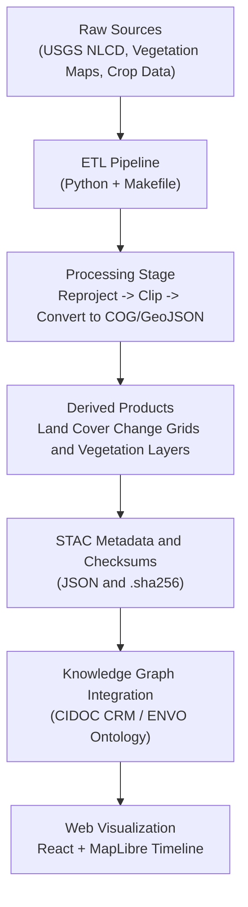

<div align="center">

# 🌾 Kansas Frontier Matrix — Land Cover Metadata

`data/processed/metadata/landcover/`

**Mission:** Curate, document, and standardize all **processed land cover and vegetation datasets**
that power Kansas Frontier Matrix’s ecological change analyses — tracing landscapes from
**pre-settlement prairies to contemporary cropland mosaics.**

[](../../../.github/workflows/site.yml)
[](../../../.github/workflows/stac-validate.yml)
[](../../../.github/workflows/codeql.yml)
[](../../../.github/workflows/trivy.yml)
[](https://pre-commit.com/)
[](../../../docs/)
[](../../../LICENSE)

</div>

---

## 🧭 Overview

This directory holds **metadata and provenance documentation** for all processed **land cover and vegetation datasets**
within the **Kansas Frontier Matrix (KFM)** ecosystem.

Each record provides:

* STAC-compliant metadata (`.json`)
* SHA-256 checksum verification (`.sha256`)
* License and provenance data
* Schema validation against shared MCP + STAC schemas (`data/processed/metadata/schema/`)

These records connect the **ETL workflows**, **STAC catalog**, and **Neo4j Knowledge Graph**,
ensuring end-to-end traceability and auditability.

---

## 🗂️ Directory Layout

```bash
data/processed/metadata/landcover/
├── README.md
├── nlcd_1992_2021.json
├── vegetation_1850s.json
├── landcover_change_1992_2021.json
└── thumbnails/
    ├── nlcd_1992_2021.png
    ├── vegetation_1850s.png
    └── landcover_change_1992_2021.png
```

> Each `.json` file is a **STAC Item** describing a processed land cover dataset under `data/processed/landcover/`.
> The `/thumbnails/` directory provides preview images for the web map UI (React + MapLibre).

---

## 🧬 Data Layers Summary

| Layer                             | Source                   | Format        | Resolution | Temporal Range | Output Path                                                   |
| :-------------------------------- | :----------------------- | :------------ | :--------- | :------------- | :------------------------------------------------------------ |
| **NLCD Land Cover (1992–2021)**   | USGS NLCD                | GeoTIFF (COG) | 30 m       | 1992–2021      | `data/processed/landcover/nlcd_1992_2021.tif`                 |
| **Pre-Settlement Vegetation Map** | Kansas Biological Survey | GeoTIFF (COG) | ~1 km      | ca. 1850s      | `data/processed/landcover/kansas_vegetation_1850s.tif`        |
| **Land Cover Change (1992–2021)** | Derived (NLCD)           | GeoJSON       | 30 m       | 1992–2021      | `data/processed/landcover/landcover_change_1992_2021.geojson` |

All rasters are **EPSG:4326 (WGS 84)** and indexed in the STAC catalog under `data/stac/landcover/`.

---

## 🗺️ STAC Metadata Example

```json
{
  "stac_version": "1.0.0",
  "type": "Feature",
  "id": "nlcd_1992_2021",
  "properties": {
    "title": "National Land Cover Database (NLCD 1992–2021)",
    "description": "Land cover classification for Kansas derived from USGS NLCD.",
    "datetime": "2021-01-01T00:00:00Z",
    "proj:epsg": 4326,
    "themes": ["landcover", "ecology", "vegetation"],
    "license": "Public Domain (USGS)",
    "providers": [
      {"name": "USGS", "roles": ["producer"]},
      {"name": "Kansas DASC", "roles": ["processor"]},
      {"name": "Kansas Biological Survey", "roles": ["curator"]}
    ]
  },
  "assets": {
    "data": {
      "href": "../landcover/nlcd_1992_2021.tif",
      "type": "image/tiff; application=geotiff; profile=cloud-optimized",
      "roles": ["data"]
    }
  },
  "bbox": [-102.05, 36.99, -94.59, 40.00]
}
```

---

## 🌐 Semantic & Ontological Mappings

| Entity              | CIDOC CRM / ENVO Mapping               | Example                      |
| :------------------ | :------------------------------------- | :--------------------------- |
| Land Cover Raster   | `E73_Information_Object` + `E53_Place` | NLCD classified raster       |
| Vegetation Type     | `E55_Type` + `P2_has_type`             | “Tallgrass Prairie”          |
| Change Event        | `E5_Event` + `P7_took_place_at`        | 1992–2021 cropland expansion |
| Dataset Publication | `E31_Document` + `P94_has_created`     | NLCD 2021 release            |

Interlinking through these mappings ensures machine-readable interoperability
with the broader **Frontier Matrix Knowledge Graph** and external ontologies.

---

## ⚙️ ETL & Processing Workflow

**Pipeline:** `make landcover` → runs `src/pipelines/landcover/landcover_pipeline.py`
**Dependencies:** `rasterio`, `rio-cogeo`, `geopandas`, `numpy`, `pandas`, `GDAL`



<!-- END OF MERMAID -->

% END OF MERMAID %

---

## 🧮 Provenance & Validation

* **Checksums:** `.sha256` manifests for all COG and GeoJSON assets
* **Licensing:** USGS Public Domain → Derived CC-BY 4.0
* **Validation:** JSON Schema + STAC 1.0.0 + CI (STAC Validator)
* **Provenance:** Lineage and source URLs under `data/sources/landcover/`

---

## 🧠 MCP Compliance Matrix

| MCP Principle           | Implementation                      |
| :---------------------- | :---------------------------------- |
| **Documentation-first** | README + STAC per dataset           |
| **Reproducibility**     | Deterministic Makefile + Python ETL |
| **Open Standards**      | GeoTIFF (COG), GeoJSON, CSV         |
| **Provenance**          | Source URLs + SHA-256 hashes        |
| **Auditability**        | CI validation + checksum tests      |

---

## 🧾 Versioning & Change Log

| Version    | Date       | Author   | Description                                                    |
| :--------- | :--------- | :------- | :------------------------------------------------------------- |
| **v1.1.0** | 2025-10-11 | A. Barta | Added versioning, Mermaid diagram, JSON-LD AI metadata         |
| **v1.0.0** | 2025-10-04 | A. Barta | Initial metadata release — NLCD, vegetation, and change layers |

> Follow [Semantic Versioning 2.0.0](https://semver.org/).
> Dataset versions are tracked via STAC Item IDs and commit hashes.

---

## 🧠 AI & JSON-LD Discoverability

```html
<script type="application/ld+json">
{
  "@context": ["https://schema.org", {"dcat":"http://www.w3.org/ns/dcat#"}],
  "@type": "Dataset",
  "name": "Kansas Land Cover and Vegetation Metadata",
  "description": "Processed land cover and vegetation metadata within the Kansas Frontier Matrix.",
  "keywords": ["Kansas","landcover","vegetation","NLCD","GIS","STAC"],
  "license": "https://creativecommons.org/licenses/by/4.0/",
  "temporalCoverage": "1850-01-01/2021-12-31",
  "spatialCoverage": "Kansas, USA",
  "distribution": [{
    "@type": "DataDownload",
    "encodingFormat": "application/json",
    "contentUrl": "../landcover/nlcd_1992_2021.json"
  }]
}
</script>
```

---

## 📚 References

* [USGS NLCD](https://www.usgs.gov/centers/eros/science/national-land-cover-database)
* [Kansas Biological Survey](https://biosurvey.ku.edu/)
* [USDA Cropland Data Layer](https://nassgeodata.gmu.edu/CropScape/)
* [Cloud-Optimized GeoTIFF Spec](https://www.cogeo.org/)
* [Master Coder Protocol Docs](../../../docs/templates/)

---

<div align="center">

**Kansas Frontier Matrix** — *Mapping the Living Surface of the Kansas Frontier*
📍 [`data/processed/metadata/landcover/`](.) · integrated with the **STAC Data Catalog**

</div>
