<div align="center">

# 🖼️ Kansas Frontier Matrix — Land Cover Thumbnails

`data/processed/metadata/landcover/thumbnails/`

**Mission:** Store and document **thumbnail preview images** for Kansas Frontier Matrix’s
processed land-cover datasets — historical vegetation, NLCD classifications, and
derived change-detection maps — for use in the **web viewer**, **STAC catalog**, and **docs**.

[](../../../../.github/workflows/site.yml)
[](../../../../docs/)
[](../../../../LICENSE)

</div>

---

## 🧭 Overview

This directory contains **thumbnail PNGs** generated from processed land-cover datasets documented in
`data/processed/metadata/landcover/`.

Thumbnails support:

* **KFM Web Map** layer cards and selection menus
* **STAC Items** (as `"thumbnail"` assets)
* **Documentation** previews, reports, and READMEs

Thumbnails are produced during the ETL workflow and can be **safely regenerated** any time.

---

## 🗂️ Directory Layout

```bash
data/processed/metadata/landcover/thumbnails/
├── README.md
├── nlcd_1992_2021.png
├── kansas_vegetation_1850s.png
├── landcover_change_1992_2021.png
└── crop_distribution_2020.png
```

> Each `.png` corresponds to a dataset in `data/processed/metadata/landcover/` and is linked from its STAC Item (`"thumbnail"` asset).

---

## 🌾 Thumbnail Index

| Dataset                             | Thumbnail File                   | Source Data                                                   | Description                                                               |
| :---------------------------------- | :------------------------------- | :------------------------------------------------------------ | :------------------------------------------------------------------------ |
| **NLCD Land Cover (1992–2021)**     | `nlcd_1992_2021.png`             | `data/processed/landcover/nlcd_1992_2021.tif`                 | Kansas land-cover classes across 1992–2021 (USGS NLCD).                   |
| **Historic Vegetation (ca. 1850s)** | `kansas_vegetation_1850s.png`    | `data/processed/landcover/kansas_vegetation_1850s.tif`        | Reconstruction of pre-settlement vegetation (prairie, forest, wetlands).  |
| **Land Cover Change (1992–2021)**   | `landcover_change_1992_2021.png` | `data/processed/landcover/landcover_change_1992_2021.geojson` | Spatial shifts from natural vegetation toward cropland/urban development. |
| **Crop Distribution (2020)**        | `crop_distribution_2020.png`     | `data/processed/landcover/crop_distribution_2020.geojson`     | Dominant crop types by county (USDA CDL).                                 |

---

## ⚙️ Thumbnail Generation Workflow

**Makefile target**

```bash
make landcover-thumbnails
```

**Python CLI**

```bash
python src/pipelines/landcover/landcover_pipeline.py --generate-thumbnails
```

**Steps**

1. Load raster/vector layers from `data/processed/landcover/`.
2. Render with `matplotlib` + `geopandas` / `rasterio.plot`.
3. Apply KFM palette and cartographic framing.
4. Export PNG (`<=1024×1024`, `<=500 KB`).
5. Save here and **write path to the dataset’s STAC Item** (`assets.thumbnail`).

### Mermaid (pipeline view)

```mermaid
flowchart TD
  A["Processed Layers\n(GeoTIFF COG / GeoJSON)"] --> B["Render Engine\n(matplotlib · geopandas · rasterio)"]
  B --> C["Styling\n(KFM Palette · Legend · Frame)"]
  C --> D["Export PNG\n<=1024×1024 · <=500 KB"]
  D --> E["Save to Thumbnails Dir"]
  E --> F["Wire into STAC\nassets.thumbnail = *.png"]
  F --> G["Web UI\nLayer Cards & Previews"]
```



<!-- END OF MERMAID -->

% END OF MERMAID %

---

## 🧮 Specifications & Provenance

| Property         | Spec / Policy                                                          |
| :--------------- | :--------------------------------------------------------------------- |
| **File Type**    | PNG (`image/png`)                                                      |
| **Max Size**     | 1024×1024 px, ≤ 500 KB                                                 |
| **Projection**   | EPSG:4326 (WGS 84) for overlays; static cartographic frame for rasters |
| **Palette**      | Vegetation = green; Cropland = tan; Urban/Barren = gray; Water = blue  |
| **Attribution**  | Derived from USGS NLCD, USDA CDL, Kansas Biological Survey             |
| **Regeneration** | Safe to delete — recreated by `make landcover-thumbnails`              |

---

## 🏷️ Naming, Linting & Storage

* **Convention:** `<dataset_id>[_year|_range].png` (e.g., `nlcd_1992_2021.png`).
* **Alt text (docs/web):** short, specific (e.g., *“NLCD land cover mosaic (1992–2021), Kansas”*).
* **Git LFS:** Not required at ≤500 KB; if larger, consider LFS.
* **Checksums:** Optional `.sha256` for reproducibility if used externally.

---

## 🔗 STAC Integration (example asset)

```json
{
  "assets": {
    "data": {
      "href": "../landcover/nlcd_1992_2021.tif",
      "type": "image/tiff; application=geotiff; profile=cloud-optimized",
      "roles": ["data"]
    },
    "thumbnail": {
      "href": "./thumbnails/nlcd_1992_2021.png",
      "type": "image/png",
      "roles": ["thumbnail"],
      "title": "Preview — NLCD Land Cover (1992–2021)"
    }
  }
}
```

---

## ♿ Accessibility (A11y) Notes

* Provide **alt text** and, where applicable, a short **caption** in docs/UI.
* Avoid color-only encoding; include **legend** or **labels** if space allows.
* Keep contrast adequate for small cards (target AA where possible).

---

## 🧠 MCP Compliance Summary

| MCP Principle           | Implementation                                                       |
| :---------------------- | :------------------------------------------------------------------- |
| **Documentation-first** | README + per-dataset references back to STAC                         |
| **Reproducibility**     | Deterministic render settings; regenerated via Make/CLI              |
| **Open Standards**      | PNG assets; linked via STAC `"thumbnail"` roles                      |
| **Provenance**          | Source lineage and licenses inherited from underlying datasets       |
| **Auditability**        | Regeneration is scripted; optional checksums for immutability checks |

---

## 🧾 Versioning & Change Log

| Version | Date       | Author   | Summary                                                           |
| :-----: | :--------- | :------- | :---------------------------------------------------------------- |
|  v1.1.0 | 2025-10-11 | A. Barta | Added pipeline Mermaid, STAC asset example, A11y, and naming spec |
|  v1.0.0 | 2025-10-04 | A. Barta | Initial release of land-cover thumbnails                          |

---

<div align="center">

**Kansas Frontier Matrix** — *“Visualizing the Changing Landscape of the Great Plains.”*
📍 [`data/processed/metadata/landcover/thumbnails/`](.) · Linked to the **Land Cover STAC Collection**

</div>
