<div align="center">

# 🧾 Kansas-Frontier-Matrix — Metadata Schema Examples

`data/processed/metadata/schema/examples/`

**Mission:** Provide **practical JSON examples** demonstrating correct and incorrect implementations
of metadata records validated against the **MCP + STAC hybrid schemas**.
These examples act as **reference blueprints** for contributors creating new dataset metadata
within the Kansas Frontier Matrix repository.

[](../../../../../.github/workflows/site.yml)
[](../../../../../.github/workflows/stac-validate.yml)
[](../../../../../.github/workflows/codeql.yml)
[](../../../../../docs/)
[](../../../../../docs/ai/)
[](../../../../../LICENSE)
[](../../../../../LICENSE)

</div>

---

## 📌 Version

| Attribute           | Value                                         |
| ------------------- | --------------------------------------------- |
| **Version**         | `v1.3.0`                                      |
| **Status**          | ✅ Stable                                      |
| **Last Updated**    | 2025-10-11                                    |
| **Maintainers**     | @andy-barta · @matrix-core-team               |
| **Compatible With** | MCP ≥1.1 • STAC ≥1.0.0 • JSON Schema ≥2020-12 |

---

## 📚 Table of Contents

* [Overview](#overview)
* [Directory Layout](#directory-layout)
* [Validation Flow (Mermaid)](#validation-flow-mermaid)
* [Purpose of Examples](#purpose-of-examples)
* [Valid Examples](#valid-examples)

  * [Raster (COG) — Valid](#raster-cog--valid)
  * [Vector (GeoJSON) — Valid](#vector-geojson--valid)
  * [Tabular (CSV/Parquet) — Valid](#tabular-csvparquet--valid)
* [Invalid Examples](#invalid-examples)
* [Usage in Validation](#usage-in-validation)
* [Best Practices](#best-practices)
* [Change Log](#change-log)
* [References](#references)
* [MCP Checklist](#mcp-checklist)

---

## 🧠 Overview

This folder contains **reference JSON metadata examples** showing how dataset metadata files **should** (and **should not**) conform to the **processed metadata schema** (`processed_item.schema.json`) and the **STAC 1.0.0** standard.
They serve as **learning aids** and **CI fixtures** to keep the project’s metadata consistent, interoperable, and reproducible.

---

## 🧱 Directory Layout

```bash
data/
└── processed/
    └── metadata/
        └── schema/
            └── examples/
                ├── valid_metadata_example.json        # Raster example (COG)
                ├── valid_vector_example.json          # Vector example (GeoJSON)
                ├── valid_tabular_example.json         # Tabular example (CSV/Parquet)
                ├── invalid_metadata_example.json      # Intentionally fails schema
                └── README.md
```

---

## 🔄 Validation Flow (Mermaid)

```mermaid
flowchart TD
  A["Author creates metadata\n(data/processed/metadata/**/*.json)"] --> B["Local Validation\n(JSON Schema + MCP Rules)"]
  B -->|pass| C["Commit & PR"]
  B -->|fail| A
  C --> D["CI: STAC + MCP Validators\n(.github/workflows/stac-validate.yml)"]
  D -->|pass| E["Publish STAC Items\n(data/stac/**)"]
  D -->|fail| C
  E --> F["Graph/API\n(Neo4j · FastAPI)"]
  F --> G["Web UI\n(MapLibre · Timeline)"]
  G --> H["AI Validation Hints\n(LLM report artifacts)"]
  %% End of flow
```



*(Note: use `%%` for comments inside Mermaid code blocks.)*

---

## 🎯 Purpose of Examples

* **Templates** for terrain, climate, hydrology, hazards, landcover, etc.
* **Training data** for validation tools (local + CI).
* **Quick triage** of common mistakes (fields, formats, semantics).
* Reinforce **MCP documentation-first reproducibility**.

---

## ✅ Valid Examples

### Raster (COG) — Valid

`valid_metadata_example.json`

```json
{
  "type": "Feature",
  "stac_version": "1.0.0",
  "id": "terrain_slope_1m_ks",
  "properties": {
    "title": "Terrain Slope (1m) – Kansas LiDAR DEM",
    "datetime": "2020-01-01T00:00:00Z",
    "description": "Slope raster derived from 1m LiDAR DEM data using GDAL slope function.",
    "processing:software": "GDAL 3.8.0; Python 3.11",
    "mcp_provenance": "sha256:a7c9e1…",
    "derived_from": ["data/raw/terrain/dem_1m_ks.tif"],
    "spatial_extent": [-102.05, 36.99, -94.59, 40.01],
    "temporal_extent": { "start": "2018-01-01", "end": "2020-12-31" },
    "license": "CC-BY 4.0",
    "keywords": ["DEM", "terrain", "slope", "Kansas"]
  },
  "assets": {
    "data": {
      "href": "../../terrain/terrain_slope_1m_ks.tif",
      "type": "image/tiff; application=geotiff; profile=cloud-optimized",
      "roles": ["data"]
    },
    "checksum": {
      "href": "../../terrain/terrain_slope_1m_ks.tif.sha256",
      "type": "text/plain",
      "roles": ["metadata"]
    }
  }
}
```

**Why it passes**

* Conforms to STAC `Item` structure + KFM MCP fields
* Correct bbox order `[W, S, E, N]`
* Open license; provenance + asset checksum present

---

### Vector (GeoJSON) — Valid

`valid_vector_example.json`

```json
{
  "type": "Feature",
  "stac_version": "1.0.0",
  "id": "hydrology_streams_v1_ks",
  "properties": {
    "title": "Hydrology — Stream Network (Generalized)",
    "datetime": "2021-06-01T00:00:00Z",
    "description": "Generalized stream lines derived from NHD for statewide visualization.",
    "processing:software": "ogr2ogr 3.8.0; Python 3.11",
    "mcp_provenance": "sha256:3b1f2c…",
    "derived_from": ["data/raw/nhd/nhd_flowline.gpkg"],
    "spatial_extent": [-102.05, 36.99, -94.59, 40.01],
    "temporal_extent": { "start": "2019-01-01", "end": "2021-06-01" },
    "license": "CC-BY 4.0",
    "keywords": ["hydrology", "NHD", "streams", "Kansas"]
  },
  "assets": {
    "data": {
      "href": "../../hydrology/streams_generalized_ks.geojson",
      "type": "application/geo+json",
      "roles": ["data"]
    }
  }
}
```

---

### Tabular (CSV/Parquet) — Valid

`valid_tabular_example.json`

```json
{
  "type": "Feature",
  "stac_version": "1.0.0",
  "id": "climate_normals_1991_2020_station_monthly",
  "properties": {
    "title": "Climate Normals (1991–2020) — Station Monthly",
    "datetime": "2020-12-31T23:59:59Z",
    "description": "Monthly normals (TMAX, TMIN, PRCP) for Kansas stations.",
    "processing:software": "pandas 2.2; Python 3.11",
    "mcp_provenance": "sha256:c91a77…",
    "derived_from": ["data/raw/noaa/normals_1991_2020.parquet"],
    "spatial_extent": [-102.05, 36.99, -94.59, 40.01],
    "temporal_extent": { "start": "1991-01-01", "end": "2020-12-31" },
    "license": "CC-BY 4.0",
    "keywords": ["NOAA", "climate", "normals", "Kansas"]
  },
  "assets": {
    "data": {
      "href": "../../climate/normals_1991_2020_station_monthly.parquet",
      "type": "application/x-parquet",
      "roles": ["data"]
    },
    "preview": {
      "href": "../../climate/normals_1991_2020_station_monthly.csv",
      "type": "text/csv",
      "roles": ["metadata", "alternate"]
    }
  }
}
```

---

## ❌ Invalid Examples

`invalid_metadata_example.json`

```json
{
  "id": "terrain_slope_1m",
  "title": "Slope Map – Kansas",
  "description": "Missing required STAC fields and incorrect keys.",
  "processing-software": "GDAL",
  "license": "Proprietary",
  "spatial_extent": [102.05, 36.99, 94.59, 40.01]
}
```

**Why it fails**

* Missing `type` and `stac_version`
* Uses `processing-software` (wrong); should be `processing:software`
* Non-approved license (`Proprietary`)
* Bbox order incorrect (must be `W, S, E, N`)
* No `assets`, `mcp_provenance`, or `derived_from`

---

## ⚙️ Usage in Validation

**Local (recommended):**

```bash
# Validate all example files
make validate-metadata

# Validate a single file
python tools/validate_json.py data/processed/metadata/schema/examples/valid_metadata_example.json
```

**CI (automatic):**

* `.github/workflows/stac-validate.yml` runs:

  1. JSON Schema (processed_item.schema.json)
  2. STAC 1.0 validation (stac_item.schema.json)
  3. MCP rules (validation_rules.json: checksums, id regex, path linkage)

**Outputs:** `validation_report.json` (artifact) with pass/fail summary and hints.

---

## 🧭 Best Practices

* Start from a **valid example** closest to your domain (raster/vector/tabular).
* Keep IDs **lower_snake_case**, deterministic, and stable across updates.
* Ensure **`datetime` ⊆ `temporal_extent`** and bbox is `[W, S, E, N]`.
* Always add a `.sha256` for primary data assets and reference it in metadata.
* Prefer **open licenses** (e.g., CC-BY 4.0, PDDL) that match data policy.
* When schema evolves, **update examples** in the same PR as the schema change.

---

## 🕰️ Change Log

| Version   | Date       | Author      | Notes                                                                   |
| --------- | ---------- | ----------- | ----------------------------------------------------------------------- |
| **1.3.0** | 2025-10-11 | A. Barta    | Added vector + tabular valid examples; Mermaid flow; validation outputs |
| **1.2.0** | 2025-10-07 | Matrix Team | Strengthened checksum + path-link examples; AI hints badge              |
| **1.1.0** | 2025-10-01 | Matrix Team | Clarified bbox order; added asset role examples                         |
| **1.0.0** | 2025-09-25 | A. Barta    | Initial examples (raster valid + invalid)                               |

---

## 🔗 References

* **STAC 1.0.0:** [https://stacspec.org](https://stacspec.org)
* **JSON Schema (2020-12):** [https://json-schema.org](https://json-schema.org)
* **ISO 19115:** [https://www.iso.org/standard/53798.html](https://www.iso.org/standard/53798.html)
* **MCP Standards:** `docs/standards/`
* **KFM Metadata Root:** `data/processed/metadata/`

---

## ✅ MCP Checklist

* [x] Documentation-first (examples precede dataset onboarding)
* [x] Reproducibility (command snippets, deterministic IDs)
* [x] Provenance (checksums, derived_from, processing:software)
* [x] Validation (local + CI; artifacts persisted)
* [x] Versioning (SemVer + changelog)
* [x] Interoperability (STAC-compliant structure & media types)

---

<div align="center">

*“Examples are the blueprint of reproducibility — every valid record echoes Kansas’s standard of scientific precision.”*

</div>
