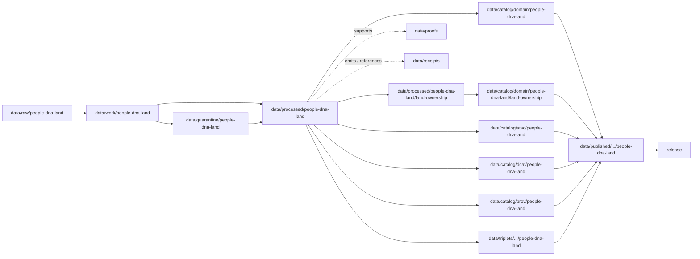

<!-- [KFM_META_BLOCK_V2]
doc_id: kfm://doc/data-processed-people-dna-land-readme
title: data/processed/people-dna-land/README.md — People / Genealogy / DNA / Land Processed Data README
version: v0.1
type: readme; data-lifecycle-domain-lane; processed-stage-guide; people-dna-land-domain-root; privacy-consent-title-lane-index
status: draft; PROPOSED; data-root; processed-stage; people-dna-land; people; genealogy; dna; land-ownership; consent; privacy; living-person-protected; DNA-protected; parcel-join-sensitive; source-role-aware; evidence-first; release-gated
authors: ChatGPT-5.5 Thinking; reviewed_by: OWNER_TBD
owners: OWNER_TBD — People/DNA/Land steward · Privacy reviewer · Consent steward · Rights steward · Sensitivity reviewer · Data steward · Pipeline steward · Evidence steward · Policy steward · Release steward · Docs steward
created: NEEDS VERIFICATION — greenfield stub existed before v0.1 expansion
updated: 2026-06-25
policy_label: restricted-doc; data; processed; people-dna-land; living-person; genealogy; DNA; land-ownership; consent; privacy; lifecycle; governed; release-gated
tags: [kfm, data, processed, people-dna-land, people, genealogy, DNA, land-ownership, person-assertion, genealogy-relationship, DNA-evidence, consent, revocation, tombstone, land-ownership-assertion, parcel-version, chain-of-title, privacy, source-role, administrative, authority, observed, modeled, aggregate, candidate, synthetic, EvidenceBundle, SourceDescriptor, ValidationReport, PolicyDecision, RedactionReceipt, ReviewRecord, ConsentRecord, ReleaseManifest, RollbackCard, RAW, WORK, QUARANTINE, PROCESSED, CATALOG, TRIPLET, PUBLISHED]
related:
  - ../README.md
  - ../../README.md
  - ../../../docs/domains/people-dna-land/README.md
  - ../../../docs/domains/people-dna-land/sublanes/land_ownership.md
  - ../../../policy/domains/people-dna-land/
  - ../../../policy/sensitivity/people-dna-land/
  - ../../../policy/consent/people-dna-land/
  - ../../../contracts/domains/people-dna-land/
  - ../../../schemas/contracts/v1/domains/people-dna-land/
  - ../../raw/people-dna-land/
  - ../../work/people-dna-land/
  - ../../quarantine/people-dna-land/
  - ../../catalog/domain/people-dna-land/
  - ../../triplets/
  - ../../published/
  - ../../proofs/
  - ../../receipts/
  - ../../registry/sources/people-dna-land/
  - ../../../release/candidates/people-dna-land/
  - ../../../release/
  - ../../../pipelines/domains/people-dna-land/
  - ../../../pipeline_specs/people-dna-land/
  - ../../../tools/validators/
  - land-ownership/README.md
notes:
  - "This file replaces a greenfield stub at `data/processed/people-dna-land/README.md`."
  - "This is the parent PROCESSED-stage domain lane for People / Genealogy / DNA / Land artifacts. It is not RAW source storage, WORK scratch, QUARANTINE holding, CATALOG, TRIPLET, PUBLISHED, proof storage, receipt storage, source registry, policy authority, consent authority, release authority, public API/UI output, public map/tile output, legal advice, title proof, identity adjudication, DNA interpretation, or public lookup surface."
  - "The domain inherits KFM's strictest defaults: living-person fields, raw DNA data, private parcel-person joins, and DNA-derived hypotheses are denied or restricted by default until explicit policy, consent, evidence, review, redaction, release, correction, and rollback controls support a safer representation."
  - "Person assertions are evidence, not facts. DNA-derived outputs are restricted, aggregate, or k-anonymized only. Assessor/tax records are not title truth. Parcel geometry is not title proof."
  - "The domain segment naming and sublane convention have documented conflicts; this processed README follows the existing requested `data/processed/people-dna-land/` path while labeling child sublanes PROPOSED unless verified."
  - "Rollback target for this expansion is previous greenfield stub blob SHA `0409d5652c090cfc705a4df973ab4fdbd50b5cd3`."
[/KFM_META_BLOCK_V2] -->

<a id="top"></a>

# data/processed/people-dna-land

> Parent People / Genealogy / DNA / Land PROCESSED-stage lane for normalized, evidence-bound, privacy-aware, consent-aware, source-role-preserved artifacts that have passed beyond RAW/WORK/QUARANTINE but are not yet cataloged, triplet-projected, published, or released.

<p>
  
  
  
  
  
  
</p>

**Status:** draft / PROPOSED  
**Owners:** OWNER_TBD — People/DNA/Land steward · Privacy reviewer · Consent steward · Rights steward · Sensitivity reviewer · Data steward · Pipeline steward · Evidence steward · Policy steward · Release steward · Docs steward  
**Path:** `data/processed/people-dna-land/README.md`  
**Owning root:** `data/processed/`  
**Domain segment:** `people-dna-land`  
**Lifecycle stage:** `PROCESSED`  
**Exposure posture:** restricted and deny-by-default; any public use requires governed catalog, EvidenceBundle, source-role and rights posture, consent where required, privacy/sensitivity review, DNA-safety checks, re-identification review, redaction/aggregation/k-anonymization where applicable, PolicyDecision, ReleaseManifest, correction path, and rollback target.  
**Truth posture:** CONFIRMED target was a greenfield stub · CONFIRMED parent `data/processed/` is upstream of catalog/triplet/publication and is not a normal public surface · CONFIRMED People/DNA/Land has T4 deny-by-default posture for living-person, raw DNA, private parcel-person joins, and DNA-derived hypotheses · CONFIRMED land ownership doctrine says assessor/tax records are not title truth and parcel geometry is not title proof · PROPOSED parent-lane details and child-lane index · NEEDS VERIFICATION for actual child inventory, validators, fixtures, contracts, schemas, policy/consent enforcement, access-control enforcement, release linkage, and governed route behavior.

**Quick jumps:** [Purpose](#purpose) · [Lifecycle boundary](#lifecycle-boundary) · [Repo fit](#repo-fit) · [Lane index](#lane-index) · [Accepted contents](#accepted-contents) · [Exclusions](#exclusions) · [Processed requirements](#processed-requirements) · [Privacy, consent, and source-role guardrails](#privacy-consent-and-source-role-guardrails) · [Evidence ledger](#evidence-ledger) · [Validation checklist](#validation-checklist) · [Rollback](#rollback)

---

## Purpose

`data/processed/people-dna-land/` is the parent PROCESSED-stage lane for normalized People / Genealogy / DNA / Land artifacts. It organizes processed outputs after source admission, assertion normalization, consent review, rights review, privacy review, DNA-safety transformation, land-record normalization, parcel-version handling, evidence linking, validation-oriented processing, or public-safe derivative preparation.

This lane may contain or point to processed artifacts for:

- person assertions and identity evidence views;
- genealogy relationships and family-tree hypotheses;
- consent, restriction, revocation, tombstone, and correction-support context;
- DNA-derived evidence only when transformed, restricted, aggregate, k-anonymized, or otherwise policy-safe;
- land instruments, land ownership assertions, parcel versions, ownership intervals, legal descriptions, and chain-of-title reasoning;
- privacy-reviewed, redacted, generalized, aggregated, de-identified, delayed, or restricted derivatives.

This parent README does not create a semantic contract, schema, validator, source registry, proof, receipt, policy decision, consent decision, release decision, public map layer, public tile, public API route, public UI payload, identity adjudication, DNA interpretation, title adjudication, legal advice, property-rights proof, or public lookup surface.

## Lifecycle boundary

```text
RAW -> WORK / QUARANTINE -> PROCESSED -> CATALOG / TRIPLET -> PUBLISHED
```



`data/processed/people-dna-land/` is upstream of catalog, triplet, publication, and release. It must not be used as a normal public map/API/UI/AI source.

## Repo fit

| Responsibility | Correct home | Rule |
|---|---|---|
| Raw records, vendor exports, DNA source data, deed books, source-native assessor/tax records, court/probate source files, family-tree exports, images, OCR inputs, source logs, source identifiers, or original source payloads | `data/raw/people-dna-land/` | Not this lane. |
| In-process OCR, parsing, identity matching, genealogy hypotheses, DNA transformation, consent review, land-record normalization, privacy review, redaction trials, joins, notebooks, or scratch products | `data/work/people-dna-land/` | Not this lane. |
| Unresolved living-person data, raw DNA, unresolved consent, unresolved rights, unresolved source role, disputed identity, parcel-person joins, DNA/genealogy leakage risk, cultural/sovereignty-sensitive context, or unsafe public-risk material | `data/quarantine/people-dna-land/` | Not this lane until review/admission allows. |
| Normalized People/DNA/Land processed artifacts | `data/processed/people-dna-land/` | This parent lane and verified child lanes. |
| Land-ownership processed artifacts | `data/processed/people-dna-land/land-ownership/` | Existing child lane; sublane convention remains PROPOSED pending ADR/verification. |
| People/DNA/Land catalog records | `data/catalog/domain/people-dna-land/` | Downstream catalog stage. |
| Land-ownership catalog records | `data/catalog/domain/people-dna-land/land-ownership/` | Downstream catalog child lane if accepted. |
| STAC/DCAT/PROV records | `data/catalog/{stac,dcat,prov}/people-dna-land/` | Downstream catalog projections if accepted. |
| Triplet/graph records | `data/triplets/.../people-dna-land/` | Downstream graph stage; must not expose restricted identity/DNA/parcel joins. |
| Published public-safe products | `data/published/.../people-dna-land/` | Downstream only after release. |
| EvidenceBundle/proof records | `data/proofs/` | Separate proof family. |
| Source, run, transform, consent, redaction, validation, policy, correction, access, and release receipts | `data/receipts/` | Separate receipt family. |
| Source registry records | `data/registry/sources/people-dna-land/` | Separate source authority. |
| Release candidates and release manifests | `release/candidates/people-dna-land/`, `release/` | Separate publication authority. |
| Contracts | `contracts/domains/people-dna-land/` or segment resolved by ADR | Object meaning; not data. Segment conflict remains NEEDS VERIFICATION. |
| Schemas | `schemas/contracts/v1/domains/people-dna-land/` or segment resolved by ADR | Machine shape; not data. Segment conflict remains NEEDS VERIFICATION. |
| Policy and consent rules | `policy/domains/people-dna-land/`, `policy/sensitivity/people-dna-land/`, `policy/consent/people-dna-land/` or segment resolved by ADR | Admissibility/consent authority; not data. |
| Validators, tests, fixtures, pipelines, pipeline specs, apps, packages | `tools/validators/`, `tests/`, `fixtures/`, `pipelines/`, `pipeline_specs/`, `apps/`, `packages/` | Separate roots. |

## Lane index

Known or intended child lanes under `data/processed/people-dna-land/` are listed below. Treat entries as **PROPOSED** unless current child READMEs, validators, fixtures, policies, receipts, access controls, and CI enforcement have been verified in the same implementation pass.

| Lane | Family | Purpose | Hard boundary |
|---|---|---|---|
| `land-ownership/` | Land Ownership Assertion / instrument / parcel-version lane | Processed land-ownership assertions, instruments, parcel versions, assessor/tax administrative context, legal descriptions, and chain-of-title reasoning. | Not title adjudication, legal advice, property-rights proof, DNA inference, or public owner lookup. |
| `people/` | Person assertion / identity evidence | Person assertions, identity evidence views, review and correction state. | Person assertions are evidence, not facts; living-person fields default-deny. |
| `genealogy/` | Genealogy relationship / tree hypothesis | Relationship assertions, family-tree hypotheses, citation chains, and correction notes. | Genealogy hypotheses are not identity fact or title proof by themselves. |
| `dna/` | Restricted DNA evidence / transformed derivatives | Consent-bound DNA evidence summaries, aggregate/k-anonymized derivatives, and restricted review artifacts. | Raw vendor IDs, segment data, and triangulation outputs are denied by default for public use. |
| `consent/` | Consent / revocation support | Consent state, revocation support, tombstone/cleanup context where policy allows. | Consent authority belongs in policy/receipt roots; this lane may hold processed support artifacts only. |
| `redacted/` | Public-candidate safe derivatives | De-identified, generalized, aggregate, or delayed public-candidate derivatives. | Public-candidate is not published or released. |
| `restricted/` | Restricted processed artifacts | Sensitive or rights-limited artifacts admitted by policy. | Non-public, access-controlled, fail-closed. |

## Accepted contents

Processed People/DNA/Land artifacts may include:

- normalized tabular, spatial, temporal, textual, graph-ready, review-ready, privacy-aware, or consent-aware artifacts;
- source-role-tagged person assertions, genealogy relationships, DNA-derived restricted/aggregate derivatives, consent-support records, land instruments, land ownership assertions, parcel versions, legal descriptions, ownership intervals, and chain-of-title hypothesis artifacts;
- redacted, generalized, de-identified, k-anonymized, aggregated, suppressed, withheld, delayed, or restricted derivatives that still require catalog/release review before public use;
- reviewer-only, rights-controlled, consent-bound, privacy-sensitive, DNA-sensitive, cultural/sovereignty-sensitive, or denied/internal-review processed artifacts admitted by policy;
- sidecar metadata needed to interpret processed artifacts when it is not a receipt, proof, policy decision, release manifest, source registry record, schema, validator, or catalog record;
- lane-local README or manifest notes that explain processed-data boundaries without becoming public outputs or authority records.

## Exclusions

Do not store these under `data/processed/people-dna-land/`:

- RAW source files, vendor exports, raw DNA segment data, source-native family-tree exports, deed-book images, OCR inputs, source-native assessor/tax exports, court/probate source images, parcel source files, source media, logs, source identifiers, or unprocessed agency/partner/vendor exports.
- WORK/scratch files, notebooks, identity-matching experiments, genealogy inference experiments, DNA analysis scratch, land-record parsing experiments, unresolved chain-of-title joins, OCR QA scratch, privacy-review scratch, or redaction-debug outputs.
- Quarantined or unresolved living-person, DNA, consent, rights, source-role, sensitivity, sovereignty, cultural-affiliation, genealogy leakage, parcel-person join, or public-risk material.
- Catalog records, STAC/DCAT/PROV records, triplet/graph records, published products, proof records, receipt records, source registry records, release decisions, schemas, policy rules, consent-policy records, validators, tests, fixtures, pipelines, pipeline specs, app/UI/API code, or packages.
- Public API/UI/tile payloads, direct downloads, Focus Mode answers, public map layers, public person or DNA lookup products, title search, legal/title advice, medical/genetic advice, property-rights proof, or life-safety guidance.
- Sensitive identifiers, private agreement terms, credentials, secrets, consent secrets, redaction parameters, aggregation thresholds, small-cell thresholds, fuzzing radii, seeds, exact transform offsets, sensitive owner/occupant details, or implementation details that could aid exposure or unauthorized access.
- AI-generated identity, genealogy, DNA, or title narratives presented as authoritative without EvidenceBundle support, source-role preservation, policy/consent decision, release state, and validated citations.

## Processed requirements

PROPOSED until concrete validators, policies, fixtures, receipts, and access-control enforcement are verified:

| Requirement | Meaning |
|---|---|
| Source trace | Each source-derived artifact should trace to SourceDescriptor or people-dna-land source registry context. |
| Evidence linkage | Claims about person assertion, genealogy relationship, DNA-derived evidence, consent posture, land ownership assertion, instrument, parcel version, ownership interval, transform, review, or release readiness should resolve downstream to EvidenceBundle/proof context where appropriate. |
| Source role | Administrative, authority, observed, modeled, aggregate, candidate, and synthetic roles must remain explicit; canonical vocabulary conflicts remain NEEDS VERIFICATION. |
| Object distinction | Person assertion, genealogy relationship, DNA evidence derivative, consent support, Land Ownership Assertion, LandInstrument, Parcel Version, Ownership Interval, LegalDescription, Assessor Record, and TaxRecord must remain distinct. |
| Consent posture | Living-person and DNA artifacts require consent/restriction/revocation posture where doctrine requires it; revocation must support tombstone and downstream cleanup. |
| Privacy posture | Living-person fields, raw DNA, parcel-person joins, DNA-derived hypotheses, and bulk exports should carry restriction/generalization/denial posture. |
| Title posture | Assessor/tax records are not title truth; parcel geometry is not title proof; chain-of-title remains assertion-typed. |
| Time semantics | Source time, observed time, valid time, recording time, retrieval time, release time, correction time, consent time, and revocation time should remain distinguishable where material. |
| Rights posture | Archive, vendor, court, recording office, assessor, steward, license, redistribution, attribution, derivative-use, consent, and privacy terms should be resolved or held closed. |
| Transform linkage | Redaction, de-identification, k-anonymization, aggregation, generalization, suppression, withholding, delayed publication, or public-safe transform should link to appropriate receipt families. |
| Review state | Domain steward, privacy reviewer, consent steward, rights steward, sensitivity reviewer, data-quality reviewer, and release authority review should be recorded where required. |
| Policy decision | Restricted, public-candidate, and public transitions require PolicyDecision/admissibility posture where policy requires it. |
| Catalog readiness | Processed artifacts intended for discovery should promote through catalog/triplet lanes, not directly to public use. |
| Release readiness | Public use requires ReleaseManifest or release-linked state, published output path, correction path, privacy/sensitivity/consent review state, and rollback target. |
| No public surface by default | Processed People/DNA/Land artifacts must not be exposed directly as public maps, tiles, APIs, downloads, Focus Mode answers, or AI-answer sources. |

## Privacy, consent, and source-role guardrails

- Living-person fields default-deny at public surfaces.
- Raw DNA segment data, vendor IDs, triangulation outputs, and DNA-derived identity/relationship outputs default-deny for public use.
- DNA crosses the publication boundary only as approved aggregate, transformed, k-anonymized, or otherwise policy-safe derivatives.
- Consent is revocable; revocation requires tombstoning, downstream cleanup, and release/cache invalidation where applicable.
- Person assertions are evidence, not facts.
- Genealogy trees and relationships are assertion/hypothesis objects unless EvidenceBundle and review state support stronger claims.
- Assessor and tax records are not title truth.
- Parcel geometry is not title proof.
- Parcel-person joins and bulk exports default-deny unless policy and review approve a safer representation.
- Frontier Matrix owns `LandOfficeRecord` and `PublicLandRecord`; People/DNA/Land may cite them as context but must not rehost them or leak living/DNA/title information through joins.
- Archaeology/cultural-affiliation and sovereignty-sensitive context requires its own steward review; this lane may cite but not absorb it.
- Source-role collapse is denied: administrative assessor/tax records must not become title authority, genealogy hypotheses must not become identity fact, DNA must not become title proof, aggregate public-land statistics must not become per-place ownership truth, and synthetic AI text must not become evidence.
- Unclear rights, unresolved source role, missing evidence, unresolved sensitivity, unresolved consent, unresolved living-person posture, unresolved DNA-safety posture, unresolved parcel-version identity, or absent release state blocks public promotion.
- Public clients and Focus Mode must use governed APIs, released artifacts, catalog/triplet records, EvidenceBundle-backed payloads, and policy-safe envelopes, not this directory directly.

> [!CAUTION]
> Do not expose `data/processed/people-dna-land/` directly as a public map, tile service, API, UI, download, Focus Mode answer, AI answer source, identity service, genealogy service, DNA service, title service, legal advice source, genetic advice source, or property-rights proof. Processed People/DNA/Land data remains inside the trust membrane until governed promotion and release, and even released outputs remain evidence-bounded and policy-filtered.

## Evidence ledger

| Source | Status | Supports | Limits |
|---|---|---|---|
| Previous file | CONFIRMED | Target existed as a greenfield stub. | Did not define People/DNA/Land processed boundaries or child lanes. |
| `data/processed/README.md` | CONFIRMED | PROCESSED data is upstream of catalog, triplets, publication, and release and is not the normal public surface. | Does not prove People/DNA/Land child inventory or enforcement. |
| `docs/domains/people-dna-land/README.md` | CONFIRMED doctrine / PROPOSED implementation | People/DNA/Land is strict deny-by-default for living-person, raw DNA, private parcel-person joins, and DNA-derived hypotheses; person assertions are evidence; DNA publication is aggregate/derivative-only; assessor/tax and parcel geometry are not title proof. | Segment naming for some roots is CONFLICTED; implementation maturity remains NEEDS VERIFICATION. |
| `docs/domains/people-dna-land/sublanes/land_ownership.md` | CONFIRMED doctrine / PROPOSED implementation | Land-ownership owns assertion-first evidence-bound instruments, parcel versions, ownership intervals, assessor/tax administrative context, and chain-of-title reasoning; sublane naming/path convention remains unresolved. | The doc flags duplicate/uncertain sublane naming and warns sublane folders need ADR/verification. |
| `data/processed/people-dna-land/land-ownership/README.md` | CONFIRMED child README | Land-ownership processed child lane exists and sets privacy/title/source-role guardrails. | Does not prove validators or access enforcement. |
| `policy/domains/people-dna-land/`, `policy/sensitivity/people-dna-land/`, and `policy/consent/people-dna-land/` | NEEDS VERIFICATION | Expected admissibility, sensitivity, and consent homes. | Current policy files and enforcement were not verified in this task. |
| `contracts/domains/people-dna-land/` and `schemas/contracts/v1/domains/people-dna-land/` | NEEDS VERIFICATION | Expected object contract/schema homes if segment conflict resolves this way. | Specific object files and validators were not verified in this task. |

## Validation checklist

- [ ] Confirm actual child directories under `data/processed/people-dna-land/` and reconcile missing, duplicate, alias, legacy, or compatibility lanes.
- [ ] Confirm whether sublanes under `data/processed/people-dna-land/` are accepted or should remain whole-domain-only until sublane ADR resolution.
- [ ] Resolve segment naming conflict for `people-dna-land` vs `people` across schemas, contracts, sensitivity policy, and consent policy roots.
- [ ] Confirm parent-domain processed path convention for people, genealogy, DNA, consent, land ownership, redacted/public-candidate, and restricted artifacts.
- [ ] Confirm each child lane has README, owner, purpose, accepted contents, exclusions, guardrails, validation checklist, and rollback target.
- [ ] Confirm object contracts and schema paths for person assertions, genealogy relationships, DNA evidence derivatives, consent/tombstone support, Land Ownership Assertion, LandInstrument, Parcel Version, Ownership Interval, LegalDescription, Assessor Record, and TaxRecord.
- [ ] Confirm canonical source-role vocabulary and any conflict between `authority` and the seven-role enum in current doctrine.
- [ ] Confirm validators, fixtures, CI checks, policy checks, consent checks, privacy checks, redaction checks, living-person checks, DNA-safety checks, k-anonymity checks, and access-control enforcement.
- [ ] Confirm SourceDescriptor/source registry linkage for every input source and derived artifact.
- [ ] Confirm RunReceipt, TransformReceipt, RedactionReceipt, ReviewRecord, ConsentRecord, ValidationReport, PolicyDecision, CorrectionNotice, ReleaseManifest, RollbackCard, tombstone path, downstream cleanup path, correction path, and rollback target where applicable.
- [ ] Confirm raw DNA, vendor IDs, DNA segment data, triangulation outputs, public exposure of restricted person data, assessor/tax-as-title, parcel-geometry-as-title-proof, DNA-as-title-proof, genealogy-as-identity-fact, aggregate-as-per-place, synthetic-as-evidence, private agreement terms, credentials, secrets, redaction parameters, transform secrets, and release-unclear artifacts cannot enter public routes.
- [ ] Confirm public-candidate transitions are governed, evidence-backed, source-role-safe, privacy-safe, consent-safe, rights-safe, sensitivity-safe, review-backed, release-linked, and reversible.
- [ ] Confirm no RAW, WORK, QUARANTINE, CATALOG, TRIPLET, PUBLISHED, proof, receipt, registry, release, schema, policy, validator, package, pipeline, app, API, public map, public tile, direct download, Focus Mode answer, title adjudication, legal advice, genetic/medical advice, property-rights proof, public identity service, public genealogy service, or public DNA service artifact is misplaced here.
- [ ] Confirm public clients and Focus Mode cannot read this lane directly as public truth, public identity service, public genealogy service, public DNA service, public title proof, public map, public tile, public API, public UI, or AI-answer source.

## Rollback

Rollback is required if this parent lane becomes a RAW source-data root, WORK scratch root, QUARANTINE bypass, public output root, `data/published/` substitute, public-candidate shortcut, identity-adjudication surface, DNA-interpretation surface, title-adjudication surface, legal-advice surface, medical/genetic advice surface, restricted person-data exposure path, raw-DNA exposure path, assessor/tax-as-title path, parcel-geometry-as-title-proof path, DNA-as-title-proof path, genealogy-as-identity-fact path, aggregate-as-per-place path, synthetic-as-evidence path, unsafe-join exposure path, transform-secret exposure path, agreement/credential exposure path, proof store, receipt store, catalog root, triplet root, source-registry root, release-decision root, schema root, policy root, consent-authority root, validator root, implementation root, public API shortcut, public UI shortcut, public tile shortcut, public exposure shortcut, property-rights proof, or life-safety guidance source.

Rollback target for this expansion: previous greenfield stub blob SHA `0409d5652c090cfc705a4df973ab4fdbd50b5cd3`.

<p align="right"><a href="#top">Back to top</a></p>
