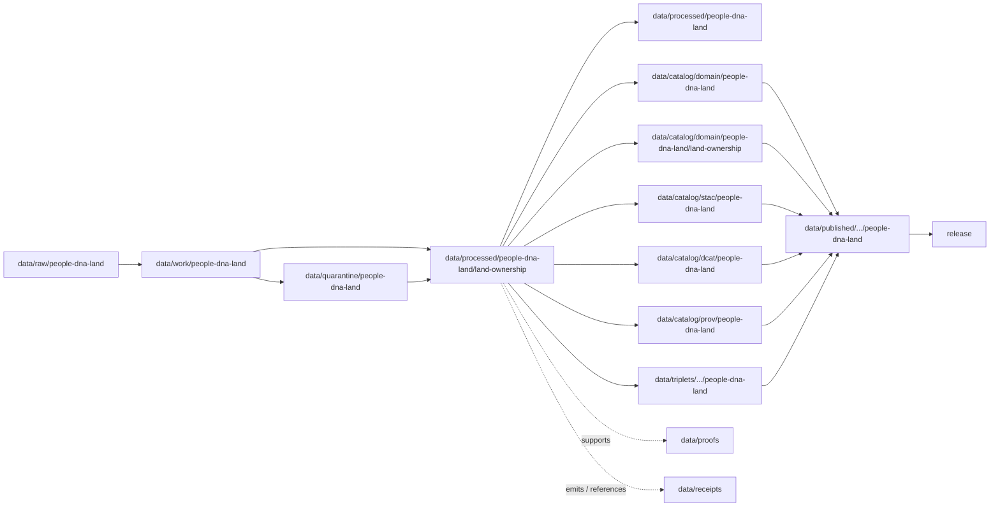

<!-- [KFM_META_BLOCK_V2]
doc_id: kfm://doc/data-processed-people-dna-land-land-ownership-readme
title: data/processed/people-dna-land/land-ownership/README.md — People / DNA / Land Ownership Processed Data README
version: v0.1
type: readme; data-lifecycle-sublane; processed-stage-guide; people-dna-land-domain-lane; land-ownership-lane; parcel-title-assertion-lane
status: draft; PROPOSED; data-root; processed-stage; people-dna-land; land-ownership; assertion-first; privacy-sensitive; living-person-protected; parcel-join-sensitive; source-role-aware; evidence-first; release-gated
authors: ChatGPT-5.5 Thinking; reviewed_by: OWNER_TBD
owners: OWNER_TBD — People/DNA/Land steward · Land-ownership steward · Privacy reviewer · Rights steward · Sensitivity reviewer · Data steward · Pipeline steward · Evidence steward · Policy steward · Release steward · Docs steward
created: NEEDS VERIFICATION — blank placeholder existed before v0.1 expansion
updated: 2026-06-25
policy_label: restricted-doc; data; processed; people-dna-land; land-ownership; privacy; title; parcel; living-person; release-gated
tags: [kfm, data, processed, people-dna-land, land-ownership, land-ownership-assertion, deed-instrument, title-instrument, assessor-record, tax-record, parcel-version, ownership-interval, land-parcel, legal-description, land-instrument, chain-of-title, living-person, parcel-person-join, privacy, source-role, administrative, authority, observed, modeled, aggregate, candidate, synthetic, EvidenceBundle, SourceDescriptor, ValidationReport, PolicyDecision, RedactionReceipt, ReviewRecord, ReleaseManifest, RollbackCard, RAW, WORK, QUARANTINE, PROCESSED, CATALOG, TRIPLET, PUBLISHED]
related:
  - ../README.md
  - ../../README.md
  - ../../../README.md
  - ../../../../docs/domains/people-dna-land/sublanes/land_ownership.md
  - ../../../../docs/domains/people-dna-land/LAND_OWNERSHIP.md
  - ../../../../docs/domains/people-dna-land/CHAIN_OF_TITLE_NOTES.md
  - ../../../../docs/domains/people-dna-land/README.md
  - ../../../../docs/domains/frontier-matrix/README.md
  - ../../../../docs/domains/settlements-infrastructure/README.md
  - ../../../../docs/domains/roads-rail-trade/README.md
  - ../../../../docs/domains/agriculture/README.md
  - ../../../../docs/domains/archaeology/README.md
  - ../../../../policy/domains/people-dna-land/
  - ../../../../policy/sensitivity/people-dna-land/
  - ../../../../contracts/domains/people-dna-land/
  - ../../../../schemas/contracts/v1/domains/people-dna-land/
  - ../../../raw/people-dna-land/
  - ../../../work/people-dna-land/
  - ../../../quarantine/people-dna-land/
  - ../../../catalog/domain/people-dna-land/
  - ../../../catalog/domain/people-dna-land/land-ownership/README.md
  - ../../../catalog/stac/people-dna-land/
  - ../../../catalog/dcat/people-dna-land/
  - ../../../catalog/prov/people-dna-land/
  - ../../../triplets/
  - ../../../published/
  - ../../../proofs/
  - ../../../receipts/
  - ../../../registry/sources/people-dna-land/
  - ../../../../release/candidates/people-dna-land/
  - ../../../../release/
  - ../../../../pipelines/domains/people-dna-land/
  - ../../../../pipeline_specs/people-dna-land/
  - ../../../../tools/validators/
notes:
  - "This file replaces a blank placeholder at `data/processed/people-dna-land/land-ownership/README.md`."
  - "This is a child PROCESSED-stage lane under `data/processed/people-dna-land/` for land-ownership assertions, instruments, parcel versions, assessor/tax administrative context, ownership intervals, legal descriptions, and chain-of-title reasoning artifacts. It is not a RAW source root, WORK scratch area, QUARANTINE bypass, CATALOG, TRIPLET, PUBLISHED, proof store, receipt store, source registry, policy authority, release authority, public API/UI output, public map/tile output, title adjudication, legal advice, property-rights proof, or living-person lookup surface."
  - "Assessor and tax records are not title truth. Parcel geometry is not title proof. Chain-of-title outputs are assertion-typed and evidence-bound, never adjudications."
  - "Living-person fields, person-parcel joins, bulk assessor/person joins, DNA-derived ownership inference, and exact parcel-person exposure fail closed unless policy, rights, evidence, redaction, review, release state, correction path, and rollback support a safer representation."
  - "Frontier Matrix owns LandOfficeRecord and PublicLandRecord aggregate/public-land context; this lane may cite those records but must not rehost them or leak living/DNA/title information through joins."
  - "This README is a lane guide only. Contracts define semantic object meaning; schemas define machine shape; policy decides admissibility; release records decide publication."
  - "Rollback target for this expansion is previous blank placeholder blob SHA `8b137891791fe96927ad78e64b0aad7bded08bdc`."
[/KFM_META_BLOCK_V2] -->

<a id="top"></a>

# data/processed/people-dna-land/land-ownership

> People / DNA / Land PROCESSED-stage child lane for normalized, assertion-first, evidence-bound, privacy-aware land-ownership artifacts: land ownership assertions, deed/title instruments, assessor and tax administrative context, parcel versions, legal descriptions, ownership intervals, and chain-of-title reasoning that have passed beyond RAW/WORK/QUARANTINE but are not yet cataloged, triplet-projected, published, or released.

<p>
  
  
  
  
  
  
</p>

**Status:** draft / PROPOSED  
**Owners:** OWNER_TBD — People/DNA/Land steward · Land-ownership steward · Privacy reviewer · Rights steward · Sensitivity reviewer · Data steward · Pipeline steward · Evidence steward · Policy steward · Release steward · Docs steward  
**Path:** `data/processed/people-dna-land/land-ownership/README.md`  
**Owning root:** `data/processed/`  
**Domain segment:** `people-dna-land`  
**Parent lane:** `data/processed/people-dna-land/`  
**Sublane:** `land-ownership` / parcel, title, instrument, and ownership-assertion processed artifacts  
**Lifecycle stage:** `PROCESSED`  
**Exposure posture:** restricted by default; any public use requires governed catalog, EvidenceBundle, source-role and rights posture, privacy/sensitivity review, living-person checks, re-identification review, RedactionReceipt where applicable, PolicyDecision, ReleaseManifest, correction path, and rollback target.  
**Truth posture:** CONFIRMED target was a blank placeholder · CONFIRMED land-ownership doctrine says assessor/tax records are not title truth and parcel geometry is not title proof · CONFIRMED Land Ownership owns assertion-first, evidence-bound land instruments, ownership intervals, parcel versions, and chain-of-title reasoning · CONFIRMED living-person and person-parcel joins default-deny at public surfaces · PROPOSED processed-data lane details · NEEDS VERIFICATION for actual child inventory, validators, fixtures, contracts, schemas, policy enforcement, access-control enforcement, release linkage, and governed route behavior.

**Quick jumps:** [Purpose](#purpose) · [Lifecycle boundary](#lifecycle-boundary) · [Repo fit](#repo-fit) · [Accepted contents](#accepted-contents) · [Exclusions](#exclusions) · [Land-ownership processed requirements](#land-ownership-processed-requirements) · [Privacy, title, and source-role guardrails](#privacy-title-and-source-role-guardrails) · [Directory map](#directory-map) · [Evidence ledger](#evidence-ledger) · [Validation checklist](#validation-checklist) · [Rollback](#rollback)

---

## Purpose

`data/processed/people-dna-land/land-ownership/` holds processed land-ownership artifacts for the People / DNA / Land domain. It is the processed-data lane for normalized, evidence-bound land ownership records and derived assertions after source admission, role assignment, privacy review, geometry-version handling, instrument normalization, temporal normalization, and validation-oriented processing.

This lane may contain or point to normalized artifacts such as:

- `Land Ownership Assertion` records;
- deed, title, patent, mortgage, lien, easement, lease, mineral, water, access, probate, or court-derived instruments when admitted under the proper source role;
- assessor and tax administrative records with explicit non-title status;
- `Parcel Version` records and geometry-version sidecars;
- `Ownership Interval` derivations with EvidenceRef linkage;
- legal-description parsing candidates and normalized text products;
- chain-of-title hypothesis artifacts that remain assertion-typed and evidence-bound;
- privacy-reviewed, redacted, generalized, or restricted public-candidate derivatives that still require catalog and release review.

This lane does not adjudicate title, prove ownership by itself, provide legal advice, establish property rights, authorize person-parcel exposure, create living-person lookup surfaces, or infer land ownership from DNA or genealogy by itself.

## Lifecycle boundary

```text
RAW -> WORK / QUARANTINE -> PROCESSED -> CATALOG / TRIPLET -> PUBLISHED
```



`data/processed/people-dna-land/land-ownership/` is upstream of catalog, triplet, publication, and release. It must not be used as a normal public map/API/UI/AI source.

## Repo fit

| Responsibility | Correct home | Rule |
|---|---|---|
| Raw deed books, source-native record exports, assessor/tax downloads, court/probate source files, plat/survey originals, parcel source files, images, OCR inputs, source logs, or source identifiers | `data/raw/people-dna-land/` | Not this lane. |
| In-process OCR, parsing, legal-description normalization, instrument extraction, chain-of-title experiments, QA, privacy review, redaction trials, joins, notebooks, or scratch products | `data/work/people-dna-land/` | Not this lane. |
| Unresolved living-person data, unresolved rights, unresolved source role, disputed identity, malformed legal descriptions, person-parcel joins, DNA/genealogy leakage risk, sensitive cultural/sovereignty context, or unsafe public-risk material | `data/quarantine/people-dna-land/` | Not this lane until review/admission allows. |
| Processed land-ownership artifacts | `data/processed/people-dna-land/land-ownership/` | This lane. |
| Parent processed People/DNA/Land lane | `data/processed/people-dna-land/` | Parent lane; still not public by default. |
| People/DNA/Land catalog records | `data/catalog/domain/people-dna-land/` | Downstream catalog stage. |
| Land-ownership catalog records | `data/catalog/domain/people-dna-land/land-ownership/` | Downstream catalog sublane if accepted. |
| People/DNA/Land STAC/DCAT/PROV records | `data/catalog/{stac,dcat,prov}/people-dna-land/` | Downstream catalog projections if accepted. |
| People/DNA/Land triplet/graph records | `data/triplets/.../people-dna-land/` | Downstream graph stage; must not expose restricted person/parcel joins or collapsed title claims. |
| Published public-safe products | `data/published/.../people-dna-land/` | Downstream only after release. |
| EvidenceBundle/proof records | `data/proofs/` | Separate proof family. |
| Source, run, transform, redaction, validation, policy, correction, access, and release receipts | `data/receipts/` | Separate receipt family. |
| People/DNA/Land source registry records | `data/registry/sources/people-dna-land/` | Separate source authority. |
| Release candidates and release manifests | `release/candidates/people-dna-land/`, `release/` | Separate publication authority. |
| People/DNA/Land contracts | `contracts/domains/people-dna-land/` | Object meaning; not data. |
| People/DNA/Land schemas | `schemas/contracts/v1/domains/people-dna-land/` | Machine shape; not data. |
| People/DNA/Land policy and sensitivity rules | `policy/domains/people-dna-land/`, `policy/sensitivity/people-dna-land/` if accepted | Admissibility authority; not data. |
| Validators, tests, fixtures, pipelines, pipeline specs, apps, packages | `tools/validators/`, `tests/`, `fixtures/`, `pipelines/`, `pipeline_specs/`, `apps/`, `packages/` | Separate roots. |

## Accepted contents

Processed land-ownership artifacts may include:

- normalized `Land Ownership Assertion`, `LandInstrument`, `Deed Instrument`, `Title Instrument`, `Parcel Version`, `Ownership Interval`, `LegalDescription`, `Assessor Record`, and `TaxRecord` artifacts;
- instrument-derived assertion candidates with source role, temporal scope, evidence refs, rights posture, and privacy posture;
- parcel-version geometry records where geometry is versioned context and not title proof;
- assessor and tax administrative context when explicitly labeled as non-title truth;
- chain-of-title hypotheses that are assertion-typed, evidence-bound, and never adjudications;
- redacted, generalized, de-identified, delayed, or restricted derivatives that still require catalog/release review before public use;
- sidecar metadata needed to interpret processed artifacts when it is not a receipt, proof, policy decision, release manifest, source registry record, schema, validator, or catalog record;
- lane-local README or manifest notes that explain processed-data boundaries without becoming public outputs or authority records.

## Exclusions

Do not store these under `data/processed/people-dna-land/land-ownership/`:

- RAW source files, deed-book images, OCR inputs, source-native assessor/tax exports, court/probate source images, parcel source files, source media, logs, original source identifiers, or unprocessed agency/partner exports.
- WORK/scratch files, notebooks, transform experiments, legal-description parsing experiments, unresolved chain-of-title joins, OCR QA scratch, geocoding scratch, privacy-review scratch, or redaction-debug outputs.
- Quarantined or unresolved living-person, rights, source-role, sensitivity, sovereignty, cultural-affiliation, DNA/genealogy leakage, person-parcel join, or public-risk material.
- Catalog records, STAC/DCAT/PROV records, triplet/graph records, published products, proof records, receipt records, source registry records, release decisions, schemas, policy rules, validators, tests, fixtures, pipelines, pipeline specs, app/UI/API code, or packages.
- `LandOfficeRecord` and `PublicLandRecord` authority/context objects owned by Frontier Matrix, except as cited context through governed relation edges.
- DNA-derived ownership inference, genealogy-only title proof, living-person lookup surfaces, bulk assessor/person exports, exact person-parcel public maps, title adjudications, legal advice, property-rights proof, boundary adjudication, tax/legal compliance advice, or law-enforcement/private-investigation targeting aids.
- Public API/UI/tile payloads, direct downloads, Focus Mode answers, public map layers, person search, parcel-owner lookup products, landowner/parcel targeting aids, legal/title advice, or life-safety guidance.
- Redaction parameters, aggregation thresholds, small-cell thresholds, fuzzing radii, seeds, exact transform offsets, access credentials, secrets, private agreement terms, living-person identifiers, sensitive owner/occupant details, or implementation details that could aid exposure or unauthorized access.

## Land-ownership processed requirements

PROPOSED until concrete validators, policies, fixtures, receipts, and access-control enforcement are verified:

| Requirement | Meaning |
|---|---|
| Source trace | Each source-derived artifact should trace to SourceDescriptor or people-dna-land source registry context. |
| Evidence linkage | Claims about ownership assertion, instrument, parcel version, ownership interval, legal description, assessor/tax administrative context, transform, review, or release readiness should resolve downstream to EvidenceBundle/proof context where appropriate. |
| Source role | Administrative, authority, observed, modeled, aggregate, candidate, and synthetic roles must remain explicit; the canonical role vocabulary is NEEDS VERIFICATION where docs conflict. |
| Object distinction | Land Ownership Assertion, Deed Instrument, Title Instrument, Assessor Record, TaxRecord, Parcel Version, Ownership Interval, LandParcel, LegalDescription, and LandInstrument must remain distinct. |
| Title posture | Assessor/tax records are not title truth; parcel geometry is not title proof; chain-of-title remains assertion-typed unless a qualified legal authority says otherwise outside KFM. |
| Time semantics | Source time, observed time, valid time, recording time, retrieval time, release time, and correction time should remain distinguishable where material. |
| Privacy posture | Living-person fields, person-parcel joins, bulk assessor/person joins, exact owner/occupant exposure, and DNA/genealogy leakage risks should carry restriction/generalization/denial posture. |
| Rights posture | Recording office, assessor, court, archive, vendor, steward, license, redistribution, attribution, derivative-use, and privacy terms should be resolved or held closed. |
| Transform linkage | Redaction, de-identification, aggregation, generalization, suppression, withholding, delayed publication, or public-safe geometry transform should link to appropriate receipt families. |
| Review state | People/DNA/Land steward, privacy reviewer, rights steward, sensitivity reviewer, data-quality reviewer, and release authority review should be recorded where required. |
| Policy decision | Restricted, public-candidate, and public transitions require PolicyDecision/admissibility posture where policy requires it. |
| Catalog readiness | Processed land-ownership artifacts intended for discovery should promote through catalog/triplet lanes, not directly to public use. |
| Release readiness | Public use requires ReleaseManifest or release-linked state, published output path, correction path, privacy/sensitivity review state, and rollback target. |
| No public surface by default | Processed land-ownership artifacts must not be exposed directly as public maps, tiles, APIs, downloads, Focus Mode answers, or AI-answer sources. |

## Privacy, title, and source-role guardrails

- Assessor and tax records are not title truth.
- Parcel geometry is not title proof.
- A `Parcel Version` is a geometry/version snapshot, not a boundary adjudication.
- A `Land Ownership Assertion` is an evidence-bound assertion, not an adjudicated ownership determination.
- `Ownership Interval` is derived, not primary evidence.
- Chain-of-title output is always assertion-typed and must not be presented as legal title advice or adjudication.
- DNA never authorizes title or parcel inference.
- Genealogy trees are hypotheses or modeled/candidate context, not title proof.
- Living-person fields default-deny at public surfaces.
- Private person-parcel joins, exact owner/occupant joins, and bulk assessor/person exports default-deny unless a governed policy decision and review approve a safer representation.
- Frontier Matrix owns `LandOfficeRecord` and `PublicLandRecord`; this lane may cite them as context but must not rehost them or leak living/DNA/title information through joins.
- Settlements, Spatial Foundation, Roads/Rail, Agriculture, Archaeology, People, DNA, and Frontier Matrix keep their own canonical truth; this lane may join only through governed relationships preserving ownership, source role, sensitivity, and EvidenceBundle support.
- Source-role collapse is denied: administrative assessor/tax records must not be cited as title authority; aggregate public-land statistics must not become per-place ownership truth; synthetic AI text must not become evidence.
- Unclear rights, unresolved source role, missing evidence, unresolved sensitivity, unresolved living-person posture, unresolved parcel-version identity, or absent release state blocks public promotion.
- Public clients and Focus Mode must use governed APIs, released artifacts, catalog/triplet records, EvidenceBundle-backed payloads, and policy-safe envelopes, not this directory directly.

> [!CAUTION]
> Do not expose `data/processed/people-dna-land/land-ownership/` directly as a public map, tile service, API, UI, download, Focus Mode answer, AI answer source, title search, parcel-owner lookup, person search, property-rights proof, legal advice source, private-investigation aid, landowner/parcel targeting aid, or living-person lookup surface. Processed land-ownership data remains inside the trust membrane until governed promotion and release, and even released outputs remain assertion-typed and evidence-bounded.

## Directory map

Actual child inventory remains **NEEDS VERIFICATION**. Use this as a proposed local organization pattern only after confirming current repo convention, sublane ADR status, validators, and access-control enforcement.

```text
data/processed/people-dna-land/land-ownership/
├── README.md
├── assertions/               # PROPOSED — Land Ownership Assertion records
├── instruments/              # PROPOSED — deed/title/land instrument derivatives
├── parcels/                  # PROPOSED — Parcel Version artifacts, not title proof
├── assessor_records/         # PROPOSED — administrative context, not title truth
├── tax_records/              # PROPOSED — administrative/tax context, not title truth
├── ownership_intervals/      # PROPOSED — derived assertion intervals
├── legal_descriptions/       # PROPOSED — parsed/normalized legal-description candidates
├── chain_of_title/           # PROPOSED — assertion-typed chain-of-title hypotheses
├── redacted/                 # PROPOSED — public-candidate de-identified/generalized derivatives
├── restricted/               # PROPOSED — living-person/person-parcel/rights-limited artifacts
├── validation/               # PROPOSED — lane-local validation notes, not ValidationReport authority
├── joins/                    # PROPOSED — reviewed relation edges only, not foreign-domain truth
├── _manifests/               # PROPOSED — lane-local non-release manifests only
└── _README_TODO.md           # PROPOSED — remove after actual child inventory is documented
```

## Evidence ledger

| Source | Status | Supports | Limits |
|---|---|---|---|
| Previous file | CONFIRMED | Target existed as a blank placeholder. | Did not define land-ownership processed boundaries. |
| `docs/domains/people-dna-land/sublanes/land_ownership.md` | CONFIRMED doctrine / PROPOSED implementation | Land ownership is assertion-first and evidence-bound; assessor/tax records are not title truth; parcel geometry is not title proof; source-role, sensitivity, living-person, person-parcel, DNA, and Frontier Matrix boundaries are defined. | The doc also flags duplicate/uncertain sublane naming and says sublane paths need ADR/verification. |
| `data/processed/README.md` | CONFIRMED | PROCESSED data is upstream of catalog, triplets, publication, and release and is not the normal public surface. | Did not inspect in this task beyond prior current-session evidence. |
| `data/catalog/domain/people-dna-land/land-ownership/README.md` | NEEDS VERIFICATION | Expected downstream catalog sublane. | This task did not inspect its contents. |
| `docs/domains/people-dna-land/LAND_OWNERSHIP.md` and `CHAIN_OF_TITLE_NOTES.md` | NEEDS VERIFICATION | Named companion docs for land ownership and chain-of-title. | This task did not inspect contents. |
| `policy/domains/people-dna-land/` and `policy/sensitivity/people-dna-land/` | NEEDS VERIFICATION | Expected admissibility homes. | Current policy files and enforcement were not verified in this task. |
| `contracts/domains/people-dna-land/` and `schemas/contracts/v1/domains/people-dna-land/` | NEEDS VERIFICATION | Expected object contract/schema homes for People/DNA/Land families. | Specific object files and validators were not verified in this task. |

## Validation checklist

- [ ] Confirm actual child directories under `data/processed/people-dna-land/land-ownership/`.
- [ ] Confirm whether `land-ownership/` is accepted under `data/processed/people-dna-land/` or should be reconciled with whole-domain-only responsibility-root lanes pending sublane ADR.
- [ ] Confirm parent `data/processed/people-dna-land/README.md` exists and defines parent-domain processed boundaries.
- [ ] Resolve duplicate doctrine naming: `sublanes/land_ownership.md`, `sublanes/land.md`, `LAND_OWNERSHIP.md`, and any subfolder `land/README.md` convention.
- [ ] Confirm object contracts and schema paths for Land Ownership Assertion, Deed Instrument, Title Instrument, Assessor Record, TaxRecord, Parcel Version, Ownership Interval, LandParcel, LegalDescription, and LandInstrument.
- [ ] Confirm canonical source-role vocabulary and any conflict between `authority` and the seven-role enum in current doctrine.
- [ ] Confirm validators, fixtures, CI checks, policy checks, privacy checks, person-parcel join checks, redaction checks, living-person checks, DNA-leakage checks, and access-control enforcement.
- [ ] Confirm SourceDescriptor/source registry linkage for every input source and derived artifact.
- [ ] Confirm RunReceipt, TransformReceipt, RedactionReceipt, ReviewRecord, ValidationReport, PolicyDecision, CorrectionNotice, ReleaseManifest, RollbackCard, correction path, and rollback target where applicable.
- [ ] Confirm assessor/tax-as-title, parcel-geometry-as-title-proof, DNA-as-title-proof, genealogy-as-title-proof, aggregate-as-per-place, synthetic-as-evidence, living-person public exposure, person-parcel exact joins, bulk assessor/person exports, private agreement terms, credentials, secrets, redaction parameters, transform secrets, and release-unclear artifacts cannot enter public routes.
- [ ] Confirm public-candidate transitions are governed, evidence-backed, source-role-safe, privacy-safe, rights-safe, sensitivity-safe, review-backed, release-linked, and reversible.
- [ ] Confirm no RAW, WORK, QUARANTINE, CATALOG, TRIPLET, PUBLISHED, proof, receipt, registry, release, schema, policy, validator, package, pipeline, app, API, public map, public tile, direct download, Focus Mode answer, title adjudication, legal advice, property-rights proof, parcel-owner lookup, person search, private-investigation aid, or living-person lookup artifact is misplaced here.
- [ ] Confirm public clients and Focus Mode cannot read this lane directly as public truth, public title proof, public person-parcel service, public map, public tile, public API, public UI, or AI-answer source.

## Rollback

Rollback is required if this lane becomes a RAW source-data root, WORK scratch root, QUARANTINE bypass, public output root, `data/published/` substitute, public-candidate shortcut, title-adjudication surface, legal-advice surface, assessor/tax-as-title path, parcel-geometry-as-title-proof path, DNA-as-title-proof path, living-person exposure path, person-parcel lookup path, bulk assessor/person export path, aggregate-as-per-place path, synthetic-as-evidence path, unsafe-join exposure path, transform-secret exposure path, agreement/credential exposure path, proof store, receipt store, catalog root, triplet root, source-registry root, release-decision root, schema root, policy root, validator root, implementation root, public API shortcut, public UI shortcut, public tile shortcut, public exposure shortcut, private-investigation aid, landowner/parcel targeting aid, property-rights proof, or life-safety guidance source.

Rollback target for this expansion: previous blank placeholder blob SHA `8b137891791fe96927ad78e64b0aad7bded08bdc`.

<p align="right"><a href="#top">Back to top</a></p>
