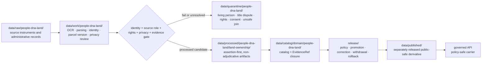

<!-- [KFM_META_BLOCK_V2]
doc_id: kfm://doc/data-processed-people-dna-land-land-ownership-readme
title: data/processed/people-dna-land/land-ownership/ — Land-Ownership Processed Data
version: v0.2.0
type: directory-readme
subtype: processed-people-dna-land-land-ownership-lane
status: repository-grounded restricted draft; payload inventory, contracts, schemas, validators, consent/privacy enforcement, receipts, proof, release, and runtime behavior remain bounded
owners:
  - "NEEDS VERIFICATION — People / DNA / Land domain steward"
  - "NEEDS VERIFICATION — land-ownership, title-instrument, parcel-version, and temporal-assertion steward"
  - "NEEDS VERIFICATION — privacy, living-person, rights, sovereignty, and sensitivity reviewers"
  - "NEEDS VERIFICATION — data, evidence, policy, release, correction, rollback, and docs stewards"
created: NEEDS VERIFICATION — blank placeholder existed before v0.1 expansion
updated: 2026-07-25
policy_label: restricted-doc; processed-stage; people-dna-land; land-ownership; assertion-first; living-person-protected; parcel-join-sensitive; title-nonadjudicative; release-gated; no-direct-public-path
path: data/processed/people-dna-land/land-ownership/README.md
truth_posture: >
  CONFIRMED exact target path, prior blob, Directory Rules placement, parent People / DNA / Land
  processed lane, land-ownership doctrine, assessor/tax non-title rule, parcel-geometry non-proof rule,
  living-person default-deny posture, and PROCESSED lifecycle boundary / PROPOSED lane-local admission
  profile, ownership-assertion packet, instrument and interval requirements, and downstream promotion
  expectations / UNKNOWN recursive payload inventory, accepted contracts and schemas, production validators,
  fixtures, consent/privacy enforcement, receipts, proof closure, release instances, hosting, and public behavior /
  NEEDS VERIFICATION accountable owners, resolution of the land-sublane documentation/path conflict,
  source-role vocabulary, legal-description normalization limits, correction propagation, cache invalidation,
  withdrawal behavior, and rollback drills
evidence_snapshot:
  repository: bartytime4life/Kansas-Frontier-Matrix
  base_ref: main
  base_commit: 462db518fbd63e3ef39aa4aefdfa95a309eef796
  prior_blob: b23b0099420ac0c77e8d03549a3b31fab763c7ea
  directory_rules_blob: 2affb080e6f0043867c64c7f06c1ca52030fbd55
  people_dna_land_parent_blob: f6d532058d11b1ebfec24dfa940ce95338147c7e
  land_ownership_doctrine_blob: 430a2295ec40843a0355d220a74204ea05d76c7a
related:
  - ../README.md
  - ../../README.md
  - ../../../README.md
  - ../../../../docs/domains/people-dna-land/README.md
  - ../../../../docs/domains/people-dna-land/sublanes/land_ownership.md
  - ../../../../docs/doctrine/directory-rules.md
  - ../../../../contracts/domains/people-dna-land/README.md
  - ../../../../schemas/contracts/v1/domains/people-dna-land/README.md
  - ../../../../policy/domains/people-dna-land/README.md
  - ../../../../policy/sensitivity/people-dna-land/README.md
  - ../../../../policy/consent/people-dna-land/README.md
  - ../../../raw/people-dna-land/README.md
  - ../../../work/people-dna-land/README.md
  - ../../../quarantine/people-dna-land/README.md
  - ../../../catalog/domain/people-dna-land/README.md
  - ../../../catalog/domain/people-dna-land/land-ownership/README.md
  - ../../../triplets/README.md
  - ../../../proofs/README.md
  - ../../../receipts/README.md
  - ../../../registry/sources/people-dna-land/README.md
  - ../../../../release/candidates/people-dna-land/README.md
  - ../../../../release/README.md
notes:
  - "Same-path Markdown modernization only; no land-record bytes, source state, contract, schema, policy, validator, workflow, consent decision, proof, release, route, hosting, or KFM publication state changed."
  - "Assessor and tax records are administrative context, not title truth; parcel geometry is a versioned spatial assertion, not title proof."
  - "Living-person fields, exact person-parcel joins, DNA-derived ownership inference, and bulk owner lookup remain deny-by-default for public use."
  - "The existing data path is CONFIRMED; broader land-sublane documentation and responsibility-root subdivision conventions remain unresolved and are not decided here."
  - "Rollback target for v0.2.0 is prior blob SHA `b23b0099420ac0c77e8d03549a3b31fab763c7ea`."
[/KFM_META_BLOCK_V2] -->

<a id="top"></a>

# `data/processed/people-dna-land/land-ownership/` — land-ownership processed data

> **One-line purpose.** Hold normalized, assertion-first, evidence-bound land instruments, parcel versions, ownership intervals, and title-related administrative context while preserving source role, time, privacy, rights, uncertainty, correction, and non-adjudicative limits.

[](#status)
[](#authority-level)
[](#what-belongs-here)
[](#outputs)
[](#privacy-title-and-source-role-guardrails)
[](#validation)

> [!IMPORTANT]
> **This lane records assertions and evidence; it does not decide title.** An assessor record, tax record, parcel polygon, deed index, OCR result, ownership interval, or chain-of-title hypothesis may be useful while still being incomplete, disputed, stale, privacy-restricted, non-adjudicative, or unsafe for public exposure.

**Path:** `data/processed/people-dna-land/land-ownership/README.md`  
**Owning root:** `data/`  
**Lifecycle phase:** `processed/`  
**Domain segment:** `people-dna-land/`  
**Parent lane:** `data/processed/people-dna-land/`  
**Lane role:** land instruments, parcel versions, ownership assertions, and title-related administrative context  
**Direct public access:** denied  
**Last reviewed:** 2026-07-25

**Quick navigation:** [Purpose](#purpose) · [Authority level](#authority-level) · [Status](#status) · [What belongs here](#what-belongs-here) · [What does NOT belong here](#what-does-not-belong-here) · [Inputs](#inputs) · [Outputs](#outputs) · [Validation](#validation) · [Review burden](#review-burden) · [Related folders](#related-folders) · [ADRs](#adrs) · [Last reviewed](#last-reviewed) · [Land-ownership admission profile](#land-ownership-admission-profile) · [Privacy, title, and source-role guardrails](#privacy-title-and-source-role-guardrails) · [Instrument, parcel, and interval discipline](#instrument-parcel-and-interval-discipline) · [Lifecycle and promotion](#lifecycle-and-promotion) · [Correction, withdrawal, and rollback](#correction-withdrawal-and-rollback)

---

## Purpose

This directory is the People / DNA / Land domain's **PROCESSED-stage lane for land-ownership assertions and supporting land-record context**. It may hold normalized instrument records, assessor and tax administrative records, parcel versions, ownership intervals, legal-description candidates, and chain-of-title hypotheses that have moved beyond RAW capture, WORK transformation, and QUARANTINE holds.

The lane exists to preserve the answer to six questions before downstream use:

1. Which source and source role support the assertion?
2. Which person, organization, estate, trust, government body, or other actor identity is asserted, and with what confidence and review state?
3. Which land interest, parcel version, legal description, instrument, and valid-time interval are involved?
4. Which rights, privacy, living-person, sovereignty, cultural-sensitivity, and re-identification restrictions apply?
5. Which evidence, contradictions, corrections, withdrawals, and unresolved disputes qualify the assertion?
6. Which downstream uses are allowed, restricted, generalized, delayed, or denied?

It is not a title registry, title plant, legal-opinion service, public owner lookup, DNA inference surface, parcel-targeting service, proof store, receipt authority, catalog authority, release authority, or public map/API/UI source.

## Authority level

**Implementation-bearing lifecycle lane.** The target path is CONFIRMED in the repository and remains under `data/processed/people-dna-land/`, consistent with Directory Rules' lifecycle and domain-placement rules.

Its authority is deliberately narrow:

- it may carry processed land-ownership assertions and lane-local explanatory metadata;
- it does not define object meaning—that remains in semantic contracts and domain doctrine;
- it does not define machine shape—that remains under the accepted schema root;
- it does not decide title, legal ownership, consent, admissibility, privacy, sensitivity, release, or public exposure;
- it does not establish that a named person owns a parcel merely because records or geometry are present;
- it does not authorize living-person lookup, bulk owner search, parcel targeting, genealogy-to-title inference, or DNA-derived ownership inference.

## Status

| Surface | Status | Evidence-bounded interpretation |
|---|---|---|
| This README and path | **CONFIRMED** | The file exists at the pinned base and is updated in place. |
| Parent People / DNA / Land processed lane | **CONFIRMED** | `data/processed/people-dna-land/README.md` identifies this child and applies deny-by-default privacy controls. |
| Land-ownership doctrine | **CONFIRMED repository document / draft** | The doctrine is assertion-first and establishes that assessor/tax records are not title truth and parcel geometry is not title proof. |
| Existing land-ownership data sublane | **CONFIRMED path** | The current repository path is real; this update does not decide whether every responsibility root should use the same sublane subdivision. |
| Land-sublane documentation convention | **NEEDS VERIFICATION / conflicted** | Doctrine records duplicate `land.md` and `land_ownership.md` forms and an unresolved `sublanes/` convention. |
| Real processed payload inventory | **UNKNOWN** | This documentation task did not inspect or expose land-record payloads. |
| Accepted contracts, schemas, validators, fixtures, and CI enforcement | **NEEDS VERIFICATION** | No complete, accepted land-ownership enforcement suite was verified here. |
| Consent/privacy decisions, receipts, proof, release instances, hosting, public behavior | **UNKNOWN / held** | Presence in this directory creates none of these states. |

## What belongs here

Good fits are processed land-record artifacts whose assertion character and provenance remain inspectable, including:

- `Land Ownership Assertion` candidates tied to explicit actors, interests, land identity, valid-time intervals, source roles, and EvidenceRefs;
- normalized deed, patent, title, mortgage, lien, easement, lease, mineral, water, access, probate, court, and related instrument records when their legal character and source role are explicit;
- assessor and tax records explicitly labeled **administrative context, not title truth**;
- versioned parcel geometry and identifier snapshots explicitly labeled **parcel versions, not boundary or title adjudications**;
- ownership-interval derivations that preserve supporting instruments, competing assertions, gaps, uncertainty, and correction history;
- legal-description transcription and normalization candidates that retain the original text, parser/method version, unresolved ambiguity, and review state;
- chain-of-title hypotheses that remain assertion-typed, evidence-bound, contradiction-aware, and non-adjudicative;
- de-identified, redacted, generalized, aggregated, delayed, restricted, or public-candidate derivatives that remain upstream of catalog and release;
- object-ready candidates prepared for future contract/schema validation, EvidenceBundle closure, catalog review, or release review;
- lane-local README or non-release manifest notes that explain artifact identity without becoming proof, policy, consent, or release authority.

## What does NOT belong here

Do not place these in `data/processed/people-dna-land/land-ownership/`:

- RAW deed books, scans, photographs, source-native exports, assessor/tax downloads, court or probate files, plat or survey originals, OCR input images, source logs, or vendor payloads;
- WORK OCR experiments, parsing trials, identity matching, legal-description debugging, chain-of-title exploration, temporary joins, redaction trials, notebooks, or scratch products;
- QUARANTINE material with unresolved living-person exposure, consent, rights, source role, identity, title dispute, parcel-person join, sovereignty, cultural sensitivity, or re-identification risk;
- final title adjudications, legal opinions, legal advice, property-rights determinations, boundary surveys, engineering certifications, court authority, or government recording authority;
- claims that assessor or tax records establish title, or that parcel geometry establishes legal ownership boundaries;
- raw DNA, DNA segments, vendor IDs, triangulation outputs, kinship-derived ownership inference, genealogy-derived title claims, or genetic ancestry used to infer property rights;
- unrestricted living-person names, addresses, contact data, exact person-parcel joins, bulk owner indexes, targeting aids, or lookup-oriented exports;
- Frontier Matrix `LandOfficeRecord` or `PublicLandRecord` authority objects rehomed from their owning lane;
- semantic contracts, JSON Schemas, policy rules, consent decisions, validators, tests, fixtures, executable pipelines, source descriptors, catalogs, STAC/DCAT/PROV projections, triplets, proofs, receipts, releases, correction notices, rollback cards, or published artifacts;
- public map, tile, API, download, export, Focus Mode, Evidence Drawer, search, graph, or AI-answer payloads;
- transform secrets, generalization thresholds, linkage keys, exact matching rules, access credentials, private agreements, field routes, or details that could enable re-identification or unauthorized access.

## Inputs

Inputs may enter this lane only through governed lifecycle transitions from:

- `data/work/people-dna-land/` after source role, rights, actor identity, instrument type, parcel version, valid time, evidence, privacy, sensitivity, consent where applicable, and correction posture are recorded;
- `data/quarantine/people-dna-land/` after the hold condition is resolved and the remediation decision is auditable;
- accepted pipelines or tools that preserve source bytes by reference, original transcription, normalized values, parser or transform version, input digests, uncertainty, and correction state;
- approved cross-domain context where ownership remains with the source domain and the relation is explicit, evidence-backed, privacy-safe, and policy-reviewed.

A connector-to-PROCESSED, watcher-to-PROCESSED, public-upload-to-PROCESSED, genealogy-to-title, or DNA-to-title shortcut is not an accepted path. Connectors and watchers produce source or candidate state; they do not adjudicate or publish.

## Outputs

This lane may support downstream candidates for:

- `data/catalog/domain/people-dna-land/` and an accepted land-ownership catalog sublane;
- privacy-safe STAC/DCAT/PROV projections only where those formats are appropriate and policy permits;
- `data/triplets/` or relationship projections that preserve assertion status, evidence, source role, privacy, consent, and access restrictions;
- separate `data/proofs/` and `data/receipts/` objects;
- `release/candidates/people-dna-land/` only after identity, rights, privacy, consent where required, living-person protection, redaction, validation, evidence, review, correction, withdrawal, and rollback obligations are met;
- a separately governed public-safe derivative only through a release transition and a separate published path;
- governed API, MapLibre, Evidence Drawer, export, or Focus Mode carriers only after policy-safe release and only at an appropriately generalized or aggregated level.

> [!CAUTION]
> Ordinary public clients must not read this directory directly. A processed land record is not a released ownership claim merely because the source is governmental, the parcel is public-facing, or the name appears in an assessor or tax record.

## Validation

No complete land-ownership production validator suite was verified in this task. Until accepted contracts, schemas, fixtures, validators, policy/consent checks, access controls, and CI evidence exist, field-level enforcement claims must remain bounded.

A credible validation profile should check, at minimum:

1. source identity, source role, rights, citation, retrieval, and digest closure;
2. actor identity, entity type, identity confidence, alias handling, and living-person posture;
3. instrument type, recording jurisdiction, recording reference, execution/recording/effective dates, and source text preservation;
4. interest type, fraction or scope, grantor/grantee or equivalent roles, and non-equivalence among ownership, assessment, taxation, occupancy, management, lease, lien, easement, mineral, water, and access interests;
5. parcel identifier, parcel version, geometry source, geometry vintage, and explicit non-title status;
6. legal-description source text, normalized form, parser/method version, unresolved ambiguity, and reviewer state;
7. valid-time interval, transaction time, source time, retrieval time, correction time, release time, gaps, overlaps, and conflicting assertions;
8. EvidenceRef resolution, supporting and contradicting evidence, chain-of-custody, and review burden;
9. privacy, consent where applicable, living-person protection, sovereignty, cultural sensitivity, re-identification, and bulk-join risk;
10. redaction/generalization outcome, policy decision, release hold, correction path, withdrawal path, and rollback target.

Fail closed or quarantine when a material source, role, identity, instrument, parcel version, valid time, evidence, rights, privacy, consent, sensitivity, contradiction, or correction field is absent, ambiguous, unsupported, disputed, or unsafe for the requested use.

## Review burden

Changes require review proportional to consequence:

| Change | Minimum review burden |
|---|---|
| README wording or navigation only | Docs steward plus People / DNA / Land reviewer. |
| New field, source role, instrument class, interest class, parcel identity rule, or interval rule | Domain steward, land-record reviewer, contract/schema reviewer, and evidence reviewer. |
| Living-person data, person-parcel joins, bulk matching, private records, or sensitive cultural/sovereignty context | Privacy, rights, sensitivity, and policy review; deny by default until approved. |
| DNA or genealogy relation to land ownership | Hold by default; require explicit doctrine, consent/privacy, evidence, legal-risk, and policy review. DNA must never authorize title. |
| Public-facing candidate, map, search, export, graph, API, or AI answer | Independent privacy/policy/release review, evidence closure, correction/withdrawal support, and rollback readiness. |
| Title, legal, property-rights, boundary, or adjudicative implication | Outside normal KFM authority; abstain or redirect to the competent authority. |

## Related folders

| Responsibility | Path | Boundary |
|---|---|---|
| Parent processed lane | `data/processed/people-dna-land/` | Broader restricted People / DNA / Land processed context. |
| RAW source capture | `data/raw/people-dna-land/` | Immutable source-edge material; not this lane. |
| WORK transformations | `data/work/people-dna-land/` | OCR, normalization, reconciliation, privacy review, and candidate work. |
| QUARANTINE holds | `data/quarantine/people-dna-land/` | Unresolved identity, rights, consent, privacy, sensitivity, title, or join risk. |
| Domain doctrine | `docs/domains/people-dna-land/` | Human-facing meaning and governance; land-sublane naming remains unresolved. |
| Contracts | `contracts/domains/people-dna-land/` | Semantic meaning if this root/segment is accepted; not data. |
| Schemas | `schemas/contracts/v1/domains/people-dna-land/` | Machine shape if accepted; not data. |
| Policy and consent | `policy/domains/people-dna-land/`, `policy/sensitivity/people-dna-land/`, `policy/consent/people-dna-land/` | Admissibility, privacy, sensitivity, and consent authority. |
| Catalog | `data/catalog/domain/people-dna-land/` | Downstream discovery and evidence references. |
| Proofs and receipts | `data/proofs/`, `data/receipts/` | Evidence closure and auditable process memory. |
| Release | `release/candidates/people-dna-land/`, `release/` | Promotion decisions, manifests, corrections, withdrawals, and rollback. |
| Published carriers | `data/published/` | Released public-safe artifacts only; never implied by this path. |

## ADRs

- Directory Rules governs responsibility roots, lifecycle placement, the required README contract, and avoidance of parallel authority homes.
- ADR-0001 governs the default schema home where applicable.
- The land-sublane documentation conflict—`land.md`, `land_ownership.md`, and the proposed `sublanes/` convention—remains **NEEDS VERIFICATION / ADR-class**. This README does not resolve it.
- Any proposal to subdivide contracts, schemas, policy, registries, release, proof, or receipt roots by a new land-ownership subpath requires current repo evidence and the appropriate ADR or migration note.

## Last reviewed

**2026-07-25.** Review again when any land-ownership contract/schema is accepted, a validator or fixture suite is added, consent/privacy policy changes, source families activate, a public derivative is proposed, the sublane naming conflict is resolved, or a correction/withdrawal incident occurs.

---

<a id="land-ownership-processed-requirements"></a>
## Land-ownership admission profile

The following profile is **PROPOSED** until enforceable contracts, schemas, fixtures, validators, policy/consent checks, and CI evidence are verified:

| Field group | Minimum expectation |
|---|---|
| Identity | Stable assertion ID; actor/entity identity with confidence and living-person posture; land-interest identity; parcel/version or legal-description identity. |
| Source | SourceDescriptor or registry reference; source role; jurisdiction; rights; citation; retrieval event; source digest. |
| Instrument | Instrument class; recording reference; execution, effective, and recording dates where material; original text or image reference; parser/normalizer version. |
| Assertion | Assertion type; interest type; actor role; valid-time interval; confidence; unresolved dispute; supporting and contradicting EvidenceRefs. |
| Parcel and geometry | Parcel identifier and version; geometry source and vintage; CRS and digest; explicit statement that geometry is not title proof. |
| Legal description | Original text; normalized candidate; parser/method version; ambiguity flags; reviewer state; no silent replacement of the source wording. |
| Privacy and rights | Living-person class; consent where required; sensitivity; sovereignty/cultural review; re-identification risk; access class; redaction/generalization outcome. |
| Governance | Validation state; policy decision; review state; release hold; correction and withdrawal paths; rollback target. |

> [!WARNING]
> Do not treat an object's presence in this lane—or a schema-valid representation—as proof that the assertion is legally correct, current, complete, non-disputed, or safe to expose.

## Privacy, title, and source-role guardrails

- Assessor and tax records are administrative context, not title truth.
- Parcel geometry is a versioned spatial assertion, not title proof or boundary adjudication.
- A deed index is not the deed itself; OCR text is not the original instrument; normalized text must not replace source text.
- Recording evidence does not guarantee present ownership, validity, priority, completeness, or absence of later instruments.
- Ownership, assessment, taxation, occupancy, management, lease, lien, easement, mineral, water, access, and stewardship interests must not collapse into one relation.
- A chain-of-title result is a hypothesis or reviewed assertion unless a competent authority supplies an adjudicative determination.
- Living-person fields and exact person-parcel joins default to DENY or RESTRICT at public surfaces.
- Bulk owner search, targeting aids, reverse lookup, and re-identifying joins are prohibited without explicit policy and release authority.
- DNA and genealogy may never establish title or authorize an ownership claim.
- Frontier Matrix public-land and land-office context may be cited through governed relationships but must not be rehomed here or joined in ways that leak living-person, DNA, or title-sensitive information.
- Public clients and AI surfaces use governed APIs and released, policy-safe derivatives—not this directory.

## Instrument, parcel, and interval discipline

| Concern | Required treatment |
|---|---|
| Multiple instruments | Preserve all relevant instruments and their distinct legal/source character; do not overwrite history with the latest convenient record. |
| Conflicting assertions | Retain conflicts, evidence, provenance, reviewer state, and abstention posture; never silently select a winner. |
| Parcel renumbering or geometry change | Preserve parcel versions and cross-version mappings; do not imply stable legal identity from geometry similarity alone. |
| Split, merge, or boundary adjustment | Record many-to-many relationships and uncertainty; do not infer title transfer from spatial change. |
| Ownership interval | Distinguish asserted valid time from recording, source, retrieval, correction, and release times. |
| Legal-description ambiguity | Preserve source wording and ambiguity; require qualified review before consequential use. |
| Estates, trusts, organizations, governments | Preserve entity type and representation; do not force all actors into living-person fields. |
| Redaction or generalization | Record the transform through the appropriate receipt; do not expose transformation secrets that enable reversal. |

## Lifecycle and promotion

```text
RAW -> WORK / QUARANTINE -> PROCESSED -> CATALOG / TRIPLET -> PUBLISHED
```


```mermaid
flowchart LR
  RAW["data/raw/people-dna-land/<br/>source instruments and administrative records"] --> WORK["data/work/people-dna-land/<br/>OCR · parsing · identity · parcel version · privacy review"]
  WORK --> GATE{"identity + source role + rights + privacy + evidence gate"}
  GATE -->|"fail or unresolved"| QUAR["data/quarantine/people-dna-land/<br/>living person · title dispute · rights · consent · unsafe join"]
  GATE -->|"processed candidate"| PROC["data/processed/people-dna-land/land-ownership/<br/>assertion-first, non-adjudicative artifacts"]
  PROC --> CAT["data/catalog/domain/people-dna-land/<br/>catalog + EvidenceRef closure"]
  CAT --> REL["release/<br/>policy · promotion · correction · withdrawal · rollback"]
  REL --> PUB["data/published/<br/>separately released public-safe derivative"]
  PUB --> API["governed API<br/>policy-safe carrier"]
```

Promotion is a governed state transition, not a file move, schema pass, pull request, merge, or publication shortcut. Public release requires a separately reviewed artifact and must not expose exact living-person ownership data, unrestricted person-parcel joins, DNA-derived claims, transformation secrets, or unresolved title assertions.

## Correction, withdrawal, and rollback

Corrections must propagate through every affected assertion, interval, parcel-version relationship, catalog record, EvidenceBundle, triplet, cache, export, and released derivative.

Correction may require:

- amending or superseding an assertion while preserving the prior version and reason;
- adding later instruments or contradictory evidence;
- retracting a mistaken identity or person-parcel link;
- revising parcel-version mappings or valid-time intervals;
- restricting, redacting, generalizing, or withdrawing a public derivative;
- invalidating caches, search indexes, tiles, graphs, exports, or AI-answer carriers;
- issuing a correction or withdrawal notice through the release authority;
- rolling back to the last known-safe released artifact.

Rollback is required if this lane becomes a title-adjudication surface, legal-advice source, unrestricted living-person or parcel-owner lookup, bulk targeting aid, DNA/genealogy ownership-inference path, proof or receipt store, catalog or release authority, public map/API shortcut, transform-secret disclosure path, or parallel authority home.

**Document rollback target:** restore prior blob `b23b0099420ac0c77e8d03549a3b31fab763c7ea` or revert the modernization commit without rewriting shared history.

<p align="right"><a href="#top">Back to top</a></p>
