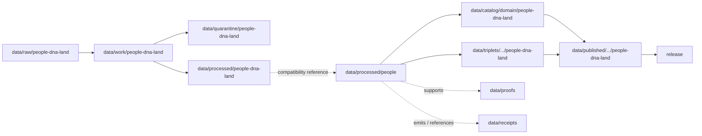

<!-- [KFM_META_BLOCK_V2]
doc_id: kfm://doc/data-processed-people-readme
title: data/processed/people/README.md — People Processed Data Compatibility README
version: v0.1
type: readme; data-lifecycle-domain-lane; processed-stage-guide; compatibility-lane; people-dna-land-people-sublane; assertion-evidence-lane
status: draft; PROPOSED; compatibility-path; data-root; processed-stage; people; people-dna-land; person-assertion; genealogy; privacy; consent; evidence-first; release-gated
authors: ChatGPT-5.5 Thinking; reviewed_by: OWNER_TBD
owners: OWNER_TBD — People/DNA/Land steward · People sublane steward · Privacy reviewer · Consent steward · Rights steward · Sensitivity reviewer · Data steward · Evidence steward · Policy steward · Release steward · Docs steward
created: NEEDS VERIFICATION — blank placeholder existed before v0.1 expansion
updated: 2026-06-25
policy_label: restricted-doc; data; processed; people; people-dna-land; privacy; consent; lifecycle; governed; release-gated
tags: [kfm, data, processed, people, people-dna-land, compatibility-path, person-assertion, person-canonical, name-assertion, life-event, residence-event, migration-event, genealogy-relationship, family-group, relationship-assertion, relationship-hypothesis, consent, privacy, source-role, EvidenceBundle, SourceDescriptor, ValidationReport, PolicyDecision, ConsentRecord, ReviewRecord, ReleaseManifest, RollbackCard, RAW, WORK, QUARANTINE, PROCESSED, CATALOG, TRIPLET, PUBLISHED]
related:
  - ../people-dna-land/README.md
  - dna/README.md
  - ../../processed/README.md
  - ../../../docs/domains/people-dna-land/README.md
  - ../../../docs/domains/people-dna-land/sublanes/people/README.md
  - ../../../docs/domains/people-dna-land/sublanes/dna.md
  - ../../../policy/domains/people-dna-land/
  - ../../../policy/sensitivity/people/
  - ../../../policy/consent/people/
  - ../../../contracts/domains/people-dna-land/
  - ../../../schemas/contracts/v1/domains/people-dna-land/
  - ../../raw/people-dna-land/
  - ../../work/people-dna-land/
  - ../../quarantine/people-dna-land/
  - ../../catalog/domain/people-dna-land/
  - ../../proofs/
  - ../../receipts/
  - ../../registry/sources/people-dna-land/
  - ../../../release/candidates/people-dna-land/
notes:
  - "This file replaces a blank placeholder at `data/processed/people/README.md`."
  - "This path is treated as a PROPOSED compatibility lane because current doctrine confirms `people-dna-land` as the data-domain segment while also documenting unresolved `people` versus `people-dna-land` segment conflicts for some roots."
  - "Canonical processed-domain coordination should stay under `data/processed/people-dna-land/` unless an ADR approves this shorter compatibility path."
  - "This lane may describe processed, consent-aware, policy-reviewed person/genealogy assertion derivatives. It must not contain RAW sources, WORK scratch, QUARANTINE holds, catalog/triplet records, proofs, receipts, registry records, release decisions, schemas, policy rules, validators, app/API/UI code, or public-release payloads."
  - "Rollback target for this expansion is previous blank placeholder blob SHA `8b137891791fe96927ad78e64b0aad7bded08bdc`."
[/KFM_META_BLOCK_V2] -->

<a id="top"></a>

# data/processed/people

> PROPOSED compatibility README for processed person and genealogy assertion artifacts associated with the People / Genealogy / DNA / Land domain. This path is not treated as canonical unless the open segment-name conflict is resolved in favor of the shorter `people/` data segment.

<p>
  
  
  
  
  
  
</p>

**Status:** draft / PROPOSED compatibility path  
**Owners:** OWNER_TBD — People/DNA/Land steward · People sublane steward · Privacy reviewer · Consent steward · Rights steward · Sensitivity reviewer · Data steward · Evidence steward · Policy steward · Release steward · Docs steward  
**Path:** `data/processed/people/README.md`  
**Owning root:** `data/processed/`  
**Requested segment:** `people`  
**Canonical domain segment for data roots:** `people-dna-land` unless ADR changes it  
**Lifecycle stage:** `PROCESSED`  
**Exposure posture:** not public by default; any public use requires governed catalog, EvidenceBundle, source-role and rights posture, consent where required, privacy/sensitivity review, PolicyDecision, ReleaseManifest, correction path, and rollback target.  
**Truth posture:** CONFIRMED target was a blank placeholder · CONFIRMED `data/processed/people-dna-land/` exists as the current processed parent lane · CONFIRMED People sublane doctrine says the domain slug is `people-dna-land` and sublane subdivision is PROPOSED pending ADR · PROPOSED this path as compatibility-only · NEEDS VERIFICATION for actual child inventory, ADR status, validators, fixtures, schemas, policy/consent enforcement, access-control enforcement, and governed route behavior.

**Quick jumps:** [Purpose](#purpose) · [Canonical path warning](#canonical-path-warning) · [Lifecycle boundary](#lifecycle-boundary) · [Repo fit](#repo-fit) · [Accepted contents](#accepted-contents) · [Exclusions](#exclusions) · [Processed requirements](#processed-requirements) · [Guardrails](#guardrails) · [Evidence ledger](#evidence-ledger) · [Validation checklist](#validation-checklist) · [Rollback](#rollback)

---

## Purpose

`data/processed/people/` is a requested, **PROPOSED compatibility path** for processed person and genealogy assertion artifacts. It should be used only if the repository keeps this short segment as a temporary bridge or if an ADR later makes it canonical.

The currently safer parent lane is:

```text
data/processed/people-dna-land/
```

This README therefore defines a containment rule: this path may document or hold only processed, consent-aware, policy-reviewed, non-public person/genealogy derivatives, and must not become an independent domain authority or public surface.

## Canonical path warning

Current doctrine says `people-dna-land` is the confirmed domain slug for data lifecycle lanes, while shorter `people` appears in some policy/crosswalk contexts. Until an ADR resolves the conflict, this file must be treated as **PROPOSED compatibility**, not canonical authority.

## Lifecycle boundary

```text
RAW -> WORK / QUARANTINE -> PROCESSED -> CATALOG / TRIPLET -> PUBLISHED
```



`data/processed/people/` is upstream of catalog, triplet, publication, and release. It must not be used as a normal public map/API/UI/AI source.

## Repo fit

| Responsibility | Correct home | Rule |
|---|---|---|
| Raw person records, source-native tree exports, source identifiers, source media, source logs, or original source payloads | `data/raw/people-dna-land/` | Not this lane. |
| In-process identity matching, genealogy hypotheses, consent review, privacy review, joins, notebooks, or scratch products | `data/work/people-dna-land/` | Not this lane. |
| Unresolved consent, unresolved rights, unresolved source role, disputed identity, unsafe joins, or public-risk material | `data/quarantine/people-dna-land/` | Not this lane until review/admission allows. |
| Canonical processed People/DNA/Land artifacts | `data/processed/people-dna-land/` | Preferred parent lane. |
| Compatibility People processed artifacts | `data/processed/people/` | This file; PROPOSED compatibility only. |
| DNA compatibility child path | `data/processed/people/dna/` | Existing compatibility child; not canonical without ADR. |
| Catalog records | `data/catalog/domain/people-dna-land/` | Downstream catalog stage. |
| Triplet/graph records | `data/triplets/.../people-dna-land/` | Downstream graph stage; must preserve restrictions. |
| Published public-safe products | `data/published/.../people-dna-land/` | Downstream only after release. |
| Proofs, receipts, source registry, policy, consent rules, schemas, validators, and release records | Their own roots | Not this lane. |

## Accepted contents

Processed person/genealogy artifacts may include only policy-admitted derivatives such as:

- `Person Assertion`, `NameAssertion`, `LifeEvent`, `Residence Event`, `Migration Event`, `Genealogy Relationship`, `FamilyGroup`, `RelationshipAssertion`, and `Relationship Hypothesis` derivatives;
- consent-reviewed evidence summaries;
- de-identified or aggregate context products where approved;
- review-ready linkage metadata that preserves EvidenceBundle, consent, source role, and restriction posture;
- sidecar metadata needed to interpret processed artifacts when it is not a receipt, proof, policy decision, release manifest, source registry record, schema, validator, or catalog record;
- lane-local README or manifest notes that explain processed-data boundaries without becoming public outputs.

## Exclusions

Do not store these under `data/processed/people/`:

- raw source records, direct source identifiers, source-native exports, source media, or source logs;
- workbench outputs, notebooks, experiments, unresolved joins, consent-review scratch, privacy-review scratch, or redaction-debug outputs;
- unresolved consent, rights, source-role, privacy, sensitivity, or release material;
- catalog records, graph/triplet records, published products, proofs, receipts, source registry records, release decisions, schemas, policy rules, consent rules, validators, tests, fixtures, pipelines, app/UI/API code, or packages;
- DNA evidence, land/title artifacts, property claims, medical/genetic advice, legal advice, public lookup services, or direct AI answer payloads;
- credentials, secrets, consent secrets, transform secrets, redaction parameters, aggregation thresholds, or implementation details that could aid exposure or unauthorized access.

## Processed requirements

PROPOSED until concrete validators, policies, fixtures, receipts, and access-control enforcement are verified:

| Requirement | Meaning |
|---|---|
| Canonical path check | Confirm whether this compatibility path is allowed, or migrate contents to `data/processed/people-dna-land/people/` if that becomes the accepted convention. |
| Source trace | Each source-derived artifact should trace to SourceDescriptor or source registry context. |
| Evidence linkage | Claims based on processed derivatives should resolve downstream to EvidenceBundle/proof context where appropriate. |
| Consent posture | Consent, restriction, revocation, and tombstone state must be resolvable where doctrine requires it. |
| Privacy posture | Artifacts should be restricted, aggregated, transformed, or denied before any public consideration. |
| Source role | Observation, authority, context, model, aggregate, administrative, candidate, and synthetic roles must remain explicit and not interchangeable. |
| Transform linkage | De-identification, aggregation, suppression, or delayed-publication transforms should link to appropriate receipts. |
| Review state | Privacy, consent, domain, rights, and release review should be recorded where required. |
| Catalog readiness | Processed artifacts intended for discovery should promote through catalog/triplet lanes, not directly to public use. |
| Release readiness | Public use requires release state, correction path, and rollback target. |
| No public surface by default | This lane must not be exposed directly as a public API, UI, download, map layer, Focus Mode answer, or AI-answer source. |

## Guardrails

- This path is PROPOSED compatibility, not canonical authority.
- Prefer `data/processed/people-dna-land/` for parent-domain processed coordination.
- Person assertions are evidence, not facts.
- Genealogy relationships and family groups are assertion/hypothesis objects unless EvidenceBundle and review state support stronger claims.
- Living-person fields fail closed at public surfaces.
- DNA and land/title material belong to sibling lanes and must not be collapsed into this path.
- Consent revocation requires downstream cleanup and tombstone handling where applicable.
- Synthetic AI summaries are not evidence.
- Public clients and Focus Mode must use governed APIs, released artifacts, catalog/triplet records, EvidenceBundle-backed payloads, and policy-safe envelopes, not this directory directly.

> [!CAUTION]
> Do not expose `data/processed/people/` directly as a public map, API, UI, download, Focus Mode answer, AI answer source, identity service, genealogy service, title service, legal advice source, genetic advice source, or property-rights proof. Processed person/genealogy data remains inside the trust membrane until governed promotion and release.

## Evidence ledger

| Source | Status | Supports | Limits |
|---|---|---|---|
| Previous file | CONFIRMED | Target existed as a blank placeholder. | Did not define People processed boundaries. |
| Repository search | CONFIRMED | Search found `data/processed/people-dna-land/README.md`, `data/processed/people-dna-land/land-ownership/README.md`, and `data/processed/people/dna/README.md`. | Search is not a full tree audit. |
| `data/processed/people-dna-land/README.md` | CONFIRMED parent README | Current processed parent lane uses `people-dna-land`, includes people/genealogy/DNA/land slices, and denies direct public use. | Does not prove this compatibility path is canonical. |
| `docs/domains/people-dna-land/sublanes/people/README.md` | CONFIRMED doctrine / PROPOSED implementation | People sublane covers person assertions, names, life/residence/migration events, genealogy relationships, and family groups; it says the sublane convention is proposed and responsibility-root lanes stay keyed to the whole domain. | Sublane and short-segment placement remain unresolved. |
| `policy/domains/people-dna-land/`, `policy/sensitivity/people/`, and `policy/consent/people/` | NEEDS VERIFICATION | Expected policy and consent homes. | Current enforcement was not verified in this task. |
| `contracts/domains/people-dna-land/` and `schemas/contracts/v1/domains/people-dna-land/` | NEEDS VERIFICATION | Expected object contract/schema homes under the whole-domain lane. | Specific object files and validators were not verified in this task. |

## Validation checklist

- [ ] Confirm whether `data/processed/people/` is an approved compatibility path, temporary bridge, or drift.
- [ ] Confirm whether canonical processed person/genealogy derivatives should live under `data/processed/people-dna-land/people/` instead.
- [ ] Resolve the `people` versus `people-dna-land` segment conflict by ADR.
- [ ] Confirm parent-domain processed README, contracts, schemas, policy, consent rules, validators, fixtures, and access controls.
- [ ] Confirm every artifact has source trace, evidence linkage, consent posture, privacy posture, transform receipts where applicable, review state, release state, correction path, and rollback target.
- [ ] Confirm source identifiers, unresolved consent material, secrets, threshold details, and release-unclear artifacts cannot enter this lane or public routes.
- [ ] Confirm public clients and Focus Mode cannot read this lane directly as public truth, public identity service, public genealogy service, public API, public UI, public download, or AI-answer source.

## Rollback

Rollback is required if this lane becomes a canonical root without ADR, RAW source-data root, WORK scratch root, QUARANTINE bypass, public output root, `data/published/` substitute, proof store, receipt store, catalog root, triplet root, source-registry root, release-decision root, schema root, policy root, consent-authority root, validator root, public API shortcut, public UI shortcut, public exposure shortcut, identity-adjudication surface, legal/genetic advice surface, title/property evidence surface, or public lookup source.

Rollback target for this expansion: previous blank placeholder blob SHA `8b137891791fe96927ad78e64b0aad7bded08bdc`.

<p align="right"><a href="#top">Back to top</a></p>
