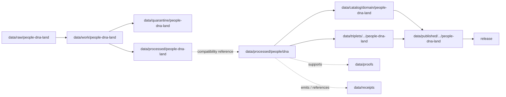

<!-- [KFM_META_BLOCK_V2]
doc_id: kfm://doc/data-processed-people-dna-readme
title: data/processed/people/dna/README.md — People DNA Processed Data README
version: v0.1
type: readme; data-lifecycle-sublane; processed-stage-guide; compatibility-lane; people-dna-land-dna-sublane; restricted-dna-derivative-lane
status: draft; PROPOSED; compatibility-path; data-root; processed-stage; people; dna; privacy; consent; evidence-first; release-gated
authors: ChatGPT-5.5 Thinking; reviewed_by: OWNER_TBD
owners: OWNER_TBD — People/DNA/Land steward · DNA steward · Consent steward · Privacy reviewer · Rights steward · Sensitivity reviewer · Data steward · Evidence steward · Policy steward · Release steward · Docs steward
created: NEEDS VERIFICATION — blank placeholder existed before v0.1 expansion
updated: 2026-06-25
policy_label: restricted-doc; data; processed; people; dna; privacy; consent; lifecycle; governed; release-gated
tags: [kfm, data, processed, people, dna, people-dna-land, compatibility-path, DNA-evidence, consent, privacy, aggregate, k-anonymized, transformed-derivative, EvidenceBundle, SourceDescriptor, ValidationReport, PolicyDecision, ConsentRecord, RedactionReceipt, ReviewRecord, ReleaseManifest, RollbackCard, RAW, WORK, QUARANTINE, PROCESSED, CATALOG, TRIPLET, PUBLISHED]
related:
  - ../../people-dna-land/README.md
  - ../../../processed/README.md
  - ../../../../docs/domains/people-dna-land/README.md
  - ../../../../policy/domains/people-dna-land/
  - ../../../../policy/sensitivity/people-dna-land/
  - ../../../../policy/consent/people-dna-land/
  - ../../../../contracts/domains/people-dna-land/
  - ../../../../schemas/contracts/v1/domains/people-dna-land/
  - ../../../raw/people-dna-land/
  - ../../../work/people-dna-land/
  - ../../../quarantine/people-dna-land/
  - ../../../catalog/domain/people-dna-land/
  - ../../../proofs/
  - ../../../receipts/
  - ../../../../release/candidates/people-dna-land/
notes:
  - "This file replaces a blank placeholder at `data/processed/people/dna/README.md`."
  - "This path is treated as a PROPOSED compatibility lane because current doctrine confirms `people-dna-land` as the data-domain segment while also documenting unresolved `people` versus `people-dna-land` segment conflicts for some roots."
  - "Canonical processed-domain coordination should stay under `data/processed/people-dna-land/` unless an ADR approves this shorter compatibility path."
  - "This lane may describe only processed, consent-aware, policy-reviewed DNA derivatives. It must not contain raw DNA source data, source vendor exports, direct segment data, identifiers, private match tables, consent secrets, or public-release payloads."
  - "Public use requires EvidenceBundle, consent/restriction posture, policy review, redaction or aggregation where applicable, ReleaseManifest, correction path, and rollback target."
  - "Rollback target for this expansion is previous blank placeholder blob SHA `8b137891791fe96927ad78e64b0aad7bded08bdc`."
[/KFM_META_BLOCK_V2] -->

<a id="top"></a>

# data/processed/people/dna

> PROPOSED compatibility README for processed DNA-derived artifacts associated with the People / Genealogy / DNA / Land domain. This path is not treated as canonical unless the open segment-name conflict is resolved in favor of the shorter `people/` data segment.

<p>
  
  
  
  
  
  
</p>

**Status:** draft / PROPOSED compatibility path  
**Owners:** OWNER_TBD — People/DNA/Land steward · DNA steward · Consent steward · Privacy reviewer · Rights steward · Sensitivity reviewer · Data steward · Evidence steward · Policy steward · Release steward · Docs steward  
**Path:** `data/processed/people/dna/README.md`  
**Owning root:** `data/processed/`  
**Requested segment:** `people/dna`  
**Canonical domain segment for data roots:** `people-dna-land` unless ADR changes it  
**Lifecycle stage:** `PROCESSED`  
**Exposure posture:** not public by default; any public use requires governed catalog, EvidenceBundle, consent/restriction posture, rights posture, privacy/sensitivity review, DNA-safety review, redaction or aggregation where applicable, PolicyDecision, ReleaseManifest, correction path, and rollback target.  
**Truth posture:** CONFIRMED target was a blank placeholder · CONFIRMED `data/processed/people-dna-land/` exists as the current processed parent lane · CONFIRMED People/DNA/Land doctrine flags a `people` versus `people-dna-land` segment conflict · PROPOSED this path as compatibility-only · NEEDS VERIFICATION for actual child inventory, ADR status, validators, fixtures, schemas, consent-policy enforcement, access-control enforcement, and governed route behavior.

**Quick jumps:** [Purpose](#purpose) · [Canonical path warning](#canonical-path-warning) · [Lifecycle boundary](#lifecycle-boundary) · [Repo fit](#repo-fit) · [Accepted contents](#accepted-contents) · [Exclusions](#exclusions) · [Processed requirements](#processed-requirements) · [Guardrails](#guardrails) · [Evidence ledger](#evidence-ledger) · [Validation checklist](#validation-checklist) · [Rollback](#rollback)

---

## Purpose

`data/processed/people/dna/` is a requested, **PROPOSED compatibility path** for processed DNA-derived artifacts. It should be used only if the repository keeps this short segment as a temporary bridge or if an ADR later makes it canonical.

The currently safer parent lane is:

```text
data/processed/people-dna-land/
```

This README therefore defines a containment rule: this path may document or hold only processed, consent-aware, policy-reviewed, non-public DNA derivatives, and must not become an independent domain authority or public surface.

## Canonical path warning

Current doctrine says the People / Genealogy / DNA / Land domain has a segment-name conflict. Directory Rules examples and the current processed parent README use `people-dna-land` for data roots. Some crosswalk material uses a shorter `people` segment for other responsibility roots. Until an ADR resolves the conflict, this file must be treated as **PROPOSED compatibility**, not canonical authority.

## Lifecycle boundary

```text
RAW -> WORK / QUARANTINE -> PROCESSED -> CATALOG / TRIPLET -> PUBLISHED
```



`data/processed/people/dna/` is upstream of catalog, triplet, publication, and release. It must not be used as a normal public map/API/UI/AI source.

## Repo fit

| Responsibility | Correct home | Rule |
|---|---|---|
| Raw DNA source data, vendor exports, source identifiers, direct segment data, or source-native reports | `data/raw/people-dna-land/` | Not this lane. |
| In-process DNA transformation, consent review, privacy review, aggregation trials, de-identification work, joins, notebooks, or scratch products | `data/work/people-dna-land/` | Not this lane. |
| Unresolved consent, unresolved rights, raw or high-risk DNA material, unresolved source role, unsafe joins, or public-risk material | `data/quarantine/people-dna-land/` | Not this lane until review/admission allows. |
| Canonical processed People/DNA/Land artifacts | `data/processed/people-dna-land/` | Preferred parent lane. |
| Compatibility DNA processed artifacts | `data/processed/people/dna/` | This file; PROPOSED compatibility only. |
| Catalog records | `data/catalog/domain/people-dna-land/` | Downstream catalog stage. |
| Triplet/graph records | `data/triplets/.../people-dna-land/` | Downstream graph stage; must preserve restrictions. |
| Published public-safe products | `data/published/.../people-dna-land/` | Downstream only after release. |
| Proofs, receipts, source registry, policy, consent rules, schemas, validators, and release records | Their own roots | Not this lane. |

## Accepted contents

Processed DNA-related artifacts may include only policy-admitted derivatives such as:

- aggregate or k-anonymized DNA-derived summaries;
- consent-reviewed DNA evidence summaries;
- transformed derivative records that remove raw source detail;
- review-ready linkage metadata that preserves EvidenceBundle, consent, source role, and restriction posture;
- sidecar metadata needed to interpret processed artifacts when it is not a receipt, proof, policy decision, release manifest, source registry record, schema, validator, or catalog record;
- lane-local README or manifest notes that explain processed-data boundaries without becoming public outputs.

## Exclusions

Do not store these under `data/processed/people/dna/`:

- raw DNA files, vendor exports, source identifiers, direct segment data, private match tables, triangulation outputs, source-native reports, or source media;
- workbench outputs, notebooks, experiments, unresolved joins, consent-review scratch, privacy-review scratch, or redaction-debug outputs;
- unresolved consent, rights, source-role, privacy, sensitivity, or release material;
- catalog records, graph/triplet records, published products, proofs, receipts, source registry records, release decisions, schemas, policy rules, consent rules, validators, tests, fixtures, pipelines, app/UI/API code, or packages;
- identity conclusions, medical/genetic advice, title or property claims, person search products, public DNA lookup services, or direct AI answer payloads;
- credentials, secrets, consent secrets, transform secrets, redaction parameters, aggregation thresholds, or implementation details that could aid exposure or unauthorized access.

## Processed requirements

PROPOSED until concrete validators, policies, fixtures, receipts, and access-control enforcement are verified:

| Requirement | Meaning |
|---|---|
| Canonical path check | Confirm whether this compatibility path is allowed, or migrate contents to `data/processed/people-dna-land/dna/` if that becomes the accepted convention. |
| Source trace | Each source-derived artifact should trace to SourceDescriptor or source registry context. |
| Evidence linkage | Claims based on processed derivatives should resolve downstream to EvidenceBundle/proof context where appropriate. |
| Consent posture | Consent, restriction, revocation, and tombstone state must be resolvable where doctrine requires it. |
| Privacy posture | Artifacts should be transformed, aggregated, restricted, or denied before any public consideration. |
| Source role | Observed, modeled, aggregate, administrative, candidate, and synthetic roles must remain explicit and not interchangeable. |
| Transform linkage | De-identification, aggregation, k-anonymization, suppression, or delayed-publication transforms should link to appropriate receipts. |
| Review state | Privacy, consent, domain, rights, and release review should be recorded where required. |
| Catalog readiness | Processed artifacts intended for discovery should promote through catalog/triplet lanes, not directly to public use. |
| Release readiness | Public use requires release state, correction path, and rollback target. |
| No public surface by default | This lane must not be exposed directly as a public API, UI, download, map layer, Focus Mode answer, or AI-answer source. |

## Guardrails

- This path is PROPOSED compatibility, not canonical authority.
- Prefer `data/processed/people-dna-land/` for parent-domain processed coordination.
- DNA-derived material must remain consent-aware, privacy-aware, source-role-aware, and evidence-bound.
- Raw or directly identifying DNA material does not belong in processed paths.
- DNA-derived language must not become identity fact, genealogy proof, title proof, medical advice, or public lookup output.
- Consent revocation requires downstream cleanup and tombstone handling where applicable.
- Synthetic AI summaries are not evidence.
- Public clients and Focus Mode must use governed APIs, released artifacts, catalog/triplet records, EvidenceBundle-backed payloads, and policy-safe envelopes, not this directory directly.

> [!CAUTION]
> Do not expose `data/processed/people/dna/` directly as a public map, API, UI, download, Focus Mode answer, AI answer source, DNA lookup, identity service, medical/genetic advice source, or title/property evidence source. Processed DNA-derived data remains inside the trust membrane until governed promotion and release.

## Evidence ledger

| Source | Status | Supports | Limits |
|---|---|---|---|
| Previous file | CONFIRMED | Target existed as a blank placeholder. | Did not define DNA processed boundaries. |
| Repository search | CONFIRMED | No established `data/processed/people/dna/` README pattern was found in the searched results. | Search is not a full tree audit. |
| `data/processed/people-dna-land/README.md` | CONFIRMED parent README | Current processed parent lane uses `people-dna-land`, includes DNA as a restricted/proposed child area, and denies direct public use. | Does not prove this compatibility path is canonical. |
| `docs/domains/people-dna-land/README.md` | CONFIRMED doctrine / PROPOSED implementation | Domain doctrine flags strict defaults for living-person and DNA-related material and documents the segment-name conflict. | Segment naming remains unresolved. |
| `policy/domains/people-dna-land/`, `policy/sensitivity/people-dna-land/`, and `policy/consent/people-dna-land/` | NEEDS VERIFICATION | Expected policy and consent homes. | Current enforcement was not verified in this task. |
| `contracts/domains/people-dna-land/` and `schemas/contracts/v1/domains/people-dna-land/` | NEEDS VERIFICATION | Expected object contract/schema homes if segment conflict resolves this way. | Specific object files and validators were not verified in this task. |

## Validation checklist

- [ ] Confirm whether `data/processed/people/dna/` is an approved compatibility path, a temporary bridge, or drift.
- [ ] Confirm whether canonical processed DNA derivatives should live under `data/processed/people-dna-land/dna/` instead.
- [ ] Resolve the `people` versus `people-dna-land` segment conflict by ADR.
- [ ] Confirm parent-domain processed README, contracts, schemas, policy, consent rules, validators, fixtures, and access controls.
- [ ] Confirm every artifact has source trace, evidence linkage, consent posture, privacy posture, transform receipts where applicable, review state, release state, correction path, and rollback target.
- [ ] Confirm raw DNA source material, direct segment data, source identifiers, unresolved consent material, secrets, threshold details, and release-unclear artifacts cannot enter this lane or public routes.
- [ ] Confirm public clients and Focus Mode cannot read this lane directly as public truth, public identity service, public DNA service, public API, public UI, public download, or AI-answer source.

## Rollback

Rollback is required if this lane becomes a canonical root without ADR, RAW source-data root, WORK scratch root, QUARANTINE bypass, public output root, `data/published/` substitute, proof store, receipt store, catalog root, triplet root, source-registry root, release-decision root, schema root, policy root, consent-authority root, validator root, public API shortcut, public UI shortcut, public exposure shortcut, identity-adjudication surface, medical/genetic advice surface, title/property evidence surface, or source of public DNA lookup.

Rollback target for this expansion: previous blank placeholder blob SHA `8b137891791fe96927ad78e64b0aad7bded08bdc`.

<p align="right"><a href="#top">Back to top</a></p>
