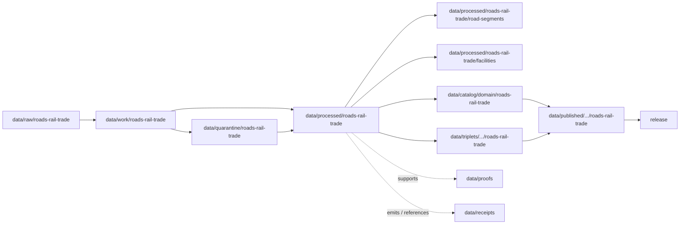

<!-- [KFM_META_BLOCK_V2]
doc_id: kfm://doc/data-processed-roads-rail-trade-readme
title: data/processed/roads-rail-trade/README.md — Roads / Rail / Trade Processed Data README
version: v0.1
type: readme; data-lifecycle-domain-lane; processed-stage-guide; roads-rail-trade-domain-root; transport-network-lane-index
status: draft; PROPOSED; data-root; processed-stage; roads-rail-trade; road-segments; rail-segments; corridors; route-membership; topology; crossings; facilities; restrictions; status-events; operator-assignments; historic-routes; trade-routes; source-role-aware; sensitivity-aware; release-gated; evidence-first
authors: ChatGPT-5.5 Thinking; reviewed_by: OWNER_TBD
owners: OWNER_TBD — Roads/Rail/Trade steward · Network/topology steward · Transport facility steward · Sensitivity reviewer · Rights steward · Data steward · Pipeline steward · Evidence steward · Policy steward · Release steward · Docs steward
created: NEEDS VERIFICATION — greenfield stub existed before v0.1 expansion
updated: 2026-06-25
policy_label: public-doc; data; processed; roads-rail-trade; transport-network; lifecycle; governed; source-role-aware; sensitivity-aware; release-gated
tags: [kfm, data, processed, roads-rail-trade, roads-rail, road-segment, rail-segment, corridor-route, route-membership, network-node, crossing, bridge, ferry, transport-facility, restriction-event, status-event, operator-assignment, historic-route-claim, trade-route-corridor, source-role, observed, regulatory, modeled, aggregate, administrative, candidate, synthetic, EvidenceBundle, SourceDescriptor, ValidationReport, PolicyDecision, ReviewRecord, RedactionReceipt, ReleaseManifest, RollbackCard, RAW, WORK, QUARANTINE, PROCESSED, CATALOG, TRIPLET, PUBLISHED]
related:
  - ../README.md
  - ../../README.md
  - ../../../docs/domains/roads-rail-trade/OBJECT_FAMILIES.md
  - ../../../docs/domains/roads-rail-trade/SENSITIVITY.md
  - ../../../docs/domains/roads-rail-trade/PIPELINE.md
  - ../../../docs/domains/roads-rail-trade/SOURCE_REGISTRY.md
  - ../../../docs/domains/roads-rail-trade/VERIFICATION_BACKLOG.md
  - ../../../docs/domains/settlements-infrastructure/README.md
  - ../../../docs/domains/hydrology/README.md
  - ../../../docs/domains/hazards/README.md
  - ../../../docs/domains/archaeology/README.md
  - ../../../contracts/domains/roads-rail-trade/README.md
  - ../../../contracts/domains/roads-rail-trade/corridor_route.md
  - ../../../contracts/domains/roads-rail-trade/depot.md
  - ../../../policy/sensitivity/transport/
  - ../../../policy/domains/roads-rail-trade/
  - ../../../schemas/contracts/v1/domains/roads-rail-trade/
  - ../../raw/roads-rail-trade/
  - ../../work/roads-rail-trade/
  - ../../quarantine/roads-rail-trade/
  - ../../catalog/domain/roads-rail-trade/
  - ../../triplets/
  - ../../published/
  - ../../proofs/
  - ../../receipts/
  - ../../registry/sources/roads-rail-trade/
  - ../../../release/candidates/roads-rail-trade/
  - ../../../release/
  - ../../../pipelines/domains/roads-rail-trade/
  - ../../../pipeline_specs/roads-rail-trade/
  - ../../../tools/validators/
  - road-segments/README.md
  - facilities/README.md
notes:
  - "This file replaces a greenfield stub at `data/processed/roads-rail-trade/README.md`."
  - "This is the parent PROCESSED-stage domain lane for Roads / Rail / Trade artifacts. It is not RAW source storage, WORK scratch, QUARANTINE holding, CATALOG, TRIPLET, PUBLISHED, proof storage, receipt storage, source registry, policy authority, release authority, public API/UI output, public map/tile output, routing engine, operations surface, emergency-routing surface, legal road-status authority, infrastructure condition surface, or life-safety guidance."
  - "Roads/Rail/Trade owns road and rail evidence, corridors and route membership, network topology, crossings/bridges/ferries, transport facilities, restriction/status events, operator assignments, and historic/trade-route claims, while other domains retain their own truth and sensitivity policies."
  - "Source-role anti-collapse is mandatory: observed, regulatory, modeled, aggregate, administrative, candidate, and synthetic roles are not interchangeable and promotion never upgrades a role."
  - "Sensitivity is not decided by geometry alone. Cultural corridors, critical-facility detail, exact-harm coordinates, restricted source terms, archaeological joins, and infrastructure-adjacent condition/vulnerability detail require the most restrictive applicable policy row and review before public exposure."
  - "Modern road/rail segment data may be public-safe only through governed release; processed data itself is not a public surface or proof."
  - "This README is a parent lane guide and index. Child lane READMEs define local boundaries; contracts define semantic object meaning; schemas define machine shape; policy decides admissibility; release records decide publication."
  - "Rollback target for this expansion is previous greenfield stub blob SHA `2c072c3fa5b425aa66a5339bf720cb5398ccb298`."
[/KFM_META_BLOCK_V2] -->

<a id="top"></a>

# data/processed/roads-rail-trade

> Parent Roads / Rail / Trade PROCESSED-stage lane for normalized, source-traced, source-role-preserved transport-network artifacts that have passed beyond RAW/WORK/QUARANTINE but are not yet cataloged, triplet-projected, published, or released.

<p>
  
  
  
  
  
  
</p>

**Status:** draft / PROPOSED  
**Owners:** OWNER_TBD — Roads/Rail/Trade steward · Network/topology steward · Transport facility steward · Sensitivity reviewer · Rights steward · Data steward · Pipeline steward · Evidence steward · Policy steward · Release steward · Docs steward  
**Path:** `data/processed/roads-rail-trade/README.md`  
**Owning root:** `data/processed/`  
**Domain segment:** `roads-rail-trade`  
**Lifecycle stage:** `PROCESSED`  
**Exposure posture:** not public by default; any public use requires governed catalog, EvidenceBundle, source-role and rights posture, sensitivity review, policy decision where applicable, ReleaseManifest, correction path, and rollback target.  
**Truth posture:** CONFIRMED target was a greenfield stub · CONFIRMED parent `data/processed/` is upstream of catalog/triplet/publication and is not a normal public surface · CONFIRMED Roads/Rail/Trade object doctrine names the lane object-family spine · CONFIRMED source role is fixed at admission and preserved through promotion · CONFIRMED modern road/rail segment geometry may be public-safe only after release while cultural, exact-harm, restricted-source, and infrastructure-adjacent cases can require generalization, restriction, or denial · PROPOSED parent-lane details and child-lane index · NEEDS VERIFICATION for actual child inventory, validators, fixtures, source descriptors, access-control enforcement, receipt families, policy enforcement, release linkage, and governed route behavior.

**Quick jumps:** [Purpose](#purpose) · [Lifecycle boundary](#lifecycle-boundary) · [Repo fit](#repo-fit) · [Lane index](#lane-index) · [Accepted contents](#accepted-contents) · [Exclusions](#exclusions) · [Processed requirements](#processed-requirements) · [Source-role and sensitivity guardrails](#source-role-and-sensitivity-guardrails) · [Evidence ledger](#evidence-ledger) · [Validation checklist](#validation-checklist) · [Rollback](#rollback)

---

## Purpose

`data/processed/roads-rail-trade/` is the parent PROCESSED-stage lane for normalized Roads / Rail / Trade artifacts. It organizes processed outputs after source capture, geometry normalization, segmentation, identity reconciliation, topology processing, source-role preservation, sensitivity review, rights review, validation-oriented processing, or public-safe derivative preparation.

This lane may contain or point to processed artifacts for:

- road and rail segments;
- named corridors and route membership;
- network nodes and topology;
- crossings, bridges, ferries, and other network-related point/structure context;
- transport facilities such as depots, stations, yards, terminals, interchanges, and rosters;
- restriction events and status events;
- operator assignments;
- historic route claims and trade-route corridors;
- generalized or redacted public-candidate derivatives that remain release-gated.

This parent README does not create a semantic contract, schema, validator, source registry, proof, receipt, policy decision, release decision, public map layer, public tile, public API route, public UI payload, routing engine, emergency-routing surface, operations dashboard, infrastructure condition disclosure, legal road-status authority, right-of-way proof, or life-safety product.

## Lifecycle boundary

```text
RAW -> WORK / QUARANTINE -> PROCESSED -> CATALOG / TRIPLET -> PUBLISHED
```



`data/processed/roads-rail-trade/` is upstream of catalog, triplet, publication, and release. It must not be used as a normal public map/API/UI/AI source.

## Repo fit

| Responsibility | Correct home | Rule |
|---|---|---|
| Raw road/rail source files, agency exports, rosters, source logs, original coordinates, source identifiers, source-native geometry, or unprocessed partner materials | `data/raw/roads-rail-trade/` | Not this lane. |
| In-process segmentation, geometry repair, conflation, identity reconciliation, topology repair, route/facility matching, QA, notebooks, or scratch products | `data/work/roads-rail-trade/` | Not this lane. |
| Unresolved rights, unresolved source role, disputed identity, topology failure, restricted-source fields, cultural corridor joins, unsafe coordinates, critical-facility details, or not-yet-reviewed transport material | `data/quarantine/roads-rail-trade/` | Not this lane until review/admission allows. |
| Normalized Roads/Rail/Trade processed artifacts | `data/processed/roads-rail-trade/` | This parent lane and verified child lanes. |
| Processed road-segment artifacts | `data/processed/roads-rail-trade/road-segments/` | Child lane. |
| Processed transport-facility artifacts | `data/processed/roads-rail-trade/facilities/` | Child lane. |
| Roads/Rail/Trade catalog records | `data/catalog/domain/roads-rail-trade/` | Downstream catalog stage. |
| Triplet/graph records | `data/triplets/.../roads-rail-trade/` | Downstream graph stage; must not expose restricted precision or role-collapsed claims. |
| Published public-safe products | `data/published/.../roads-rail-trade/` | Downstream only after release. |
| EvidenceBundle/proof records | `data/proofs/` | Separate proof family. |
| Source, run, transform, redaction, validation, policy, correction, access, and release receipts | `data/receipts/` | Separate receipt family. |
| Source registry records | `data/registry/sources/roads-rail-trade/` | Separate source authority. |
| Release candidates and release manifests | `release/candidates/roads-rail-trade/`, `release/` | Separate publication authority. |
| Contracts | `contracts/domains/roads-rail-trade/` or ADR-resolved segment | Object meaning; not data. |
| Schemas | `schemas/contracts/v1/domains/roads-rail-trade/` or ADR-resolved segment | Machine shape; not data. |
| Policy and sensitivity rules | `policy/domains/roads-rail-trade/`, `policy/sensitivity/transport/` or ADR-resolved segment | Admissibility authority; not data. |
| Validators, tests, fixtures, pipelines, pipeline specs, apps, packages | `tools/validators/`, `tests/`, `fixtures/`, `pipelines/`, `pipeline_specs/`, `apps/`, `packages/` | Separate roots. |

## Lane index

Known or intended child lanes under `data/processed/roads-rail-trade/` are listed below. Treat entries as **PROPOSED** unless current child READMEs, validators, fixtures, policies, receipts, access controls, and CI enforcement have been verified in the same implementation pass.

| Lane | Family | Purpose | Hard boundary |
|---|---|---|---|
| `road-segments/` | Road Segment | Normalized road linear primitives, segmentation, geometry, topology, and relationship candidates. | Not route membership, legal status, emergency routing, or navigation authority by itself. |
| `facilities/` | TransportFacility | Depots, stations, yards, terminals, interchanges, rosters, and facility-like transport nodes. | Not infrastructure ownership, condition/vulnerability disclosure, or operations surface by itself. |
| `rail-segments/` | Rail Segment | Rail linear primitives and rail-network context. | Not operator status or current operations by itself. |
| `corridors/` | CorridorRoute / TradeRouteCorridor | Named corridor and trade-route corridor context. | Cultural corridors require steward review and generalized public geometry unless reviewed precision is approved. |
| `route-membership/` | RouteMembership | Associative membership of road/rail segments in routes/corridors. | Membership must remain distinct from segment identity. |
| `network-nodes/` | Network Node | Junctions, termini, and network topology nodes. | Topology is derived context, not source truth by itself. |
| `crossings/` | Crossing / Bridge / Ferry | Crossing points and crossing-related structure/service context. | Hydrology owns water truth; Settlements/Infrastructure may own structure identity or condition. |
| `events/` | RestrictionEvent / StatusEvent | Time-bound restrictions, closures, condition/status changes, and related event context. | Events are not static segment/facility identity. |
| `operators/` | OperatorAssignment | Operator/owner/service assignment context. | Assignment is not legal ownership or right-of-way proof by itself. |
| `historic/` | Historic RouteClaim | Historical route assertions and claim context. | Historic claims remain evidence-bound and may require uncertainty/generalization. |
| `public/` | Public-candidate derivatives | Candidate generalized/released-style derivatives. | `public/` means public-candidate if present, not published or released. |
| `restricted/` | Restricted processed artifacts | Cultural, critical-facility, exact-harm, restricted-source, or rights-limited artifacts admitted by policy. | Non-public, access-controlled, fail-closed. |

## Accepted contents

Processed Roads/Rail/Trade artifacts may include:

- normalized tabular, spatial, temporal, vector, network, graph-ready, or review-ready transport artifacts;
- source-role-tagged Road Segment, Rail Segment, CorridorRoute, RouteMembership, Network Node, Crossing, Bridge, Ferry, TransportFacility, RestrictionEvent, StatusEvent, OperatorAssignment, Historic RouteClaim, and TradeRouteCorridor products;
- identity, geometry, topology, split/merge, route membership, facility relationship, status/restriction, operator, vintage, and source-version sidecars needed to interpret processed products;
- generalized, redacted, de-identified, aggregated, suppressed, delayed, or restricted derivatives that still require catalog/release review before public use;
- sidecar metadata needed to interpret processed artifacts when it is not a receipt, proof, policy decision, release manifest, source registry record, schema, validator, or catalog record;
- lane-local README or manifest notes that explain processed-data boundaries without becoming public outputs or authority records.

## Exclusions

Do not store these under `data/processed/roads-rail-trade/`:

- RAW source files, source-native road/rail/facility files, agency exports, source media, logs, source identifiers, or unprocessed source payloads.
- WORK/scratch files, notebooks, segmentation experiments, geometry-repair trials, conflation trials, split/merge trials, route matching trials, topology experiments, facility matching scratch, or redaction-debug outputs.
- Quarantined or unresolved sensitive/rights/source-role/topology material.
- Catalog records, triplet/graph records, published products, proof records, receipt records, source registry records, release decisions, schemas, policy rules, validators, tests, fixtures, pipelines, app/UI/API code, or packages.
- Infrastructure canonical claims, hydrology truth, hazards/emergency truth, archaeology/cultural-route truth, people/land/right-of-way truth, land ownership truth, legal road status, or operator legal authority owned by other lanes.
- Public API/UI/tile payloads, direct downloads, Focus Mode answers, public map layers, routing engines, navigation services, emergency routing, operations dashboards, security products, legal advice, or life-safety guidance.
- Restricted source terms, private agreement details, credentials, secrets, redaction parameters, aggregation thresholds, exact transform offsets, critical-facility detail, condition/vulnerability detail, unsafe exact coordinates, or implementation details that could aid exposure or unauthorized access.

## Processed requirements

PROPOSED until concrete validators, policies, fixtures, receipts, and access-control enforcement are verified:

| Requirement | Meaning |
|---|---|
| Source trace | Each source-derived artifact should trace to SourceDescriptor or roads/rail/trade source registry context. |
| Evidence linkage | Claims about segment identity, facility identity, corridor membership, topology, crossing, event, operator assignment, historical route claim, transform, review, or release readiness should resolve downstream to EvidenceBundle/proof context where appropriate. |
| Source role | Observed, regulatory, modeled, aggregate, administrative, candidate, and synthetic roles must remain explicit and not interchangeable. |
| Object distinction | Road Segment, Rail Segment, CorridorRoute, RouteMembership, Network Node, Crossing, Bridge, Ferry, TransportFacility, RestrictionEvent, StatusEvent, OperatorAssignment, Historic RouteClaim, and TradeRouteCorridor must remain distinct. |
| Identity posture | Identity must not be collapsed by geometry similarity alone; source id, object role, temporal scope, and normalized digest remain material. |
| Geometry and topology | CRS, geometry validity, segmentation, split/merge lineage, topology, node relation, and route membership ambiguity should be recorded or receipt-linked. |
| Time semantics | Source time, observed time, valid time, event time, retrieval time, release time, and correction time should remain distinguishable where material. |
| Rights posture | Agency, operator, archive, partner, license, redistribution, attribution, derivative-use, and restricted-source terms should be resolved or held closed. |
| Sensitivity posture | Cultural corridor joins, exact-harm coordinates, restricted-source fields, critical-facility detail, infrastructure-adjacent details, and sensitive downstream joins should carry restriction/generalization/denial posture where needed. |
| Transform linkage | Reprojection, simplification, generalization, aggregation, redaction, suppression, withholding, delayed publication, or public-safe transform should link to appropriate receipt families. |
| Review state | Domain steward, network/topology reviewer, sensitivity reviewer, rights reviewer, data-quality reviewer, and release authority review should be recorded where required. |
| Policy decision | Restricted, public-candidate, and public transitions require PolicyDecision/admissibility posture where policy requires it. |
| Catalog readiness | Processed artifacts intended for discovery should promote through catalog/triplet lanes, not directly to public use. |
| Release readiness | Public use requires ReleaseManifest or release-linked state, published output path, correction path, and rollback target. |
| No public surface by default | Processed artifacts must not be exposed directly as public maps, tiles, APIs, downloads, Focus Mode answers, or AI-answer sources. |

## Source-role and sensitivity guardrails

- Processed Roads/Rail/Trade data is not proof by itself.
- Geometry similarity must not collapse identity across sources, roles, vintages, or temporal scopes.
- Administrative inventories must not become observed field evidence by promotion.
- Modeled or reconstructed objects remain modeled/candidate unless evidence and review support stronger claims.
- RouteMembership and CorridorRoute records must remain separate from raw segment identity.
- RestrictionEvent and StatusEvent records must remain separate from static segment/facility identity.
- OperatorAssignment is not legal ownership or right-of-way proof by itself.
- Settlements/Infrastructure owns settlement and infrastructure canonical claims when those are at issue.
- Hydrology owns water evidence for river/stream crossings; Roads/Rail/Trade may cite crossing relations.
- Hazards owns emergency/hazard state; Roads/Rail/Trade may cite, not replace, that truth.
- Archaeology and cultural-stewardship policy governs sensitive cultural-route joins.
- Modern public road/rail geometry may become public-safe only through governed release. Exact-harm coordinates, cultural corridor joins, restricted source terms, and infrastructure-adjacent details fail closed until policy, evidence, review, release state, correction path, and rollback are resolved.
- Public clients and Focus Mode must use governed APIs, released artifacts, catalog/triplet records, EvidenceBundle-backed payloads, and policy-safe envelopes, not this directory directly.

> [!CAUTION]
> Do not expose `data/processed/roads-rail-trade/` directly as a public map, tile service, API, UI, download, Focus Mode answer, AI answer source, routing engine, navigation authority, emergency routing surface, operations surface, security surface, legal road-status authority, right-of-way proof, infrastructure condition disclosure, or life-safety product. Processed Roads/Rail/Trade data remains inside the trust membrane until governed promotion and release.

## Evidence ledger

| Source | Status | Supports | Limits |
|---|---|---|---|
| Previous file | CONFIRMED | Target existed as a greenfield stub. | Did not define Roads/Rail/Trade processed boundaries or child lanes. |
| `data/processed/README.md` | CONFIRMED | PROCESSED data is upstream of catalog, triplets, publication, and release and is not the normal public surface. | Does not prove Roads/Rail/Trade child inventory or enforcement. |
| `docs/domains/roads-rail-trade/OBJECT_FAMILIES.md` | CONFIRMED doctrine / PROPOSED implementation | Roads/Rail/Trade owns the named object-family spine; identity is source/role/time/digest-based; source role is fixed at admission; geometry alone must not collapse identity. | Field realization, schemas, and exact object graph remain NEEDS VERIFICATION. |
| `docs/domains/roads-rail-trade/SENSITIVITY.md` | CONFIRMED doctrine / PROPOSED implementation | Modern public road/rail segments may be T0 after release; cultural, exact-harm, restricted-source, archaeology, critical-facility, and infrastructure-adjacent cases may require generalization, restriction, or denial. | Final policy enforcement and tier adoption remain NEEDS VERIFICATION. |
| `data/processed/roads-rail-trade/road-segments/README.md` | CONFIRMED child README | Road-segment child lane exists and separates Road Segment from routes, events, operators, hazards, infrastructure, and public routing surfaces. | Does not prove validators. |
| `data/processed/roads-rail-trade/facilities/README.md` | CONFIRMED child README | Facilities child lane exists and separates TransportFacility context from public surfaces and sensitive facility detail. | Does not prove validators. |
| `policy/sensitivity/transport/` and `policy/domains/roads-rail-trade/` | NEEDS VERIFICATION | Expected admissibility homes. | Current policy files and enforcement were not verified in this task. |
| `contracts/domains/roads-rail-trade/` and `schemas/contracts/v1/domains/roads-rail-trade/` | NEEDS VERIFICATION | Expected object contract/schema homes if segment conflict resolves this way. | Specific object files and validators were not verified in this task. |

## Validation checklist

- [ ] Confirm actual child directories under `data/processed/roads-rail-trade/` and reconcile missing, duplicate, alias, legacy, or compatibility lanes.
- [ ] Confirm accepted processed path convention for road segments, rail segments, corridors, route membership, network nodes, crossings, bridges, ferries, facilities, events, operators, historic claims, trade-route corridors, public-candidate, and restricted artifacts.
- [ ] Confirm each child lane has README, owner, purpose, accepted contents, exclusions, guardrails, validation checklist, and rollback target.
- [ ] Confirm object contracts and schema paths for Road Segment, Rail Segment, CorridorRoute, RouteMembership, Network Node, Crossing, Bridge, Ferry, TransportFacility, RestrictionEvent, StatusEvent, OperatorAssignment, Historic RouteClaim, and TradeRouteCorridor.
- [ ] Resolve the `roads-rail-trade` versus `roads-rail` segment divergence for schemas/contracts/policy if still open.
- [ ] Confirm validators, fixtures, CI checks, source-role checks, geometry checks, topology checks, segmentation checks, event/status checks, sensitivity checks, redaction checks, restricted-source checks, and access-control enforcement.
- [ ] Confirm SourceDescriptor/source registry linkage for every input source and derived artifact.
- [ ] Confirm RunReceipt, TransformReceipt, RedactionReceipt, ReviewRecord, ValidationReport, PolicyDecision, CorrectionNotice, ReleaseManifest, RollbackCard, correction path, and rollback target where applicable.
- [ ] Confirm culturally sensitive joins, critical-facility details, condition/vulnerability fields, restricted-source fields, unsafe exact coordinates, topology failures, identity ambiguity, secrets, private agreement terms, redaction parameters, transform secrets, and release-unclear artifacts cannot enter public routes.
- [ ] Confirm public-candidate transitions are governed, evidence-backed, source-role-safe, rights-safe, sensitivity-safe, topology-safe, review-backed, release-linked, and reversible.
- [ ] Confirm no RAW, WORK, QUARANTINE, CATALOG, TRIPLET, PUBLISHED, proof, receipt, registry, release, schema, policy, validator, package, pipeline, app, API, public map, public tile, direct download, Focus Mode answer, routing engine, navigation authority, emergency routing, operations surface, security surface, legal advice, or life-safety artifact is misplaced here.
- [ ] Confirm public clients and Focus Mode cannot read this lane directly as public truth, public transport service, public map, public tile, public API, public UI, or AI-answer source.

## Rollback

Rollback is required if this parent lane becomes a RAW source-data root, WORK scratch root, QUARANTINE bypass, public output root, `data/published/` substitute, public-candidate shortcut, source-role collapse path, identity-by-geometry path, topology-error publication path, cultural-route exposure path, critical-facility exposure path, condition/vulnerability exposure path, restricted-source leakage path, unsafe coordinate exposure path, transform-secret exposure path, agreement/credential exposure path, proof store, receipt store, catalog root, triplet root, source-registry root, release-decision root, schema root, policy root, validator root, implementation root, public API shortcut, public UI shortcut, public tile shortcut, public exposure shortcut, routing engine, navigation authority, emergency routing surface, operations surface, security surface, legal road-status authority, right-of-way proof, infrastructure condition disclosure, or life-safety guidance source.

Rollback target for this expansion: previous greenfield stub blob SHA `2c072c3fa5b425aa66a5339bf720cb5398ccb298`.

<p align="right"><a href="#top">Back to top</a></p>
