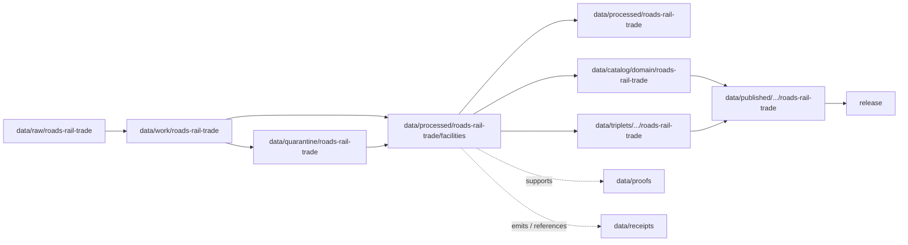

<!-- [KFM_META_BLOCK_V2]
doc_id: kfm://doc/data-processed-roads-rail-trade-facilities-readme
title: data/processed/roads-rail-trade/facilities/README.md — Roads / Rail / Trade Facilities Processed Data README
version: v0.1
type: readme; data-lifecycle-sublane; processed-stage-guide; roads-rail-trade-domain-lane; transport-facility-lane; facility-context-lane
status: draft; PROPOSED; data-root; processed-stage; roads-rail-trade; facilities; transport-facility; depots; stations; yards; terminals; interchanges; source-role-aware; sensitivity-aware; release-gated; evidence-first
authors: ChatGPT-5.5 Thinking; reviewed_by: OWNER_TBD
owners: OWNER_TBD — Roads/Rail/Trade steward · Transport facility steward · Sensitivity reviewer · Rights steward · Data steward · Pipeline steward · Evidence steward · Policy steward · Release steward · Docs steward
created: NEEDS VERIFICATION — blank placeholder existed before v0.1 expansion
updated: 2026-06-25
policy_label: public-doc; data; processed; roads-rail-trade; facilities; transport-facility; infrastructure-adjacent; lifecycle; governed; release-gated
tags: [kfm, data, processed, roads-rail-trade, roads-rail, transport-facility, depot, station, yard, terminal, interchange, crossing, bridge, ferry, operator-assignment, status-event, restriction-event, source-role, observed, regulatory, modeled, aggregate, administrative, candidate, synthetic, EvidenceBundle, SourceDescriptor, ValidationReport, PolicyDecision, ReviewRecord, RedactionReceipt, ReleaseManifest, RollbackCard, RAW, WORK, QUARANTINE, PROCESSED, CATALOG, TRIPLET, PUBLISHED]
related:
  - ../README.md
  - ../../README.md
  - ../../../README.md
  - ../../../../docs/domains/roads-rail-trade/OBJECT_FAMILIES.md
  - ../../../../docs/domains/roads-rail-trade/SENSITIVITY.md
  - ../../../../docs/domains/roads-rail-trade/PIPELINE.md
  - ../../../../docs/domains/roads-rail-trade/SOURCE_REGISTRY.md
  - ../../../../docs/domains/settlements-infrastructure/README.md
  - ../../../../docs/domains/hydrology/README.md
  - ../../../../docs/domains/hazards/README.md
  - ../../../../docs/domains/archaeology/README.md
  - ../../../../contracts/domains/roads-rail-trade/README.md
  - ../../../../contracts/domains/roads-rail-trade/depot.md
  - ../../../../contracts/domains/roads-rail-trade/corridor_route.md
  - ../../../../policy/sensitivity/transport/
  - ../../../../policy/domains/roads-rail-trade/
  - ../../../../schemas/contracts/v1/domains/roads-rail-trade/
  - ../../../raw/roads-rail-trade/
  - ../../../work/roads-rail-trade/
  - ../../../quarantine/roads-rail-trade/
  - ../../../catalog/domain/roads-rail-trade/
  - ../../../triplets/
  - ../../../published/
  - ../../../proofs/
  - ../../../receipts/
  - ../../../registry/sources/roads-rail-trade/
  - ../../../../release/candidates/roads-rail-trade/
  - ../../../../release/
  - ../../../../pipelines/domains/roads-rail-trade/
  - ../../../../pipeline_specs/roads-rail-trade/
  - ../../../../tools/validators/
notes:
  - "This file replaces a blank placeholder at `data/processed/roads-rail-trade/facilities/README.md`."
  - "This is a child PROCESSED-stage lane under `data/processed/roads-rail-trade/` for transport facility artifacts. It is not a RAW source root, WORK scratch area, QUARANTINE bypass, CATALOG, TRIPLET, PUBLISHED, proof store, receipt store, source registry, policy authority, release authority, public API/UI output, public map/tile output, operations surface, security surface, or infrastructure condition disclosure surface."
  - "TransportFacility objects include depots, stations, yards, terminals, rosters, interchanges, and related facility context. Facility identity and infrastructure asset truth may be owned or constrained by Settlements/Infrastructure; this lane preserves citation and transport-role context."
  - "Critical-facility detail, condition/vulnerability fields, restricted-source-derived fields, culturally sensitive corridor joins, and exact coordinates that could enable harm require the most restrictive applicable policy row and steward review before public exposure."
  - "Source-role anti-collapse is mandatory: administrative facility rosters, observed field records, modeled reconstructions, aggregate summaries, candidate connector outputs, and synthetic descriptions are not interchangeable."
  - "This README is a lane guide only. Contracts define semantic object meaning; schemas define machine shape; policy decides admissibility; release records decide publication."
  - "Rollback target for this expansion is previous blank placeholder blob SHA `8b137891791fe96927ad78e64b0aad7bded08bdc`."
[/KFM_META_BLOCK_V2] -->

<a id="top"></a>

# data/processed/roads-rail-trade/facilities

> Roads / Rail / Trade PROCESSED-stage child lane for normalized, source-traced, source-role-preserved transport facility artifacts that have passed beyond RAW/WORK/QUARANTINE but are not yet cataloged, triplet-projected, published, or released.

<p>
  
  
  
  
  
  
</p>

**Status:** draft / PROPOSED  
**Owners:** OWNER_TBD — Roads/Rail/Trade steward · Transport facility steward · Sensitivity reviewer · Rights steward · Data steward · Pipeline steward · Evidence steward · Policy steward · Release steward · Docs steward  
**Path:** `data/processed/roads-rail-trade/facilities/README.md`  
**Owning root:** `data/processed/`  
**Domain segment:** `roads-rail-trade`  
**Parent lane:** `data/processed/roads-rail-trade/`  
**Sublane:** `facilities` / transport facility processed artifacts  
**Lifecycle stage:** `PROCESSED`  
**Exposure posture:** not public by default; any public use requires governed catalog, EvidenceBundle, source-role and rights posture, sensitivity review, policy decision where applicable, ReleaseManifest, correction path, and rollback target.  
**Truth posture:** CONFIRMED target was a blank placeholder · CONFIRMED parent `data/processed/roads-rail-trade/README.md` is still a greenfield stub · CONFIRMED Roads/Rail/Trade object doctrine includes `TransportFacility` as a facility family · CONFIRMED sensitivity doctrine raises critical-facility detail and culturally sensitive corridor joins to restrictive review · PROPOSED facilities child-lane details · NEEDS VERIFICATION for actual child inventory, schemas, validators, fixtures, source descriptors, receipt families, policy enforcement, release linkage, and governed route behavior.

**Quick jumps:** [Purpose](#purpose) · [Lifecycle boundary](#lifecycle-boundary) · [Repo fit](#repo-fit) · [Accepted contents](#accepted-contents) · [Exclusions](#exclusions) · [Facilities processed requirements](#facilities-processed-requirements) · [Source-role and sensitivity guardrails](#source-role-and-sensitivity-guardrails) · [Directory map](#directory-map) · [Evidence ledger](#evidence-ledger) · [Validation checklist](#validation-checklist) · [Rollback](#rollback)

---

## Purpose

`data/processed/roads-rail-trade/facilities/` holds processed transport facility artifacts for the Roads / Rail / Trade lane. These artifacts can support route, corridor, network, historic, freight, settlement, and infrastructure context while remaining upstream of catalog, triplet, publication, and release.

This lane may contain or point to normalized artifacts such as:

- `TransportFacility` records for depots, stations, yards, terminals, interchanges, rostered facilities, and facility-like transport nodes;
- facility identity and role context linked to road, rail, corridor, crossing, bridge, ferry, and route-membership artifacts;
- facility-to-route, facility-to-operator, and facility-to-status context when source role and time are explicit;
- historical facility assertions and candidate reconstructions where uncertainty remains visible;
- public-candidate generalized or redacted derivatives that still require catalog and release review.

This lane does not prove infrastructure ownership, current operating status, condition, vulnerability, security posture, emergency access, freight capacity, legal right-of-way, land ownership, cultural-route precision, or public release readiness by itself.

## Lifecycle boundary

```text
RAW -> WORK / QUARANTINE -> PROCESSED -> CATALOG / TRIPLET -> PUBLISHED
```



`data/processed/roads-rail-trade/facilities/` is upstream of catalog, triplet, publication, and release. It must not be used as a normal public map/API/UI/AI source.

## Repo fit

| Responsibility | Correct home | Rule |
|---|---|---|
| Raw facility rosters, source-native agency files, source exports, source logs, original coordinates, source identifiers, or unprocessed partner materials | `data/raw/roads-rail-trade/` | Not this lane. |
| In-process facility matching, geocoding, identity reconciliation, status extraction, route joins, QA, notebooks, or scratch products | `data/work/roads-rail-trade/` | Not this lane. |
| Unresolved rights, unresolved source role, disputed identity, sensitive condition detail, restricted-source fields, cultural corridor joins, unsafe coordinates, or not-yet-reviewed transport material | `data/quarantine/roads-rail-trade/` | Not this lane until review/admission allows. |
| Processed facility artifacts | `data/processed/roads-rail-trade/facilities/` | This lane. |
| Parent processed Roads/Rail/Trade lane | `data/processed/roads-rail-trade/` | Parent lane; still not public by default. |
| Roads/Rail/Trade catalog records | `data/catalog/domain/roads-rail-trade/` | Downstream catalog stage. |
| Triplet/graph records | `data/triplets/.../roads-rail-trade/` | Downstream graph stage; must not expose restricted precision or role-collapsed claims. |
| Published public-safe products | `data/published/.../roads-rail-trade/` | Downstream only after release. |
| EvidenceBundle/proof records | `data/proofs/` | Separate proof family. |
| Source, run, transform, redaction, validation, policy, correction, access, and release receipts | `data/receipts/` | Separate receipt family. |
| Source registry records | `data/registry/sources/roads-rail-trade/` | Separate source authority. |
| Release candidates and release manifests | `release/candidates/roads-rail-trade/`, `release/` | Separate publication authority. |
| Contracts | `contracts/domains/roads-rail-trade/` or ADR-resolved segment | Object meaning; not data. |
| Schemas | `schemas/contracts/v1/domains/roads-rail-trade/` or ADR-resolved segment | Machine shape; not data. |
| Policy and sensitivity rules | `policy/domains/roads-rail-trade/`, `policy/sensitivity/transport/` or ADR-resolved segment | Admissibility authority; not data. |
| Validators, tests, fixtures, pipelines, pipeline specs, apps, packages | `tools/validators/`, `tests/`, `fixtures/`, `pipelines/`, `pipeline_specs/`, `apps/`, `packages/` | Separate roots. |

## Accepted contents

Processed facility artifacts may include:

- normalized `TransportFacility` records with source role, source time, valid time, rights posture, sensitivity posture, and digest posture;
- depot, station, yard, terminal, interchange, roster, and facility-node derivatives where source and role remain explicit;
- facility-to-route, facility-to-corridor, facility-to-crossing, facility-to-operator, and facility-to-status relationship candidates;
- historical facility assertions with uncertainty, source-role, and temporal scope preserved;
- generalized or redacted public-candidate facility context that still requires catalog/release review before public use;
- lane-local README or manifest notes that explain processed-data boundaries without becoming public outputs or authority records.

## Exclusions

Do not store these under `data/processed/roads-rail-trade/facilities/`:

- RAW source files, source-native rosters, agency exports, source media, logs, source identifiers, or unprocessed source payloads.
- WORK/scratch files, notebooks, geocoding experiments, identity-reconciliation scratch, status extraction trials, route matching trials, or redaction-debug outputs.
- Quarantined or unresolved sensitive/rights/source-role material.
- Catalog records, triplet/graph records, published products, proof records, receipt records, source registry records, release decisions, schemas, policy rules, validators, tests, fixtures, pipelines, app/UI/API code, or packages.
- Infrastructure canonical identity, building/asset ownership truth, hydrology truth, hazards/emergency truth, land ownership/right-of-way truth, archaeology/cultural-route truth, or operator legal authority owned by other lanes.
- Condition/vulnerability detail, restricted source terms, security-sensitive details, private agreement details, credentials, secrets, redaction parameters, aggregation thresholds, exact transform offsets, or implementation details that could aid exposure or unauthorized access.
- Public API/UI/tile payloads, direct downloads, Focus Mode answers, public map layers, operations dashboards, security products, emergency routing, legal advice, or life-safety guidance.

## Facilities processed requirements

PROPOSED until concrete validators, policies, fixtures, receipts, and access-control enforcement are verified:

| Requirement | Meaning |
|---|---|
| Source trace | Each source-derived artifact should trace to SourceDescriptor or roads/rail/trade source registry context. |
| Evidence linkage | Claims about facility identity, role, route membership, operator assignment, status, restriction, historical assertion, transform, review, or release readiness should resolve downstream to EvidenceBundle/proof context where appropriate. |
| Source role | Observed, regulatory, modeled, aggregate, administrative, candidate, and synthetic roles must remain explicit and not interchangeable. |
| Object distinction | TransportFacility, Network Node, Crossing, Bridge, Ferry, RestrictionEvent, StatusEvent, OperatorAssignment, CorridorRoute, RouteMembership, and Historic RouteClaim must remain distinct. |
| Time semantics | Source time, observed time, valid time, event time, retrieval time, release time, and correction time should remain distinguishable where material. |
| Rights posture | Agency, operator, archive, partner, license, redistribution, attribution, derivative-use, and restricted-source terms should be resolved or held closed. |
| Sensitivity posture | Critical-facility detail, exact-harm coordinates, cultural-route joins, restricted-source fields, and infrastructure-adjacent status should carry restriction/generalization/denial posture where needed. |
| Transform linkage | Generalization, aggregation, redaction, suppression, withholding, delayed publication, or public-safe transform should link to appropriate receipt families. |
| Review state | Domain steward, sensitivity reviewer, rights reviewer, data-quality reviewer, and release authority review should be recorded where required. |
| Policy decision | Restricted, public-candidate, and public transitions require PolicyDecision/admissibility posture where policy requires it. |
| Catalog readiness | Processed facility artifacts intended for discovery should promote through catalog/triplet lanes, not directly to public use. |
| Release readiness | Public use requires ReleaseManifest or release-linked state, published output path, correction path, and rollback target. |
| No public surface by default | Processed facility artifacts must not be exposed directly as public maps, tiles, APIs, downloads, Focus Mode answers, or AI-answer sources. |

## Source-role and sensitivity guardrails

- `TransportFacility` is a transport-context object, not automatic infrastructure ownership truth.
- Facility identity and infrastructure asset truth may be Settlements/Infrastructure-owned; this lane preserves transport-role citation and relationship context.
- Administrative facility rosters must not become observed status timelines by promotion.
- Modeled or reconstructed historical facilities remain modeled/candidate unless evidence and review support stronger claims.
- RestrictionEvent and StatusEvent records must remain distinct from static facility identity.
- OperatorAssignment is not legal ownership by itself.
- Crossings, bridges, ferries, and water-related facilities cite Hydrology where water evidence is involved; Hydrology owns the water truth.
- Hazards owns emergency/hazard state; Roads/Rail/Trade may cite, not replace, that truth.
- Archaeology and cultural-stewardship policy governs sensitive cultural-route joins.
- Critical-facility detail, condition/vulnerability detail, restricted source terms, and exact coordinates that could enable harm fail closed until policy, evidence, review, release state, correction path, and rollback are resolved.
- Public clients and Focus Mode must use governed APIs, released artifacts, catalog/triplet records, EvidenceBundle-backed payloads, and policy-safe envelopes, not this directory directly.

> [!CAUTION]
> Do not expose `data/processed/roads-rail-trade/facilities/` directly as a public map, tile service, API, UI, download, Focus Mode answer, AI answer source, operations surface, security surface, infrastructure condition surface, emergency routing surface, legal authority record, or life-safety product. Processed facility data remains inside the trust membrane until governed promotion and release.

## Directory map

Actual child inventory remains **NEEDS VERIFICATION**. Use this as a proposed local organization pattern only after confirming current repo convention and validators.

```text
data/processed/roads-rail-trade/facilities/
├── README.md
├── depots/                   # PROPOSED — depot/station derivatives
├── yards/                    # PROPOSED — yard/facility-node derivatives
├── terminals/                # PROPOSED — terminal/interchange context
├── rosters/                  # PROPOSED — normalized administrative rosters, not observed events
├── relationships/            # PROPOSED — facility-to-route/operator/status relationship candidates
├── historical/               # PROPOSED — historical facility assertions and reconstructions
├── generalized/              # PROPOSED — public-candidate generalized derivatives
├── restricted/               # PROPOSED — sensitive/rights-limited facility context
├── validation/               # PROPOSED — lane-local validation notes, not ValidationReport authority
├── joins/                    # PROPOSED — reviewed relation edges only, not foreign-domain truth
├── _manifests/               # PROPOSED — lane-local non-release manifests only
└── _README_TODO.md           # PROPOSED — remove after actual child inventory is documented
```

## Evidence ledger

| Source | Status | Supports | Limits |
|---|---|---|---|
| Previous file | CONFIRMED | Target existed as a blank placeholder. | Did not define facility processed boundaries. |
| Repository search | CONFIRMED | Found Roads/Rail/Trade object-family, sensitivity, pipeline, catalog, and depot/corridor contract references. | Search is not a full tree audit. |
| `data/processed/roads-rail-trade/README.md` | CONFIRMED | Parent processed lane currently exists as a greenfield stub. | Does not define processed parent boundaries yet. |
| `docs/domains/roads-rail-trade/OBJECT_FAMILIES.md` | CONFIRMED doctrine / PROPOSED implementation | Roads/Rail/Trade owns road/rail evidence, corridors, topology, crossings/bridges/ferries, transport facilities, restrictions/status events, operator assignments, and trade-route claims; `TransportFacility` is a named object family. | Field realization, schemas, and exact object graph remain NEEDS VERIFICATION. |
| `docs/domains/roads-rail-trade/SENSITIVITY.md` | CONFIRMED doctrine / PROPOSED implementation | Critical facility detail, sensitive coordinates, restricted source terms, and cultural corridor joins require restrictive review; unclear rights/source role/evidence/sensitivity/release blocks public promotion. | Final policy enforcement and tier adoption remain NEEDS VERIFICATION. |
| `contracts/domains/roads-rail-trade/depot.md` | NEEDS VERIFICATION | Expected semantic contract for depot/facility meaning. | This task did not inspect its contents. |
| `policy/sensitivity/transport/` and `policy/domains/roads-rail-trade/` | NEEDS VERIFICATION | Expected admissibility homes. | Current policy files and enforcement were not verified in this task. |

## Validation checklist

- [ ] Confirm actual child directories under `data/processed/roads-rail-trade/facilities/`.
- [ ] Confirm whether `facilities/` is the accepted processed lane name or should be reconciled with `transport_facilities/`, `depots/`, `stations/`, or another object-family naming convention.
- [ ] Expand or reconcile parent `data/processed/roads-rail-trade/README.md` beyond stub.
- [ ] Confirm `TransportFacility`, depot, station, yard, terminal, restriction/status, and operator-assignment contracts and schema paths.
- [ ] Resolve the `roads-rail-trade` versus `roads-rail` segment divergence for schemas/contracts/policy if still open.
- [ ] Confirm validators, fixtures, CI checks, source-role checks, sensitivity checks, redaction checks, restricted-source checks, and access-control enforcement.
- [ ] Confirm SourceDescriptor/source registry linkage for every input source and derived facility artifact.
- [ ] Confirm RunReceipt, TransformReceipt, RedactionReceipt, ReviewRecord, ValidationReport, PolicyDecision, CorrectionNotice, ReleaseManifest, RollbackCard, correction path, and rollback target where applicable.
- [ ] Confirm critical-facility details, condition/vulnerability fields, culturally sensitive joins, restricted-source fields, unsafe exact coordinates, secrets, private agreement terms, redaction parameters, transform secrets, and release-unclear artifacts cannot enter public routes.
- [ ] Confirm public-candidate transitions are governed, evidence-backed, source-role-safe, rights-safe, sensitivity-safe, review-backed, release-linked, and reversible.
- [ ] Confirm no RAW, WORK, QUARANTINE, CATALOG, TRIPLET, PUBLISHED, proof, receipt, registry, release, schema, policy, validator, package, pipeline, app, API, public map, public tile, direct download, Focus Mode answer, operations surface, security surface, emergency routing, legal advice, or life-safety artifact is misplaced here.
- [ ] Confirm public clients and Focus Mode cannot read this lane directly as public truth, public facility service, public map, public tile, public API, public UI, or AI-answer source.

## Rollback

Rollback is required if this lane becomes a RAW source-data root, WORK scratch root, QUARANTINE bypass, public output root, `data/published/` substitute, public-candidate shortcut, critical-facility exposure path, condition/vulnerability exposure path, cultural-route exposure path, restricted-source leakage path, unsafe coordinate exposure path, transform-secret exposure path, agreement/credential exposure path, proof store, receipt store, catalog root, triplet root, source-registry root, release-decision root, schema root, policy root, validator root, implementation root, public API shortcut, public UI shortcut, public tile shortcut, public exposure shortcut, operations surface, security surface, emergency routing surface, legal authority record, or life-safety guidance source.

Rollback target for this expansion: previous blank placeholder blob SHA `8b137891791fe96927ad78e64b0aad7bded08bdc`.

<p align="right"><a href="#top">Back to top</a></p>
