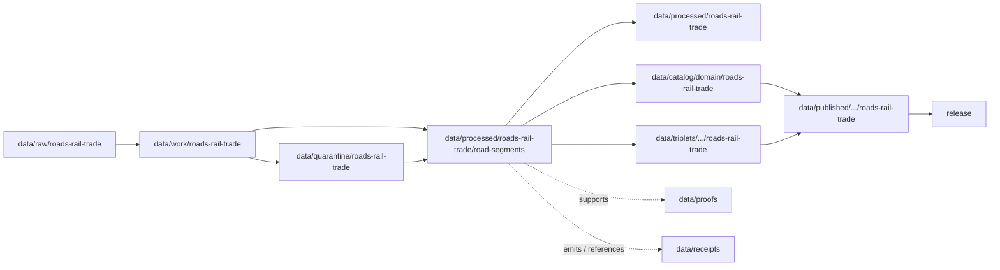

<!-- [KFM_META_BLOCK_V2]
doc_id: kfm://doc/data-processed-roads-rail-trade-road-segments-readme
title: data/processed/roads-rail-trade/road-segments/README.md — Roads / Rail / Trade Road Segments Processed Data README
version: v0.1
type: readme; data-lifecycle-sublane; processed-stage-guide; roads-rail-trade-domain-lane; road-segment-lane; linear-transport-primitive-lane
status: draft; PROPOSED; data-root; processed-stage; roads-rail-trade; road-segments; road-segment; corridor-context; route-membership-context; topology-context; source-role-aware; sensitivity-aware; release-gated; evidence-first
authors: ChatGPT-5.5 Thinking; reviewed_by: OWNER_TBD
owners: OWNER_TBD — Roads/Rail/Trade steward · Road segment steward · Network/topology steward · Sensitivity reviewer · Rights steward · Data steward · Pipeline steward · Evidence steward · Policy steward · Release steward · Docs steward
created: NEEDS VERIFICATION — blank placeholder existed before v0.1 expansion
updated: 2026-06-25
policy_label: public-doc; data; processed; roads-rail-trade; road-segments; transport-network; lifecycle; governed; source-role-aware; release-gated
tags: [kfm, data, processed, roads-rail-trade, roads-rail, road-segment, corridor-route, route-membership, network-node, crossing, bridge, ferry, restriction-event, status-event, operator-assignment, historic-route-claim, trade-route-corridor, source-role, observed, regulatory, modeled, aggregate, administrative, candidate, synthetic, EvidenceBundle, SourceDescriptor, ValidationReport, PolicyDecision, ReviewRecord, RedactionReceipt, ReleaseManifest, RollbackCard, RAW, WORK, QUARANTINE, PROCESSED, CATALOG, TRIPLET, PUBLISHED]
related:
  - ../README.md
  - ../facilities/README.md
  - ../../README.md
  - ../../../README.md
  - ../../../../docs/domains/roads-rail-trade/OBJECT_FAMILIES.md
  - ../../../../docs/domains/roads-rail-trade/SENSITIVITY.md
  - ../../../../docs/domains/roads-rail-trade/PIPELINE.md
  - ../../../../docs/domains/roads-rail-trade/SOURCE_REGISTRY.md
  - ../../../../docs/domains/settlements-infrastructure/README.md
  - ../../../../docs/domains/hydrology/README.md
  - ../../../../docs/domains/hazards/README.md
  - ../../../../docs/domains/archaeology/README.md
  - ../../../../contracts/domains/roads-rail-trade/README.md
  - ../../../../contracts/domains/roads-rail-trade/corridor_route.md
  - ../../../../policy/sensitivity/transport/
  - ../../../../policy/domains/roads-rail-trade/
  - ../../../../schemas/contracts/v1/domains/roads-rail-trade/
  - ../../../raw/roads-rail-trade/
  - ../../../work/roads-rail-trade/
  - ../../../quarantine/roads-rail-trade/
  - ../../../catalog/domain/roads-rail-trade/
  - ../../../triplets/
  - ../../../published/
  - ../../../proofs/
  - ../../../receipts/
  - ../../../registry/sources/roads-rail-trade/
  - ../../../../release/candidates/roads-rail-trade/
  - ../../../../release/
  - ../../../../pipelines/domains/roads-rail-trade/
  - ../../../../pipeline_specs/roads-rail-trade/
  - ../../../../tools/validators/
notes:
  - "This file replaces a blank placeholder at `data/processed/roads-rail-trade/road-segments/README.md`."
  - "This is a child PROCESSED-stage lane under `data/processed/roads-rail-trade/` for road-segment artifacts. It is not a RAW source root, WORK scratch area, QUARANTINE bypass, CATALOG, TRIPLET, PUBLISHED, proof store, receipt store, source registry, policy authority, release authority, public API/UI output, public map/tile output, routing engine, operations surface, emergency-routing surface, or legal road-status authority."
  - "Road Segment objects are linear transport primitives. Route membership, corridor naming, network topology, crossings, bridges, ferries, restrictions, status events, operator assignments, and historic/trade-route claims must remain distinct object families unless contracts say otherwise."
  - "Source-role anti-collapse is mandatory: observed field/survey records, administrative rosters, regulatory designations, modeled reconstructions, aggregate summaries, candidate connector outputs, and synthetic descriptions are not interchangeable."
  - "Modern public road segments may be public-safe after release, but unclear rights, unresolved source role, missing evidence, unresolved sensitivity, absent release state, cultural corridor joins, exact-harm coordinates, restricted-source fields, and critical-infrastructure-adjacent details block or restrict promotion."
  - "This README is a lane guide only. Contracts define semantic object meaning; schemas define machine shape; policy decides admissibility; release records decide publication."
  - "Rollback target for this expansion is previous blank placeholder blob SHA `8b137891791fe96927ad78e64b0aad7bded08bdc`."
[/KFM_META_BLOCK_V2] -->

<a id="top"></a>

# data/processed/roads-rail-trade/road-segments

> Roads / Rail / Trade PROCESSED-stage child lane for normalized, source-traced, source-role-preserved road segment artifacts that have passed beyond RAW/WORK/QUARANTINE but are not yet cataloged, triplet-projected, published, or released.

<p>
  
  
  
  
  
  
</p>

**Status:** draft / PROPOSED  
**Owners:** OWNER_TBD — Roads/Rail/Trade steward · Road segment steward · Network/topology steward · Sensitivity reviewer · Rights steward · Data steward · Pipeline steward · Evidence steward · Policy steward · Release steward · Docs steward  
**Path:** `data/processed/roads-rail-trade/road-segments/README.md`  
**Owning root:** `data/processed/`  
**Domain segment:** `roads-rail-trade`  
**Parent lane:** `data/processed/roads-rail-trade/`  
**Sublane:** `road-segments` / processed road segment artifacts  
**Lifecycle stage:** `PROCESSED`  
**Exposure posture:** not public by default; any public use requires governed catalog, EvidenceBundle, source-role and rights posture, sensitivity review, policy decision where applicable, ReleaseManifest, correction path, and rollback target.  
**Truth posture:** CONFIRMED target was a blank placeholder · CONFIRMED Roads/Rail/Trade object doctrine includes `Road Segment` as a named object family · CONFIRMED identity is source/role/time/digest-based and not geometry alone · CONFIRMED source role is fixed at admission and preserved through promotion · CONFIRMED sensitivity doctrine allows modern public road/rail segments as T0 only after release while restrictive rows govern cultural, exact-harm, restricted-source, and infrastructure-adjacent cases · PROPOSED road-segment child-lane details · NEEDS VERIFICATION for actual child inventory, schemas, validators, fixtures, source descriptors, receipt families, policy enforcement, release linkage, and governed route behavior.

**Quick jumps:** [Purpose](#purpose) · [Lifecycle boundary](#lifecycle-boundary) · [Repo fit](#repo-fit) · [Accepted contents](#accepted-contents) · [Exclusions](#exclusions) · [Road-segment processed requirements](#road-segment-processed-requirements) · [Source-role and sensitivity guardrails](#source-role-and-sensitivity-guardrails) · [Directory map](#directory-map) · [Evidence ledger](#evidence-ledger) · [Validation checklist](#validation-checklist) · [Rollback](#rollback)

---

## Purpose

`data/processed/roads-rail-trade/road-segments/` holds processed road-segment artifacts for the Roads / Rail / Trade lane. These artifacts provide normalized road linear primitives and road-network context used by corridor, route membership, crossings, bridges, restrictions, status events, operator assignments, historic route, trade-route, settlement, hydrology, hazards, and public-map-candidate workflows.

This lane may contain or point to normalized artifacts such as:

- `Road Segment` records with source role, source time, valid time, rights posture, sensitivity posture, and digest posture;
- normalized road geometry derivatives that remain upstream of catalog and release;
- segment identity, segmentation, conflation, split/merge, and vintage sidecars;
- road-to-route, road-to-corridor, road-to-crossing, road-to-bridge, road-to-ferry, road-to-network-node, and road-to-status relationship candidates;
- public-candidate generalized or redacted derivatives that still require catalog and release review.

This lane does not prove route membership, legal road ownership, right-of-way, operational closure, emergency routing, hazard condition, bridge condition, cultural corridor precision, public release readiness, or navigation/routing safety by itself.

## Lifecycle boundary

```text
RAW -> WORK / QUARANTINE -> PROCESSED -> CATALOG / TRIPLET -> PUBLISHED
```



`data/processed/roads-rail-trade/road-segments/` is upstream of catalog, triplet, publication, and release. It must not be used as a normal public map/API/UI/AI source.

## Repo fit

| Responsibility | Correct home | Rule |
|---|---|---|
| Raw road source files, source-native agency files, source exports, source logs, original coordinates, source identifiers, source-native road geometry, or unprocessed partner materials | `data/raw/roads-rail-trade/` | Not this lane. |
| In-process segmentation, geometry repair, conflation, split/merge experiments, identity reconciliation, topology repair, route joins, QA, notebooks, or scratch products | `data/work/roads-rail-trade/` | Not this lane. |
| Unresolved rights, unresolved source role, disputed identity, topology failure, restricted-source fields, cultural corridor joins, unsafe coordinates, or not-yet-reviewed transport material | `data/quarantine/roads-rail-trade/` | Not this lane until review/admission allows. |
| Processed road-segment artifacts | `data/processed/roads-rail-trade/road-segments/` | This lane. |
| Parent processed Roads/Rail/Trade lane | `data/processed/roads-rail-trade/` | Parent lane; still not public by default. |
| Roads/Rail/Trade catalog records | `data/catalog/domain/roads-rail-trade/` | Downstream catalog stage. |
| Triplet/graph records | `data/triplets/.../roads-rail-trade/` | Downstream graph stage; must not expose restricted precision or role-collapsed claims. |
| Published public-safe products | `data/published/.../roads-rail-trade/` | Downstream only after release. |
| EvidenceBundle/proof records | `data/proofs/` | Separate proof family. |
| Source, run, transform, redaction, validation, policy, correction, access, and release receipts | `data/receipts/` | Separate receipt family. |
| Source registry records | `data/registry/sources/roads-rail-trade/` | Separate source authority. |
| Release candidates and release manifests | `release/candidates/roads-rail-trade/`, `release/` | Separate publication authority. |
| Contracts | `contracts/domains/roads-rail-trade/` or ADR-resolved segment | Object meaning; not data. |
| Schemas | `schemas/contracts/v1/domains/roads-rail-trade/` or ADR-resolved segment | Machine shape; not data. |
| Policy and sensitivity rules | `policy/domains/roads-rail-trade/`, `policy/sensitivity/transport/` or ADR-resolved segment | Admissibility authority; not data. |
| Validators, tests, fixtures, pipelines, pipeline specs, apps, packages | `tools/validators/`, `tests/`, `fixtures/`, `pipelines/`, `pipeline_specs/`, `apps/`, `packages/` | Separate roots. |

## Accepted contents

Processed road-segment artifacts may include:

- normalized `Road Segment` records with source role, source time, valid time, rights posture, sensitivity posture, and digest posture;
- processed road segment geometry derivatives that remain upstream of catalog/release;
- identity, segmentation, geometry validity, CRS, split/merge, topology, vintage, and source-version sidecars needed to interpret processed products;
- relationship candidates to `CorridorRoute`, `RouteMembership`, `Network Node`, `Crossing`, `Bridge`, `Ferry`, `RestrictionEvent`, `StatusEvent`, `OperatorAssignment`, `Historic RouteClaim`, and `TradeRouteCorridor` records;
- generalized or redacted public-candidate road segment derivatives that still require catalog/release review before public use;
- lane-local README or manifest notes that explain processed-data boundaries without becoming public outputs or authority records.

## Exclusions

Do not store these under `data/processed/roads-rail-trade/road-segments/`:

- RAW source files, source-native road files, agency exports, source media, logs, source identifiers, or unprocessed source payloads.
- WORK/scratch files, notebooks, segmentation experiments, geometry-repair trials, conflation trials, split/merge trials, route matching trials, topology experiments, or redaction-debug outputs.
- Quarantined or unresolved sensitive/rights/source-role/topology material.
- Catalog records, triplet/graph records, published products, proof records, receipt records, source registry records, release decisions, schemas, policy rules, validators, tests, fixtures, pipelines, app/UI/API code, or packages.
- Route membership truth, named corridor truth, bridge/ferry/crossing truth, closure/status truth, operator/legal ownership truth, land/right-of-way truth, hydrology truth, hazards/emergency truth, archaeology/cultural-route truth, or infrastructure condition truth unless represented in their owning object families and roots.
- Public API/UI/tile payloads, direct downloads, Focus Mode answers, public map layers, navigation/routing services, emergency routing, operational closure systems, legal advice, or life-safety guidance.
- Restricted source terms, private agreement details, credentials, secrets, redaction parameters, aggregation thresholds, exact transform offsets, unsafe exact coordinates, or implementation details that could aid exposure or unauthorized access.

## Road-segment processed requirements

PROPOSED until concrete validators, policies, fixtures, receipts, and access-control enforcement are verified:

| Requirement | Meaning |
|---|---|
| Source trace | Each source-derived artifact should trace to SourceDescriptor or roads/rail/trade source registry context. |
| Evidence linkage | Claims about road segment identity, geometry, segmentation, topology, route/corridor relationship, status/restriction relation, transform, review, or release readiness should resolve downstream to EvidenceBundle/proof context where appropriate. |
| Source role | Observed, regulatory, modeled, aggregate, administrative, candidate, and synthetic roles must remain explicit and not interchangeable. |
| Object distinction | Road Segment, CorridorRoute, RouteMembership, Network Node, Crossing, Bridge, Ferry, RestrictionEvent, StatusEvent, OperatorAssignment, Historic RouteClaim, and TradeRouteCorridor must remain distinct. |
| Identity posture | Identity must not be collapsed by geometry similarity alone; source id, object role, temporal scope, and normalized digest remain material. |
| Geometry and topology | CRS, geometry validity, segmentation, split/merge lineage, topology, node relation, and route membership ambiguity should be recorded or receipt-linked. |
| Time semantics | Source time, observed time, valid time, event time, retrieval time, release time, and correction time should remain distinguishable where material. |
| Rights posture | Agency, operator, archive, partner, license, redistribution, attribution, derivative-use, and restricted-source terms should be resolved or held closed. |
| Sensitivity posture | Cultural route joins, exact-harm coordinates, restricted-source fields, infrastructure-adjacent details, and sensitive downstream joins should carry restriction/generalization/denial posture where needed. |
| Transform linkage | Reprojection, simplification, generalization, aggregation, redaction, suppression, withholding, delayed publication, or public-safe transform should link to appropriate receipt families. |
| Review state | Domain steward, network/topology reviewer, sensitivity reviewer, rights reviewer, data-quality reviewer, and release authority review should be recorded where required. |
| Policy decision | Restricted, public-candidate, and public transitions require PolicyDecision/admissibility posture where policy requires it. |
| Catalog readiness | Processed road-segment artifacts intended for discovery should promote through catalog/triplet lanes, not directly to public use. |
| Release readiness | Public use requires ReleaseManifest or release-linked state, published output path, correction path, and rollback target. |
| No public surface by default | Processed road-segment artifacts must not be exposed directly as public maps, tiles, APIs, downloads, Focus Mode answers, or AI-answer sources. |

## Source-role and sensitivity guardrails

- `Road Segment` is a linear transport primitive, not automatic route membership, legal road status, right-of-way, operator assignment, closure status, or navigation authority.
- Geometry similarity must not collapse identity across sources, roles, vintages, or temporal scopes.
- Administrative road inventories must not become observed field evidence by promotion.
- Modeled or reconstructed road segments remain modeled/candidate unless evidence and review support stronger claims.
- RouteMembership and CorridorRoute records must remain separate from raw segment identity.
- RestrictionEvent and StatusEvent records must remain separate from static road segment identity.
- OperatorAssignment is not legal ownership by itself.
- Hydrology owns water evidence for river/stream crossings; Roads/Rail/Trade may cite crossing relations.
- Hazards owns emergency/hazard state; Roads/Rail/Trade may cite, not replace, that truth.
- Archaeology and cultural-stewardship policy governs sensitive cultural-route joins.
- Modern public road geometry may become public-safe only through governed release. Exact-harm coordinates, cultural corridor joins, restricted source terms, and infrastructure-adjacent details fail closed until policy, evidence, review, release state, correction path, and rollback are resolved.
- Public clients and Focus Mode must use governed APIs, released artifacts, catalog/triplet records, EvidenceBundle-backed payloads, and policy-safe envelopes, not this directory directly.

> [!CAUTION]
> Do not expose `data/processed/roads-rail-trade/road-segments/` directly as a public map, tile service, API, UI, download, Focus Mode answer, AI answer source, routing engine, navigation authority, emergency routing surface, legal road-status authority, or life-safety product. Processed road segment data remains inside the trust membrane until governed promotion and release.

## Directory map

Actual child inventory remains **NEEDS VERIFICATION**. Use this as a proposed local organization pattern only after confirming current repo convention and validators.

```text
data/processed/roads-rail-trade/road-segments/
├── README.md
├── segments/                 # PROPOSED — normalized Road Segment records
├── geometry/                 # PROPOSED — processed geometry derivatives, not public tiles
├── topology/                 # PROPOSED — node/connectivity/topology summaries
├── segmentation/             # PROPOSED — split/merge/conflation lineage
├── vintages/                 # PROPOSED — source-vintage/version sidecars
├── relationships/            # PROPOSED — route/corridor/crossing/status relationship candidates
├── generalized/              # PROPOSED — public-candidate generalized derivatives
├── restricted/               # PROPOSED — rights-limited or sensitivity-limited segment context
├── validation/               # PROPOSED — lane-local validation notes, not ValidationReport authority
├── joins/                    # PROPOSED — reviewed relation edges only, not foreign-domain truth
├── _manifests/               # PROPOSED — lane-local non-release manifests only
└── _README_TODO.md           # PROPOSED — remove after actual child inventory is documented
```

## Evidence ledger

| Source | Status | Supports | Limits |
|---|---|---|---|
| Previous file | CONFIRMED | Target existed as a blank placeholder. | Did not define road-segment processed boundaries. |
| `docs/domains/roads-rail-trade/OBJECT_FAMILIES.md` | CONFIRMED doctrine / PROPOSED implementation | Roads/Rail/Trade owns road/rail evidence, corridors, topology, crossings, bridges/ferries, transport facilities, restrictions/status events, operator assignments, and trade-route claims; `Road Segment` is a named object family; identity is not geometry alone; source role is fixed at admission. | Field realization, schemas, and exact object graph remain NEEDS VERIFICATION. |
| `docs/domains/roads-rail-trade/SENSITIVITY.md` | CONFIRMED doctrine / PROPOSED implementation | Modern public road/rail segments may be T0 after release; cultural, exact-harm, restricted-source, and infrastructure-adjacent rows can require generalization, restriction, or denial; missing rights/source role/evidence/sensitivity/release blocks promotion. | Final policy enforcement and tier adoption remain NEEDS VERIFICATION. |
| `data/processed/roads-rail-trade/README.md` | CONFIRMED | Parent processed lane currently exists as a greenfield stub. | Does not define processed parent boundaries yet. |
| `data/processed/roads-rail-trade/facilities/README.md` | CONFIRMED sibling README | Facility lane separates TransportFacility context from public surfaces and sensitive facility detail. | Does not prove validators. |
| `policy/sensitivity/transport/` and `policy/domains/roads-rail-trade/` | NEEDS VERIFICATION | Expected admissibility homes. | Current policy files and enforcement were not verified in this task. |
| `contracts/domains/roads-rail-trade/` and `schemas/contracts/v1/domains/roads-rail-trade/` | NEEDS VERIFICATION | Expected object contract/schema homes if segment conflict resolves this way. | Specific object files and validators were not verified in this task. |

## Validation checklist

- [ ] Confirm actual child directories under `data/processed/roads-rail-trade/road-segments/`.
- [ ] Confirm whether `road-segments/` is the accepted processed lane name or should be reconciled with `roads/`, `segments/`, `road_segments/`, or another object-family naming convention.
- [ ] Expand or reconcile parent `data/processed/roads-rail-trade/README.md` beyond stub.
- [ ] Confirm `Road Segment`, route membership, network node, crossing, bridge, ferry, restriction/status, and operator-assignment contracts and schema paths.
- [ ] Resolve the `roads-rail-trade` versus `roads-rail` segment divergence for schemas/contracts/policy if still open.
- [ ] Confirm validators, fixtures, CI checks, source-role checks, geometry checks, topology checks, segmentation checks, sensitivity checks, redaction checks, restricted-source checks, and access-control enforcement.
- [ ] Confirm SourceDescriptor/source registry linkage for every input source and derived road segment artifact.
- [ ] Confirm RunReceipt, TransformReceipt, RedactionReceipt, ReviewRecord, ValidationReport, PolicyDecision, CorrectionNotice, ReleaseManifest, RollbackCard, correction path, and rollback target where applicable.
- [ ] Confirm culturally sensitive joins, restricted-source fields, unsafe exact coordinates, topology failures, identity ambiguity, secrets, private agreement terms, redaction parameters, transform secrets, and release-unclear artifacts cannot enter public routes.
- [ ] Confirm public-candidate transitions are governed, evidence-backed, source-role-safe, rights-safe, sensitivity-safe, topology-safe, review-backed, release-linked, and reversible.
- [ ] Confirm no RAW, WORK, QUARANTINE, CATALOG, TRIPLET, PUBLISHED, proof, receipt, registry, release, schema, policy, validator, package, pipeline, app, API, public map, public tile, direct download, Focus Mode answer, routing engine, navigation authority, emergency routing, legal advice, or life-safety artifact is misplaced here.
- [ ] Confirm public clients and Focus Mode cannot read this lane directly as public truth, public road service, public map, public tile, public API, public UI, or AI-answer source.

## Rollback

Rollback is required if this lane becomes a RAW source-data root, WORK scratch root, QUARANTINE bypass, public output root, `data/published/` substitute, public-candidate shortcut, source-role collapse path, identity-by-geometry path, topology-error publication path, cultural-route exposure path, restricted-source leakage path, unsafe coordinate exposure path, transform-secret exposure path, agreement/credential exposure path, proof store, receipt store, catalog root, triplet root, source-registry root, release-decision root, schema root, policy root, validator root, implementation root, public API shortcut, public UI shortcut, public tile shortcut, public exposure shortcut, routing engine, navigation authority, emergency routing surface, legal road-status authority, or life-safety guidance source.

Rollback target for this expansion: previous blank placeholder blob SHA `8b137891791fe96927ad78e64b0aad7bded08bdc`.

<p align="right"><a href="#top">Back to top</a></p>
