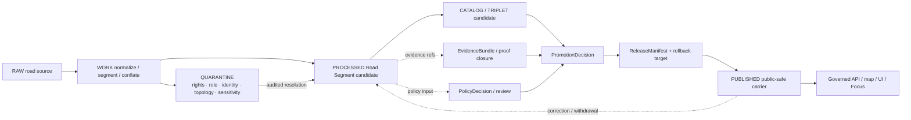

<!-- [KFM_META_BLOCK_V2]
doc_id: kfm://doc/data-processed-roads-rail-trade-road-segments-readme
title: data/processed/roads-rail-trade/road-segments/ — Roads / Rail / Trade Road-Segment Processed Data
version: v0.2.0
type: directory-readme
subtype: processed-roads-rail-trade-road-segment-lane
status: repository-grounded draft; payload inventory, canonical slug ownership, contracts, schemas, validators, fixtures, receipts, proof, release, and runtime behavior remain bounded
owners:
  - "NEEDS VERIFICATION — Roads/Rail/Trade domain steward"
  - "NEEDS VERIFICATION — road-segment, network, topology, and conflation steward"
  - "NEEDS VERIFICATION — route/corridor, crossing, facility, status/restriction, rights, and sensitivity reviewers"
  - "NEEDS VERIFICATION — data, evidence, policy, release, correction, rollback, and docs stewards"
created: NEEDS VERIFICATION — blank placeholder existed before v0.1 expansion
updated: 2026-07-25
policy_label: public-doc; processed-stage; roads-rail-trade; road-segment; source-role-aware; topology-aware; sensitivity-aware; release-gated; no-direct-public-path
path: data/processed/roads-rail-trade/road-segments/README.md
truth_posture: >
  CONFIRMED exact target path, prior blob, Directory Rules placement, Roads/Rail/Trade object-family
  and sensitivity doctrine, Road Segment term, source-role anti-collapse, identity-not-geometry rule,
  modern-public-segment T0 posture only after release, and PROCESSED lifecycle boundary / PROPOSED
  lane-local admission profile, segment identity packet, segmentation-conflation lineage, topology and
  relationship routing, and downstream promotion expectations / UNKNOWN recursive payload inventory,
  canonical roads-rail-trade versus roads-rail slug resolution, concrete Road Segment contract/schema,
  production validators, fixtures, receipts, proof closure, release instances, public routes, routing
  consumers, and runtime behavior / NEEDS VERIFICATION accountable owners, accepted lane name,
  identity fields, topology tolerances, conflation rules, sensitivity transforms, correction propagation,
  cache and tile invalidation, withdrawal behavior, and rollback drills
evidence_snapshot:
  repository: bartytime4life/Kansas-Frontier-Matrix
  base_ref: main
  base_commit: 466db6157ca00d54001d31c1e86b017d079cae9d
  prior_blob: b508fa20436fc3710e4b2191b48fa33363f457e7
  directory_rules_blob: 2affb080e6f0043867c64c7f06c1ca52030fbd55
  object_families_blob: 64e64d7954433830a8ad60182785c0c8e456e151
  sensitivity_blob: 59870cd850b6491488578a296294691e8c9c50eb
related:
  - ../README.md
  - ../facilities/README.md
  - ../../README.md
  - ../../../README.md
  - ../../../../docs/domains/roads-rail-trade/OBJECT_FAMILIES.md
  - ../../../../docs/domains/roads-rail-trade/SENSITIVITY.md
  - ../../../../docs/domains/roads-rail-trade/PIPELINE.md
  - ../../../../docs/domains/roads-rail-trade/SOURCE_REGISTRY.md
  - ../../../../docs/doctrine/directory-rules.md
  - ../../../../docs/domains/settlements-infrastructure/README.md
  - ../../../../docs/domains/hydrology/README.md
  - ../../../../docs/domains/hazards/README.md
  - ../../../../docs/domains/archaeology/README.md
  - ../../../../contracts/domains/roads-rail-trade/README.md
  - ../../../../schemas/contracts/v1/domains/roads-rail-trade/README.md
  - ../../../../policy/domains/roads-rail-trade/README.md
  - ../../../raw/roads-rail-trade/README.md
  - ../../../work/roads-rail-trade/README.md
  - ../../../quarantine/roads-rail-trade/README.md
  - ../../../catalog/domain/roads-rail-trade/README.md
  - ../../../triplets/README.md
  - ../../../proofs/README.md
  - ../../../receipts/README.md
  - ../../../registry/sources/roads-rail-trade/README.md
  - ../../../../release/candidates/roads-rail-trade/README.md
  - ../../../../release/README.md
notes:
  - "Same-path Markdown modernization only; no road bytes, source activation, contract, schema, policy, validator, workflow, proof, release, route, routing engine, or KFM publication state changed."
  - "Road Segment is a linear transport primitive. RouteMembership, CorridorRoute, Network Node, Crossing, Bridge, Ferry, RestrictionEvent, StatusEvent, OperatorAssignment, Historic RouteClaim, and TradeRouteCorridor remain separate object families."
  - "Identity is not geometry alone. Source id, source role, temporal scope, segmentation/conflation lineage, and normalized digest remain material."
  - "Modern public road geometry may become T0 only after governed release; cultural, exact-harm, restricted-source, and infrastructure-adjacent cases may require generalization, restriction, or denial."
  - "Rollback target for v0.2.0 is prior blob SHA `b508fa20436fc3710e4b2191b48fa33363f457e7`."
[/KFM_META_BLOCK_V2] -->

<a id="top"></a>

# `data/processed/roads-rail-trade/road-segments/` — Roads / Rail / Trade road-segment processed data

> **One-line purpose.** Hold normalized road-segment candidates while preserving source role, stable identity, geometry and topology semantics, segmentation and conflation lineage, time, rights, sensitivity, evidence, correction, and downstream-use limits.

[](#status)
[](#authority-level)
[](#what-belongs-here)
[](#outputs)
[](#identity-topology-and-conflation)
[](#validation)

> [!IMPORTANT]
> **A road line is not self-authenticating.** Similar geometry may represent different sources, roles, vintages, segmentation decisions, reconstructed candidates, administrative records, or released derivatives. Identity, role, time, topology, and evidence determine what the segment can support.

**Path:** `data/processed/roads-rail-trade/road-segments/README.md`  
**Owning root:** `data/`  
**Lifecycle phase:** `processed/`  
**Domain segment:** `roads-rail-trade/`  
**Parent lane:** `data/processed/roads-rail-trade/`  
**Lane role:** `Road Segment` linear transport primitives and segment-local lineage  
**Direct public access:** denied  
**Last reviewed:** 2026-07-25

**Quick navigation:** [Purpose](#purpose) · [Authority level](#authority-level) · [Status](#status) · [What belongs here](#what-belongs-here) · [What does NOT belong here](#what-does-not-belong-here) · [Inputs](#inputs) · [Outputs](#outputs) · [Validation](#validation) · [Review burden](#review-burden) · [Related folders](#related-folders) · [ADRs](#adrs) · [Last reviewed](#last-reviewed) · [Admission profile](#road-segment-admission-profile) · [Identity and topology](#identity-topology-and-conflation) · [Object-family routing](#object-family-routing) · [Rights and sensitivity](#rights-sensitivity-and-public-safe-transforms) · [Lifecycle](#lifecycle-and-promotion) · [Correction](#correction-withdrawal-and-rollback) · [Verification register](#open-verification-register) · [No-loss ledger](#no-loss-ledger)

---

## Purpose

This directory is the Roads / Rail / Trade domain's **PROCESSED-stage lane for `Road Segment` candidates**. It may hold normalized linear-road primitives, source-versioned geometry, segmentation and conflation lineage, topology-ready segment records, and object-ready derivatives that have moved beyond RAW capture, WORK transformation, and QUARANTINE holds.

The lane exists to preserve the answer to eight questions before downstream use:

1. Which source, source role, source version, and acquisition or derivation method apply?
2. Which stable segment identity applies, and how does it survive geometry edits, splits, merges, and conflation?
3. Which CRS, geometry, segmentation, node, connectivity, directionality, level, and topology semantics apply?
4. Which source, observed, valid, retrieval, processing, correction, supersession, and release times apply?
5. Which route, corridor, crossing, bridge, ferry, node, restriction, status, operator, historic-route, or trade-route relationship is asserted—and which object retains ownership?
6. Which rights, attribution, redistribution, restricted-source, cultural, exact-harm, and infrastructure-adjacent constraints apply?
7. Which evidence, validation, policy, review, correction, release, and rollback states qualify the segment?
8. Which downstream uses are allowed, restricted, generalized, delayed, denied, or required to abstain?

It is not a RAW source lane, routing engine, navigation authority, legal road-status registry, right-of-way authority, ownership registry, closure service, emergency-routing service, bridge-condition authority, cultural-route authority, proof store, receipt authority, catalog authority, release authority, or public map/API/UI source.

## Authority level

**Implementation-bearing lifecycle lane with narrow linear-primitive authority.** The target path is CONFIRMED in the repository and remains under `data/processed/roads-rail-trade/`, consistent with Directory Rules' lifecycle and domain-placement rules.

Its authority is deliberately limited:

- it may carry processed Road Segment candidates and segment-local explanatory metadata;
- it does not define Road Segment meaning unless an accepted semantic contract says so;
- it does not define machine shape unless an accepted schema says so;
- it does not define source identity, rights, source role, or activation;
- it does not establish route membership, corridor designation, crossing, bridge, ferry, restriction, status, operator, historic-route, or trade-route truth;
- it does not establish legal ownership, right-of-way, public access, current closure, emergency suitability, navigability, or life-safety fitness;
- it does not authorize public release, routing, navigation, tiles, APIs, downloads, or Focus Mode answers.

## Status

| Surface | Status | Evidence-bounded interpretation |
|---|---|---|
| This README and path | **CONFIRMED** | The file exists at the pinned base and is updated in place. |
| `Road Segment` object-family term | **CONFIRMED doctrine** | The Roads/Rail/Trade object-family reference names Road Segment as a linear primitive. |
| Identity and source-role doctrine | **CONFIRMED doctrine / PROPOSED fields** | Identity is not geometry alone; source role is fixed at admission and preserved through promotion. |
| Sensitivity posture | **CONFIRMED doctrine / PROPOSED tier realization** | Modern public segments may become T0 after release; cultural, exact-harm, restricted-source, and infrastructure-adjacent cases may require stricter handling. |
| Canonical lane and slug ownership | **NEEDS VERIFICATION** | `roads-rail-trade` and `roads-rail` path segments remain an ADR-class divergence in current doctrine. |
| Concrete Road Segment contract/schema | **NEEDS VERIFICATION** | This task did not verify an accepted Road Segment contract and field-complete schema. |
| Real processed road payload inventory | **UNKNOWN** | This documentation task did not inspect or expose road-segment payloads. |
| Validators, fixtures, policy enforcement, and CI | **NEEDS VERIFICATION** | No accepted production Road Segment enforcement suite was verified. |
| Receipts, proof, release instances, public routes, routing consumers, and runtime behavior | **UNKNOWN / held** | Presence in this directory creates none of these states. |

<a id="accepted-contents"></a>

## What belongs here

Good fits are processed road-segment artifacts whose identity, geometry, topology, role, time, rights, and correction lineage remain inspectable, including:

- normalized Road Segment candidates with source identity, source role, source version, temporal scope, and digest posture;
- source-preserving geometry derivatives with CRS, dimensionality, geometry validity, directionality, level, and support metadata;
- segmentation, conflation, split, merge, predecessor, successor, and cross-version correspondence records;
- topology-ready endpoint, node-reference, connectivity, adjacency, and network-participation metadata that does not re-own Network Node authority;
- source-role-preserving observed, administrative, regulatory, modeled, aggregate, candidate, or synthetic segment records;
- controlled relationship candidates to CorridorRoute, RouteMembership, Network Node, Crossing, Bridge, Ferry, RestrictionEvent, StatusEvent, OperatorAssignment, Historic RouteClaim, and TradeRouteCorridor without duplicating those objects;
- generalized or redacted public-candidate derivatives that remain upstream of catalog, evidence closure, policy review, release, and public serving;
- QA, uncertainty, ambiguity, topology, source-version, caveat, correction, and sensitivity sidecars that are not proofs, receipts, policy decisions, or releases;
- lane-local README, inventory, migration, compatibility, or non-release manifest notes that explain artifact identity without becoming authority records.

<a id="exclusions"></a>

## What does NOT belong here

Do not place these in `data/processed/roads-rail-trade/road-segments/`:

- RAW source files, agency exports, partner deliveries, source-native geometry, logs, screenshots, media, credentials, or unprocessed payloads;
- WORK segmentation, conflation, geometry repair, route matching, topology experiments, notebooks, temporary joins, redaction debugging, or scratch outputs;
- QUARANTINE material with unresolved rights, role, identity, topology, source conflict, cultural sensitivity, exact-harm risk, restricted-source fields, or public-safety state;
- CorridorRoute, RouteMembership, Network Node, Crossing, Bridge, Ferry, TransportFacility, RestrictionEvent, StatusEvent, OperatorAssignment, Historic RouteClaim, or TradeRouteCorridor canonical records except as references;
- legal road ownership, right-of-way, public-access, jurisdiction, maintenance, closure, emergency-route, navigability, or current-condition determinations;
- routing graphs, navigation instructions, turn restrictions for operational routing, emergency-routing products, dispatch surfaces, or life-safety guidance;
- hydrology, hazards, archaeology, settlements/infrastructure, people/land, or cultural canonical truth except as governed references;
- catalog, STAC/DCAT/PROV, triplet, published, proof, receipt, source-registry, release, contract, schema, policy, validator, test, fixture, pipeline, package, API, UI, tile, or download artifacts;
- restricted agreement text, credentials, secrets, transform offsets, redaction parameters, aggregation thresholds, or details that could defeat public-safe transforms.

## Inputs

Inputs are governed WORK products or resolved QUARANTINE exits with, as applicable:

- `SourceDescriptor` or equivalent source identity and fixed source role;
- source-native identifier, version, vintage, attribution, rights, and redistribution posture;
- source geometry and CRS metadata;
- segmentation or conflation method and version;
- predecessor/successor and source-crosswalk context;
- topology and node-reference candidates;
- source, observed, valid, retrieval, processing, correction, and supersession times;
- QA findings, ambiguity, uncertainty, caveats, sensitivity, and validation support;
- transform receipts or equivalent lineage for reprojection, simplification, generalization, redaction, or suppression.

A resolved QUARANTINE exit is an audited decision, not a file move.

## Outputs

Outputs are non-public processed candidates for:

- Road Segment contract/schema validation when accepted;
- source-preserving network and topology review;
- governed RouteMembership, CorridorRoute, crossing, bridge, ferry, restriction/status, and operator relationship review;
- EvidenceRef and EvidenceBundle assembly;
- catalog and triplet candidates that preserve role, identity, time, rights, and sensitivity;
- generalized or redacted public candidates;
- release-candidate review after policy, evidence, correction, withdrawal, and rollback dependencies close.

PROCESSED placement proves only lifecycle disposition. It does not prove that a segment is correct, topologically usable, routable, public, current, legally open, safe, released, or suitable for navigation.

## Validation

Road-segment validation must be deterministic and fail closed. The accepted production validator suite remains NEEDS VERIFICATION.

| Gate | Minimum question | Failure posture |
|---|---|---|
| Identity | Is the segment identified by source, role, time, and stable lineage rather than geometry alone? | `DENY` / `HOLD` |
| Source role | Is observed, administrative, regulatory, modeled, aggregate, candidate, or synthetic posture explicit? | `DENY` |
| Geometry | Are CRS, dimensionality, validity, directionality, level, and source geometry lineage explicit? | `HOLD` |
| Segmentation/conflation | Are method/version, splits, merges, predecessors, successors, and crosswalk ambiguity recorded? | `HOLD` / `ABSTAIN` |
| Topology | Are endpoint/node references, connectivity assumptions, and unresolved errors explicit? | `HOLD` |
| Time | Are source, observed, valid, retrieval, processing, correction, supersession, and release times distinguishable? | `ABSTAIN` / stale hold |
| Object boundaries | Are route, corridor, node, crossing, bridge, ferry, restriction, status, operator, historic, and trade-route objects kept separate? | `DENY` |
| Rights | Are attribution, redistribution, derivative-use, partner, and restricted-source terms resolved? | `DENY` / `HOLD` |
| Sensitivity | Are cultural, exact-harm, critical-infrastructure-adjacent, restricted-source, and cross-lane risks resolved? | `DENY` / `RESTRICT` |
| Evidence | Do consequential identity, route, status, and release claims resolve to admissible evidence? | `ABSTAIN` |
| Correction | Are predecessor/successor, invalidation, supersession, withdrawal, and downstream impacts traceable? | `HOLD` |
| Release | Are policy, review, proof, release manifest, correction path, rollback target, and public-safe carrier present? | `DENY` |

Passing geometry or schema checks does **not** prove legal status, route membership, operational closure, topology fitness, routability, navigation safety, public release, or KFM publication.

## Review burden

Changes require review proportional to meaning and exposure:

- Roads/Rail/Trade domain and Road Segment stewardship for lane scope and identity rules;
- network/topology review for segmentation, conflation, connectivity, directionality, level, and graph participation;
- route/corridor and cross-object reviewers for relationship ownership;
- source and rights review for attribution, redistribution, derivative use, restricted-source fields, and partner agreements;
- sensitivity and security review for cultural routes, exact-harm coordinates, critical-infrastructure-adjacent details, and public transforms;
- Hydrology, Hazards, Archaeology, Settlements/Infrastructure, or People/Land review when their canonical truth or policy is referenced;
- evidence, policy, release, correction, rollback, and docs review before public use or authority-changing documentation.

**CODEOWNERS and accountable individuals are NEEDS VERIFICATION.** This README does not assign them.

## Related folders

| Responsibility | Verified or bounded home | Relationship |
|---|---|---|
| Parent processed lane | [`../README.md`](../README.md) | Roads/Rail/Trade lifecycle parent; current maturity remains bounded. |
| Facilities | [`../facilities/README.md`](../facilities/README.md) | Transport facilities remain separate from linear segments. |
| Object-family doctrine | [`../../../../docs/domains/roads-rail-trade/OBJECT_FAMILIES.md`](../../../../docs/domains/roads-rail-trade/OBJECT_FAMILIES.md) | Vocabulary, identity, source role, temporal, and cross-lane boundaries. |
| Sensitivity doctrine | [`../../../../docs/domains/roads-rail-trade/SENSITIVITY.md`](../../../../docs/domains/roads-rail-trade/SENSITIVITY.md) | Rights, tier, cultural, exact-harm, restricted-source, and infrastructure posture. |
| Contracts | [`../../../../contracts/domains/roads-rail-trade/README.md`](../../../../contracts/domains/roads-rail-trade/README.md) | Semantic meaning; exact Road Segment contract remains NEEDS VERIFICATION. |
| Schemas | [`../../../../schemas/contracts/v1/domains/roads-rail-trade/README.md`](../../../../schemas/contracts/v1/domains/roads-rail-trade/README.md) | Machine shape; slug and schema maturity remain NEEDS VERIFICATION. |
| Policy | [`../../../../policy/domains/roads-rail-trade/README.md`](../../../../policy/domains/roads-rail-trade/README.md) | Admissibility home; enforcement remains bounded. |
| Source registry | [`../../../registry/sources/roads-rail-trade/README.md`](../../../registry/sources/roads-rail-trade/README.md) | Source identity, role, rights, cadence, and activation. |
| Catalog, proof, receipts, release | [`../../../catalog/domain/roads-rail-trade/README.md`](../../../catalog/domain/roads-rail-trade/README.md), [`../../../proofs/README.md`](../../../proofs/README.md), [`../../../receipts/README.md`](../../../receipts/README.md), [`../../../../release/candidates/roads-rail-trade/README.md`](../../../../release/candidates/roads-rail-trade/README.md) | Downstream authority families; none are replaced by this lane. |
| Cross-domain truth | Hydrology, Hazards, Archaeology, Settlements/Infrastructure, People/Land domain roots | Referenced only through governed evidence and ownership boundaries. |

## ADRs

- **ADR-0001 schema-home rule:** machine schemas belong under `schemas/contracts/v1/...`; semantic meaning belongs under `contracts/`.
- **Directory Rules §15:** folder READMEs expose purpose, authority, status, contents, inputs, outputs, validation, review burden, related folders, ADRs, and review date.
- **NEEDS VERIFICATION:** canonical `roads-rail-trade` versus `roads-rail` slug and contract/schema/policy homes.
- **NEEDS VERIFICATION:** whether `road-segments/` is the accepted processed lane name or a compatibility name requiring migration.
- **No road-segment-lane-specific accepted ADR was verified.**

## Last reviewed

**2026-07-25** — documentation modernization review against the pinned repository evidence recorded in the meta block.

This date records review of this README, not validation of source rights, payloads, topology, legal status, routability, release state, public behavior, or operational correctness.

---

<a id="road-segment-processed-requirements"></a>

## Road-segment admission profile

The following profile is **PROPOSED** until accepted contracts, schemas, validators, fixtures, and CI prove it:

| Dimension | Required posture |
|---|---|
| Record identity | Stable id plus source id, source role, temporal scope, source version, and normalized digest where practical. |
| Source role | Observed, regulatory, modeled, aggregate, administrative, candidate, synthetic, or another accepted role is explicit and immutable through promotion. |
| Geometry | Source and normalized geometry, CRS, dimensionality, directionality, level, validity, and transform lineage. |
| Segmentation | Method/version, segment boundaries, split/merge basis, predecessor/successor, and cross-version correspondence. |
| Conflation | Candidate matches, accepted links, rejected links, ambiguity, confidence, and source-preserving identity. |
| Topology | Endpoint/node references, connectivity, adjacency, isolation, duplicate-edge, overlap, and unresolved error posture. |
| Time | Source, observed, valid, retrieval, processing, correction, supersession, withdrawal, and release times remain distinct where material. |
| Object relations | Route, corridor, node, crossing, bridge, ferry, restriction, status, operator, historic, and trade-route relations remain typed and evidence-bound. |
| Rights and sensitivity | Attribution, redistribution, restricted source, cultural review, exact-harm risk, infrastructure adjacency, and public transform obligations. |
| Evidence and review | EvidenceRefs, supporting EvidenceBundle, validation reports, policy decisions, review state, disagreements, and limitations. |
| Correction and release | Predecessor/successor, correction and withdrawal lineage, affected carriers, release state, rollback target, and invalidation plan. |

<a id="source-role-and-sensitivity-guardrails"></a>

## Identity, topology, and conflation

- **Identity is not geometry.** Identical or near-identical lines from different sources, roles, vintages, or methods remain distinct until an explicit crosswalk or conflation decision says otherwise.
- **Segmentation is versioned.** Splitting or merging a line creates lineage; it does not silently rewrite prior identity.
- **Conflation is a reviewed relation.** Candidate matches and accepted equivalence must preserve source records, confidence, method, and reviewer state.
- **Topology is not routability.** A connected graph does not establish legal access, turn permission, current closure, weight/height suitability, emergency fitness, or navigation safety.
- **Route membership is separate.** A segment does not become part of a CorridorRoute merely because it overlaps or shares a name.
- **Status and restriction are time-bound.** Static segment identity must not absorb RestrictionEvent or StatusEvent truth.
- **Operator assignment is not ownership.** Administrative or service responsibility does not establish legal title or right-of-way.

## Object-family routing

| Record or relation | Primary owner | Road-segment relationship |
|---|---|---|
| Named route or corridor | `CorridorRoute` | Segment references typed RouteMembership; no name-overlap shortcut. |
| Segment membership in route | `RouteMembership` | Associative object; does not rewrite segment identity. |
| Junction or terminus | `Network Node` | Segment references endpoints; node owns topological identity. |
| Intersection or water/rail crossing | `Crossing` | Segment references crossing; Hydrology or Rail may own related truth. |
| Bridge or ferry | `Bridge` / `Ferry` | Separate structure/service objects; Settlements/Infrastructure or Hydrology policies may apply. |
| Closure, limit, or restriction | `RestrictionEvent` | Time-bound event; not a static segment attribute unless source semantics explicitly require a current snapshot. |
| Condition or status change | `StatusEvent` | Time-bound event; does not rewrite historical segment identity. |
| Operator or maintainer relation | `OperatorAssignment` | Administrative relation; not legal ownership. |
| Historic route assertion | `Historic RouteClaim` | Evidence-bound claim with uncertainty; not observed modern segment truth. |
| Generalized trade corridor | `TradeRouteCorridor` | Cultural/stewardship review may require generalization, restriction, or denial. |

## Rights, sensitivity, and public-safe transforms

- **Modern public road geometry is not automatically public in KFM.** T0 posture requires governed release and current rights/source-role support.
- **The most restrictive applicable row governs.** Cultural, archaeological, exact-harm, critical-infrastructure, private-agreement, and restricted-source concerns override a generic public-road baseline.
- **Cultural and Indigenous routes require stewardship.** Generalization or denial may apply even when a modern road segment is public.
- **Critical-infrastructure-adjacent detail is not ordinary road geometry.** Vulnerability, condition, access, and operational details may require restricted access or denial.
- **Public transforms are audited.** Reprojection, simplification, generalization, suppression, redaction, aggregation, and delayed publication require traceable receipts and review where policy requires them.
- **Styling is not redaction.** Hidden client-side layers, opacity changes, or omitted labels do not protect sensitive geometry.

## Lifecycle and promotion

```text
RAW -> WORK / QUARANTINE -> PROCESSED -> CATALOG / TRIPLET -> PUBLISHED
```


```mermaid
flowchart LR
  RAW["RAW road source"] --> WORK["WORK normalize / segment / conflate"]
  WORK --> QUAR["QUARANTINE<br/>rights · role · identity · topology · sensitivity"]
  WORK --> SEG["PROCESSED Road Segment candidate"]
  QUAR -->|audited resolution| SEG
  SEG --> CAT["CATALOG / TRIPLET candidate"]
  SEG -. evidence refs .-> EVID["EvidenceBundle / proof closure"]
  SEG -. policy input .-> POL["PolicyDecision / review"]
  CAT --> PROMO["PromotionDecision"]
  EVID --> PROMO
  POL --> PROMO
  PROMO --> REL["ReleaseManifest + rollback target"]
  REL --> PUB["PUBLISHED public-safe carrier"]
  PUB --> API["Governed API / map / UI / Focus"]
  PUB -. correction / withdrawal .-> SEG
```

The arrows express governed dependencies, not automatic file copies. A commit, pull request, merge, topology pass, rendered line, catalog record, or route label does not create release, legal status, routability, navigation authority, or KFM publication.

<a id="rollback"></a>

## Correction, withdrawal, and rollback

A road-segment correction may arise from source revision, geometry repair, CRS error, segmentation change, conflation error, identity collision, topology defect, role misclassification, rights change, sensitivity reclassification, relationship error, or downstream publication defect.

Correction handling should:

1. preserve the original source and prior processed record by immutable reference;
2. create a new version, lineage edge, correction record, or withdrawal state instead of silently overwriting history;
3. record changed geometry, identity, segmentation, topology, relationships, reason, effective time, reviewer, and evidence;
4. identify affected route memberships, corridors, nodes, crossings, bridges, ferries, restrictions, statuses, facilities, catalogs, triplets, proofs, releases, maps, tiles, APIs, exports, search indexes, routing graphs, and Focus Mode or AI carriers;
5. invalidate, withdraw, or supersede affected public artifacts when required;
6. purge or re-key caches, tiles, graph indexes, and search indexes where stale or unsafe geometry could persist;
7. retain a correction notice, withdrawal state, and rollback target appropriate to the released artifact.

**Documentation rollback:** before merge, close the draft PR and abandon the branch. After merge, revert the implementation commit. The prior README blob is `b508fa20436fc3710e4b2191b48fa33363f457e7`.

**Operational rollback:** restoring prior released road data requires the actual prior release ID, manifest, proof, policy state, correction lineage, graph/tile/cache invalidation plan, and rollback card. Reverting this README is not an operational data rollback.

## Open verification register

| Item | Status | Required evidence |
|---|---|---|
| Canonical domain slug | **NEEDS VERIFICATION** | ADR resolving `roads-rail-trade` versus `roads-rail` across docs, contracts, schemas, policy, tests, and data. |
| Processed lane name | **NEEDS VERIFICATION** | Decision on `road-segments/` versus `roads/`, `segments/`, `road_segments/`, or another accepted name. |
| Road Segment contract/schema | **NEEDS VERIFICATION** | Accepted semantic contract, field-complete schema, fixtures, validators, registry, and migration posture. |
| Payload inventory and writers | **UNKNOWN** | Recursive tree, hashes, producers, consumers, and lifecycle state. |
| Identity and digest fields | **NEEDS VERIFICATION** | Accepted field set and deterministic identity tests. |
| Segmentation and conflation | **NEEDS VERIFICATION** | Methods, confidence thresholds, split/merge lineage, crosswalks, and reviewer rules. |
| Topology tolerances | **NEEDS VERIFICATION** | Accepted connectivity, snapping, duplicate, overlap, dangle, directionality, and level rules. |
| Source activation and rights | **UNKNOWN / held** | Concrete source descriptors, rights reviews, attribution, cadence, and activation decisions. |
| Sensitivity transforms | **NEEDS VERIFICATION** | Accepted generalization, redaction, restricted access, and reviewer obligations. |
| Validators, fixtures, and CI | **NEEDS VERIFICATION** | Deterministic no-network positive/negative fixtures and trusted check results. |
| Evidence, receipts, proof, and release | **UNKNOWN** | EvidenceBundles, receipts, review records, policy decisions, manifests, and rollback cards. |
| Public routes and routing consumers | **UNKNOWN** | Governed API, released carrier, routing-graph separation, runtime tests, and access controls. |
| Correction propagation | **NEEDS VERIFICATION** | Tested tile, graph, cache, search, API, map, export, and rollback drill. |

## No-loss ledger

| Baseline element | Disposition | Result |
|---|---|---|
| Stable `doc_id`, path, and blank-placeholder lineage | **KEEP** | Preserved in the meta block and same-path update. |
| PROCESSED lifecycle and no-direct-public-path posture | **CLARIFY** | Preserved and aligned to governed promotion. |
| Road Segment as linear transport primitive | **KEEP** | Preserved as the lane's narrow responsibility. |
| Object-family separation | **ENRICH** | Route, corridor, node, crossing, structure, event, operator, historic, and trade-route responsibilities are explicitly routed. |
| Source-role anti-collapse | **ENRICH** | Fixed role and administrative-as-observed denial are made operationally visible. |
| Identity-not-geometry rule | **ENRICH** | Expanded into segmentation, conflation, split/merge, and cross-version lineage requirements. |
| Rights and sensitivity posture | **ENRICH** | Public baseline is bounded by cultural, exact-harm, restricted-source, and infrastructure review. |
| Speculative child-directory tree | **REMOVE WITH EVIDENCE** | Removed because recursive inventory and local structure are unverified. |
| Public/routing/legal denials | **KEEP AND ENRICH** | Direct map/API/UI/routing/navigation/emergency/legal authority remains denied. |
| Rollback posture | **CLARIFY** | README rollback is separated from operational data, graph, tile, and release rollback. |

<p align="right"><a href="#top">Back to top</a></p>
