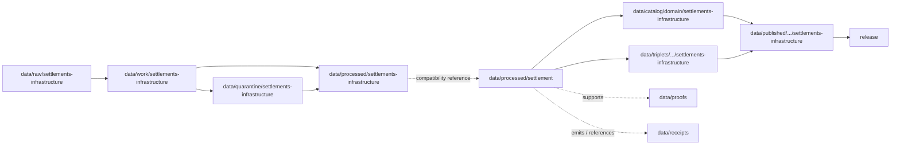

<!-- [KFM_META_BLOCK_V2]
doc_id: kfm://doc/data-processed-settlement-readme
title: data/processed/settlement/README.md — Settlement Processed Data Compatibility README
version: v0.1
type: readme; data-lifecycle-domain-lane; processed-stage-guide; compatibility-lane; settlements-infrastructure-domain-lane; settlement-sublane; infrastructure-adjacent-lane
status: draft; PROPOSED; compatibility-path; data-root; processed-stage; settlement; settlements-infrastructure; place-identity; infrastructure; source-role-aware; sensitivity-aware; evidence-first; release-gated
authors: ChatGPT-5.5 Thinking; reviewed_by: OWNER_TBD
owners: OWNER_TBD — Settlements/Infrastructure steward · Settlement identity steward · Infrastructure sensitivity reviewer · Rights steward · Data steward · Pipeline steward · Evidence steward · Policy steward · Release steward · Docs steward
created: NEEDS VERIFICATION — blank placeholder existed before v0.1 expansion
updated: 2026-06-25
policy_label: public-doc; data; processed; settlement; settlements-infrastructure; compatibility; lifecycle; governed; release-gated
tags: [kfm, data, processed, settlement, settlements-infrastructure, compatibility-path, settlement, municipality, census-place, townsite, ghost-town, fort, mission, reservation-community, infrastructure-asset, network-node, network-segment, facility, service-area, operator, condition-observation, dependency, source-role, observed, regulatory, modeled, aggregate, administrative, candidate, synthetic, EvidenceBundle, SourceDescriptor, ValidationReport, PolicyDecision, ReviewRecord, RedactionReceipt, ReleaseManifest, RollbackCard, RAW, WORK, QUARANTINE, PROCESSED, CATALOG, TRIPLET, PUBLISHED]
related:
  - ../settlements-infrastructure/README.md
  - ../README.md
  - ../../README.md
  - ../../../docs/domains/settlements-infrastructure/DATA_LIFECYCLE.md
  - ../../../docs/domains/settlements-infrastructure/IDENTITY_MODEL.md
  - ../../../docs/domains/settlements-infrastructure/README.md
  - ../../../docs/domains/settlements-infrastructure/ARCHITECTURE.md
  - ../../../docs/domains/settlements-infrastructure/CANONICAL_PATHS.md
  - ../../../docs/domains/settlements-infrastructure/FILE_SYSTEM_PLAN.md
  - ../../../docs/domains/settlements-infrastructure/RELEASE_INDEX.md
  - ../../../docs/domains/roads-rail-trade/README.md
  - ../../../docs/domains/hydrology/README.md
  - ../../../docs/domains/hazards/README.md
  - ../../../docs/domains/people-dna-land/README.md
  - ../../../docs/domains/archaeology/README.md
  - ../../../policy/domains/settlements-infrastructure/
  - ../../../policy/sensitivity/settlements-infrastructure/
  - ../../../contracts/domains/settlements-infrastructure/
  - ../../../schemas/contracts/v1/domains/settlements-infrastructure/
  - ../../raw/settlements-infrastructure/
  - ../../work/settlements-infrastructure/
  - ../../quarantine/settlements-infrastructure/
  - ../../catalog/domain/settlements-infrastructure/
  - ../../triplets/
  - ../../published/
  - ../../proofs/
  - ../../receipts/
  - ../../registry/sources/settlements-infrastructure/
  - ../../../release/candidates/settlements-infrastructure/
  - ../../../release/
  - ../../../pipelines/domains/settlements-infrastructure/
  - ../../../pipeline_specs/settlements-infrastructure/
  - ../../../tools/validators/
notes:
  - "This file replaces a blank placeholder at `data/processed/settlement/README.md`."
  - "This path is treated as a PROPOSED compatibility lane because current Settlements/Infrastructure doctrine documents a domain-segment conflict between `settlements-infrastructure` and `settlement`."
  - "Canonical processed-domain coordination should stay under the ADR-resolved Settlements/Infrastructure segment. Current repo evidence also shows `data/processed/settlements-infrastructure/README.md` exists as a greenfield stub."
  - "This lane may describe processed, evidence-bound, source-role-preserved settlement/place identity derivatives. It must not contain RAW sources, WORK scratch, QUARANTINE holds, catalog/triplet records, proofs, receipts, registry records, release decisions, schemas, policy rules, validators, app/API/UI code, or public-release payloads."
  - "Infrastructure assets, dependencies, condition observations, sensitive facilities, cultural/archaeology joins, person/land joins, and hazard/hydrology joins require the owning lane's policy and the most restrictive applicable row."
  - "Rollback target for this expansion is previous blank placeholder blob SHA `8b137891791fe96927ad78e64b0aad7bded08bdc`."
[/KFM_META_BLOCK_V2] -->

<a id="top"></a>

# data/processed/settlement

> PROPOSED compatibility README for processed settlement and place-identity artifacts associated with the Settlements / Infrastructure domain. This path is not treated as canonical unless the open segment-name conflict is resolved in favor of the singular `settlement/` data segment.

<p>
  
  
  
  
  
  
</p>

**Status:** draft / PROPOSED compatibility path  
**Owners:** OWNER_TBD — Settlements/Infrastructure steward · Settlement identity steward · Infrastructure sensitivity reviewer · Rights steward · Data steward · Pipeline steward · Evidence steward · Policy steward · Release steward · Docs steward  
**Path:** `data/processed/settlement/README.md`  
**Owning root:** `data/processed/`  
**Requested segment:** `settlement`  
**Canonical domain segment:** CONFLICTED — `settlements-infrastructure` vs `settlement`, pending ADR  
**Lifecycle stage:** `PROCESSED`  
**Exposure posture:** not public by default; any public use requires governed catalog, EvidenceBundle, source-role and rights posture, sensitivity review, policy decision where applicable, ReleaseManifest, correction path, and rollback target.  
**Truth posture:** CONFIRMED target was a blank placeholder · CONFIRMED repo search points to `settlements-infrastructure` domain lanes · CONFIRMED `data/processed/settlements-infrastructure/README.md` also exists as a greenfield stub · CONFIRMED Settlements/Infrastructure doctrine documents the segment conflict · PROPOSED this path as compatibility-only · NEEDS VERIFICATION for actual child inventory, ADR status, validators, fixtures, contracts, schemas, policy enforcement, access-control enforcement, release linkage, and governed route behavior.

**Quick jumps:** [Purpose](#purpose) · [Canonical path warning](#canonical-path-warning) · [Lifecycle boundary](#lifecycle-boundary) · [Repo fit](#repo-fit) · [Accepted contents](#accepted-contents) · [Exclusions](#exclusions) · [Processed requirements](#processed-requirements) · [Guardrails](#guardrails) · [Evidence ledger](#evidence-ledger) · [Validation checklist](#validation-checklist) · [Rollback](#rollback)

---

## Purpose

`data/processed/settlement/` is a requested, **PROPOSED compatibility path** for processed settlement and place-identity artifacts. It should be used only if the repository keeps this singular segment as a temporary bridge or if an ADR later makes it canonical.

This lane may describe or hold processed artifacts for:

- `Settlement`, `Municipality`, `CensusPlace`, `Townsite`, `GhostTown`, `Fort`, `Mission`, and `ReservationCommunity` records;
- settlement/place identity, temporal scope, evidence refs, normalized digest, and source-role sidecars;
- public-candidate generalized settlement/place context that still requires catalog and release review;
- reviewed relationship candidates to infrastructure, roads/rail, hydrology, hazards, people/land, and archaeology lanes where ownership remains explicit.

The currently visible alternative processed lane is:

```text
data/processed/settlements-infrastructure/
```

This README therefore defines a containment rule: this path may document or hold only processed, policy-reviewed, non-public settlement derivatives, and must not become an independent authority or public surface without ADR.

## Canonical path warning

Settlements/Infrastructure doctrine explicitly records a segment-name conflict between `settlements-infrastructure` and `settlement`. Until an ADR resolves the conflict, this file must be treated as **PROPOSED compatibility**, not canonical authority.

## Lifecycle boundary

```text
RAW -> WORK / QUARANTINE -> PROCESSED -> CATALOG / TRIPLET -> PUBLISHED
```



`data/processed/settlement/` is upstream of catalog, triplet, publication, and release. It must not be used as a normal public map/API/UI/AI source.

## Repo fit

| Responsibility | Correct home | Rule |
|---|---|---|
| Raw settlement/infrastructure source files, Census/GNIS/municipal exports, source logs, source identifiers, source-native geometries, images, OCR inputs, or unprocessed partner materials | `data/raw/settlements-infrastructure/` or ADR-resolved equivalent | Not this lane. |
| In-process normalization, identity reconciliation, geometry repair, place matching, infrastructure joins, QA, notebooks, or scratch products | `data/work/settlements-infrastructure/` or ADR-resolved equivalent | Not this lane. |
| Unresolved rights, unresolved source role, disputed identity, sensitive infrastructure detail, cultural/archaeology joins, person/land joins, stale hazard/hydrology joins, or not-yet-reviewed material | `data/quarantine/settlements-infrastructure/` or ADR-resolved equivalent | Not this lane until review/admission allows. |
| Canonical processed Settlements/Infrastructure artifacts | `data/processed/settlements-infrastructure/` or ADR-resolved equivalent | Preferred parent lane until ADR resolves the segment. |
| Compatibility settlement processed artifacts | `data/processed/settlement/` | This file; PROPOSED compatibility only. |
| Catalog records | `data/catalog/domain/settlements-infrastructure/` or ADR-resolved equivalent | Downstream catalog stage. |
| Triplet/graph records | `data/triplets/.../settlements-infrastructure/` | Downstream graph stage; must preserve restrictions and ownership boundaries. |
| Published public-safe products | `data/published/.../settlements-infrastructure/` | Downstream only after release. |
| Proofs, receipts, source registry, policy, schemas, validators, and release records | Their own roots | Not this lane. |

## Accepted contents

Processed settlement artifacts may include only policy-admitted derivatives such as:

- normalized `Settlement`, `Municipality`, `CensusPlace`, `Townsite`, `GhostTown`, `Fort`, `Mission`, and `ReservationCommunity` records;
- identity, temporal-scope, external-identifier, geometry-generalization, source-version, and normalized-digest sidecars;
- relationship candidates to infrastructure objects where ownership and sensitivity are explicit;
- reviewed context links to roads/rail, hydrology, hazards, people/land, agriculture, archaeology, and frontier history lanes;
- generalized or redacted public-candidate settlement/place derivatives that still require catalog/release review;
- lane-local README or manifest notes that explain processed-data boundaries without becoming public outputs or authority records.

## Exclusions

Do not store these under `data/processed/settlement/`:

- RAW source files, source-native exports, source media, logs, direct source identifiers, or unprocessed source payloads.
- WORK/scratch files, notebooks, identity-matching experiments, geometry-repair trials, place conflation trials, infrastructure join scratch, or redaction-debug outputs.
- Quarantined or unresolved sensitive/rights/source-role/identity material.
- Catalog records, triplet/graph records, published products, proof records, receipt records, source registry records, release decisions, schemas, policy rules, validators, tests, fixtures, pipelines, app/UI/API code, or packages.
- Infrastructure condition/vulnerability detail, emergency/hazard truth, water evidence, transport route truth, land ownership, living-person/private parcel truth, archaeology site coordinates, cultural/sovereignty-sensitive context, legal boundary adjudication, or public operational guidance.
- Public API/UI/tile payloads, direct downloads, Focus Mode answers, public map layers, emergency-response products, infrastructure condition surfaces, legal advice, or life-safety guidance.
- Restricted source terms, private agreement details, credentials, secrets, redaction parameters, aggregation thresholds, exact transform offsets, unsafe exact coordinates, or implementation details that could aid exposure or unauthorized access.

## Processed requirements

PROPOSED until concrete validators, policies, fixtures, receipts, and access-control enforcement are verified:

| Requirement | Meaning |
|---|---|
| Canonical path check | Confirm whether this compatibility path is allowed, or migrate/reconcile with `data/processed/settlements-infrastructure/` or another ADR-resolved path. |
| Source trace | Each source-derived artifact should trace to SourceDescriptor or source registry context. |
| Evidence linkage | Claims based on processed derivatives should resolve downstream to EvidenceBundle/proof context where appropriate. |
| Source role | Observed, regulatory, modeled, aggregate, administrative, candidate, synthetic, or ADR-resolved role vocabulary must remain explicit and not interchangeable. |
| Object distinction | Settlement, Municipality, CensusPlace, Townsite, GhostTown, Fort, Mission, ReservationCommunity, Infrastructure Asset, Network Node, Network Segment, Facility, Service Area, Operator, Condition Observation, and Dependency must remain distinct. |
| Identity posture | Identity should preserve source id, object role, temporal scope, and normalized digest; identity must not collapse by name or geometry similarity alone. |
| Time semantics | Source time, observed time, valid time, retrieval time, release time, and correction time should remain distinguishable where material. |
| Rights posture | Source, steward, license, redistribution, attribution, derivative-use, municipal, vendor, and partner terms should be resolved or held closed. |
| Sensitivity posture | Critical assets, infrastructure dependency graphs, cultural/archaeology joins, person/land joins, small-cell outputs, and exact-harm coordinates should carry restriction/generalization/denial posture where needed. |
| Transform linkage | Reprojection, simplification, generalization, aggregation, redaction, suppression, withholding, delayed publication, or public-safe transform should link to appropriate receipts. |
| Review state | Domain steward, sensitivity reviewer, rights reviewer, data-quality reviewer, and release authority review should be recorded where required. |
| Policy decision | Restricted, public-candidate, and public transitions require PolicyDecision/admissibility posture where policy requires it. |
| Catalog readiness | Processed artifacts intended for discovery should promote through catalog/triplet lanes, not directly to public use. |
| Release readiness | Public use requires ReleaseManifest or release-linked state, published output path, correction path, and rollback target. |
| No public surface by default | This lane must not be exposed directly as a public API, UI, download, map layer, Focus Mode answer, or AI-answer source. |

## Guardrails

- This path is PROPOSED compatibility, not canonical authority.
- Prefer the ADR-resolved Settlements/Infrastructure segment for parent-domain processed coordination.
- Processed settlement data is not proof by itself.
- A `Settlement`, `Municipality`, and `CensusPlace` with similar names or overlapping geometry are not automatically the same object.
- A `Townsite` is not a `GhostTown` by default; succession and abandonment are evidence-bound claims.
- A `Fort`, `Mission`, or `ReservationCommunity` may carry cultural, sovereignty, or archaeology sensitivity and must fail closed until steward review clears the representation.
- Infrastructure assets, facilities, condition observations, dependencies, and service areas may carry critical-infrastructure sensitivity and are not public by default.
- Roads/Rail owns transport routes and route membership; Hydrology owns water evidence; Hazards owns hazard events and warnings; People/Land owns ownership and living-person-sensitive joins; Archaeology owns site coordinates.
- Unclear rights, unresolved source role, missing evidence, unresolved sensitivity, unresolved identity, or absent release state blocks public promotion.
- Public clients and Focus Mode must use governed APIs, released artifacts, catalog/triplet records, EvidenceBundle-backed payloads, and policy-safe envelopes, not this directory directly.

> [!CAUTION]
> Do not expose `data/processed/settlement/` directly as a public map, API, UI, download, Focus Mode answer, AI answer source, emergency response surface, infrastructure condition surface, legal boundary authority, property/right-of-way proof, public person/parcel service, archaeology location surface, or life-safety product. Processed settlement data remains inside the trust membrane until governed promotion and release.

## Evidence ledger

| Source | Status | Supports | Limits |
|---|---|---|---|
| Previous file | CONFIRMED | Target existed as a blank placeholder. | Did not define settlement processed boundaries. |
| Repository search | CONFIRMED | Search found active `settlements-infrastructure` docs, contracts, catalog, identity, lifecycle, architecture, and release-index references. | Search is not a full tree audit. |
| `data/processed/settlements-infrastructure/README.md` | CONFIRMED | Existing alternative processed parent path exists as a greenfield stub. | Does not define processed parent boundaries yet. |
| `docs/domains/settlements-infrastructure/DATA_LIFECYCLE.md` | CONFIRMED doctrine / PROPOSED implementation | Documents the RAW→WORK/QUARANTINE→PROCESSED→CATALOG/TRIPLET→PUBLISHED invariant, domain ownership/non-ownership, per-phase responsibilities, gates, and the `settlements-infrastructure` vs `settlement` segment conflict. | Concrete paths, validators, contracts, schemas, and workflows are PROPOSED/NEEDS VERIFICATION. |
| `docs/domains/settlements-infrastructure/IDENTITY_MODEL.md` | CONFIRMED doctrine / PROPOSED implementation | Defines the identity model and object-family set; identity uses source id, object role, temporal scope, and normalized digest; critical-infrastructure deny posture applies. | Field realization, schema paths, and route behavior remain NEEDS VERIFICATION. |
| `policy/domains/settlements-infrastructure/` and `policy/sensitivity/settlements-infrastructure/` | NEEDS VERIFICATION | Expected admissibility homes if the long segment wins. | Current policy files and enforcement were not verified in this task. |
| `contracts/domains/settlements-infrastructure/` and `schemas/contracts/v1/domains/settlements-infrastructure/` | NEEDS VERIFICATION | Expected object contract/schema homes if the long segment wins. | Specific object files and validators were not verified in this task. |

## Validation checklist

- [ ] Confirm whether `data/processed/settlement/` is an approved compatibility path, temporary bridge, or drift.
- [ ] Resolve the `settlement` versus `settlements-infrastructure` segment conflict by ADR.
- [ ] Confirm whether canonical processed artifacts should live under `data/processed/settlements-infrastructure/`, `data/processed/settlement/`, or another ADR-resolved path.
- [ ] Expand or reconcile `data/processed/settlements-infrastructure/README.md` if that remains the parent lane.
- [ ] Confirm object contracts and schema paths for Settlement, Municipality, CensusPlace, Townsite, GhostTown, Fort, Mission, ReservationCommunity, Infrastructure Asset, Network Node, Network Segment, Facility, Service Area, Operator, Condition Observation, and Dependency.
- [ ] Confirm validators, fixtures, CI checks, source-role checks, geometry checks, identity checks, sensitivity checks, redaction checks, restricted-source checks, and access-control enforcement.
- [ ] Confirm SourceDescriptor/source registry linkage for every input source and derived settlement artifact.
- [ ] Confirm RunReceipt, TransformReceipt, RedactionReceipt, ReviewRecord, ValidationReport, PolicyDecision, CorrectionNotice, ReleaseManifest, RollbackCard, correction path, and rollback target where applicable.
- [ ] Confirm critical-asset details, dependency graphs, condition/vulnerability fields, cultural/archaeology joins, people/land joins, stale hydrology/hazard joins, restricted-source fields, unsafe exact coordinates, secrets, private agreement terms, redaction parameters, transform secrets, and release-unclear artifacts cannot enter public routes.
- [ ] Confirm public-candidate transitions are governed, evidence-backed, source-role-safe, rights-safe, sensitivity-safe, identity-safe, review-backed, release-linked, and reversible.
- [ ] Confirm no RAW, WORK, QUARANTINE, CATALOG, TRIPLET, PUBLISHED, proof, receipt, registry, release, schema, policy, validator, package, pipeline, app, API, public map, public tile, direct download, Focus Mode answer, emergency response surface, infrastructure condition surface, legal advice, property/right-of-way proof, archaeology location surface, or life-safety artifact is misplaced here.
- [ ] Confirm public clients and Focus Mode cannot read this lane directly as public truth, public settlement service, public infrastructure service, public map, public tile, public API, public UI, or AI-answer source.

## Rollback

Rollback is required if this lane becomes a canonical root without ADR, RAW source-data root, WORK scratch root, QUARANTINE bypass, public output root, `data/published/` substitute, public-candidate shortcut, source-role collapse path, identity-by-name path, identity-by-geometry path, critical-asset exposure path, condition/vulnerability exposure path, dependency-graph exposure path, cultural/archaeology exposure path, person/land join exposure path, restricted-source leakage path, unsafe coordinate exposure path, transform-secret exposure path, agreement/credential exposure path, proof store, receipt store, catalog root, triplet root, source-registry root, release-decision root, schema root, policy root, validator root, implementation root, public API shortcut, public UI shortcut, public tile shortcut, public exposure shortcut, emergency response surface, infrastructure condition surface, legal boundary authority, property/right-of-way proof, or life-safety guidance source.

Rollback target for this expansion: previous blank placeholder blob SHA `8b137891791fe96927ad78e64b0aad7bded08bdc`.

<p align="right"><a href="#top">Back to top</a></p>
