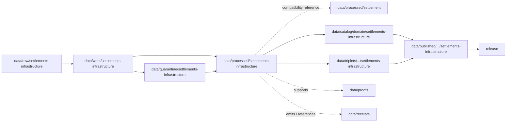

<!-- [KFM_META_BLOCK_V2]
doc_id: kfm://doc/data-processed-settlements-infrastructure-readme
title: data/processed/settlements-infrastructure/README.md — Settlements / Infrastructure Processed Data README
version: v0.1
type: readme; data-lifecycle-domain-lane; processed-stage-guide; settlements-infrastructure-domain-root; settlement-infrastructure-lane-index
status: draft; PROPOSED; data-root; processed-stage; settlements-infrastructure; settlement; municipality; census-place; townsite; ghost-town; fort; mission; reservation-community; infrastructure-asset; network-node; network-segment; facility; service-area; operator; condition-observation; dependency; source-role-aware; sensitivity-aware; release-gated; evidence-first
authors: ChatGPT-5.5 Thinking; reviewed_by: OWNER_TBD
owners: OWNER_TBD — Settlements/Infrastructure steward · Settlement identity steward · Infrastructure steward · Infrastructure sensitivity reviewer · Rights steward · Data steward · Pipeline steward · Evidence steward · Policy steward · Release steward · Docs steward
created: NEEDS VERIFICATION — greenfield stub existed before v0.1 expansion
updated: 2026-06-25
policy_label: public-doc; data; processed; settlements-infrastructure; settlement; infrastructure; lifecycle; governed; source-role-aware; sensitivity-aware; release-gated
tags: [kfm, data, processed, settlements-infrastructure, settlement, municipality, census-place, townsite, ghost-town, fort, mission, reservation-community, infrastructure-asset, network-node, network-segment, facility, service-area, operator, condition-observation, dependency, source-role, observed, regulatory, modeled, aggregate, administrative, candidate, synthetic, EvidenceBundle, SourceDescriptor, ValidationReport, PolicyDecision, ReviewRecord, RedactionReceipt, AggregationReceipt, ReleaseManifest, RollbackCard, RAW, WORK, QUARANTINE, PROCESSED, CATALOG, TRIPLET, PUBLISHED]
related:
  - ../README.md
  - ../../README.md
  - ../../../docs/domains/settlements-infrastructure/DATA_LIFECYCLE.md
  - ../../../docs/domains/settlements-infrastructure/IDENTITY_MODEL.md
  - ../../../docs/domains/settlements-infrastructure/README.md
  - ../../../docs/domains/settlements-infrastructure/ARCHITECTURE.md
  - ../../../docs/domains/settlements-infrastructure/CANONICAL_PATHS.md
  - ../../../docs/domains/settlements-infrastructure/FILE_SYSTEM_PLAN.md
  - ../../../docs/domains/settlements-infrastructure/RELEASE_INDEX.md
  - ../../../docs/domains/roads-rail-trade/README.md
  - ../../../docs/domains/hydrology/README.md
  - ../../../docs/domains/hazards/README.md
  - ../../../docs/domains/people-dna-land/README.md
  - ../../../docs/domains/archaeology/README.md
  - ../../../policy/domains/settlements-infrastructure/
  - ../../../policy/sensitivity/settlements-infrastructure/
  - ../../../policy/domains/settlement/
  - ../../../policy/sensitivity/settlement/
  - ../../../contracts/domains/settlements-infrastructure/
  - ../../../schemas/contracts/v1/domains/settlements-infrastructure/
  - ../../raw/settlements-infrastructure/
  - ../../work/settlements-infrastructure/
  - ../../quarantine/settlements-infrastructure/
  - ../../processed/settlement/README.md
  - ../../catalog/domain/settlements-infrastructure/
  - ../../catalog/settlements-infrastructure/README.md
  - ../../triplets/
  - ../../published/
  - ../../proofs/
  - ../../receipts/
  - ../../registry/sources/settlements-infrastructure/
  - ../../../release/candidates/settlements-infrastructure/
  - ../../../release/
  - ../../../pipelines/domains/settlements-infrastructure/
  - ../../../pipeline_specs/settlements-infrastructure/
  - ../../../tools/validators/
notes:
  - "This file replaces a greenfield stub at `data/processed/settlements-infrastructure/README.md`."
  - "This is the parent PROCESSED-stage domain lane for Settlements / Infrastructure artifacts. It is not RAW source storage, WORK scratch, QUARANTINE holding, CATALOG, TRIPLET, PUBLISHED, proof storage, receipt storage, source registry, policy authority, release authority, public API/UI output, public map/tile output, emergency response surface, infrastructure condition surface, legal boundary authority, property/right-of-way proof, archaeology location surface, or life-safety guidance."
  - "The domain segment remains documented as CONFLICTED between `settlements-infrastructure` and `settlement`. This README expands the existing long-segment repo path while keeping `data/processed/settlement/` as compatibility/proposed until ADR resolution."
  - "Settlements/Infrastructure owns Settlement, Municipality, CensusPlace, Townsite, GhostTown, Fort, Mission, ReservationCommunity, InfrastructureAsset, NetworkNode, NetworkSegment, Facility, ServiceArea, Operator, ConditionObservation, and Dependency object families."
  - "Cross-lane boundaries are mandatory: Roads/Rail owns routes and route memberships; Hydrology owns water evidence; Hazards owns hazard events/warnings/declarations; People/Land owns ownership, parcels, and living-person privacy; Archaeology owns sensitive site coordinates."
  - "Promotion is a governed state transition, not a file move. Processed data itself is not public proof or a normal public surface."
  - "Critical assets, dependency graphs, condition observations, cultural/sovereignty joins, archaeology joins, people/land joins, and stale hazard/hydrology joins require policy review and the most restrictive applicable handling before public exposure."
  - "This README is a parent lane guide and index. Child lane READMEs define local boundaries; contracts define semantic object meaning; schemas define machine shape; policy decides admissibility; release records decide publication."
  - "Rollback target for this expansion is previous greenfield stub blob SHA `a017e7c5d65a284b2e75a2e9683863b351f72fd3`."
[/KFM_META_BLOCK_V2] -->

<a id="top"></a>

# data/processed/settlements-infrastructure

> Parent Settlements / Infrastructure PROCESSED-stage lane for normalized, source-traced, source-role-preserved, identity-safe settlement, place, facility, service-area, operator, condition, and dependency artifacts that have passed beyond RAW/WORK/QUARANTINE but are not yet cataloged, triplet-projected, published, or released.

<p>
  
  
  
  
  
  
</p>

**Status:** draft / PROPOSED  
**Owners:** OWNER_TBD — Settlements/Infrastructure steward · Settlement identity steward · Infrastructure steward · Infrastructure sensitivity reviewer · Rights steward · Data steward · Pipeline steward · Evidence steward · Policy steward · Release steward · Docs steward  
**Path:** `data/processed/settlements-infrastructure/README.md`  
**Owning root:** `data/processed/`  
**Domain segment:** `settlements-infrastructure` — CONFLICTED with `settlement` pending ADR  
**Lifecycle stage:** `PROCESSED`  
**Exposure posture:** not public by default; any public use requires governed catalog, EvidenceBundle, source-role and rights posture, identity review, sensitivity review, policy decision where applicable, ReleaseManifest, correction path, and rollback target.  
**Truth posture:** CONFIRMED target was a greenfield stub · CONFIRMED parent `data/processed/` is upstream of catalog/triplet/publication and is not a normal public surface · CONFIRMED Settlements/Infrastructure doctrine owns the object-family set listed below · CONFIRMED doctrine documents `settlements-infrastructure` vs `settlement` as a segment conflict · CONFIRMED promotion is a governed state transition and failure-closed gates are expected · PROPOSED parent-lane details and child-lane index · NEEDS VERIFICATION for actual child inventory, validators, fixtures, source descriptors, access-control enforcement, receipt families, policy enforcement, release linkage, and governed route behavior.

**Quick jumps:** [Purpose](#purpose) · [Segment conflict](#segment-conflict) · [Lifecycle boundary](#lifecycle-boundary) · [Repo fit](#repo-fit) · [Lane index](#lane-index) · [Accepted contents](#accepted-contents) · [Exclusions](#exclusions) · [Processed requirements](#processed-requirements) · [Source-role, identity, and sensitivity guardrails](#source-role-identity-and-sensitivity-guardrails) · [Evidence ledger](#evidence-ledger) · [Validation checklist](#validation-checklist) · [Rollback](#rollback)

---

## Purpose

`data/processed/settlements-infrastructure/` is the parent PROCESSED-stage lane for normalized Settlements / Infrastructure artifacts. It organizes processed outputs after source capture, identity normalization, temporal normalization, geometry review, infrastructure sensitivity review, rights review, cross-lane citation review, validation-oriented processing, or public-safe derivative preparation.

This lane may contain or point to processed artifacts for:

- settlements, municipalities, census places, townsites, ghost towns, forts, missions, and reservation communities;
- infrastructure assets, network nodes, network segments, facilities, service areas, operators, condition observations, and dependencies;
- identity sidecars using source id, object role, temporal scope, and normalized digest posture;
- generalized, redacted, aggregated, or restricted public-candidate derivatives that still require catalog and release review;
- reviewed relationship candidates to roads/rail, hydrology, hazards, people/land, agriculture, archaeology, and historical context where ownership remains explicit.

This parent README does not create a semantic contract, schema, validator, source registry, proof, receipt, policy decision, release decision, public map layer, public tile, public API route, public UI payload, emergency-response surface, infrastructure condition disclosure, legal boundary authority, right-of-way proof, archaeology location surface, property/ownership proof, or life-safety product.

## Segment conflict

Settlements/Infrastructure doctrine documents a path-segment conflict between `settlements-infrastructure` and `settlement`. This README expands the existing long-segment path because the repo already contains `data/processed/settlements-infrastructure/README.md`.

The shorter path currently exists as compatibility/proposed documentation:

```text
data/processed/settlement/
```

Until an ADR resolves the conflict, both names must avoid claiming exclusive canonical authority. This file should be treated as the current long-segment parent lane guide, not as proof that schemas, policy, release, validators, or public routes have adopted this exact segment.

## Lifecycle boundary

```text
RAW -> WORK / QUARANTINE -> PROCESSED -> CATALOG / TRIPLET -> PUBLISHED
```



`data/processed/settlements-infrastructure/` is upstream of catalog, triplet, publication, and release. It must not be used as a normal public map/API/UI/AI source.

## Repo fit

| Responsibility | Correct home | Rule |
|---|---|---|
| Raw settlement/infrastructure source files, Census/GNIS/municipal exports, bridge/facility inventories, source logs, source identifiers, source-native geometries, images, OCR inputs, or unprocessed partner materials | `data/raw/settlements-infrastructure/` or ADR-resolved equivalent | Not this lane. |
| In-process normalization, identity reconciliation, geometry repair, place matching, infrastructure joins, dependency analysis, QA, notebooks, or scratch products | `data/work/settlements-infrastructure/` or ADR-resolved equivalent | Not this lane. |
| Unresolved rights, unresolved source role, disputed identity, sensitive infrastructure detail, dependency graphs, cultural/archaeology joins, people/land joins, stale hazard/hydrology joins, or not-yet-reviewed material | `data/quarantine/settlements-infrastructure/` or ADR-resolved equivalent | Not this lane until review/admission allows. |
| Normalized Settlements/Infrastructure processed artifacts | `data/processed/settlements-infrastructure/` | This parent lane and verified child lanes. |
| Compatibility settlement processed artifacts | `data/processed/settlement/` | Compatibility lane pending ADR. |
| Domain catalog records | `data/catalog/domain/settlements-infrastructure/` or ADR-resolved equivalent | Downstream catalog stage. |
| Triplet/graph records | `data/triplets/.../settlements-infrastructure/` | Downstream graph stage; must preserve restrictions and ownership boundaries. |
| Published public-safe products | `data/published/.../settlements-infrastructure/` | Downstream only after release. |
| EvidenceBundle/proof records | `data/proofs/` | Separate proof family. |
| Source, run, transform, redaction, aggregation, validation, policy, correction, access, and release receipts | `data/receipts/` | Separate receipt family. |
| Source registry records | `data/registry/sources/settlements-infrastructure/` | Separate source authority. |
| Release candidates and release manifests | `release/candidates/settlements-infrastructure/`, `release/` | Separate publication authority. |
| Contracts | `contracts/domains/settlements-infrastructure/` or ADR-resolved segment | Object meaning; not data. |
| Schemas | `schemas/contracts/v1/domains/settlements-infrastructure/` or ADR-resolved segment | Machine shape; not data. |
| Policy and sensitivity rules | `policy/domains/settlements-infrastructure/`, `policy/sensitivity/settlements-infrastructure/`, or ADR-resolved segment | Admissibility authority; not data. |
| Validators, tests, fixtures, pipelines, pipeline specs, apps, packages | `tools/validators/`, `tests/`, `fixtures/`, `pipelines/`, `pipeline_specs/`, `apps/`, `packages/` | Separate roots. |

## Lane index

Known or intended child lanes under `data/processed/settlements-infrastructure/` are listed below. Treat entries as **PROPOSED** unless current child READMEs, validators, fixtures, policies, receipts, access controls, and CI enforcement have been verified in the same implementation pass.

| Lane | Family | Purpose | Hard boundary |
|---|---|---|---|
| `settlements/` | Settlement | General settlement/place records and assertions. | Not municipality, census place, or legal boundary truth by name alone. |
| `municipalities/` | Municipality | Legal municipality entities and status slices. | Status changes are events/slices, not silent edits. |
| `census-places/` | CensusPlace | Census vintage place records. | Census vintage is identity-bearing. |
| `townsites/` | Townsite | Platted or asserted townsite records. | A townsite is not a ghost town by default. |
| `ghost-towns/` | GhostTown | Depopulated or abandoned settlement claims. | Relation to predecessor settlement is succession, not merge. |
| `forts/` | Fort | Fort/place records and operating epochs. | Cultural, military, or archaeology sensitivity may apply. |
| `missions/` | Mission | Mission/place records and operating epochs. | Cultural sensitivity may apply. |
| `reservation-communities/` | ReservationCommunity | Community records where sovereignty and naming posture matter. | Geometry precision and joins require steward review. |
| `infrastructure-assets/` | InfrastructureAsset | Asset identity and class context. | Critical assets are not public by default. |
| `network-nodes/` | NetworkNode | Infrastructure or settlement network nodes. | Roads/Rail network truth remains Roads/Rail-owned when at issue. |
| `network-segments/` | NetworkSegment | Settlement/infrastructure network segments. | Endpoint identity drift requires new rows, not silent edits. |
| `facilities/` | Facility | Facility identity and role context. | Operator-sensitive details default restricted. |
| `service-areas/` | ServiceArea | Aggregate service-area context. | Must carry aggregation posture where it could re-identify individuals or sensitive assets. |
| `operators/` | Operator | Operator entity and temporal/lineage context. | Reorganizations are lineage, not rewritten identity. |
| `condition-observations/` | ConditionObservation | Time-bound condition observations. | Observed time is load-bearing; not public condition disclosure by default. |
| `dependencies/` | Dependency | Infrastructure/service dependency relationships. | Dependency graphs are sensitive and restricted by default. |
| `public/` | Public-candidate derivatives | Candidate generalized/released-style derivatives. | `public/` means public-candidate if present, not published or released. |
| `restricted/` | Restricted processed artifacts | Critical, dependency, cultural, archaeology, person/land, exact-harm, or rights-limited artifacts admitted by policy. | Non-public, access-controlled, fail-closed. |

## Accepted contents

Processed Settlements/Infrastructure artifacts may include:

- normalized tabular, spatial, temporal, textual, vector, network, graph-ready, or review-ready settlement and infrastructure artifacts;
- source-role-tagged Settlement, Municipality, CensusPlace, Townsite, GhostTown, Fort, Mission, ReservationCommunity, InfrastructureAsset, NetworkNode, NetworkSegment, Facility, ServiceArea, Operator, ConditionObservation, and Dependency products;
- identity, geometry, temporal-scope, external-identifier, source-vintage, normalized-digest, aggregation, and sensitivity sidecars needed to interpret processed products;
- relationship candidates to Roads/Rail, Hydrology, Hazards, People/Land, Agriculture, Archaeology, and Frontier Matrix records where ownership and sensitivity remain explicit;
- generalized, redacted, aggregated, suppressed, delayed, or restricted derivatives that still require catalog/release review before public use;
- sidecar metadata needed to interpret processed artifacts when it is not a receipt, proof, policy decision, release manifest, source registry record, schema, validator, or catalog record;
- lane-local README or manifest notes that explain processed-data boundaries without becoming public outputs or authority records.

## Exclusions

Do not store these under `data/processed/settlements-infrastructure/`:

- RAW source files, source-native exports, source media, logs, direct source identifiers, or unprocessed source payloads.
- WORK/scratch files, notebooks, identity-matching experiments, geometry-repair trials, place conflation trials, infrastructure join scratch, dependency analysis scratch, or redaction-debug outputs.
- Quarantined or unresolved sensitive/rights/source-role/identity material.
- Catalog records, triplet/graph records, published products, proof records, receipt records, source registry records, release decisions, schemas, policy rules, validators, tests, fixtures, pipelines, app/UI/API code, or packages.
- Transport routes or route memberships, water evidence, hazard events/warnings/declarations, ownership/parcels/living-person privacy, archaeology site coordinates, cultural/sovereignty-sensitive context, legal boundary adjudication, or public operational guidance owned by other lanes.
- Public API/UI/tile payloads, direct downloads, Focus Mode answers, public map layers, emergency-response products, infrastructure condition surfaces, legal advice, property/right-of-way proof, or life-safety guidance.
- Restricted source terms, private agreement details, credentials, secrets, redaction parameters, aggregation thresholds, exact transform offsets, unsafe exact coordinates, critical-asset details, dependency-graph details, condition/vulnerability details, or implementation details that could aid exposure or unauthorized access.

## Processed requirements

PROPOSED until concrete validators, policies, fixtures, receipts, and access-control enforcement are verified:

| Requirement | Meaning |
|---|---|
| Segment conflict check | Confirm whether `settlements-infrastructure`, `settlement`, or another ADR-resolved segment is canonical across data, policy, schemas, contracts, release, and APIs. |
| Source trace | Each source-derived artifact should trace to SourceDescriptor or source registry context. |
| Evidence linkage | Claims based on processed derivatives should resolve downstream to EvidenceBundle/proof context where appropriate. |
| Source role | Observed, regulatory, modeled, aggregate, administrative, candidate, synthetic, or ADR-resolved role vocabulary must remain explicit and not interchangeable. |
| Object distinction | Settlement, Municipality, CensusPlace, Townsite, GhostTown, Fort, Mission, ReservationCommunity, InfrastructureAsset, NetworkNode, NetworkSegment, Facility, ServiceArea, Operator, ConditionObservation, and Dependency must remain distinct. |
| Identity posture | Identity should preserve source id, object role, temporal scope, and normalized digest; identity must not collapse by name or geometry similarity alone. |
| Time semantics | Source time, observed time, valid time, recording/incorporation/status time, retrieval time, release time, and correction time should remain distinguishable where material. |
| Rights posture | Source, steward, license, redistribution, attribution, derivative-use, municipal, vendor, operator, and partner terms should be resolved or held closed. |
| Sensitivity posture | Critical assets, dependency graphs, condition/vulnerability fields, cultural/archaeology joins, people/land joins, small-cell outputs, and exact-harm coordinates should carry restriction/generalization/denial posture where needed. |
| Transform linkage | Reprojection, simplification, generalization, aggregation, redaction, suppression, withholding, delayed publication, or public-safe transform should link to appropriate receipts. |
| Review state | Domain steward, infrastructure sensitivity reviewer, rights reviewer, data-quality reviewer, cultural/sovereignty reviewer where applicable, and release authority review should be recorded where required. |
| Policy decision | Restricted, public-candidate, and public transitions require PolicyDecision/admissibility posture where policy requires it. |
| Catalog readiness | Processed artifacts intended for discovery should promote through catalog/triplet lanes, not directly to public use. |
| Release readiness | Public use requires ReleaseManifest or release-linked state, published output path, correction path, and rollback target. |
| No public surface by default | Processed artifacts must not be exposed directly as public maps, tiles, APIs, downloads, Focus Mode answers, or AI-answer sources. |

## Source-role, identity, and sensitivity guardrails

- Processed Settlements/Infrastructure data is not proof by itself.
- Promotion is a governed state transition, not a file move.
- A `Settlement`, `Municipality`, and `CensusPlace` with similar names or overlapping geometry are not automatically the same object.
- A `Townsite` is not a `GhostTown` by default; succession and abandonment are evidence-bound claims.
- A `Fort`, `Mission`, or `ReservationCommunity` may carry cultural, sovereignty, or archaeology sensitivity and must fail closed until steward review clears the representation.
- Infrastructure assets, facilities, condition observations, dependencies, and service areas may carry critical-infrastructure sensitivity and are not public by default.
- Dependency graphs and condition/vulnerability details are restricted unless policy and review approve a safer representation.
- Roads/Rail owns transport routes and route membership; Hydrology owns water evidence; Hazards owns hazard events and warnings; People/Land owns ownership and living-person-sensitive joins; Archaeology owns site coordinates.
- The most restrictive applicable policy row governs cross-lane joins.
- Unclear rights, unresolved source role, missing evidence, unresolved sensitivity, unresolved identity, or absent release state blocks public promotion.
- Public clients and Focus Mode must use governed APIs, released artifacts, catalog/triplet records, EvidenceBundle-backed payloads, and policy-safe envelopes, not this directory directly.

> [!CAUTION]
> Do not expose `data/processed/settlements-infrastructure/` directly as a public map, API, UI, download, Focus Mode answer, AI answer source, emergency response surface, infrastructure condition surface, dependency graph surface, legal boundary authority, property/right-of-way proof, public person/parcel service, archaeology location surface, or life-safety product. Processed Settlements/Infrastructure data remains inside the trust membrane until governed promotion and release.

## Evidence ledger

| Source | Status | Supports | Limits |
|---|---|---|---|
| Previous file | CONFIRMED | Target existed as a greenfield stub. | Did not define Settlements/Infrastructure processed boundaries or child lanes. |
| `data/processed/README.md` | CONFIRMED | PROCESSED data is upstream of catalog, triplets, publication, and release and is not the normal public surface. | Does not prove Settlements/Infrastructure child inventory or enforcement. |
| `docs/domains/settlements-infrastructure/DATA_LIFECYCLE.md` | CONFIRMED doctrine / PROPOSED implementation | Documents the RAW→WORK/QUARANTINE→PROCESSED→CATALOG/TRIPLET→PUBLISHED invariant, domain ownership/non-ownership, per-phase responsibilities, gates, and the `settlements-infrastructure` vs `settlement` segment conflict. | Concrete paths, validators, contracts, schemas, and workflows are PROPOSED/NEEDS VERIFICATION. |
| `docs/domains/settlements-infrastructure/IDENTITY_MODEL.md` | CONFIRMED doctrine / PROPOSED implementation | Defines the identity model and object-family set; identity uses source id, object role, temporal scope, and normalized digest; critical-infrastructure deny posture applies. | Field realization, schema paths, and route behavior remain NEEDS VERIFICATION. |
| `data/processed/settlement/README.md` | CONFIRMED compatibility README | Short-segment compatibility README exists and labels `settlement/` as PROPOSED compatibility pending ADR. | Does not resolve canonical segment. |
| `policy/domains/settlements-infrastructure/`, `policy/sensitivity/settlements-infrastructure/`, `policy/domains/settlement/`, and `policy/sensitivity/settlement/` | NEEDS VERIFICATION | Candidate admissibility homes depending on ADR outcome. | Current policy files and enforcement were not verified in this task. |
| `contracts/domains/settlements-infrastructure/` and `schemas/contracts/v1/domains/settlements-infrastructure/` | NEEDS VERIFICATION | Expected object contract/schema homes if the long segment wins. | Specific object files and validators were not verified in this task. |

## Validation checklist

- [ ] Resolve the `settlements-infrastructure` versus `settlement` segment conflict by ADR.
- [ ] Confirm actual child directories under `data/processed/settlements-infrastructure/` and reconcile missing, duplicate, alias, legacy, or compatibility lanes.
- [ ] Confirm accepted processed path convention for settlement, municipality, census place, townsite, ghost town, fort, mission, reservation community, infrastructure asset, network node, network segment, facility, service area, operator, condition observation, dependency, public-candidate, and restricted artifacts.
- [ ] Confirm each child lane has README, owner, purpose, accepted contents, exclusions, guardrails, validation checklist, and rollback target.
- [ ] Confirm object contracts and schema paths for Settlement, Municipality, CensusPlace, Townsite, GhostTown, Fort, Mission, ReservationCommunity, InfrastructureAsset, NetworkNode, NetworkSegment, Facility, ServiceArea, Operator, ConditionObservation, and Dependency.
- [ ] Confirm validators, fixtures, CI checks, source-role checks, geometry checks, identity checks, temporal-scope checks, sensitivity checks, redaction checks, aggregation checks, restricted-source checks, and access-control enforcement.
- [ ] Confirm SourceDescriptor/source registry linkage for every input source and derived artifact.
- [ ] Confirm RunReceipt, TransformReceipt, RedactionReceipt, AggregationReceipt, ReviewRecord, ValidationReport, PolicyDecision, CorrectionNotice, ReleaseManifest, RollbackCard, correction path, and rollback target where applicable.
- [ ] Confirm critical-asset details, dependency graphs, condition/vulnerability fields, cultural/archaeology joins, people/land joins, stale hydrology/hazard joins, restricted-source fields, unsafe exact coordinates, secrets, private agreement terms, redaction parameters, transform secrets, and release-unclear artifacts cannot enter public routes.
- [ ] Confirm public-candidate transitions are governed, evidence-backed, source-role-safe, rights-safe, sensitivity-safe, identity-safe, review-backed, release-linked, and reversible.
- [ ] Confirm no RAW, WORK, QUARANTINE, CATALOG, TRIPLET, PUBLISHED, proof, receipt, registry, release, schema, policy, validator, package, pipeline, app, API, public map, public tile, direct download, Focus Mode answer, emergency response surface, infrastructure condition surface, dependency graph surface, legal advice, property/right-of-way proof, archaeology location surface, or life-safety artifact is misplaced here.
- [ ] Confirm public clients and Focus Mode cannot read this lane directly as public truth, public settlement service, public infrastructure service, public map, public tile, public API, public UI, or AI-answer source.

## Rollback

Rollback is required if this parent lane becomes a RAW source-data root, WORK scratch root, QUARANTINE bypass, public output root, `data/published/` substitute, public-candidate shortcut, source-role collapse path, identity-by-name path, identity-by-geometry path, critical-asset exposure path, condition/vulnerability exposure path, dependency-graph exposure path, cultural/archaeology exposure path, person/land join exposure path, restricted-source leakage path, unsafe coordinate exposure path, transform-secret exposure path, agreement/credential exposure path, proof store, receipt store, catalog root, triplet root, source-registry root, release-decision root, schema root, policy root, validator root, implementation root, public API shortcut, public UI shortcut, public tile shortcut, public exposure shortcut, emergency response surface, infrastructure condition surface, dependency graph surface, legal boundary authority, property/right-of-way proof, or life-safety guidance source.

Rollback target for this expansion: previous greenfield stub blob SHA `a017e7c5d65a284b2e75a2e9683863b351f72fd3`.

<p align="right"><a href="#top">Back to top</a></p>
