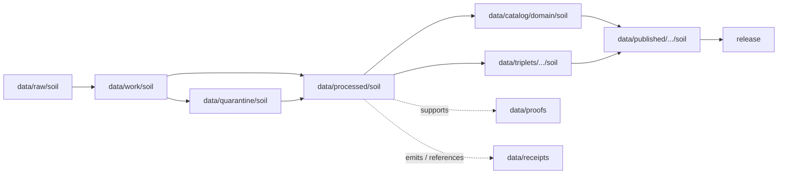

<!-- [KFM_META_BLOCK_V2]
doc_id: kfm://doc/data-processed-soil-readme
title: data/processed/soil/README.md — Soil Processed Data README
version: v0.1
type: readme; data-lifecycle-domain-lane; processed-stage-guide; soil-domain-root; soil-survey-observation-interpretation-lane-index
status: draft; PROPOSED; data-root; processed-stage; soil; ssurgo; sda; gssurgo; gnatsgo; soil-moisture; pedon; horizon; component; suitability; erosion; support-type-aware; source-role-aware; sensitivity-aware; release-gated; evidence-first
authors: ChatGPT-5.5 Thinking; reviewed_by: OWNER_TBD
owners: OWNER_TBD — Soil steward · Soil survey steward · Soil moisture steward · Interpretation steward · Sensitivity reviewer · Rights steward · Data steward · Pipeline steward · Evidence steward · Policy steward · Release steward · Docs steward
created: NEEDS VERIFICATION — greenfield stub existed before v0.1 expansion
updated: 2026-06-25
policy_label: public-doc; data; processed; soil; lifecycle; governed; support-type-aware; source-role-aware; release-gated
tags: [kfm, data, processed, soil, SoilMapUnit, SoilComponent, Horizon, SoilProperty, HydrologicSoilGroup, SoilMoistureObservation, Pedon, SoilProfileView, ErosionRisk, SuitabilityRating, ComponentHorizonJoin, SoilTimeCaveat, SSURGO, SDA, gSSURGO, gNATSGO, Mesonet, SCAN, USCRN, SMAP, SoilGrids, source-role, support-type, EvidenceBundle, SourceDescriptor, ValidationReport, PolicyDecision, ReviewRecord, RedactionReceipt, AggregationReceipt, ReleaseManifest, RollbackCard, RAW, WORK, QUARANTINE, PROCESSED, CATALOG, TRIPLET, PUBLISHED]
related:
  - ../README.md
  - ../../README.md
  - ../../../docs/domains/soil/ARCHITECTURE.md
  - ../../../docs/domains/soil/DATA_LIFECYCLE.md
  - ../../../docs/domains/soil/CANONICAL_PATHS.md
  - ../../../docs/domains/soil/API_CONTRACTS.md
  - ../../../docs/domains/soil/CONTINUITY_INVENTORY.md
  - ../../../docs/domains/soil/README.md
  - ../../../docs/domains/agriculture/README.md
  - ../../../docs/domains/hydrology/README.md
  - ../../../docs/domains/hazards/README.md
  - ../../../docs/domains/habitat/README.md
  - ../../../docs/domains/fauna/README.md
  - ../../../docs/domains/flora/README.md
  - ../../../docs/domains/geology/README.md
  - ../../../contracts/domains/soil/
  - ../../../contracts/domains/soil/component_horizon_join.md
  - ../../../contracts/domains/soil/domain_observation.md
  - ../../../contracts/domains/soil/domain_layer_descriptor.md
  - ../../../policy/domains/soil/
  - ../../../schemas/contracts/v1/domains/soil/
  - ../../raw/soil/
  - ../../work/soil/
  - ../../quarantine/soil/
  - ../../catalog/domain/soil/
  - ../../triplets/
  - ../../published/
  - ../../proofs/
  - ../../receipts/
  - ../../registry/sources/soil/
  - ../../../release/candidates/soil/
  - ../../../release/
  - ../../../pipelines/domains/soil/
  - ../../../pipelines/domains/soil/ssurgo_ingest/README.md
  - ../../../pipeline_specs/soil/
  - ../../../tools/validators/
notes:
  - "This file replaces a greenfield stub at `data/processed/soil/README.md`."
  - "This is the parent PROCESSED-stage domain lane for Soil artifacts. It is not RAW source storage, WORK scratch, QUARANTINE holding, CATALOG, TRIPLET, PUBLISHED, proof storage, receipt storage, source registry, policy authority, release authority, public API/UI output, public map/tile output, agronomic prescription, engineering certification, crop/yield claim, flood/water authority, geology authority, rare-location exposure path, or life-safety guidance."
  - "Soil owns static soil survey evidence, gridded soil derivatives, components, horizons, pedons, soil-moisture observations, interpretations, suitability, erosion context, and public-safe soil map/API products after release."
  - "Support-type separation is mandatory: static survey, gridded derivative, station reading, satellite grid, pedon evidence, and interpretation cannot masquerade as one surface."
  - "Cross-lane boundaries are mandatory: Agriculture owns crop/yield claims; Hydrology/Hazards own streamflow, groundwater, flood, and hazard claims; Geology owns lithology/boreholes/stratigraphy; Habitat/Fauna/Flora own ecological occurrence and habitat truth."
  - "Soil products are usually public-safe at appropriate scale, but field-/owner-specific, unpublished, proprietary, or operational sensor data require rights and sensitivity review before release."
  - "This README is a parent lane guide and index. Child lane READMEs define local boundaries; contracts define semantic object meaning; schemas define machine shape; policy decides admissibility; release records decide publication."
  - "Rollback target for this expansion is previous greenfield stub blob SHA `fdd457e66826407f4dc54422be6f019bb3e2e695`."
[/KFM_META_BLOCK_V2] -->

<a id="top"></a>

# data/processed/soil

> Parent Soil PROCESSED-stage lane for normalized, source-traced, support-type-preserved soil survey, gridded derivative, observation, pedon/profile, interpretation, suitability, and erosion-context artifacts that have passed beyond RAW/WORK/QUARANTINE but are not yet cataloged, triplet-projected, published, or released.

<p>
  
  
  
  
  
  
</p>

**Status:** draft / PROPOSED  
**Owners:** OWNER_TBD — Soil steward · Soil survey steward · Soil moisture steward · Interpretation steward · Sensitivity reviewer · Rights steward · Data steward · Pipeline steward · Evidence steward · Policy steward · Release steward · Docs steward  
**Path:** `data/processed/soil/README.md`  
**Owning root:** `data/processed/`  
**Domain segment:** `soil`  
**Lifecycle stage:** `PROCESSED`  
**Exposure posture:** not public by default; any public use requires governed catalog, EvidenceBundle, source-role and rights posture, support-type/time caveats, sensitivity review, policy decision where applicable, ReleaseManifest, correction path, and rollback target.  
**Truth posture:** CONFIRMED target was a greenfield stub · CONFIRMED parent `data/processed/` is upstream of catalog/triplet/publication and is not a normal public surface · CONFIRMED Soil doctrine owns the object-family and source-family sets listed below · CONFIRMED support-type separation is mandatory · CONFIRMED Soil products are public-safe only at appropriate scale with caveats and release controls · PROPOSED parent-lane details and child-lane index · NEEDS VERIFICATION for actual child inventory, validators, fixtures, source descriptors, access-control enforcement, receipt families, policy enforcement, release linkage, and governed route behavior.

**Quick jumps:** [Purpose](#purpose) · [Lifecycle boundary](#lifecycle-boundary) · [Repo fit](#repo-fit) · [Lane index](#lane-index) · [Accepted contents](#accepted-contents) · [Exclusions](#exclusions) · [Processed requirements](#processed-requirements) · [Support-type, source-role, and sensitivity guardrails](#support-type-source-role-and-sensitivity-guardrails) · [Evidence ledger](#evidence-ledger) · [Validation checklist](#validation-checklist) · [Rollback](#rollback)

---

## Purpose

`data/processed/soil/` is the parent PROCESSED-stage lane for normalized Soil artifacts. It organizes processed outputs after source capture, survey normalization, map-unit/component/horizon joins, soil-property normalization, soil-moisture observation normalization, pedon/profile handling, support-type classification, temporal caveat assignment, rights review, validation-oriented processing, or public-safe derivative preparation.

This lane may contain or point to processed artifacts for:

- static soil survey and authoritative soil-survey lineage;
- gridded derivative soil products;
- map units, components, horizons, component-horizon joins, hydrologic soil groups, and soil properties;
- station and satellite soil-moisture observations;
- pedons and soil profile views;
- suitability ratings, erosion-risk interpretations, and soil-time caveats;
- generalized, aggregated, redacted, delayed, or restricted public-candidate derivatives that still require catalog and release review.

This parent README does not create a semantic contract, schema, validator, source registry, proof, receipt, policy decision, release decision, public map layer, public tile, public API route, public UI payload, agronomic prescription, crop/yield claim, flood/water authority, geology authority, engineering certification, private farm/owner disclosure, rare-location exposure path, or life-safety product.

## Lifecycle boundary

```text
RAW -> WORK / QUARANTINE -> PROCESSED -> CATALOG / TRIPLET -> PUBLISHED
```



`data/processed/soil/` is upstream of catalog, triplet, publication, and release. It must not be used as a normal public map/API/UI/AI source.

## Repo fit

| Responsibility | Correct home | Rule |
|---|---|---|
| Raw SSURGO/SDA/gSSURGO/gNATSGO/source files, sensor feeds, satellite downloads, source logs, source identifiers, source-native geometries, original tables, or unprocessed partner materials | `data/raw/soil/` | Not this lane. |
| In-process joins, MUKEY/COKEY/CHKEY reconciliation, geometry repair, raster/vector derivation, observation QA, support-type assignment, interpretation experiments, notebooks, or scratch products | `data/work/soil/` | Not this lane. |
| Unresolved rights, unresolved source role, missing support type, failed joins, malformed geometry, unresolved time caveat, field-/owner-specific exposure risk, proprietary source risk, or not-yet-reviewed material | `data/quarantine/soil/` | Not this lane until review/admission allows. |
| Normalized Soil processed artifacts | `data/processed/soil/` | This parent lane and verified child lanes. |
| Soil catalog records | `data/catalog/domain/soil/` | Downstream catalog stage. |
| Triplet/graph records | `data/triplets/.../soil/` | Downstream graph stage; must preserve support type, evidence, restrictions, and ownership boundaries. |
| Published public-safe products | `data/published/.../soil/` or `data/published/layers/soil/` | Downstream only after release. |
| EvidenceBundle/proof records | `data/proofs/` | Separate proof family. |
| Source, run, transform, redaction, aggregation, validation, policy, correction, access, and release receipts | `data/receipts/` | Separate receipt family. |
| Soil source registry records | `data/registry/sources/soil/` | Separate source authority. |
| Release candidates and release manifests | `release/candidates/soil/`, `release/` | Separate publication authority. |
| Soil contracts | `contracts/domains/soil/` | Object meaning; not data. |
| Soil schemas | `schemas/contracts/v1/domains/soil/` | Machine shape; not data. |
| Soil policy and sensitivity rules | `policy/domains/soil/` | Admissibility authority; not data. |
| Validators, tests, fixtures, pipelines, pipeline specs, apps, packages | `tools/validators/`, `tests/`, `fixtures/`, `pipelines/`, `pipeline_specs/`, `apps/`, `packages/` | Separate roots. |

## Lane index

Known or intended child lanes under `data/processed/soil/` are listed below. Treat entries as **PROPOSED** unless current child READMEs, validators, fixtures, policies, receipts, access controls, and CI enforcement have been verified in the same implementation pass.

| Lane | Family | Purpose | Hard boundary |
|---|---|---|---|
| `map-units/` | SoilMapUnit | Survey polygon carriers and map-unit identifiers. | Not public map tiles or catalog records. |
| `components/` | SoilComponent | Component records within map units. | Component percentages and joins must stay source/vintage-aware. |
| `horizons/` | Horizon | Horizon depths and properties. | Horizon data must not be detached from component/pedon evidence. |
| `component-horizon-joins/` | Component Horizon Join | MUKEY/COKEY/CHKEY lineage joins. | Join lineage must not be hidden in derived summaries. |
| `properties/` | SoilProperty | Measured or derived properties. | Property support type and units must remain explicit. |
| `hydrologic-groups/` | Hydrologic Soil Group | Runoff-potential classification context. | Not streamflow, groundwater, NFHL, or flood authority. |
| `moisture/` | Soil Moisture Observation | Station and satellite soil-moisture observations. | Observation support/cadence/time must remain explicit. |
| `pedons/` | Pedon / SoilProfileView | Profile-level evidence and soil descriptions. | Exact/private or unpublished pedon context may require restriction. |
| `erosion/` | ErosionRisk | Interpretive erosion-risk products. | Not authoritative hazard or engineering certification. |
| `suitability/` | SuitabilityRating | Interpretive suitability products. | Not crop/yield truth or agronomic prescription by itself. |
| `time-caveats/` | SoilTimeCaveat | Temporal limitation markers for products. | Caveats are mandatory where vintage/freshness affects interpretation. |
| `gridded/` | Gridded derivative soil | gSSURGO, gNATSGO, SoilGrids, and similar grids. | Gridded derivative is not survey truth. |
| `public/` | Public-candidate derivatives | Candidate generalized/released-style derivatives. | `public/` means public-candidate if present, not published or released. |
| `restricted/` | Restricted processed artifacts | Field-/owner-specific, proprietary, operational sensor, or sensitive join artifacts admitted by policy. | Non-public, access-controlled, fail-closed. |

## Accepted contents

Processed Soil artifacts may include:

- normalized tabular, spatial, temporal, raster, vector, graph-ready, or review-ready Soil artifacts;
- source-role-tagged SoilMapUnit, SoilComponent, Horizon, SoilProperty, Hydrologic Soil Group, Soil Moisture Observation, Pedon, SoilProfileView, ErosionRisk, SuitabilityRating, Component Horizon Join, and SoilTimeCaveat products;
- support-type sidecars distinguishing authoritative static survey, gridded derivative, station reading, satellite grid, pedon evidence, and interpretation;
- identity, geometry, temporal-scope, depth/unit, source-vintage, normalized-digest, aggregation, and sensitivity sidecars needed to interpret processed products;
- relationship candidates to Agriculture, Hydrology, Hazards, Habitat, Fauna, Flora, Geology, and Frontier Matrix records where ownership and sensitivity remain explicit;
- generalized, redacted, aggregated, suppressed, delayed, or restricted derivatives that still require catalog/release review before public use;
- sidecar metadata needed to interpret processed artifacts when it is not a receipt, proof, policy decision, release manifest, source registry record, schema, validator, or catalog record;
- lane-local README or manifest notes that explain processed-data boundaries without becoming public outputs or authority records.

## Exclusions

Do not store these under `data/processed/soil/`:

- RAW source files, source-native SSURGO/SDA/gSSURGO/gNATSGO exports, Mesonet/SCAN/USCRN/SMAP source payloads, source media, logs, direct source identifiers, or unprocessed source payloads.
- WORK/scratch files, notebooks, join experiments, geometry-repair trials, raster derivation scratch, sensor QA scratch, suitability experiments, erosion-model experiments, or redaction-debug outputs.
- Quarantined or unresolved rights, source-role, support-type, sensitivity, time-caveat, or identity material.
- Catalog records, triplet/graph records, published products, proof records, receipt records, source registry records, release decisions, schemas, policy rules, validators, tests, fixtures, pipelines, app/UI/API code, or packages.
- Crop/yield truth, streamflow/groundwater/flood truth, hazard/emergency truth, lithology/borehole/stratigraphy truth, habitat/ecology occurrence truth, rare-location exact joins, land ownership, legal advice, engineering certification, agronomic prescription, or life-safety guidance.
- Public API/UI/tile payloads, direct downloads, Focus Mode answers, public map layers, private-farm or owner-specific outputs, operational sensor dashboards, or advisory products without release state.
- Restricted source terms, private agreement details, credentials, secrets, redaction parameters, aggregation thresholds, exact transform offsets, unsafe exact coordinates, or implementation details that could aid exposure or unauthorized access.

## Processed requirements

PROPOSED until concrete validators, policies, fixtures, receipts, and access-control enforcement are verified:

| Requirement | Meaning |
|---|---|
| Source trace | Each source-derived artifact should trace to SourceDescriptor or soil source registry context. |
| Evidence linkage | Claims based on processed derivatives should resolve downstream to EvidenceBundle/proof context where appropriate. |
| Source role | Authority, observation, context, model, aggregate, administrative, candidate, synthetic, or ADR-resolved role vocabulary must remain explicit and not interchangeable. |
| Support type | Static survey, gridded derivative, station reading, satellite grid, pedon evidence, and interpretation must remain explicit. Missing support type fails closed. |
| Object distinction | SoilMapUnit, SoilComponent, Horizon, SoilProperty, Hydrologic Soil Group, Soil Moisture Observation, Pedon, SoilProfileView, ErosionRisk, SuitabilityRating, Component Horizon Join, and SoilTimeCaveat must remain distinct. |
| Identity posture | Identity should preserve source id, object role, temporal scope, support type where material, and normalized digest; identity must not collapse by geometry or name similarity alone. |
| Time semantics | Source time, observed time, valid time, retrieval time, release time, correction time, cadence, and source vintage should remain distinguishable where material. |
| Rights posture | Source, steward, license, redistribution, attribution, derivative-use, sensor-network, vendor, partner, and unpublished-data terms should be resolved or held closed. |
| Sensitivity posture | Field-/owner-specific outputs, private sensor networks, proprietary material, rare-location joins, small-cell outputs, and exact-harm coordinates should carry restriction/generalization/denial posture where needed. |
| Transform linkage | Reprojection, rasterization, vectorization, simplification, generalization, aggregation, redaction, suppression, withholding, delayed publication, or public-safe transform should link to appropriate receipts. |
| Review state | Domain steward, rights reviewer, data-quality reviewer, sensitivity reviewer, interpretation reviewer where applicable, and release authority review should be recorded where required. |
| Policy decision | Restricted, public-candidate, and public transitions require PolicyDecision/admissibility posture where policy requires it. |
| Catalog readiness | Processed artifacts intended for discovery should promote through catalog/triplet lanes, not directly to public use. |
| Release readiness | Public use requires ReleaseManifest or release-linked state, published output path, correction path, support-type/time caveats, and rollback target. |
| No public surface by default | Processed artifacts must not be exposed directly as public maps, tiles, APIs, downloads, Focus Mode answers, or AI-answer sources. |

## Support-type, source-role, and sensitivity guardrails

- Processed Soil data is not proof by itself.
- Support-type separation is mandatory across the entire lifecycle.
- Static survey, gridded derivative, station reading, satellite grid, pedon evidence, and interpretation must not be merged into one unqualified surface.
- A soil moisture value without depth, unit, cadence/time, support type, source, and evidence posture fails closed.
- Gridded derivatives are not survey truth.
- Suitability ratings and erosion-risk outputs are interpretations with caveats, not agronomic prescriptions, engineering certifications, crop/yield truth, or hazard authority.
- Hydrologic Soil Group is soil-side runoff context, not streamflow, groundwater, NFHL, or flood truth.
- Agriculture owns crop/yield truth; Hydrology/Hazards own water and hazard truth; Geology owns lithology/boreholes/stratigraphy; Habitat/Fauna/Flora own ecological occurrence and habitat truth.
- Rare-location or sensitive ecology joins must not leak via soil substrate, suitability, or moisture context.
- Field-/owner-specific, proprietary, unpublished, or operational sensor material fails closed until policy, rights, review, release state, correction path, and rollback are resolved.
- Public clients and Focus Mode must use governed APIs, released artifacts, catalog/triplet records, EvidenceBundle-backed payloads, and policy-safe envelopes, not this directory directly.

> [!CAUTION]
> Do not expose `data/processed/soil/` directly as a public map, API, UI, download, Focus Mode answer, AI answer source, agronomic prescription, engineering certification, flood/water authority, geology authority, private-farm disclosure, operational sensor dashboard, rare-location exposure surface, or life-safety product. Processed Soil data remains inside the trust membrane until governed promotion and release.

## Evidence ledger

| Source | Status | Supports | Limits |
|---|---|---|---|
| Previous file | CONFIRMED | Target existed as a greenfield stub. | Did not define Soil processed boundaries or child lanes. |
| `data/processed/README.md` | CONFIRMED | PROCESSED data is upstream of catalog, triplets, publication, and release and is not the normal public surface. | Does not prove Soil child inventory or enforcement. |
| Repository search | CONFIRMED | Found Soil architecture, lifecycle, SSURGO ingest, API contract, canonical paths, continuity inventory, and contract files. | Search is not a full tree audit. |
| `docs/domains/soil/DATA_LIFECYCLE.md` | CONFIRMED doctrine / PROPOSED implementation | Soil continuity inventory states ownership, source families, cross-lane relations, sensitivity posture, path map, and promotion model. | Implementation maturity, exact schemas, validators, and release wiring remain NEEDS VERIFICATION. |
| `docs/domains/soil/ARCHITECTURE.md` | CONFIRMED doctrine / PROPOSED implementation | Defines Soil scope, object families, source families, support-type separation, lifecycle gates, cross-lane relations, and sensitivity/publication posture. | Field realization, route behavior, and validator enforcement remain NEEDS VERIFICATION. |
| `pipelines/domains/soil/ssurgo_ingest/README.md` | NEEDS VERIFICATION | Expected SSURGO ingest pipeline documentation. | This task did not inspect contents. |
| `contracts/domains/soil/` and `schemas/contracts/v1/domains/soil/` | NEEDS VERIFICATION | Expected object contract/schema homes. | Specific object files and validators were not fully verified in this task. |
| `policy/domains/soil/` | NEEDS VERIFICATION | Expected admissibility home. | Current policy files and enforcement were not verified in this task. |

## Validation checklist

- [ ] Confirm actual child directories under `data/processed/soil/` and reconcile missing, duplicate, alias, legacy, or compatibility lanes.
- [ ] Confirm accepted processed path convention for map units, components, horizons, component-horizon joins, soil properties, hydrologic groups, soil moisture, pedons, erosion, suitability, time caveats, gridded derivatives, public-candidate, and restricted artifacts.
- [ ] Confirm each child lane has README, owner, purpose, accepted contents, exclusions, guardrails, validation checklist, and rollback target.
- [ ] Confirm object contracts and schema paths for SoilMapUnit, SoilComponent, Horizon, SoilProperty, Hydrologic Soil Group, Soil Moisture Observation, Pedon, SoilProfileView, ErosionRisk, SuitabilityRating, Component Horizon Join, and SoilTimeCaveat.
- [ ] Confirm validators, fixtures, CI checks, source-role checks, support-type checks, geometry checks, depth/unit checks, time/cadence checks, sensitivity checks, redaction checks, aggregation checks, restricted-source checks, and access-control enforcement.
- [ ] Confirm SourceDescriptor/source registry linkage for every input source and derived artifact.
- [ ] Confirm RunReceipt, TransformReceipt, RedactionReceipt, AggregationReceipt, ReviewRecord, ValidationReport, PolicyDecision, CorrectionNotice, ReleaseManifest, RollbackCard, correction path, and rollback target where applicable.
- [ ] Confirm field-/owner-specific outputs, proprietary or unpublished source terms, operational sensor metadata, missing support type, missing time caveat, rare-location joins, unsafe exact coordinates, secrets, private agreement terms, redaction parameters, transform secrets, and release-unclear artifacts cannot enter public routes.
- [ ] Confirm public-candidate transitions are governed, evidence-backed, source-role-safe, support-type-safe, rights-safe, sensitivity-safe, review-backed, release-linked, and reversible.
- [ ] Confirm no RAW, WORK, QUARANTINE, CATALOG, TRIPLET, PUBLISHED, proof, receipt, registry, release, schema, policy, validator, package, pipeline, app, API, public map, public tile, direct download, Focus Mode answer, agronomic prescription, engineering certification, water/flood authority, geology authority, rare-location exposure surface, or life-safety artifact is misplaced here.
- [ ] Confirm public clients and Focus Mode cannot read this lane directly as public truth, public soil service, public map, public tile, public API, public UI, or AI-answer source.

## Rollback

Rollback is required if this parent lane becomes a RAW source-data root, WORK scratch root, QUARANTINE bypass, public output root, `data/published/` substitute, public-candidate shortcut, source-role collapse path, support-type collapse path, gridded-as-survey-truth path, interpretation-as-prescription path, suitability-as-crop-yield path, hydrologic-group-as-flood-truth path, rare-location exposure path, field-/owner-specific exposure path, operational-sensor exposure path, restricted-source leakage path, unsafe coordinate exposure path, transform-secret exposure path, agreement/credential exposure path, proof store, receipt store, catalog root, triplet root, source-registry root, release-decision root, schema root, policy root, validator root, implementation root, public API shortcut, public UI shortcut, public tile shortcut, public exposure shortcut, agronomic prescription, engineering certification, water/flood authority, geology authority, or life-safety guidance source.

Rollback target for this expansion: previous greenfield stub blob SHA `fdd457e66826407f4dc54422be6f019bb3e2e695`.

<p align="right"><a href="#top">Back to top</a></p>
