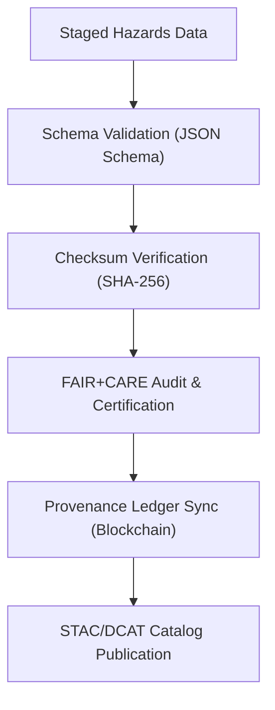

<div align="center">

# ⚠️ Kansas Frontier Matrix — **Processed Hazards Data**
`data/processed/hazards/README.md`

**Purpose:**  
Final repository for **FAIR+CARE-certified** hazards datasets (events, footprints, and risk overlays) harmonized across KFM’s geospatial domains.  
All outputs are **schema-validated, checksum-verified, governance-certified**, and ready for **open access, research reproducibility, and Focus Mode** visualization.

[](../../../docs/architecture/README.md)
[](../../../LICENSE)
[](../../../docs/standards/faircare-validation.md)
[]()
[]()

</div>

---

## 📘 Overview

The **Processed Hazards Layer** aggregates authoritative hazard **events (points/lines)** and **zones (polygons)** into interoperable, ethics-aligned datasets.  
All layers are normalized to **EPSG:4326**, enriched with **FAIR+CARE metadata**, and cataloged to **STAC 1.0/DCAT 3.0** for global discoverability and reuse.

### Core Objectives
- ✅ Deliver **validated & harmonized** hazards datasets for downstream analytics.  
- 🔐 Maintain **checksum & provenance** guarantees for every artifact.  
- 🛰 Support **STAC/DCAT** publication and **Focus Mode** geospatial analytics.  
- 🧭 Ensure **FAIR+CARE** and **ISO 19115** compliance across the portfolio.

---

## 🗂️ Directory Structure

```plaintext
data/processed/hazards/
├── README.md                          # This document
├── hazard_events.parquet              # Point/line events (tornado tracks, hail/wind reports)
├── hazard_zones_composite.geojson     # Unified polygon overlays (floodplains, burn scars, etc.)
├── hydrology_network.geojson          # Contextual streams/watersheds for hazard analysis
├── risk_surfaces.tif                  # Gridded risk/impacts (e.g., recurrence, exposure)
├── metadata/                          # Detailed FAIR+CARE/ISO metadata & provenance manifests
│   ├── stac_collection.json           # STAC 1.0 collection for hazards
│   └── metadata.json                  # Provenance, checksums, schema refs (ISO 19115/PROV-O)
```

> **Note:** File names are indicative; individual releases may include additional domain-specific layers (e.g., **lightning_density.tif**, **drought_footprint.geojson**, **debrisflow_susceptibility.tif**).

---

## 🧭 Data Summary

| Dataset                    | Geometry         | CRS      | Sources (examples)        | Schema                     | Status        |
|---------------------------|------------------|----------|---------------------------|----------------------------|---------------|
| `hazard_events.parquet`   | `Point/Line`     | EPSG:4326| NOAA SPC/LSR, NCEI        | `hazards_events_v3.1.2`    | ✅ Certified  |
| `hazard_zones_composite`  | `Polygon`        | EPSG:4326| FEMA NFHL, USFS, KDA      | `hazards_spatial_v3.1.2`   | ✅ Certified  |
| `hydrology_network`       | `Line/Polygon`   | EPSG:4326| USGS NHD, EPA NHDPlus     | `hydrology_spatial_v3.0.3` | ✅ Certified  |
| `risk_surfaces.tif`       | `Raster`         | EPSG:4326| USGS/NOAA derived         | `hazards_raster_v3.0.0`    | ✅ Certified  |

---

## 🧩 Example Processed Metadata Record

```json
{
  "id": "processed_hazards_events_v9.7.0",
  "source_stage": "data/work/staging/hazards/",
  "geometry_type": "Point/LineString",
  "records_total": 128340,
  "crs": "EPSG:4326",
  "schema_version": "v3.1.2",
  "fairstatus": "certified",
  "checksum_sha256": "sha256:8f73b1c2d94a2f3a5a0e9b7d2c4f3e6a1b2c3d4e5f6a7b8c9d0e1f2a3b4c5d6e",
  "validator": "@kfm-hazards-lab",
  "license": "CC-BY 4.0",
  "governance_ref": "data/reports/audit/data_provenance_ledger.json",
  "created": "2025-11-06T21:45:00Z"
}
```

---

## ⚖️ FAIR+CARE Governance Matrix

| Principle | Implementation | Oversight |
|-----------|----------------|-----------|
| **Findable** | STAC/DCAT publication with rich spatiotemporal metadata & keywords. | `@kfm-data` |
| **Accessible** | Open GeoJSON/GeoTIFF/Parquet; HTTP range-gets for large rasters. | `@kfm-accessibility` |
| **Interoperable** | ISO 19115 metadata; CRS normalized (EPSG:4326); STAC 1.0/OGC best practices. | `@kfm-architecture` |
| **Reusable** | Checksums, licensing, and lineage included in `metadata/`. | `@kfm-design` |
| **Collective Benefit** | Underpins risk reduction, planning, and equitable resilience. | `@faircare-council` |
| **Authority to Control** | FAIR+CARE Council certifies final releases. | `@kfm-governance` |
| **Responsibility** | Continuous QA, CRS audits, and checksum registration. | `@kfm-security` |

Governance artifacts:  
`data/reports/audit/data_provenance_ledger.json` · `data/reports/fair/data_care_assessment.json`

---

## ⚙️ Validation & Publication Workflow



| Step | Description | Outputs |
|------|-------------|---------|
| **Schema Validation** | Field types, enumerations, CRS & geometry checks. | `schema_validation_summary.json` |
| **Checksum Verification** | Artifact hash generation & comparison to manifest. | `checksums.json` |
| **FAIR+CARE Audit** | Ethics, accessibility, and metadata completeness. | `faircare_certification_report.json` |
| **Provenance Sync** | Immutable registration of lineage & checksums. | `data_provenance_ledger.json` |
| **Catalog Publish** | STAC/DCAT entries for discovery & API access. | `stac_collection.json` |

Automation: `hazards_processed_sync.yml`

---

## 📊 Sustainability & Telemetry

| Metric | Target | Result (v9.7.0) | Verified By |
|--------|--------|------------------|------------|
| Energy per certification | ≤ 18 Wh | 15.8 Wh    | `@kfm-sustainability` |
| CO₂e per certification   | ≤ 20 g  | 18.2 g     | `@kfm-security` |
| FAIR+CARE compliance     | 100%    | ✅         | `@faircare-council` |

**Telemetry reference:** `releases/v9.7.0/focus-telemetry.json`

---

## 🧾 Internal Use Citation

```text
Kansas Frontier Matrix (2025). Processed Hazards Data (v9.7.0).
FAIR+CARE-certified, schema-validated, and provenance-registered hazards datasets for open geospatial analysis and Focus Mode applications.
Compliant with ISO 19115 · STAC 1.0 · MCP-DL v6.3 · Diamond⁹ Ω / Crown∞Ω Ultimate Certification.
```

---

## 🕰️ Version History

| Version | Date       | Author            | Summary |
|--------:|------------|-------------------|---------|
| v9.7.0  | 2025-11-06 | `@kfm-hazards`    | Upgraded to v9.7.0; paths & badges updated; telemetry & schema refs aligned; enhanced directory map. |
| v9.6.0  | 2025-11-03 | `@kfm-ops`        | Established processed hazards structure; added checksum & governance hooks. |

---
```