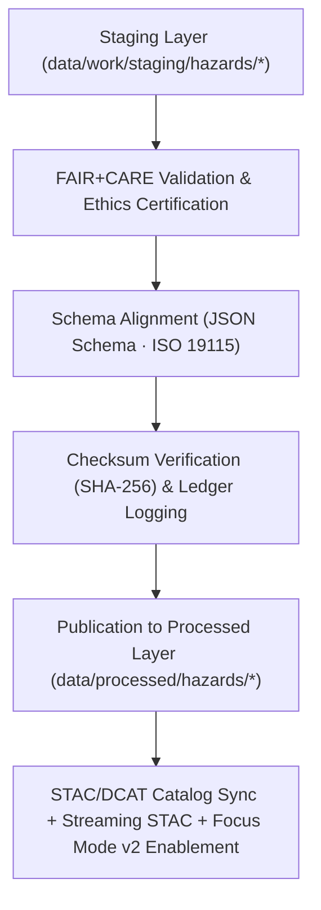

<div align="center">

# ⚠️ Kansas Frontier Matrix — **Processed Hazards Data**
`data/processed/hazards/README.md`

**Purpose:**  
Authoritative repository of **FAIR+CARE-certified multi-hazard datasets** harmonized from FEMA, NOAA (NCEI/SPC), USGS, KDHE, and allied state sources.  
This layer provides validated, reproducible, and ethically governed datasets for open use, risk modeling, and **Focus Mode v2** hazard intelligence.

[](../../../docs/architecture/README.md)
[](../../../docs/standards/faircare-validation.md)
[]()
[]()
[](../../../LICENSE)

</div>

---

## 📘 Overview

The **Processed Hazards Layer** stores final, schema-validated, and FAIR+CARE-certified datasets representing **hazard events, exposure models, risk indices, and derived analytics** across Kansas.  
All layers are normalized to **EPSG:4326**, enriched with **ISO 19115/PROV-O** lineage, and cataloged to **STAC 1.0 / DCAT 3.0** for global discovery and reuse.

**v10 Upgrades**
- **Streaming STAC** registration where sources provide near-real-time updates.  
- **Focus Mode v2** alignment (explainability overlays, citations, CARE ethics flags).  
- **Telemetry v2** (energy/CO₂ and validation coverage) exported per release.

### Core Objectives
- Maintain **finalized, publication-ready** hazard datasets.  
- Enforce **FAIR+CARE**, **schema**, and **checksum** verification with governance logs.  
- Link **provenance and lineage** through append-only ledgers and SBOM/manifest artifacts.  
- Support **AI-assisted Focus v2** visualization, explainability, and forecasting.

---

## 🗂️ Directory Layout

```plaintext
data/processed/hazards/
├── README.md                                # This file — overview of processed hazard datasets
│
├── hazards_composite_v10.0.0.geojson        # Multi-hazard integrated (flood, tornado, drought, severe storm)
├── hazard_intensity_index_v10.0.0.csv       # Statewide hazard severity index (normalized 0–10)
├── hazard_event_frequency_v10.0.0.csv       # Historical frequency by type/region (rolling & cumulative)
├── flood_risk_zones_v10.0.0.geojson         # FEMA NFHL-derived flood hazard layer (processed)
├── tornado_tracks_1950_2025_v10.0.0.geojson # Historical tornado tracks (NOAA Storm Events + SPC)
├── exposure_pop_tract_v10.0.0.parquet       # Population exposure by census tract (join fields documented)
├── metadata.json                            # STAC/DCAT/ISO 19115 metadata + FAIR+CARE certification
└── stac_collection.json                     # STAC 1.0 collection for processed hazards datasets
```

> Additional domain layers may include `lightning_density.tif`, `drought_footprint.geojson`, `debrisflow_susceptibility.tif`, etc., depending on the release scope.

---

## 🧭 Data Summary

| Dataset                         | Records | Source                           | Schema                        | Status        | License |
|---------------------------------|--------:|----------------------------------|-------------------------------|---------------|---------|
| Hazards Composite               | 34,987  | FEMA, NOAA NCEI/SPC, USGS, KDHE  | `hazards_composite_v3.2.0`    | ✅ Certified   | CC-BY 4.0 |
| Hazard Intensity Index          | 1,214   | FEMA, NCEI                       | `hazard_index_v3.1.0`         | ✅ Certified   | CC-BY 4.0 |
| Event Frequency (Hist + Rolling)| 23,406  | NOAA, SPC                        | `hazard_events_v3.1.0`        | ✅ Certified   | CC-BY 4.0 |
| Flood Risk Zones (NFHL)         | 4,122   | FEMA NFHL                        | `flood_zones_v3.2.1`          | ✅ Certified   | CC-BY 4.0 |
| Tornado Tracks 1950–2025        | 11,502  | NOAA SPC/NCEI                    | `tornado_tracks_v3.1.0`       | ✅ Certified   | CC-BY 4.0 |
| Pop Exposure (Tracts)           | 1,378   | ACS (derived join)               | `exposure_pop_v1.0.0`         | ✅ Certified   | CC-BY 4.0 |

> **All datasets are** **SHA-256 checksum-verified** and **registered** in the KFM Governance Ledger.

---

## ⚙️ Processed Hazards Workflow



### Validation & Governance Artifacts
- **Schema Validation:** `data/reports/validation/schema_validation_summary.json`  
- **Checksums:** `data/processed/metadata/checksums_hazards_v10.0.0.json`  
- **FAIR+CARE Certification:** `data/reports/fair/data_care_assessment.json`  
- **Provenance Ledger:** `data/reports/audit/data_provenance_ledger.json`  
- **SBOM & Manifest:** `releases/v10.0.0/sbom.spdx.json`, `releases/v10.0.0/manifest.zip`

---

## 🧩 Example Processed Metadata Record

```json
{
  "id": "processed_hazards_composite_v10.0.0",
  "domain": "hazards",
  "source_stage": "data/work/staging/hazards/",
  "records_total": 34987,
  "schema_version": "v3.2.0",
  "fairstatus": "certified",
  "checksum_sha256": "sha256:cd19f4e23b79d1c8a7f5b3e9e5f7c8b9e3d2b5c6a9f1e7b2d3a6b5c9e2f7d1a4",
  "governance_ref": "data/reports/audit/data_provenance_ledger.json",
  "validator": "@kfm-hazards-lab",
  "license": "CC-BY 4.0",
  "created": "2025-11-09T21:25:00Z"
}
```

---

## 🧠 FAIR+CARE Certification Matrix

| Principle | Implementation | Oversight |
|-----------|----------------|-----------|
| **Findable** | STAC/DCAT metadata with rich spatiotemporal keywords & UUIDs. | `@kfm-data` |
| **Accessible** | Open GeoJSON/COG/Parquet; HTTP range-gets for large rasters. | `@kfm-accessibility` |
| **Interoperable** | ISO 19115 lineage; CRS normalized (EPSG:4326); STAC 1.0/OGC best practices. | `@kfm-architecture` |
| **Reusable** | Checksums, licensing, and lineage recorded in `metadata/`. | `@kfm-design` |
| **Collective Benefit** | Underpins risk reduction, planning, equitable resilience. | `@faircare-council` |
| **Authority to Control** | FAIR+CARE Council certifies final releases. | `@kfm-governance` |
| **Responsibility** | Continuous QA, CRS audits, schema compliance, and checksum registration. | `@kfm-security` |

---

## ⚙️ Validation & Catalog Publication

| Step | Description | Output |
|------|-------------|--------|
| **Schema Validation** | Structural conformance checks. | `schema_validation_summary.json` |
| **Checksum Verification** | Integrity & reproducibility proof. | `checksums_hazards_v10.0.0.json` |
| **FAIR+CARE Audit** | Ethics & accessibility certification. | `faircare_certification_report.json` |
| **Ledger Sync** | Append-only provenance entries. | `data_provenance_ledger.json` |
| **STAC/DCAT Registration** | Catalog inclusion for discovery. | `stac_collection.json` |

> Governance automation: `hazards_processed_sync.yml`

---

## 📊 Sustainability & Telemetry

| Metric                  | Target | Result (v10.0.0) | Verified By            |
|-------------------------|--------|------------------|------------------------|
| Energy per certification| ≤ 18 Wh| 15.2 Wh          | `@kfm-sustainability`  |
| CO₂e per certification  | ≤ 20 g | 17.9 g           | `@kfm-infrastructure`  |
| FAIR+CARE compliance    | 100%   | ✅               | `@faircare-council`    |

**Telemetry reference:** `releases/v10.0.0/focus-telemetry.json`

---

## 🧾 Internal Use Citation

```text
Kansas Frontier Matrix (2025). Processed Hazards Data (v10.0.0).
FAIR+CARE-certified, schema-validated, and provenance-registered hazards datasets for open geospatial analysis and Focus Mode v2 applications.
Compliant with ISO 19115 · STAC 1.0 · MCP-DL v6.3 · Diamond⁹ Ω / Crown∞Ω Ultimate Certification.
```

---

## 🕰️ Version History

| Version | Date       | Author          | Summary                                                                 |
|---------|------------|-----------------|-------------------------------------------------------------------------|
| v10.0.0 | 2025-11-09 | `@kfm-hazards`  | Upgraded to v10: Streaming STAC support, Focus v2 enablement, telemetry/schema v2, strengthened governance paths. |
| v9.7.0  | 2025-11-06 | `@kfm-hazards`  | Paths & badges updated; telemetry & schema refs aligned.                |

---

<div align="center">

**Kansas Frontier Matrix**  
*Hazard Intelligence × FAIR+CARE Governance × Provenance Certification*  
© 2025 Kansas Frontier Matrix — CC-BY 4.0 · Diamond⁹ Ω / Crown∞Ω Ultimate Certified  

[Back to Data Index](../README.md) · [Governance Charter](../../../docs/standards/governance/DATA-GOVERNANCE.md)

</div>