<div align="center">

# 🏔️ Kansas-Frontier-Matrix — Processed Terrain Data  
`data/processed/terrain/`

**Mission:** Provide reproducible, validated **terrain foundation layers** —  
filled DEMs, elevation composites, and derived surfaces — forming the geospatial base  
for hydrology, slope/aspect, and frontier landscape reconstruction.

[](../../../.github/workflows/site.yml)
[](../../../.github/workflows/stac-validate.yml)
[](../../../.github/workflows/codeql.yml)
[](../../../.github/workflows/trivy.yml)
[](../../../.github/workflows/pre-commit.yml)
[](../../../docs/)
[](../../../LICENSE)
[](../../../LICENSE)

</div>

---

## 📚 Table of Contents
- [Overview](#overview)
- [Directory Layout](#directory-layout)
- [System Flow (Mermaid)](#system-flow-mermaid)
- [Core Terrain Datasets](#core-terrain-datasets)
- [STAC Metadata](#stac-metadata)
- [Processing Workflow](#processing-workflow)
- [Reproducibility & Validation](#reproducibility--validation)
- [Contributing New Terrain Data](#contributing-new-terrain-data)
- [AI & Metadata Integration](#ai--metadata-integration)
- [References](#references)
- [Changelog](#changelog)

---

## 🗺️ Overview

This directory contains **standardized, hydrologically conditioned terrain datasets**  
serving as the **digital foundation** of Kansas Frontier Matrix (KFM).  

Every raster has been processed through validated ETL pipelines ensuring:
- Consistent CRS (EPSG:4326)
- Hydrologic conditioning & sink filling
- Compression & COG optimization
- STAC-linked metadata & SHA-256 checksums

Outputs here feed **derivative modules**: slope, aspect, flow direction, watershed delineation, and historical terrain reconstruction.

---

## 🧱 Directory Layout

```bash
data/
└── processed/
    └── terrain/
        ├── dem_1m_ks_filled.tif          # Hydrologically corrected 1 m DEM
        ├── dem_10m_hist_ks.tif           # Historical 10 m DEM (1950s–1970s topo reconstruction)
        ├── dem_30m_ned_ks.tif            # USGS NED statewide baseline
        ├── contours_10m_ks.geojson       # Vectorized 10 m contour dataset
        ├── hillshade_preview_ks.tif      # Shaded relief for QA/QC
        ├── metadata/
        │   ├── dem_1m_ks_filled.json
        │   ├── dem_10m_hist_ks.json
        │   └── contours_10m_ks.json
        ├── checksums/
        │   ├── dem_1m_ks_filled.tif.sha256
        │   ├── dem_10m_hist_ks.tif.sha256
        │   └── contours_10m_ks.geojson.sha256
        └── README.md
````

---

## 🧭 System Flow (Mermaid)

```mermaid
flowchart TD
  A["Raw Elevation Inputs\n(LiDAR · NED · Historical Maps)"] --> B["ETL Processing\n(GDAL · PDAL · WhiteboxTools)"]
  B --> C["Filled & Cleaned DEMs\n(data/processed/terrain)"]
  C --> D["STAC Metadata\n(data/stac/items/*.json)"]
  C --> E["Checksums & QA\n(SHA256 · hillshade preview)"]
  D --> F["Hydrology Derivatives\n(data/derivatives/hydrology)"]
  D --> G["Slope & Aspect Models\n(data/derivatives/terrain)"]
  G --> H["Web Visualization\n(MapLibre · QGIS · Timeline)"]
  %% END OF MERMAID

```



---

## 🏞️ Core Terrain Datasets

| Product                 | File                       | Description                                          | Source              | Units    | Format        |
| ----------------------- | -------------------------- | ---------------------------------------------------- | ------------------- | -------- | ------------- |
| **Filled DEM (1 m)**    | `dem_1m_ks_filled.tif`     | LiDAR-based 1 m DEM, hydrologically conditioned      | KS DASC / USGS 3DEP | meters   | GeoTIFF (COG) |
| **Historic DEM (10 m)** | `dem_10m_hist_ks.tif`      | Reconstructed DEM from mid-century topographic maps  | USGS DRG / DASC     | meters   | GeoTIFF (COG) |
| **NED DEM (30 m)**      | `dem_30m_ned_ks.tif`       | Statewide 30 m NED elevation reference               | USGS NED            | meters   | GeoTIFF (COG) |
| **Contours (10 m)**     | `contours_10m_ks.geojson`  | Derived vector contours from filled DEMs             | Derived             | meters   | GeoJSON       |
| **Hillshade Preview**   | `hillshade_preview_ks.tif` | Rendered hillshade for QA/QC and validation overlays | Derived             | DN 0–255 | GeoTIFF (COG) |

---

## 🧩 STAC Metadata

Each dataset is registered as a **STAC Item** ensuring open interoperability and traceable provenance.

Example:

```json
{
  "type": "Feature",
  "stac_version": "1.0.0",
  "id": "dem_1m_ks_filled",
  "properties": {
    "title": "Filled DEM (1 m) – Kansas LiDAR",
    "datetime": "2020-01-01T00:00:00Z",
    "description": "Hydrologically conditioned 1 m DEM generated from 2018–2020 LiDAR.",
    "processing:software": "WhiteboxTools 2.2.0 + GDAL 3.8.0",
    "mcp:provenance": "sha256:52a9e4…",
    "derived_from": ["data/raw/dem_1m_ks.tif"],
    "license": "CC-BY 4.0",
    "platform": "USGS 3DEP"
  },
  "assets": {
    "data": {
      "href": "./dem_1m_ks_filled.tif",
      "type": "image/tiff; application=geotiff; profile=cloud-optimized",
      "roles": ["data"]
    }
  }
}
```

---

## ⚙️ Processing Workflow

Terrain data are built reproducibly via `Makefile` and `tools/terrain/` modules.

```bash
# 1. Fill sinks and remove voids
whitebox_tools --run=FillDepressions -i dem_1m_ks.tif -o dem_1m_ks_filled.tif

# 2. Generate hillshade preview
gdaldem hillshade dem_1m_ks_filled.tif hillshade_preview_ks.tif -az 315 -alt 45 -z 1.0

# 3. Vectorize contours (10 m)
gdal_contour -i 10 dem_1m_ks_filled.tif contours_10m_ks.geojson -a elev

# 4. Convert to COG
rio cogeo create dem_1m_ks_filled.tif dem_1m_ks_filled_cog.tif --overview-level=5
```

Outputs are standardized to **EPSG:4326 (WGS 84)** and compressed using **Deflate/LZW**.
Containerized builds ensure identical environments across contributors.

---

## 🔁 Reproducibility & Validation

| Check                | Tool / Location                          | Purpose                             |
| -------------------- | ---------------------------------------- | ----------------------------------- |
| **Checksums**        | `checksums/*.sha256`                     | Bit-level integrity                 |
| **STAC Validation**  | GitHub Actions (stac-validate.yml)       | Schema & field validation           |
| **QA Visualization** | Hillshade & contours in QGIS/MapLibre    | Visual quality assurance            |
| **Makefile Targets** | `make terrain` / `make validate-terrain` | Automated build & check             |
| **Containerization** | `docker-compose terrain`                 | Isolated, reproducible environments |

---

## 🧠 Contributing New Terrain Data

1. **Add Source:** Place new DEM/LiDAR raster in `data/raw/` or `data/cogs/`.
2. **Process:** Run your ETL or Python script to clean/fill/resample.
3. **Save Output:** GeoTIFF (COG) or GeoJSON in this directory.
4. **Document:**

   * Add `.sha256` checksum → `checksums/`
   * Add STAC JSON → `metadata/`
   * Create `DERIVATION.md` → include parameters, tools, versions.
5. **Validate:**

   ```bash
   make validate-terrain
   ```
6. **Submit PR:** Include input citation, workflow, preview assets.

---

## 🤖 AI & Metadata Integration

* **Entity Extraction:** Terrain STAC items are parsed by the KFM NLP pipeline to enrich the Knowledge Graph (`src/graph/terrain_nodes.py`).
* **Automated Provenance Linking:** AI tags each terrain layer with derivative relationships (e.g., slope → flow → hydrology).
* **Confidence Scoring:** Each auto-linked relationship stores a `confidence` field (0–1).
* **Override/Correction:** Human reviewers may correct links in the admin UI (`web/admin/entities`).

> 🧩 *AI integrations remain transparent and reversible — all inferred metadata is stored separately and versioned under `data/processed/terrain/ai_metadata/`.*

---

## 📖 References

* **USGS 3DEP:** [usgs.gov/3dep](https://www.usgs.gov/3dep)
* **GDAL DEM Tools:** [gdal.org/programs/gdaldem.html](https://gdal.org/programs/gdaldem.html)
* **WhiteboxTools:** [whiteboxgeo.com/manual](https://www.whiteboxgeo.com/manual/)
* **PDAL (LiDAR):** [pdal.io](https://pdal.io/)
* **STAC Spec 1.0:** [stacspec.org](https://stacspec.org)
* **MCP Standards:** [`docs/standards/`](../../../docs/standards/)
* **Kansas DASC GIS Hub:** [hub.kansasgis.org](https://hub.kansasgis.org)

---

## 🧾 Changelog

| Date       | Version    | Change                                                                                                                  |
| ---------- | ---------- | ----------------------------------------------------------------------------------------------------------------------- |
| 2025-10-11 | **v2.2.0** | Upgraded for MCP 2.0 compliance; added Mermaid system diagram, AI metadata integration, and enhanced provenance blocks. |
| 2025-08-30 | v2.1.0     | Added container validation workflow, Makefile hooks, and accessibility improvements.                                    |
| 2025-07-01 | v2.0.0     | Major schema alignment; introduced standardized STAC item template.                                                     |
| 2025-06-15 | v1.6.3     | Added checksum sub-directory and hillshade preview QA.                                                                  |

---

<div align="center">

*“The foundation of Kansas history lies in its contours —
from the Flint Hills to the river valleys,
every elevation tells a story of the frontier.”*

</div>
```
