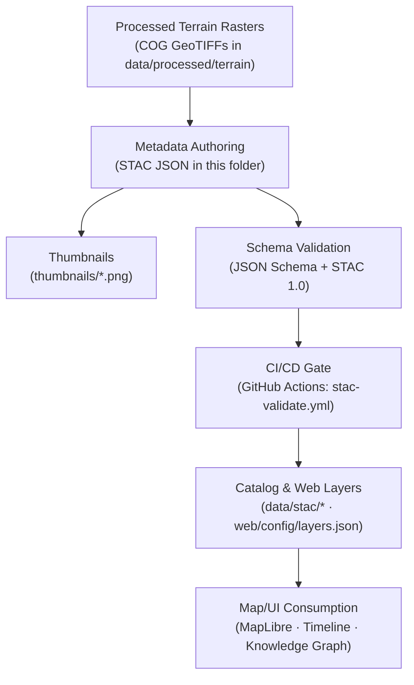

<div align="center">

# 🏔️ Kansas Frontier Matrix — Terrain Metadata  
`data/processed/terrain/metadata/`

**Mission:** Curate and document all **processed terrain and elevation datasets**  
that define Kansas’s physical landscape — forming the spatial foundation for hydrology, landcover,  
and historical geography within the Kansas Frontier Matrix (KFM) system.

[](../../../../.github/workflows/site.yml)
[](../../../../.github/workflows/stac-validate.yml)
[](../../../../.github/workflows/codeql.yml)
[](../../../../.github/workflows/trivy.yml)
[](../../../../docs/)
[](../../../../LICENSE)

</div>

---

## 📚 Overview

This directory contains **STAC-compliant metadata** for processed terrain layers in KFM.  
These records describe **elevation, topography, and geomorphology** captured from modern LiDAR and historical topo sources.

Each metadata file documents:

- **Provenance** (source, processing date, version, license)  
- **Lineage / transformations** (ETL history, parameters)  
- **STAC 1.0** structure for spatial-temporal cataloging  
- **Validation schemas** (see `data/processed/metadata/schema/`)  
- **Thumbnails** for catalog and map previews  

---

## 🗂️ Directory Layout

```bash
data/processed/terrain/metadata/
├── README.md
├── ks_1m_dem_2018_2020.json
├── ks_hillshade_2018_2020.json
├── slope_aspect_2018_2020.json
└── thumbnails/
    ├── ks_1m_dem_2018_2020.png
    ├── ks_hillshade_2018_2020.png
    └── slope_aspect_2018_2020.png
````

> **Note:** Each `.json` is a **STAC Item** describing a dataset in
> `data/processed/terrain/` and linking to its checksum under
> `data/processed/checksums/terrain/`.

---

## 🧭 System Flow (Mermaid)



---

## 🌍 Terrain Datasets (Processed Assets)

| Dataset                      | Source              | Format        | Resolution | Temporal Range | Output                                              |
| :--------------------------- | :------------------ | :------------ | :--------- | :------------- | :-------------------------------------------------- |
| **DEM (1 m LiDAR)**          | USGS 3DEP / KS DASC | GeoTIFF (COG) | 1 m        | 2018–2020      | `data/processed/terrain/ks_1m_dem_2018_2020.tif`    |
| **Hillshade (Derived)**      | Derived from DEM    | GeoTIFF (COG) | 1 m        | 2018–2020      | `data/processed/terrain/ks_hillshade_2018_2020.tif` |
| **Slope & Aspect (Derived)** | Derived from DEM    | GeoTIFF (COG) | 1 m        | 2018–2020      | `data/processed/terrain/slope_aspect_2018_2020.tif` |

All datasets use **EPSG:4326 (WGS 84)** and are referenced under `data/stac/terrain/`.

---

## 💾 Example STAC Item (GitHub-safe minimal)

```json
{
  "stac_version": "1.0.0",
  "type": "Feature",
  "id": "ks_hillshade_2018_2020",
  "collection": "kfm_terrain",
  "bbox": [-102.05, 36.99, -94.59, 40.00],
  "geometry": {
    "type": "Polygon",
    "coordinates": [[
      [-102.05, 36.99], [-94.59, 36.99],
      [-94.59, 40.00], [-102.05, 40.00],
      [-102.05, 36.99]
    ]]
  },
  "properties": {
    "title": "Kansas Hillshade (1 m LiDAR, 2018–2020)",
    "description": "Derived hillshade generated from 1 m LiDAR DEM tiles across Kansas.",
    "datetime": "2020-01-01T00:00:00Z",
    "proj:epsg": 4326,
    "processing:software": "GDAL 3.8.0; WhiteboxTools 2.2.0",
    "kfm:mcp_provenance": "sha256:<PUT_FILE_HASH_HERE>",
    "kfm:derived_from": ["data/processed/terrain/ks_1m_dem_2018_2020.tif"],
    "license": "CC-BY-4.0"
  },
  "assets": {
    "data": {
      "href": "../terrain/ks_hillshade_2018_2020.tif",
      "type": "image/tiff; application=geotiff; profile=cloud-optimized",
      "roles": ["data"]
    },
    "thumbnail": {
      "href": "thumbnails/ks_hillshade_2018_2020.png",
      "type": "image/png",
      "roles": ["thumbnail"]
    },
    "checksum:sha256": {
      "href": "../../checklists/../checksums/terrain/ks_hillshade_2018_2020.tif.sha256",
      "type": "text/plain",
      "roles": ["metadata"]
    }
  },
  "links": [
    {"rel": "collection", "href": "../../../stac/collections/kfm_terrain.json", "type": "application/json"},
    {"rel": "parent", "href": ".", "type": "text/html"},
    {"rel": "self", "href": "ks_hillshade_2018_2020.json", "type": "application/json"}
  ]
}
```

> **Tip:** Ensure every item has **`id`**, **`bbox`**, **`geometry`** (or `null` if appropriate), **`properties.datetime`**, at least one **`assets.data`**, and correct **`links.rel`**. Collections live under `data/stac/collections/`.

---

## 🧩 Semantic & Ontological Alignment

| Entity          | Ontology Mapping                                          | Example                       |
| :-------------- | :-------------------------------------------------------- | :---------------------------- |
| DEM Raster      | CIDOC `E73_Information_Object`, `E25_Man-Made_Feature`    | LiDAR-derived elevation grid  |
| Hillshade       | CIDOC `E73_Information_Object`, `E29_Design_or_Procedure` | Derived shaded-relief raster  |
| Slope & Aspect  | CIDOC `E16_Measurement` + **OWL-Time** interval           | Gradient/directional products |
| Metadata Record | CIDOC `E31_Document` + `E73_Information_Object`           | STAC item for 1 m DEM         |

These mappings align terrain with KFM’s **Knowledge Graph** for cross-domain reasoning.

---

## ⚙️ ETL & Processing Workflow

**Makefile target:**

```bash
make terrain
```

**Pipeline entrypoint:**

```bash
python src/pipelines/terrain/terrain_pipeline.py
```

**Steps:**

1. Fetch LiDAR/DEM tiles (USGS 3DEP / KS DASC).
2. Reproject → **EPSG:4326**.
3. Derive **hillshade / slope / aspect**.
4. Export **COG** (overviews, compression).
5. Compute **`.sha256`** checksums.
6. Generate **STAC** items + thumbnails.
7. Validate JSON Schema + **STAC 1.0** in CI.

---

## 🧮 Provenance & Validation

* **Checksums:** `data/processed/checksums/terrain/`
* **Licensing:** Public domain sources / **CC-BY 4.0** for curated outputs
* **Validation:** JSON Schema + `stac-validate.yml` (CI)
* **Source manifests:** `data/sources/terrain/*.json`

---

## 🔗 Integration Points

| Component                           | Role                                               |
| :---------------------------------- | :------------------------------------------------- |
| `data/stac/terrain/`                | STAC Items/Collections for terrain layers          |
| `data/processed/checksums/terrain/` | Integrity tracking (SHA-256)                       |
| `web/config/layers.json`            | Elevation & hillshade layer configuration          |
| `src/graph/terrain_nodes.py`        | Graph ingestion + ontology linkage                 |
| `docs/architecture.md`              | End-to-end data architecture & workflow references |

---

## 🤖 AI & Metadata Notes

* **Entity Extraction:** Items are parsed to attach **place/time** entities and **derivation chains**.
* **Confidence Fields:** Auto-links store `confidence` (0–1) and are **human-reviewable** in admin UI.
* **Non-destructive:** AI inferences live under `data/processed/terrain/ai_metadata/` and can be reverted.

---

## ✅ MCP Compliance Summary

| Principle           | Implementation                                             |
| :------------------ | :--------------------------------------------------------- |
| Documentation-first | README + per-dataset STAC items                            |
| Reproducibility     | Makefile + containerized builds + deterministic transforms |
| Open Standards      | STAC 1.0, COG, JSON Schema, WGS 84                         |
| Provenance          | Source URLs, license, checksums, timestamps                |
| Auditability        | CI validation; links to manifests & collections            |

---

## 🧾 Version History

|  Version  | Date       | Summary                                                                                                              |
| :-------: | :--------- | :------------------------------------------------------------------------------------------------------------------- |
| **1.1.0** | 2025-10-11 | Upgraded README: fixed badge paths for deeper folder, added rendering-safe Mermaid, stronger STAC example, MCP table |
|   1.0.0   | 2025-10-04 | Initial release of terrain metadata (DEM, hillshade, slope/aspect items + thumbnails)                                |

---

<div align="center">

**Kansas Frontier Matrix** — *“Mapping the Foundation: Elevation, Form, and Flow.”*
📍 [`data/processed/terrain/metadata/`](.)

</div>
```
