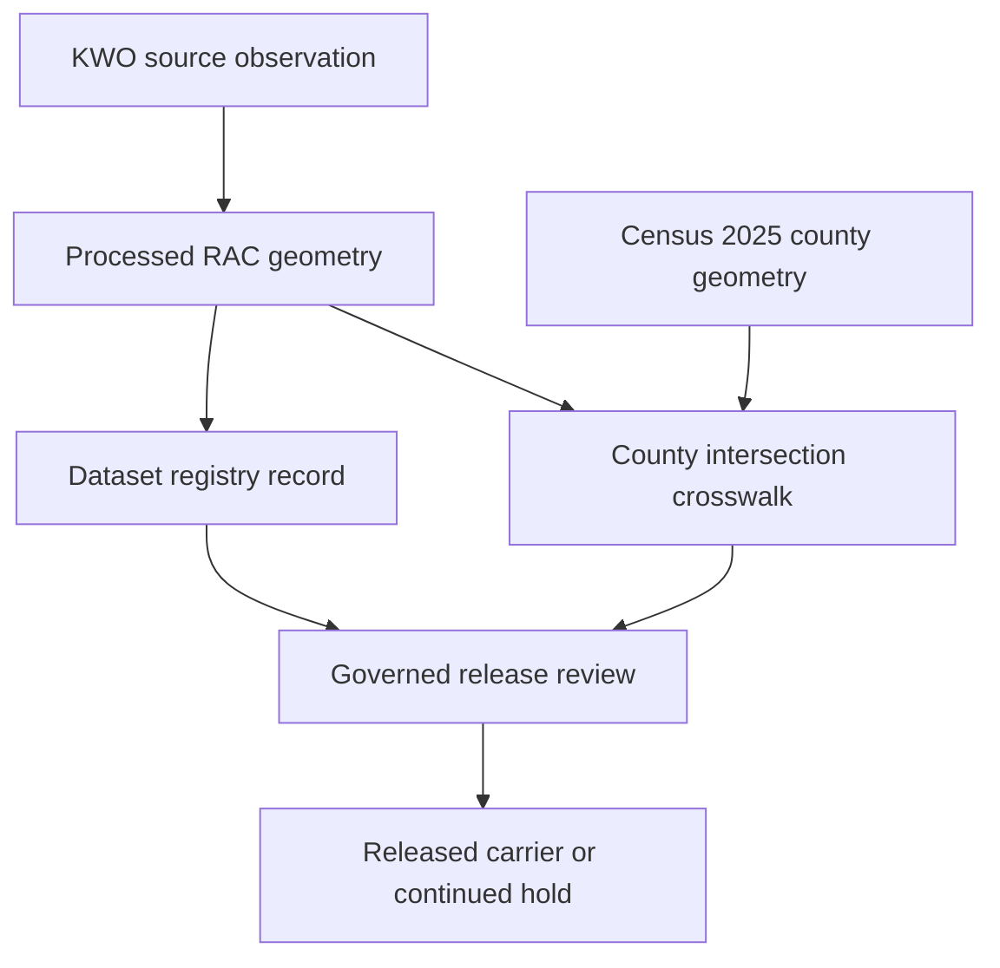

<a id="top"></a>

# Water-planning processed data

[](#lifecycle-and-authority-boundary)
[](#status)
[](#validation)
[](#evidence-and-claim-boundaries)

> **Purpose.** `data/processed/water_planning/` owns normalized, versioned water-planning products that have reached the KFM `PROCESSED` lane; it does not grant source admission, rights clearance, release approval, publication, or direct public-serving authority.

> [!IMPORTANT]
> The checked-in RAC geometry and derived county crosswalk are internal, `not-released` records. The crosswalk measures polygon overlap; it is not an official county-membership, governance, funding, or jurisdiction list.

## Quick navigation

- [Purpose and placement](#purpose-and-placement)
- [Status](#status)
- [What belongs here](#what-belongs-here)
- [What does not belong here](#what-does-not-belong-here)
- [Current verified inventory](#current-verified-inventory)
- [Lifecycle and authority boundary](#lifecycle-and-authority-boundary)
- [Inputs and outputs](#inputs-and-outputs)
- [Evidence and claim boundaries](#evidence-and-claim-boundaries)
- [Validation](#validation)
- [Rights, sensitivity, and release](#rights-sensitivity-and-release)
- [Correction and rollback](#correction-and-rollback)
- [Maintenance and open verification](#maintenance-and-open-verification)
- [Related authority](#related-authority)

## Purpose and placement

This directory is the water-planning scope lane under the canonical [`data/processed/`](../README.md) lifecycle boundary. It currently documents and contains the normalized Kansas Water Office Regional Advisory Committee (RAC) planning-area geometry family.

The placement outcome is `PLACE`:

| Responsibility axis | Current result |
|---|---|
| Owning root | `data/` |
| Lifecycle stage | `PROCESSED` |
| Scope lane | `water_planning` |
| README profile | `BOUNDARY_COMPACT` |
| Current verified product family | [`rac_regions/`](./rac_regions/README.md) |
| Physical storage | Versioned repository bytes |
| Public exposure | Denied until a separate governed release authorizes a public-safe carrier |
| Review routing | [`.github/CODEOWNERS`](../../../.github/CODEOWNERS) routes repository review to `@bartytime4life`; routing is not approval |
| Local steward | **NEEDS VERIFICATION** |

This path follows the accepted [Directory Rules](../../../docs/doctrine/directory-rules.md), including `DIR-DATA-003`, `DIR-DATA-004`, `DIR-SCOPELANE-001`, `DIR-SCOPELANE-003`, and `DIR-README-001` through `DIR-README-005`. [ADR-0029](../../../docs/adr/ADR-0029-adopt-directory-governance-standard-v2.md) records adoption of that standard.

## Status

| Surface | Repository-grounded status |
|---|---|
| Directory README | Same-path replacement of the prior one-newline placeholder |
| RAC dataset record | `record_status: current` for the observed KWO source version |
| RAC geometry release | `release_status: not-released` |
| RAC geometry correction | `correction_status: current`; no predecessor declared |
| Source descriptors | `proposed`, `needs_review`, `not_released`, connector activation `disabled` |
| Rights | Source statements recorded; independent review pending |
| Sensitivity | Registry classifies the payload as a public administrative boundary |
| Public/API/UI serving | Not authorized by this lane |
| Evidence review | Repository paths, contracts, records, validator, tests, workflow, Directory Rules, and ADR-0029 inspected at `main@101fa24730bc12f451d978b3cbeb6194e39a462a` on 2026-07-30 |

`record_status: current` means the current internal registry pointer for one observed source version. It does not mean the upstream source is continuously fresh, the source descriptors are admitted, rights review is complete, or the payload is released.

## What belongs here

- normalized, versioned water-planning data products at the `PROCESSED` lifecycle stage;
- deterministic payload versions with stable identity, byte count, media type, coordinate reference system, and digest bindings;
- product-local documentation and derivation metadata that explain the processed boundary;
- correction and supersession references needed to preserve prior versions and rollback targets;
- inputs that are ready for separately governed catalog, proof, and release-candidate work.

## What does not belong here

| Artifact or action | Owning surface or required disposition |
|---|---|
| Source descriptors, dataset identities, and crosswalk identities | [`data/registry/`](../../registry/README.md) |
| RAW captures or mutable normalization work | [`data/raw/`](../../raw/README.md) or [`data/work/`](../../work/README.md) |
| Held material or unresolved sensitive content | [`data/quarantine/`](../../quarantine/README.md) |
| Semantic meaning | [`contracts/domains/water_planning/`](../../../contracts/domains/water_planning/README.md) |
| Machine-readable shape | [`schemas/contracts/v1/domains/water_planning/`](../../../schemas/contracts/v1/domains/water_planning/README.md) |
| Policy or release decisions | `policy/` and `release/` |
| Released public-safe carriers | [`data/published/`](../../published/README.md) |
| Direct API, UI, MapLibre, search, graph, export, or AI serving | Governed downstream interfaces and released artifacts |
| A binary county-membership claim inferred from overlap | A separately defined, evidenced, and reviewed decision rule |

## Current verified inventory

### Processed payload

| Product | Stable identity and version | Pinned payload |
|---|---|---|
| [KWO RAC region geometry](./rac_regions/README.md) | `kfm:dataset-version:water-planning:kwo-rac-regions:2026-06-24` | 14 features; `OGC:CRS84`; 9,995,739 bytes; SHA-256 `545b18b1b49a68c6359fefb80f8e8b80f885a94381dc87e0ef942eb8829cb738` |

The GeoJSON preserves source coordinates without simplification and projects only the stable KFM RAC identity, source feature ID, name, and abbreviation into feature properties. The governing [dataset registry record](../../registry/datasets/water_planning/kwo_rac_regions_2026-06-24.json) binds the path, byte count, feature count, source observation, digest, rights posture, sensitivity posture, correction state, and release hold.

### Related registry records

| Record | Verified scope | Authority limit |
|---|---|---|
| [RAC dataset record](../../registry/datasets/water_planning/kwo_rac_regions_2026-06-24.json) | One digest-pinned KWO RAC geometry version with 14 ordered region IDs | Registry state is not release or publication |
| [RAC/county crosswalk](../../registry/crosswalks/water_planning/kwo_rac_counties_2026-06-24__tiger2025.json) | 209 retained positive-area intersections across 105 Kansas counties and 14 RAC regions | Geometry derivative, not an official membership list |
| [KWO source descriptor](../../registry/sources/water_planning/kwo_rac_feature_service.source.json) | KWO ArcGIS item `cd87ef7a0bb34cc4a7f57e662d73ec0f`, layer `0`, observed after its 2026-06-24 modification | `needs_review`; connector disabled; public release denied |
| [Census source descriptor](../../registry/sources/water_planning/census_tigerweb_counties_2025.source.json) | Census TIGERweb Counties, January 1, 2025 vintage, used for spatial intersection | `needs_review`; connector disabled; public release denied |

The crosswalk contains 50 `dominant`, 122 `material-partial`, and 37 `boundary-sliver` rows. Five smaller intersections were excluded by the declared minimum-area and minimum-share rules. These classes describe measured geometry only.

## Lifecycle and authority boundary



The diagram shows responsibility flow, not an automatic pipeline. The current repository records stop before release: both the geometry dataset and crosswalk remain `not-released`.

The following states stay distinct:

- source observation is not source activation;
- source metadata is not rights clearance;
- a processed payload is not a catalog, proof, or release decision;
- a dataset registry record is not the geometry payload;
- a county crosswalk is not region geometry or county governance membership;
- a validator pass is not proof, policy approval, release, deployment, or publication;
- a commit, pull request, or merge is not a KFM promotion event.

## Inputs and outputs

### Inputs

- the digest-pinned Kansas Water Office Regional Planning Areas Feature Service observation;
- the stable 14-region KFM identity inventory and authority references;
- the contract and schema versions that constrain the processed dataset and related records;
- for the derived crosswalk only, the digest-pinned Census TIGERweb 2025 county geometry observation;
- explicit rights, sensitivity, release, and correction metadata.

### Outputs

- the normalized, unsimplified RAC GeoJSON payload under [`rac_regions/`](./rac_regions/README.md);
- a subtype-first [dataset registry record](../../registry/datasets/water_planning/README.md);
- a subtype-first [county-crosswalk registry record](../../registry/crosswalks/water_planning/README.md);
- deterministic validation findings or the bounded success result documented below.

Source refresh, recurring connector execution, spatial re-derivation, proof construction, catalog projection, and release are separate operations. The checked-in validator does not perform them.

## Evidence and claim boundaries

The processed geometry is source-grounded to the Kansas Water Office planning-area feature service. The county crosswalk is a KFM-derived polygon-intersection product using Census county geometry; it does not claim that KWO publishes a county list.

The crosswalk derivation records:

| Rule | Pinned value |
|---|---:|
| Area calculation CRS | `EPSG:5070` |
| Geometry engine | `shapely-2.1.1` |
| Projection engine | `pyproj-3.7.1` |
| Minimum intersection area | 10,000 m² |
| Minimum county-area share | `0.000001` |
| Material-partial threshold | `0.001` |
| Dominant threshold | `0.999` |
| Line or point touches | Excluded |
| Mapping digest | `2f1c713d996cca97bc6cc3b553e25e2045d986399b6232378d69f9b903f08c74` |

Consumers must preserve the three overlap classes and define any later materiality or membership rule explicitly. In particular, a `boundary-sliver` must not be silently converted into a political, administrative, advisory, funding, or governance relationship.

## Validation

Run from the repository root:

```bash
python tools/validators/domains/water_planning/validate_rac_registry.py
```

Expected success output:

```text
RAC_REGISTRY_OK regions=14 counties=105 mappings=209
```

Run the focused no-network regression tests:

```bash
python -m unittest discover \
  --start-directory tests/domains/water_planning \
  --pattern 'test_rac_registry.py' \
  --verbose
```

The [validator](../../../tools/validators/domains/water_planning/validate_rac_registry.py) and [tests](../../../tests/domains/water_planning/test_rac_registry.py) check:

- exact dataset, source, geometry, and crosswalk reference agreement;
- the ordered 14-region identity set and complete 105-county GEOID set;
- geometry byte count and digest;
- mapping count, order, digest, uniqueness, area shares, and overlap classes;
- source version, rights, connector, release, and correction constraints;
- stable nonzero findings for malformed or drifted records;
- no-network execution.

The [`briefing-integration`](../../../.github/workflows/briefing-integration.yml) workflow runs the water-planning domain test suite and canonical RAC registry validator with `contents: read`. Its path filter covers the `rac_regions/` payload family and related registry, contract, schema, fixture, validator, and test lanes. A change only to this parent README does not itself match that workflow's current path filter.

Passing checks prove only the declared repository-local constraints. They do not refetch either source, recompute the spatial intersections, establish upstream freshness, complete rights review, construct an EvidenceBundle, or authorize release.

## Rights, sensitivity, and release

- The dataset record preserves the KWO source statement but marks independent rights review pending.
- Both SourceDescriptors use `rights_status: noassertion`, require attribution, and deny public release until review.
- The dataset record classifies the RAC boundaries as `public-administrative-boundary`; that classification does not bypass rights, evidence, policy, review, or release gates.
- No credentials, private portal content, applicant data, recipient transformation, or restricted payload belongs in this lane.
- Public clients must consume only governed interfaces and release-approved public-safe carriers, never this internal processed path directly.

## Correction and rollback

A source refresh or correction must:

1. preserve the prior version and digest;
2. create or identify a successor version;
3. record forward and backward correction or supersession lineage;
4. update the payload, registry metadata, byte count, digest, and dependent crosswalk together when affected;
5. rerun deterministic validation and focused regression tests; and
6. obtain a separate review for any downstream release.

For this README-only change, rollback is a focused Git revert of the documentation commit or closure of the unmerged pull request. No processed payload, registry record, source descriptor, contract, schema, validator, workflow, release, or public state is changed by this document.

## Maintenance and open verification

Update this README in the same review boundary when the direct product families, writers, consumers, source version, payload identity, derivation rules, validation entrypoints, correction posture, or public exposure change.

| Item | Status | Evidence needed |
|---|---|---|
| Registered domain entry and local steward | **NEEDS VERIFICATION** | Current domain registry and approved responsibility assignment |
| Independent rights review | **PENDING** | Review record covering both source families and intended uses |
| Repeatable source-refresh and spatial-derivation operation | **NEEDS VERIFICATION** | Versioned code/spec, deterministic inputs, receipts, and regression evidence |
| EvidenceBundle and proof closure | **NEEDS VERIFICATION** | Resolvable evidence/proof objects with review state; no binding was found in the inspected dataset or crosswalk records |
| Catalog/triplet projection | **NEEDS VERIFICATION** | Governed projection records and identity agreement; no binding was found in the inspected dataset or crosswalk records |
| Release/public-serving state | **NOT RELEASED** | Release decision, manifest, public-safe carrier, correction path, and rollback target |

Unknowns narrow use and block higher-risk transitions; they do not invite plausible defaults.

## Related authority

| Surface | Role |
|---|---|
| [`data/processed/`](../README.md) | Parent lifecycle contract |
| [`rac_regions/`](./rac_regions/README.md) | Processed geometry product family |
| [RAC geometry and crosswalk contract](../../../contracts/domains/water_planning/rac_geometry_registry.md) | Semantic and derivation rules |
| [PlanningRegion contract](../../../contracts/domains/water_planning/planning_region.md) | Stable RAC identity and geometry-reference rules |
| [Water-planning schemas](../../../schemas/contracts/v1/domains/water_planning/README.md) | Machine-readable record shapes |
| [Water-planning validators](../../../tools/validators/domains/water_planning/README.md) | Deterministic no-network validation interface |
| [RAC registry regression tests](../../../tests/domains/water_planning/test_rac_registry.py) | Positive and fail-closed behavior evidence |
| [KWO source catalog](../../../docs/sources/catalog/kansas/kwo.md) | Human source-family guidance |
| [Dataset registry](../../registry/datasets/water_planning/README.md) | Dataset identity and state records |
| [Crosswalk registry](../../registry/crosswalks/water_planning/README.md) | Derived mapping identity and state records |
| [Source registry](../../registry/sources/water_planning/README.md) | SourceDescriptor candidates and activation posture |
| [Directory Rules](../../../docs/doctrine/directory-rules.md) | Placement and README authority |
| [ADR-0029](../../../docs/adr/ADR-0029-adopt-directory-governance-standard-v2.md) | Directory Rules adoption record |

[Back to top](#top)
