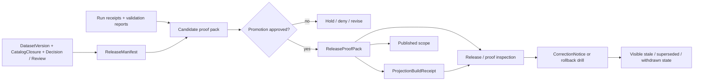

<!-- [KFM_META_BLOCK_V2]
doc_id: kfm://doc/<uuid>
title: proofs
type: standard
version: v1
status: draft
owners: @bartytime4life
created: YYYY-MM-DD
updated: YYYY-MM-DD
policy_label: NEEDS VERIFICATION
related: [data/README.md, data/receipts/README.md, data/catalog/README.md, data/published/README.md, data/specs/README.md, contracts/README.md, policy/README.md, tests/README.md, .github/README.md, .github/actions/README.md, .github/workflows/README.md, .github/PULL_REQUEST_TEMPLATE.md]
tags: [kfm, proofs, release-evidence]
notes: [doc_id and exact created/updated dates need verification; policy_label needs repo-backed confirmation; owners reflect current public CODEOWNERS coverage for /data/]
[/KFM_META_BLOCK_V2] -->

# proofs

Governed release evidence, proof packs, and rollback/correction trace for KFM promotion-ready releases.

> **Status:** experimental · **Doc state:** draft · **Owners:** `@bartytime4life` · **Path:** `data/proofs/README.md`  
> **Repo fit:** [`../README.md`](../README.md) → [`../receipts/README.md`](../receipts/README.md) · [`../catalog/README.md`](../catalog/README.md) · [`../published/README.md`](../published/README.md) · [`../../contracts/README.md`](../../contracts/README.md) · [`../../policy/README.md`](../../policy/README.md) · [`../../.github/README.md`](../../.github/README.md)  
>        
> **Quick jump:** [Scope](#scope) · [Repo fit](#repo-fit) · [Accepted inputs](#accepted-inputs) · [Exclusions](#exclusions) · [Directory tree](#directory-tree) · [Current public inventory](#current-public-inventory) · [Quickstart](#quickstart) · [Usage](#usage) · [Diagram](#diagram) · [Tables](#tables) · [Task list](#task-list) · [FAQ](#faq) · [Appendix](#appendix)

[!IMPORTANT]
`data/proofs/` is a **release-evidence** surface.

It should make promotion, rollback, correction, and supersession inspectable. It should not become a second home for schemas, policy bundles, runtime code, or unpublished source data.

[!NOTE]
Current public-main evidence confirms `data/proofs/README.md` and does **not** confirm any deeper checked-in proof inventory under `data/proofs/`. This README therefore stays strong on doctrine and current public-tree facts, and deliberately lighter on unverified subtree detail.

## Scope

`data/proofs/` is where KFM should keep the evidence that a release is **publishable**, not merely buildable or deployed.

In KFM doctrine, promotion changes trust state. Missing or invalid release proof should block promotion, and correction or rollback should stay visible instead of silently overwriting history.

### Current verified picture

| Evidence layer | What this README treats as settled |
|---|---|
| Current public repo | `data/proofs/` exists on public `main`, and the current public directory listing shows `README.md` as the only visible child. |
| Sibling lifecycle docs | `data/receipts/README.md` and `data/published/README.md` are real public-main sibling surfaces, which makes the **receipts vs proofs vs published scope** boundary worth stating explicitly here. |
| Adjacent gatehouse docs | `.github/README.md`, `.github/actions/README.md`, `.github/workflows/README.md`, and `.github/PULL_REQUEST_TEMPLATE.md` are visible public control surfaces that shape how proof-bearing changes should be reviewed. |
| Doctrine | `ReleaseManifest`, `ReleaseProofPack`, `ProjectionBuildReceipt`, `EvidenceBundle`, `RuntimeResponseEnvelope`, and `CorrectionNotice` are named trust objects in the March 2026 KFM manuals. |
| Evidence tension | `data/specs/README.md` is directly retrievable on public `main`, but `data/README.md` still warns that `data/specs/` is unknown / not visible on the current public tree. Treat that mismatch as a doc-sync issue, not as a reason to flatten uncertainty. |
| NEEDS VERIFICATION | Any live proof-artifact inventory beyond this README, candidate or release emitters, signature / SBOM publication services, workflow YAML lanes, and the exact archival pattern for correction evidence. |

### What this directory is for

Use `data/proofs/` to keep release-bearing evidence legible across promotion, inspection, rollback, and correction.

A good proof surface should answer these questions quickly:

1. Which release is this proof about?
2. Which catalog, decision, review, and runtime references does it join?
3. What checks passed, failed, or blocked promotion?
4. What rollback or correction posture was declared at release time?
5. If something changed later, where is the visible lineage?

[Back to top](#proofs)

## Repo fit

**Path:** `data/proofs/README.md`  
**Path status:** **CONFIRMED** current public-main README surface; deeper subtree inventory remains **UNKNOWN** unless directly surfaced.

### Upstream, lateral, and downstream anchors

| Direction | Surface | Why it matters | Status in this README |
|---|---|---|---|
| Upstream | [`../README.md`](../README.md) | Governs the wider `data/` lifecycle and establishes `proofs/` as a distinct release-evidence seam. | CONFIRMED |
| Lateral | [`../receipts/README.md`](../receipts/README.md) | Makes the receipts-vs-proofs boundary explicit: run and validation memory belong there, while release-significant proof belongs here. | CONFIRMED |
| Lateral | [`../published/README.md`](../published/README.md) | Clarifies that publication is downstream of release backing and should not be confused with the proof that made that publication admissible. | CONFIRMED |
| Lateral | [`../catalog/README.md`](../catalog/README.md) | Catalog closure is a prerequisite for trustworthy release proof, and current public catalog surfaces already expose `dcat/`, `stac/`, and `prov/`. | CONFIRMED |
| Lateral | [`../specs/README.md`](../specs/README.md) | Dataset onboarding specs and `spec_hash` discipline are directly relevant to release proof. | CONFIRMED file path / NEEDS VERIFICATION against stale parent-doc inventory |
| Upstream | [`../../contracts/README.md`](../../contracts/README.md) | Shared schemas for `ReleaseManifest`, `ReleaseProofPack`, `CorrectionNotice`, and related trust objects belong there, not only here. | CONFIRMED surface / deeper schema inventory UNKNOWN |
| Upstream | [`../../policy/README.md`](../../policy/README.md) | Deny-by-default decisions, review gates, and correction or withdrawal behavior should remain executable and testable. | CONFIRMED surface / mounted bundle depth UNKNOWN |
| Upstream | [`../../tests/README.md`](../../tests/README.md) | Release proof is incomplete unless tests can explain why a release is trustworthy and why negative paths fail closed. | CONFIRMED |
| Adjacent gatehouse | [`../../.github/README.md`](../../.github/README.md) | The repo gatehouse already frames review, CI/CD, disclosure, and emit-only watcher control as trust-bearing surfaces. | CONFIRMED |
| Adjacent gatehouse | [`../../.github/actions/README.md`](../../.github/actions/README.md) | Public-main now exposes placeholder proof-adjacent local action names such as `opa-gate/`, `provenance-guard/`, and `sbom-produce-and-sign/`. | CONFIRMED adjacent seam / UNKNOWN live callers |
| Adjacent gatehouse | [`../../.github/PULL_REQUEST_TEMPLATE.md`](../../.github/PULL_REQUEST_TEMPLATE.md) | The PR template already asks for evidence / proof-pack / run links and rollback or correction implications. | CONFIRMED |
| Adjacent gatehouse | [`../../.github/workflows/README.md`](../../.github/workflows/README.md) | Current public workflow inventory is README-only, which is a useful boundary condition for what can and cannot be claimed about active proof emitters. | CONFIRMED |
| Downstream | Release / proof inspection surfaces | Public-safe release inspection and steward views should read from release-linked proof rather than invent it. | PROPOSED |
| Downstream | Governed APIs and trust-visible shells | Public runtime surfaces should expose correction, freshness, and proof state without making storage layout itself the public contract. | PROPOSED |

### Repo-fit summary

| Question | Answer |
|---|---|
| What is `data/proofs/` for? | Release evidence, proof-pack assembly or archival, and rollback / correction trace. |
| What is it not for? | It is not the canonical home for schemas, policy bundles, process-memory receipts, raw data, or unpublished work. |
| What must it stay linked to? | `release_id`, decision and review refs, catalog closure, projection receipts, runtime evidence, and correction lineage. |
| Which sibling seams must stay distinct? | `receipts/` for process memory and `published/` for already release-backed outward scope. |

[Back to top](#proofs)

## Accepted inputs

| Accepted input | Why it belongs here | Typical seam |
|---|---|---|
| Candidate proof-pack outputs | Candidate evidence should be reviewable before deployment or promotion. | Pre-deploy / pre-promotion |
| `ReleaseManifest` records or release-linked summaries | Promotion needs a stable release inventory and integrity anchors. | Promotion / release |
| `ReleaseProofPack` | This is the core publishability bundle: checks, signatures, attestations, SBOM refs, accessibility gate, and rollback posture. | Promotion / release |
| Checksums, digests, and attestation references | KFM prefers digest-bearing, reviewable release evidence over narrative-only release claims. | Build / promotion |
| Accessibility and post-deploy verify evidence | Deployment success is not enough; trust-bearing release proof should show more than “the pipeline passed.” | Release gate |
| `ProjectionBuildReceipt` summaries or linked receipts | Derived layers must remain release-linked and freshness-aware. | Derived delivery |
| `CorrectionNotice` | Correction should remain release-linked, visible, and diffable rather than becoming an invisible ops-only event. | Correction / supersession |
| Rollback drill evidence | KFM treats rollback as a visible lineage event, not a hidden ops trick. | Operations / recovery |
| Correction drill evidence and release-linked correction archives | Correction must stay legible through refs, notes, screenshots, and audit joins. | Correction / supersession |
| Proof-index notes or manifest-of-manifests | Helpful when one release fans out into multiple proof objects or projections. | Inspection / audit |

### Artifact families most relevant here

| Artifact family | Minimum purpose | Why this directory cares |
|---|---|---|
| `ReleaseManifest` | Assemble the public-safe release inventory and promotion metadata. | A proof pack without a release anchor is not enough. |
| `ReleaseProofPack` | Bundle the proof that a release is publishable. | Primary object family for this directory. |
| `ProjectionBuildReceipt` | Prove a derived artifact was built from a known release and freshness basis. | Keeps tiles, exports, scenes, and similar derivatives honest. |
| `CorrectionNotice` | Preserve visible lineage under correction, rollback, withdrawal, or supersession. | Avoids silent overwrite and helps inspection surfaces explain change. |
| Drill evidence | Prove that rollback or correction behavior was rehearsed or emitted visibly. | Turns operational claims into reviewable evidence. |

[Back to top](#proofs)

## Exclusions

| Do not keep here as canonical truth | Keep it here instead | Why |
|---|---|---|
| Shared schemas, OpenAPI fragments, vocabularies | [`../../contracts/README.md`](../../contracts/README.md) | Singular contract authority matters. |
| Policy bundles, reason registries, fixtures, policy tests | [`../../policy/README.md`](../../policy/README.md) | Policy should stay executable and independently reviewable. |
| Ingest, run, or validation process memory as the primary record | [`../receipts/README.md`](../receipts/README.md) | Proofs should point to process memory, not replace it. |
| Raw captures, WORK artifacts, or unpublished candidates | `../raw/`, `../work/`, `../quarantine/`, `../processed/` as appropriate | `data/proofs/` is evidence about release, not a side door into earlier stages. |
| Release-backed outward copies or materialized published scope | [`../published/README.md`](../published/README.md) | Publication is downstream of proof; it is not the same seam. |
| Free-floating runtime envelopes or service logs | Governed API / runtime / observability surfaces | Runtime evidence should stay linked to the systems that emit it. |
| Mutable deployment state or ad hoc environment notes | Release or deploy automation and ops runbooks | Deployment placement is not the same as publishable trust state. |
| Secrets, private keys, tokens, or credentials | Secret management / environment controls | Proof should be inspectable without leaking power. |
| Silent replacement of prior proof objects | New release refs, correction notices, or supersession links | Archive immutably; do not rewrite history in place. |

[!WARNING]
A successful deployment does **not** by itself justify a publishable release.  
If proof is missing, the release is incomplete.

[Back to top](#proofs)

## Directory tree

### Current confirmed sibling context

```text
data/
├── catalog/
├── proofs/
│   └── README.md
├── published/
│   └── README.md
└── receipts/
    └── README.md
```

### Minimum currently confirmed shape

```text
data/proofs/
└── README.md
```

### Doctrine-aligned starter shape *(PROPOSED)*

```text
data/proofs/
├── README.md
├── candidate/
│   └── <release_id>/
│       ├── candidate-proof-pack.json
│       ├── validation/
│       ├── policy/
│       └── digests/
├── releases/
│   └── <release_id>/
│       ├── release-manifest.json
│       ├── release-proof-pack.json
│       ├── checksums.txt
│       ├── attestations/
│       ├── sbom/
│       ├── accessibility/
│       ├── postdeploy/
│       └── projections/
├── corrections/
│   └── <correction_notice_id>/
│       ├── correction-notice.json
│       ├── affected-releases.md
│       └── evidence/
└── drills/
    ├── rollback/
    │   └── <run_id>/
    └── correction/
        └── <run_id>/
```

### Reading rule for the tree

| Path claim | Status | How to read it |
|---|---|---|
| `data/proofs/README.md` exists | CONFIRMED | Public `main` directly confirms the path. |
| `data/receipts/README.md` and `data/published/README.md` exist as sibling lane docs | CONFIRMED | Those sibling README surfaces already make the boundary around release proof reviewable. |
| Anything below `data/proofs/README.md` | UNKNOWN unless otherwise proven | Do not treat a proposed subfolder as live inventory without checkout or repo proof. |
| Candidate vs release proof split | INFERRED / PROPOSED | KFM doctrine distinguishes candidate proof before promotion from release proof at promotion. |
| Correction and drill subtrees | PROPOSED starter shape | Useful to keep operational evidence reviewable, but not yet confirmed as the repo’s public-main layout. |

[!TIP]
Keep filenames and folder depth light here.

The canonical semantics belong in contracts; this README should explain *why the proof exists* and *where it fits*.

[Back to top](#proofs)

## Current public inventory

This section is intentionally narrower than doctrine. It describes what the current public repo exposes now.

| Surface | Current public state | Why it matters |
|---|---|---|
| `data/proofs/` | Public listing currently shows `README.md`. | This is the only directly confirmed checked-in item in this directory on public `main`. |
| `data/receipts/` | Public listing shows a real sibling README surface, and that README explicitly says receipts are not proofs. | Keeps process memory separate from release-significant evidence. |
| `data/published/` | Public listing shows a real sibling README surface, and that README frames publication as downstream of release backing. | Keeps materialized outward scope separate from release proof. |
| Non-README proof artifacts | No public-tree proof JSON, manifests, or attestation files are surfaced in this directory listing. | Keep proof examples, signatures, and emitted packs marked **UNKNOWN** until a checkout or checked-in artifact proves otherwise. |
| `.github/actions/` | Public inventory shows `metadata-validate/`, `metadata-validate-v2/`, `opa-gate/`, `provenance-guard/`, `sbom-produce-and-sign/`, `src/`, and an empty root `action.yml`, but the named directories are still placeholder-heavy. | Proof-adjacent implementation seams exist in the tree without proving live callers or production action contracts. |
| `.github/PULL_REQUEST_TEMPLATE.md` | The public PR template asks for evidence / proof-pack / run links, manifest or attestation links, and rollback / correction implications. | Review expectations already encode proof-bearing changes as first-class. |
| `.github/workflows/` | Public inventory is README-only. | Proof-emitting workflow YAMLs should not be described as current checked-in reality without stronger evidence. |
| `data/README.md` vs `data/specs/README.md` | Parent `data/README.md` still warns that `data/specs/` is not visible on current public main, while the direct `data/specs/README.md` path is retrievable. | Reconcile this doc tension before teaching the specs lane as fully settled current-tree fact. |

[Back to top](#proofs)

## Quickstart

Use these commands before changing path claims, filenames, or proof responsibilities.

```bash
# 0) Start at repo root
git rev-parse --show-toplevel 2>/dev/null || pwd

# 1) Inspect the current proof surface
find data/proofs -maxdepth 4 -type f 2>/dev/null | sort

# 2) Re-read adjacent authority surfaces
for f in \
  data/README.md \
  data/receipts/README.md \
  data/catalog/README.md \
  data/published/README.md \
  data/specs/README.md \
  contracts/README.md \
  policy/README.md \
  tests/README.md \
  .github/README.md \
  .github/actions/README.md \
  .github/workflows/README.md \
  .github/PULL_REQUEST_TEMPLATE.md
do
  test -f "$f" && { echo "===== $f"; sed -n '1,220p' "$f"; } || true
done

# 3) Inspect proof-adjacent gatehouse seams
find .github/actions -maxdepth 2 -type f 2>/dev/null | sort
sed -n '1,140p' .github/CODEOWNERS 2>/dev/null || true

# 4) Find proof-related references across the repo
grep -RIn "ReleaseProofPack\|ReleaseManifest\|CorrectionNotice\|ProjectionBuildReceipt\|rollback\|postdeploy\|attestation\|proof-pack" . \
  2>/dev/null | sed -n '1,240p'

# 5) Check whether workflows or release lanes already emit proof objects
find .github/workflows -maxdepth 2 -type f 2>/dev/null | sort

# 6) Confirm correction / drill outputs are archived, not overwritten
find data/proofs -maxdepth 4 -type f 2>/dev/null \
  | grep -E "correction|rollback|proof|manifest" \
  | sort
```

If the live checkout proves a different subtree, update this README in the same PR that changes the path.

[Back to top](#proofs)

## Usage

Use `data/proofs/` as the repo-facing memory of why a release could be trusted, denied, rolled back, or corrected.

1. **Assemble candidate evidence before promotion.**  
   Build, test, and policy results may show that a candidate is technically sound, but that is not yet a publishable trust state.

2. **Promote with release-linked proof.**  
   A promoted release should have a `ReleaseManifest` and a `ReleaseProofPack`, not only a green pipeline badge.

3. **Keep proofs distinct from receipts and distinct from published copies.**  
   `receipts/` preserves process memory. `published/` materializes already release-backed scope. `proofs/` is where release-significant evidence stays explicit.

4. **Keep proof digest-first and append-only.**  
   Archive by stable identifiers such as `release_id`, `run_id`, and `audit_ref`. Prefer new objects plus supersession links over rewriting older proof in place.

5. **Link derived delivery back to release proof.**  
   Projection or export evidence should remain release-linked so stale, superseded, or withdrawn outputs can be explained later.

6. **Treat correction and rollback as first-class evidence.**  
   If a correction happens, keep the notice, affected release refs, replacement refs, screenshots, and review notes legible. Do not hide recovery behind invisible operational change.

### Working rules

- Build, deploy, promote, and publish are different moves.
- If proof is missing, the release remains candidate-only or blocked.
- Proofs should point to receipts; they should not swallow receipt ownership.
- Published scope should point back to proof; it should not quietly replace it.
- Correction is part of release engineering, not a separate embarrassment to hide.
- Public-safe proof summaries and steward/operator detail can differ, but both should remain release-linked and inspectable.

[Back to top](#proofs)

## Diagram



Above: receipts and validation reports feed candidate proof; manifest and catalog closure anchor promotion; release proof then backs derived delivery, inspection, publication, and visible correction lineage.

[Back to top](#proofs)

## Tables

### Proof artifact matrix

| Artifact | What it proves | Normal seam | Notes for `data/proofs/` |
|---|---|---|---|
| Candidate proof pack | Candidate quality before trust state changes | Pre-deploy / pre-promotion | Useful when dry-run promotion or review must happen before release. |
| `ReleaseManifest` | Public-safe release inventory, refs, integrity anchors, promotion metadata | Promotion / release | Keep immutable, release-linked records or summaries. |
| `ReleaseProofPack` | Publishable proof: checks, signatures, attestations, SBOM refs, accessibility gate, rollback posture | Promotion / release | Primary object family here. |
| `ProjectionBuildReceipt` | Derived artifact built from a known release and freshness basis | Derived delivery | Store linked summaries or refs; do not let derived output drift away from release identity. |
| `CorrectionNotice` | Visible lineage under correction, rollback, withdrawal, or supersession | Correction / rollback | Outward lookup may also live behind governed API surfaces. |
| Drill evidence | Recovery behavior was rehearsed or emitted visibly | Operations / audit | Archive `run_id`, `release_id`, `audit_ref`, screenshots, and review notes. |

### Receipts, proofs, and publication are different seams

| Surface | Primary job | Do not confuse it with |
|---|---|---|
| [`../receipts/README.md`](../receipts/README.md) | Queryable process memory: run receipts, validation reports, replay and correction context | Release-significant proof or outward publication scope |
| `data/proofs/` | Release-significant evidence: manifests, proof packs, attestations, correction trace | Run-memory receipts or already materialized published copies |
| [`../published/README.md`](../published/README.md) | Materialized outward scope that is already release-backed and policy-permitted | The proof that made that scope admissible |

### Fail-closed cues that matter here

| If this is missing or fails | Expected result |
|---|---|
| Missing or invalid `ReleaseManifest` / `ReleaseProofPack` | Block promotion or keep release candidate-only. |
| Unresolved rights or sensitivity decisions | Hold, deny, or require review rather than publish by convenience. |
| Derived output without release linkage or stale-after posture | Block, rebuild, mark stale-visible, or withdraw. |
| Runtime path without evidence linkage or finite negative outcomes | No outward trustworthy answer. |
| Correction without visible lineage | Treat as design failure; never silently overwrite public meaning. |

[Back to top](#proofs)

## Task list

- [ ] Live `data/proofs/` subtree inspected from the mounted checkout.
- [ ] Current proof emitters and exact filenames verified against real workflows or release jobs.
- [ ] `ReleaseManifest`, `ReleaseProofPack`, `ProjectionBuildReceipt`, and `CorrectionNotice` contract homes confirmed against mounted contract files.
- [ ] Candidate vs release proof distinction kept explicit where the pipeline actually uses both.
- [ ] Proof objects are archived immutably and linked by stable IDs (`release_id`, `run_id`, `audit_ref`, etc.).
- [ ] Attestation, SBOM, accessibility, and post-deploy verify evidence are either present or explicitly marked out of scope.
- [ ] Rollback and correction drill evidence preserves screenshots and review notes, not just log text.
- [ ] `receipts/`, `proofs/`, and `published/` boundaries remain explicit and cross-linked.
- [ ] `.github/actions/README.md`, `.github/PULL_REQUEST_TEMPLATE.md`, and `.github/workflows/README.md` stay aligned with proof-bearing review expectations.
- [ ] No secrets, unpublished raw data, or policy bundles are stored here.
- [ ] Adjacent docs stay in sync: `data/README.md`, `data/receipts/README.md`, `data/catalog/README.md`, `data/published/README.md`, `contracts/README.md`, `policy/README.md`, `tests/README.md`, `.github/README.md`, `.github/actions/README.md`, `.github/workflows/README.md`, and `.github/PULL_REQUEST_TEMPLATE.md`.
- [ ] The `data/specs/README.md` vs `data/README.md` evidence tension is resolved or explicitly noted on the working branch.
- [ ] Unknowns remain visible instead of being rewritten as certainty.

[Back to top](#proofs)

## FAQ

### Is `data/proofs/` the same as `data/receipts/`?

No.

`receipts/` is for run and validation memory that supports replay, audit, correction, and release review. `proofs/` is for the release-significant objects that justify promotion and later inspection.

### Is `data/proofs/` the same as `data/published/`?

No.

Published scope is about what becomes outwardly available. Proof is about why that release could be trusted, inspected, rolled back, superseded, or corrected.

### Does a passing build mean proof can be skipped?

No.

KFM doctrine separates build, deploy, promote, and publish. A green pipeline may support a candidate; it does not by itself replace release proof.

### Should schemas or policy bundles live here?

No.

Keep shared schemas in `../../contracts/` and policy bundles or tests in `../../policy/`.

### Can proof packs be edited in place?

They should be treated as immutable release-linked records. Prefer new objects plus supersession or correction links over rewriting earlier proof.

### Why is the directory tree partly proposed instead of fully asserted?

Because the current public repo directly confirms the README path but does not publicly surface the deeper proof inventory in this directory. This README should distinguish doctrine-aligned starter shape from checked-in public-tree fact.

### What should this README do about `data/specs/README.md`?

Treat it carefully.

The direct file path is retrievable on public `main`, but the current parent `data/README.md` still teaches that `data/specs/` is unknown / not visible on the public tree. Keep that mismatch visible until the working branch reconciles it.

### Where should public users see correction lineage?

Through governed release / proof inspection and correction-lineage surfaces. `data/proofs/` can back those surfaces, but it should not be the only outward-facing explanation path.

[Back to top](#proofs)

## Appendix

<details>
<summary><strong>Evidence boundary for this README</strong></summary>

| Layer | What is safe to say here |
|---|---|
| CONFIRMED current public repo | `data/proofs/README.md` exists; current public `data/proofs/` listing shows `README.md`; sibling `receipts/` and `published/` README surfaces exist; `.github/actions/README.md`, `.github/PULL_REQUEST_TEMPLATE.md`, and `.github/workflows/README.md` are visible public control surfaces. |
| CONFIRMED doctrine | Release proof is load-bearing; proof objects are part of promotion; correction and rollback must remain visible; proof should be immutable and release-linked. |
| INFERRED / PROPOSED starter structure | Candidate / releases / corrections / drills subtree, exact filenames beyond `README.md`, and exact archival layout. |
| UNKNOWN | Live workflow emitters, proof stores, signature / SBOM services, correction archival mechanics, and any non-README inventory beneath this directory that is not surfaced in the current public tree. |
| OPEN TENSION | `data/specs/README.md` is directly retrievable, while `data/README.md` still warns that the lane is not visible on the current public tree. |

</details>

<details>
<summary><strong>Maintainer notes</strong></summary>

- Preserve the `# proofs` title so the current scaffold path can be upgraded without unnecessary naming drift.
- Keep this README focused on **release evidence** rather than duplicating field-by-field contract definitions already better owned by `../../contracts/`.
- Use sibling docs aggressively: `receipts/` for process memory and `published/` for already-backed outward scope.
- If the live checkout confirms a different tree, update the directory map and quickstart commands in the same PR.
- If the parent `data/README.md` still describes `data/specs/` as unknown on the working branch, either reconcile that mismatch or keep it explicitly called out here.
- Keep KFM Meta Block placeholder fields reviewable rather than filling them with guessed IDs or dates.

</details>

<details>
<summary><strong>Verification backlog</strong></summary>

1. Inspect the mounted `data/proofs/` subtree and replace starter paths with exact filenames where evidence exists.
2. Confirm whether candidate proof packs are emitted separately from release proof packs in the active pipeline.
3. Verify whether proof inspection is served from repo-stored artifacts, a release service, or both.
4. Confirm how correction notices are archived here versus surfaced through governed API lineage routes.
5. Recheck tests, actions, and workflows so proof paths, fixtures, and release IDs match the same contract vocabulary.
6. Surface one real release receipt or proof pack before calling proof-pack implementation anything stronger than **UNKNOWN**.
7. Resolve the `data/specs/README.md` visibility mismatch between direct path evidence and `data/README.md`.

</details>

[Back to top](#proofs)