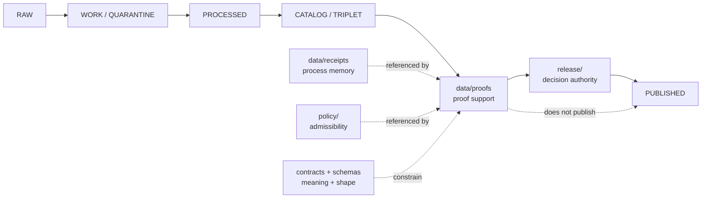

<!-- [KFM_META_BLOCK_V2]
doc_id: kfm://data/proofs/readme
title: data/proofs README
type: directory-readme
version: v0.1
status: draft
owners:
  - TODO(owner): data steward
  - TODO(owner): proof steward
  - TODO(owner): release steward
  - TODO(owner): domain stewards
created: 2026-06-25
updated: 2026-06-25
policy_label: public-review
path: data/proofs/README.md
related:
  - ../README.md
  - ../receipts/README.md
  - ../catalog/README.md
  - ../published/README.md
  - ../../release/README.md
  - ../../docs/adr/ADR-0011-receipts-vs-proofs-vs-manifests-vs-catalog-separation.md
  - ../../docs/doctrine/directory-rules.md
  - ../../contracts/README.md
  - ../../schemas/README.md
  - ../../policy/README.md
  - evidence_bundle/README.md
  - citation_validation/README.md
  - proof_pack/README.md
  - validation_report/README.md
  - review/README.md
notes:
  - "Root README for KFM proof-support lanes. It replaces a greenfield stub and orients maintainers to proof-family and domain proof directories."
  - "This README describes directory responsibility and boundaries. It does not prove emitted proof inventories, schemas, validators, fixtures, CI workflows, or release-gate enforcement exist."
  - "Proof support may reference receipts, catalogs, release records, published artifacts, policies, schemas, and contracts, but must not replace those authority families."
[/KFM_META_BLOCK_V2] -->

<a id="top"></a>

# `data/proofs/`

> Root directory for KFM **proof support**: evidence, validation, citation, review, integrity-adjacent, domain, and release-support artifacts that help claims stay inspectable, policy-aware, reviewable, correction-ready, and rollback-aware.


> [!IMPORTANT]
> **Status:** `draft`  
> **Owners:** `TODO(owner): data steward` · `TODO(owner): proof steward` · `TODO(owner): release steward` · `TODO(owner): domain stewards`  
> **Path:** `data/proofs/README.md`  
> **Truth posture:** CONFIRMED directory placement and several child README files from current repo evidence / PROPOSED child instance patterns / NEEDS VERIFICATION for emitted proof inventories, schemas, validators, fixtures, CI workflows, and release-gate enforcement.

---

## Quick jumps

| Section | Use it for |
|---|---|
| [1. Scope](#1-scope) | What this root is for. |
| [2. Repo fit](#2-repo-fit) | How proofs relate to lifecycle, receipts, catalog, release, and publication. |
| [3. Accepted inputs](#3-accepted-inputs) | What belongs here. |
| [4. Exclusions](#4-exclusions) | What must live somewhere else. |
| [5. Lane index](#5-lane-index) | Confirmed and proposed child lanes. |
| [6. Directory pattern](#6-directory-pattern) | Suggested structure for proof-family and domain lanes. |
| [7. Lifecycle relationship](#7-lifecycle-relationship) | How proof support fits RAW → PUBLISHED. |
| [8. Maintenance checklist](#8-maintenance-checklist) | Checks before adding proof files. |
| [9. Definition of done](#9-definition-of-done) | What is still needed for maturity. |

---

## 1. Scope

`data/proofs/` is the KFM root for proof-support artifacts. These files help reviewers and systems determine whether a claim, layer, report, graph projection, API payload, Evidence Drawer payload, Focus Mode output, correction, or rollback candidate has enough support to be considered for a governed release path.

Proof support may show:

- which evidence supports a claim;
- whether citations and EvidenceRefs resolve;
- which validation reports passed, warned, held, denied, or errored;
- which review and policy references apply;
- whether catalog closure and release support are present;
- whether correction and rollback references are available; and
- why a candidate should proceed, hold, abstain, restrict, deny, or error.

Proof artifacts are not public truth by placement. They are support objects that can be referenced by governed APIs, release records, review records, and published artifacts after the proper gates pass.

[Back to top](#top)

---

## 2. Repo fit

KFM keeps artifact families separate. This root belongs to proof support, not source storage, process memory, catalog discovery, release authority, or public publication.

| Neighbor | Role | Boundary |
|---|---|---|
| [`../raw/`](../raw/) | Source captures. | Proof files reference source material; they do not store source payloads. |
| [`../work/`](../work/) / [`../quarantine/`](../quarantine/) | Candidate work and held material. | Proof support can cite outcomes but should not become a work queue. |
| [`../processed/`](../processed/) | Validated normalized candidates. | Processed data is not proof by itself. |
| [`../receipts/`](../receipts/) | Process memory. | Receipts say what ran; proofs support why a claim or release candidate is inspectable. |
| [`../catalog/`](../catalog/) | Discovery, interchange, lineage carriers. | Catalog records are not proof or release authority by themselves. |
| [`../published/`](../published/) | Released public-safe carriers. | Public artifacts are downstream of release gates. |
| [`../../release/`](../../release/) | Release decisions, manifests, corrections, withdrawals, rollback, signatures. | Release authority stays in `release/`. |
| [`../../contracts/`](../../contracts/) | Semantic meaning. | Contracts define object meaning; proof files reference or conform to them. |
| [`../../schemas/`](../../schemas/) | Machine shape. | Schemas define shape; proof files do not create schema authority. |
| [`../../policy/`](../../policy/) | Admissibility and policy rules. | Proof files record or reference policy outcomes; they do not define policy. |

> [!WARNING]
> Do not use `data/proofs/` as a shortcut around KFM's trust membrane. Public clients should use governed interfaces and released artifacts, not direct reads from proof support lanes.

[Back to top](#top)

---

## 3. Accepted inputs

Use this root for proof-family lanes, domain proof lanes, and support files that are safe to store under repository policy and useful for review, release, correction, rollback, or audit.

| Accepted item | Example placement | Status |
|---|---|---|
| EvidenceBundle support | `data/proofs/evidence_bundle/` | CONFIRMED README lane. |
| Citation validation support | `data/proofs/citation_validation/` | CONFIRMED README lane. |
| ValidationReport support | `data/proofs/validation_report/` | CONFIRMED README lane. |
| ProofPack support | `data/proofs/proof_pack/` | CONFIRMED README lane. |
| Review proof support | `data/proofs/review/` | CONFIRMED README lane. |
| Domain proof lane | `data/proofs/<domain>/README.md` | CONFIRMED for several domain lanes; add more as needed. |
| Cross-domain proof support | `data/proofs/cross_domain/<scope>/` | PROPOSED; use only when no single domain owns the proof scope. |
| Retired or superseded proof support | Child-lane `retired/` folders | PROPOSED pattern; keep audit trail where appropriate. |

[Back to top](#top)

---

## 4. Exclusions

| Excluded material | Correct home |
|---|---|
| Raw source captures, downloads, exports, scans, rasters, logs, or source-system dumps | `data/raw/`, `data/work/`, or `data/quarantine/` |
| Process receipts | `data/receipts/` |
| Catalog records | `data/catalog/` |
| Triplet or graph projection stores | `data/triplets/` or approved graph/projection homes |
| Release manifests, promotion decisions, rollback cards, correction notices, withdrawal notices, release signatures | `release/` |
| Published layers, reports, tiles, API payloads, or public stories | `data/published/` after release gates |
| Policy logic or rule bundles | `policy/` |
| Machine schemas | `schemas/` |
| Semantic contracts | `contracts/` |
| UI/runtime output | governed app/API/output homes after release controls |

[Back to top](#top)

---

## 5. Lane index

### Proof-family lanes

| Lane | Role | Current note |
|---|---|---|
| [`evidence_bundle/`](./evidence_bundle/) | EvidenceRef → EvidenceBundle closure and claim-support bundles. | README present and expanded. |
| [`citation_validation/`](./citation_validation/) | Citation closure and cite-or-abstain support. | README present and expanded. |
| [`validation_report/`](./validation_report/) | Finite validator outcomes and gate support. | README present and expanded. |
| [`proof_pack/`](./proof_pack/) | Release-support bundle that gathers proof, validation, catalog, review, correction, and rollback refs. | README present and expanded. |
| [`review/`](./review/) | Review proof support and separation-of-duties evidence. | README present and expanded. |

### Domain proof lanes currently represented

| Lane | Role |
|---|---|
| [`people-dna-land/`](./people-dna-land/) | People / genealogy / DNA / land proof support. |
| [`roads-rail-trade/`](./roads-rail-trade/) | Roads, rail, and trade-route proof support. |
| [`settlement/`](./settlement/) | Settlement-side proof support under the broader settlements/infrastructure context. |
| [`settlements-infrastructure/`](./settlements-infrastructure/) | Broader settlements and infrastructure proof support. |
| [`soil/`](./soil/) | Soil proof support. |

> [!NOTE]
> Some proof-family names referenced by child READMEs, such as future integrity-style or catalog-matrix-style lanes, still need direct file verification before this root should list them as confirmed homes.

[Back to top](#top)

---

## 6. Directory pattern

```text
data/proofs/
├── README.md
├── evidence_bundle/
├── citation_validation/
├── validation_report/
├── proof_pack/
├── review/
├── <domain>/
│   ├── README.md
│   ├── candidates/
│   ├── indexes/
│   └── retired/
└── cross_domain/
    └── <scope>/
```

This tree is partly CONFIRMED and partly PROPOSED. Confirm the target path and owning domain before adding new files.

[Back to top](#top)

---

## 7. Lifecycle relationship



Promotion remains a governed state transition. Proof support can help a release steward inspect readiness, but it does not perform release by directory placement.

[Back to top](#top)

---

## 8. Maintenance checklist

Before adding or accepting proof files under this root, verify:

- [ ] The file belongs under `data/proofs/`, not receipts, catalog, release, published, schemas, contracts, or policy.
- [ ] The proof family or domain lane has a README or a clear owner.
- [ ] Source payloads are referenced by stable IDs or digests rather than copied here.
- [ ] EvidenceBundle, ValidationReport, citation, review, ProofPack, release, correction, and rollback references are present where required by the proof type.
- [ ] The file uses finite outcomes where it makes a gate statement.
- [ ] The file does not claim release, publication, policy approval, or public truth by placement.
- [ ] Any unresolved implementation maturity is labeled `NEEDS VERIFICATION` or `PROPOSED`.
- [ ] Public clients do not read this root directly as a normal runtime path.

[Back to top](#top)

---

## 9. Definition of done

This proof root is operationally mature when:

- [ ] Each active proof-family lane has an accepted contract or clear semantic standard.
- [ ] Machine-checkable schemas exist for proof families that emit JSON artifacts.
- [ ] Validators and fixtures exist for valid and invalid examples.
- [ ] CI or equivalent checks family separation, evidence closure, finite outcomes, and rollback support.
- [ ] Active domain proof lanes have README files before live proof instances land there.
- [ ] Release docs require the appropriate proof support before publication-significant transitions.
- [ ] A synthetic no-network release candidate demonstrates receipt → validation report → evidence/citation closure → proof pack → review → release → published artifact → rollback traceability.

---

## Maintainer note

Proof lanes should make KFM easier to inspect, not easier to bypass. Keep proofs compact, deterministic, source-linked, reviewable, and reversible. When evidence, policy, validation, review, release, correction, or rollback support is incomplete, keep the candidate held instead of treating a proof file as public authority.
