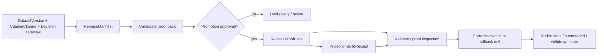

# proofs

Governed release evidence, proof packs, and rollback/correction trace for KFM promotion-ready releases.

> **Status:** experimental · **Doc state:** draft · **Owners:** `NEEDS VERIFICATION` · **Path:** `data/proofs/README.md` · **Repo fit:** directory contract for release manifests, proof packs, attestations, and visible recovery evidence  
>        
> **Quick jump:** [Scope](#scope) · [Repo fit](#repo-fit) · [Accepted inputs](#accepted-inputs) · [Exclusions](#exclusions) · [Directory tree](#directory-tree) · [Quickstart](#quickstart) · [Usage](#usage) · [Diagram](#diagram) · [Tables](#tables) · [Task list](#task-list) · [FAQ](#faq) · [Appendix](#appendix)
>
> [!IMPORTANT]
> `data/proofs/` is a **release-evidence** surface. It should make promotion, rollback, and correction inspectable. It should not become a second home for contracts, policy bundles, runtime code, or unpublished source data.
>
> [!NOTE]
> Current public-repo evidence confirms this README path exists. Exact non-README subtree contents, proof emitters, signature tooling, and workflow wiring still need live-checkout verification before stronger claims are merged.

## Scope

`data/proofs/` is where KFM should keep the evidence that a release is **publishable**, not merely buildable or deployed.

In March 2026 doctrine, promotion changes trust state; missing or invalid `ReleaseManifest` / `ReleaseProofPack` blocks promotion; and correction / rollback must remain visible rather than silently overwriting history.

### Current verified snapshot

| Layer | What this README treats as settled |
|---|---|
| Current public repo | `data/proofs/README.md` exists on public `main`. |
| Adjacent repo docs | `data/README.md`, `data/specs/README.md`, `contracts/README.md`, `policy/README.md`, `tests/README.md`, and `.github/README.md` exist and define the neighboring contract, policy, verification, and gatehouse surfaces. |
| Doctrine | `ReleaseManifest`, `ReleaseProofPack`, `ProjectionBuildReceipt`, `EvidenceBundle`, `RuntimeResponseEnvelope`, and `CorrectionNotice` are named trust objects in the March 2026 KFM manuals. |
| NEEDS VERIFICATION | Any live proof-artifact inventory beyond this README, candidate/release pack emitters, signature or SBOM publication services, workflow YAML lanes, and the exact archival pattern for correction evidence. |

### What this directory is for

Use `data/proofs/` to keep release-bearing evidence legible across promotion, inspection, rollback, and correction. A good proof surface should answer questions like these quickly:

1. Which release is this proof about?
2. Which catalog, decision, review, and runtime references does it join?
3. What checks passed, failed, or blocked promotion?
4. What rollback or correction posture was declared at release time?
5. If something changed later, where is the visible lineage?

[Back to top](#proofs)

## Repo fit

**Path:** `data/proofs/README.md`  
**Path status:** **CONFIRMED** directory README on current public `main`; deeper subtree inventory remains **NEEDS VERIFICATION**.

### Upstream, lateral, and downstream anchors

| Direction | Surface | Why it matters | Status in this README |
|---|---|---|---|
| Upstream | [`../README.md`](../README.md) | Governs the wider `data/` lifecycle and currently names `proofs/` as the release-evidence lane. | CONFIRMED |
| Lateral | [`../specs/README.md`](../specs/README.md) | Declares spec inputs, `spec_hash`, and promotion-gate inputs that eventually feed release proof. | CONFIRMED |
| Lateral | [`../catalog/README.md`](../catalog/README.md) | Catalog closure is a prerequisite for release proof, even though the current catalog README is still scaffolded. | CONFIRMED path / NEEDS VERIFICATION depth |
| Upstream | [`../../contracts/README.md`](../../contracts/README.md) | Shared schemas for `ReleaseManifest`, `ReleaseProofPack`, `CorrectionNotice`, and related trust objects belong there, not only here. | CONFIRMED |
| Upstream | [`../../policy/README.md`](../../policy/README.md) | Policy decisions, deny-by-default logic, review gates, and correction/withdrawal behavior should remain executable and testable. | CONFIRMED |
| Upstream | [`../../tests/README.md`](../../tests/README.md) | Release proof is incomplete unless tests can explain why the release is trustworthy. | CONFIRMED |
| Adjacent gatehouse | [`../../.github/README.md`](../../.github/README.md) | Repo-wide review, CI/CD, and delivery controls should emit or validate proof objects, not bypass them. | CONFIRMED |
| Downstream | Release / proof inspection surfaces | Public-safe release inspection and steward views should read from release-linked proof, not invent it. | PROPOSED |
| Downstream | Correction lineage lookup | Public surfaces should preserve superseded, withdrawn, and correction-pending state via governed lookup, not silent replacement. | PROPOSED |

### Repo-fit summary

| Question | Answer |
|---|---|
| What is `data/proofs/` for? | Release evidence, proof-pack assembly/archival, and rollback/correction trace. |
| What is it not for? | It is not the canonical home for schemas, policy bundles, runtime code, raw data, or unpublished work. |
| What must it stay linked to? | `release_id`, decision/review refs, catalog closure, projection receipts, runtime evidence, and correction lineage. |

[Back to top](#proofs)

## Accepted inputs

| Accepted input | Why it belongs here | Typical seam |
|---|---|---|
| Candidate proof-pack outputs | Candidate evidence should be reviewable before deployment or promotion. | Pre-deploy / pre-promotion |
| `ReleaseManifest` records or release-linked summaries | Promotion needs a stable release inventory and integrity anchors. | Promotion / release |
| `ReleaseProofPack` | This is the core publishability bundle: checks, signatures, attestations, SBOM refs, accessibility gate, and rollback posture. | Promotion / release |
| Checksums, digests, and attestation references | KFM prefers digest-bearing, reviewable release evidence over narrative-only release claims. | Build / promotion |
| Accessibility and post-deploy verify evidence | Deployment success is not enough; trust-bearing release proof must show more than “the pipeline passed.” | Release gate |
| `ProjectionBuildReceipt` summaries or linked receipts | Derived layers must remain release-linked and freshness-aware. | Derived delivery |
| Rollback drill evidence | KFM treats rollback as a visible lineage event, not a hidden ops trick. | Operations / recovery |
| Correction drill evidence and release-linked correction archives | Correction must stay legible through refs, notes, screenshots, and audit joins. | Correction / supersession |
| Proof-index notes or manifest-of-manifests | Helpful when a release fans out into multiple proof objects or projections. | Inspection / audit |

### Artifact families most relevant here

| Artifact family | Minimum purpose | Why this directory cares |
|---|---|---|
| `ReleaseManifest` | Assemble the public-safe release inventory and promotion metadata. | A proof pack without a release anchor is not enough. |
| `ReleaseProofPack` | Bundle the proof that a release is publishable. | Primary object family for this directory. |
| `ProjectionBuildReceipt` | Prove a derived artifact was built from a known release and freshness basis. | Keeps tiles, exports, scenes, and similar derivatives honest. |
| `CorrectionNotice` | Preserve visible lineage under correction, rollback, supersession, or withdrawal. | Avoids silent overwrite and helps inspection surfaces explain change. |
| Drill evidence | Prove that rollback/correction behavior was rehearsed or emitted visibly. | Turns operational claims into reviewable evidence. |

[Back to top](#proofs)

## Exclusions

| Do not keep here as canonical truth | Keep it here instead | Why |
|---|---|---|
| Shared schemas, OpenAPI fragments, vocabularies | [`../../contracts/README.md`](../../contracts/README.md) | Singular contract authority matters. |
| Policy bundles, reason registries, fixtures, policy tests | [`../../policy/README.md`](../../policy/README.md) | Policy should stay executable and independently reviewable. |
| Raw captures, WORK artifacts, or unpublished candidates | `../raw/`, `../work/`, `../quarantine/`, `../processed/` as appropriate | `data/proofs/` is evidence about release, not a side door into earlier stages. |
| Free-floating runtime envelopes or service logs | Governed API / runtime / observability surfaces | Runtime evidence should stay linked to the systems that emit it. |
| Mutable deployment state or ad hoc environment notes | Release/deploy automation and ops runbooks | Deployment placement is not the same as publishable trust state. |
| Secrets, private keys, tokens, or credentials | Secret management / environment controls | Proof should be inspectable without leaking power. |
| Silent replacement of prior proof objects | New release refs, correction notices, or supersession links | Archive immutably; do not rewrite history in place. |

> [!WARNING]
> A successful deployment does **not** by itself justify a publishable release.  
> If proof is missing, the release is incomplete.

[Back to top](#proofs)

## Directory tree

### Currently confirmed

```text
data/proofs/
└── README.md
```

### Doctrine-aligned starter shape *(PROPOSED)*

```text
data/proofs/
├── README.md
├── candidate/
│   └── <release_id>/
│       ├── candidate-proof-pack.json
│       ├── validation/
│       ├── policy/
│       └── digests/
├── releases/
│   └── <release_id>/
│       ├── release-manifest.json
│       ├── release-proof-pack.json
│       ├── checksums.txt
│       ├── attestations/
│       ├── sbom/
│       ├── accessibility/
│       ├── postdeploy/
│       └── projections/
├── corrections/
│   └── <correction_notice_id>/
│       ├── correction-notice.json
│       ├── affected-releases.md
│       └── evidence/
└── drills/
    ├── rollback/
    │   └── <run_id>/
    └── correction/
        └── <run_id>/
```

### Reading rule for the tree

| Path claim | Status | How to read it |
|---|---|---|
| `data/proofs/README.md` exists | CONFIRMED | Public `main` directly confirms the path. |
| Anything below `data/proofs/README.md` | NEEDS VERIFICATION unless otherwise proven | Do not treat a proposed subfolder as live inventory without a checkout or repo proof. |
| Candidate vs release proof split | PROPOSED but strongly doctrine-aligned | The manuals distinguish candidate proof before deployment from release proof at promotion. |
| Correction and drill subtrees | PROPOSED starter shape | Useful to keep operational evidence reviewable, but not yet confirmed as the repo’s mounted layout. |

> [!TIP]
> Keep filenames and folder depth light here.  
> The canonical semantics belong in contracts; this README should explain *why the proof exists* and *where it fits*.

[Back to top](#proofs)

## Quickstart

Use these commands before changing path claims, filenames, or proof responsibilities.

```bash
# 0) Start at repo root
git rev-parse --show-toplevel 2>/dev/null || pwd

# 1) Inspect the current proof surface
find data/proofs -maxdepth 4 -type f 2>/dev/null | sort

# 2) Re-read adjacent authority surfaces
sed -n '1,220p' data/README.md 2>/dev/null || true
sed -n '1,220p' data/specs/README.md 2>/dev/null || true
sed -n '1,220p' contracts/README.md 2>/dev/null || true
sed -n '1,220p' policy/README.md 2>/dev/null || true
sed -n '1,220p' tests/README.md 2>/dev/null || true
sed -n '1,220p' .github/README.md 2>/dev/null || true

# 3) Find proof-related references across the repo
grep -RIn "ReleaseProofPack\|ReleaseManifest\|CorrectionNotice\|rollback\|postdeploy" . \
  2>/dev/null | sed -n '1,200p'

# 4) Check whether workflows or release lanes already emit proof objects
find .github/workflows -maxdepth 2 -type f 2>/dev/null | sort

# 5) Confirm correction / drill outputs are archived, not overwritten
find data/proofs -maxdepth 4 -type f 2>/dev/null \
  | grep -E "correction|rollback|proof|manifest" \
  | sort
```

If the live checkout proves a different subtree, update this README in the same PR that changes the path.

[Back to top](#proofs)

## Usage

Use `data/proofs/` as the repo-facing memory of why a release could be trusted, denied, rolled back, or corrected.

1. **Assemble candidate evidence before promotion.**  
   Build/test/policy results may show that a release candidate is technically sound, but that is not yet a publishable trust state.

2. **Promote with release-linked proof.**  
   A promoted release should have a `ReleaseManifest` and a `ReleaseProofPack`, not only a green pipeline badge.

3. **Keep proof digest-first and append-only.**  
   Archive by stable identifiers such as `release_id`, `run_id`, and `audit_ref`. Prefer new objects plus supersession links over rewriting older proof in place.

4. **Link derived delivery back to release proof.**  
   Projection or export evidence should remain release-linked so stale, superseded, or withdrawn outputs can be explained later.

5. **Treat correction and rollback as first-class evidence.**  
   If a correction happens, keep the notice, affected release refs, replacement refs, screenshots, and review notes legible. Do not hide recovery behind invisible operational change.

### Working rules

- Build, deploy, and promote are different moves.
- If proof is missing, the release remains candidate or blocked.
- Correction is part of release engineering, not a separate embarrassment to hide.
- Public-safe proof summaries and steward/operator detail can differ, but both should remain release-linked and inspectable.

[Back to top](#proofs)

## Diagram



Above: release evidence flows from manifest and candidate proof into promotion, then into release proof, projection linkage, inspection, and visible correction/rollback lineage.

[Back to top](#proofs)

## Tables

### Proof artifact matrix

| Artifact | What it proves | Normal seam | Notes for `data/proofs/` |
|---|---|---|---|
| Candidate proof pack | Candidate quality before trust state changes | Pre-deploy / pre-promotion | Useful when dry-run promotion or review must happen before release. |
| `ReleaseManifest` | Public-safe release inventory, refs, integrity anchors, promotion metadata | Promotion / release | Keep immutable, release-linked records or summaries. |
| `ReleaseProofPack` | Publishable proof: checks, signatures, attestations, SBOM refs, accessibility gate, rollback posture | Promotion / release | Primary object family here. |
| `ProjectionBuildReceipt` | Derived artifact built from a known release and freshness basis | Derived delivery | Store linked summaries or refs; do not let derived output drift away from release identity. |
| `CorrectionNotice` | Visible lineage under correction, rollback, withdrawal, or supersession | Correction / rollback | Outward lookup may also live behind governed API surfaces. |
| Drill evidence | Recovery behavior was rehearsed or emitted visibly | Operations / audit | Archive `run_id`, `release_id`, `audit_ref`, screenshots, and review notes. |

### Fail-closed cues that matter here

| If this is missing or fails | Expected result |
|---|---|
| Missing or invalid `ReleaseManifest` / `ReleaseProofPack` | Block promotion or keep release candidate-only. |
| Unresolved rights or sensitivity decisions | Hold, deny, or require review rather than publish by convenience. |
| Derived output without release linkage or stale-after posture | Block, rebuild, mark stale-visible, or withdraw. |
| Runtime path without evidence linkage or finite negative outcomes | No outward trustworthy answer. |
| Correction without visible lineage | Treat as design failure; never silently overwrite public meaning. |

[Back to top](#proofs)

## Task list

- [ ] Live `data/proofs/` subtree inspected from the mounted checkout.
- [ ] Current proof emitters and exact filenames verified against real workflows or release jobs.
- [ ] `ReleaseManifest`, `ReleaseProofPack`, and `CorrectionNotice` contract homes confirmed under `../../contracts/`.
- [ ] Candidate vs release proof distinction kept explicit where the pipeline actually uses both.
- [ ] Proof objects are archived immutably and linked by stable IDs (`release_id`, `run_id`, `audit_ref`, etc.).
- [ ] Attestation, SBOM, accessibility, and post-deploy verify evidence are either present or explicitly marked out of scope.
- [ ] Rollback and correction drill evidence preserves screenshots and review notes, not just log text.
- [ ] No secrets, unpublished raw data, or policy bundles are stored here.
- [ ] Adjacent docs stay in sync: `data/README.md`, `contracts/README.md`, `policy/README.md`, `tests/README.md`, and `.github/README.md`.
- [ ] Unknowns remain visible instead of being rewritten as certainty.

[Back to top](#proofs)

## FAQ

### Is `data/proofs/` the same as `data/published/`?

No. Published scope is about what becomes outwardly available. Proof is about why that release could be trusted, inspected, rolled back, or corrected.

### Does a passing build mean proof can be skipped?

No. KFM doctrine separates build, deploy, and promote. A green pipeline may support a candidate; it does not by itself replace release proof.

### Should schemas or policy bundles live here?

No. Keep shared schemas in `../../contracts/` and policy bundles/tests in `../../policy/`.

### Can proof packs be edited in place?

They should be treated as immutable release-linked records. Prefer new objects plus supersession or correction links over rewriting earlier proof.

### Where should public users see correction lineage?

Through governed release/proof inspection and correction-lineage surfaces. `data/proofs/` can back those surfaces, but it should not be the only outward-facing explanation path.

[Back to top](#proofs)

## Appendix

### Evidence boundary for this README

| Layer | What is safe to say here |
|---|---|
| CONFIRMED current public repo | `data/proofs/README.md` exists; adjacent README surfaces exist; the repo uses README-style impact blocks, badges, quick jumps, and evidence-bounded language. |
| CONFIRMED doctrine | Release proof is load-bearing; proof objects are part of promotion; correction and rollback must remain visible; proof should be immutable and release-linked. |
| PROPOSED starter structure | Candidate/releases/corrections/drills subtree, exact filenames beyond `README.md`, and exact archival layout. |
| NEEDS VERIFICATION | Live workflow emitters, proof stores, signature/SBOM services, correction archival mechanics, and any non-README inventory beneath this directory. |

### Maintainer notes

- Preserve the `# proofs` title so the current scaffold path can be upgraded without unnecessary naming drift.
- Keep this README focused on *release evidence* rather than duplicating contract field lists already better owned by `../../contracts/`.
- If the live checkout confirms a different tree, update the directory map and quickstart commands in the same PR.
- If `data/README.md` still marks `data/proofs/` as only PROPOSED, retire that mismatch when the live tree is verified.

### Verification backlog

1. Inspect the mounted `data/proofs/` subtree and replace starter paths with exact filenames where evidence exists.
2. Confirm whether candidate proof packs are emitted separately from release proof packs in the active pipeline.
3. Verify whether proof inspection is served from repo-stored artifacts, a release service, or both.
4. Confirm how correction notices are archived here versus surfaced through governed API lineage routes.
5. Recheck tests and workflows so proof paths, fixtures, and release IDs match the same contract vocabulary.

[Back to top](#proofs)
