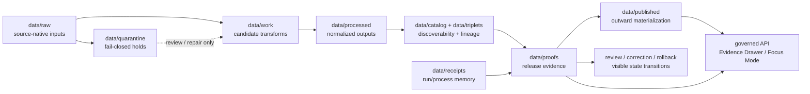

<!-- [KFM_META_BLOCK_V2]
doc_id: kfm://doc/NEEDS_VERIFICATION__data_proofs_readme
title: data/proofs
type: standard
version: v1
status: draft
owners: @bartytime4life
created: NEEDS_VERIFICATION__YYYY-MM-DD
updated: 2026-04-22
policy_label: NEEDS_VERIFICATION__public_or_restricted
related: [
  ../README.md,
  ../receipts/README.md,
  ../catalog/README.md,
  ../published/README.md,
  ../registry/README.md,
  ../work/README.md,
  ../../contracts/README.md,
  ../../schemas/README.md,
  ../../policy/README.md,
  ../../tests/README.md,
  ../../tools/validators/README.md,
  ../../tools/attest/README.md,
  ../../.github/README.md,
  ../../.github/workflows/README.md,
  ../../.github/PULL_REQUEST_TEMPLATE.md
]
tags: [kfm, data, proofs, release-evidence, promotion, rollback, correction, audit]
notes: [
  This README preserves the surfaced data/proofs release-evidence role and strengthens the receipts/proofs/published boundary.
  Owner is inherited from surfaced public-main /data/ ownership signals and must be rechecked against CODEOWNERS before merge.
  doc_id, created date, active-branch subtree inventory, and policy_label remain NEEDS VERIFICATION.
]
[/KFM_META_BLOCK_V2] -->

<a id="top"></a>

# `data/proofs/`

Release-evidence lane for proof packs, manifests, decisions, and visible rollback/correction lineage in Kansas Frontier Matrix.

> [!IMPORTANT]
> **Status:** experimental  
> **Document status:** draft  
> **Owners:** `@bartytime4life` *(inherited from surfaced `/data/` ownership signals; verify active-branch CODEOWNERS before merge)*  
> **Path:** `data/proofs/README.md`  
> **Repo fit:** parent [`../README.md`](../README.md); lateral to [`../receipts/README.md`](../receipts/README.md), [`../catalog/README.md`](../catalog/README.md), and [`../published/README.md`](../published/README.md); downstream from contracts, policy, validators, review, and promotion gates.  
> **Quick jumps:** [Scope](#scope) · [Repo fit](#repo-fit) · [Accepted inputs](#accepted-inputs) · [Exclusions](#exclusions) · [Directory tree](#directory-tree) · [Quickstart](#quickstart) · [Usage](#usage) · [Diagram](#diagram) · [Reference tables](#reference-tables) · [Task list](#task-list--definition-of-done) · [FAQ](#faq) · [Appendix](#appendix)


> [!NOTE]
> `data/proofs/` is not a generic artifact dump. It is the reviewable backing for release trust: why a candidate was allowed, held, denied, corrected, superseded, rolled back, or published.

---

## Scope

`data/proofs/` stores **release-significant evidence**.

In KFM, promotion is a governed state transition, not a file move. A green build, a generated tile, a model answer, or a published JSON snapshot may support a candidate, but none of them replaces proof that the release is valid, policy-safe, catalog-closed, reviewable, and reversible.

A proof object should make these questions easy to answer:

1. Which release, run, artifact, or promotion decision is this about?
2. Which evidence, catalog, policy, review, and receipt references does it join?
3. What passed, failed, blocked, or required steward review?
4. What rollback, supersession, withdrawal, or correction posture is visible?
5. Which downstream public or governed API surfaces are allowed to rely on it?

### Current evidence snapshot

| Claim | Status | How to read it |
|---|---:|---|
| `data/proofs/README.md` is the requested target file. | **CONFIRMED** | This file is the directory contract for the proof lane. |
| A surfaced prior README draft treated this lane as README-first and release-evidence-focused. | **CONFIRMED source / NEEDS VERIFICATION on active branch** | Preserve the role; recheck exact branch inventory before stronger claims. |
| Deeper checked-in proof inventory under `data/proofs/` is not proven by this README alone. | **UNKNOWN** | Do not infer live proof packs, signatures, manifests, or workflows from directory doctrine. |
| KFM doctrine names proof-bearing object families such as `EvidenceBundle`, `DecisionEnvelope`, `ReleaseManifest`, `CatalogMatrix`, `CorrectionNotice`, `SupersessionRecord`, and `RollbackRecord`. | **CONFIRMED doctrine / implementation depth varies** | Use these names consistently, but do not claim every object is already emitted unless branch evidence proves it. |

[Back to top](#top)

---

## Repo fit

**Path:** `data/proofs/README.md`  
**Lane role:** release evidence, proof closure, promotion support, correction lineage.  
**Neighboring boundary:** receipts remember runs; catalogs describe discoverable datasets and lineage; published artifacts are downstream materializations.

| Direction | Surface | Boundary |
|---|---|---|
| Parent | [`../README.md`](../README.md) | Defines the wider KFM data lifecycle and truth-path stages. |
| Upstream process memory | [`../receipts/README.md`](../receipts/README.md) | Stores run receipts, validation memory, replay/audit records, and process traces. Receipts can support proof, but are not proof by themselves. |
| Upstream / lateral catalog closure | [`../catalog/README.md`](../catalog/README.md) | Stores STAC/DCAT/PROV-style catalog and provenance surfaces. Catalog closure should be referenced by proof, not duplicated here. |
| Downstream publication | [`../published/README.md`](../published/README.md) | Stores outward materialized release scope after review and proof gates permit it. |
| Source and dataset registry | [`../registry/README.md`](../registry/README.md) | Defines source identity, source role, rights posture, and activation constraints. |
| Working area | [`../work/README.md`](../work/README.md) | Holds intermediate candidate material before promotion. Do not normalize work-in-progress into release proof by placement alone. |
| Contracts and schemas | [`../../contracts/README.md`](../../contracts/README.md), [`../../schemas/README.md`](../../schemas/README.md) | Machine-readable object shape belongs upstream. This directory stores object instances, not schema authority. |
| Policy | [`../../policy/README.md`](../../policy/README.md) | Policy rules and tests belong upstream; proof records the policy decision and policy version/hash that applied. |
| Validators and attestations | [`../../tools/validators/README.md`](../../tools/validators/README.md), [`../../tools/attest/README.md`](../../tools/attest/README.md) | Tools may emit or verify proof-linked objects, but executable logic does not live here. |
| Review and delivery | [`../../.github/workflows/README.md`](../../.github/workflows/README.md), [`../../.github/PULL_REQUEST_TEMPLATE.md`](../../.github/PULL_REQUEST_TEMPLATE.md) | Workflow and PR review surfaces should require proof references for release-bearing changes. |

[Back to top](#top)

---

## Accepted inputs

Use `data/proofs/` for artifacts that prove a release, promotion, correction, or rollback can be inspected after the fact.

Good candidates include:

- `ReleaseManifest` objects with release identity, artifact inventory, digests, policy posture, promotion state, and rollback references.
- `ReleaseProofPack` or `PromotionProofBundle` objects that bundle decision, catalog, validation, evidence, attestation, and review references.
- `EvidenceBundle` objects that resolve the EvidenceRefs behind a consequential public claim.
- `DecisionEnvelope` or decision-result references when they are release-bearing and schema-valid.
- signature, verification, DSSE, Rekor, checksum, SBOM, or provenance references when they directly support release trust.
- `CatalogMatrix` or catalog-closure proof linking STAC, DCAT, PROV, manifests, and published artifacts.
- `CorrectionNotice`, `SupersessionRecord`, `RollbackRecord`, and withdrawal records that keep changed release state visible.
- release-facing accessibility, post-deploy, or projection validation summaries when they are required promotion gates.
- proof indexes that join receipts, work outputs, catalog records, published surfaces, and correction state.

> [!TIP]
> A proof object should be small enough to review and rich enough to reconstruct. Prefer stable references, digests, schema versions, policy labels, and resolver paths over copying entire upstream objects.

[Back to top](#top)

---

## Exclusions

Do **not** use `data/proofs/` as a shortcut around the governed lifecycle.

| Do not put here | Put it here instead | Reason |
|---|---|---|
| Source-native files, downloads, screenshots, extracts, or raw payloads | [`../raw/`](../raw/) or source-specific intake lanes | Raw evidence must retain source-native identity and rights context before proof. |
| Unresolved, dirty, partial, or exploratory working products | [`../work/`](../work/) | Work-in-progress is not release evidence. |
| Blocked, rights-unclear, sensitive, or failed material | [`../quarantine/`](../quarantine/) | Fail-closed material must not become trusted by placement. |
| Normalized but unpublished domain data | [`../processed/`](../processed/) | Processed data can support proof, but is not proof itself. |
| Run receipts, validation receipts, logs, replay traces, and process memory | [`../receipts/`](../receipts/) | Receipts explain what happened during a run; proof explains why a release can be trusted. |
| STAC/DCAT/PROV catalog records as the main source of release authority | [`../catalog/`](../catalog/) | Catalog records are discoverability and lineage surfaces; proof joins them to decisions. |
| Published PMTiles, GeoJSON, JSON API snapshots, static pages, or outward release files | [`../published/`](../published/) | Publication is downstream of proof. |
| JSON Schema, OpenAPI, Rego, policy bundles, validators, scripts, or workflow YAML | [`../../schemas/`](../../schemas/), [`../../contracts/`](../../contracts/), [`../../policy/`](../../policy/), [`../../tools/`](../../tools/), [`../../.github/`](../../.github/) | Executable or normative rules must not hide inside emitted proof storage. |
| Secrets, tokens, private keys, credentials, or unredacted sensitive exact locations | nowhere in repo unless explicitly approved by policy | Release evidence must not leak protected material. |

[Back to top](#top)

---

## Directory tree

### Minimum safe shape

```text
data/proofs/
└── README.md
```

### Doctrine-aligned starter shape

The subtrees below are **PROPOSED** unless a checked-out branch proves them. Preserve any existing branch-specific layout through migration notes rather than silently moving proof objects.

```text
data/proofs/
├── README.md
├── releases/
│   └── <release_id>/
│       ├── release-manifest.json
│       ├── release-proof-pack.json
│       ├── evidence-bundle.json
│       ├── catalog-matrix.json
│       ├── checksums.txt
│       ├── attestations/
│       ├── sbom/
│       ├── accessibility/
│       ├── postdeploy/
│       └── rollback-ref.json
├── <domain>/
│   └── releases/
│       └── <release_id>/
│           ├── evidence_bundle.json
│           ├── release_manifest.json
│           ├── catalog_matrix.json
│           ├── proof_pack.json
│           └── rollback_ref.json
├── promotion/
│   └── <run_id>/
│       └── <spec_hash>/
│           ├── promotion-bundle.json
│           ├── promotion-bundle-diff.json
│           └── promotion-bundle-diff-policy.json
├── promotion_corrections/
│   └── <run_id>/
│       ├── correction-notice.json
│       ├── supersession-record.json
│       └── rollback-record.json
└── fixtures/
    └── <fixture_family>/
        ├── valid/
        └── invalid/
```

> [!WARNING]
> Do not create parallel canonical homes for the same proof family. If an active branch already uses `data/proofs/releases/<release_id>/`, keep that lineage visible. If a domain lane uses `data/proofs/<domain>/releases/<release_id>/`, document the relationship before adding aliases or migrations.

[Back to top](#top)

---

## Quickstart

From the repository root, use read-only inspection first.

```bash
# Non-destructive: list visible proof files without assuming a subtree exists.
find data/proofs -maxdepth 4 -type f | sort
```

Check JSON proof objects before reviewing them.

```bash
# Non-destructive: pretty-print one candidate proof object.
python -m json.tool data/proofs/releases/<release_id>/release-proof-pack.json
```

Trace a release proof to its neighbors.

```bash
# Non-destructive: find release references across proof, receipt, catalog, and published lanes.
grep -RIn "<release_id>" data/proofs data/receipts data/catalog data/published 2>/dev/null || true
```

> [!NOTE]
> Validator commands are **NEEDS VERIFICATION** until active-branch tooling is inspected. Use repo-native promotion, schema, policy, and attestation commands when they exist.

[Back to top](#top)

---

## Usage

### Add or revise release proof

1. Start with the release or promotion subject: `release_id`, `run_id`, `artifact_uri`, `subject_ref`, and `spec_hash` where applicable.
2. Resolve supporting `EvidenceRef` values into an `EvidenceBundle`.
3. Confirm catalog closure across catalog records, manifests, published artifacts, and provenance.
4. Keep process memory in `data/receipts/`; reference it from proof instead of copying it wholesale.
5. Record the finite decision outcome using the schema-approved vocabulary.
6. Attach policy label, policy version/hash, reviewer state, and sensitivity state.
7. Add rollback, correction, supersession, or withdrawal references when the release state can change.
8. Validate JSON shape, references, digests, and policy constraints before promotion.
9. Treat release proof as immutable after approval. Corrections should add new lineage objects, not rewrite history.

### Illustrative proof-pack skeleton

This example is illustrative. Use the active schema and repo-native field names when they exist.

```json
{
  "kind": "ReleaseProofPack",
  "release_id": "REVIEW_REQUIRED",
  "subject_ref": "REVIEW_REQUIRED",
  "spec_hash": "sha256:REVIEW_REQUIRED",
  "release_manifest_ref": "data/proofs/releases/REVIEW_REQUIRED/release-manifest.json",
  "evidence_bundle_ref": "data/proofs/releases/REVIEW_REQUIRED/evidence-bundle.json",
  "catalog_matrix_ref": "data/proofs/releases/REVIEW_REQUIRED/catalog-matrix.json",
  "decision_ref": "data/proofs/releases/REVIEW_REQUIRED/decision.json",
  "receipt_refs": [
    "data/receipts/REVIEW_REQUIRED/run_receipt.json"
  ],
  "published_refs": [
    "data/published/REVIEW_REQUIRED/"
  ],
  "correction_state": "none",
  "created_at": "REVIEW_REQUIRED"
}
```

[Back to top](#top)

---

## Diagram



[Back to top](#top)

---

## Reference tables

### Boundary matrix

| Lane | Primary job | Proof relationship |
|---|---|---|
| `raw/` | Preserve source-native material. | Referenced only after source identity, rights, and sensitivity are controlled. |
| `work/` | Hold intermediate candidate products. | Candidate work can be promoted only through validation and proof. |
| `quarantine/` | Hold unsafe, unclear, failed, or sensitive material. | Quarantine blocks release proof until resolved. |
| `processed/` | Store normalized non-public or pre-public artifacts. | Processed artifacts may be release subjects, not proof by themselves. |
| `catalog/` | Store catalog/provenance/discovery records. | Proof should verify catalog closure and reference catalog records. |
| `receipts/` | Store process memory and replay/audit records. | Receipts support proof but do not replace it. |
| `proofs/` | Store release-significant evidence and lineage. | This lane determines whether release trust is inspectable. |
| `published/` | Store outward materialized release scope. | Published artifacts must point back to release proof. |

### Proof object family map

| Object family | Purpose | Typical owner of semantics | Status posture |
|---|---|---|---|
| `EvidenceBundle` | Resolves EvidenceRefs behind a consequential claim. | Evidence/contracts domain | **CONFIRMED doctrine / branch inventory NEEDS VERIFICATION** |
| `DecisionEnvelope` | Records finite decision outcome and decision context. | Policy/promotion/runtime contracts | **CONFIRMED doctrine / implementation depth varies** |
| `ReleaseManifest` | Lists release artifacts, digests, and release state. | Release/promotion contracts | **CONFIRMED doctrine / branch inventory NEEDS VERIFICATION** |
| `ReleaseProofPack` / `PromotionProofBundle` | Bundles release-significant proof references for review. | Promotion/proof lane | **PROPOSED unless active branch contains it** |
| `CatalogMatrix` | Verifies closure across catalog, provenance, manifests, and published artifacts. | Catalog/proof lane | **PROPOSED unless active branch contains it** |
| `CorrectionNotice` | Describes post-release correction, withdrawal, or supersession. | Correction/review lane | **CONFIRMED doctrine / implementation depth varies** |
| `SupersessionRecord` | Links replaced release to successor release. | Correction/proof lane | **PROPOSED unless active branch contains it** |
| `RollbackRecord` / `rollback_ref` | Points to rollback target, reason, and release-state transition. | Release/proof lane | **PROPOSED unless active branch contains it** |

### Truth labels used here

| Label | Meaning |
|---|---|
| **CONFIRMED** | Verified from project evidence, surfaced documentation, or active-branch inspection when available. |
| **INFERRED** | Reasonable from adjacent doctrine or patterns, but not directly proven. |
| **PROPOSED** | Recommended shape or behavior not yet verified as implemented. |
| **UNKNOWN** | Not proven strongly enough; do not treat as fact. |
| **NEEDS VERIFICATION** | Must be checked before promotion, publication, or stronger claims. |

[Back to top](#top)

---

## Task list / definition of done

Before a proof-bearing release change is accepted:

- [ ] The release or promotion subject has stable identity: `release_id`, `subject_ref`, artifact digest, and applicable `spec_hash`.
- [ ] Every proof object validates against the active schema or documented contract.
- [ ] Every proof reference resolves, or the missing reference blocks promotion.
- [ ] `EvidenceBundle` coverage is complete for consequential public claims.
- [ ] `DecisionEnvelope` uses finite, schema-approved outcomes rather than free-form language.
- [ ] Catalog closure is checked across manifest, STAC/DCAT/PROV-style records, published artifacts, and provenance where applicable.
- [ ] Process receipts remain in `data/receipts/` and are referenced from proof.
- [ ] Published artifacts remain in `data/published/` and point back to release proof.
- [ ] Policy label, policy version/hash, sensitivity state, and review state are recorded.
- [ ] No raw data, secrets, credentials, unreviewed sensitive location data, or unpublished restricted material is stored here.
- [ ] Correction, supersession, withdrawal, and rollback state are visible when release state changes.
- [ ] Adjacent docs stay aligned: `data/README.md`, `data/receipts/README.md`, `data/catalog/README.md`, `data/published/README.md`, `contracts/README.md`, `schemas/README.md`, `policy/README.md`, `tests/README.md`, and `.github/workflows/README.md`.
- [ ] Unknowns remain labeled instead of being converted into confident prose.

[Back to top](#top)

---

## FAQ

### Is `data/proofs/` the same as `data/receipts/`?

No. `data/receipts/` is process memory: what ran, what checked, what changed, and what can be replayed or audited. `data/proofs/` is release evidence: why a release can be trusted, inspected, corrected, or rolled back.

### Is `data/proofs/` the same as `data/published/`?

No. `data/published/` stores outward materialized release scope. `data/proofs/` stores the release-significant evidence that made publication admissible.

### Does a passing build replace proof?

No. A passing build can support a candidate, but KFM separates build, validation, review, promotion, proof, publication, and correction.

### Should schemas or policy bundles live here?

No. Store schemas and contracts under the active schema/contract home, and store policy under `policy/`. This directory stores proof object instances and proof-linked release evidence.

### Can proof packs be edited in place?

Treat release proof as immutable once approved. Corrections should create new proof/correction objects with visible lineage rather than rewriting the earlier release record.

### What should reviewers check first?

Start with identity, schema validity, unresolved references, policy/sensitivity posture, catalog closure, and rollback/correction visibility. A polished proof pack with dangling refs is not acceptable.

[Back to top](#top)

---

## Appendix

<details>
<summary><strong>Reviewer prompts</strong></summary>

Use these prompts during review:

- What exact release or promotion subject is being proven?
- Which artifact digest, `spec_hash`, catalog record, and published surface does this proof cover?
- Are all upstream EvidenceRefs resolved?
- Are receipts linked but kept outside `data/proofs/`?
- Is catalog closure explicit?
- Are negative outcomes, holds, denials, corrections, supersessions, and rollbacks visible?
- Are rights, sensitivity, and policy labels present?
- Are any paths asserted as implemented without active-branch evidence?
- Can a future maintainer reconstruct the release decision without model output or private memory?

</details>

<details>
<summary><strong>Common anti-patterns</strong></summary>

Avoid these patterns:

- copying raw source files into proof packs
- treating a workflow log as release proof without manifest and decision context
- storing policy rules or schemas in emitted proof directories
- publishing proof objects with unresolved references
- rewriting old proof packs instead of adding correction lineage
- using proof storage to bypass quarantine, source rights, or sensitivity review
- letting generated summaries replace EvidenceBundle resolution
- allowing public UI or Focus Mode to cite a release that has no proof backing

</details>

<details>
<summary><strong>Open verification backlog</strong></summary>

- Verify active-branch `CODEOWNERS` coverage for `data/proofs/`.
- Verify active-branch subtree inventory under `data/proofs/`.
- Verify whether canonical schema home is `contracts/`, `schemas/contracts/v1/`, or a mixed pattern with ADR coverage.
- Verify current validator commands for proof references, signatures, catalog closure, and policy decisions.
- Verify workflow callers and whether proof gates are merge-blocking, advisory, or manual.
- Verify naming conventions for domain-specific releases versus shared `releases/<release_id>/` layout.
- Verify retention and archival rules for superseded, withdrawn, or rolled-back releases.

</details>

[Back to top](#top)
