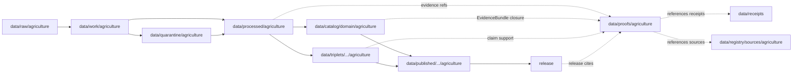

<!-- [KFM_META_BLOCK_V2]
doc_id: kfm://doc/data-proofs-agriculture-readme
title: data/proofs/agriculture/README.md — Agriculture Proofs README
version: v0.1
type: readme; proof-lane-guide; evidence-bundle-lane; agriculture-domain-proof-index; claim-support-lane
status: draft; PROPOSED; data-root; proofs-root; agriculture; evidence-bundle; claim-support; digest-closure; cite-or-abstain; aggregation-aware; source-role-aware; release-gated; evidence-first
authors: ChatGPT-5.5 Thinking; reviewed_by: OWNER_TBD
owners: OWNER_TBD — Agriculture steward · Evidence steward · Proof steward · Aggregation reviewer · Privacy/sensitivity reviewer · Data steward · Policy steward · Release steward · Docs steward
created: NEEDS VERIFICATION — greenfield stub existed before v0.1 expansion
updated: 2026-06-25
policy_label: public-doc; data; proofs; agriculture; evidence; lifecycle; governed; release-gated
tags: [kfm, data, proofs, agriculture, EvidenceBundle, EvidenceRef, proof, claim-support, digest-closure, CatalogMatrix, AggregationReceipt, RedactionReceipt, ModelRunReceipt, RealityBoundaryNote, MatrixCellReceipt, ValidationReport, PolicyDecision, ReviewRecord, ReleaseManifest, RollbackCard, SourceDescriptor, CropObservation, FieldCandidate, CropRotation, YieldObservation, IrrigationLink, ConservationPractice, SoilCropSuitability, AgriculturalEconomyObservation, SupplyChainNode, DroughtStressIndicator, PestStressIndicator, RAW, WORK, QUARANTINE, PROCESSED, CATALOG, TRIPLET, PUBLISHED]
related:
  - ../README.md
  - ../../README.md
  - ../../processed/agriculture/
  - ../../catalog/domain/agriculture/README.md
  - ../../catalog/stac/agriculture/
  - ../../catalog/dcat/agriculture/
  - ../../catalog/prov/agriculture/
  - ../../triplets/
  - ../../published/
  - ../../receipts/
  - ../../registry/sources/agriculture/
  - ../../../docs/domains/agriculture/DATA_LIFECYCLE.md
  - ../../../docs/domains/agriculture/CANONICAL_PATHS.md
  - ../../../docs/domains/agriculture/CROSS_LANE.md
  - ../../../docs/domains/agriculture/api-contracts.md
  - ../../../docs/domains/agriculture/ARCHITECTURE.md
  - ../../../docs/domains/agriculture/CONTINUITY_INVENTORY.md
  - ../../../contracts/domains/agriculture/README.md
  - ../../../contracts/domains/agriculture/aggregation-receipt.md
  - ../../../contracts/domains/agriculture/domain_observation.md
  - ../../../contracts/domains/agriculture/domain_feature_identity.md
  - ../../../contracts/domains/agriculture/domain_layer_descriptor.md
  - ../../../contracts/domains/agriculture/domain_validation_report.md
  - ../../../policy/domains/agriculture/
  - ../../../schemas/contracts/v1/domains/agriculture/
  - ../../../release/candidates/agriculture/
  - ../../../release/
  - ../../../pipelines/domains/agriculture/
  - ../../../pipeline_specs/agriculture/
  - ../../../tools/validators/
notes:
  - "This file replaces a greenfield stub at `data/proofs/agriculture/README.md`."
  - "This is an Agriculture proof lane guide under `data/proofs/`. It is not RAW source storage, WORK scratch, QUARANTINE holding, PROCESSED data, CATALOG, TRIPLET, PUBLISHED output, receipt storage, source registry, policy authority, release authority, schema home, validator home, public API/UI output, public map/tile output, field-level truth service, operator/parcel exposure path, agronomic prescription, hazard alert, or life-safety guidance."
  - "Proof records support EvidenceBundle / EvidenceRef closure and claim support. Receipts such as AggregationReceipt, RedactionReceipt, ModelRunReceipt, ReleaseManifest, RollbackCard, CorrectionNotice, and GENERATED_RECEIPT.json remain in their own receipt/release lanes and may be referenced by proofs; they are not owned here."
  - "Agriculture proof material is aggregation-aware: public Agriculture aggregates require resolvable aggregation support, and aggregate evidence must not be reinterpreted as field/operator truth."
  - "Source-role anti-collapse is mandatory: observed, regulatory, modeled, aggregate, administrative, candidate, and synthetic evidence remain distinct across proof, catalog, triplet, release, and AI-answer surfaces."
  - "This README is a proof-lane guide only. Contracts define semantic object meaning; schemas define machine shape; policy decides admissibility; release records decide publication."
  - "Rollback target for this expansion is previous greenfield stub blob SHA `48f5423698d486dafda50788fbb916c38ac74935`."
[/KFM_META_BLOCK_V2] -->

<a id="top"></a>

# data/proofs/agriculture

> Agriculture proof lane for EvidenceBundle, EvidenceRef, digest-closure, claim-support, and proof-index artifacts that support Agriculture claims without becoming source data, processed data, receipts, catalog records, release decisions, or public surfaces.

<p>
  
  
  
  
  
  
</p>

**Status:** draft / PROPOSED  
**Owners:** OWNER_TBD — Agriculture steward · Evidence steward · Proof steward · Aggregation reviewer · Privacy/sensitivity reviewer · Data steward · Policy steward · Release steward · Docs steward  
**Path:** `data/proofs/agriculture/README.md`  
**Owning root:** `data/proofs/`  
**Domain segment:** `agriculture`  
**Lifecycle role:** evidence/proof support referenced by catalog, triplet, release, and governed answer surfaces; not a lifecycle phase substitute  
**Exposure posture:** not public by default; public use requires catalog closure, policy/review state, release state, correction path, and rollback target.  
**Truth posture:** CONFIRMED target was a greenfield stub · CONFIRMED parent `data/proofs/` is also still a greenfield stub · CONFIRMED Agriculture lifecycle doctrine makes EvidenceBundle and CatalogMatrix part of catalog/triplet closure and makes AggregationReceipt load-bearing for public Agriculture aggregates · PROPOSED proof-lane details · NEEDS VERIFICATION for actual proof schemas, EvidenceBundle wire shape, proof indexes, validators, fixtures, access controls, release linkage, and governed route behavior.

**Quick jumps:** [Purpose](#purpose) · [Lifecycle relationship](#lifecycle-relationship) · [Repo fit](#repo-fit) · [Accepted contents](#accepted-contents) · [Exclusions](#exclusions) · [Proof requirements](#proof-requirements) · [Agriculture proof guardrails](#agriculture-proof-guardrails) · [Directory map](#directory-map) · [Evidence ledger](#evidence-ledger) · [Validation checklist](#validation-checklist) · [Rollback](#rollback)

---

## Purpose

`data/proofs/agriculture/` is the Agriculture domain proof lane. It should hold or index proof artifacts that make Agriculture claims inspectable, reproducible, and citation-safe.

This lane may contain or reference proof support for:

- EvidenceBundle closure for Agriculture catalog/triplet candidates;
- EvidenceRef resolution targets used by public-safe Agriculture payloads;
- claim-support records for Agriculture object families and indicators;
- digest closure, hash manifests, and proof indexes that support reproducibility;
- proof summaries for aggregate Agriculture products where every contributing source role and aggregation boundary remains visible;
- cross-lane proof support for Soil, Hydrology, Atmosphere/Air, Habitat/Fauna/Flora, Hazards, and People/DNA/Land relations when the ownership boundary remains explicit;
- proof metadata needed to show why a governed answer can `ANSWER`, `ABSTAIN`, `DENY`, or `HOLD`.

This lane does not create, store, or decide the underlying Agriculture data, schemas, receipts, policy decisions, release decisions, or public payloads. It supports claims; it does not replace the governed lifecycle.

## Lifecycle relationship

```text
RAW -> WORK / QUARANTINE -> PROCESSED -> CATALOG / TRIPLET -> PUBLISHED
                           \-> data/proofs/agriculture supports EvidenceBundle / EvidenceRef closure
```



Proofs support catalog, triplet, release, correction, rollback, and governed answers. They do not publish anything by themselves.

## Repo fit

| Responsibility | Correct home | Rule |
|---|---|---|
| Raw Agriculture source payloads or source-native exports | `data/raw/agriculture/` | Not this lane. |
| In-process transforms, joins, QA, redaction trials, notebooks, or scratch outputs | `data/work/agriculture/` | Not this lane. |
| Unsafe, unresolved, rights-unclear, sensitivity-unclear, source-role-unclear, or release-unclear material | `data/quarantine/agriculture/` | Not this lane until review/admission allows. |
| Normalized Agriculture processed data | `data/processed/agriculture/` | Not this lane. |
| Agriculture catalog records | `data/catalog/domain/agriculture/` and related STAC/DCAT/PROV lanes | Catalog, not proof storage. |
| Agriculture triplet/graph records | `data/triplets/.../agriculture/` | Graph projection, not proof storage. |
| Agriculture proof support | `data/proofs/agriculture/` | This lane. |
| Receipts | `data/receipts/` | Receipts are referenced by proofs but not stored here. |
| Source registry records | `data/registry/sources/agriculture/` | SourceDescriptor/source-admission authority. |
| Published public-safe outputs | `data/published/.../agriculture/` | Downstream after release only. |
| Release candidates and release manifests | `release/candidates/agriculture/`, `release/` | Publication authority, not proof storage. |
| Agriculture contracts | `contracts/domains/agriculture/` | Object meaning; not proof artifacts. |
| Agriculture schemas | `schemas/contracts/v1/domains/agriculture/` | Machine shape; not proof artifacts. |
| Agriculture policy | `policy/domains/agriculture/` | Admissibility authority; not proof artifacts. |
| Validators, tests, fixtures, pipelines, pipeline specs, apps, packages | `tools/validators/`, `tests/`, `fixtures/`, `pipelines/`, `pipeline_specs/`, `apps/`, `packages/` | Separate roots. |

## Accepted contents

Agriculture proof artifacts may include:

- EvidenceBundle files, indexes, or pointers for Agriculture claims;
- EvidenceRef resolution maps and claim-support manifests;
- digest-closure manifests tying processed artifacts, catalog records, triplets, and release candidates to source evidence;
- proof indexes for `CropObservation`, `FieldCandidate`, `CropRotation`, `YieldObservation`, `IrrigationLink`, `ConservationPractice`, `SoilCropSuitability`, `AgriculturalEconomyObservation`, `SupplyChainNode`, `DroughtStressIndicator`, and `PestStressIndicator` claims;
- aggregate-proof manifests that reference, but do not own, `AggregationReceipt` and suppression/geometry-scope evidence;
- model-proof summaries that reference, but do not own, `ModelRunReceipt`, `RealityBoundaryNote`, validation reports, and input digests;
- cross-lane proof support that preserves ownership, source role, sensitivity, and EvidenceBundle support for each side of a relation;
- proof README or index notes that explain evidence boundaries without becoming public outputs or authority records.

## Exclusions

Do not store these under `data/proofs/agriculture/`:

- RAW, WORK, QUARANTINE, PROCESSED, CATALOG, TRIPLET, or PUBLISHED data artifacts.
- RunReceipt, TransformReceipt, RedactionReceipt, AggregationReceipt, ModelRunReceipt, RepresentationReceipt, AIReceipt, ReviewRecord, PolicyDecision, ValidationReport, ReleaseManifest, PromotionDecision, CorrectionNotice, RollbackCard, WithdrawalNotice, RealityBoundaryNote, MatrixCellReceipt, or GENERATED_RECEIPT.json as primary receipt/release records.
- SourceDescriptor/source registry records.
- Contracts, schemas, policy bundles, validators, tests, fixtures, pipelines, app/UI/API code, packages, notebooks, or executable tooling.
- Public map/tile/API/UI payloads, Focus Mode answer payloads, direct downloads, model-answer text, release manifests, signatures, changelogs, or published products.
- Field-level/operator-level data, private parcel joins, proprietary yield, pesticide-record detail, FSA CLU detail, restricted coordinates, credentials, secrets, redaction parameters, suppression thresholds that should not be exposed, or private agreement terms.
- Claims that promote aggregate evidence into field/operator truth, modeled evidence into observed truth, or context indicators into alerts/instructions.

## Proof requirements

PROPOSED until concrete proof schemas, validators, fixtures, and route behavior are verified:

| Requirement | Meaning |
|---|---|
| EvidenceRef resolution | Every proof entry should identify which EvidenceRef, claim, catalog row, triplet, release candidate, or governed answer it supports. |
| EvidenceBundle closure | Proof artifacts should support closure over source descriptors, processed artifacts, catalog/triplet records, receipts, validation state, policy posture, and release linkage where applicable. |
| Digest closure | Proofs should include or point to content digests for evidence inputs, processed artifacts, catalog rows, triplets, and proof manifests. |
| Source-role preservation | Observed, regulatory, modeled, aggregate, administrative, candidate, and synthetic roles must remain explicit and not interchangeable. |
| Aggregation linkage | Public Agriculture aggregate proofs should reference AggregationReceipt or equivalent aggregate evidence; missing aggregate support should force ABSTAIN/HOLD, not answer. |
| Redaction linkage | Proofs involving generalized or withheld operator/field material should reference RedactionReceipt or policy disposition without exposing protected details. |
| Model linkage | Modeled CDL, SMAP, HLS, drought/pest stress, and vegetation-index proofs should reference ModelRunReceipt, uncertainty, and RealityBoundaryNote where applicable. |
| Cross-lane ownership | Soil, Hydrology, Atmosphere/Air, Habitat/Fauna/Flora, Hazards, and People/DNA/Land evidence must keep its owning-lane authority and sensitivity posture. |
| Policy posture | Proof artifacts must not bypass PolicyDecision or steward review when claims touch sensitive Agriculture material. |
| Release linkage | Proofs used by public outputs should link to release state, correction path, and rollback target without substituting for ReleaseManifest. |
| Correction and invalidation | Proofs should support correction, supersession, withdrawal, and rollback references when upstream evidence changes. |
| No public surface by default | Proof files are not direct public APIs, tiles, downloads, Focus Mode answers, or model-answer sources. |

## Agriculture proof guardrails

- Proof records support evidence closure; they are not source data, processed data, receipts, catalog records, release manifests, or public products.
- EvidenceBundle outranks generated summaries.
- If a governed Agriculture claim lacks resolvable evidence support, the safe outcome is `ABSTAIN`, `DENY`, `HOLD`, or `ERROR`, not an uncited answer.
- Aggregation support is load-bearing for public Agriculture aggregates.
- NASS aggregate evidence must not become field/operator truth.
- CDL and other classification rasters must not be relabeled as direct observed crop occurrence.
- Modeled moisture, vegetation, drought, or pest-stress context must carry uncertainty and reality-boundary notes where applicable.
- Agriculture may cite Soil, Hydrology, Atmosphere/Air, Habitat/Fauna/Flora, Hazards, and People/DNA/Land evidence only through governed cross-lane relations that preserve source role and sensitivity.
- Field-level/operator-level, private parcel, proprietary yield, pesticide-record, and FSA CLU contexts fail closed unless policy and review authorize a safer non-public or aggregated representation.
- Public clients and Focus Mode must use governed APIs, released artifacts, catalog/triplet records, EvidenceBundle-backed payloads, and policy-safe envelopes, not this directory directly.

> [!CAUTION]
> Do not expose `data/proofs/agriculture/` directly as a public map, API, UI, download, Focus Mode answer, AI answer source, field-level truth service, operator lookup, private parcel surface, agronomic prescription, hazard alert, legal/compliance advice, or life-safety product. Proofs support governed evidence closure; they do not publish claims by themselves.

## Directory map

Actual child inventory remains **NEEDS VERIFICATION**. Use this as a proposed local organization pattern only after confirming current repo convention and validators.

```text
data/proofs/agriculture/
├── README.md
├── evidence_bundles/         # PROPOSED — Agriculture EvidenceBundle records or indexes
├── evidence_refs/            # PROPOSED — EvidenceRef resolution maps
├── claim_support/            # PROPOSED — claim-to-evidence manifests
├── digest_closure/           # PROPOSED — source/processed/catalog/triplet digest closure
├── aggregates/               # PROPOSED — aggregate proof support referencing AggregationReceipt
├── models/                   # PROPOSED — model proof support referencing ModelRunReceipt/RealityBoundaryNote
├── cross_lane/               # PROPOSED — governed proof support for cross-lane joins
├── releases/                 # PROPOSED — proof pointers used by release candidates, not ReleaseManifest authority
├── corrections/              # PROPOSED — proof invalidation/correction pointers, not CorrectionNotice authority
├── validation/               # PROPOSED — proof-validation notes, not ValidationReport authority
└── _README_TODO.md           # PROPOSED — remove after actual child inventory is documented
```

## Evidence ledger

| Source | Status | Supports | Limits |
|---|---|---|---|
| Previous file | CONFIRMED | Target existed as a greenfield stub. | Did not define Agriculture proof boundaries. |
| `data/proofs/README.md` | CONFIRMED | Parent proof root currently exists as a greenfield stub. | Does not define proof-root contract yet. |
| Repository search | CONFIRMED | Found Agriculture catalog, lifecycle, contracts, canonical paths, and AggregationReceipt references. | Search is not a full tree audit. |
| `docs/domains/agriculture/DATA_LIFECYCLE.md` | CONFIRMED doctrine / PROPOSED implementation | Agriculture lifecycle requires EvidenceBundle/catalog closure before publication; receipts are consequential operation records; AggregationReceipt is load-bearing; sensitive Agriculture outputs require aggregation/redaction/policy/review controls. | Concrete proof schemas, validators, files, and route behavior remain NEEDS VERIFICATION. |
| `contracts/domains/agriculture/aggregation-receipt.md` | NEEDS VERIFICATION | Expected semantic contract for Agriculture aggregation receipt. | This task did not inspect its contents; receipt belongs outside this proof lane unless repository doctrine says otherwise. |
| `data/catalog/domain/agriculture/README.md` | NEEDS VERIFICATION | Expected downstream catalog surface that can cite proofs. | This task did not inspect contents. |
| `policy/domains/agriculture/` | NEEDS VERIFICATION | Expected admissibility home. | Current policy files and enforcement were not verified in this task. |
| `schemas/contracts/v1/domains/agriculture/` | NEEDS VERIFICATION | Expected schema home. | Specific proof/EvidenceBundle schemas were not verified in this task. |

## Validation checklist

- [ ] Confirm actual child directories under `data/proofs/agriculture/`.
- [ ] Expand or reconcile parent `data/proofs/README.md` beyond stub.
- [ ] Confirm EvidenceBundle, EvidenceRef, proof index, claim-support, digest-closure, and proof-invalidation schemas and contract homes.
- [ ] Confirm whether Agriculture proof files should be stored as concrete records here, as indexes pointing to global proof stores, or as generated artifacts linked from catalog/release.
- [ ] Confirm validators, fixtures, CI checks, source-role checks, digest checks, EvidenceRef resolution checks, aggregation-proof checks, redaction-proof checks, model-proof checks, correction-invalidation checks, and access-control enforcement.
- [ ] Confirm SourceDescriptor/source registry linkage for every proof-supported source family.
- [ ] Confirm proof references to RunReceipt, TransformReceipt, RedactionReceipt, AggregationReceipt, ModelRunReceipt, RepresentationReceipt, AIReceipt, ReviewRecord, PolicyDecision, ValidationReport, ReleaseManifest, PromotionDecision, CorrectionNotice, RollbackCard, WithdrawalNotice, RealityBoundaryNote, MatrixCellReceipt, and GENERATED_RECEIPT.json are pointers, not misplaced records.
- [ ] Confirm field/operator/private parcel detail, proprietary yield, pesticide-record detail, FSA CLU detail, restricted geometry, secrets, suppression-rule internals that should not be exposed, private agreement terms, and release-unclear artifacts cannot enter public routes through proof files.
- [ ] Confirm public-candidate transitions are governed, evidence-backed, source-role-safe, aggregation-safe, redaction-safe, rights-safe, sensitivity-safe, review-backed, release-linked, and reversible.
- [ ] Confirm no RAW, WORK, QUARANTINE, PROCESSED, CATALOG, TRIPLET, PUBLISHED, receipt, registry, release, schema, policy, validator, package, pipeline, app, API, public map, public tile, direct download, Focus Mode answer, agronomic prescription, hazard alert, legal/compliance advice, or life-safety artifact is misplaced here.
- [ ] Confirm public clients and Focus Mode cannot read this lane directly as public truth, public Agriculture service, public map, public tile, public API, public UI, or AI-answer source.

## Rollback

Rollback is required if this lane becomes a RAW source-data root, WORK scratch root, QUARANTINE bypass, PROCESSED substitute, catalog root, triplet root, public output root, `data/published/` substitute, receipt store, source-registry root, release-decision root, schema root, policy root, validator root, implementation root, direct public API shortcut, direct public UI shortcut, direct public tile shortcut, direct public exposure shortcut, source-role collapse path, aggregate-as-field-truth path, model-as-observation path, missing-aggregation-proof answer path, redaction-bypass path, private field/operator exposure path, proprietary-yield exposure path, pesticide-record exposure path, FSA-CLU exposure path, proof-without-evidence path, uncited-AI-answer source, agronomic prescription, hazard alert, legal/compliance advice, or life-safety guidance source.

Rollback target for this expansion: previous greenfield stub blob SHA `48f5423698d486dafda50788fbb916c38ac74935`.

<p align="right"><a href="#top">Back to top</a></p>
