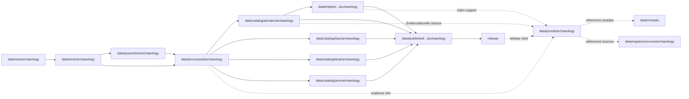

<!-- [KFM_META_BLOCK_V2]
doc_id: kfm://doc/data-proofs-archaeology-readme
title: data/proofs/archaeology/README.md — Archaeology Proofs README
version: v0.1
type: readme; proof-lane-guide; evidence-bundle-lane; archaeology-domain-proof-index; sensitive-claim-support-lane
status: draft; PROPOSED; data-root; proofs-root; archaeology; cultural-heritage; evidence-bundle; claim-support; digest-closure; cite-or-abstain; deny-by-default; sensitivity-aware; sovereignty-aware; release-gated; evidence-first
authors: ChatGPT-5.5 Thinking; reviewed_by: OWNER_TBD
owners: OWNER_TBD — Archaeology steward · Cultural review steward · Evidence steward · Proof steward · Sensitivity reviewer · Rights/stewardship reviewer · Data steward · Policy steward · Release steward · Docs steward
created: NEEDS VERIFICATION — greenfield stub existed before v0.1 expansion
updated: 2026-06-25
policy_label: restricted-doc; data; proofs; archaeology; cultural-heritage; evidence; sensitivity; lifecycle; governed; release-gated
tags: [kfm, data, proofs, archaeology, cultural-heritage, EvidenceBundle, EvidenceRef, proof, claim-support, digest-closure, CatalogMatrix, RedactionReceipt, PublicationTransformReceipt, ReviewRecord, PolicyDecision, ValidationReport, ReleaseManifest, RollbackCard, CorrectionNotice, SourceDescriptor, SurveyProject, SurveyTransect, SiteCandidate, CandidateFeature, SiteComponent, ArtifactRecord, ProvenienceContext, ExcavationUnit, StratigraphicUnit, CollectionRepository, ChronologyAssertion, GeophysicsObservation, RemoteSensingAnomaly, LiDARCandidate, ThreeDDocumentation, sovereignty-review, cultural-review, sensitivity, T4, RAW, WORK, QUARANTINE, PROCESSED, CATALOG, TRIPLET, PUBLISHED]
related:
  - ../README.md
  - ../../README.md
  - ../../processed/archaeology/README.md
  - ../../catalog/domain/archaeology/README.md
  - ../../catalog/stac/archaeology/
  - ../../catalog/dcat/archaeology/
  - ../../catalog/prov/archaeology/
  - ../../triplets/
  - ../../published/
  - ../../receipts/
  - ../../registry/sources/archaeology/
  - ../../../docs/domains/archaeology/PIPELINE.md
  - ../../../docs/domains/archaeology/ARCHITECTURE.md
  - ../../../docs/domains/archaeology/MAP_UI_CONTRACTS.md
  - ../../../docs/runbooks/archaeology/ROLLBACK_RUNBOOK.md
  - ../../../docs/atlases/sensitivity-tier-reference.md
  - ../../../docs/security/DATA_CLASSIFICATION.md
  - ../../../contracts/domains/archaeology/
  - ../../../policy/sensitivity/archaeology/
  - ../../../policy/release/archaeology/
  - ../../../policy/consent/archaeology/
  - ../../../schemas/contracts/v1/archaeology/
  - ../../../release/candidates/archaeology/
  - ../../../release/
  - ../../../pipelines/domains/archaeology/
  - ../../../pipeline_specs/archaeology/
  - ../../../tools/validators/
notes:
  - "This file replaces a greenfield stub at `data/proofs/archaeology/README.md`."
  - "This is an Archaeology proof lane guide under `data/proofs/`. It is not RAW source storage, WORK scratch, QUARANTINE holding, PROCESSED data, CATALOG, TRIPLET, PUBLISHED output, receipt storage, source registry, policy authority, release authority, schema home, validator home, public API/UI output, public map/tile output, site-discovery surface, collection-security surface, cultural-sovereignty decision, or life-safety guidance."
  - "Proof records support EvidenceBundle / EvidenceRef closure and claim support. Receipts such as RedactionReceipt, PublicationTransformReceipt, ReviewRecord, PolicyDecision, ReleaseManifest, RollbackCard, CorrectionNotice, and AIReceipt remain in their own receipt/release lanes and may be referenced by proofs; they are not owned here."
  - "Archaeology proof material is deny-by-default: exact site geometry, burial/human-remains context, sacred-site information, collection-security detail, looting-risk detail, private-landowner detail, and sovereignty-controlled knowledge must not be exposed through proof files."
  - "CandidateFeature, RemoteSensingAnomaly, and LiDARCandidate proof support must preserve candidate status unless governed review and evidence promote the claim to another object family."
  - "This README is a proof-lane guide only. Contracts define semantic object meaning; schemas define machine shape; policy decides admissibility; release records decide publication."
  - "Rollback target for this expansion is previous greenfield stub blob SHA `46091dc612b283dbcd840e2b9f129aa9fee1495b`."
[/KFM_META_BLOCK_V2] -->

<a id="top"></a>

# data/proofs/archaeology

> Archaeology proof lane for EvidenceBundle, EvidenceRef, digest-closure, claim-support, sensitivity-review references, and proof-index artifacts that support Archaeology claims without becoming source data, processed data, receipts, catalog records, release decisions, or public surfaces.

<p>
  
  
  
  
  
  
</p>

**Status:** draft / PROPOSED  
**Owners:** OWNER_TBD — Archaeology steward · Cultural review steward · Evidence steward · Proof steward · Sensitivity reviewer · Rights/stewardship reviewer · Data steward · Policy steward · Release steward · Docs steward  
**Path:** `data/proofs/archaeology/README.md`  
**Owning root:** `data/proofs/`  
**Domain segment:** `archaeology`  
**Lifecycle role:** evidence/proof support referenced by catalog, triplet, release, correction, rollback, and governed answer surfaces; not a lifecycle phase substitute  
**Exposure posture:** restricted by default; public use requires catalog closure, sensitivity transform, cultural/steward review where required, policy/review state, release state, correction path, and rollback target.  
**Truth posture:** CONFIRMED target was a greenfield stub · CONFIRMED parent `data/proofs/` is also still a greenfield stub · CONFIRMED processed Archaeology excludes proof records and is not public truth by itself · CONFIRMED Archaeology pipeline is deny-by-default and requires evidence closure before catalog/triplet · PROPOSED proof-lane details · NEEDS VERIFICATION for actual proof schemas, EvidenceBundle wire shape, proof indexes, validators, fixtures, access controls, release linkage, and governed route behavior.

**Quick jumps:** [Purpose](#purpose) · [Lifecycle relationship](#lifecycle-relationship) · [Repo fit](#repo-fit) · [Accepted contents](#accepted-contents) · [Exclusions](#exclusions) · [Proof requirements](#proof-requirements) · [Archaeology proof guardrails](#archaeology-proof-guardrails) · [Directory map](#directory-map) · [Evidence ledger](#evidence-ledger) · [Validation checklist](#validation-checklist) · [Rollback](#rollback)

---

## Purpose

`data/proofs/archaeology/` is the Archaeology domain proof lane. It should hold or index proof artifacts that make Archaeology claims inspectable, evidence-bound, sensitivity-aware, and citation-safe.

This lane may contain or reference proof support for:

- EvidenceBundle closure for Archaeology catalog/triplet candidates;
- EvidenceRef resolution targets used by released or review-only Archaeology payloads;
- claim-support records for survey, site, artifact, provenience, stratigraphy, chronology, geophysics, remote-sensing, LiDAR, collection, 3D documentation, and generalized public-candidate assertions;
- digest closure, hash manifests, and proof indexes that support reproducibility;
- sensitivity-proof manifests showing that redaction/generalization/restriction decisions were applied without exposing restricted details;
- cultural/steward review references where sovereignty, sacred-site, burial, cultural knowledge, or rights-holder decisions affect admissibility;
- proof metadata needed to show why a governed answer can `ANSWER`, `ABSTAIN`, `DENY`, `HOLD`, or `ERROR`.

This lane does not create, store, or decide the underlying Archaeology data, schemas, receipts, policy decisions, cultural decisions, release decisions, or public payloads. It supports claims; it does not replace the governed lifecycle.

## Lifecycle relationship

```text
RAW -> WORK / QUARANTINE -> PROCESSED -> CATALOG / TRIPLET -> PUBLISHED
                           \-> data/proofs/archaeology supports EvidenceBundle / EvidenceRef closure
```



Proofs support catalog, triplet, release, correction, rollback, and governed answers. They do not publish anything by themselves.

## Repo fit

| Responsibility | Correct home | Rule |
|---|---|---|
| Raw Archaeology source payloads, source-native records, survey packets, collection files, media, or original coordinates | `data/raw/archaeology/` | Not this lane. |
| In-process transforms, candidate detection, LiDAR/geophysics/remote-sensing analysis, joins, QA, redaction trials, notebooks, or scratch outputs | `data/work/archaeology/` | Not this lane. |
| Unsafe, unresolved, rights-unclear, sensitivity-unclear, cultural-review-unclear, source-role-unclear, or release-unclear material | `data/quarantine/archaeology/` | Not this lane until review/admission allows. |
| Normalized Archaeology processed data | `data/processed/archaeology/` | Not this lane. |
| Archaeology catalog records | `data/catalog/domain/archaeology/` and related STAC/DCAT/PROV lanes | Catalog, not proof storage. |
| Archaeology triplet/graph records | `data/triplets/.../archaeology/` | Graph projection, not proof storage. |
| Archaeology proof support | `data/proofs/archaeology/` | This lane. |
| Receipts and review records | `data/receipts/` or accepted review/receipt roots | Receipts are referenced by proofs but not stored here. |
| Source registry records | `data/registry/sources/archaeology/` or accepted registry path | SourceDescriptor/source-admission authority. |
| Published public-safe outputs | `data/published/.../archaeology/` | Downstream after release only. |
| Release candidates and release manifests | `release/candidates/archaeology/`, `release/` | Publication authority, not proof storage. |
| Archaeology contracts | `contracts/domains/archaeology/` | Object meaning; not proof artifacts. |
| Archaeology schemas | `schemas/contracts/v1/archaeology/` or ADR-resolved home | Machine shape; not proof artifacts. |
| Archaeology policy | `policy/sensitivity/archaeology/`, `policy/release/archaeology/`, `policy/consent/archaeology/` | Admissibility authority; not proof artifacts. |
| Validators, tests, fixtures, pipelines, pipeline specs, apps, packages | `tools/validators/`, `tests/`, `fixtures/`, `pipelines/`, `pipeline_specs/`, `apps/`, `packages/` | Separate roots. |

## Accepted contents

Archaeology proof artifacts may include:

- EvidenceBundle files, indexes, or pointers for Archaeology claims;
- EvidenceRef resolution maps and claim-support manifests;
- digest-closure manifests tying processed artifacts, catalog records, triplets, and release candidates to source evidence;
- proof indexes for survey-project, survey-transect, site-candidate, site-component, artifact-record, provenience-context, excavation-unit, stratigraphic-unit, collection-repository, chronology-assertion, geophysics-observation, remote-sensing-anomaly, LiDAR-candidate, 3D-documentation, and public-safe generalized derivative claims;
- candidate-class proof support that preserves candidate status until governed promotion to another object family;
- sensitivity-proof manifests that reference redaction, generalization, withholding, review, and policy decisions without exposing restricted geometry or restricted context;
- sovereignty/cultural-review proof references where rights-holder, steward, consent, or revocation posture determines admissibility;
- release/correction/rollback proof pointers, not release or rollback authority records;
- proof README or index notes that explain evidence boundaries without becoming public outputs or authority records.

## Exclusions

Do not store these under `data/proofs/archaeology/`:

- RAW, WORK, QUARANTINE, PROCESSED, CATALOG, TRIPLET, or PUBLISHED data artifacts.
- RunReceipt, TransformReceipt, ValidationReceipt, RedactionReceipt, PublicationTransformReceipt, ReviewRecord, PolicyDecision, CatalogBuildReceipt, ReleaseManifest, RollbackCard, CorrectionNotice, WithdrawalNotice, AIReceipt, or release signatures as primary receipt/release records.
- SourceDescriptor/source registry records.
- Contracts, schemas, policy bundles, validators, tests, fixtures, pipelines, app/UI/API code, packages, notebooks, or executable tooling.
- Public map/tile/API/UI payloads, Focus Mode answer payloads, direct downloads, model-answer text, release manifests, signatures, changelogs, or published products.
- Exact archaeological-site geometry, burial/human-remains context, sacred-site information, looting-risk detail, collection-security detail, private-landowner detail, sovereignty-controlled cultural knowledge, consent secrets, restricted coordinates, credentials, secrets, redaction parameters, or transform offsets.
- Claims that promote candidate features, remote-sensing anomalies, or LiDAR candidates into confirmed sites without governed review and evidence closure.

## Proof requirements

PROPOSED until concrete proof schemas, validators, fixtures, and route behavior are verified:

| Requirement | Meaning |
|---|---|
| EvidenceRef resolution | Every proof entry should identify which EvidenceRef, claim, catalog row, triplet, release candidate, correction, rollback, or governed answer it supports. |
| EvidenceBundle closure | Proof artifacts should support closure over source descriptors, processed artifacts, catalog/triplet records, receipts, validation state, policy posture, review state, and release linkage where applicable. |
| Digest closure | Proofs should include or point to content digests for evidence inputs, processed artifacts, catalog rows, triplets, generalized derivatives, and proof manifests. |
| Source-role preservation | Authority, observation, context, modeled, administrative, candidate, and synthetic roles must remain explicit and not interchangeable. |
| Candidate preservation | CandidateFeature, RemoteSensingAnomaly, and LiDARCandidate evidence remains candidate-class until governed review and evidence support a different object family. |
| Sensitivity linkage | Proofs involving restricted or generalized material should reference RedactionReceipt, PublicationTransformReceipt, ReviewRecord, and PolicyDecision without exposing restricted details. |
| Cultural/sovereignty review | Sacred, burial, human-remains, cultural knowledge, or sovereignty-controlled evidence should reference rights-holder/steward review posture without disclosing protected content. |
| Cross-lane ownership | Roads/Rail, Settlements/Infrastructure, Hydrology, Geology, People/Land, and other evidence must keep owning-lane authority and sensitivity posture. |
| Policy posture | Proof artifacts must not bypass PolicyDecision or steward review when claims touch sensitive Archaeology material. |
| Release linkage | Proofs used by public outputs should link to release state, correction path, and rollback target without substituting for ReleaseManifest. |
| Correction and invalidation | Proofs should support correction, supersession, withdrawal, and rollback references when upstream evidence, rights, sensitivity, or review state changes. |
| No public surface by default | Proof files are not direct public APIs, tiles, downloads, Focus Mode answers, or model-answer sources. |

## Archaeology proof guardrails

- Proof records support evidence closure; they are not source data, processed data, receipts, catalog records, release manifests, or public products.
- EvidenceBundle outranks generated summaries.
- If an Archaeology claim lacks resolvable evidence support, the safe outcome is `ABSTAIN`, `DENY`, `HOLD`, or `ERROR`, not an uncited answer.
- Exact site geometry, burial/human-remains context, sacred-site information, collection-security detail, looting-risk detail, private-landowner detail, and sovereignty-controlled cultural knowledge must not leak through proof files.
- Candidate features and remote-sensing anomalies must not become confirmed sites without evidence closure and steward review.
- Proofs may cite redacted/generalized derivatives, but proof files must not disclose the restricted original.
- Cultural, sovereignty, consent, and revocation posture must be respected; unresolved posture fails closed.
- AI summaries may reference only governed, released, evidence-supported surfaces and must preserve sensitivity posture; AI text is not proof.
- Public clients and Focus Mode must use governed APIs, released artifacts, catalog/triplet records, EvidenceBundle-backed payloads, and policy-safe envelopes, not this directory directly.

> [!CAUTION]
> Do not expose `data/proofs/archaeology/` directly as a public map, API, UI, download, Focus Mode answer, AI answer source, site-discovery surface, collection-security surface, cultural-knowledge disclosure surface, archaeology-location surface, legal/compliance advice, or life-safety product. Proofs support governed evidence closure; they do not publish claims by themselves.

## Directory map

Actual child inventory remains **NEEDS VERIFICATION**. Use this as a proposed local organization pattern only after confirming current repo convention and validators.

```text
data/proofs/archaeology/
├── README.md
├── evidence_bundles/         # PROPOSED — Archaeology EvidenceBundle records or indexes
├── evidence_refs/            # PROPOSED — EvidenceRef resolution maps
├── claim_support/            # PROPOSED — claim-to-evidence manifests
├── digest_closure/           # PROPOSED — source/processed/catalog/triplet digest closure
├── sensitivity/              # PROPOSED — redaction/generalization/review proof pointers, not restricted details
├── candidate_class/          # PROPOSED — candidate-feature/anomaly/LiDAR proof support
├── cultural_review/          # PROPOSED — steward/rights-holder review pointers, not protected content
├── cross_lane/               # PROPOSED — governed proof support for cross-lane joins
├── releases/                 # PROPOSED — proof pointers used by release candidates, not ReleaseManifest authority
├── corrections/              # PROPOSED — proof invalidation/correction pointers, not CorrectionNotice authority
├── validation/               # PROPOSED — proof-validation notes, not ValidationReport authority
└── _README_TODO.md           # PROPOSED — remove after actual child inventory is documented
```

## Evidence ledger

| Source | Status | Supports | Limits |
|---|---|---|---|
| Previous file | CONFIRMED | Target existed as a greenfield stub. | Did not define Archaeology proof boundaries. |
| `data/proofs/README.md` | CONFIRMED | Parent proof root currently exists as a greenfield stub. | Does not define proof-root contract yet. |
| Repository search | CONFIRMED | Found Archaeology processed, pipeline, rollback, architecture, map UI, and sensitivity-reference documents. | Search is not a full tree audit. |
| `data/processed/archaeology/README.md` | CONFIRMED current repo doc / PROPOSED implementation | Processed Archaeology excludes EvidenceBundle/proof records, receipts, catalog records, release decisions, and public outputs; exact-location and sensitive contexts fail closed. | Does not prove proof schemas, validators, or access controls. |
| `docs/domains/archaeology/PIPELINE.md` | CONFIRMED doctrine / PROPOSED implementation | Archaeology is deny-by-default, follows RAW→PUBLISHED gates, requires evidence closure before catalog/triplet, and preserves candidate-class restrictions. | Concrete code, specs, schemas, manifests, and CI remain NEEDS VERIFICATION. |
| `docs/runbooks/archaeology/ROLLBACK_RUNBOOK.md` | CONFIRMED doctrine / PROPOSED implementation | Archaeology rollback requires EvidenceBundle closure, handles evidence gaps and source-role collapse as high defects, and treats sensitive geometry/sovereignty/AI violations as critical/high triggers. | Runbook paths and tools remain PROPOSED/NEEDS VERIFICATION. |
| `policy/sensitivity/archaeology/`, `policy/release/archaeology/`, and `policy/consent/archaeology/` | NEEDS VERIFICATION | Expected admissibility homes. | Current policy files and enforcement were not verified in this task. |
| `schemas/contracts/v1/archaeology/` and `contracts/domains/archaeology/` | NEEDS VERIFICATION | Expected schema/contract homes. | Specific proof/EvidenceBundle schemas were not verified in this task. |

## Validation checklist

- [ ] Confirm actual child directories under `data/proofs/archaeology/`.
- [ ] Expand or reconcile parent `data/proofs/README.md` beyond stub.
- [ ] Confirm EvidenceBundle, EvidenceRef, proof index, claim-support, digest-closure, sensitivity-proof, cultural-review-proof, and proof-invalidation schemas and contract homes.
- [ ] Confirm whether Archaeology proof files should be stored as concrete records here, as indexes pointing to global proof stores, or as generated artifacts linked from catalog/release.
- [ ] Confirm validators, fixtures, CI checks, source-role checks, digest checks, EvidenceRef resolution checks, candidate-class checks, sensitivity-proof checks, cultural-review checks, correction-invalidation checks, and access-control enforcement.
- [ ] Confirm SourceDescriptor/source registry linkage for every proof-supported source family.
- [ ] Confirm proof references to RunReceipt, TransformReceipt, ValidationReceipt, RedactionReceipt, PublicationTransformReceipt, ReviewRecord, PolicyDecision, CatalogBuildReceipt, ReleaseManifest, RollbackCard, CorrectionNotice, WithdrawalNotice, AIReceipt, sovereignty review notes, and consent/revocation records are pointers, not misplaced records.
- [ ] Confirm exact site geometry, burial/human-remains context, sacred-site information, collection-security detail, looting-risk detail, private-landowner detail, sovereignty-controlled cultural knowledge, consent secrets, restricted coordinates, redaction parameters, transform offsets, private agreement terms, and release-unclear artifacts cannot enter public routes through proof files.
- [ ] Confirm public-candidate transitions are governed, evidence-backed, source-role-safe, sensitivity-safe, rights-safe, cultural-review-safe, review-backed, release-linked, and reversible.
- [ ] Confirm no RAW, WORK, QUARANTINE, PROCESSED, CATALOG, TRIPLET, PUBLISHED, receipt, registry, release, schema, policy, validator, package, pipeline, app, API, public map, public tile, direct download, Focus Mode answer, site-discovery surface, collection-security surface, cultural-knowledge disclosure surface, legal/compliance advice, or life-safety artifact is misplaced here.
- [ ] Confirm public clients and Focus Mode cannot read this lane directly as public truth, public Archaeology service, public map, public tile, public API, public UI, or AI-answer source.

## Rollback

Rollback is required if this lane becomes a RAW source-data root, WORK scratch root, QUARANTINE bypass, PROCESSED substitute, catalog root, triplet root, public output root, `data/published/` substitute, receipt store, source-registry root, release-decision root, schema root, policy root, validator root, implementation root, direct public API shortcut, direct public UI shortcut, direct public tile shortcut, direct public exposure shortcut, source-role collapse path, candidate-as-confirmed-site path, exact-site exposure path, burial/sacred-site exposure path, cultural-sovereignty disclosure path, collection-security exposure path, private-landowner exposure path, redaction-bypass path, proof-without-evidence path, uncited-AI-answer source, legal/compliance advice surface, or life-safety guidance source.

Rollback target for this expansion: previous greenfield stub blob SHA `46091dc612b283dbcd840e2b9f129aa9fee1495b`.

<p align="right"><a href="#top">Back to top</a></p>
