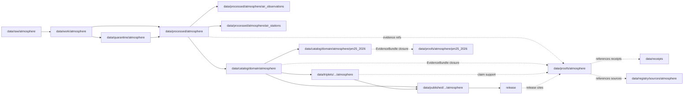

<!-- [KFM_META_BLOCK_V2]
doc_id: kfm://doc/data-proofs-atmosphere-readme
title: data/proofs/atmosphere/README.md — Atmosphere Proofs README
version: v0.1
type: readme; proof-lane-guide; evidence-bundle-lane; atmosphere-domain-proof-index; air-quality-claim-support-lane
status: draft; PROPOSED; data-root; proofs-root; atmosphere; air-quality; evidence-bundle; evidence-ref; claim-support; digest-closure; cite-or-abstain; source-role-aware; caveat-aware; release-gated; evidence-first
authors: ChatGPT-5.5 Thinking; reviewed_by: OWNER_TBD
owners: OWNER_TBD — Atmosphere steward · Air-quality steward · Evidence steward · Proof steward · Data steward · Policy steward · Release steward · Docs steward
created: NEEDS VERIFICATION — greenfield stub existed before v0.1 expansion
updated: 2026-06-25
policy_label: public-doc; data; proofs; atmosphere; evidence; lifecycle; governed; release-gated
tags: [kfm, data, proofs, atmosphere, air, air-quality, PM25Observation, AirObservation, AirStation, OzoneObservation, AODRaster, SmokeContext, ForecastContext, AdvisoryContext, EvidenceBundle, EvidenceRef, proof, claim-support, digest-closure, CatalogMatrix, SourceDescriptor, RunReceipt, ValidationReport, PolicyDecision, ReviewRecord, ReleaseManifest, RollbackCard, CorrectionNotice, AQI, observed-sensor, public-aqi-report, low-cost-sensor, AOD, smoke, model-field, advisory-boundary, RAW, WORK, QUARANTINE, PROCESSED, CATALOG, TRIPLET, PUBLISHED]
related:
  - ../README.md
  - ../../README.md
  - pm25_2026/README.md
  - ../../catalog/domain/atmosphere/README.md
  - ../../catalog/domain/atmosphere/pm25_2026/README.md
  - ../../processed/atmosphere/air_observations/README.md
  - ../../processed/atmosphere/air_stations/README.md
  - ../../processed/atmosphere/
  - ../../receipts/
  - ../../registry/sources/atmosphere/
  - ../../published/
  - ../../triplets/
  - ../../../docs/domains/atmosphere/DATA_LIFECYCLE.md
  - ../../../docs/domains/atmosphere/CANONICAL_PATHS.md
  - ../../../docs/domains/atmosphere/OBJECT_FAMILY_MAP.md
  - ../../../docs/domains/atmosphere/POLICY.md
  - ../../../docs/domains/atmosphere/PUBLICATION_POSTURE.md
  - ../../../docs/domains/atmosphere/SENSITIVITY.md
  - ../../../docs/domains/atmosphere/SOURCE_FAMILIES.md
  - ../../../docs/domains/atmosphere/SOURCES.md
  - ../../../docs/domains/atmosphere/PIPELINE.md
  - ../../../docs/domains/atmosphere/API_CONTRACTS.md
  - ../../../contracts/domains/atmosphere/PM25Observation.md
  - ../../../contracts/domains/atmosphere/AirObservation.md
  - ../../../contracts/domains/atmosphere/AirStation.md
  - ../../../contracts/domains/atmosphere/OzoneObservation.md
  - ../../../contracts/domains/atmosphere/AODRaster.md
  - ../../../contracts/domains/atmosphere/SmokeContext.md
  - ../../../contracts/domains/atmosphere/ForecastContext.md
  - ../../../contracts/domains/atmosphere/AdvisoryContext.md
  - ../../../schemas/contracts/v1/domains/atmosphere/
  - ../../../policy/domains/atmosphere/
  - ../../../release/candidates/atmosphere/
  - ../../../release/
  - ../../../pipelines/domains/atmosphere/
  - ../../../pipeline_specs/atmosphere/
  - ../../../tools/validators/
notes:
  - "This file replaces a greenfield stub at `data/proofs/atmosphere/README.md`."
  - "This is the parent Atmosphere proof lane guide under `data/proofs/`. It is not RAW source storage, WORK scratch, QUARANTINE holding, PROCESSED data, CATALOG, TRIPLET, PUBLISHED output, receipt storage, source registry, policy authority, release authority, schema home, validator home, public API/UI output, public map/tile output, AQI advisory service, medical advice, emergency alert, regulatory-exceedance authority, exposure/impact claim surface, or life-safety guidance."
  - "Proof records support Atmosphere EvidenceBundle / EvidenceRef closure and claim support. Receipts such as RunReceipt, ValidationReport, PolicyDecision, ReviewRecord, ReleaseManifest, RollbackCard, and CorrectionNotice remain in their own receipt/release lanes and may be referenced by proofs; they are not owned here."
  - "Atmosphere source-role anti-collapse is mandatory: observed sensor readings, public AQI/report posture, low-cost sensor records, regulatory/archive posture, AOD/smoke proxies, model fields, forecasts, and advisory context are not interchangeable."
  - "The `pm25_2026/` child proof lane is confirmed present and expanded. Other child lanes listed here are PROPOSED until verified."
  - "This README is a proof-lane guide only. Contracts define semantic object meaning; schemas define machine shape; policy decides admissibility; release records decide publication."
  - "Rollback target for this expansion is previous greenfield stub blob SHA `005bad268b7a003c19b93c3108924a2d7d5be6a6`."
[/KFM_META_BLOCK_V2] -->

<a id="top"></a>

# data/proofs/atmosphere

> Parent Atmosphere proof lane for EvidenceBundle, EvidenceRef, digest-closure, claim-support, source-role, caveat, validation, policy, and release-linkage proof artifacts for air-quality and atmosphere-domain claims.

<p>
  
  
  
  
  
  
</p>

**Status:** draft / PROPOSED  
**Owners:** OWNER_TBD — Atmosphere steward · Air-quality steward · Evidence steward · Proof steward · Data steward · Policy steward · Release steward · Docs steward  
**Path:** `data/proofs/atmosphere/README.md`  
**Owning root:** `data/proofs/`  
**Domain segment:** `atmosphere`  
**Lifecycle role:** proof support referenced by processed Atmosphere artifacts, domain catalog records, triplets, release candidates, corrections, rollbacks, and governed answer surfaces; not a lifecycle phase substitute  
**Exposure posture:** not public by default; public use requires catalog closure, policy/review state, release state, correction path, and rollback target.  
**Truth posture:** CONFIRMED target was a greenfield stub · CONFIRMED parent `data/proofs/` is also still a greenfield stub · CONFIRMED `pm25_2026/` child proof README exists and is expanded · CONFIRMED PM25Observation contract separates concentration, AQI/report posture, low-cost sensor caveats, AOD/model/advisory boundaries, evidence proof, and release · PROPOSED parent proof-lane details and child-lane index · NEEDS VERIFICATION for actual proof inventory, source manifests, proof schemas, validators, fixtures, access controls, release linkage, and governed route behavior.

**Quick jumps:** [Purpose](#purpose) · [Lifecycle relationship](#lifecycle-relationship) · [Repo fit](#repo-fit) · [Lane index](#lane-index) · [Accepted contents](#accepted-contents) · [Exclusions](#exclusions) · [Atmosphere proof requirements](#atmosphere-proof-requirements) · [Atmosphere proof guardrails](#atmosphere-proof-guardrails) · [Evidence ledger](#evidence-ledger) · [Validation checklist](#validation-checklist) · [Rollback](#rollback)

---

## Purpose

`data/proofs/atmosphere/` is the parent proof lane for the Atmosphere / Air domain. It should hold or index proof artifacts that make Atmosphere claims inspectable, evidence-bound, source-role-preserved, caveat-aware, and citation-safe.

This lane may contain or reference proof support for:

- EvidenceBundle closure for Atmosphere catalog/triplet candidates;
- EvidenceRef resolution targets used by release-linked or governed Atmosphere payloads;
- claim-support records for air observation, air station, PM2.5, ozone, AOD, smoke, forecast, advisory-context, QA, correction, caveat, freshness, model, and release-posture claims;
- digest closure tying source captures, processed Atmosphere artifacts, catalog rows, triplets, and release candidates to evidence;
- proof indexes that preserve units, averaging windows, source role, observed time, retrieval time, correction time, freshness state, QA state, station/network context, model/advisory boundary, policy state, and release linkage;
- proof metadata needed to show why a governed Atmosphere answer can `ANSWER`, `ABSTAIN`, `DENY`, `HOLD`, or `ERROR`.

This lane does not create, store, or decide the underlying Atmosphere data, catalog records, STAC/DCAT/PROV records, receipts, policy decisions, release decisions, public AQI payloads, public maps, medical advice, emergency alerts, regulatory determinations, or life-safety instructions. It supports claims; it does not replace the governed lifecycle.

## Lifecycle relationship

```text
RAW -> WORK / QUARANTINE -> PROCESSED -> CATALOG / TRIPLET -> PUBLISHED
                           \-> data/proofs/atmosphere supports EvidenceBundle / EvidenceRef closure
```



Proofs support catalog, triplet, release, correction, rollback, and governed answers. They do not publish anything by themselves.

## Repo fit

| Responsibility | Correct home | Rule |
|---|---|---|
| Raw sensor feeds, regulatory/source downloads, station payloads, source QA payloads, logs, or source-native records | `data/raw/atmosphere/` | Not this lane. |
| In-process parsing, correction, QA, calibration, joins, model comparisons, redaction trials, notebooks, or scratch outputs | `data/work/atmosphere/` | Not this lane. |
| Rights-unclear, source-role-unclear, stale, malformed, unsupported, disputed, low-cost-caveat-missing, station-sensitive, or release-unclear Atmosphere material | `data/quarantine/atmosphere/` | Not this lane until review/admission allows. |
| Normalized Atmosphere processed artifacts | `data/processed/atmosphere/` | Not this lane. |
| General AirObservation processed artifacts | `data/processed/atmosphere/air_observations/` | Processed observations, not proof storage. |
| AirStation processed/context artifacts | `data/processed/atmosphere/air_stations/` | Processed station context, not proof storage. |
| Atmosphere domain catalog records | `data/catalog/domain/atmosphere/` | Catalog records, not proof storage. |
| PM2.5 2026 domain catalog records | `data/catalog/domain/atmosphere/pm25_2026/` | Dataset catalog records, not proof storage. |
| Atmosphere proof support | `data/proofs/atmosphere/` | This parent lane. |
| PM2.5 2026 proof support | `data/proofs/atmosphere/pm25_2026/` | Child proof lane. |
| STAC/DCAT/PROV records | `data/catalog/stac/`, `data/catalog/dcat/`, `data/catalog/prov/` where accepted | Catalog projections, not proof storage. |
| Triplet/graph records | `data/triplets/.../atmosphere/` | Graph projection, not proof storage. |
| Receipts | `data/receipts/` | Receipts are referenced by proofs but not stored here. |
| Source registry records | `data/registry/sources/atmosphere/` | SourceDescriptor/source-admission authority. |
| Published public-safe outputs | `data/published/.../atmosphere/` | Downstream after release only. |
| Release candidates and release manifests | `release/candidates/atmosphere/`, `release/` | Publication authority, not proof storage. |
| Atmosphere object meaning | `contracts/domains/atmosphere/` | Semantic contracts; not proof artifacts. |
| Atmosphere machine shape | `schemas/contracts/v1/domains/atmosphere/` | Schemas; not proof artifacts. |
| Atmosphere policy | `policy/domains/atmosphere/` | Admissibility authority; not proof artifacts. |
| Validators, tests, fixtures, pipelines, pipeline specs, apps, packages | `tools/validators/`, `tests/`, `fixtures/`, `pipelines/`, `pipeline_specs/`, `apps/`, `packages/` | Separate roots. |

## Lane index

Known or intended child lanes under `data/proofs/atmosphere/` are listed below. Treat entries as **PROPOSED** unless current child READMEs, validators, fixtures, policies, receipts, access controls, and CI enforcement have been verified in the same implementation pass.

| Lane | Family | Purpose | Hard boundary |
|---|---|---|---|
| `pm25_2026/` | PM25Observation dataset proof | PM2.5 2026 EvidenceBundle / EvidenceRef closure, source-role, caveat, QA, freshness, and release-linkage support. | Not catalog, processed data, receipt storage, release decision, AQI advisory, medical advice, or emergency alert. |
| `air_observations/` | AirObservation proof | General air-quality observation proof support. | Not pollutant-specific semantic collapse. |
| `air_stations/` | AirStation proof | Station/network identity and evidence support. | Not station authority or station-sensitive disclosure by itself. |
| `ozone/` | OzoneObservation proof | Ozone claim proof support. | Ozone and PM2.5 must remain pollutant-specific. |
| `aod/` | AODRaster proof | AOD raster/proxy proof support. | AOD is not PM2.5 or observed concentration. |
| `smoke/` | SmokeContext proof | Smoke-context proof support. | Smoke context is not PM2.5 observation or health instruction. |
| `forecast_context/` | ForecastContext proof | Forecast/model-context proof support. | Model fields must not be presented as observed sensor values. |
| `advisory_context/` | AdvisoryContext proof | Advisory/referral-context proof support. | Not emergency instruction or life-safety authority. |
| `cross_lane/` | Cross-lane proof | Weather, hazard, health-context, hydrology, agriculture, or settlement relation support. | Owning-lane authority and sensitivity posture must remain explicit. |
| `restricted/` | Restricted proof support | Rights-limited, station-sensitive, caveat-sensitive, or review-limited proof material. | Non-public, access-controlled, fail-closed. |

## Accepted contents

Atmosphere proof artifacts may include:

- EvidenceBundle files, indexes, or pointers for Atmosphere claims;
- EvidenceRef resolution maps and claim-support manifests;
- digest-closure manifests tying source captures, processed artifacts, catalog records, triplets, and release candidates to evidence;
- proof indexes for AirObservation, AirStation, PM25Observation, OzoneObservation, AODRaster, SmokeContext, ForecastContext, and AdvisoryContext claims;
- proof summaries for units, averaging window, observed time, retrieval time, correction time, source role, caveat, confidence, limitation, validation state, model/advisory boundary, and release posture;
- proof records that reference station/network context while not duplicating AirStation authority;
- release/correction/rollback proof pointers, not release or rollback authority records;
- proof README or index notes that explain evidence boundaries without becoming public outputs or authority records.

## Exclusions

Do not store these under `data/proofs/atmosphere/`:

- RAW, WORK, QUARANTINE, PROCESSED, CATALOG, TRIPLET, or PUBLISHED data artifacts.
- RunReceipt, TransformReceipt, ValidationReport, PolicyDecision, ReviewRecord, ReleaseManifest, RollbackCard, CorrectionNotice, WithdrawalNotice, AIReceipt, or release signatures as primary receipt/release records.
- SourceDescriptor/source registry records.
- Contracts, schemas, policy bundles, validators, tests, fixtures, pipelines, app/UI/API code, packages, notebooks, or executable tooling.
- Public AQI/map/tile/API/UI payloads, Focus Mode answer payloads, direct downloads, model-answer text, release manifests, signatures, changelogs, or published products.
- Health/medical advice, emergency advisories, evacuation guidance, regulatory-exceedance determinations, exposure/impact claims, damages claims, or life-safety instructions.
- Claims that turn AQI/report posture into raw concentration, low-cost sensor records into reference-grade concentration without caveats, AOD/smoke proxies into PM2.5/ozone observations, model fields into observed sensor values, or air-quality values into health/action instructions.

## Atmosphere proof requirements

PROPOSED until concrete proof schemas, validators, fixtures, and route behavior are verified:

| Requirement | Meaning |
|---|---|
| EvidenceRef resolution | Every proof entry should identify which EvidenceRef, claim, catalog row, triplet, release candidate, correction, rollback, or governed answer it supports. |
| EvidenceBundle closure | Proof artifacts should support closure over source descriptors, processed artifacts, catalog/triplet records, receipts, validation state, policy posture, review state, and release linkage where applicable. |
| Digest closure | Proofs should include or point to content digests for evidence inputs, processed artifacts, catalog rows, triplets, and proof manifests. |
| Source-role preservation | Observed sensor, public AQI/report, low-cost sensor, regulatory/archive, model context, AOD/smoke proxy, forecast, and advisory context roles must remain explicit and not interchangeable. |
| Units and averaging window | Concentration units and averaging windows must be explicit when concentration claims are supported. |
| Time semantics | Observed time, retrieval time, correction time, freshness, release time, and supersession time should remain distinguishable where material. |
| Station/network context | Proofs may reference station/network context but must not duplicate station authority or disclose station-sensitive details without policy support. |
| QA/correction posture | Quality flags, correction state, caveats, limitations, missingness, confidence, and source reliability should remain visible to downstream claim evaluation. |
| Low-cost sensor caveats | Low-cost-sensor proofs require correction, caveat, confidence, limitation, source-rights, policy, and review posture before any public claim. |
| Proxy/model boundary | AOD rasters, smoke masks, model fields, forecasts, and advisory context may be comparison/context evidence only when explicitly labeled; they are not observed pollutant measurements. |
| Policy posture | Proof artifacts must not bypass PolicyDecision or steward review when claims touch rights, freshness, low-cost caveats, station sensitivity, or public display. |
| Release linkage | Proofs used by public outputs should link to release state, correction path, and rollback target without substituting for ReleaseManifest. |
| Correction and invalidation | Proofs should support correction, supersession, withdrawal, and rollback references when upstream evidence, QA, freshness, source rights, or review state changes. |
| No public surface by default | Proof files are not direct public APIs, tiles, downloads, Focus Mode answers, or model-answer sources. |

## Atmosphere proof guardrails

- Proof records support evidence closure; they are not source data, processed data, receipts, catalog records, release manifests, or public products.
- EvidenceBundle outranks generated summaries.
- If an Atmosphere claim lacks resolvable evidence support, the safe outcome is `ABSTAIN`, `DENY`, `HOLD`, or `ERROR`, not an uncited answer.
- Concentration, AQI/report posture, low-cost sensor records, regulatory/archive posture, AOD/smoke proxies, model fields, forecasts, and advisory context are different claim types.
- AQI/report posture must not be treated as raw pollutant concentration.
- AOD rasters, smoke masks, and model fields must not be presented as observed PM2.5 or ozone measurements.
- Low-cost sensor values require caveat, correction, confidence, limitation, source-rights, policy, and review posture before public use.
- Atmosphere proof support does not create emergency, medical, life-safety, regulatory, exposure, damages, or impact conclusions by itself.
- AI summaries may reference only governed, released, evidence-supported surfaces and must preserve source-role and caveat posture; AI text is not proof.
- Public clients and Focus Mode must use governed APIs, released artifacts, catalog/triplet records, EvidenceBundle-backed payloads, and policy-safe envelopes, not this directory directly.

> [!CAUTION]
> Do not expose `data/proofs/atmosphere/` directly as a public map, API, UI, download, Focus Mode answer, AI answer source, AQI advisory service, health/medical advice source, regulatory-exceedance determination, emergency alert, or life-safety product. Proofs support governed evidence closure; they do not publish Atmosphere claims by themselves.

## Evidence ledger

| Source | Status | Supports | Limits |
|---|---|---|---|
| Previous file | CONFIRMED | Target existed as a greenfield stub. | Did not define Atmosphere proof boundaries or child lanes. |
| `data/proofs/README.md` | CONFIRMED | Parent proof root currently exists as a greenfield stub. | Does not define proof-root contract yet. |
| `data/proofs/atmosphere/pm25_2026/README.md` | CONFIRMED child README | PM2.5 2026 child proof lane exists and defines dataset-specific EvidenceBundle/EvidenceRef closure and anti-collapse posture. | Does not prove validators, release state, or actual proof inventory. |
| `contracts/domains/atmosphere/PM25Observation.md` | CONFIRMED semantic contract | Defines PM25Observation meaning and boundaries for concentration, AQI/report posture, low-cost sensors, AOD/model/advisory boundaries, evidence proof, and release. | Contract does not prove schema enforcement, proof closure, policy approval, or public release. |
| `data/catalog/domain/atmosphere/pm25_2026/README.md` | CONFIRMED current repo doc / PROPOSED implementation | Defines a matching PM2.5 2026 catalog lane as CATALOG-stage and release-gated. | Does not prove PM2.5 source inventory, proof inventory, release status, or validators. |
| `data/processed/atmosphere/air_observations/README.md` | CONFIRMED current repo doc / PROPOSED implementation | Separates processed AirObservation artifacts from proofs, receipts, catalog records, release records, AQI/report semantics, model fields, AOD rasters, advisory context, and public surfaces. | Does not prove dedicated proof inventory. |
| `policy/domains/atmosphere/` | NEEDS VERIFICATION | Expected admissibility home. | Current policy files and enforcement were not verified in this task. |
| `schemas/contracts/v1/domains/atmosphere/` | NEEDS VERIFICATION | Expected machine-shape home. | Schema and validator behavior remain unverified. |

## Validation checklist

- [ ] Confirm actual child files and proof inventory under `data/proofs/atmosphere/`.
- [ ] Expand or reconcile parent `data/proofs/README.md` beyond stub.
- [ ] Confirm whether Atmosphere proof files are concrete records here, indexes pointing to global proof stores, or generated artifacts linked from catalog/release.
- [ ] Confirm source family list, source descriptors, source vintages, and source roles for Atmosphere proof-supported datasets.
- [ ] Confirm EvidenceBundle, EvidenceRef, proof index, claim-support, digest-closure, QA/freshness proof, source-role proof, and proof-invalidation schemas and contract homes.
- [ ] Confirm validators, fixtures, CI checks, source-role checks, units checks, averaging-window checks, QA/correction checks, low-cost caveat checks, freshness checks, release-link checks, and access-control enforcement.
- [ ] Confirm proof references to RunReceipt, TransformReceipt, ValidationReport, PolicyDecision, ReviewRecord, ReleaseManifest, RollbackCard, CorrectionNotice, WithdrawalNotice, and AIReceipt are pointers, not misplaced records.
- [ ] Confirm AQI-as-concentration, AOD-as-PM2.5, model-as-observed, low-cost-without-caveat, stale-without-freshness, rights-unclear, source-role-unclear, health/action claims, emergency/advisory claims, and release-unclear artifacts cannot enter public routes through proof files.
- [ ] Confirm public-candidate transitions are governed, evidence-backed, source-role-safe, units-safe, caveat-safe, rights-safe, freshness-safe, policy-safe, review-backed, release-linked, and reversible.
- [ ] Confirm no RAW, WORK, QUARANTINE, PROCESSED, CATALOG, TRIPLET, PUBLISHED, receipt, registry, release, schema, policy, validator, package, pipeline, app, API, public map, public tile, direct download, Focus Mode answer, advisory service, health/medical advice, regulatory-exceedance determination, emergency alert, or life-safety artifact is misplaced here.
- [ ] Confirm public clients and Focus Mode cannot read this lane directly as public truth, public Atmosphere service, public AQI service, public map, public tile, public API, public UI, or AI-answer source.

## Rollback

Rollback is required if this lane becomes a RAW source-data root, WORK scratch root, QUARANTINE bypass, PROCESSED substitute, catalog root, triplet root, public output root, `data/published/` substitute, receipt store, source-registry root, release-decision root, schema root, policy root, validator root, implementation root, direct public API shortcut, direct public UI shortcut, direct public tile shortcut, direct public exposure shortcut, AQI-as-concentration path, AOD-as-observed-pollutant path, model-as-observed path, low-cost-without-caveat path, stale-without-freshness path, proof-without-evidence path, uncited-AI-answer source, advisory service, health/medical advice surface, regulatory-exceedance determination, emergency alert, or life-safety guidance source.

Rollback target for this expansion: previous greenfield stub blob SHA `005bad268b7a003c19b93c3108924a2d7d5be6a6`.

<p align="right"><a href="#top">Back to top</a></p>
