<!-- [KFM_META_BLOCK_V2]
doc_id: kfm://doc/data-proofs-atmosphere-pm25-2026-readme
title: data/proofs/atmosphere/pm25_2026/README.md — Atmosphere PM2.5 2026 Proofs README
version: v0.1
type: readme; proof-lane-guide; evidence-bundle-lane; atmosphere-domain-proof-index; pm25-dataset-proof-lane; claim-support-lane
status: draft; PROPOSED; data-root; proofs-root; atmosphere; pm25; pm25_2026; evidence-bundle; evidence-ref; claim-support; digest-closure; cite-or-abstain; source-role-aware; release-gated; evidence-first
authors: ChatGPT-5.5 Thinking; reviewed_by: OWNER_TBD
owners: OWNER_TBD — Atmosphere steward · Air-quality steward · PM2.5 steward · Evidence steward · Proof steward · Data steward · Policy steward · Release steward · Docs steward
created: NEEDS VERIFICATION — blank placeholder existed before v0.1 expansion
updated: 2026-06-25
policy_label: public-doc; data; proofs; atmosphere; pm25; 2026; evidence; lifecycle; governed; release-gated
tags: [kfm, data, proofs, atmosphere, air, pm25, pm25_2026, PM25Observation, AirObservation, AirStation, EvidenceBundle, EvidenceRef, proof, claim-support, digest-closure, CatalogMatrix, SourceDescriptor, RunReceipt, ValidationReport, PolicyDecision, ReviewRecord, ReleaseManifest, RollbackCard, CorrectionNotice, AQI, public-aqi-report, observed-sensor, low-cost-sensor, AOD, smoke, model-field, advisory-boundary, RAW, WORK, QUARANTINE, PROCESSED, CATALOG, TRIPLET, PUBLISHED]
related:
  - ../../README.md
  - ../../../README.md
  - ../../../catalog/domain/atmosphere/pm25_2026/README.md
  - ../../../catalog/domain/atmosphere/README.md
  - ../../../processed/atmosphere/air_observations/README.md
  - ../../../processed/atmosphere/air_stations/README.md
  - ../../../processed/atmosphere/
  - ../../../receipts/
  - ../../../registry/sources/atmosphere/
  - ../../../published/
  - ../../../triplets/
  - ../../../../docs/domains/atmosphere/DATA_LIFECYCLE.md
  - ../../../../docs/domains/atmosphere/CANONICAL_PATHS.md
  - ../../../../docs/domains/atmosphere/OBJECT_FAMILY_MAP.md
  - ../../../../docs/domains/atmosphere/POLICY.md
  - ../../../../docs/domains/atmosphere/PUBLICATION_POSTURE.md
  - ../../../../docs/domains/atmosphere/SENSITIVITY.md
  - ../../../../docs/domains/atmosphere/SOURCE_FAMILIES.md
  - ../../../../docs/domains/atmosphere/SOURCES.md
  - ../../../../docs/domains/atmosphere/PIPELINE.md
  - ../../../../docs/domains/atmosphere/API_CONTRACTS.md
  - ../../../../contracts/domains/atmosphere/PM25Observation.md
  - ../../../../contracts/domains/atmosphere/AirObservation.md
  - ../../../../contracts/domains/atmosphere/AirStation.md
  - ../../../../contracts/domains/atmosphere/OzoneObservation.md
  - ../../../../contracts/domains/atmosphere/AODRaster.md
  - ../../../../contracts/domains/atmosphere/SmokeContext.md
  - ../../../../contracts/domains/atmosphere/ForecastContext.md
  - ../../../../contracts/domains/atmosphere/AdvisoryContext.md
  - ../../../../schemas/contracts/v1/domains/atmosphere/PM25Observation.schema.json
  - ../../../../policy/domains/atmosphere/
  - ../../../../release/candidates/atmosphere/
  - ../../../../release/
  - ../../../../pipelines/domains/atmosphere/
  - ../../../../pipeline_specs/atmosphere/
  - ../../../../tools/validators/
notes:
  - "This file replaces a blank placeholder at `data/proofs/atmosphere/pm25_2026/README.md`."
  - "This is a dataset-specific Atmosphere proof lane guide under `data/proofs/` for PM2.5 2026 EvidenceBundle / EvidenceRef closure. It is not RAW source storage, WORK scratch, QUARANTINE holding, PROCESSED data, CATALOG, TRIPLET, PUBLISHED output, receipt storage, source registry, policy authority, release authority, schema home, validator home, public API/UI output, public map/tile output, AQI advisory service, medical advice, emergency alert, or life-safety guidance."
  - "Proof records support PM2.5 claim closure. Receipts such as RunReceipt, ValidationReport, PolicyDecision, ReviewRecord, ReleaseManifest, RollbackCard, and CorrectionNotice remain in their own receipt/release lanes and may be referenced by proofs; they are not owned here."
  - "PM2.5 source-role anti-collapse is mandatory: observed concentration, public AQI/report posture, low-cost sensor record, regulatory/archive posture, AOD/smoke proxy, modeled field, and advisory context are not interchangeable."
  - "No specific `pm25_2026` source manifest, proof inventory, schema validator, receipt set, ReleaseManifest, or public route behavior was verified in this task."
  - "This README is a proof-lane guide only. Contracts define semantic object meaning; schemas define machine shape; policy decides admissibility; release records decide publication."
  - "Rollback target for this expansion is previous blank placeholder blob SHA `8b137891791fe96927ad78e64b0aad7bded08bdc`."
[/KFM_META_BLOCK_V2] -->

<a id="top"></a>

# data/proofs/atmosphere/pm25_2026

> Dataset-specific Atmosphere proof lane for PM2.5 2026 EvidenceBundle, EvidenceRef, digest-closure, claim-support, source-role, caveat, validation, policy, and release-linkage proof artifacts.

<p>
  
  
  
  
  
  
</p>

**Status:** draft / PROPOSED  
**Owners:** OWNER_TBD — Atmosphere steward · Air-quality steward · PM2.5 steward · Evidence steward · Proof steward · Data steward · Policy steward · Release steward · Docs steward  
**Path:** `data/proofs/atmosphere/pm25_2026/README.md`  
**Owning root:** `data/proofs/`  
**Domain segment:** `atmosphere`  
**Dataset segment:** `pm25_2026`  
**Lifecycle role:** proof support referenced by processed PM2.5 artifacts, PM2.5 catalog records, triplets, release candidates, corrections, rollbacks, and governed answer surfaces; not a lifecycle phase substitute  
**Exposure posture:** not public by default; public use requires catalog closure, policy/review state, release state, correction path, and rollback target.  
**Truth posture:** CONFIRMED target was a blank placeholder · CONFIRMED matching PM2.5 2026 catalog README exists · CONFIRMED PM25Observation contract separates concentration, AQI/report posture, low-cost sensor caveats, AOD/model/advisory boundaries, evidence proof, and release · CONFIRMED AirObservation processed lane is separate from proofs and public surfaces · PROPOSED proof-lane details · NEEDS VERIFICATION for actual proof inventory, source manifest, proof schemas, validators, fixtures, access controls, release linkage, and governed route behavior.

**Quick jumps:** [Purpose](#purpose) · [Lifecycle relationship](#lifecycle-relationship) · [Repo fit](#repo-fit) · [Accepted contents](#accepted-contents) · [Exclusions](#exclusions) · [PM2.5 2026 proof requirements](#pm25-2026-proof-requirements) · [PM2.5 proof guardrails](#pm25-proof-guardrails) · [Directory map](#directory-map) · [Evidence ledger](#evidence-ledger) · [Validation checklist](#validation-checklist) · [Rollback](#rollback)

---

## Purpose

`data/proofs/atmosphere/pm25_2026/` is the dataset-specific proof lane for the proposed Atmosphere/Air 2026 PM2.5 dataset family.

This lane may contain or reference proof support for:

- EvidenceBundle closure for PM2.5 2026 catalog/triplet candidates;
- EvidenceRef resolution targets used by release-linked or governed PM2.5 payloads;
- claim-support records for PM2.5 concentration, AQI/report, low-cost sensor, regulatory/archive, modeled, AOD/smoke comparison, freshness, QA, correction, caveat, and release-posture claims;
- digest closure tying source captures, processed PM2.5 artifacts, catalog rows, triplets, and release candidates to evidence;
- proof indexes that preserve units, averaging windows, source role, observed time, retrieval time, correction time, freshness state, QA state, station/network context, policy state, and release linkage;
- proof metadata needed to show why a governed PM2.5 answer can `ANSWER`, `ABSTAIN`, `DENY`, `HOLD`, or `ERROR`.

This lane does not create, store, or decide the underlying PM2.5 data, PM2.5 catalog records, STAC/DCAT/PROV records, receipts, policy decisions, release decisions, public AQI payloads, public maps, medical advice, emergency alerts, or life-safety instructions. It supports claims; it does not replace the governed lifecycle.

## Lifecycle relationship

```text
RAW -> WORK / QUARANTINE -> PROCESSED -> CATALOG / TRIPLET -> PUBLISHED
                           \-> data/proofs/atmosphere/pm25_2026 supports EvidenceBundle / EvidenceRef closure
```



```mermaid
flowchart LR
  RAW[data/raw/atmosphere] --> WORK[data/work/atmosphere]
  WORK --> QUAR[data/quarantine/atmosphere]
  WORK --> PROC[data/processed/atmosphere]
  QUAR --> PROC
  PROC --> AIR[data/processed/atmosphere/air_observations]
  PROC --> PMPROC[data/processed/atmosphere/pm25_2026 or accepted PM2.5 lane]
  PMPROC --> CAT[data/catalog/domain/atmosphere/pm25_2026]
  CAT --> TRIP[data/triplets/.../atmosphere]
  CAT --> PUB[data/published/.../atmosphere]
  TRIP --> PUB
  PUB --> REL[release]

  PMPROC -. evidence refs .-> PROOF[data/proofs/atmosphere/pm25_2026]
  CAT -. EvidenceBundle closure .-> PROOF
  TRIP -. claim support .-> PROOF
  REL -. release cites .-> PROOF
  PROOF -. references receipts .-> RECEIPTS[data/receipts]
  PROOF -. references sources .-> REG[data/registry/sources/atmosphere]
```

Proofs support catalog, triplet, release, correction, rollback, and governed answers. They do not publish anything by themselves.

## Repo fit

| Responsibility | Correct home | Rule |
|---|---|---|
| Raw PM2.5 sensor feeds, regulatory/source downloads, station payloads, source QA payloads, logs, or source-native records | `data/raw/atmosphere/` | Not this lane. |
| In-process parsing, correction, QA, calibration, joins, model comparisons, redaction trials, notebooks, or scratch outputs | `data/work/atmosphere/` | Not this lane. |
| Rights-unclear, source-role-unclear, stale, malformed, unsupported, disputed, low-cost-caveat-missing, station-sensitive, or release-unclear PM2.5 material | `data/quarantine/atmosphere/` | Not this lane until review/admission allows. |
| Normalized PM2.5 processed artifacts | `data/processed/atmosphere/` or an accepted PM2.5 processed child lane | Not this lane. |
| General AirObservation processed artifacts | `data/processed/atmosphere/air_observations/` | Processed observations, not proof storage. |
| PM2.5 2026 domain catalog records | `data/catalog/domain/atmosphere/pm25_2026/` | Catalog records, not proof storage. |
| PM2.5 2026 proof support | `data/proofs/atmosphere/pm25_2026/` | This lane. |
| STAC/DCAT/PROV records | `data/catalog/stac/`, `data/catalog/dcat/`, `data/catalog/prov/` where accepted | Catalog projections, not proof storage. |
| Triplet/graph records | `data/triplets/.../atmosphere/` | Graph projection, not proof storage. |
| Receipts | `data/receipts/` | Receipts are referenced by proofs but not stored here. |
| Source registry records | `data/registry/sources/atmosphere/` | SourceDescriptor/source-admission authority. |
| Published public-safe outputs | `data/published/.../atmosphere/` | Downstream after release only. |
| Release candidates and release manifests | `release/candidates/atmosphere/`, `release/` | Publication authority, not proof storage. |
| PM2.5 object meaning | `contracts/domains/atmosphere/PM25Observation.md` | Semantic contract; not proof artifacts. |
| PM2.5 machine shape | `schemas/contracts/v1/domains/atmosphere/PM25Observation.schema.json` | Schema; not proof artifacts. |
| Atmosphere policy | `policy/domains/atmosphere/` | Admissibility authority; not proof artifacts. |
| Validators, tests, fixtures, pipelines, pipeline specs, apps, packages | `tools/validators/`, `tests/`, `fixtures/`, `pipelines/`, `pipeline_specs/`, `apps/`, `packages/` | Separate roots. |

## Accepted contents

PM2.5 2026 proof artifacts may include:

- EvidenceBundle files, indexes, or pointers for PM2.5 2026 claims;
- EvidenceRef resolution maps and claim-support manifests;
- digest-closure manifests tying source captures, processed artifacts, catalog records, triplets, and release candidates to evidence;
- proof indexes for PM2.5 concentration, PM2.5 AQI/report, low-cost sensor, regulatory/archive, model-comparison, AOD/smoke comparison, QA, correction, freshness, and caveat claims;
- proof records that reference station/network context while not duplicating AirStation authority;
- proof summaries for units, averaging window, observed time, retrieval time, correction time, source role, caveat, confidence, limitation, validation state, and release posture;
- release/correction/rollback proof pointers, not release or rollback authority records;
- proof README or index notes that explain evidence boundaries without becoming public outputs or authority records.

## Exclusions

Do not store these under `data/proofs/atmosphere/pm25_2026/`:

- RAW, WORK, QUARANTINE, PROCESSED, CATALOG, TRIPLET, or PUBLISHED data artifacts.
- RunReceipt, TransformReceipt, ValidationReport, PolicyDecision, ReviewRecord, ReleaseManifest, RollbackCard, CorrectionNotice, WithdrawalNotice, AIReceipt, or release signatures as primary receipt/release records.
- SourceDescriptor/source registry records.
- Contracts, schemas, policy bundles, validators, tests, fixtures, pipelines, app/UI/API code, packages, notebooks, or executable tooling.
- Public AQI/map/tile/API/UI payloads, Focus Mode answer payloads, direct downloads, model-answer text, release manifests, signatures, changelogs, or published products.
- Health/medical advice, emergency advisories, evacuation guidance, regulatory-exceedance determinations, exposure/impact claims, or life-safety instructions.
- Claims that turn AQI/report posture into raw concentration, low-cost sensor records into reference-grade concentration without caveats, AOD/smoke proxies into PM2.5 observations, model fields into observed sensor values, or PM2.5 values into health/action instructions.

## PM2.5 2026 proof requirements

PROPOSED until concrete proof schemas, validators, fixtures, and route behavior are verified:

| Requirement | Meaning |
|---|---|
| EvidenceRef resolution | Every proof entry should identify which EvidenceRef, claim, catalog row, triplet, release candidate, correction, rollback, or governed answer it supports. |
| EvidenceBundle closure | Proof artifacts should support closure over source descriptors, processed artifacts, catalog/triplet records, receipts, validation state, policy posture, review state, and release linkage where applicable. |
| Digest closure | Proofs should include or point to content digests for evidence inputs, processed artifacts, catalog rows, triplets, and proof manifests. |
| Dataset identity | Proofs should bind to the `pm25_2026` dataset family, source inventory, source vintages, and release lineage when applicable. |
| Source-role preservation | Observed concentration, AQI/report posture, low-cost sensor, regulatory/archive posture, model context, AOD/smoke proxy, and advisory context must remain explicit and not interchangeable. |
| Units and averaging window | PM2.5 concentration units and averaging window must be explicit when concentration claims are supported. |
| Time semantics | Observed time, retrieval time, correction time, freshness, release time, and supersession time should remain distinguishable where material. |
| Station/network context | Proofs may reference station/network context but must not duplicate station authority or disclose station-sensitive details without policy support. |
| QA/correction posture | Quality flags, correction state, caveats, limitations, missingness, confidence, and source reliability should remain visible to downstream claim evaluation. |
| Low-cost sensor caveats | Low-cost PM2.5 proofs require correction, caveat, confidence, limitation, source-rights, policy, and review posture before any public claim. |
| AOD/model boundary | AOD rasters, smoke masks, model fields, and forecast contexts may be comparison evidence only when explicitly labeled; they are not observed PM2.5 measurements. |
| Policy posture | Proof artifacts must not bypass PolicyDecision or steward review when claims touch rights, freshness, low-cost caveats, station sensitivity, or public display. |
| Release linkage | Proofs used by public outputs should link to release state, correction path, and rollback target without substituting for ReleaseManifest. |
| Correction and invalidation | Proofs should support correction, supersession, withdrawal, and rollback references when upstream evidence, QA, freshness, source rights, or review state changes. |
| No public surface by default | Proof files are not direct public APIs, tiles, downloads, Focus Mode answers, or model-answer sources. |

## PM2.5 proof guardrails

- Proof records support evidence closure; they are not source data, processed data, receipts, catalog records, release manifests, or public products.
- EvidenceBundle outranks generated summaries.
- If a PM2.5 claim lacks resolvable evidence support, the safe outcome is `ABSTAIN`, `DENY`, `HOLD`, or `ERROR`, not an uncited answer.
- PM2.5 concentration, AQI/report posture, low-cost sensor record, regulatory/archive posture, AOD/smoke proxy, modeled field, and advisory context are different claim types.
- AQI/report posture must not be treated as raw PM2.5 concentration.
- AOD rasters, smoke masks, and model fields must not be presented as observed PM2.5 measurements.
- Low-cost sensor values require caveat, correction, confidence, limitation, source-rights, policy, and review posture before public use.
- PM2.5 proof support does not create emergency, medical, life-safety, regulatory, exposure, damages, or impact conclusions by itself.
- AI summaries may reference only governed, released, evidence-supported surfaces and must preserve source-role and caveat posture; AI text is not proof.
- Public clients and Focus Mode must use governed APIs, released artifacts, catalog/triplet records, EvidenceBundle-backed payloads, and policy-safe envelopes, not this directory directly.

> [!CAUTION]
> Do not expose `data/proofs/atmosphere/pm25_2026/` directly as a public map, API, UI, download, Focus Mode answer, AI answer source, AQI advisory service, health/medical advice source, regulatory-exceedance determination, emergency alert, or life-safety product. Proofs support governed evidence closure; they do not publish PM2.5 claims by themselves.

## Directory map

Actual child inventory remains **NEEDS VERIFICATION**. Use this as a proposed local organization pattern only after confirming current repo convention and validators.

```text
data/proofs/atmosphere/pm25_2026/
├── README.md
├── evidence_bundles/         # PROPOSED — PM2.5 2026 EvidenceBundle records or indexes
├── evidence_refs/            # PROPOSED — EvidenceRef resolution maps
├── claim_support/            # PROPOSED — claim-to-evidence manifests
├── digest_closure/           # PROPOSED — source/processed/catalog/triplet digest closure
├── source_roles/             # PROPOSED — observed/AQI/low-cost/model/proxy role support
├── qa_freshness/             # PROPOSED — QA, correction, freshness, caveat proof support
├── catalog_links/            # PROPOSED — proof pointers used by PM2.5 2026 catalog records
├── releases/                 # PROPOSED — proof pointers used by release candidates, not ReleaseManifest authority
├── corrections/              # PROPOSED — proof invalidation/correction pointers, not CorrectionNotice authority
├── validation/               # PROPOSED — proof-validation notes, not ValidationReport authority
└── _README_TODO.md           # PROPOSED — remove after actual child inventory is documented
```

## Evidence ledger

| Source | Status | Supports | Limits |
|---|---|---|---|
| Previous file | CONFIRMED | Target existed as a blank placeholder. | Did not define PM2.5 2026 proof boundaries. |
| Repository search | CONFIRMED | Found matching PM2.5 2026 catalog README, PM25Observation contract, AirObservation processed README, AirStation contract, and Atmosphere lifecycle/canonical-path docs. | Search is not a full tree audit. |
| `data/catalog/domain/atmosphere/pm25_2026/README.md` | CONFIRMED current repo doc / PROPOSED implementation | Defines the PM2.5 2026 catalog lane as CATALOG-stage, RELEASED ONLY, and explicitly excludes proof storage, receipts, release decisions, schemas, policy, validators, and public products. | Does not prove PM2.5 source inventory, proof inventory, release status, or validators. |
| `data/processed/atmosphere/air_observations/README.md` | CONFIRMED current repo doc / PROPOSED implementation | Separates processed AirObservation artifacts from proofs, receipts, catalog records, release records, AQI/report semantics, model fields, AOD rasters, advisory context, and public surfaces. | Does not prove dedicated PM2.5 processed inventory. |
| `contracts/domains/atmosphere/PM25Observation.md` | CONFIRMED semantic contract | Defines PM25Observation meaning and boundaries for concentration, AQI/report posture, low-cost sensors, AOD/model/advisory boundaries, evidence proof, and release. | Contract does not prove schema enforcement, proof closure, policy approval, or public release. |
| `policy/domains/atmosphere/` | NEEDS VERIFICATION | Expected admissibility home. | Current policy files and enforcement were not verified in this task. |
| `schemas/contracts/v1/domains/atmosphere/PM25Observation.schema.json` | NEEDS VERIFICATION | Expected machine-shape home. | The PM25 contract says schema is a scaffold; validator behavior remains unverified. |

## Validation checklist

- [ ] Confirm actual child files and proof inventory under `data/proofs/atmosphere/pm25_2026/`.
- [ ] Expand or reconcile parent `data/proofs/README.md` and `data/proofs/atmosphere/README.md` if present or planned.
- [ ] Confirm whether PM2.5 2026 proof files are concrete records here, indexes pointing to global proof stores, or generated artifacts linked from catalog/release.
- [ ] Confirm source family list, source descriptors, source vintages, and source roles for the 2026 PM2.5 dataset family.
- [ ] Confirm EvidenceBundle, EvidenceRef, proof index, claim-support, digest-closure, QA/freshness proof, source-role proof, and proof-invalidation schemas and contract homes.
- [ ] Confirm validators, fixtures, CI checks, source-role checks, units checks, averaging-window checks, QA/correction checks, low-cost caveat checks, freshness checks, release-link checks, and access-control enforcement.
- [ ] Confirm proof references to RunReceipt, TransformReceipt, ValidationReport, PolicyDecision, ReviewRecord, ReleaseManifest, RollbackCard, CorrectionNotice, WithdrawalNotice, and AIReceipt are pointers, not misplaced records.
- [ ] Confirm AQI-as-concentration, AOD-as-PM2.5, model-as-observed, low-cost-without-caveat, stale-without-freshness, rights-unclear, source-role-unclear, health/action claims, emergency/advisory claims, and release-unclear artifacts cannot enter public routes through proof files.
- [ ] Confirm public-candidate transitions are governed, evidence-backed, source-role-safe, units-safe, caveat-safe, rights-safe, freshness-safe, policy-safe, review-backed, release-linked, and reversible.
- [ ] Confirm no RAW, WORK, QUARANTINE, PROCESSED, CATALOG, TRIPLET, PUBLISHED, receipt, registry, release, schema, policy, validator, package, pipeline, app, API, public map, public tile, direct download, Focus Mode answer, advisory service, health/medical advice, regulatory-exceedance determination, emergency alert, or life-safety artifact is misplaced here.
- [ ] Confirm public clients and Focus Mode cannot read this lane directly as public truth, public PM2.5 service, public AQI service, public map, public tile, public API, public UI, or AI-answer source.

## Rollback

Rollback is required if this lane becomes a RAW source-data root, WORK scratch root, QUARANTINE bypass, PROCESSED substitute, catalog root, triplet root, public output root, `data/published/` substitute, receipt store, source-registry root, release-decision root, schema root, policy root, validator root, implementation root, direct public API shortcut, direct public UI shortcut, direct public tile shortcut, direct public exposure shortcut, AQI-as-concentration path, AOD-as-PM2.5 path, model-as-observed path, low-cost-without-caveat path, stale-without-freshness path, proof-without-evidence path, uncited-AI-answer source, advisory service, health/medical advice surface, regulatory-exceedance determination, emergency alert, or life-safety guidance source.

Rollback target for this expansion: previous blank placeholder blob SHA `8b137891791fe96927ad78e64b0aad7bded08bdc`.

<p align="right"><a href="#top">Back to top</a></p>
