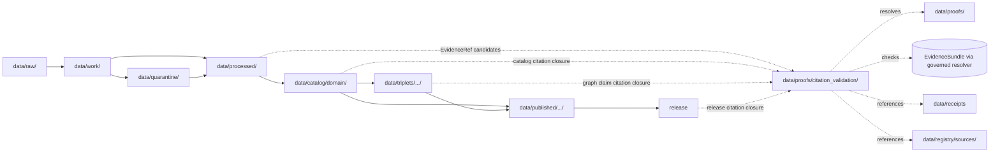

<!-- [KFM_META_BLOCK_V2]
doc_id: kfm://doc/data-proofs-citation-validation-readme
title: data/proofs/citation_validation/README.md — Citation Validation Proofs README
version: v0.1
type: readme; proof-family-guide; citation-validation-lane; evidence-bundle-resolution-lane; governed-answer-support-lane; cross-domain-proof-index
status: draft; PROPOSED; data-root; proofs-root; citation-validation; evidence-bundle; evidence-ref; citation-closure; cite-or-abstain; source-role-aware; sensitivity-aware; release-gated; evidence-first
authors: ChatGPT-5.5 Thinking; reviewed_by: OWNER_TBD
owners: OWNER_TBD — Evidence steward · Citation validation steward · Proof steward · Policy steward · Release steward · UI/Evidence Drawer steward · Domain stewards · Docs steward
created: NEEDS VERIFICATION — greenfield stub existed before v0.1 expansion
updated: 2026-06-25
policy_label: public-doc; data; proofs; citation-validation; evidence; lifecycle; governed; release-gated
tags: [kfm, data, proofs, citation-validation, EvidenceBundle, EvidenceRef, EvidenceDrawerPayload, DecisionEnvelope, cite-or-abstain, claim-resolution, citation-closure, proof, claim-support, digest-closure, SourceDescriptor, CatalogMatrix, ReleaseManifest, ReviewRecord, CorrectionNotice, RollbackCard, PolicyDecision, ValidationReport, RedactionReceipt, SourceDescriptor, RAW, WORK, QUARANTINE, PROCESSED, CATALOG, TRIPLET, PUBLISHED, atmosphere, flora, sensitivity, source-role, finite-outcomes]
related:
  - ../README.md
  - ../../README.md
  - atmosphere/README.md
  - flora/README.md
  - ../atmosphere/README.md
  - ../atmosphere/pm25_2026/README.md
  - ../flora/README.md
  - ../../catalog/domain/
  - ../../processed/
  - ../../receipts/
  - ../../registry/sources/
  - ../../published/
  - ../../triplets/
  - ../../../docs/architecture/ui/EVIDENCE_DRAWER.md
  - ../../../docs/architecture/evidence-drawer.md
  - ../../../docs/architecture/governed-ai/BOUNDARIES.md
  - ../../../schemas/contracts/v1/ui/evidence_drawer_payload.schema.json
  - ../../../schemas/contracts/v1/evidence/evidence_bundle.schema.json
  - ../../../policy/
  - ../../../release/
  - ../../../tools/validators/
notes:
  - "This file replaces a greenfield stub at `data/proofs/citation_validation/README.md`."
  - "This is the parent citation-validation proof-family guide under `data/proofs/`. It supports EvidenceRef → EvidenceBundle resolution checks, citation closure, finite negative outcomes, and governed answer readiness. It is not RAW source storage, WORK scratch, QUARANTINE holding, PROCESSED data, CATALOG, TRIPLET, PUBLISHED output, receipt storage, source registry, policy authority, release authority, schema home, validator home, public API/UI output, public map/tile output, legal/medical/safety advice, or public claim text."
  - "Citation-validation proof artifacts may reference EvidenceBundle, SourceDescriptor, ReleaseManifest, PolicyDecision, ValidationReport, ReviewRecord, CorrectionNotice, RedactionReceipt, and RollbackCard records; they do not own those records."
  - "The `atmosphere/` and `flora/` child citation-validation lanes are confirmed present and expanded. Other child lanes are PROPOSED until verified."
  - "Global citation-validation schema, validator, fixtures, route behavior, and CI enforcement were not verified in this task and remain NEEDS VERIFICATION."
  - "This README is a proof-family guide only. Contracts define semantic object meaning; schemas define machine shape; policy decides admissibility; release records decide publication."
  - "Rollback target for this expansion is previous greenfield stub blob SHA `6561589ffb1b1298174b89a2a32eea7449a104f5`."
[/KFM_META_BLOCK_V2] -->

<a id="top"></a>

# data/proofs/citation_validation

> Parent citation-validation proof family for checking that claims, EvidenceRefs, citations, release state, source role, sensitivity posture, correction lineage, and rollback posture resolve before governed answer surfaces, Evidence Drawer payloads, catalog claims, triplet claims, or public surfaces can cite them.

<p>
  
  
  
  
  
  
</p>

**Status:** draft / PROPOSED  
**Owners:** OWNER_TBD — Evidence steward · Citation validation steward · Proof steward · Policy steward · Release steward · UI/Evidence Drawer steward · Domain stewards · Docs steward  
**Path:** `data/proofs/citation_validation/README.md`  
**Owning root:** `data/proofs/`  
**Proof family segment:** `citation_validation`  
**Lifecycle role:** citation-validation proof support referenced by claim-resolution, Evidence Drawer payloads, catalog records, triplets, release candidates, corrections, rollbacks, and governed answer surfaces; not a lifecycle phase substitute  
**Exposure posture:** not public by default; public use requires governed projection, policy/review state, release state, correction path, and rollback target.  
**Truth posture:** CONFIRMED target was a greenfield stub · CONFIRMED `atmosphere/` and `flora/` child citation-validation READMEs exist and are expanded · CONFIRMED Evidence Drawer doctrine requires resolvable EvidenceBundle support and citation validation behind the governed API · PROPOSED parent proof-family details and child-lane index · NEEDS VERIFICATION for global citation-validation schema, validator, fixtures, proof inventory, access controls, release linkage, and governed route behavior.

**Quick jumps:** [Purpose](#purpose) · [Lifecycle relationship](#lifecycle-relationship) · [Repo fit](#repo-fit) · [Lane index](#lane-index) · [Accepted contents](#accepted-contents) · [Exclusions](#exclusions) · [Citation-validation requirements](#citation-validation-requirements) · [Citation guardrails](#citation-guardrails) · [Evidence ledger](#evidence-ledger) · [Validation checklist](#validation-checklist) · [Rollback](#rollback)

---

## Purpose

`data/proofs/citation_validation/` is a parent proof-family lane for validating citations and EvidenceRef resolution before a claim is rendered, cataloged for release, projected into triplets, shown in the Evidence Drawer, summarized by Focus Mode, or exposed through any governed answer surface.

This lane may contain or reference proof support for:

- EvidenceRef → EvidenceBundle resolution checks;
- citation-closure manifests that verify source, evidence, catalog, triplet, receipt, policy, release, correction, and rollback references are resolvable;
- claim-to-citation proof summaries for domain objects and cross-lane joins;
- negative-state proof support explaining why a governed answer must `ABSTAIN`, `DENY`, `HOLD`, or `ERROR` instead of answering;
- source-role, sensitivity, rights, freshness, caveat, redaction, release, correction, supersession, and rollback validation;
- release-linked citation checks for Evidence Drawer payloads, public map popups, Focus Mode summaries, report cards, and downstream release packages.

This lane does not create, store, or decide the underlying lifecycle data, EvidenceBundles, catalog records, triplets, receipts, policy decisions, release decisions, public maps, public answer text, medical/legal/safety advice, access decisions, or stewardship decisions. It validates citation readiness; it does not publish claims.

## Lifecycle relationship

```text
RAW -> WORK / QUARANTINE -> PROCESSED -> CATALOG / TRIPLET -> PUBLISHED
                           \-> data/proofs/citation_validation supports citation closure
```



Citation-validation proofs support catalog, triplet, release, correction, rollback, Evidence Drawer, and governed answers. They do not publish anything by themselves.

## Repo fit

| Responsibility | Correct home | Rule |
|---|---|---|
| Raw source payloads | `data/raw/<domain>/` | Not this lane. |
| Work/scratch transforms, QA experiments, notebooks, or redaction trials | `data/work/<domain>/` | Not this lane. |
| Quarantined rights/source-role/sensitivity/release-unclear material | `data/quarantine/<domain>/` | Not this lane. |
| Normalized processed artifacts | `data/processed/<domain>/` | Not this lane. |
| Catalog records | `data/catalog/domain/<domain>/` and related STAC/DCAT/PROV lanes | Catalog, not citation-validation storage. |
| Triplets/graph records | `data/triplets/.../<domain>/` | Graph projection, not citation-validation storage. |
| Domain proof support | `data/proofs/<domain>/` | Domain proof lane, if present or ADR-resolved. |
| Citation-validation proof support | `data/proofs/citation_validation/<domain>/` | Child lanes under this family. |
| EvidenceBundle records or canonical evidence store | ADR-resolved evidence/proof home | This lane validates references; it should not silently become the canonical evidence store. |
| Receipts and review records | `data/receipts/` | Referenced by validation records; not stored here. |
| Source registry records | `data/registry/sources/<domain>/` | SourceDescriptor/source-admission authority. |
| Published public-safe outputs | `data/published/.../<domain>/` | Downstream after release only. |
| Release candidates and release manifests | `release/candidates/<domain>/`, `release/` | Publication authority, not citation-validation storage. |
| Contracts | `contracts/domains/<domain>/` or ADR-resolved segment | Semantic meaning; not proof artifacts. |
| Schemas | `schemas/contracts/v1/...` and UI/evidence schema homes | Machine shape; not proof artifacts. |
| Policy | `policy/domains/<domain>/`, `policy/sensitivity/<domain>/`, or ADR-resolved homes | Admissibility authority; not proof artifacts. |
| Validators, tests, fixtures, pipelines, apps, packages | `tools/validators/`, `tests/`, `fixtures/`, `pipelines/`, `apps/`, `packages/` | Separate roots. |

## Lane index

Known child lanes under `data/proofs/citation_validation/` are listed below. Treat entries as **PROPOSED** unless current child READMEs, validators, fixtures, policies, receipts, access controls, and CI enforcement have been verified in the same implementation pass.

| Lane | Scope | Purpose | Hard boundary |
|---|---|---|---|
| `atmosphere/` | Atmosphere / air | Citation validation for Atmosphere claims, EvidenceRefs, source role, caveats, freshness, release state, and governed answer readiness. | Not AQI advisory service, medical advice, regulatory-exceedance authority, or public output. |
| `flora/` | Flora / plants | Citation validation for botanical claims, rare/protected/culturally sensitive flora, redaction/generalization posture, release state, and governed answer readiness. | Not rare-plant discovery surface, exact-location disclosure, or stewardship decision authority. |
| `agriculture/` | PROPOSED | Citation validation for crop/yield/field/aggregate claims. | Aggregate evidence must not become field/operator truth. |
| `archaeology/` | PROPOSED | Citation validation for archaeology and cultural-heritage claims. | Exact site and cultural-sovereignty contexts fail closed. |
| `fauna/` | PROPOSED | Citation validation for animal occurrences, ranges, and sensitive fauna sites. | Sensitive nest/den/roost/spawning locations fail closed. |
| `habitat/` | PROPOSED | Citation validation for habitat surfaces and suitability claims. | Habitat suitability is not occurrence truth by itself. |
| `hazards/` | PROPOSED | Citation validation for hazard claims. | Not emergency warning or life-safety authority. |
| `hydrology/` | PROPOSED | Citation validation for water/hydro claims. | Gauge, model, regulatory, and warning roles remain distinct. |
| `people-dna-land/` | PROPOSED | Citation validation for person/land/DNA-sensitive claims. | Living-person, DNA, title, and private joins fail closed. |
| `roads-rail-trade/` | PROPOSED | Citation validation for route, segment, facility, and transport claims. | Not routing, operations, security, or legal road-status authority. |
| `settlements-infrastructure/` | PROPOSED | Citation validation for settlement, facility, infrastructure, and dependency claims. | Critical assets and dependency graphs restricted by default. |
| `soil/` | PROPOSED | Citation validation for soil survey, component, horizon, property, moisture, suitability, and erosion claims. | Support types must not collapse. |

## Accepted contents

Citation-validation proof artifacts may include:

- citation-closure manifests for domain claims;
- EvidenceRef resolution check outputs that point to EvidenceBundle/proof context without duplicating it;
- claim-to-citation maps for catalog records, triplets, Evidence Drawer payloads, release candidates, and governed answer examples;
- negative-state support records explaining `ABSTAIN`, `DENY`, `HOLD`, or `ERROR` outcomes for missing, stale, conflicting, restricted, unreleased, sensitivity-unsafe, role-collapsed, caveat-missing, or rights-unclear citations;
- source-role, sensitivity, rights, freshness, caveat, redaction, policy, release, correction, supersession, and rollback closure summaries;
- cross-lane validation summaries that preserve ownership, source role, sensitivity, and EvidenceBundle support for every side of a relation;
- lane-local README or index notes that explain citation-validation boundaries without becoming public outputs or authority records.

## Exclusions

Do not store these under `data/proofs/citation_validation/`:

- RAW, WORK, QUARANTINE, PROCESSED, CATALOG, TRIPLET, or PUBLISHED data artifacts.
- EvidenceBundle records as the canonical evidence store, unless an ADR explicitly makes this lane a projection home.
- RunReceipt, TransformReceipt, ValidationReport, PolicyDecision, ReviewRecord, RedactionReceipt, ReleaseManifest, RollbackCard, CorrectionNotice, WithdrawalNotice, AIReceipt, or release signatures as primary receipt/release records.
- SourceDescriptor/source registry records.
- Contracts, schemas, policy bundles, validators, tests, fixtures, pipelines, app/UI/API code, packages, notebooks, or executable tooling.
- Public map/tile/API/UI payloads, Focus Mode answer payloads, direct downloads, model-answer text, release manifests, signatures, changelogs, or published products.
- Hidden coordinates, sensitive ecology records, archaeology locations, living-person data, DNA/private parcel joins, critical infrastructure detail, redaction parameters, transform offsets, aggregation thresholds that should not be exposed, credentials, secrets, or access instructions.
- Claims that convert generated text into evidence, suitability into occurrence, model fields into observations, aggregate evidence into individual truth, or context into emergency/legal/medical/safety instructions.

## Citation-validation requirements

PROPOSED until concrete citation-validation schemas, validators, fixtures, and route behavior are verified:

| Requirement | Meaning |
|---|---|
| EvidenceRef resolution | Each checked claim should identify every EvidenceRef and whether it resolves to an allowed EvidenceBundle/proof target. |
| Citation closure | SourceDescriptor, EvidenceBundle, processed artifact, catalog row, triplet, receipt, policy, release, correction, and rollback references should resolve or produce a finite negative state. |
| Claim scope | Validation should record the exact claim being supported, including object family, time, location/generalization, source role, sensitivity posture, and review posture. |
| Source-role preservation | Observed, regulatory, modeled, aggregate, administrative, candidate, synthetic, and domain-specific roles must not be interchangeable. |
| Sensitivity preservation | Sensitive ecology, archaeology, living-person, DNA, cultural, sovereignty, critical-infrastructure, private-land, and access-risk caveats should remain attached to citations. |
| Release posture | Public-facing citation validation should verify release state, policy-safe representation, correction path, rollback target, and current/non-withdrawn posture. |
| Negative outcomes | Missing, stale, conflicting, restricted, unreleased, role-collapsed, sensitivity-unsafe, redaction-missing, caveat-missing, or source-rights-unclear citations should produce `ABSTAIN`, `DENY`, `HOLD`, or `ERROR`, not an uncited answer. |
| UI projection boundary | Evidence Drawer and Focus Mode should consume governed projection payloads, not canonical stores or raw proof files directly. |
| No public surface by default | Citation-validation proof files are not direct public APIs, tiles, downloads, Focus Mode answers, or model-answer sources. |

## Citation guardrails

- Citation-validation records support citation closure; they are not source data, processed data, receipts, catalog records, release manifests, or public products.
- EvidenceBundle outranks generated summaries.
- If a claim lacks resolvable citation support, the safe outcome is `ABSTAIN`, `DENY`, `HOLD`, or `ERROR`, not an uncited answer.
- Public citations should point to released, policy-safe, review-backed, generalized, redacted, staged, or denied representations as required; they must not expose restricted originals.
- Cross-lane citations must preserve each owning lane's authority, source role, sensitivity, and EvidenceBundle support.
- AI summaries may reference only governed, released, evidence-supported surfaces and must preserve sensitivity posture; AI text is not citation proof.
- Public clients and Focus Mode must use governed APIs, released artifacts, catalog/triplet records, EvidenceBundle-backed payloads, and policy-safe envelopes, not this directory directly.

> [!CAUTION]
> Do not expose `data/proofs/citation_validation/` directly as a public map, API, UI, download, Focus Mode answer, AI answer source, discovery surface for sensitive resources, legal/medical/safety guidance, emergency alert, or release authority. Citation-validation proofs support governed evidence closure; they do not publish claims by themselves.

## Evidence ledger

| Source | Status | Supports | Limits |
|---|---|---|---|
| Previous file | CONFIRMED | Target existed as a greenfield stub. | Did not define citation-validation boundaries or child lanes. |
| `data/proofs/citation_validation/atmosphere/README.md` | CONFIRMED child README | Atmosphere child citation-validation lane exists, supports EvidenceRef/EvidenceBundle closure, and excludes public AQI/advisory/medical/safety surfaces. | Does not prove global validator behavior. |
| `data/proofs/citation_validation/flora/README.md` | CONFIRMED child README | Flora child citation-validation lane exists, supports sensitive-location citation validation, and excludes rare-plant discovery/exact-location disclosure surfaces. | Does not prove global validator behavior. |
| `docs/architecture/ui/EVIDENCE_DRAWER.md` | CONFIRMED doctrine / PROPOSED implementation | Evidence Drawer requires cite-or-abstain, governed API claim resolution, EvidenceBundle resolution, policy gate, citation validation, finite negative states, and no direct browser access to canonical stores. | Does not prove implementation, route names, schemas, or validators. |
| `data/proofs/README.md` | NEEDS VERIFICATION | Expected global proof-root guide. | It is still a greenfield stub unless separately expanded. |
| `schemas/contracts/v1/ui/evidence_drawer_payload.schema.json` and `schemas/contracts/v1/evidence/evidence_bundle.schema.json` | NEEDS VERIFICATION | Expected UI/evidence machine-shape homes. | Current schema contents and validator behavior were not verified in this task. |
| `tools/validators/` | NEEDS VERIFICATION | Expected validator root. | Citation-validation validator behavior was not verified in this task. |

## Validation checklist

- [ ] Confirm actual child files and citation-validation proof inventory under `data/proofs/citation_validation/`.
- [ ] Expand or reconcile parent `data/proofs/README.md` beyond stub.
- [ ] Confirm whether citation-validation proof files are concrete records here, indexes pointing to global proof stores, or generated artifacts linked from governed API tests/catalog/release.
- [ ] Confirm EvidenceBundle, EvidenceRef, EvidenceDrawerPayload, DecisionEnvelope, citation-validation report, proof index, claim-support, digest-closure, sensitivity-proof, redaction-proof, source-role proof, and proof-invalidation schemas and contract homes.
- [ ] Confirm validators, fixtures, CI checks, EvidenceRef resolution checks, source-role checks, sensitivity checks, caveat checks, redaction/generalization checks, release-link checks, negative-state checks, and access-control enforcement.
- [ ] Confirm citation-validation references to RunReceipt, TransformReceipt, ValidationReport, PolicyDecision, ReviewRecord, RedactionReceipt, ReleaseManifest, RollbackCard, CorrectionNotice, WithdrawalNotice, and AIReceipt are pointers, not misplaced records.
- [ ] Confirm hidden coordinates, sensitive ecology records, archaeology locations, living-person data, DNA/private parcel joins, critical infrastructure detail, redaction parameters, transform offsets, credentials, secrets, access instructions, and release-unclear artifacts cannot pass citation validation into public routes.
- [ ] Confirm public-candidate transitions are governed, evidence-backed, citation-safe, source-role-safe, rights-safe, sensitivity-safe, redaction-safe, review-backed, release-linked, and reversible.
- [ ] Confirm no RAW, WORK, QUARANTINE, PROCESSED, CATALOG, TRIPLET, PUBLISHED, receipt, registry, release, schema, policy, validator, package, pipeline, app, API, public map, public tile, direct download, Focus Mode answer, sensitive discovery surface, legal/medical/safety guidance, emergency alert, or release-authority artifact is misplaced here.
- [ ] Confirm public clients and Focus Mode cannot read this lane directly as public truth, public domain service, public map, public tile, public API, public UI, or AI-answer source.

## Rollback

Rollback is required if this lane becomes a RAW source-data root, WORK scratch root, QUARANTINE bypass, PROCESSED substitute, catalog root, triplet root, public output root, `data/published/` substitute, receipt store, source-registry root, release-decision root, schema root, policy root, validator root, implementation root, direct public API shortcut, direct public UI shortcut, direct public tile shortcut, direct public exposure shortcut, EvidenceBundle authority root without ADR, citation-bypass path, sensitive-location exposure path, redaction-bypass path, model-as-observation path, aggregate-as-individual-truth path, proof-without-evidence path, uncited-AI-answer source, legal/medical/safety advice surface, emergency alert, or release-authority shortcut.

Rollback target for this expansion: previous greenfield stub blob SHA `6561589ffb1b1298174b89a2a32eea7449a104f5`.

<p align="right"><a href="#top">Back to top</a></p>
