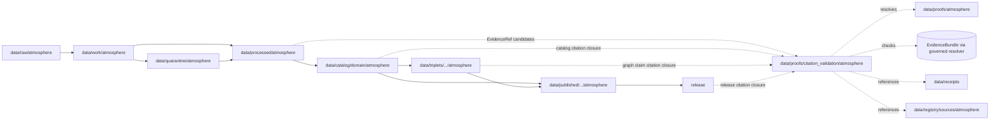

<!-- [KFM_META_BLOCK_V2]
doc_id: kfm://doc/data-proofs-citation-validation-atmosphere-readme
title: data/proofs/citation_validation/atmosphere/README.md — Atmosphere Citation Validation Proofs README
version: v0.1
type: readme; proof-lane-guide; citation-validation-lane; evidence-bundle-resolution-lane; atmosphere-domain-proof-index; governed-answer-support-lane
status: draft; PROPOSED; data-root; proofs-root; citation-validation; atmosphere; evidence-bundle; evidence-ref; citation-closure; cite-or-abstain; source-role-aware; caveat-aware; release-gated; evidence-first
authors: ChatGPT-5.5 Thinking; reviewed_by: OWNER_TBD
owners: OWNER_TBD — Atmosphere steward · Evidence steward · Citation validation steward · Proof steward · Policy steward · Release steward · UI/Evidence Drawer steward · Docs steward
created: NEEDS VERIFICATION — blank placeholder existed before v0.1 expansion
updated: 2026-06-25
policy_label: public-doc; data; proofs; citation-validation; atmosphere; evidence; lifecycle; governed; release-gated
tags: [kfm, data, proofs, citation-validation, atmosphere, EvidenceBundle, EvidenceRef, EvidenceDrawerPayload, DecisionEnvelope, cite-or-abstain, claim-resolution, citation-closure, proof, claim-support, digest-closure, SourceDescriptor, CatalogMatrix, ReleaseManifest, ReviewRecord, CorrectionNotice, RollbackCard, PolicyDecision, ValidationReport, PM25Observation, AirObservation, AirStation, OzoneObservation, AODRaster, SmokeContext, ForecastContext, AdvisoryContext, AQI, observed-sensor, public-aqi-report, low-cost-sensor, source-role, caveat, RAW, WORK, QUARANTINE, PROCESSED, CATALOG, TRIPLET, PUBLISHED]
related:
  - ../../README.md
  - ../../../README.md
  - ../../atmosphere/README.md
  - ../../atmosphere/pm25_2026/README.md
  - ../../../catalog/domain/atmosphere/README.md
  - ../../../catalog/domain/atmosphere/pm25_2026/README.md
  - ../../../processed/atmosphere/air_observations/README.md
  - ../../../processed/atmosphere/air_stations/README.md
  - ../../../receipts/
  - ../../../registry/sources/atmosphere/
  - ../../../published/
  - ../../../triplets/
  - ../../../../docs/architecture/ui/EVIDENCE_DRAWER.md
  - ../../../../docs/architecture/evidence-drawer.md
  - ../../../../docs/domains/atmosphere/DATA_LIFECYCLE.md
  - ../../../../docs/domains/atmosphere/CANONICAL_PATHS.md
  - ../../../../docs/domains/atmosphere/OBJECT_FAMILY_MAP.md
  - ../../../../docs/domains/atmosphere/POLICY.md
  - ../../../../docs/domains/atmosphere/PUBLICATION_POSTURE.md
  - ../../../../docs/domains/atmosphere/SENSITIVITY.md
  - ../../../../docs/domains/atmosphere/SOURCE_FAMILIES.md
  - ../../../../docs/domains/atmosphere/SOURCES.md
  - ../../../../docs/domains/atmosphere/API_CONTRACTS.md
  - ../../../../contracts/domains/atmosphere/PM25Observation.md
  - ../../../../contracts/domains/atmosphere/AirObservation.md
  - ../../../../contracts/domains/atmosphere/AirStation.md
  - ../../../../contracts/domains/atmosphere/OzoneObservation.md
  - ../../../../contracts/domains/atmosphere/AODRaster.md
  - ../../../../contracts/domains/atmosphere/SmokeContext.md
  - ../../../../contracts/domains/atmosphere/ForecastContext.md
  - ../../../../contracts/domains/atmosphere/AdvisoryContext.md
  - ../../../../schemas/contracts/v1/domains/atmosphere/
  - ../../../../schemas/contracts/v1/ui/evidence_drawer_payload.schema.json
  - ../../../../schemas/contracts/v1/evidence/evidence_bundle.schema.json
  - ../../../../policy/domains/atmosphere/
  - ../../../../release/candidates/atmosphere/
  - ../../../../release/
  - ../../../../tools/validators/
notes:
  - "This file replaces a blank placeholder at `data/proofs/citation_validation/atmosphere/README.md`."
  - "This is an Atmosphere citation-validation proof lane guide under `data/proofs/`. It supports EvidenceRef → EvidenceBundle resolution checks, citation closure, and governed answer readiness. It is not RAW source storage, WORK scratch, QUARANTINE holding, PROCESSED data, CATALOG, TRIPLET, PUBLISHED output, receipt storage, source registry, policy authority, release authority, schema home, validator home, public API/UI output, public map/tile output, AQI advisory service, medical advice, emergency alert, regulatory-exceedance authority, exposure/impact claim surface, or life-safety guidance."
  - "Citation-validation proof artifacts may reference EvidenceBundle, SourceDescriptor, ReleaseManifest, PolicyDecision, ValidationReport, ReviewRecord, CorrectionNotice, and RollbackCard records; they do not own those records."
  - "Atmosphere citation validation must preserve source-role and caveat boundaries: observed sensor readings, public AQI/report posture, low-cost sensor records, regulatory/archive posture, AOD/smoke proxies, model fields, forecasts, and advisory context are not interchangeable citations."
  - "Repo search did not find a dedicated citation-validation proof pattern in this task; this README is therefore PROPOSED and should be reconciled with any future global citation-validation proof contract."
  - "This README is a proof-lane guide only. Contracts define semantic object meaning; schemas define machine shape; policy decides admissibility; release records decide publication."
  - "Rollback target for this expansion is previous blank placeholder blob SHA `8b137891791fe96927ad78e64b0aad7bded08bdc`."
[/KFM_META_BLOCK_V2] -->

<a id="top"></a>

# data/proofs/citation_validation/atmosphere

> Atmosphere citation-validation proof lane for checking that Atmosphere claims, EvidenceRefs, citations, release state, source role, caveats, and correction/rollback posture resolve before a governed answer, Evidence Drawer payload, catalog claim, triplet claim, or public surface can cite them.

<p>
  
  
  
  
  
  
</p>

**Status:** draft / PROPOSED  
**Owners:** OWNER_TBD — Atmosphere steward · Evidence steward · Citation validation steward · Proof steward · Policy steward · Release steward · UI/Evidence Drawer steward · Docs steward  
**Path:** `data/proofs/citation_validation/atmosphere/README.md`  
**Owning root:** `data/proofs/`  
**Proof family segment:** `citation_validation`  
**Domain segment:** `atmosphere`  
**Lifecycle role:** citation-validation proof support referenced by claim-resolution, Evidence Drawer payloads, catalog records, triplets, release candidates, corrections, rollbacks, and governed answer surfaces; not a lifecycle phase substitute  
**Exposure posture:** not public by default; public use requires governed projection, policy/review state, release state, correction path, and rollback target.  
**Truth posture:** CONFIRMED target was a blank placeholder · CONFIRMED Atmosphere parent proof README exists and defines proof support as EvidenceBundle/EvidenceRef closure rather than public output · CONFIRMED Evidence Drawer doctrine requires resolvable EvidenceBundle support and citation validation behind the governed API · CONFIRMED PM25Observation contract separates source-role/caveat boundaries · PROPOSED citation-validation lane details · NEEDS VERIFICATION for actual citation-validation schema, validator, fixtures, proof inventory, access controls, release linkage, and governed route behavior.

**Quick jumps:** [Purpose](#purpose) · [Lifecycle relationship](#lifecycle-relationship) · [Repo fit](#repo-fit) · [Accepted contents](#accepted-contents) · [Exclusions](#exclusions) · [Citation-validation requirements](#citation-validation-requirements) · [Atmosphere citation guardrails](#atmosphere-citation-guardrails) · [Directory map](#directory-map) · [Evidence ledger](#evidence-ledger) · [Validation checklist](#validation-checklist) · [Rollback](#rollback)

---

## Purpose

`data/proofs/citation_validation/atmosphere/` is a specialized proof lane for validating Atmosphere citations and EvidenceRef resolution before a claim is rendered, cataloged for release, projected into triplets, shown in the Evidence Drawer, summarized by Focus Mode, or exposed through any governed answer surface.

This lane may contain or reference proof support for:

- EvidenceRef → EvidenceBundle resolution checks for Atmosphere claims;
- citation-closure manifests that verify source, evidence, catalog, triplet, receipt, policy, release, correction, and rollback references are resolvable;
- claim-to-citation proof summaries for AirObservation, AirStation, PM25Observation, OzoneObservation, AODRaster, SmokeContext, ForecastContext, and AdvisoryContext claims;
- negative-state proof support explaining why a governed answer must `ABSTAIN`, `DENY`, `HOLD`, or `ERROR` instead of answering;
- source-role/caveat validation for PM2.5, ozone, AQI/report posture, low-cost sensors, AOD/smoke proxies, model fields, forecasts, and advisory context;
- release-linked citation checks for Evidence Drawer payloads, public map popups, Focus Mode summaries, report cards, and downstream release packages.

This lane does not create, store, or decide the underlying Atmosphere data, evidence bundles, catalog records, triplets, receipts, policy decisions, release decisions, public AQI payloads, public maps, medical advice, emergency alerts, regulatory determinations, or life-safety instructions. It validates citation readiness; it does not publish claims.

## Lifecycle relationship

```text
RAW -> WORK / QUARANTINE -> PROCESSED -> CATALOG / TRIPLET -> PUBLISHED
                           \-> data/proofs/citation_validation/atmosphere supports citation closure
```



Citation-validation proofs support catalog, triplet, release, correction, rollback, Evidence Drawer, and governed answers. They do not publish anything by themselves.

## Repo fit

| Responsibility | Correct home | Rule |
|---|---|---|
| Raw Atmosphere source payloads | `data/raw/atmosphere/` | Not this lane. |
| Work/scratch transforms or QA experiments | `data/work/atmosphere/` | Not this lane. |
| Quarantined rights/source-role/freshness/caveat/release-unclear material | `data/quarantine/atmosphere/` | Not this lane. |
| Normalized Atmosphere processed artifacts | `data/processed/atmosphere/` | Not this lane. |
| Atmosphere catalog records | `data/catalog/domain/atmosphere/` | Catalog, not citation-validation storage. |
| Atmosphere triplets/graph records | `data/triplets/.../atmosphere/` | Graph projection, not citation-validation storage. |
| General Atmosphere proof support | `data/proofs/atmosphere/` | Domain proof lane. |
| Atmosphere citation-validation proof support | `data/proofs/citation_validation/atmosphere/` | This lane. |
| PM2.5 2026 dataset proof support | `data/proofs/atmosphere/pm25_2026/` | Dataset proof lane; may be checked by this lane. |
| EvidenceBundle records or canonical evidence store | ADR-resolved evidence/proof home | This lane validates references; it should not silently become the canonical evidence store. |
| Receipts | `data/receipts/` | Referenced by validation records; not stored here. |
| Source registry records | `data/registry/sources/atmosphere/` | SourceDescriptor/source-admission authority. |
| Published public-safe outputs | `data/published/.../atmosphere/` | Downstream after release only. |
| Release candidates and release manifests | `release/candidates/atmosphere/`, `release/` | Publication authority, not citation-validation storage. |
| Atmosphere contracts | `contracts/domains/atmosphere/` | Semantic meaning; not proof artifacts. |
| Atmosphere schemas | `schemas/contracts/v1/domains/atmosphere/` and UI/evidence schema homes | Machine shape; not proof artifacts. |
| Atmosphere policy | `policy/domains/atmosphere/` | Admissibility authority; not proof artifacts. |
| Validators, tests, fixtures, pipelines, apps, packages | `tools/validators/`, `tests/`, `fixtures/`, `pipelines/`, `apps/`, `packages/` | Separate roots. |

## Accepted contents

Atmosphere citation-validation proof artifacts may include:

- citation-closure manifests for Atmosphere claims;
- EvidenceRef resolution check outputs that point to EvidenceBundle/proof context without duplicating it;
- claim-to-citation maps for catalog records, triplets, Evidence Drawer payloads, release candidates, and governed answer examples;
- negative-state support records explaining `ABSTAIN`, `DENY`, `HOLD`, or `ERROR` outcomes for missing, stale, conflicting, restricted, unreleased, or role-collapsed citations;
- source-role validation summaries for observed sensor, public AQI/report, low-cost sensor, regulatory/archive, AOD/smoke proxy, model, forecast, and advisory-context claims;
- citation freshness, units, averaging window, QA/correction, caveat, release, correction, supersession, and rollback closure summaries;
- lane-local README or index notes that explain citation-validation boundaries without becoming public outputs or authority records.

## Exclusions

Do not store these under `data/proofs/citation_validation/atmosphere/`:

- RAW, WORK, QUARANTINE, PROCESSED, CATALOG, TRIPLET, or PUBLISHED data artifacts.
- EvidenceBundle records as the canonical evidence store, unless an ADR explicitly makes this lane a projection home.
- RunReceipt, TransformReceipt, ValidationReport, PolicyDecision, ReviewRecord, ReleaseManifest, RollbackCard, CorrectionNotice, WithdrawalNotice, AIReceipt, or release signatures as primary receipt/release records.
- SourceDescriptor/source registry records.
- Contracts, schemas, policy bundles, validators, tests, fixtures, pipelines, app/UI/API code, packages, notebooks, or executable tooling.
- Public AQI/map/tile/API/UI payloads, Focus Mode answer payloads, direct downloads, model-answer text, release manifests, signatures, changelogs, or published products.
- Health/medical advice, emergency advisories, evacuation guidance, regulatory-exceedance determinations, exposure/impact claims, damages claims, or life-safety instructions.
- Claims that turn AQI/report posture into raw concentration, low-cost sensor records into reference-grade concentration without caveats, AOD/smoke proxies into PM2.5/ozone observations, model fields into observed sensor values, or air-quality values into health/action instructions.

## Citation-validation requirements

PROPOSED until concrete citation-validation schemas, validators, fixtures, and route behavior are verified:

| Requirement | Meaning |
|---|---|
| EvidenceRef resolution | Each checked claim should identify every EvidenceRef and whether it resolves to an allowed EvidenceBundle/proof target. |
| Citation closure | SourceDescriptor, EvidenceBundle, processed artifact, catalog row, triplet, receipt, policy, release, correction, and rollback references should resolve or produce a finite negative state. |
| Claim scope | Validation should record the exact claim being supported, including domain object, time, location/generalization, source role, units, averaging window, and caveat posture where applicable. |
| Source-role preservation | Observed sensor, public AQI/report, low-cost sensor, regulatory/archive, model context, AOD/smoke proxy, forecast, and advisory context roles must not be interchangeable. |
| Caveat preservation | Low-cost sensor, model, proxy, stale, corrected, missingness, confidence, station-sensitive, and rights-limited caveats should remain attached to citations. |
| Release posture | Public-facing citation validation should verify release state, correction path, rollback target, and current/non-withdrawn posture. |
| Negative outcomes | Missing, stale, conflicting, restricted, unreleased, role-collapsed, caveat-missing, or source-rights-unclear citations should produce `ABSTAIN`, `DENY`, `HOLD`, or `ERROR`, not an uncited answer. |
| UI projection boundary | Evidence Drawer and Focus Mode should consume governed projection payloads, not canonical stores or raw proof files directly. |
| No public surface by default | Citation-validation proof files are not direct public APIs, tiles, downloads, Focus Mode answers, or model-answer sources. |

## Atmosphere citation guardrails

- Citation-validation records support citation closure; they are not source data, processed data, receipts, catalog records, release manifests, or public products.
- EvidenceBundle outranks generated summaries.
- If an Atmosphere claim lacks resolvable citation support, the safe outcome is `ABSTAIN`, `DENY`, `HOLD`, or `ERROR`, not an uncited answer.
- Citation validation must preserve concentration, AQI/report posture, low-cost sensor, regulatory/archive, AOD/smoke proxy, model, forecast, and advisory context distinctions.
- AQI/report posture must not be cited as raw pollutant concentration.
- AOD rasters, smoke masks, and model fields must not be cited as observed PM2.5 or ozone measurements.
- Low-cost sensor values require caveat, correction, confidence, limitation, source-rights, policy, and review posture before public use.
- Citation validation does not create emergency, medical, life-safety, regulatory, exposure, damages, or impact conclusions by itself.
- AI summaries may reference only governed, released, evidence-supported surfaces and must preserve source-role and caveat posture; AI text is not citation proof.
- Public clients and Focus Mode must use governed APIs, released artifacts, catalog/triplet records, EvidenceBundle-backed payloads, and policy-safe envelopes, not this directory directly.

> [!CAUTION]
> Do not expose `data/proofs/citation_validation/atmosphere/` directly as a public map, API, UI, download, Focus Mode answer, AI answer source, AQI advisory service, health/medical advice source, regulatory-exceedance determination, emergency alert, or life-safety product. Citation-validation proofs support governed evidence closure; they do not publish Atmosphere claims by themselves.

## Directory map

Actual child inventory remains **NEEDS VERIFICATION**. Use this as a proposed local organization pattern only after confirming current repo convention and validators.

```text
data/proofs/citation_validation/atmosphere/
├── README.md
├── evidence_ref_resolution/  # PROPOSED — EvidenceRef resolution check outputs
├── claim_citations/          # PROPOSED — claim-to-citation closure manifests
├── negative_states/          # PROPOSED — ABSTAIN / DENY / HOLD / ERROR support
├── source_roles/             # PROPOSED — source-role anti-collapse validation
├── caveats/                  # PROPOSED — caveat/freshness/QA/correction citation checks
├── releases/                 # PROPOSED — release-linked citation closure pointers
├── evidence_drawer/          # PROPOSED — EvidenceDrawerPayload citation validation examples
├── focus_mode/               # PROPOSED — governed AI citation validation examples
├── validation/               # PROPOSED — lane-local validation notes, not ValidationReport authority
└── _README_TODO.md           # PROPOSED — remove after actual child inventory is documented
```

## Evidence ledger

| Source | Status | Supports | Limits |
|---|---|---|---|
| Previous file | CONFIRMED | Target existed as a blank placeholder. | Did not define Atmosphere citation-validation boundaries. |
| Repository search | CONFIRMED | Search did not find a dedicated citation-validation proof README pattern; found Evidence Drawer and domain pipeline references. | Search is not a full tree audit. |
| `data/proofs/atmosphere/README.md` | CONFIRMED current repo doc / PROPOSED implementation | Defines Atmosphere proof support as EvidenceBundle/EvidenceRef closure and explicitly excludes public outputs, receipts, policy, release authority, schemas, and validators. | Does not prove citation-validation schema or validator behavior. |
| `docs/architecture/ui/EVIDENCE_DRAWER.md` | CONFIRMED doctrine / PROPOSED implementation | Evidence Drawer requires cite-or-abstain, governed API claim resolution, EvidenceBundle resolution, policy gate, citation validation, and finite negative states. | Does not prove implementation, route names, schemas, or validators. |
| `contracts/domains/atmosphere/PM25Observation.md` | CONFIRMED semantic contract | Defines PM25Observation meaning and boundaries for concentration, AQI/report posture, low-cost sensors, AOD/model/advisory boundaries, evidence proof, and release. | Contract does not prove citation-validation enforcement or public release. |
| `policy/domains/atmosphere/` | NEEDS VERIFICATION | Expected admissibility home. | Current policy files and enforcement were not verified in this task. |
| `schemas/contracts/v1/ui/evidence_drawer_payload.schema.json` and `schemas/contracts/v1/evidence/evidence_bundle.schema.json` | NEEDS VERIFICATION | Expected UI/evidence machine-shape homes. | Current schema contents and validator behavior were not verified in this task. |

## Validation checklist

- [ ] Confirm actual child files and citation-validation proof inventory under `data/proofs/citation_validation/atmosphere/`.
- [ ] Expand or reconcile parent `data/proofs/README.md`, `data/proofs/citation_validation/README.md`, and `data/proofs/atmosphere/README.md` as needed.
- [ ] Confirm whether citation-validation proof files are concrete records here, indexes pointing to global proof stores, or generated artifacts linked from governed API tests/catalog/release.
- [ ] Confirm EvidenceBundle, EvidenceRef, EvidenceDrawerPayload, DecisionEnvelope, citation-validation report, proof index, claim-support, digest-closure, QA/freshness proof, source-role proof, and proof-invalidation schemas and contract homes.
- [ ] Confirm validators, fixtures, CI checks, EvidenceRef resolution checks, source-role checks, units checks, averaging-window checks, QA/correction checks, low-cost caveat checks, freshness checks, release-link checks, negative-state checks, and access-control enforcement.
- [ ] Confirm citation-validation references to RunReceipt, TransformReceipt, ValidationReport, PolicyDecision, ReviewRecord, ReleaseManifest, RollbackCard, CorrectionNotice, WithdrawalNotice, and AIReceipt are pointers, not misplaced records.
- [ ] Confirm AQI-as-concentration, AOD-as-PM2.5, model-as-observed, low-cost-without-caveat, stale-without-freshness, rights-unclear, source-role-unclear, health/action claims, emergency/advisory claims, and release-unclear artifacts cannot pass citation validation into public routes.
- [ ] Confirm public-candidate transitions are governed, evidence-backed, citation-safe, source-role-safe, units-safe, caveat-safe, rights-safe, freshness-safe, policy-safe, review-backed, release-linked, and reversible.
- [ ] Confirm no RAW, WORK, QUARANTINE, PROCESSED, CATALOG, TRIPLET, PUBLISHED, receipt, registry, release, schema, policy, validator, package, pipeline, app, API, public map, public tile, direct download, Focus Mode answer, advisory service, health/medical advice, regulatory-exceedance determination, emergency alert, or life-safety artifact is misplaced here.
- [ ] Confirm public clients and Focus Mode cannot read this lane directly as public truth, public Atmosphere service, public AQI service, public map, public tile, public API, public UI, or AI-answer source.

## Rollback

Rollback is required if this lane becomes a RAW source-data root, WORK scratch root, QUARANTINE bypass, PROCESSED substitute, catalog root, triplet root, public output root, `data/published/` substitute, receipt store, source-registry root, release-decision root, schema root, policy root, validator root, implementation root, direct public API shortcut, direct public UI shortcut, direct public tile shortcut, direct public exposure shortcut, EvidenceBundle authority root without ADR, citation-bypass path, AQI-as-concentration path, AOD-as-observed-pollutant path, model-as-observed path, low-cost-without-caveat path, stale-without-freshness path, proof-without-evidence path, uncited-AI-answer source, advisory service, health/medical advice surface, regulatory-exceedance determination, emergency alert, or life-safety guidance source.

Rollback target for this expansion: previous blank placeholder blob SHA `8b137891791fe96927ad78e64b0aad7bded08bdc`.

<p align="right"><a href="#top">Back to top</a></p>
