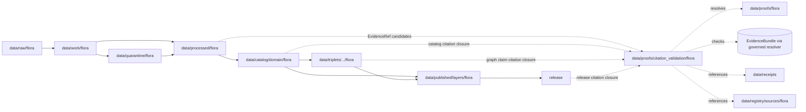

<!-- [KFM_META_BLOCK_V2]
doc_id: kfm://doc/data-proofs-citation-validation-flora-readme
title: data/proofs/citation_validation/flora/README.md — Flora Citation Validation Proofs README
version: v0.1
type: readme; proof-lane-guide; citation-validation-lane; evidence-bundle-resolution-lane; flora-domain-proof-index; governed-answer-support-lane; sensitive-location-citation-lane
status: draft; PROPOSED; data-root; proofs-root; citation-validation; flora; evidence-bundle; evidence-ref; citation-closure; cite-or-abstain; source-role-aware; sensitivity-aware; rare-plant-aware; release-gated; evidence-first
authors: ChatGPT-5.5 Thinking; reviewed_by: OWNER_TBD
owners: OWNER_TBD — Flora steward · Evidence steward · Citation validation steward · Proof steward · Sensitivity reviewer · Policy steward · Release steward · UI/Evidence Drawer steward · Docs steward
created: NEEDS VERIFICATION — blank placeholder existed before v0.1 expansion
updated: 2026-06-25
policy_label: restricted-doc; data; proofs; citation-validation; flora; evidence; sensitivity; lifecycle; governed; release-gated
tags: [kfm, data, proofs, citation-validation, flora, plants, rare-plants, sensitive-location, EvidenceBundle, EvidenceRef, EvidenceDrawerPayload, DecisionEnvelope, cite-or-abstain, claim-resolution, citation-closure, proof, claim-support, digest-closure, SourceDescriptor, CatalogMatrix, ReleaseManifest, ReviewRecord, CorrectionNotice, RollbackCard, PolicyDecision, ValidationReport, PlantTaxon, FloraTaxonCrosswalk, FloraOccurrence, SpecimenRecord, RarePlantRecord, VegetationCommunity, InvasivePlantRecord, PhenologyObservation, RangePolygon, DistributionSurface, HabitatAssociation, BotanicalSurvey, RestorationPlanting, source-role, redaction, generalization, RAW, WORK, QUARANTINE, PROCESSED, CATALOG, TRIPLET, PUBLISHED]
related:
  - ../../README.md
  - ../../../README.md
  - ../../flora/README.md
  - ../../../catalog/domain/flora/
  - ../../../processed/flora/
  - ../../../receipts/
  - ../../../registry/sources/flora/
  - ../../../published/layers/flora/
  - ../../../triplets/
  - ../../../../docs/architecture/ui/EVIDENCE_DRAWER.md
  - ../../../../docs/architecture/evidence-drawer.md
  - ../../../../docs/domains/flora/README.md
  - ../../../../docs/domains/flora/ARCHITECTURE.md
  - ../../../../docs/domains/flora/RELEASE_INDEX.md
  - ../../../../docs/domains/flora/MAP_UI_CONTRACTS.md
  - ../../../../docs/domains/flora/CANONICAL_PATHS.md
  - ../../../../docs/domains/flora/VERIFICATION_BACKLOG.md
  - ../../../../docs/domains/habitat/README.md
  - ../../../../docs/domains/fauna/README.md
  - ../../../../docs/domains/soil/README.md
  - ../../../../docs/domains/hydrology/README.md
  - ../../../../docs/domains/agriculture/README.md
  - ../../../../docs/domains/hazards/README.md
  - ../../../../contracts/domains/flora/
  - ../../../../schemas/contracts/v1/domains/flora/
  - ../../../../schemas/contracts/v1/ui/evidence_drawer_payload.schema.json
  - ../../../../schemas/contracts/v1/evidence/evidence_bundle.schema.json
  - ../../../../policy/domains/flora/
  - ../../../../policy/sensitivity/flora/
  - ../../../../release/candidates/flora/
  - ../../../../release/
  - ../../../../tools/validators/
notes:
  - "This file replaces a blank placeholder at `data/proofs/citation_validation/flora/README.md`."
  - "This is a Flora citation-validation proof lane guide under `data/proofs/`. It supports EvidenceRef → EvidenceBundle resolution checks, citation closure, sensitivity-safe claim validation, and governed answer readiness. It is not RAW source storage, WORK scratch, QUARANTINE holding, PROCESSED data, CATALOG, TRIPLET, PUBLISHED output, receipt storage, source registry, policy authority, release authority, schema home, validator home, public API/UI output, public map/tile output, rare-plant discovery surface, exact-location disclosure surface, landowner/private-access surface, or stewardship decision authority."
  - "Citation-validation proof artifacts may reference EvidenceBundle, SourceDescriptor, ReleaseManifest, PolicyDecision, ValidationReport, ReviewRecord, CorrectionNotice, RedactionReceipt, and RollbackCard records; they do not own those records."
  - "Flora citation validation must preserve sensitive-location posture: rare, protected, culturally sensitive, and steward-reviewed flora default to generalized, withheld, staged, or denied public geometry."
  - "Repo search did not find a dedicated flora citation-validation proof pattern in this task; this README is therefore PROPOSED and should be reconciled with any future global citation-validation proof contract."
  - "This README is a proof-lane guide only. Contracts define semantic object meaning; schemas define machine shape; policy decides admissibility; release records decide publication."
  - "Rollback target for this expansion is previous blank placeholder blob SHA `8b137891791fe96927ad78e64b0aad7bded08bdc`."
[/KFM_META_BLOCK_V2] -->

<a id="top"></a>

# data/proofs/citation_validation/flora

> Flora citation-validation proof lane for checking that botanical claims, EvidenceRefs, citations, release state, source role, sensitivity posture, generalization/redaction posture, correction lineage, and rollback posture resolve before a governed answer, Evidence Drawer payload, catalog claim, triplet claim, or public surface can cite them.

<p>
  
  
  
  
  
  
</p>

**Status:** draft / PROPOSED  
**Owners:** OWNER_TBD — Flora steward · Evidence steward · Citation validation steward · Proof steward · Sensitivity reviewer · Policy steward · Release steward · UI/Evidence Drawer steward · Docs steward  
**Path:** `data/proofs/citation_validation/flora/README.md`  
**Owning root:** `data/proofs/`  
**Proof family segment:** `citation_validation`  
**Domain segment:** `flora`  
**Lifecycle role:** citation-validation proof support referenced by claim-resolution, Evidence Drawer payloads, catalog records, triplets, release candidates, corrections, rollbacks, and governed answer surfaces; not a lifecycle phase substitute  
**Exposure posture:** not public by default; public use requires governed projection, sensitivity-safe representation, policy/review state, release state, correction path, and rollback target.  
**Truth posture:** CONFIRMED target was a blank placeholder · CONFIRMED Flora doctrine is evidence-first and fail-closed for exact rare-plant geometry · CONFIRMED Flora cross-lane joins must preserve ownership, source role, sensitivity, and EvidenceBundle support · CONFIRMED Evidence Drawer doctrine requires resolvable EvidenceBundle support and citation validation behind the governed API · PROPOSED citation-validation lane details · NEEDS VERIFICATION for actual citation-validation schema, validator, fixtures, proof inventory, access controls, release linkage, and governed route behavior.

**Quick jumps:** [Purpose](#purpose) · [Lifecycle relationship](#lifecycle-relationship) · [Repo fit](#repo-fit) · [Accepted contents](#accepted-contents) · [Exclusions](#exclusions) · [Citation-validation requirements](#citation-validation-requirements) · [Flora citation guardrails](#flora-citation-guardrails) · [Directory map](#directory-map) · [Evidence ledger](#evidence-ledger) · [Validation checklist](#validation-checklist) · [Rollback](#rollback)

---

## Purpose

`data/proofs/citation_validation/flora/` is a specialized proof lane for validating Flora citations and EvidenceRef resolution before a claim is rendered, cataloged for release, projected into triplets, shown in the Evidence Drawer, summarized by Focus Mode, or exposed through any governed answer surface.

This lane may contain or reference proof support for:

- EvidenceRef → EvidenceBundle resolution checks for Flora claims;
- citation-closure manifests that verify source, evidence, catalog, triplet, receipt, policy, release, correction, and rollback references are resolvable;
- claim-to-citation proof summaries for PlantTaxon, FloraTaxonCrosswalk, FloraOccurrence, SpecimenRecord, RarePlantRecord, VegetationCommunity, InvasivePlantRecord, PhenologyObservation, RangePolygon, DistributionSurface, HabitatAssociation, BotanicalSurvey, and RestorationPlanting claims;
- negative-state proof support explaining why a governed answer must `ABSTAIN`, `DENY`, `HOLD`, or `ERROR` instead of answering;
- sensitivity validation for rare, protected, culturally sensitive, steward-reviewed, private-land, and exact-location flora claims;
- cross-lane citation validation where flora references habitat, fauna, soil, hydrology, agriculture, hazards, archaeology, settlements, or people/land evidence.

This lane does not create, store, or decide the underlying Flora data, EvidenceBundles, catalog records, triplets, receipts, policy decisions, release decisions, public maps, rare-plant disclosure decisions, access decisions, or stewardship decisions. It validates citation readiness; it does not publish claims.

## Lifecycle relationship

```text
RAW -> WORK / QUARANTINE -> PROCESSED -> CATALOG / TRIPLET -> PUBLISHED
                           \-> data/proofs/citation_validation/flora supports citation closure
```



Citation-validation proofs support catalog, triplet, release, correction, rollback, Evidence Drawer, and governed answers. They do not publish anything by themselves.

## Repo fit

| Responsibility | Correct home | Rule |
|---|---|---|
| Raw Flora source payloads, specimen/source exports, original coordinates, source media, or source-native records | `data/raw/flora/` | Not this lane. |
| Work/scratch transforms, taxonomy reconciliation, occurrence matching, redaction trials, QA experiments, or notebooks | `data/work/flora/` | Not this lane. |
| Quarantined rights/source-role/sensitivity/release-unclear or exact-location-sensitive Flora material | `data/quarantine/flora/` | Not this lane. |
| Normalized Flora processed artifacts | `data/processed/flora/` | Not this lane. |
| Flora catalog records | `data/catalog/domain/flora/` | Catalog, not citation-validation storage. |
| Flora triplets/graph records | `data/triplets/.../flora/` | Graph projection, not citation-validation storage. |
| General Flora proof support | `data/proofs/flora/` | Domain proof lane, if present or ADR-resolved. |
| Flora citation-validation proof support | `data/proofs/citation_validation/flora/` | This lane. |
| EvidenceBundle records or canonical evidence store | ADR-resolved evidence/proof home | This lane validates references; it should not silently become the canonical evidence store. |
| Receipts and review records | `data/receipts/` | Referenced by validation records; not stored here. |
| Source registry records | `data/registry/sources/flora/` | SourceDescriptor/source-admission authority. |
| Published public-safe Flora outputs | `data/published/layers/flora/` | Downstream after release only. |
| Release candidates and release manifests | `release/candidates/flora/`, `release/` | Publication authority, not citation-validation storage. |
| Flora contracts | `contracts/domains/flora/` | Semantic meaning; not proof artifacts. |
| Flora schemas | `schemas/contracts/v1/domains/flora/` and UI/evidence schema homes | Machine shape; not proof artifacts. |
| Flora policy | `policy/domains/flora/`, `policy/sensitivity/flora/` | Admissibility authority; not proof artifacts. |
| Validators, tests, fixtures, pipelines, apps, packages | `tools/validators/`, `tests/`, `fixtures/`, `pipelines/`, `apps/`, `packages/` | Separate roots. |

## Accepted contents

Flora citation-validation proof artifacts may include:

- citation-closure manifests for Flora claims;
- EvidenceRef resolution check outputs that point to EvidenceBundle/proof context without duplicating it;
- claim-to-citation maps for catalog records, triplets, Evidence Drawer payloads, release candidates, and governed answer examples;
- negative-state support records explaining `ABSTAIN`, `DENY`, `HOLD`, or `ERROR` outcomes for missing, stale, conflicting, restricted, unreleased, sensitivity-unsafe, role-collapsed, or rights-unclear citations;
- sensitivity validation summaries for rare/protected/culturally sensitive flora, exact occurrence geometry, generalized public geometry, private-land joins, stewardship-reviewed records, and redaction/generalization posture;
- cross-lane validation summaries for habitat, fauna, soil, hydrology, agriculture, hazards, archaeology, settlements, and people/land references;
- lane-local README or index notes that explain citation-validation boundaries without becoming public outputs or authority records.

## Exclusions

Do not store these under `data/proofs/citation_validation/flora/`:

- RAW, WORK, QUARANTINE, PROCESSED, CATALOG, TRIPLET, or PUBLISHED data artifacts.
- EvidenceBundle records as the canonical evidence store, unless an ADR explicitly makes this lane a projection home.
- RunReceipt, TransformReceipt, ValidationReport, PolicyDecision, ReviewRecord, RedactionReceipt, ReleaseManifest, RollbackCard, CorrectionNotice, WithdrawalNotice, AIReceipt, or release signatures as primary receipt/release records.
- SourceDescriptor/source registry records.
- Contracts, schemas, policy bundles, validators, tests, fixtures, pipelines, app/UI/API code, packages, notebooks, or executable tooling.
- Public map/tile/API/UI payloads, Focus Mode answer payloads, direct downloads, model-answer text, release manifests, signatures, changelogs, or published products.
- Exact rare-plant locations, protected/culturally sensitive occurrence coordinates, private-landowner details, collection-risk details, stewardship-sensitive notes, access directions, suppressed precision, redaction parameters, transform offsets, or aggregation/generalization thresholds that should not be exposed.
- Claims that treat habitat suitability as occurrence truth, modeled distribution as observed occurrence, specimen labels as unrestricted public coordinates, or generated summaries as evidence.

## Citation-validation requirements

PROPOSED until concrete citation-validation schemas, validators, fixtures, and route behavior are verified:

| Requirement | Meaning |
|---|---|
| EvidenceRef resolution | Each checked claim should identify every EvidenceRef and whether it resolves to an allowed EvidenceBundle/proof target. |
| Citation closure | SourceDescriptor, EvidenceBundle, processed artifact, catalog row, triplet, receipt, policy, release, correction, and rollback references should resolve or produce a finite negative state. |
| Claim scope | Validation should record the exact claim being supported, including taxon/object family, time, location/generalization, source role, sensitivity posture, and review posture. |
| Source-role preservation | Occurrence, specimen, survey, modeled distribution, range, habitat association, restoration planting, invasive-plant record, and synthetic summary roles must not be interchangeable. |
| Sensitivity preservation | Rare/protected/culturally sensitive, exact-location, private-land, steward-reviewed, and access-risk caveats should remain attached to citations. |
| Release posture | Public-facing citation validation should verify release state, policy-safe representation, correction path, rollback target, and current/non-withdrawn posture. |
| Negative outcomes | Missing, stale, conflicting, restricted, unreleased, role-collapsed, sensitivity-unsafe, redaction-missing, or source-rights-unclear citations should produce `ABSTAIN`, `DENY`, `HOLD`, or `ERROR`, not an uncited answer. |
| UI projection boundary | Evidence Drawer and Focus Mode should consume governed projection payloads, not canonical stores or raw proof files directly. |
| No public surface by default | Citation-validation proof files are not direct public APIs, tiles, downloads, Focus Mode answers, or model-answer sources. |

## Flora citation guardrails

- Citation-validation records support citation closure; they are not source data, processed data, receipts, catalog records, release manifests, or public products.
- EvidenceBundle outranks generated summaries.
- If a Flora claim lacks resolvable citation support, the safe outcome is `ABSTAIN`, `DENY`, `HOLD`, or `ERROR`, not an uncited answer.
- Exact rare-plant geometry, protected/culturally sensitive occurrence coordinates, private-land details, collection-risk details, and stewardship-sensitive notes must not leak through citation-validation records.
- Public citations should point to generalized, redacted, staged, or denied representations when policy requires it; they must not expose the restricted original.
- Habitat suitability, range polygons, vegetation communities, and modeled distributions are not observed occurrences unless evidence explicitly supports that claim.
- Flora may cite habitat, fauna, soil, hydrology, agriculture, hazards, archaeology, settlements, and people/land evidence only through governed cross-lane relations that preserve ownership, source role, sensitivity, and EvidenceBundle support.
- AI summaries may reference only governed, released, evidence-supported surfaces and must preserve sensitivity posture; AI text is not citation proof.
- Public clients and Focus Mode must use governed APIs, released artifacts, catalog/triplet records, EvidenceBundle-backed payloads, and policy-safe envelopes, not this directory directly.

> [!CAUTION]
> Do not expose `data/proofs/citation_validation/flora/` directly as a public map, API, UI, download, Focus Mode answer, AI answer source, rare-plant discovery surface, exact-location disclosure surface, collection/access guide, private-land access surface, stewardship decision surface, or legal/compliance advice surface. Citation-validation proofs support governed evidence closure; they do not publish Flora claims by themselves.

## Directory map

Actual child inventory remains **NEEDS VERIFICATION**. Use this as a proposed local organization pattern only after confirming current repo convention and validators.

```text
data/proofs/citation_validation/flora/
├── README.md
├── evidence_ref_resolution/  # PROPOSED — EvidenceRef resolution check outputs
├── claim_citations/          # PROPOSED — claim-to-citation closure manifests
├── negative_states/          # PROPOSED — ABSTAIN / DENY / HOLD / ERROR support
├── source_roles/             # PROPOSED — source-role anti-collapse validation
├── sensitivity/              # PROPOSED — rare/protected/cultural sensitivity checks
├── redaction/                # PROPOSED — redaction/generalization citation checks
├── releases/                 # PROPOSED — release-linked citation closure pointers
├── evidence_drawer/          # PROPOSED — EvidenceDrawerPayload citation validation examples
├── focus_mode/               # PROPOSED — governed AI citation validation examples
├── validation/               # PROPOSED — lane-local validation notes, not ValidationReport authority
└── _README_TODO.md           # PROPOSED — remove after actual child inventory is documented
```

## Evidence ledger

| Source | Status | Supports | Limits |
|---|---|---|---|
| Previous file | CONFIRMED | Target existed as a blank placeholder. | Did not define Flora citation-validation boundaries. |
| Repository search | CONFIRMED | Search found Flora domain docs, release index, map UI contracts, canonical paths, verification backlog, and Evidence Drawer material. | Search is not a full tree audit and did not find a dedicated Flora citation-validation pattern. |
| `docs/domains/flora/README.md` | CONFIRMED doctrine / PROPOSED implementation | Flora is evidence-first, fail-closed for exact rare-plant geometry, uses flora as a segment under responsibility roots, and requires cross-lane joins to preserve ownership, source role, sensitivity, and EvidenceBundle support. | Implementation paths, schemas, registries, validators, routes, and workflows remain PROPOSED/NEEDS VERIFICATION. |
| `docs/architecture/ui/EVIDENCE_DRAWER.md` | CONFIRMED doctrine / PROPOSED implementation | Evidence Drawer requires cite-or-abstain, governed API claim resolution, EvidenceBundle resolution, policy gate, citation validation, finite negative states, and no direct browser access to canonical stores. | Does not prove implementation, route names, schemas, or validators. |
| `policy/domains/flora/` and `policy/sensitivity/flora/` | NEEDS VERIFICATION | Expected admissibility homes. | Current policy files and enforcement were not verified in this task. |
| `schemas/contracts/v1/domains/flora/`, `schemas/contracts/v1/ui/evidence_drawer_payload.schema.json`, and `schemas/contracts/v1/evidence/evidence_bundle.schema.json` | NEEDS VERIFICATION | Expected machine-shape homes. | Current schema contents and validator behavior were not verified in this task. |

## Validation checklist

- [ ] Confirm actual child files and citation-validation proof inventory under `data/proofs/citation_validation/flora/`.
- [ ] Expand or reconcile parent `data/proofs/README.md`, `data/proofs/citation_validation/README.md`, and `data/proofs/flora/README.md` as needed.
- [ ] Confirm whether Flora citation-validation proof files are concrete records here, indexes pointing to global proof stores, or generated artifacts linked from governed API tests/catalog/release.
- [ ] Confirm EvidenceBundle, EvidenceRef, EvidenceDrawerPayload, DecisionEnvelope, citation-validation report, proof index, claim-support, digest-closure, sensitivity-proof, redaction-proof, and proof-invalidation schemas and contract homes.
- [ ] Confirm validators, fixtures, CI checks, EvidenceRef resolution checks, source-role checks, sensitivity checks, redaction/generalization checks, release-link checks, negative-state checks, and access-control enforcement.
- [ ] Confirm citation-validation references to RunReceipt, TransformReceipt, ValidationReport, PolicyDecision, ReviewRecord, RedactionReceipt, ReleaseManifest, RollbackCard, CorrectionNotice, WithdrawalNotice, and AIReceipt are pointers, not misplaced records.
- [ ] Confirm exact rare-plant geometry, protected/culturally sensitive coordinates, private-land details, collection-risk details, stewardship-sensitive notes, access directions, redaction parameters, transform offsets, withheld precision, and release-unclear artifacts cannot pass citation validation into public routes.
- [ ] Confirm public-candidate transitions are governed, evidence-backed, citation-safe, source-role-safe, rights-safe, sensitivity-safe, redaction-safe, review-backed, release-linked, and reversible.
- [ ] Confirm no RAW, WORK, QUARANTINE, PROCESSED, CATALOG, TRIPLET, PUBLISHED, receipt, registry, release, schema, policy, validator, package, pipeline, app, API, public map, public tile, direct download, Focus Mode answer, rare-plant discovery surface, exact-location disclosure, collection/access guide, private-land access surface, or stewardship decision artifact is misplaced here.
- [ ] Confirm public clients and Focus Mode cannot read this lane directly as public truth, public Flora service, public occurrence service, public map, public tile, public API, public UI, or AI-answer source.

## Rollback

Rollback is required if this lane becomes a RAW source-data root, WORK scratch root, QUARANTINE bypass, PROCESSED substitute, catalog root, triplet root, public output root, `data/published/` substitute, receipt store, source-registry root, release-decision root, schema root, policy root, validator root, implementation root, direct public API shortcut, direct public UI shortcut, direct public tile shortcut, direct public exposure shortcut, EvidenceBundle authority root without ADR, citation-bypass path, rare-plant exposure path, exact-location exposure path, redaction-bypass path, habitat-suitability-as-occurrence path, model-as-observation path, proof-without-evidence path, uncited-AI-answer source, collection/access guide, private-land access surface, stewardship decision surface, or legal/compliance advice surface.

Rollback target for this expansion: previous blank placeholder blob SHA `8b137891791fe96927ad78e64b0aad7bded08bdc`.

<p align="right"><a href="#top">Back to top</a></p>
