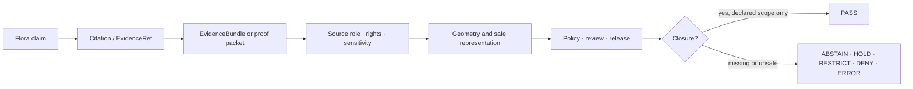

<!-- [KFM_META_BLOCK_V2]
doc_id: kfm://doc/data-proofs-citation-validation-flora-readme
title: data/proofs/citation_validation/flora/README.md — Flora Citation Validation Proofs
version: v0.2.0
type: README; proof-lane-contract; citation-validation-family-child; flora-domain-proof-support; sensitive-location-boundary
status: repository-grounded draft; payload/runtime enforcement unverified
owners:
  - NEEDS VERIFICATION — Flora steward
  - NEEDS VERIFICATION — Evidence and citation-validation stewards
  - NEEDS VERIFICATION — Sensitivity, rights, and stewardship reviewers
  - NEEDS VERIFICATION — Policy, release, UI/Evidence Drawer, and docs stewards
updated: 2026-07-25
policy_label: restricted-review; deny-by-default-location; no-direct-public-path; release-gated; cite-or-abstain
current_path: data/proofs/citation_validation/flora/README.md
truth_posture: >
  CONFIRMED exact path, prior substantive boundary material, canonical data/proofs responsibility,
  citation-validation family parent, Flora domain proof lane, Flora EvidenceBundle lane, Flora
  doctrine, release-candidate posture, and read-only domain workflow / PROPOSED normalized
  citation-validation lane contract and family-versus-domain ownership profile / UNKNOWN recursive
  validation-record inventory, active writers and consumers, accepted schemas and profiles,
  resolver/runtime behavior, routes, caches, release state, and public effects / NEEDS VERIFICATION
  accountable owners, policy enforcement, rights and sensitivity review, stewardship and sovereignty
  approvals, validators, fixtures, CI graduation, emitted records, correction propagation,
  invalidation, retention, and rollback drills
evidence_snapshot:
  repository: bartytime4life/Kansas-Frontier-Matrix
  base_commit: 435606255ada6c113c54e6ee9ad05e28b36dc741
  prior_blob: 1b86fe66e0682bc42b3df39f625fa4616c6b185f
  proofs_root_blob: 0d8b6e92d3b4b9ff3961d29c53ead497922a31cf
  citation_validation_parent_blob: 8964f5cb9ea517a6ba881aa1a606983b18f5d76d
  flora_proof_lane_blob: a2518d4cc029b9b16afa8bb5c3fb6907a0c1475a
  flora_evidence_bundle_blob: d73adf50d91b617f6c056b7a14842c57db1131a4
  flora_doctrine_blob: 43a47d828c4926e539790a055a5e1034c6ce62bc
  flora_policy_blob: b040bff13e654cff9d2f7336d6d6783c8467eaa9
  flora_sensitivity_policy_blob: 4c65abec24135f7e4467fd108e163cdce594d5f9
  flora_release_candidate_blob: 15a08f9fb2cdd33041d3a3f3e3c844f26a7a0998
  flora_workflow_blob: c792d126e5726d8895f56fd97800bee7fcba4a15
related:
  - ../README.md
  - ../../README.md
  - ../../flora/README.md
  - ../../evidence_bundle/flora/README.md
  - ../../../processed/flora/README.md
  - ../../../catalog/domain/flora/README.md
  - ../../../receipts/README.md
  - ../../../registry/sources/flora/README.md
  - ../../../published/layers/flora/README.md
  - ../../../../contracts/domains/flora/README.md
  - ../../../../schemas/contracts/v1/domains/flora/README.md
  - ../../../../schemas/contracts/v1/evidence/evidence_bundle.schema.json
  - ../../../../schemas/contracts/v1/ui/evidence_drawer_payload.schema.json
  - ../../../../policy/domains/flora/README.md
  - ../../../../policy/sensitivity/flora/README.md
  - ../../../../release/candidates/flora/README.md
  - ../../../../release/README.md
  - ../../../../docs/domains/flora/README.md
  - ../../../../docs/doctrine/directory-rules.md
  - ../../../../docs/doctrine/trust-membrane.md
  - ../../../../.github/workflows/domain-flora.yml
tags: [kfm, data, proofs, citation-validation, flora, plants, EvidenceRef, EvidenceBundle, cite-or-abstain, source-role, rights, sensitivity, geoprivacy, rare-plants, cultural-sensitivity, stewardship, correction, rollback, no-direct-public-path]
notes:
  - "This is an existing specialized child of data/proofs/citation_validation/; it is not a second canonical Flora proof home."
  - "data/proofs/flora/ remains the domain proof-support lane; data/proofs/evidence_bundle/flora/ remains the bundle-family lane. Overlapping artifacts require one authoritative home and immutable references or indexes from the other lanes."
  - "Citation validation checks declared citation and EvidenceRef closure. It does not create botanical truth, source admission, rights clearance, sensitivity approval, stewardship approval, policy permission, release approval, or publication."
  - "Exact or reverse-engineerable rare, protected, culturally sensitive, steward-controlled, or private-land Flora locations and geoprivacy transform parameters must not appear in this ordinary repository lane."
  - "Rollback target for the pre-modernization document is blob 1b86fe66e0682bc42b3df39f625fa4616c6b185f."
[/KFM_META_BLOCK_V2] -->

<a id="top"></a>

# `data/proofs/citation_validation/flora/` — Flora Citation Validation

> **One-line purpose.** Check whether Flora claims, citations, and `EvidenceRef` values resolve to the correct governed evidence, source role, rights, sensitivity-safe representation, policy, review, release, correction, and rollback context before use.

[](#status)
[](#authority-level)
[](#flora-citation-guardrails)
[](#sensitivity-and-safe-representation)
[](#validation)
[](#outputs)

> [!IMPORTANT]
> A citation-validation `PASS` proves only the checks declared by its accepted profile. It does not prove that a botanical claim is true, taxonomically current, rights-cleared, sensitivity-safe, steward-approved, released, or suitable for public use.

> [!CAUTION]
> Missing, stale, conflicting, role-collapsed, rights-unclear, sensitivity-unsafe, unreleased, withdrawn, or unresolvable support must yield a finite fail-closed result such as `ABSTAIN`, `HOLD`, `RESTRICT`, `DENY`, or `ERROR`.

> [!WARNING]
> Do not place exact or reverse-engineerable sensitive Flora locations, private-land details, collection or access clues, culturally sensitive knowledge, stewardship-restricted notes, withheld precision, redaction offsets, generalization thresholds, or other transform secrets in this lane.

**Quick navigation:** [Purpose](#purpose) · [Authority](#authority-level) · [Status](#status) · [Belongs](#what-belongs-here) · [Exclusions](#what-does-not-belong-here) · [Inputs](#inputs) · [Outputs](#outputs) · [Validation](#validation) · [Review](#review-burden) · [Related](#related-folders) · [ADRs](#adrs) · [Last reviewed](#last-reviewed) · [Operating contract](#operating-contract) · [Flora guardrails](#flora-citation-guardrails) · [Sensitivity](#sensitivity-and-safe-representation) · [Correction](#correction-withdrawal-and-rollback) · [Verification](#open-verification-register) · [No-loss](#no-loss-ledger)

## Purpose

`data/proofs/citation_validation/flora/` is the Flora-specialized child of the citation-validation proof family. It supports bounded checks that a botanical claim's citations and evidence references resolve coherently across source, evidence, processed data, catalog, triplet, receipt, policy, review, release, correction, withdrawal, and rollback state.

It may support governed answers, Evidence Drawer payloads, catalog or triplet review, release review, correction review, Focus Mode review, or audit. It must not become a canonical source store, botanical object store, EvidenceBundle store, public API, map service, rare-plant discovery surface, collection guide, or stewardship decision system.

## Authority level

**Existing specialized child of the canonical `data/proofs/` responsibility through the `citation_validation/` proof family; Flora citation-validation support only.**

This path is not a second canonical Flora proof home:

- [`data/proofs/flora/`](../../flora/README.md) is the Flora domain proof-support lane.
- [`data/proofs/evidence_bundle/flora/`](../../evidence_bundle/flora/README.md) is the Flora EvidenceBundle-family support lane.
- this path checks citation and `EvidenceRef` closure for Flora claims.

When one artifact could fit more than one axis, an accepted contract and profile must select one authoritative home. Other lanes may hold immutable references, indexes, or validation summaries; they must not duplicate mutable authority, restricted source material, or canonical proof records.

This path does not own factual truth, taxonomy authority, source admission, source role, rights, sensitivity decisions, geoprivacy transforms, stewardship or sovereignty decisions, semantic contracts, machine schemas, policy, release, correction, withdrawal, rollback, public rendering, or AI-answer authority.

## Status

| Field | Bounded result |
|---|---|
| Path | `data/proofs/citation_validation/flora/` |
| Version | `v0.2.0` |
| Base evidence | `main@435606255ada6c113c54e6ee9ad05e28b36dc741` |
| Prior document blob | `1b86fe66e0682bc42b3df39f625fa4616c6b185f` |
| Canonical proofs root | [`data/proofs/README.md`](../../README.md) — confirmed repository-grounded parent contract |
| Citation-validation family parent | [`data/proofs/citation_validation/README.md`](../README.md) — confirmed present; draft / proposed |
| Flora domain proof lane | [`data/proofs/flora/README.md`](../../flora/README.md) — confirmed present; draft / proposed |
| Flora EvidenceBundle lane | [`data/proofs/evidence_bundle/flora/README.md`](../../evidence_bundle/flora/README.md) — confirmed present; draft / proposed |
| Flora policy homes | Present as scaffold-level documentation; executable enforcement not established |
| Recursive validation-record inventory | `UNKNOWN` |
| Accepted lane-wide citation profile | `UNKNOWN` |
| Dedicated resolver, validator, fixtures, and consumers | `UNKNOWN` |
| Domain workflow | Read-only readiness checks and explicit holds; no proof or publication authority |
| Public readiness | `DENY BY DEFAULT` |

The current repository establishes documentation and responsibility boundaries. It does not establish a populated citation-validation store, accepted Flora citation-validation schema, operational resolver, or released public citation path.

## What belongs here

Only bounded citation-validation support such as:

- claim-to-citation closure manifests for Flora claims;
- `EvidenceRef` resolution results that point to, but do not duplicate, an accepted `EvidenceBundle` or proof packet;
- claim-to-citation maps for catalog records, triplets, release candidates, governed answers, Focus Mode, and Evidence Drawer review;
- source-role, rights, sensitivity, redaction/generalization, freshness, and release-dependency findings;
- stable negative-result records explaining `ABSTAIN`, `HOLD`, `RESTRICT`, `DENY`, or `ERROR`;
- correction, supersession, withdrawal, invalidation, and rollback dependency summaries;
- immutable indexes or pointers to authoritative proof records;
- local README, inventory, digest, migration, retention, or disposition sidecars that do not create parallel authority.

## What does NOT belong here

| Do not place here | Correct home or action |
|---|---|
| RAW captures, specimen exports, original coordinates, source media, or source-native records | `data/raw/flora/` or the governed source system |
| In-process taxonomy reconciliation, matching, redaction trials, joins, notebooks, or scratch outputs | `data/work/flora/` |
| Rights-, source-role-, sensitivity-, validation-, review-, or release-unclear material | `data/quarantine/flora/` |
| Canonical normalized Flora objects | `data/processed/flora/` |
| Catalog, STAC, DCAT, PROV, or triplet records | Their catalog or triplet lanes |
| Canonical `EvidenceBundle` or domain proof packets | Accepted evidence/proof home under `data/proofs/` |
| Process, validation, redaction, generalization, review, or publication receipts | `data/receipts/` |
| `SourceDescriptor` or source-admission authority | `data/registry/sources/flora/` |
| Policy, rights, sensitivity, stewardship, or sovereignty decisions | Their accepted policy/review authority |
| Release approval, correction notice, withdrawal notice, or rollback card | `release/` |
| Contracts, schemas, validators, fixtures, tests, pipelines, packages, apps, API, UI, or map code | Their responsibility roots |
| Public maps, tiles, downloads, popups, reports, Focus Mode answers, or AI output | Released governed delivery surfaces only |
| Exact or reverse-engineerable sensitive locations or transform parameters | Approved restricted systems; never this ordinary repository lane |

## Inputs

A bounded validation record should identify the claim or artifact being checked and, where applicable, resolve:

- stable claim ID, object family, taxon concept, accepted name, and relevant synonym or crosswalk identity;
- claim text or machine field, geography, spatial support, time scope, and intended audience;
- occurrence, specimen, survey, range, distribution, model, habitat-association, invasive-plant, restoration, or synthetic-summary source role;
- source identity, source version, source role, rights posture, attribution, and use limitations;
- `EvidenceRef` and expected `EvidenceBundle` or proof-packet identity and digest;
- exact/internal geometry posture versus public generalized, withheld, staged, or denied representation;
- sensitivity classification, review state, stewardship or sovereignty dependency, and public-disclosure decision;
- redaction or generalization receipt references without exposing protected parameters;
- processed, catalog, triplet, receipt, policy, review, release, correction, withdrawal, and rollback references;
- taxonomy, source, observation, collection, validity, retrieval, review, correction, and expiry times where applicable;
- validator profile, validator version, run identity, declared scope, caveats, and limitations.

Incomplete or mutually inconsistent inputs narrow the permissible result. They do not authorize inferred completion.

## Outputs

A bounded citation-validation result should include:

- stable validation-record identity, version, and digest;
- exact claim and citation scope;
- resolved and unresolved references;
- taxon-concept and source-role compatibility findings;
- rights, attribution, sensitivity, review, and disclosure findings;
- internal-versus-public representation status without leaking restricted originals or transform secrets;
- spatial, temporal, uncertainty, freshness, caveat, and limitation findings;
- policy, review, release, correction, withdrawal, and rollback dependency state;
- finite outcome: `PASS`, `ABSTAIN`, `HOLD`, `RESTRICT`, `DENY`, or `ERROR`;
- stable machine-readable finding identifiers and a human-readable summary that does not exceed the evidence.

Outputs are proof support for governed review. They are not direct public data, public map layers, access instructions, collection guidance, stewardship decisions, or release authority.

## Validation

Validate, as applicable:

- deterministic identity, digest, version, duplicate detection, and immutable-reference behavior;
- `EvidenceRef` resolution to the intended `EvidenceBundle` or accepted proof packet;
- claim-to-evidence agreement for taxon, object family, source role, geography, time, method, and uncertainty;
- taxonomic concept, synonym, identifier, and crosswalk lineage;
- source identity, source role, rights, attribution, sensitivity, and provenance;
- occurrence versus specimen, survey, range, model, distribution, habitat, restoration, or synthetic-summary separation;
- exact/internal geometry versus policy-safe public representation;
- redaction/generalization receipt linkage without protected parameter disclosure;
- harmful-precision, re-identification, reverse-engineering, private-land, collection-risk, and access-risk controls;
- catalog, triplet, receipt, policy, review, release, correction, withdrawal, and rollback reference integrity;
- stale, disputed, superseded, withdrawn, invalidated, and taxonomy-changed state;
- links, anchors, metadata, protected-content exposure, and direct-public-path denial;
- finite negative outcomes and stable reason codes.

No complete lane-wide citation-validation schema, accepted profile, dedicated resolver, validator, fixture suite, or deployed consumer was verified. The current Flora workflow inspects readiness with read-only permissions and explicit holds; it does not prove botanical truth, geoprivacy, evidence closure, stewardship approval, release readiness, or public safety.

## Review burden

Accountable owners remain **NEEDS VERIFICATION**.

Changes should include Flora, evidence, citation-validation, sensitivity, rights, policy, release, and documentation stewards as applicable. Independent specialist review is required when a change affects:

- source activation or source-role interpretation;
- taxonomic identity or crosswalk behavior;
- rare, protected, culturally sensitive, steward-controlled, or private-land records;
- exact or generalized location handling;
- rights, attribution, access, collection-risk, or sovereignty concerns;
- redaction/generalization methods or receipt binding;
- public serving, correction propagation, withdrawal, retention, or rollback.

CODEOWNERS routing, a passing check, a pull request, or a merge is not stewardship approval, rights-holder approval, independent review, release approval, or publication authority.

## Related folders

- Citation-validation family parent: [`../README.md`](../README.md)
- Canonical proofs root: [`../../README.md`](../../README.md)
- Flora domain proof lane: [`../../flora/README.md`](../../flora/README.md)
- Flora EvidenceBundle lane: [`../../evidence_bundle/flora/README.md`](../../evidence_bundle/flora/README.md)
- Flora processed lane: [`../../../processed/flora/README.md`](../../../processed/flora/README.md)
- Flora catalog lane: [`../../../catalog/domain/flora/README.md`](../../../catalog/domain/flora/README.md)
- Receipts: [`../../../receipts/README.md`](../../../receipts/README.md)
- Flora source registry: [`../../../registry/sources/flora/README.md`](../../../registry/sources/flora/README.md)
- Published Flora carriers: [`../../../published/layers/flora/README.md`](../../../published/layers/flora/README.md)
- Flora contracts: [`../../../../contracts/domains/flora/README.md`](../../../../contracts/domains/flora/README.md)
- Flora schemas: [`../../../../schemas/contracts/v1/domains/flora/README.md`](../../../../schemas/contracts/v1/domains/flora/README.md)
- Flora policy: [`../../../../policy/domains/flora/README.md`](../../../../policy/domains/flora/README.md)
- Flora sensitivity policy: [`../../../../policy/sensitivity/flora/README.md`](../../../../policy/sensitivity/flora/README.md)
- Flora release candidates: [`../../../../release/candidates/flora/README.md`](../../../../release/candidates/flora/README.md)
- Flora domain doctrine: [`../../../../docs/domains/flora/README.md`](../../../../docs/domains/flora/README.md)
- Flora workflow: [`../../../../.github/workflows/domain-flora.yml`](../../../../.github/workflows/domain-flora.yml)

## ADRs

Relevant proposed decisions include:

- [`ADR-0010`](../../../../docs/adr/ADR-0010-deny-by-default-for-dna-rare-species-archaeology-infrastructure.md) — deny-by-default for sensitive classes;
- [`ADR-0011`](../../../../docs/adr/ADR-0011-receipts-vs-proofs-vs-manifests-vs-catalog-separation.md) — responsibility separation;
- [`ADR-0013`](../../../../docs/adr/ADR-0013-spec_hash-and-run_id-identity-grammar.md) — identity grammar and current implementation conflicts;
- [`ADR-0018`](../../../../docs/adr/ADR-0018-promotion-gate-sequence.md) — promotion-gate ordering;
- [`ADR-0020`](../../../../docs/adr/ADR-0020-abstain-is-a-first-class-decision.md) — finite abstention;
- [`ADR-0025`](../../../../docs/adr/ADR-0025-public-client-never-reads-canonical-internal-stores.md) — trust-membrane boundary.

This README accepts none of those decisions by implication. Any authority, storage, schema, policy, public-serving, or migration change requires its own accepted decision, implementation, validation, correction, and rollback evidence.

## Last reviewed

- **Date:** 2026-07-25
- **Evidence boundary:** `main@435606255ada6c113c54e6ee9ad05e28b36dc741`
- **Review type:** exact target plus canonical proofs root, citation-validation parent, Flora domain proof lane, Flora EvidenceBundle lane, Flora doctrine, policy scaffolds, release-candidate lane, and domain workflow
- **Recursive payload/runtime inspection:** not performed
- **Owners, accepted profiles, resolver behavior, sensitivity enforcement, public consumers, retention, and operational rollback:** need verification

Re-review on authority, source-role, sensitivity, rights, taxonomy, writer, resolver, policy, release, public-consumer, correction, withdrawal, or rollback changes—or within six months.

## Operating contract

For each bounded claim, evaluate this chain without silently filling gaps:

```text
claim + taxon concept
  -> citation / EvidenceRef
  -> EvidenceBundle or accepted proof packet
  -> source identity + immutable source role + rights
  -> geography + time + uncertainty + sensitivity
  -> internal exact representation / public-safe representation
  -> redaction or generalization receipt reference
  -> catalog / triplet / process-receipt agreement
  -> policy / stewardship / review / release state
  -> correction / withdrawal / rollback state
  -> finite result
```


```mermaid
flowchart LR
    C["Flora claim"] --> R["Citation / EvidenceRef"]
    R --> E["EvidenceBundle or proof packet"]
    E --> S["Source role · rights · sensitivity"]
    S --> G["Geometry and safe representation"]
    G --> P["Policy · review · release"]
    P --> D{"Closure?"}
    D -->|yes, declared scope only| PASS["PASS"]
    D -->|missing or unsafe| FAIL["ABSTAIN · HOLD · RESTRICT · DENY · ERROR"]
```

A result is invalid if it changes a source role, treats habitat or modeled distribution as occurrence truth, hides taxonomic uncertainty, loses sensitivity or rights caveats, exposes restricted geometry or transform details, ignores stale or withdrawn state, or relies on a non-governed direct path.

## Flora citation guardrails

| Boundary | Required citation behavior |
|---|---|
| Taxon concept vs. display name | A common or accepted name alone cannot substitute for the cited taxon concept, identifier, synonym lineage, and taxonomic source. |
| Occurrence vs. specimen | A specimen may support an occurrence claim only within its documented identification, location, date, provenance, and sensitivity limits. |
| Survey/non-detection vs. absence | Lack of a cited detection is not proof of absence without an accepted survey design and claim scope. |
| Range or distribution vs. occurrence | Range polygons, modeled distributions, and generalized surfaces do not prove an observed occurrence at a site. |
| Habitat association vs. occurrence | Habitat suitability or association is context, not plant-presence proof. |
| Restoration or planting vs. wild occurrence | Managed, planted, restored, escaped, and naturally occurring records must remain distinct. |
| Rare/protected/culturally sensitive Flora | Citation closure must preserve restricted posture and cannot authorize disclosure. |
| Exact vs. public geometry | Public citations must resolve only to the approved generalized, withheld, staged, or denied representation. |
| Private land and access | Ownership, access, collection, contact, route, and landowner details are not public citation content. |
| Stewardship and sovereignty | Steward-controlled or culturally sensitive knowledge requires the applicable review and may remain non-public even when other checks pass. |
| Cross-domain joins | Habitat, Fauna, Soil, Hydrology, Agriculture, Hazards, Archaeology, Settlements, and People/Land references retain their owning domain, source role, sensitivity, and evidence. |
| AI and Evidence Drawer | Generated text and UI projections may cite only governed released support and must preserve finite negative outcomes and sensitivity posture. |

## Sensitivity and safe representation

Flora location sensitivity is fail-closed. A citation-validation record may state that a restricted source was checked, that a policy-safe representation exists, or that an exact claim cannot be supported publicly. It must not reveal the restricted original or enough information to reconstruct it.

A public-facing citation dependency requires, as applicable:

1. an admitted source and immutable source role;
2. documented rights and attribution;
3. resolved EvidenceRef and evidence/proof support;
4. sensitivity and harmful-precision review;
5. a public-safe generalized, withheld, staged, or denied representation;
6. redaction/generalization receipt linkage without transform-secret disclosure;
7. policy, stewardship, and independent review;
8. release binding, correction path, withdrawal path, and rollback target.

Directory placement, hashing, schema validity, generalized geometry, a passing check, or a merge does not establish those gates.

## Correction, withdrawal, and rollback

Citation validation must be recomputed or invalidated when any referenced source, taxonomy, occurrence/specimen determination, EvidenceBundle, proof packet, processed artifact, catalog record, triplet, receipt, policy decision, sensitivity decision, review, release, correction, withdrawal, or public-safe representation changes materially.

A correction workflow should preserve:

1. prior validation-record identity and digest;
2. superseding validation-record identity;
3. affected claims, citations, releases, and consumers;
4. changed taxon, source role, rights, sensitivity, geometry, or representation state;
5. stale, disputed, corrected, superseded, or withdrawn references;
6. correction and invalidation reason;
7. cache, index, map, API, UI, and AI-projection invalidation evidence where applicable;
8. rollback target and drill result.

This README does not verify that automated propagation, retention enforcement, cache invalidation, or rollback automation exists.

## Open verification register

| Item | Status | Required evidence |
|---|---:|---|
| Recursive validation-record inventory | `NEEDS VERIFICATION` | Pinned tree, payload families, digests, owners, retention, rights, and sensitivity |
| Accepted citation-validation profile | `UNKNOWN` | Contract/schema/profile version and reviewed decision |
| Family/domain/bundle ownership profile | `NEEDS VERIFICATION` | One authoritative home, immutable references, index rules, and duplicate detection |
| EvidenceRef resolver | `UNKNOWN` | Resolver contract, authorization, failure behavior, logs, tests, and no-direct-store proof |
| Flora rights and sensitivity enforcement | `UNKNOWN` | Accepted policy, stewardship/sovereignty review path, fixtures, stable findings, and runtime evidence |
| Validators, fixtures, and CI graduation | `UNKNOWN` | Implemented no-network validator, public-safe positive/negative fixtures, and workflow evidence |
| Writers and consumers | `UNKNOWN` | Pipeline, tool, catalog, release, API/UI, Evidence Drawer, Focus Mode, cache, and AI inventory |
| Correction, withdrawal, and retention propagation | `UNKNOWN` | Dependency map, emitted invalidation records, retention controls, and drills |
| Public-serving boundary | `UNKNOWN` | Governed route, release resolution, access control, sensitivity-safe projection, and no-direct-path tests |

Unknowns narrow claims and block higher-risk transitions. They do not justify plausible defaults.

## No-loss ledger

| Prior element | Disposition |
|---|---|
| Stable path, document identity, and top anchor | Preserved |
| Flora citation-validation specialization | Preserved and clarified |
| Citation-validation family versus Flora domain-proof topology | Preserved and clarified; parallel authority denied |
| EvidenceRef-to-EvidenceBundle closure | Preserved and strengthened |
| Flora object-family and source-role distinctions | Preserved and strengthened |
| Rare/protected/culturally sensitive, exact-location, private-land, and stewardship controls | Preserved and strengthened |
| Redaction/generalization and transform-secret protections | Preserved and strengthened |
| Cross-domain ownership and sensitivity | Preserved |
| Finite negative outcomes and cite-or-abstain posture | Preserved and normalized |
| Separation from data, receipts, policy, release, and public surfaces | Preserved |
| Correction, withdrawal, invalidation, and rollback posture | Preserved and expanded |
| Prior document blob and rollback target | Recorded |
| Payload, source, proof construction, route, release, deployment, or publication change | None |

### Change history

#### v0.2.0 — 2026-07-25

- reconciled the lane with the canonical proofs root and direct citation-validation family parent;
- clarified Flora domain-proof, EvidenceBundle-family, and citation-validation-family authority;
- strengthened rights, sensitivity, geoprivacy, stewardship, correction, withdrawal, and rollback controls;
- removed the speculative child-directory tree from the authoritative contract;
- changed Markdown only.

[Back to top](#top)
