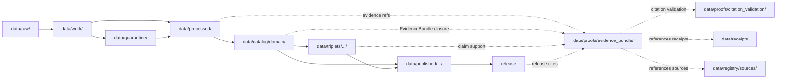

<!-- [KFM_META_BLOCK_V2]
doc_id: kfm://doc/data-proofs-evidence-bundle-readme
title: data/proofs/evidence_bundle/README.md — EvidenceBundle Proofs README
version: v0.1
type: readme; proof-family-guide; evidence-bundle-lane; evidence-ref-resolution-lane; governed-answer-support-lane; cross-domain-proof-index
status: draft; PROPOSED; data-root; proofs-root; evidence-bundle; evidence-ref; claim-support; digest-closure; cite-or-abstain; source-role-aware; sensitivity-aware; release-gated; evidence-first
authors: ChatGPT-5.5 Thinking; reviewed_by: OWNER_TBD
owners: OWNER_TBD — Evidence steward · EvidenceBundle steward · Proof steward · Policy steward · Release steward · UI/Evidence Drawer steward · Domain stewards · Docs steward
created: NEEDS VERIFICATION — greenfield stub existed before v0.1 expansion
updated: 2026-06-25
policy_label: public-doc; data; proofs; evidence-bundle; evidence; lifecycle; governed; release-gated
tags: [kfm, data, proofs, evidence-bundle, EvidenceBundle, EvidenceRef, EvidenceDrawerPayload, DecisionEnvelope, cite-or-abstain, claim-resolution, citation-closure, proof, claim-support, digest-closure, SourceDescriptor, CatalogMatrix, ReleaseManifest, ReviewRecord, CorrectionNotice, RollbackCard, PolicyDecision, ValidationReport, RedactionReceipt, RAW, WORK, QUARANTINE, PROCESSED, CATALOG, TRIPLET, PUBLISHED, atmosphere, flora, sensitivity, source-role, finite-outcomes]
related:
  - ../README.md
  - ../../README.md
  - atmosphere/README.md
  - flora/README.md
  - ../atmosphere/README.md
  - ../atmosphere/pm25_2026/README.md
  - ../flora/README.md
  - ../citation_validation/README.md
  - ../citation_validation/atmosphere/README.md
  - ../citation_validation/flora/README.md
  - ../../catalog/domain/
  - ../../processed/
  - ../../receipts/
  - ../../registry/sources/
  - ../../published/
  - ../../triplets/
  - ../../../docs/architecture/ui/EVIDENCE_DRAWER.md
  - ../../../docs/architecture/evidence-drawer.md
  - ../../../docs/architecture/governed-ai/BOUNDARIES.md
  - ../../../schemas/contracts/v1/evidence/evidence_bundle.schema.json
  - ../../../schemas/contracts/v1/ui/evidence_drawer_payload.schema.json
  - ../../../policy/
  - ../../../release/
  - ../../../tools/validators/
notes:
  - "This file replaces a greenfield stub at `data/proofs/evidence_bundle/README.md`."
  - "This is the parent EvidenceBundle proof-family guide under `data/proofs/`. It supports EvidenceRef → EvidenceBundle closure, claim support, digest closure, finite negative outcomes, and governed answer readiness. It is not RAW source storage, WORK scratch, QUARANTINE holding, PROCESSED data, CATALOG, TRIPLET, PUBLISHED output, receipt storage, source registry, policy authority, release authority, schema home, validator home, public API/UI output, public map/tile output, legal/medical/safety advice, or public claim text."
  - "EvidenceBundle artifacts may reference SourceDescriptor, processed artifacts, catalog rows, triplets, receipts, policy decisions, review records, release manifests, redaction receipts, correction notices, and rollback cards; they do not own those records."
  - "The `atmosphere/` and `flora/` child EvidenceBundle lanes are confirmed present and expanded. Other child lanes are PROPOSED until verified."
  - "Global EvidenceBundle schema, concrete bundle inventory, validator, fixtures, route behavior, and CI enforcement were not verified in this task and remain NEEDS VERIFICATION."
  - "This README is a proof-family guide only. Contracts define semantic object meaning; schemas define machine shape; policy decides admissibility; release records decide publication."
  - "Rollback target for this expansion is previous greenfield stub blob SHA `e01c7dd1b5b6f8fe81f5c96e7820f6151b0d2120`."
[/KFM_META_BLOCK_V2] -->

<a id="top"></a>

# data/proofs/evidence_bundle

> Parent EvidenceBundle proof family for organizing resolvable claim-support bundles, EvidenceRef closure, digest closure, source-role preservation, sensitivity posture, release linkage, correction lineage, rollback linkage, citation validation, and governed answer support.

<p>
  
  
  
  
  
  
</p>

**Status:** draft / PROPOSED  
**Owners:** OWNER_TBD — Evidence steward · EvidenceBundle steward · Proof steward · Policy steward · Release steward · UI/Evidence Drawer steward · Domain stewards · Docs steward  
**Path:** `data/proofs/evidence_bundle/README.md`  
**Owning root:** `data/proofs/`  
**Proof family segment:** `evidence_bundle`  
**Lifecycle role:** EvidenceBundle proof support referenced by processed artifacts, catalog records, triplets, release candidates, citation-validation lanes, corrections, rollbacks, and governed answer surfaces; not a lifecycle phase substitute  
**Exposure posture:** not public by default; public use requires governed projection, policy/review state, release state, correction path, and rollback target.  
**Truth posture:** CONFIRMED target was a greenfield stub · CONFIRMED `atmosphere/` and `flora/` child EvidenceBundle READMEs exist and are expanded · CONFIRMED Evidence Drawer doctrine requires EvidenceBundle resolution through governed APIs, not direct browser access to canonical stores · PROPOSED parent proof-family details and child-lane index · NEEDS VERIFICATION for global EvidenceBundle schema, concrete bundle inventory, validators, fixtures, access controls, release linkage, and governed route behavior.

**Quick jumps:** [Purpose](#purpose) · [Lifecycle relationship](#lifecycle-relationship) · [Repo fit](#repo-fit) · [Lane index](#lane-index) · [Accepted contents](#accepted-contents) · [Exclusions](#exclusions) · [EvidenceBundle requirements](#evidencebundle-requirements) · [EvidenceBundle guardrails](#evidencebundle-guardrails) · [Evidence ledger](#evidence-ledger) · [Validation checklist](#validation-checklist) · [Rollback](#rollback)

---

## Purpose

`data/proofs/evidence_bundle/` is the parent proof-family lane for EvidenceBundle support. It should hold or index bundle-like proof artifacts that make KFM claims resolvable, inspectable, policy-aware, citation-safe, release-aware, and reversible.

This lane may contain or reference proof support for:

- EvidenceRef → EvidenceBundle closure;
- claim-support bundles for domain catalog records, triplets, release candidates, and governed answers;
- digest closure tying source captures, processed artifacts, catalog rows, triplets, receipts, release records, redaction products, correction records, rollback targets, and proof manifests to evidence;
- bundle member indexes that preserve object family, source role, time, geography/generalization, sensitivity posture, rights posture, review state, policy state, release state, correction state, and limitation posture;
- negative-state evidence support explaining why a governed answer must `ABSTAIN`, `DENY`, `HOLD`, or `ERROR` instead of answering;
- handoff support for citation-validation lanes, Evidence Drawer projections, Focus Mode summaries, release packages, and rollback review.

This lane does not create, store, or decide the underlying lifecycle data, catalog records, triplets, receipts, policy decisions, release decisions, public maps, public answer text, legal/medical/safety advice, access decisions, or stewardship decisions. It supports evidence resolution; it does not publish claims.

## Lifecycle relationship

```text
RAW -> WORK / QUARANTINE -> PROCESSED -> CATALOG / TRIPLET -> PUBLISHED
                           \-> data/proofs/evidence_bundle supports EvidenceBundle closure
```



EvidenceBundle proof artifacts support catalog, triplet, release, correction, rollback, citation validation, Evidence Drawer, and governed answers. They do not publish anything by themselves.

## Repo fit

| Responsibility | Correct home | Rule |
|---|---|---|
| Raw source payloads | `data/raw/<domain>/` | Not this lane. |
| Work/scratch transforms, QA experiments, notebooks, or redaction trials | `data/work/<domain>/` | Not this lane. |
| Quarantined rights/source-role/sensitivity/release-unclear material | `data/quarantine/<domain>/` | Not this lane. |
| Normalized processed artifacts | `data/processed/<domain>/` | Not this lane. |
| Catalog records | `data/catalog/domain/<domain>/` and related STAC/DCAT/PROV lanes | Catalog, not EvidenceBundle storage. |
| Triplets/graph records | `data/triplets/.../<domain>/` | Graph projection, not EvidenceBundle storage. |
| Domain proof support | `data/proofs/<domain>/` | Domain proof lane, if present or ADR-resolved. |
| EvidenceBundle proof support | `data/proofs/evidence_bundle/<domain>/` | Child lanes under this family. |
| Citation-validation proof support | `data/proofs/citation_validation/<domain>/` | Validates citations; not the bundle family. |
| Receipts and review records | `data/receipts/` | Referenced by bundles; not stored here. |
| Source registry records | `data/registry/sources/<domain>/` | SourceDescriptor/source-admission authority. |
| Published public-safe outputs | `data/published/.../<domain>/` | Downstream after release only. |
| Release candidates and release manifests | `release/candidates/<domain>/`, `release/` | Publication authority, not EvidenceBundle storage. |
| Contracts | `contracts/domains/<domain>/` or ADR-resolved segment | Semantic meaning; not proof artifacts. |
| Schemas | `schemas/contracts/v1/...` and evidence/UI schema homes | Machine shape; not proof artifacts. |
| Policy | `policy/domains/<domain>/`, `policy/sensitivity/<domain>/`, or ADR-resolved homes | Admissibility authority; not proof artifacts. |
| Validators, tests, fixtures, pipelines, apps, packages | `tools/validators/`, `tests/`, `fixtures/`, `pipelines/`, `apps/`, `packages/` | Separate roots. |

## Lane index

Known child lanes under `data/proofs/evidence_bundle/` are listed below. Treat entries as **PROPOSED** unless current child READMEs, validators, fixtures, policies, receipts, access controls, and CI enforcement have been verified in the same implementation pass.

| Lane | Scope | Purpose | Hard boundary |
|---|---|---|---|
| `atmosphere/` | Atmosphere / air | EvidenceBundle support for air-quality and Atmosphere claims, including source-role/caveat preservation and release linkage. | Not AQI advisory service, medical advice, regulatory-exceedance authority, public output, receipt store, or release authority. |
| `flora/` | Flora / plants | EvidenceBundle support for botanical claims, sensitive-location posture, redaction/generalization support, and release linkage. | Not rare-plant discovery surface, exact-location disclosure, public geometry, or stewardship decision authority. |
| `agriculture/` | PROPOSED | EvidenceBundle support for crop/yield/field/aggregate claims. | Aggregate evidence must not become field/operator truth. |
| `archaeology/` | PROPOSED | EvidenceBundle support for archaeology and cultural-heritage claims. | Exact site and cultural-sovereignty contexts fail closed. |
| `fauna/` | PROPOSED | EvidenceBundle support for animal occurrences, ranges, and sensitive fauna sites. | Sensitive nest/den/roost/spawning locations fail closed. |
| `habitat/` | PROPOSED | EvidenceBundle support for habitat surfaces and suitability claims. | Habitat suitability is not occurrence truth by itself. |
| `hazards/` | PROPOSED | EvidenceBundle support for hazard claims. | Not emergency warning or life-safety authority. |
| `hydrology/` | PROPOSED | EvidenceBundle support for water/hydro claims. | Gauge, model, regulatory, and warning roles remain distinct. |
| `people-dna-land/` | PROPOSED | EvidenceBundle support for person/land/DNA-sensitive claims. | Living-person, DNA, title, and private joins fail closed. |
| `roads-rail-trade/` | PROPOSED | EvidenceBundle support for route, segment, facility, and transport claims. | Not routing, operations, security, or legal road-status authority. |
| `settlements-infrastructure/` | PROPOSED | EvidenceBundle support for settlement, facility, infrastructure, and dependency claims. | Critical assets and dependency graphs restricted by default. |
| `soil/` | PROPOSED | EvidenceBundle support for soil survey, component, horizon, property, moisture, suitability, and erosion claims. | Support types must not collapse. |

## Accepted contents

EvidenceBundle proof artifacts may include:

- EvidenceBundle records, indexes, or bundle pointers when this lane is accepted as a projection/index home;
- EvidenceRef resolution maps that point to bundle members without duplicating raw source, source registry, receipt, policy, or release authority;
- claim-to-bundle maps for catalog records, triplets, Evidence Drawer payloads, release candidates, correction records, rollback review, and governed answer examples;
- digest-closure manifests tying source captures, processed artifacts, catalog rows, triplets, receipts, release records, redaction products, and proof manifests to evidence;
- bundle member indexes for domain object families and cross-lane relations;
- source-role, sensitivity, rights, freshness, caveat, redaction, policy, release, correction, supersession, and rollback closure summaries;
- negative-state support records explaining `ABSTAIN`, `DENY`, `HOLD`, or `ERROR` outcomes for missing, stale, conflicting, restricted, unreleased, sensitivity-unsafe, role-collapsed, caveat-missing, or rights-unclear evidence;
- lane-local README or index notes that explain EvidenceBundle boundaries without becoming public outputs or authority records.

## Exclusions

Do not store these under `data/proofs/evidence_bundle/`:

- RAW, WORK, QUARANTINE, PROCESSED, CATALOG, TRIPLET, or PUBLISHED data artifacts.
- Canonical EvidenceBundle authority if another ADR-resolved evidence store owns canonical bundles.
- RunReceipt, TransformReceipt, ValidationReport, PolicyDecision, ReviewRecord, RedactionReceipt, ReleaseManifest, RollbackCard, CorrectionNotice, WithdrawalNotice, AIReceipt, or release signatures as primary receipt/release records.
- SourceDescriptor/source registry records.
- Contracts, schemas, policy bundles, validators, tests, fixtures, pipelines, app/UI/API code, packages, notebooks, or executable tooling.
- Public map/tile/API/UI payloads, Focus Mode answer payloads, direct downloads, model-answer text, release manifests, signatures, changelogs, or published products.
- Hidden coordinates, sensitive ecology records, archaeology locations, living-person data, DNA/private parcel joins, critical infrastructure detail, redaction parameters, transform offsets, aggregation thresholds that should not be exposed, credentials, secrets, or access instructions.
- Claims that convert generated text into evidence, suitability into occurrence, model fields into observations, aggregate evidence into individual truth, or context into emergency/legal/medical/safety instructions.

## EvidenceBundle requirements

PROPOSED until concrete EvidenceBundle schemas, validators, fixtures, and route behavior are verified:

| Requirement | Meaning |
|---|---|
| EvidenceRef resolution | Each bundle or bundle index should identify every EvidenceRef it resolves and every claim it supports. |
| Bundle closure | SourceDescriptor, processed artifact, catalog row, triplet, receipt, policy, review, release, correction, redaction, and rollback references should resolve or produce a finite negative state. |
| Digest closure | Bundles should include or point to content digests for evidence inputs, processed artifacts, catalog rows, triplets, receipts, redaction products, and proof manifests. |
| Claim scope | Bundles should record the exact claim being supported, including object family, time, location/generalization, source role, sensitivity posture, rights posture, review posture, redaction posture, release posture, and limitation posture. |
| Source-role preservation | Observed, regulatory, modeled, aggregate, administrative, candidate, synthetic, and domain-specific roles must not be interchangeable. |
| Sensitivity preservation | Sensitive ecology, archaeology, living-person, DNA, cultural, sovereignty, critical-infrastructure, private-land, and access-risk caveats should remain attached to bundle entries. |
| Release posture | Public-facing bundle use should verify release state, policy-safe representation, correction path, rollback target, and current/non-withdrawn posture. |
| Negative outcomes | Missing, stale, conflicting, restricted, unreleased, role-collapsed, sensitivity-unsafe, redaction-missing, caveat-missing, or source-rights-unclear bundle support should produce `ABSTAIN`, `DENY`, `HOLD`, or `ERROR`, not an uncited answer. |
| UI projection boundary | Evidence Drawer and Focus Mode should consume governed projection payloads, not canonical stores or raw proof files directly. |
| No public surface by default | EvidenceBundle proof files are not direct public APIs, tiles, downloads, Focus Mode answers, or model-answer sources. |

## EvidenceBundle guardrails

- EvidenceBundle records support evidence closure; they are not source data, processed data, receipts, catalog records, release manifests, or public products.
- EvidenceBundle outranks generated summaries.
- If a claim lacks resolvable EvidenceBundle support, the safe outcome is `ABSTAIN`, `DENY`, `HOLD`, or `ERROR`, not an uncited answer.
- Public bundle use should point to released, policy-safe, review-backed, generalized, redacted, staged, withheld, or denied representations as required; it must not expose restricted originals.
- Cross-lane bundles must preserve each owning lane's authority, source role, sensitivity, and EvidenceBundle support.
- AI summaries may reference only governed, released, evidence-supported surfaces and must preserve sensitivity posture; AI text is not evidence.
- Public clients and Focus Mode must use governed APIs, released artifacts, catalog/triplet records, EvidenceBundle-backed payloads, and policy-safe envelopes, not this directory directly.

> [!CAUTION]
> Do not expose `data/proofs/evidence_bundle/` directly as a public map, API, UI, download, Focus Mode answer, AI answer source, discovery surface for sensitive resources, legal/medical/safety guidance, emergency alert, or release authority. EvidenceBundle proof artifacts support governed evidence closure; they do not publish claims by themselves.

## Evidence ledger

| Source | Status | Supports | Limits |
|---|---|---|---|
| Previous file | CONFIRMED | Target existed as a greenfield stub. | Did not define EvidenceBundle boundaries or child lanes. |
| `data/proofs/evidence_bundle/atmosphere/README.md` | CONFIRMED child README | Atmosphere child EvidenceBundle lane exists, supports EvidenceBundle/EvidenceRef closure, and excludes public AQI/advisory/medical/safety surfaces. | Does not prove global EvidenceBundle validator behavior. |
| `data/proofs/evidence_bundle/flora/README.md` | CONFIRMED child README | Flora child EvidenceBundle lane exists, supports sensitive botanical EvidenceBundle closure, and excludes rare-plant discovery/exact-location disclosure surfaces. | Does not prove global EvidenceBundle validator behavior. |
| `docs/architecture/ui/EVIDENCE_DRAWER.md` | CONFIRMED doctrine / PROPOSED implementation | Evidence Drawer requires cite-or-abstain, governed API claim resolution, EvidenceBundle resolution, policy gate, citation validation, finite negative states, and no direct browser access to canonical stores. | Does not prove implementation, route names, schemas, or validators. |
| `data/proofs/README.md` | NEEDS VERIFICATION | Expected global proof-root guide. | It may still need expansion and reconciliation with this family lane. |
| `schemas/contracts/v1/evidence/evidence_bundle.schema.json` and `schemas/contracts/v1/ui/evidence_drawer_payload.schema.json` | NEEDS VERIFICATION | Expected evidence/UI machine-shape homes. | Current schema contents and validator behavior were not verified in this task. |
| `tools/validators/` | NEEDS VERIFICATION | Expected validator root. | EvidenceBundle validator behavior was not verified in this task. |

## Validation checklist

- [ ] Confirm actual child files and EvidenceBundle proof inventory under `data/proofs/evidence_bundle/`.
- [ ] Expand or reconcile parent `data/proofs/README.md` beyond stub.
- [ ] Confirm whether EvidenceBundle files are concrete records here, indexes pointing to global proof stores, or generated artifacts linked from governed API tests/catalog/release.
- [ ] Confirm EvidenceBundle, EvidenceRef, EvidenceDrawerPayload, DecisionEnvelope, proof index, claim-support, digest-closure, sensitivity-proof, redaction-proof, source-role proof, and proof-invalidation schemas and contract homes.
- [ ] Confirm validators, fixtures, CI checks, EvidenceRef resolution checks, source-role checks, sensitivity checks, caveat checks, redaction/generalization checks, release-link checks, negative-state checks, and access-control enforcement.
- [ ] Confirm bundle references to RunReceipt, TransformReceipt, ValidationReport, PolicyDecision, ReviewRecord, RedactionReceipt, ReleaseManifest, RollbackCard, CorrectionNotice, WithdrawalNotice, and AIReceipt are pointers, not misplaced records.
- [ ] Confirm hidden coordinates, sensitive ecology records, archaeology locations, living-person data, DNA/private parcel joins, critical infrastructure detail, redaction parameters, transform offsets, credentials, secrets, access instructions, and release-unclear artifacts cannot pass from bundle support into public routes.
- [ ] Confirm public-candidate transitions are governed, evidence-backed, citation-safe, source-role-safe, rights-safe, sensitivity-safe, redaction-safe, review-backed, release-linked, and reversible.
- [ ] Confirm no RAW, WORK, QUARANTINE, PROCESSED, CATALOG, TRIPLET, PUBLISHED, receipt, registry, release, schema, policy, validator, package, pipeline, app, API, public map, public tile, direct download, Focus Mode answer, sensitive discovery surface, legal/medical/safety guidance, emergency alert, or release-authority artifact is misplaced here.
- [ ] Confirm public clients and Focus Mode cannot read this lane directly as public truth, public domain service, public map, public tile, public API, public UI, or AI-answer source.

## Rollback

Rollback is required if this lane becomes a RAW source-data root, WORK scratch root, QUARANTINE bypass, PROCESSED substitute, catalog root, triplet root, public output root, `data/published/` substitute, receipt store, source-registry root, release-decision root, schema root, policy root, validator root, implementation root, direct public API shortcut, direct public UI shortcut, direct public tile shortcut, direct public exposure shortcut, unrestricted canonical EvidenceBundle authority root without ADR, citation-bypass path, sensitive-location exposure path, redaction-bypass path, model-as-observation path, aggregate-as-individual-truth path, proof-without-evidence path, uncited-AI-answer source, legal/medical/safety advice surface, emergency alert, or release-authority shortcut.

Rollback target for this expansion: previous greenfield stub blob SHA `e01c7dd1b5b6f8fe81f5c96e7820f6151b0d2120`.

<p align="right"><a href="#top">Back to top</a></p>
