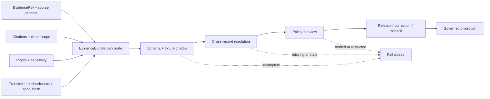

<!-- [KFM_META_BLOCK_V2]
doc_id: kfm://doc/data-proofs-evidence-bundle-readme
title: data/proofs/evidence_bundle/README.md — EvidenceBundle Proof Support
version: v0.2.0
type: directory-readme; proof-family-guide; evidence-bundle-proof-support
status: repository-grounded draft; fielded schema and bounded validator slice confirmed; semantic resolution and release integration unverified
owners: NEEDS VERIFICATION — evidence, proof, contract/schema, policy, rights/sensitivity, release, runtime, and docs stewards
created: NEEDS VERIFICATION — greenfield stub existed before v0.1
updated: 2026-07-26
supersedes: v0.1 at the same path; documentation only
prepared_under_prompt: KFM Markdown Modernization & GitHub Documentation Implementation Agent v4.0.0
policy_label: restricted-review; no-direct-public-path; cite-or-abstain; release-gated
current_path: data/proofs/evidence_bundle/README.md
truth_posture: >
  CONFIRMED exact path, parent proof-root contract, Directory Rules v1.4,
  EvidenceBundle semantic contract and fielded PROPOSED schema, dedicated
  schema wrapper, one documented valid fixture, one documented missing-bundle_id
  invalid fixture, generic schema harness, read-only validator workflow, and
  Atmosphere/Flora child READMEs / PROPOSED materialization, resolver, policy,
  review, release, correction, and public-projection profiles / UNKNOWN recursive
  proof inventory, active writers and consumers, production resolver behavior,
  current CI conclusions, public routes, caches, and release state /
  NEEDS VERIFICATION accountable owners, accepted profiles, semantic tests,
  access controls, invalidation, retention, and rollback drills
evidence_snapshot:
  repository: bartytime4life/Kansas-Frontier-Matrix
  base_ref: main
  base_commit: 01d927659c183d252fc655eeffb1f44f0e0830ad
  prior_blob: bf304383b725db95e0f8902f0c7c59d0a3cd0ee3
  directory_rules_blob: 2affb080e6f0043867c64c7f06c1ca52030fbd55
  proofs_root_blob: 0d8b6e92d3b4b9ff3961d29c53ead497922a31cf
  contract_blob: 731c348832add23cddd14e796aa56ce2b9268259
  schema_blob: cf5256831b63dca46a5f68b168441adcf68b8751
  validator_blob: c1760c5e92eae6390f5adcde4593e8e9bab26535
  workflow_blob: 1694afdd762ce515b53fc8e9d7d51324c2d0929d
  atmosphere_child_blob: 9106953a468386cbc3065469ba3a5b18849fb7ee
  flora_child_blob: 2259e9b91a9d6d461e7c620e1a403e9bca74a19e
  citation_validation_sibling_blob: 0a2868346aa1da194eeecb92563cefba03a28024
notes:
  - "This README documents proof support; it does not define EvidenceBundle meaning, machine shape, admissibility, release authority, or public delivery."
  - "The first twelve H2 sections follow the Directory Rules section 15 folder-README contract as a conservative nested-lane convention."
  - "v0.1 recorded pre-expansion stub blob e01c7dd1b5b6f8fe81f5c96e7820f6151b0d2120; the immediately prior blob above is the rollback target for v0.2.0."
[/KFM_META_BLOCK_V2] -->

<a id="top"></a>
<a id="dataproofsevidence_bundle"></a>

# `data/proofs/evidence_bundle/` — EvidenceBundle Proof Support

> **One-line purpose.** Hold or index governed EvidenceBundle proof-support records that make a bounded claim scope inspectable without turning proof placement, schema validity, validator output, or generated language into truth or publication authority.

[](#status)
[](#authority-level)
[](#current-bounded-implementation-surface)
[](#validation)
[](#finite-outcomes-and-guardrails)
[](#outputs)

> [!IMPORTANT]
> EvidenceBundle closes the evidence side of a claim scope. It is not a `PolicyDecision`, `ReviewRecord`, `ReleaseManifest`, public API response, map layer, or AI-answer authority. Public use still requires governed resolution, policy, review, release, correction, and rollback support.

> [!CAUTION]
> Do not place restricted originals, harmful-precision locations, credentials, private endpoints, redaction secrets, transform offsets, or unsafe access instructions in an ordinary public-repository proof lane.

**Quick navigation:** [Purpose](#purpose) · [Authority](#authority-level) · [Status](#status) · [Belongs](#what-belongs-here) · [Exclusions](#what-does-not-belong-here) · [Inputs](#inputs) · [Outputs](#outputs) · [Validation](#validation) · [Review](#review-burden) · [Related](#related-folders) · [ADRs](#adrs) · [Last reviewed](#last-reviewed) · [Flow](#operating-model) · [Evidence](#current-bounded-implementation-surface) · [Shape](#evidencebundle-machine-shape-profile) · [Children](#confirmed-child-lane-index) · [Guardrails](#finite-outcomes-and-guardrails) · [Open](#open-verification-register) · [Rollback](#correction-invalidation-and-rollback) · [No-loss](#no-loss-ledger)

---

## Purpose

`data/proofs/evidence_bundle/` is the EvidenceBundle proof-support family under the canonical `data/proofs/` responsibility root. It may hold materialized bundle records, governed indexes, or pointers only when an accepted profile, provenance chain, access posture, and lifecycle contract establish that use.

It supports `EvidenceRef` → `EvidenceBundle` claim-scope closure; claim-to-bundle indexes; digest/specification closure; source-role, rights, sensitivity, spatial, temporal, transform, limitation, stale-state, correction, and release context; and explicit fail-closed support when a claim must not be answered or exposed.

Directory placement does not make a bundle complete, admissible, reviewed, released, public-safe, current, or true.

## Authority level

**Implementation-bearing proof-support lane inside the canonical `data/proofs/` root.**

<a id="repo-fit"></a>

| Responsibility | Owning surface | This lane's relationship |
|---|---|---|
| EvidenceBundle meaning | `contracts/evidence/evidence_bundle.md` | Consumes the semantic contract; does not redefine it. |
| Machine shape | `schemas/contracts/v1/evidence/evidence_bundle.schema.json` | May hold records conforming to an accepted profile; does not own schema authority. |
| Validation | `tools/validators/` and `tests/` | Receives findings; does not become validator or test authority. |
| Evidence admissibility | `policy/evidence/` | Supplies evidence context; does not issue permission. |
| Process memory | `data/receipts/` | References receipts; does not own them. |
| Release/correction/rollback | `release/` | Supplies closure; does not approve or publish. |
| Public delivery | Governed APIs and released projections | Must not read this lane directly as an ordinary public service. |

This README is not a second contract, policy module, release record, or route specification.

## Status

| Surface | Current repository evidence | Safe conclusion |
|---|---|---|
| Target | **CONFIRMED** at `main@01d927659c183d252fc655eeffb1f44f0e0830ad` | Revised in place from blob `bf304383b725db95e0f8902f0c7c59d0a3cd0ee3`. |
| Parent proof root | **CONFIRMED** | Proof support is canonical but non-publishing. |
| Semantic contract | **CONFIRMED draft** | Defines EvidenceBundle as claim-scope evidence closure. |
| JSON Schema | **CONFIRMED fielded / metadata `PROPOSED`** | Draft 2020-12 closed top-level shape with ten required fields. |
| Dedicated wrapper | **CONFIRMED file** | Delegates schema and fixtures to the shared runner. |
| Fixture slice | **CONFIRMED bounded** | One valid and one missing-`bundle_id` invalid case are documented. |
| Workflow | **CONFIRMED definition** | `validator-suite` runs read-only aggregate checks and one negative canary. |
| Resolver | **CONFIRMED scaffold / implementation not established** | No supported production resolver API was verified. |
| Evidence policy | **CONFIRMED documentation boundary / execution not established** | Active rules, evaluator binding, and release integration remain unverified. |
| Materialized proof inventory | **UNKNOWN** | No complete recursive payload inventory or writer/consumer map was established. |
| Public readiness | **DENY BY DEFAULT** | This README and directory placement authorize no direct public path. |

### Truth labels

- **CONFIRMED** — verified from pinned repository evidence.
- **PROPOSED** — a profile or future behavior not established as active implementation.
- **UNKNOWN** — evidence is insufficient for a current-state claim.
- **NEEDS VERIFICATION** — a concrete check remains open.
- **CONFLICTED** — authorities or representations disagree and must not be silently normalized.

<a id="accepted-contents"></a>

## What belongs here

Subject to an accepted profile and access posture:

- materialized EvidenceBundle proof records for bounded claim scopes;
- indexes or pointers resolving claim identities and `EvidenceRef` members without copying source, receipt, policy, or release authority;
- claim-to-bundle and artifact-to-bundle maps;
- digest/specification-closure manifests;
- source-role, citation, rights, sensitivity, transform, freshness, limitation, review, release, correction, supersession, and rollback summaries;
- deterministic negative-support records for incomplete or unusable closure;
- verified domain child lanes;
- README, inventory, migration, digest, and disposition sidecars that do not create parallel authority.

**PROPOSED default:** once relied upon, records should be immutable or append-only where practical and preserve deterministic identity, provenance, correction lineage, and rollback references.

<a id="exclusions"></a>

## What does NOT belong here

| Do not place or do here | Correct home or action |
|---|---|
| RAW, WORK, QUARANTINE, PROCESSED, CATALOG, TRIPLET, or PUBLISHED payloads | Their dedicated lifecycle lanes |
| Receipts as primary records | `data/receipts/` |
| Source descriptors/admission records | `data/registry/` |
| Contracts, schemas, policy, validators, tests, fixtures, pipelines, packages, or apps | Their responsibility roots |
| Policy, review, release, correction, withdrawal, or rollback authority records | `policy/`, review surfaces, and `release/` |
| Public map/tile/API/UI/export/Focus Mode/AI output or direct download | Governed delivery after release |
| Restricted exact locations, living-person or DNA joins, critical-infrastructure detail, cultural/sovereignty-sensitive material, private access data, or hidden redaction parameters without approved controls | Quarantine, restricted stores, generalization, staged access, or denial |
| Generated text, search hits, graph edges, models, or summaries promoted into source evidence | Resolve admissible evidence or abstain |
| A second canonical EvidenceBundle store created by prose alone | ADR, migration, compatibility, validation, and rollback are required |

## Inputs

Inputs may include `EvidenceRef` values, reconstructable source handles, admitted source-role context, processed/catalog/triplet identities, citations, rights, sensitivity, transforms, checksums, `spec_hash`, validation results, receipts, policy/review context, and release/correction/rollback references.

Inputs must remain references where the governing record belongs elsewhere. Missing or unresolved authority narrows the claim or stops the transition.

## Outputs

This lane may emit or support:

- governed EvidenceBundle records, indexes, or pointers under an accepted profile;
- proof-support inputs for policy, specialist review, release preflight, correction, withdrawal, invalidation, and rollback;
- bounded projection inputs for Evidence Drawer, governed API, exports, and Focus Mode;
- explicit negative support for `ABSTAIN`, `DENY`, or `ERROR`.

Public consumers must receive released, policy-filtered projections through governed interfaces, never proof paths or canonical/internal stores directly.

<a id="validation-checklist"></a>

## Validation

| Check | Repository surface | Current status |
|---|---|---|
| Machine shape | [`evidence_bundle.schema.json`](../../../schemas/contracts/v1/evidence/evidence_bundle.schema.json) | Fielded schema; metadata status `PROPOSED`. |
| Dedicated wrapper | [`validate_evidence_bundle.py`](../../../tools/validators/validate_evidence_bundle.py) | File confirmed; execution not run in this task. |
| Valid fixture | [`valid/README.md`](../../../fixtures/contracts/v1/evidence/evidence_bundle/valid/README.md) | One positive case documented. |
| Invalid fixture | [`invalid/README.md`](../../../fixtures/contracts/v1/evidence/evidence_bundle/invalid/README.md) | One missing-`bundle_id` case documented. |
| Generic harness | `tests/schemas/test_common_contracts.py` | Referenced by fixture docs/workflow; not run here. |
| Aggregate/canary workflow | [`validator-suite.yml`](../../../.github/workflows/validator-suite.yml) | Read-only PR workflow; current result and required-check status unknown. |
| Documentation links | [`link-check.yml`](../../../.github/workflows/link-check.yml) | Explicit readiness hold; no links are checked yet. |

Supported repository commands documented by current tooling:

```bash
python tools/validators/validate_evidence_bundle.py --fixtures
python -m pytest -q tests/schemas/test_common_contracts.py
make schemas
```

These commands were **NOT RUN** in this connector-only documentation task. A green result proves only declared schema/fixture behavior—not evidence existence, citation support, rights/sensitivity correctness, policy permission, release approval, or public safety.

Before governed use, also verify identity/hash posture, cross-record resolution, claim/space/time/source-role compatibility, rights and sensitivity, transform reconstruction, stale/correction/withdrawal handling, policy/review/release dependencies, direct-store denial, and secret/sensitive-content scanning.

## Review burden

Accountable ownership is **NEEDS VERIFICATION**.

Changes should include relevant evidence/proof, contract/schema, source/citation, rights/sensitivity, policy, validator/test, release/correction, runtime/API/UI, security/privacy, domain, and docs reviewers according to scope.

CODEOWNERS routing, a pull request, a green check, or a generated receipt is not approval evidence by itself. Separate policy-significant preparation and approval when maturity and risk justify it.

## Related folders

- Parent proof contract: [`data/proofs/README.md`](../README.md)
- Semantic contract: [`contracts/evidence/evidence_bundle.md`](../../../contracts/evidence/evidence_bundle.md)
- Contract folder guide: [`contracts/evidence/evidence_bundle/README.md`](../../../contracts/evidence/evidence_bundle/README.md)
- Machine schema: [`schemas/contracts/v1/evidence/evidence_bundle.schema.json`](../../../schemas/contracts/v1/evidence/evidence_bundle.schema.json)
- Fixtures: [`valid/`](../../../fixtures/contracts/v1/evidence/evidence_bundle/valid/README.md) · [`invalid/`](../../../fixtures/contracts/v1/evidence/evidence_bundle/invalid/README.md)
- Validator: [`validate_evidence_bundle.py`](../../../tools/validators/validate_evidence_bundle.py) · [`validator README`](../../../tools/validators/evidence_bundle/README.md)
- Evidence policy: [`policy/evidence/README.md`](../../../policy/evidence/README.md)
- Resolver boundary: [`packages/evidence-resolver/README.md`](../../../packages/evidence-resolver/README.md)
- Citation-validation sibling: [`data/proofs/citation_validation/README.md`](../citation_validation/README.md)
- Placement doctrine: [`docs/doctrine/directory-rules.md`](../../../docs/doctrine/directory-rules.md)

Contracts define meaning; schemas define shape; policy decides admissibility; receipts record process; catalog/triplets project; release owns publication/correction/rollback; apps deliver released projections.

## ADRs

No accepted ADR governing a new EvidenceBundle proof authority or materialization profile was identified in the bounded evidence inspected.

An ADR is required before creating a parallel proof/schema/contract/policy/registry/receipt/release authority, splitting a lifecycle family, promoting a compatibility location, or moving this lane across responsibilities.

Until accepted otherwise, this path remains proof support under `data/proofs/`; all other authority boundaries remain separate.

## Last reviewed

- **Date:** 2026-07-26
- **Evidence boundary:** `main@01d927659c183d252fc655eeffb1f44f0e0830ad`
- **Prior target blob:** `bf304383b725db95e0f8902f0c7c59d0a3cd0ee3`
- **Inspected:** full target; parent proof README; Directory Rules; contract; schema; validator; fixture docs; policy; resolver; child lanes; relevant workflows
- **Not inspected:** recursive payload/runtime/deployment state; current CI conclusions; branch-protection significance; owners; retention; public consumers; operational rollback

Re-review after material profile, writer/consumer, policy, release, public-projection, correction, or rollback changes—or within six months.

---

<a id="lifecycle-relationship"></a>

## Operating model


```mermaid
flowchart LR
    REF["EvidenceRef + source records"] --> BUNDLE["EvidenceBundle candidate"]
    CITE["Citations + claim scope"] --> BUNDLE
    RIGHTS["Rights + sensitivity"] --> BUNDLE
    HASH["Transforms + checksums + spec_hash"] --> BUNDLE
    BUNDLE --> SHAPE["Schema + fixture checks"]
    SHAPE --> RESOLVE["Cross-record resolution"]
    RESOLVE --> POLICY["Policy + review"]
    POLICY --> RELEASE["Release / correction / rollback"]
    RELEASE --> PUBLIC["Governed projection"]
    SHAPE -. incomplete .-> NEG["Fail closed"]
    RESOLVE -. missing or stale .-> NEG
    POLICY -. denied or restricted .-> NEG
```

Canonical lifecycle:

```text
RAW -> WORK / QUARANTINE -> PROCESSED -> CATALOG / TRIPLET -> PUBLISHED
```

EvidenceBundle support does not shortcut the lifecycle; promotion remains a governed state transition.

<a id="evidence-ledger"></a>

## Current bounded implementation surface

| Surface | Status | Proves | Does not prove |
|---|---:|---|---|
| Parent proof README | **CONFIRMED** | Proof responsibility and no-direct-public boundary. | Payload completeness or release readiness. |
| Contract/schema | **CONFIRMED surfaces / draft or `PROPOSED` status** | Meaning and required closed shape. | Adoption, semantic closure, or permission. |
| Wrapper/fixtures | **CONFIRMED bounded** | One documented positive and one negative shape case. | Broad semantic coverage. |
| `validator-suite` | **CONFIRMED definition** | Read-only aggregate validation and one reviewed canary are configured. | Current pass, required status, or publication. |
| Evidence policy | **CONFIRMED documentation boundary** | Admissibility remains distinct/fail-closed. | Active rules or emitted decisions. |
| Resolver package | **CONFIRMED scaffold** | Package boundary exists. | Supported resolver API or production consumers. |
| Atmosphere/Flora children | **CONFIRMED docs** | Domain-specific proof-lane boundaries exist. | Payload inventories, controls, or releases. |

<a id="evidencebundle-requirements"></a>

## EvidenceBundle machine-shape profile

| Field | Current required shape | Boundary |
|---|---|---|
| `bundle_id` | String matching `^[a-z][a-z0-9_:.-]*$` | Bundle identity, not release identity. |
| `claim_scope` | String | Free-form shape does not prove compatible scope. |
| `evidence_refs` | Non-empty EvidenceRef array | Pointers must still resolve. |
| `source_records` | Non-empty string array | Handles must remain reconstructable/role-aware. |
| `citations` | Non-empty string array | Presence does not prove sufficiency. |
| `rights` | Object requiring `license`; no extra fields | Policy/review still required. |
| `sensitivity` | SensitivityLabel reference | Presence does not prove correct handling. |
| `transforms` | String array; may be empty | Lineage must remain reviewable. |
| `checksums` | Non-empty object; `sha256:<64 lowercase hex>` values | Hash presence does not prove coverage/provenance. |
| `spec_hash` | Common SpecHash reference | Profile acceptance remains separate. |

Top-level `additionalProperties` is false. Resolution, citations, source roles, freshness, policy, review, release, correction, invalidation, and rollback remain separate gates.

## Confirmed child-lane index

| Child | Confirmed role | Boundary |
|---|---|---|
| [`atmosphere/`](atmosphere/README.md) | Atmosphere/Air EvidenceBundle proof support. | Not AQI advisory, medical, regulatory, emergency, public-output, or release authority. |
| [`flora/`](flora/README.md) | Flora proof support with deny-by-default sensitive-location posture. | Not rare-plant discovery, exact-location disclosure, access, stewardship, public-output, or release authority. |

<details>
<summary><strong>Proposed domain expansion candidates retained from v0.1</strong></summary>

The prior README named agriculture, archaeology, fauna, habitat, hazards, hydrology, people-dna-land, roads-rail-trade, settlements-infrastructure, and soil as **PROPOSED coverage areas**, not confirmed child directories.

Before adding a child, verify non-duplication, domain source-role/rights/sensitivity burden, accepted materialization profile, validators/fixtures/negative cases, access controls, review and rollback, Directory Rules, and applicable ADRs.

</details>

<a id="evidencebundle-guardrails"></a>

## Finite outcomes and guardrails

| Surface | Vocabulary | Rule |
|---|---|---|
| Schema/validator | pass, fail, or deterministic tool states | Shape validation is not a public answer or policy decision. |
| Governed runtime | `ANSWER`, `ABSTAIN`, `DENY`, `ERROR` where its contract applies | `ANSWER` requires evidence, policy, review, and release closure. |
| Review/promotion | Vocabulary defined by its contract | Do not invent `HOLD` as a universal runtime outcome. |

Fail closed for unresolved refs/source records, overbroad claim scope, unsupported/stale citations, collapsed source roles/time/geography/transforms, unclear rights/sensitivity, corrected/withdrawn/superseded evidence, missing policy/review/release/rollback support, direct internal-store access, or generated/rendered/model output offered as sovereign evidence.

AI may summarize only governed, released, evidence-supported projections. `EvidenceBundle` outranks generated language.

## Open verification register

| Item | Status | Needed evidence |
|---|---:|---|
| Recursive bundle/index inventory | `UNKNOWN` | Pinned tree or storage manifest, hashes, external-store references |
| Accepted materialization profile | `NEEDS VERIFICATION` | ADR or reviewed contract for record vs index vs pointer behavior |
| Cross-record resolution | `NOT ESTABLISHED` | Resolver profile, governed lookup, focused tests, deterministic outcomes |
| Evidence-policy execution | `NOT ESTABLISHED` | Reviewed rules/bundle/evaluator binding and PolicyDecision tests |
| Fixture/semantic coverage | `PARTIAL` | More ref, rights, sensitivity, transform, hash, scope, stale/correction cases |
| Current CI / required-check significance | `UNKNOWN` | PR-head runs plus branch/ruleset evidence |
| Writers, consumers, retention, access | `UNKNOWN` | Inventories, storage controls, audit/retention policy |
| Public projection / Evidence Drawer | `NOT ESTABLISHED` | Released schema/route, policy/release checks, negative-state tests |
| Correction/invalidation/cache propagation | `NEEDS VERIFICATION` | Dependency graph, records, receipts, drills |
| Accountable owners/review | `NEEDS VERIFICATION` | CODEOWNERS or reviewed assignment |

Unknowns narrow claims and block higher-risk transitions; they do not invite plausible defaults.

<a id="rollback"></a>

## Correction, invalidation, and rollback

### Documentation rollback

Restore immediately prior blob:

```text
bf304383b725db95e0f8902f0c7c59d0a3cd0ee3
```

Retain v0.1's pre-expansion stub blob `e01c7dd1b5b6f8fe81f5c96e7820f6151b0d2120` as lineage, not the preferred rollback target.

### Proof-record correction

Do not silently overwrite a stale, unsupported, corrected, withdrawn, superseded, rights-restricted, sensitivity-unsafe, or digest-invalid proof record. Preserve identity/reason, mark prior state under the applicable contract, propagate invalidation to dependent citations/catalog/triplets/releases/public projections/caches/exports/AI eligibility, update correction/withdrawal/release/rollback records in their owning roots, and verify consumers no longer treat the prior state as current.

This README requires—but does not define—that operational mechanism before public reliance.

## No-loss ledger

| v0.1 element | v0.2.0 disposition |
|---|---|
| Stable path/doc_id | **KEEP** |
| Parent purpose and EvidenceRef → EvidenceBundle closure | **KEEP / CLARIFY / ENRICH** |
| Lifecycle/trust boundary | **KEEP / CLARIFY** |
| Accepted/excluded content and rights/sensitivity guardrails | **CONSOLIDATE / STRENGTHEN** |
| Atmosphere/Flora children | **KEEP** as confirmed child READMEs |
| Other named domains | **RELOCATE** to clearly proposed expansion |
| Finite negative outcomes | **CLARIFY** by surface |
| Stub rollback SHA | **KEEP AS LINEAGE** |
| Immediately prior blob | **ADD** as current rollback target |
| “Schema/validator/fixtures/workflow unverified” claims | **REPAIR** with pinned evidence |
| Recursive payload/resolver/policy/public/release/current-CI claims | **KEEP UNKNOWN / NEEDS VERIFICATION** |

### Change history

#### v0.2.0 — 2026-07-26

- aligned the lane with current parent proof doctrine and Directory Rules;
- replaced stale schema/validator/fixture claims with bounded repository evidence;
- preserved path, identity, lifecycle boundary, child-lane identity, and rollback lineage;
- added shape coverage, validation boundaries, finite-outcome separation, correction/invalidation expectations, and an open verification register;
- changed Markdown only.

#### v0.1 — 2026-06-25

- expanded the original greenfield stub;
- recorded pre-expansion stub blob `e01c7dd1b5b6f8fe81f5c96e7820f6151b0d2120`.

<p align="right"><a href="#top">Back to top</a></p>
