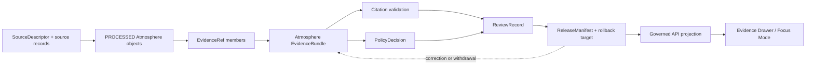

<!-- [KFM_META_BLOCK_V2]
doc_id: kfm://doc/data-proofs-evidence-bundle-atmosphere-readme
title: data/proofs/evidence_bundle/atmosphere/ — Atmosphere EvidenceBundle Proof Support
version: v0.2.0
type: directory-readme
subtype: atmosphere-evidence-bundle-proof-lane
status: repository-grounded draft; concrete bundle inventory, resolver integrity, validator execution, fixtures, CI, access controls, release linkage, and runtime behavior remain bounded
owners:
  - "NEEDS VERIFICATION — Atmosphere domain steward"
  - "NEEDS VERIFICATION — Evidence, EvidenceBundle, and proof steward"
  - "NEEDS VERIFICATION — source-role, rights, sensitivity, policy, and citation-validation reviewers"
  - "NEEDS VERIFICATION — release, correction, rollback, Evidence Drawer, governed-AI, and docs stewards"
created: NEEDS VERIFICATION — blank placeholder existed before v0.1 expansion
updated: 2026-07-25
policy_label: public-doc; proof-support; evidence-bundle; atmosphere; claim-scope-closure; cite-or-abstain; release-gated; no-direct-public-path
path: data/proofs/evidence_bundle/atmosphere/README.md
truth_posture: >
  CONFIRMED exact target path, prior blob, Directory Rules proof placement, modernized parent
  EvidenceBundle lane, modernized Atmosphere proof lane, fielded EvidenceBundle semantic contract and
  schema, Atmosphere source-role boundaries, and cite-or-abstain posture / PROPOSED Atmosphere-specific
  claim packet, bundle routing, closure checks, invalidation propagation, and downstream handoff profile /
  UNKNOWN recursive bundle inventory, writers, consumers, generated indexes, access controls, public
  routes, caches, hosting, release instances, and runtime behavior / NEEDS VERIFICATION accountable
  owners, concrete resolver behavior, fixture coverage, validator execution, CI enforcement, policy and
  release integration, correction propagation, withdrawal behavior, and rollback drills
evidence_snapshot:
  repository: bartytime4life/Kansas-Frontier-Matrix
  base_ref: main
  base_commit: bf17df8191e176e39e6a4bf564913432a29c2f93
  prior_blob: 026f92fb952e93d78725aca766759851dca315ce
  directory_rules_blob: 2affb080e6f0043867c64c7f06c1ca52030fbd55
  evidence_bundle_parent_blob: bf304383b725db95e0f8902f0c7c59d0a3cd0ee3
  atmosphere_proof_parent_blob: c85bea4e5524b934eef66fa7d8bc65f7036d0726
  evidence_bundle_contract_blob: 731c348832add23cddd14e796aa56ce2b9268259
  evidence_bundle_schema_blob: cf5256831b63dca46a5f68b168441adcf68b8751
related:
  - ../README.md
  - ../../README.md
  - ../../atmosphere/README.md
  - ../../atmosphere/pm25_2026/README.md
  - ../../citation_validation/README.md
  - ../../citation_validation/atmosphere/README.md
  - ../../../processed/atmosphere/README.md
  - ../../../catalog/domain/atmosphere/README.md
  - ../../../receipts/README.md
  - ../../../registry/sources/atmosphere/README.md
  - ../../../published/README.md
  - ../../../triplets/README.md
  - ../../../../contracts/evidence/evidence_bundle.md
  - ../../../../contracts/evidence/evidence_ref.md
  - ../../../../contracts/evidence/citation_validation_report.md
  - ../../../../contracts/domains/atmosphere/README.md
  - ../../../../schemas/contracts/v1/evidence/evidence_bundle.schema.json
  - ../../../../schemas/contracts/v1/evidence/evidence_ref.schema.json
  - ../../../../policy/evidence/
  - ../../../../policy/domains/atmosphere/README.md
  - ../../../../release/candidates/atmosphere/README.md
  - ../../../../release/README.md
notes:
  - "Same-path Markdown modernization only; no EvidenceBundle instances, Atmosphere source bytes, contract, schema, policy, validator, workflow, proof generation, release, route, hosting, or publication state changed."
  - "EvidenceBundle is a claim-scope closure artifact. It is not an EvidenceRef, PolicyDecision, ReviewRecord, ReleaseManifest, receipt, source registry, public API response, map layer, or AI-answer authority."
  - "The parent EvidenceBundle lane and Atmosphere proof lane are now expanded repository documents; this README no longer describes either as a greenfield stub."
  - "The EvidenceBundle schema is fielded and closed at the top level, but resolver integrity, validator execution, fixture coverage, policy enforcement, CI, and runtime behavior remain NEEDS VERIFICATION."
  - "Rollback target for v0.2.0 is prior blob SHA `026f92fb952e93d78725aca766759851dca315ce`."
[/KFM_META_BLOCK_V2] -->

<a id="top"></a>

# `data/proofs/evidence_bundle/atmosphere/` — Atmosphere EvidenceBundle proof support

> **One-line purpose.** Hold or index claim-scoped Atmosphere EvidenceBundle proof artifacts that preserve evidence references, source records, citations, rights, sensitivity, transforms, checksums, source roles, caveats, correction lineage, and release dependencies without becoming public truth or release authority.

[](#status)
[](#authority-level)
[](#status)
[](#outputs)
[](#evidencebundle-authority-boundaries)
[](#validation)

> [!IMPORTANT]
> **Evidence closure is necessary but not sufficient for publication.** A structurally valid EvidenceBundle can support policy, review, and release evaluation, but it does not make an Atmosphere claim true, current, rights-cleared, policy-admitted, reviewed, released, public, regulatory, medical, or safe for emergency use.

**Path:** `data/proofs/evidence_bundle/atmosphere/README.md`  
**Owning root:** `data/`  
**Proof family:** `proofs/evidence_bundle/`  
**Domain segment:** `atmosphere/`  
**Parent proof lanes:** `data/proofs/evidence_bundle/` and `data/proofs/atmosphere/`  
**Lane role:** Atmosphere claim-scope evidence closure and proof indexing  
**Direct public access:** denied  
**Last reviewed:** 2026-07-25

**Quick navigation:** [Purpose](#purpose) · [Authority level](#authority-level) · [Status](#status) · [What belongs here](#what-belongs-here) · [What does NOT belong here](#what-does-not-belong-here) · [Inputs](#inputs) · [Outputs](#outputs) · [Validation](#validation) · [Review burden](#review-burden) · [Related folders](#related-folders) · [ADRs](#adrs) · [Last reviewed](#last-reviewed) · [Bundle packet](#atmosphere-evidencebundle-packet) · [Authority boundaries](#evidencebundle-authority-boundaries) · [Role closure](#source-role-caveat-and-claim-scope-closure) · [Lifecycle](#lifecycle-and-governed-handoff) · [Correction](#correction-withdrawal-and-rollback) · [Verification](#open-verification-register) · [No-loss](#no-loss-ledger)

---

## Purpose

This directory is the Atmosphere domain's specialized **EvidenceBundle proof-support lane**. It may hold governed EvidenceBundle instances, generated indexes, resolution maps, claim-to-bundle maps, or digest-closure manifests when those artifacts conform to an accepted profile and remain inside the proof responsibility.

The lane exists to preserve the answer to eight questions before a claim can advance:

1. What exact Atmosphere claim scope is being supported?
2. Which EvidenceRefs and reconstructable source records are members of the bundle?
3. Which source roles and knowledge characters apply to each member?
4. Which citations, rights, sensitivity labels, transforms, checksums, and spec identity close the bundle?
5. Which variable, pollutant, units, averaging window, method, geography, station/grid context, and time semantics apply?
6. Which QA, calibration, uncertainty, freshness, caveats, corrections, and limitations qualify the support?
7. Which policy, review, release, correction, withdrawal, invalidation, and rollback dependencies remain outside the bundle?
8. Should a downstream resolver produce `ANSWER`, `ABSTAIN`, `DENY`, `HOLD`, `RESTRICT`, or `ERROR`?

It is not a source store, processed-data store, receipt store, source registry, policy engine, release authority, public AQI service, public API, map/tile source, medical service, emergency-alert service, regulatory-determination surface, or AI-answer authority.

## Authority level

**Canonical child of the PROOFS responsibility, specialized by proof family and domain.** Directory Rules place proof artifacts under `data/proofs/`; the existing path follows that responsibility and domain segmentation.

Its authority is deliberately limited:

- it may hold or index materialized Atmosphere EvidenceBundle proof artifacts under an accepted profile;
- it does not define EvidenceBundle meaning—that remains in `contracts/evidence/evidence_bundle.md`;
- it does not define machine shape—that remains in the EvidenceBundle schema;
- it does not define source identity, rights, role, or activation;
- it does not decide policy, review, release, correction, withdrawal, or rollback state;
- it does not replace Atmosphere domain proof packets, citation-validation reports, receipts, catalog records, triplets, or published carriers;
- it does not authorize public clients to read proof files or canonical evidence stores directly.

## Status

| Surface | Status | Evidence-bounded interpretation |
|---|---|---|
| This README and path | **CONFIRMED** | The file exists at the pinned base and is updated in place. |
| Parent EvidenceBundle proof lane | **CONFIRMED repository document / draft** | The parent now defines cross-domain EvidenceBundle proof responsibilities and indexes Atmosphere and Flora children. |
| Atmosphere domain proof lane | **CONFIRMED repository document / draft** | Defines domain proof support, source-role boundaries, finite outcomes, and no-direct-public-path posture. |
| EvidenceBundle semantic contract | **CONFIRMED repository document / draft** | Defines EvidenceBundle as claim-scope closure and separates it from EvidenceRef, policy, release, receipts, public APIs, and AI authority. |
| EvidenceBundle machine schema | **CONFIRMED fielded schema / PROPOSED status** | Requires `bundle_id`, `claim_scope`, `evidence_refs`, `source_records`, `citations`, `rights`, `sensitivity`, `transforms`, `checksums`, and `spec_hash`; root `additionalProperties` is false. |
| Concrete Atmosphere bundle inventory | **UNKNOWN** | This documentation task did not inspect or expose recursive EvidenceBundle payloads. |
| Resolver integrity and cross-record closure | **NEEDS VERIFICATION** | Schema validation alone does not prove EvidenceRefs, source records, citations, policies, releases, or corrections resolve. |
| Validator execution, fixtures, policy enforcement, and CI | **NEEDS VERIFICATION** | Paths are documented, but current execution and coverage were not proven. |
| Access controls, release instances, public routes, hosting, caches, and runtime behavior | **UNKNOWN / held** | Presence in this directory creates none of these states. |

<a id="accepted-contents"></a>

## What belongs here

Good fits are Atmosphere EvidenceBundle proof artifacts whose claim scope, members, roles, rights, sensitivity, transforms, integrity, and correction lineage remain inspectable, including:

- field-valid EvidenceBundle instances for explicit Atmosphere claim scopes;
- EvidenceRef-to-bundle resolution indexes that preserve unresolved and denied states;
- claim-to-bundle maps for catalog records, triplets, release candidates, Evidence Drawer projections, and governed answer fixtures;
- digest-closure manifests linking admitted source records, processed artifacts, catalog/triplet projections, receipts, proof packets, and release dependencies;
- bundle member indexes for AirObservation, AirStation, PM25Observation, OzoneObservation, AODRaster, SmokeContext, WeatherObservation, WeatherStation, WindField, PrecipitationObservation, TemperatureObservation, ClimateNormal, ClimateAnomaly, ForecastContext, and AdvisoryContext claims;
- source-role, rights, sensitivity, freshness, QA, caveat, correction, supersession, withdrawal, and limitation summaries derived from governed member records;
- finite negative-state support explaining why claim-grade evidence closure is absent, stale, conflicted, restricted, unreleased, role-collapsed, caveat-missing, or rights-unclear;
- lane-local README, inventory, migration, compatibility, or non-release manifest notes that explain proof identity without becoming authority records.

<a id="exclusions"></a>

## What does NOT belong here

Do not place these in `data/proofs/evidence_bundle/atmosphere/`:

- RAW feeds, source-native files, station payloads, model files, logs, screenshots, or source captures;
- WORK parsing, QA experiments, calibration, joins, model comparisons, redaction trials, notebooks, or scratch outputs;
- QUARANTINE material with unresolved rights, source role, sensitivity, freshness, caveats, evidence, or release posture;
- canonical processed Atmosphere values, catalog records, triplets, published payloads, map layers, tiles, or downloads;
- SourceDescriptor, source-activation, receipt, PolicyDecision, ReviewRecord, ReleaseManifest, CorrectionNotice, WithdrawalNotice, RollbackCard, AIReceipt, signature, or access-log authority records;
- contracts, schemas, policy bundles, validators, tests, fixtures, pipelines, packages, application code, API code, UI code, or styles;
- public AQI or concentration services, public Evidence Drawer payloads, Focus Mode answers, model prose, advisories, health or exposure guidance, emergency instructions, regulatory conclusions, or life-safety content;
- duplicated canonical EvidenceBundle authority if an accepted ADR assigns a different materialized proof home;
- private access data, secrets, restricted source terms, calibration details that enable misuse, protected station precision, transform secrets, or details that could defeat public-safe controls.

## Inputs

An Atmosphere EvidenceBundle packet may reference only governed records and must preserve unresolved states instead of fabricating closure.

As applicable, inputs include:

- stable claim identity and bounded `claim_scope`;
- one or more EvidenceRefs and reconstructable `source_records`;
- publication-ready citations;
- rights/license and sensitivity posture;
- ordered transforms and checksums;
- deterministic `spec_hash`;
- object family, immutable source role, pollutant/variable, units, averaging/reporting window, method, geography, station/grid context, precision posture, and temporal scope;
- QA, calibration, correction, provisional/final state, uncertainty, confidence, freshness, caveats, and limitations;
- pointers to receipts, policy decisions, review records, catalog/triplet records, release records, correction notices, withdrawals, invalidation records, and rollback targets.

Pointers do not transfer authority into this lane.

## Outputs

Outputs are claim-scoped proof artifacts or indexes for:

- resolver and release preflight;
- citation-validation proof;
- Evidence Drawer and governed API projections;
- Focus Mode or governed-AI eligibility checks;
- correction, withdrawal, invalidation, supersession, and rollback analysis;
- proof inventory, reconciliation, and migration review.

Outputs are not public response bodies. A downstream public carrier requires policy-safe projection, accepted review and release state, correction support, rollback support, and access controls.

When closure is insufficient, the output must preserve a finite negative posture instead of presenting an unsupported claim.

## Validation

Validate only within the declared profile, and distinguish structural validation from cross-record closure.

| Check | Minimum expectation | Safe failure |
|---|---|---|
| Placement and identity | Correct proof/domain path, stable ID, version, digest, duplicate posture. | `ERROR` / `HOLD` |
| Schema shape | Required EvidenceBundle fields, field constraints, no undeclared top-level fields. | `DENY` |
| EvidenceRef resolution | Every referenced item resolves or carries an explicit unresolved/denied state. | `ABSTAIN` / `DENY` |
| Claim scope | Object, variable, geography, time, method, role, and allowed claim remain bounded. | `ABSTAIN` |
| Source records and citations | Reconstructable source handles and publication-ready citations exist. | `ABSTAIN` |
| Rights and sensitivity | Effective rights and sensitivity labels support requested exposure. | `DENY` / `RESTRICT` |
| Transforms and integrity | Ordered transforms, checksums, and spec identity are reviewable and consistent. | `DENY` / `ERROR` |
| Source-role preservation | Observation, AQI/report, low-cost, regulatory, proxy, model, forecast, climate, and advisory roles remain distinct. | `DENY` |
| QA and freshness | Calibration, quality, caveats, missingness, uncertainty, provisional/final state, freshness, and expiry remain visible. | `HOLD` / `ABSTAIN` |
| External dependencies | Receipts, policy, review, catalog/triplet, release, correction, withdrawal, invalidation, and rollback pointers resolve as required. | `HOLD` / `DENY` |
| Public boundary | Public clients receive governed projections, never direct proof-file or canonical-store access. | `DENY` |

A passing schema check proves only machine shape. It does not prove source correctness, evidence sufficiency, citation support, rights clearance, policy permission, review approval, release state, public safety, or current runtime behavior.

## Review burden

Accountable ownership remains **NEEDS VERIFICATION**.

Changes should receive review proportionate to claim significance and exposure from:

- Atmosphere and relevant air-quality, weather, climate, smoke, or model stewards;
- Evidence, EvidenceBundle, proof, and citation-validation stewards;
- source-role, data-quality, rights, and sensitivity reviewers;
- policy and release reviewers;
- correction, withdrawal, rollback, Evidence Drawer, governed-AI, and docs reviewers where affected.

Independent review is warranted for source-role changes, rights or sensitivity transforms, protected station precision, low-cost sensor claims, regulatory/archive claims, model/proxy interpretation, health/exposure implications, public serving, proof-profile changes, migrations, corrections, withdrawals, and rollback.

CODEOWNERS routing, a successful validator, a pull request, or a merge is not approval or release evidence.

## Related folders

| Responsibility | Verified or bounded home | Relationship |
|---|---|---|
| Parent EvidenceBundle lane | [`../README.md`](../README.md) | Cross-domain EvidenceBundle proof-family contract. |
| Atmosphere proof parent | [`../../atmosphere/README.md`](../../atmosphere/README.md) | Domain proof boundary and source-role contract. |
| Atmosphere citation validation | [`../../citation_validation/atmosphere/README.md`](../../citation_validation/atmosphere/README.md) | Citation support checks; not bundle authority. |
| Processed Atmosphere | [`../../../processed/atmosphere/README.md`](../../../processed/atmosphere/README.md) | Canonical processed candidates, not proof storage. |
| Atmosphere catalog | [`../../../catalog/domain/atmosphere/README.md`](../../../catalog/domain/atmosphere/README.md) | Discovery/provenance records that may cite bundle support. |
| Receipts | [`../../../receipts/README.md`](../../../receipts/README.md) | Process and review memory referenced by bundles. |
| Source registry | [`../../../registry/sources/atmosphere/README.md`](../../../registry/sources/atmosphere/README.md) | Source identity, role, rights, and activation authority. |
| EvidenceBundle contract | [`../../../../contracts/evidence/evidence_bundle.md`](../../../../contracts/evidence/evidence_bundle.md) | Claim-scope closure meaning. |
| EvidenceBundle schema | [`../../../../schemas/contracts/v1/evidence/evidence_bundle.schema.json`](../../../../schemas/contracts/v1/evidence/evidence_bundle.schema.json) | Fielded machine shape. |
| Evidence policy | [`../../../../policy/evidence/`](../../../../policy/evidence/) | Evidence admissibility and exposure policy; behavior needs verification. |
| Atmosphere policy | [`../../../../policy/domains/atmosphere/README.md`](../../../../policy/domains/atmosphere/README.md) | Domain anti-collapse, freshness, rights, and safety posture. |
| Release | [`../../../../release/candidates/atmosphere/README.md`](../../../../release/candidates/atmosphere/README.md), [`../../../../release/README.md`](../../../../release/README.md) | Promotion, release, correction, withdrawal, and rollback authority. |

## ADRs

- Directory Rules require proof artifacts to remain under the proof responsibility and domain lanes to remain segments inside responsibility roots.
- Changing the canonical materialized EvidenceBundle home, creating a parallel proof home, or allowing direct public reads requires an accepted ADR, migration and compatibility plan, validation plan, access-control review, correction plan, and rollback target.
- No Atmosphere EvidenceBundle-specific accepted ADR was verified.
- **NEEDS VERIFICATION:** whether this lane stores canonical bundle instances, generated domain indexes, or both under an accepted profile.

## Last reviewed

- **Date:** 2026-07-25
- **Evidence basis:** exact target README, Directory Rules, parent EvidenceBundle README, Atmosphere proof README, EvidenceBundle semantic contract, and fielded EvidenceBundle schema
- **Recursive payload and runtime inspection:** not performed
- **Owners, resolver integrity, validator execution, fixtures, CI, policy enforcement, access controls, releases, public consumers, and operational rollback:** need verification

Re-review on contract/schema changes, source-role vocabulary changes, rights or sensitivity changes, new writers or consumers, resolver changes, release integration, public serving, correction, withdrawal, invalidation, or rollback changes—or within six months.

---

## Atmosphere EvidenceBundle packet

A structurally valid packet follows the current EvidenceBundle schema and adds domain interpretation through governed member records rather than undeclared top-level fields.

| Required schema field | Atmosphere interpretation |
|---|---|
| `bundle_id` | Stable bundle identity for one bounded claim scope. |
| `claim_scope` | Exact supported claim, including object/variable, geography, time, role, method, and limitations. |
| `evidence_refs` | Non-empty governed EvidenceRef members. |
| `source_records` | Non-empty reconstructable source handles. |
| `citations` | Non-empty publication-ready citations. |
| `rights` | Effective license/rights summary required by schema. |
| `sensitivity` | Exposure constraint through the shared sensitivity-label schema. |
| `transforms` | Ordered source-to-derived transformations, including correction or public-safe transforms where applicable. |
| `checksums` | At least one SHA-256 digest protecting critical inputs or outputs. |
| `spec_hash` | Deterministic governing contract/schema identity. |

Because the schema disallows undeclared top-level fields, Atmosphere-specific variable, role, QA, time, station, and caveat details must remain reconstructable through the referenced records and accepted shared contracts rather than being improvised into incompatible bundle shapes.

## EvidenceBundle authority boundaries

- **EvidenceRef is a pointer; EvidenceBundle is claim-scope closure.** Neither alone is policy permission or release approval.
- **EvidenceBundle does not own member records.** Sources, processed objects, receipts, policy decisions, reviews, releases, corrections, withdrawals, and rollback cards remain in their responsibility roots.
- **Schema validity is not evidence sufficiency.** Cross-record resolution and claim fitness remain separate checks.
- **Proof existence is not publication.** Public use still requires policy, review, release, correction, rollback, and governed projection.
- **Generated language is downstream.** AI and summaries may interpret eligible released bundles but cannot become evidence.
- **Public clients do not read this directory.** Evidence Drawer and Focus Mode consume governed, release-aware projections.

## Source-role, caveat, and claim-scope closure

| Evidence role or family | Closure requirement | Forbidden collapse |
|---|---|---|
| Observed sensor | Source, station/network, variable, units, averaging/support, observation time, method, QA, uncertainty, and evidence. | Model, proxy, AQI/report, advisory, exposure, or impact proof. |
| Public AQI/report | Issuing authority, pollutant, reporting period, category/index method, source time, caveats, and citation. | Raw concentration without separately supported observation evidence. |
| Low-cost sensor | Sensor/network, correction/calibration, confidence, limitations, collocation/comparison context where available, rights, policy, and review. | Reference-grade or regulatory observation by promotion. |
| Regulatory/archive | Issuing/maintaining authority, vintage, role, jurisdiction/scope, method, status vocabulary, caveats, and legal-use limits. | Independent KFM compliance, exceedance, enforcement, or legal conclusion. |
| AOD/smoke proxy | Proxy/mask/product identity, geometry/raster semantics, method, uncertainty, valid time, and source role. | PM2.5, ozone, ground observation, exposure, or event/impact proof. |
| Model/forecast/reanalysis | Model/product/run identity, initialization, valid time, horizon, method/version, uncertainty, stale/superseded state, and model role. | Observed sensor truth. |
| Weather/climate context | Variable, units, station/grid or baseline support, averaging/aggregation, time, method, uncertainty, and context-versus-primary role. | Hazard, impact, exposure, climate attribution, or trend proof by itself. |
| Advisory context | Official issuer, advisory identity, effective/expiry times, status, citation, and referral posture. | KFM-issued emergency or life-safety instruction. |

One bundle may support multiple related claims only when `claim_scope` and referenced evidence make the allowed scope unambiguous. Otherwise, split the closure into separate bundles.

## Lifecycle and governed handoff

```text
SourceDescriptor + source records
  -> RAW / WORK / QUARANTINE
  -> PROCESSED Atmosphere objects
  -> EvidenceRef members
  -> Atmosphere EvidenceBundle claim-scope closure
  -> citation validation + policy + review
  -> catalog/triplet and release preflight
  -> ReleaseManifest + rollback target
  -> governed API / Evidence Drawer / Focus Mode projection
```



The arrows show dependencies, not automatic promotion. A commit, merge, valid schema, complete-looking bundle, catalog link, or UI projection does not create publication state.

## Correction, withdrawal, and rollback

A bundle may need correction or invalidation after source revision, citation failure, member withdrawal, role misclassification, unit or time error, QA revision, rights change, sensitivity reclassification, transform defect, checksum mismatch, policy change, release correction, or public-carrier defect.

Correction handling should:

1. preserve the prior bundle, member records, and release references by immutable identity;
2. create a successor, correction, or invalidation record rather than silently rewriting history;
3. identify the affected claim scopes and reason codes;
4. re-run EvidenceRef resolution, citations, rights, sensitivity, transforms, checksums, policy, and release dependency checks;
5. propagate holds, withdrawals, or supersession to catalog records, triplets, releases, APIs, maps, exports, Evidence Drawer payloads, Focus Mode responses, caches, and search indexes where applicable;
6. retain a correction path and rollback target appropriate to every released carrier.

**Documentation rollback:** before merge, close the draft PR and abandon the branch. After merge, revert the implementation commit. The prior README blob is `026f92fb952e93d78725aca766759851dca315ce`.

**Operational rollback:** reverting this README does not restore prior bundles, releases, API payloads, maps, or caches. Operational rollback requires actual bundle/release identities, policy and review state, correction lineage, invalidation targets, and cache/index refresh evidence.

## Open verification register

| Item | Status | Required evidence |
|---|---|---|
| Recursive Atmosphere bundle inventory | **UNKNOWN** | Tree, hashes, profiles, payload classifications, and generated-artifact inventory. |
| Canonical instance versus index role | **NEEDS VERIFICATION** | ADR or accepted profile clarifying whether this lane stores bundle instances, indexes, or both. |
| EvidenceRef resolver integrity | **NEEDS VERIFICATION** | Deterministic resolver tests covering missing, denied, stale, conflicted, and withdrawn references. |
| Schema validator execution | **NEEDS VERIFICATION** | Trusted run of `tools/validators/validate_evidence_bundle.py` and current wiring. |
| Fixture coverage | **NEEDS VERIFICATION** | Valid, invalid, role-collapse, rights, sensitivity, citation, checksum, stale, and withdrawal fixtures. |
| Atmosphere proof profiles | **NEEDS VERIFICATION** | Accepted claim families, required member contracts, and role-specific closure rules. |
| Policy and release integration | **NEEDS VERIFICATION** | Policy evaluations, ReviewRecords, release manifests, correction and rollback records. |
| Access controls and public projections | **UNKNOWN / held** | Governed API implementation, authorization tests, public-safe projection schema, and no-direct-read proof. |
| Correction propagation | **NEEDS VERIFICATION** | Tested invalidation, withdrawal, reindexing, cache refresh, and public-carrier rollback drill. |
| Writers, consumers, and runtime behavior | **UNKNOWN** | Producer/consumer inventory, route tests, logs, metrics, and operational ownership. |

## No-loss ledger

| Baseline element | Disposition | Result |
|---|---|---|
| Stable `doc_id`, path, and blank-placeholder lineage | **KEEP** | Preserved in the meta block and same-path update. |
| EvidenceBundle/EvidenceRef closure purpose | **ENRICH** | Retained and aligned to the fielded contract and schema. |
| Atmosphere source-role and caveat boundaries | **ENRICH** | Preserved across an explicit role-closure matrix. |
| No public, medical, regulatory, emergency, or life-safety authority | **KEEP / STRENGTHEN** | Preserved across scope, exclusions, validation, and authority sections. |
| Parent EvidenceBundle lane described as greenfield stub | **CORRECT** | Replaced with current repository evidence that the parent is expanded. |
| EvidenceBundle schema described as unverified | **CORRECT** | Replaced with verified fielded-schema facts while runtime enforcement remains bounded. |
| Speculative child-directory tree | **REMOVE WITH EVIDENCE** | Removed because recursive inventory and accepted local structure remain unverified. |
| Direct-looking lifecycle arrows | **CLARIFY** | Replaced with governed dependencies and explicit non-automatic promotion language. |
| Validation checklist | **REORGANIZE** | Converted into a validation matrix plus open verification register. |
| Rollback posture | **CLARIFY** | Documentation rollback is separated from operational proof/release rollback. |

<p align="right"><a href="#top">Back to top</a></p>
